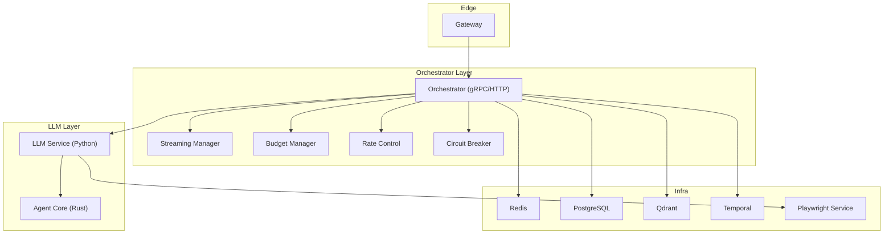
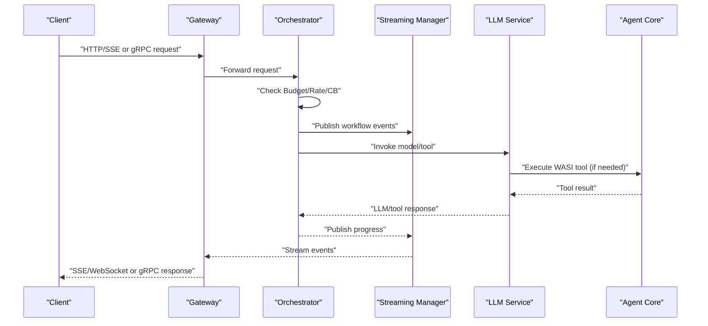
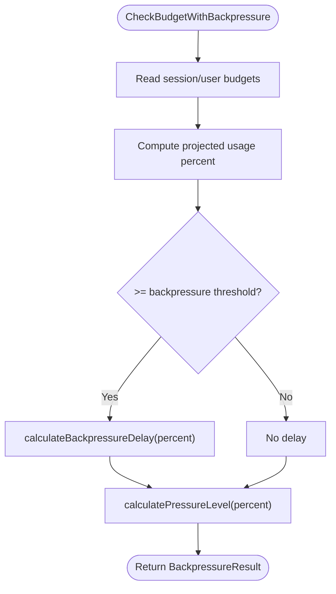
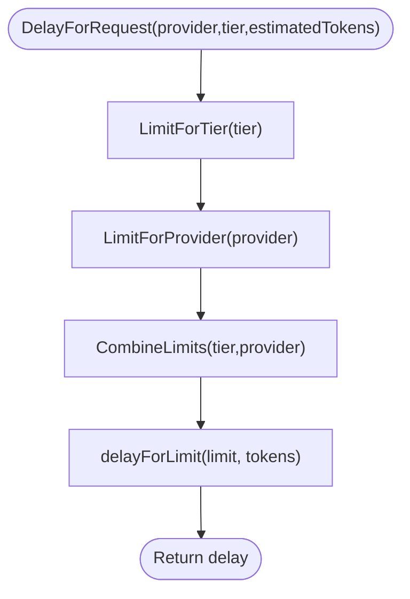
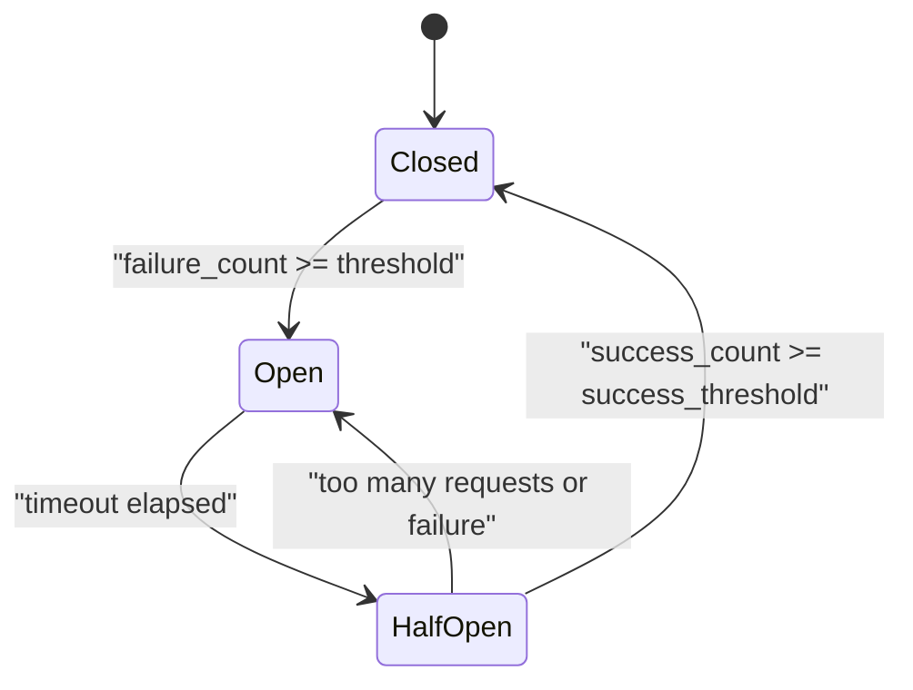
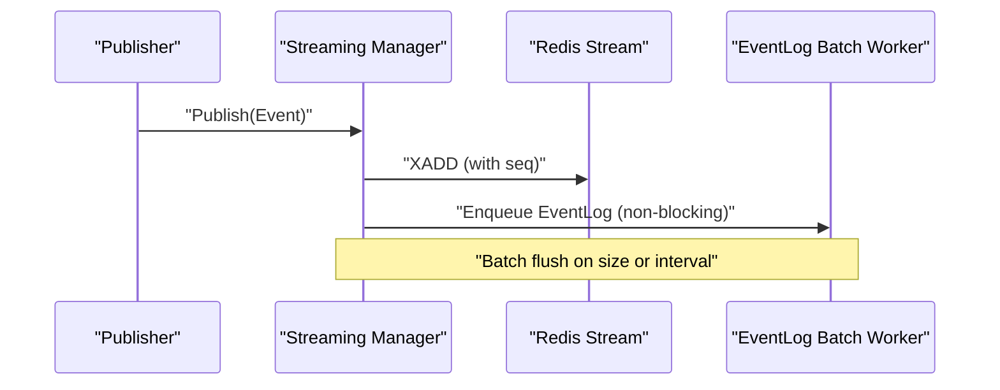
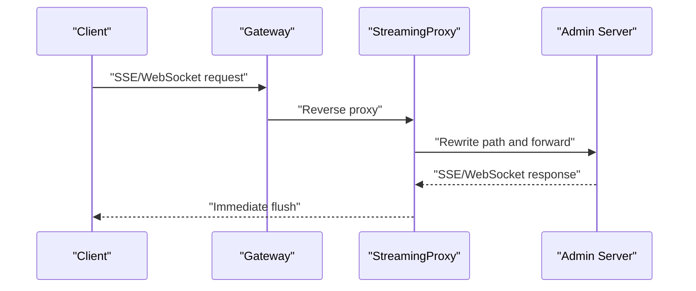
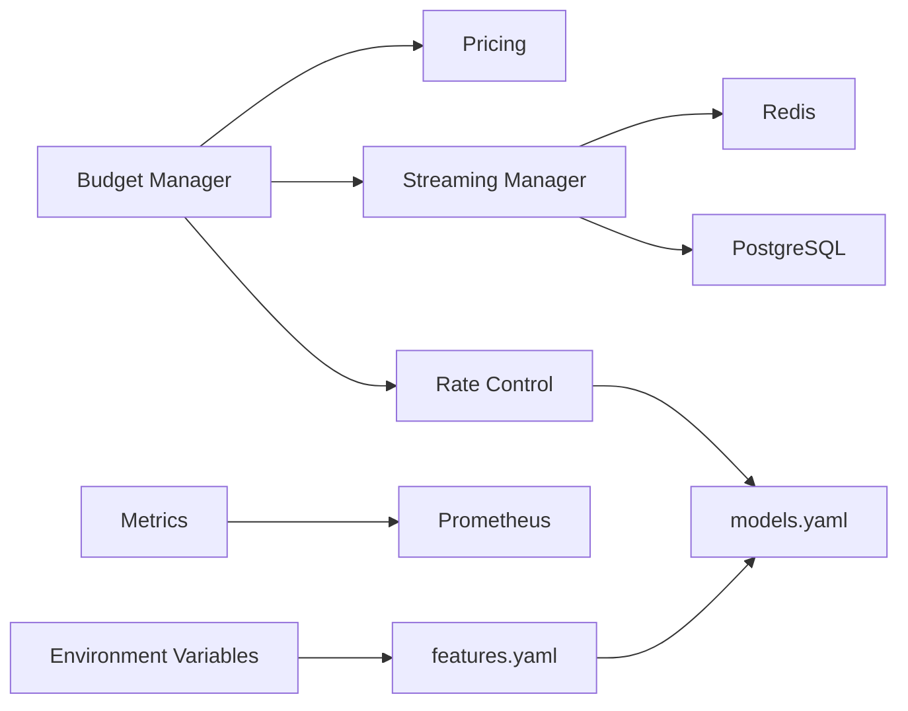

# System-Level Tuning

<cite>
**Referenced Files in This Document**
- [manager.go](file://go/orchestrator/internal/budget/manager.go)
- [ratecontrol.go](file://go/orchestrator/internal/ratecontrol/ratecontrol.go)
- [circuit_breaker.go](file://go/orchestrator/internal/circuitbreaker/circuit_breaker.go)
- [metrics.go](file://go/orchestrator/internal/metrics/metrics.go)
- [manager.go](file://go/orchestrator/internal/streaming/manager.go)
- [streaming.go](file://go/orchestrator/cmd/gateway/internal/proxy/streaming.go)
- [config.go](file://go/orchestrator/internal/config/config.go)
- [shannon.yaml](file://config/shannon.yaml)
- [docker-compose.yml](file://deploy/compose/docker-compose.yml)
- [Dockerfile](file://go/orchestrator/Dockerfile)
- [Dockerfile](file://python/llm-service/Dockerfile)
</cite>

## Table of Contents
1. [Introduction](#introduction)
2. [Project Structure](#project-structure)
3. [Core Components](#core-components)
4. [Architecture Overview](#architecture-overview)
5. [Detailed Component Analysis](#detailed-component-analysis)
6. [Dependency Analysis](#dependency-analysis)
7. [Performance Considerations](#performance-considerations)
8. [Troubleshooting Guide](#troubleshooting-guide)
9. [Conclusion](#conclusion)
10. [Appendices](#appendices)

## Introduction
This document provides system-level performance tuning guidance for Shannon’s distributed architecture. It focuses on CPU and I/O optimization, thread pool sizing, async processing patterns, resource allocation strategies, rate control and budget management, circuit breaker resilience, network optimization (gRPC, streaming), monitoring and metrics, capacity planning, container orchestration, and distributed tracing. The goal is to help operators configure and operate Shannon efficiently at scale while maintaining reliability and cost control.

## Project Structure
Shannon is a Go-based orchestrator with supporting services:
- Orchestrator service (gRPC + HTTP/SSE) with streaming, budgeting, rate control, and circuit breakers
- LLM service (Python) providing model APIs and tools
- Agent Core (Rust) for WASI sandboxed tool execution
- Supporting systems: Redis, PostgreSQL, Qdrant, Temporal, Playwright service, Gateway
- Deployment via Docker Compose with Grafana/Prometheus monitoring

**Diagram sources**
- [docker-compose.yml](file://deploy/compose/docker-compose.yml#L14-L411)
- [manager.go](file://go/orchestrator/internal/streaming/manager.go#L47-L60)
- [manager.go](file://go/orchestrator/internal/budget/manager.go#L72-L110)
- [ratecontrol.go](file://go/orchestrator/internal/ratecontrol/ratecontrol.go#L15-L28)
- [circuit_breaker.go](file://go/orchestrator/internal/circuitbreaker/circuit_breaker.go#L39-L47)

**Section sources**
- [docker-compose.yml](file://deploy/compose/docker-compose.yml#L14-L411)

## Core Components
- Budget Manager: Enforces token and cost budgets, supports backpressure and circuit breakers, and tracks usage for cost optimization.
- Rate Control: Loads provider and tier limits from configuration and computes delays to respect provider SLAs.
- Circuit Breaker: Implements tri-state failure detection with configurable thresholds and timeouts.
- Streaming Manager: Manages Redis-backed event streams for workflow telemetry and SSE replay.
- Metrics: Exposes Prometheus metrics for workflows, tasks, agents, memory, gRPC, caches, and more.
- Configuration: Resolves runtime knobs from YAML and environment variables, including budget/backpressure and rate-limiting controls.

**Section sources**
- [manager.go](file://go/orchestrator/internal/budget/manager.go#L18-L110)
- [ratecontrol.go](file://go/orchestrator/internal/ratecontrol/ratecontrol.go#L15-L28)
- [circuit_breaker.go](file://go/orchestrator/internal/circuitbreaker/circuit_breaker.go#L39-L47)
- [manager.go](file://go/orchestrator/internal/streaming/manager.go#L47-L60)
- [metrics.go](file://go/orchestrator/internal/metrics/metrics.go#L8-L516)
- [config.go](file://go/orchestrator/internal/config/config.go#L77-L125)

## Architecture Overview
Shannon’s runtime performance hinges on:
- Asynchronous event streaming with Redis to decouple producers/consumers
- Centralized budgeting and rate control to protect downstream providers
- Circuit breakers around critical dependencies (Redis, DB, gRPC)
- Metrics-driven observability for capacity planning and anomaly detection
- Containerized services orchestrated via Docker Compose

**Diagram sources**
- [streaming.go](file://go/orchestrator/cmd/gateway/internal/proxy/streaming.go#L12-L71)
- [manager.go](file://go/orchestrator/internal/streaming/manager.go#L364-L492)
- [manager.go](file://go/orchestrator/internal/budget/manager.go#L175-L288)
- [ratecontrol.go](file://go/orchestrator/internal/ratecontrol/ratecontrol.go#L163-L189)

## Detailed Component Analysis

### Budget Management and Backpressure
- Token and cost tracking at task/session/user scopes
- Warning thresholds and budget pressure levels
- Backpressure delay calculation mapped to usage percentiles
- Idempotency tracking to prevent double-counting retries
- Optional hard limits and approval gating

**Diagram sources**
- [manager.go](file://go/orchestrator/internal/budget/manager.go#L677-L762)

**Section sources**
- [manager.go](file://go/orchestrator/internal/budget/manager.go#L175-L288)
- [manager.go](file://go/orchestrator/internal/budget/manager.go#L677-L762)

### Rate Control and Provider SLAs
- Hierarchical rate limits from tier and provider configs
- Built-in provider caps for major vendors
- Combined limit computation and delay estimation per request
- Hot-reloadable configuration with environment overrides

**Diagram sources**
- [ratecontrol.go](file://go/orchestrator/internal/ratecontrol/ratecontrol.go#L163-L189)

**Section sources**
- [ratecontrol.go](file://go/orchestrator/internal/ratecontrol/ratecontrol.go#L15-L28)
- [ratecontrol.go](file://go/orchestrator/internal/ratecontrol/ratecontrol.go#L114-L168)
- [ratecontrol.go](file://go/orchestrator/internal/ratecontrol/ratecontrol.go#L170-L189)

### Circuit Breaker Patterns
- Tri-state state machine with configurable thresholds and timeouts
- Success/failure counters with interval-based resets
- Half-open probationary requests
- On-state-change callbacks for observability

**Diagram sources**
- [circuit_breaker.go](file://go/orchestrator/internal/circuitbreaker/circuit_breaker.go#L15-L32)
- [circuit_breaker.go](file://go/orchestrator/internal/circuitbreaker/circuit_breaker.go#L165-L207)

**Section sources**
- [circuit_breaker.go](file://go/orchestrator/internal/circuitbreaker/circuit_breaker.go#L39-L59)
- [circuit_breaker.go](file://go/orchestrator/internal/circuitbreaker/circuit_breaker.go#L165-L207)

### Streaming and Event Persistence
- Redis Streams for workflow events with sequence numbering
- Batched asynchronous persistence to PostgreSQL
- Subscriber lifecycle with cancellation and non-blocking delivery
- Payload sanitization to prevent storage bloat

**Diagram sources**
- [manager.go](file://go/orchestrator/internal/streaming/manager.go#L364-L492)
- [manager.go](file://go/orchestrator/internal/streaming/manager.go#L661-L696)

**Section sources**
- [manager.go](file://go/orchestrator/internal/streaming/manager.go#L36-L60)
- [manager.go](file://go/orchestrator/internal/streaming/manager.go#L107-L127)
- [manager.go](file://go/orchestrator/internal/streaming/manager.go#L442-L473)
- [manager.go](file://go/orchestrator/internal/streaming/manager.go#L661-L696)

### Network Optimization and Inter-Service Communication
- Gateway streaming proxy preserves SSE/WebSocket semantics and flushes immediately
- Service discovery via Docker Compose DNS (e.g., orchestrator:50052)
- Environment-controlled worker concurrency and queue partitioning

**Diagram sources**
- [streaming.go](file://go/orchestrator/cmd/gateway/internal/proxy/streaming.go#L12-L71)

**Section sources**
- [streaming.go](file://go/orchestrator/cmd/gateway/internal/proxy/streaming.go#L12-L71)
- [docker-compose.yml](file://deploy/compose/docker-compose.yml#L376-L390)

## Dependency Analysis
- Budget Manager coordinates with pricing, streaming, and rate control
- Rate Control depends on models.yaml for provider/tier limits
- Streaming Manager depends on Redis and optional PostgreSQL persistence
- Metrics are exported globally for Prometheus scraping
- Configuration resolves runtime knobs from YAML and environment variables

**Diagram sources**
- [manager.go](file://go/orchestrator/internal/budget/manager.go#L11-L16)
- [ratecontrol.go](file://go/orchestrator/internal/ratecontrol/ratecontrol.go#L41-L47)
- [manager.go](file://go/orchestrator/internal/streaming/manager.go#L47-L59)
- [metrics.go](file://go/orchestrator/internal/metrics/metrics.go#L8-L516)
- [config.go](file://go/orchestrator/internal/config/config.go#L33-L58)

**Section sources**
- [manager.go](file://go/orchestrator/internal/budget/manager.go#L11-L16)
- [ratecontrol.go](file://go/orchestrator/internal/ratecontrol/ratecontrol.go#L41-L47)
- [manager.go](file://go/orchestrator/internal/streaming/manager.go#L47-L59)
- [metrics.go](file://go/orchestrator/internal/metrics/metrics.go#L8-L516)
- [config.go](file://go/orchestrator/internal/config/config.go#L33-L58)

## Performance Considerations

### CPU and I/O Optimization
- Streaming Manager
  - Tune batch size and flush interval via environment variables to balance throughput and latency
  - Adjust ring capacity for replay to control memory footprint
- Budget Manager
  - Use backpressure thresholds and max delay to smooth spikes without dropping requests
  - Prefer soft limits with warnings for interactive workloads; hard limits for strict enforcement
- Rate Control
  - Combine tier and provider limits to compute conservative delays
  - Use environment overrides to tune per deployment without rebuilding
- Circuit Breaker
  - Calibrate failure and success thresholds to match service stability
  - Use half-open requests to probe recovery gradually

**Section sources**
- [manager.go](file://go/orchestrator/internal/streaming/manager.go#L107-L127)
- [shannon.yaml](file://config/shannon.yaml#L324-L327)
- [manager.go](file://go/orchestrator/internal/budget/manager.go#L86-L89)
- [ratecontrol.go](file://go/orchestrator/internal/ratecontrol/ratecontrol.go#L150-L168)
- [circuit_breaker.go](file://go/orchestrator/internal/circuitbreaker/circuit_breaker.go#L39-L47)

### Thread Pool Sizing and Async Patterns
- Worker concurrency is controlled via environment variables for orchestrator and agent-core
- Priority queues can be enabled to distribute load across priority levels
- Use non-blocking event publishing to avoid head-of-line blocking in streaming

**Section sources**
- [docker-compose.yml](file://deploy/compose/docker-compose.yml#L170-L193)
- [docker-compose.yml](file://deploy/compose/docker-compose.yml#L105-L114)

### Resource Allocation Strategies
- Container resources: allocate CPU/memory based on observed Prometheus metrics and saturation points
- Use health checks to ensure dependencies are ready before starting services
- Persist critical events asynchronously to reduce tail latency on hot paths

**Section sources**
- [docker-compose.yml](file://deploy/compose/docker-compose.yml#L13-L411)
- [manager.go](file://go/orchestrator/internal/streaming/manager.go#L661-L696)

### Rate Control and Budget Management
- Use provider rate control toggle to enable/disable provider-side enforcement
- Configure budget thresholds and backpressure delays to maintain SLOs
- Monitor pricing fallbacks and model tier drift to optimize cost/performance

**Section sources**
- [config.go](file://go/orchestrator/internal/config/config.go#L285-L303)
- [shannon.yaml](file://config/shannon.yaml#L23-L29)
- [metrics.go](file://go/orchestrator/internal/metrics/metrics.go#L281-L288)
- [metrics.go](file://go/orchestrator/internal/metrics/metrics.go#L468-L491)

### Circuit Breaker Patterns
- Enable circuit breakers for Redis, database, and gRPC
- Tune timeouts and thresholds to reflect service behavior and traffic patterns
- Observe state changes for proactive remediation

**Section sources**
- [shannon.yaml](file://config/shannon.yaml#L30-L52)
- [circuit_breaker.go](file://go/orchestrator/internal/circuitbreaker/circuit_breaker.go#L39-L59)

### Network Optimization
- Use Gateway streaming proxy to preserve SSE semantics and immediate flushing
- Ensure proper headers for SSE and WebSocket upgrades
- Consider connection pooling and keep-alive at the gateway for reduced handshake overhead

**Section sources**
- [streaming.go](file://go/orchestrator/cmd/gateway/internal/proxy/streaming.go#L54-L71)

### Monitoring, Metrics, and Capacity Planning
- Scrape Prometheus metrics exposed by orchestrator and agent-core
- Track workflow durations, task tokens, agent execution times, and gRPC latencies
- Use memory and vector search metrics to size caches and indices
- Derive capacity planning from rate metrics and latency histograms

**Section sources**
- [metrics.go](file://go/orchestrator/internal/metrics/metrics.go#L8-L516)
- [docker-compose.yml](file://deploy/compose/docker-compose.yml#L104-L114)
- [docker-compose.yml](file://deploy/compose/docker-compose.yml#L312-L315)

### Container Orchestration and Auto-Scaling
- Use Docker Compose for local/dev; adapt service resource limits and restart policies
- Scale horizontally by increasing worker concurrency and enabling priority queues
- Use health checks to gate readiness and liveness

**Section sources**
- [docker-compose.yml](file://deploy/compose/docker-compose.yml#L14-L411)
- [Dockerfile](file://go/orchestrator/Dockerfile#L1-L39)
- [Dockerfile](file://python/llm-service/Dockerfile#L1-L39)

### Distributed Tracing
- Enable tracing for development/staging to analyze cross-service latency
- Use OTLP exporter endpoints configured in environment variables

**Section sources**
- [shannon.yaml](file://config/shannon.yaml#L319-L323)
- [docker-compose.yml](file://deploy/compose/docker-compose.yml#L313-L315)

## Troubleshooting Guide
- Streaming drops critical events
  - Inspect logs for “dropped important event” warnings and adjust subscriber buffer sizes or consumer speed
- Budget exceeded frequently
  - Review warning thresholds and backpressure delays; consider raising budgets or enabling approvals
- Provider throttling
  - Verify provider rate control is enabled and combined limits are appropriate
- Circuit breaker stuck open
  - Check failure/success thresholds and reset timeouts; confirm dependency health
- Slow vector search or memory fetches
  - Monitor latency histograms and hit rates; adjust Top-K and MMR settings

**Section sources**
- [manager.go](file://go/orchestrator/internal/streaming/manager.go#L306-L317)
- [manager.go](file://go/orchestrator/internal/budget/manager.go#L259-L275)
- [ratecontrol.go](file://go/orchestrator/internal/ratecontrol/ratecontrol.go#L150-L168)
- [circuit_breaker.go](file://go/orchestrator/internal/circuitbreaker/circuit_breaker.go#L165-L207)
- [metrics.go](file://go/orchestrator/internal/metrics/metrics.go#L263-L279)

## Conclusion
Shannon’s performance depends on balanced budgeting, rate control, and circuit breakers; efficient streaming and persistence; and robust observability. By tuning worker concurrency, backpressure thresholds, provider limits, and streaming parameters—and by leveraging Prometheus metrics and tracing—you can achieve predictable latency, cost control, and resilience at scale.

## Appendices

### Practical Examples

- System Monitoring
  - Expose metrics on dedicated ports and scrape via Prometheus
  - Track key metrics: workflow durations, task tokens, agent execution times, gRPC latencies, cache hits/misses, vector search latency
- Performance Metrics Collection
  - Use Prometheus histograms and counters to monitor latency and throughput
  - Export metrics from orchestrator and agent-core containers
- Capacity Planning Calculations
  - Estimate peak RPS per service and required worker concurrency
  - Factor in streaming batch sizes and Redis ring capacity
  - Size Redis/Qdrant/PostgreSQL according to retention and query patterns

**Section sources**
- [metrics.go](file://go/orchestrator/internal/metrics/metrics.go#L8-L516)
- [docker-compose.yml](file://deploy/compose/docker-compose.yml#L104-L114)
- [docker-compose.yml](file://deploy/compose/docker-compose.yml#L166-L167)
- [shannon.yaml](file://config/shannon.yaml#L324-L327)