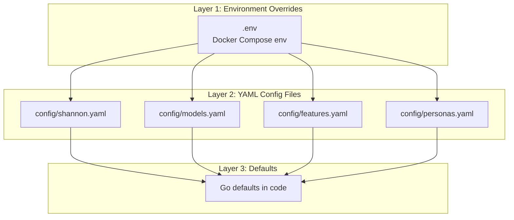
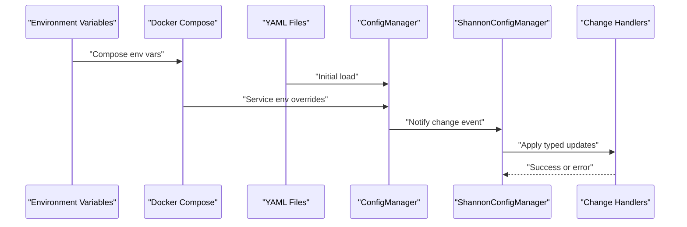
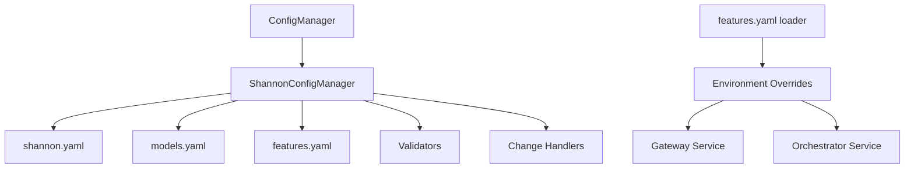

# Configuration Management

<cite>
**Referenced Files in This Document**
- [config/README.md](file://config/README.md)
- [config/shannon.yaml](file://config/shannon.yaml)
- [config/models.yaml](file://config/models.yaml)
- [config/features.yaml](file://config/features.yaml)
- [config/personas.yaml](file://config/personas.yaml)
- [.env.example](file://.env.example)
- [deploy/compose/docker-compose.yml](file://deploy/compose/docker-compose.yml)
- [go/orchestrator/internal/config/manager.go](file://go/orchestrator/internal/config/manager.go)
- [go/orchestrator/internal/config/shannon.go](file://go/orchestrator/internal/config/shannon.go)
- [go/orchestrator/internal/config/config.go](file://go/orchestrator/internal/config/config.go)
- [go/orchestrator/internal/config/source_types.go](file://go/orchestrator/internal/config/source_types.go)
- [go/orchestrator/cmd/gateway/main.go](file://go/orchestrator/cmd/gateway/main.go)
</cite>

## Table of Contents
1. [Introduction](#introduction)
2. [Project Structure](#project-structure)
3. [Core Components](#core-components)
4. [Architecture Overview](#architecture-overview)
5. [Detailed Component Analysis](#detailed-component-analysis)
6. [Dependency Analysis](#dependency-analysis)
7. [Performance Considerations](#performance-considerations)
8. [Troubleshooting Guide](#troubleshooting-guide)
9. [Conclusion](#conclusion)

## Introduction
This document explains Shannon’s layered configuration management system. It covers how environment variables (.env), Docker Compose defaults, and YAML configuration files work together, the precedence rules, and how hot-reload and validation are implemented. It also documents key configuration files (shannon.yaml, models.yaml, features.yaml, personas.yaml) and environment variables for API keys, secrets, and runtime toggles. Practical examples demonstrate multi-provider setups, custom model configurations, and feature flag management across development, staging, and production environments.

## Project Structure
Shannon organizes configuration in three layers:
- Layer 1: Environment variables and Docker Compose defaults (highest precedence)
- Layer 2: YAML configuration files in config/ (lower precedence)
- Layer 3: Programmatic defaults in code (lowest precedence)

The orchestrator watches the config directory for changes and applies updates dynamically where supported.

**Diagram sources**
- [config/README.md](file://config/README.md#L5-L11)
- [deploy/compose/docker-compose.yml](file://deploy/compose/docker-compose.yml#L144-L200)
- [go/orchestrator/internal/config/shannon.go](file://go/orchestrator/internal/config/shannon.go#L327-L570)

**Section sources**
- [config/README.md](file://config/README.md#L5-L11)
- [deploy/compose/docker-compose.yml](file://deploy/compose/docker-compose.yml#L144-L200)

## Core Components
- Configuration Manager: Watches config directory, parses YAML/JSON, validates, and notifies handlers.
- ShannonConfigManager: Typed access to orchestrator configuration with validation and callbacks.
- Feature Flags Manager: Loads features.yaml and merges environment overrides for runtime toggles.
- Source Types Loader: Loads and optionally hot-reloads source_types.yaml.

Key behaviors:
- Hot-reload for most settings without restart.
- Validation for critical sections (e.g., service ports, thresholds).
- Environment variables override YAML and defaults.

**Section sources**
- [go/orchestrator/internal/config/manager.go](file://go/orchestrator/internal/config/manager.go#L37-L85)
- [go/orchestrator/internal/config/shannon.go](file://go/orchestrator/internal/config/shannon.go#L667-L714)
- [go/orchestrator/internal/config/config.go](file://go/orchestrator/internal/config/config.go#L33-L58)

## Architecture Overview
The configuration pipeline resolves values from highest to lowest precedence and applies them to services and components.

**Diagram sources**
- [config/README.md](file://config/README.md#L5-L11)
- [go/orchestrator/internal/config/manager.go](file://go/orchestrator/internal/config/manager.go#L87-L130)
- [go/orchestrator/internal/config/shannon.go](file://go/orchestrator/internal/config/shannon.go#L692-L714)

## Detailed Component Analysis

### Configuration Precedence and Resolution
Precedence order (highest to lowest):
1. Environment variables (including .env and Docker Compose)
2. Docker Compose defaults
3. YAML configuration files in config/
4. Programmatic defaults in code

Examples of environment overrides:
- JWT secret, API keys, ports, timeouts, feature flags, and enforcement settings.
- CONFIG_PATH, MODELS_CONFIG_PATH, SHANNON_CONFIG_PATH for config file locations.
- Provider-specific keys and tool domain allowlists.

**Section sources**
- [config/README.md](file://config/README.md#L5-L11)
- [.env.example](file://.env.example#L12-L248)
- [deploy/compose/docker-compose.yml](file://deploy/compose/docker-compose.yml#L144-L200)

### shannon.yaml: Orchestrator Settings
Key areas:
- Service: ports, timeouts, headers
- Auth: enable/disable, JWT secret, rate limits, registration
- Session: history retention, TTL, token budgets
- Circuit Breakers: per-dependency thresholds and behavior
- Degradation: thresholds, mode downgrade rules, partial results
- Health: check intervals/timeouts and critical dependencies
- Agents: concurrency, timeouts, endpoints
- Policy: OPA engine, mode, fail-closed, audit
- Temporal: host/port, queue, retry policy
- Logging, Tracing, Streaming, Vector, Embeddings, Workflow, Features

Hot-reload support: Ports, timeouts, circuit breakers, policy, feature flags, model routing preferences.

Validation: Port ranges, thresholds, session budgets, and context windows.

**Section sources**
- [config/shannon.yaml](file://config/shannon.yaml#L1-L378)
- [go/orchestrator/internal/config/shannon.go](file://go/orchestrator/internal/config/shannon.go#L572-L662)
- [config/README.md](file://config/README.md#L181-L208)

### models.yaml: LLM Providers and Pricing
Key areas:
- Model tiers: small/medium/large with provider/model lists and priorities
- Selection strategy: priority, round-robin, least-cost, random, fallback, retries, timeouts
- Cost controls: per-request, per-day budget, alert thresholds
- Prompt caching: similarity threshold, TTL, size limits
- Provider settings: base URLs, timeouts, retries
- Model catalog: context windows, max tokens, function/vision support
- Pricing: USD per 1K input/output tokens
- Feature flags: thinking mode, computer use, multimodal, function calling, batch processing, prompt caching
- Capabilities matrix: multimodal, reasoning, coding specialists, long-context models
- Rate limits: default RPM/TPM and tier overrides
- Monitoring and alerts: metrics export, cost/error/performance tracking

Multi-provider setup example:
- Add new provider entries under model_tiers.<tier>.providers with priority ordering.
- Configure provider_settings with base_url, timeout, max_retries.
- Define pricing entries under pricing.<provider>.

**Section sources**
- [config/models.yaml](file://config/models.yaml#L1-L776)
- [config/README.md](file://config/README.md#L80-L109)

### features.yaml: Feature Flags and Execution Modes
Key areas:
- Execution modes: simple/standard/complex with latency caps, orchestration behavior
- Agent: concurrency, memory limits, timeouts, tool execution limits
- Orchestration: engine, task queue, namespace, worker limits, routing
- Workflows: reflection, synthesis, tool execution parallelism, complexity thresholds, DAG, approvals, templates
- Enforcement: timeouts, token limits, rate limiting, circuit breaker
- Continuous learning: case memory, Q-learning, privacy
- Security: authentication, authorization, policy engine, input/output validation, rate limiting
- Gateway: auth toggle
- Storage: Postgres/Redis/vector DB
- Vector: Qdrant host/port, collections, top-k, threshold, timeouts
- Observability: tracing, metrics, logging, health checks
- Experimental: web3, attestation, federated learning, multi-modal
- Environments: development/staging/production overrides

Feature flag management:
- Toggle workflow synthesis bypass, tool parallelism, auto-selection via environment variables.
- Adjust enforcement defaults via environment variables.

**Section sources**
- [config/features.yaml](file://config/features.yaml#L1-L270)
- [go/orchestrator/internal/config/config.go](file://go/orchestrator/internal/config/config.go#L227-L263)
- [go/orchestrator/internal/config/config.go](file://go/orchestrator/internal/config/config.go#L285-L303)

### personas.yaml: Persona Configurations
Current status:
- Planned but not yet implemented; the file is informational and not loaded by the system.
- Role presets are handled by the Python LLM service.
- Future roadmap includes automatic persona assignment, tool allowlists, and richer prompts.

**Section sources**
- [config/personas.yaml](file://config/personas.yaml#L1-L161)

### Environment Variables: API Keys, Secrets, and Runtime Toggles
Sensitive and operational variables:
- LLM API keys: OPENAI_API_KEY, ANTHROPIC_API_KEY, GOOGLE_API_KEY, GROQ_API_KEY, XAI_API_KEY, DEEPSEEK_API_KEY, QWEN_API_KEY, MISTRAL_API_KEY, ZAI_API_KEY, AWS_ACCESS_KEY_ID, AWS_SECRET_ACCESS_KEY, AWS_REGION
- Local models: OLLAMA_API_KEY, OLLAMA_BASE_URL
- Web search: WEB_SEARCH_PROVIDER, GOOGLE_SEARCH_API_KEY, GOOGLE_SEARCH_ENGINE_ID, SERPAPI_API_KEY, BING_API_KEY, EXA_API_KEY, FIRECRAWL_API_KEY
- Web fetch: WEB_FETCH_PROVIDER
- Data stores: POSTGRES_* and REDIS_* variables
- Service endpoints: TEMPORAL_HOST, LLM_SERVICE_URL, AGENT_CORE_ADDR, ADMIN_SERVER, ORCHESTRATOR_GRPC, CONFIG_PATH, MODELS_CONFIG_PATH, SHANNON_CONFIG_PATH, EVENTS_INGEST_URL, EVENTS_AUTH_TOKEN, APPROVALS_AUTH_TOKEN
- Model routing and budgets: DEFAULT_MODEL_TIER, COMPLEXITY_MODEL_ID, DECOMPOSITION_MODEL_ID, MAX_TOKENS, TEMPERATURE, MAX_TOKENS_PER_REQUEST, MAX_COST_PER_REQUEST, LLM_DISABLE_BUDGETS, HISTORY_WINDOW_MESSAGES, HISTORY_WINDOW_DEBUG_MESSAGES, WORKFLOW_SYNTH_BYPASS_SINGLE, TOKEN_BUDGET_PER_AGENT
- Cache and rate limiting: ENABLE_CACHE, CACHE_SIMILARITY_THRESHOLD, RATE_LIMIT_REQUESTS, RATE_LIMIT_WINDOW, PROVIDER_RATE_CONTROL_ENABLED, WEB_SEARCH_RATE_LIMIT, CALCULATOR_RATE_LIMIT, PYTHON_EXECUTOR_RATE_LIMIT, PARTIAL_CHUNK_CHARS
- Approvals and security: APPROVAL_ENABLED, APPROVAL_COMPLEXITY_THRESHOLD, APPROVAL_DANGEROUS_TOOLS, APPROVAL_TIMEOUT_SECONDS, JWT_SECRET, GATEWAY_SKIP_AUTH
- Templates: TEMPLATE_FALLBACK_ENABLED, CONTINUOUS_LEARNING_ENABLED, TEMPLATES_PATH
- Observability: OTEL_SERVICE_NAME, OTEL_EXPORTER_OTLP_ENDPOINT, OTEL_ENABLED, LOG_FORMAT, METRICS_PORT
- Python WASI sandbox: PYTHON_WASI_WASM_PATH, PYTHON_WASI_SESSION_TIMEOUT, WASI_MEMORY_LIMIT_MB, WASI_TIMEOUT_SECONDS
- OpenAPI & MCP integrations: OPENAPI_ALLOWED_DOMAINS, OPENAPI_MAX_SPEC_SIZE, OPENAPI_FETCH_TIMEOUT, OPENAPI_RETRIES, OPENAPI_LOG_REQUESTS, MCP_ALLOWED_DOMAINS, MCP_MAX_RESPONSE_BYTES, MCP_RETRIES, MCP_TIMEOUT_SECONDS, MCP_REGISTER_TOKEN, MCP_RATE_LIMIT_DEFAULT, MCP_CB_FAILURES, MCP_CB_RECOVERY_SECONDS, MCP_COST_TO_TOKENS
- Browser automation: PLAYWRIGHT_SERVICE_URL, BROWSER_SESSION_TTL, BROWSER_MAX_SESSIONS, BROWSER_HEADLESS, BROWSER_VIEWPORT_WIDTH, BROWSER_VIEWPORT_HEIGHT
- Advanced orchestrator controls: EVENTLOG_BATCH_SIZE, EVENTLOG_BATCH_INTERVAL_MS, RATE_LIMIT_INTERVAL_MS, BACKPRESSURE_THRESHOLD, MAX_BACKPRESSURE_DELAY_MS, CIRCUIT_FAILURE_THRESHOLD, CIRCUIT_HALF_OPEN_REQUESTS, CIRCUIT_RESET_TIMEOUT_MS, WORKER_ACT, WORKER_WF, WORKER_ACT_CRITICAL, WORKER_WF_CRITICAL, WORKER_ACT_HIGH, WORKER_WF_HIGH, WORKER_ACT_NORMAL, WORKER_WF_NORMAL, WORKER_ACT_LOW, WORKER_WF_LOW, LLM_TIMEOUT_SECONDS
- Miscellaneous: SHANNON_WORKSPACE, SEED_DATA, AGENT_TIMEOUT_SECONDS

**Section sources**
- [.env.example](file://.env.example#L1-L248)

### Hot-Reload and Validation
Hot-reload:
- File watcher monitors config directory for create/write/remove/rename events.
- Supports YAML and JSON files; policy .rego files trigger policy reload handlers.
- Applies changes immediately where supported; logs events and errors.

Validation:
- Custom validators registered per file (e.g., shannon.yaml).
- Validates numeric ranges, durations, and logical constraints.

Programmatic configuration:
- SetConfig allows updating configuration programmatically with validation and handler notifications.

**Section sources**
- [go/orchestrator/internal/config/manager.go](file://go/orchestrator/internal/config/manager.go#L37-L85)
- [go/orchestrator/internal/config/manager.go](file://go/orchestrator/internal/config/manager.go#L303-L327)
- [go/orchestrator/internal/config/manager.go](file://go/orchestrator/internal/config/manager.go#L448-L548)
- [go/orchestrator/internal/config/shannon.go](file://go/orchestrator/internal/config/shannon.go#L572-L662)

### Environment Variable Resolution in Services
- Gateway main reads features.yaml defaults and applies environment overrides for gateway authentication.
- Orchestrator uses environment variables for database, Redis, and service endpoints; also reads CONFIG_PATH and MODELS_CONFIG_PATH.
- Docker Compose injects environment variables into services, overriding defaults.

**Section sources**
- [go/orchestrator/cmd/gateway/main.go](file://go/orchestrator/cmd/gateway/main.go#L38-L56)
- [deploy/compose/docker-compose.yml](file://deploy/compose/docker-compose.yml#L144-L200)

## Dependency Analysis
Configuration dependencies across components:

**Diagram sources**
- [go/orchestrator/internal/config/manager.go](file://go/orchestrator/internal/config/manager.go#L152-L184)
- [go/orchestrator/internal/config/shannon.go](file://go/orchestrator/internal/config/shannon.go#L692-L714)
- [go/orchestrator/internal/config/config.go](file://go/orchestrator/internal/config/config.go#L33-L58)
- [go/orchestrator/cmd/gateway/main.go](file://go/orchestrator/cmd/gateway/main.go#L38-L56)

**Section sources**
- [go/orchestrator/internal/config/manager.go](file://go/orchestrator/internal/config/manager.go#L152-L184)
- [go/orchestrator/internal/config/shannon.go](file://go/orchestrator/internal/config/shannon.go#L692-L714)
- [go/orchestrator/internal/config/config.go](file://go/orchestrator/internal/config/config.go#L33-L58)

## Performance Considerations
- Hot-reload reduces downtime; monitor logs for change events and validation errors.
- Use environment variables for high-frequency toggles (e.g., tool parallelism, provider rate control) to avoid YAML churn.
- Tune session budgets and vector search parameters to balance cost and performance.
- Enable observability (metrics/tracing) in staging and production to track configuration impact.

## Troubleshooting Guide
Common issues and resolutions:
- Configuration not loading:
  - Check file permissions and YAML syntax.
  - Verify orchestrator logs for load errors.
- Hot-reload not working:
  - Confirm file watcher is active and logs show detected changes.
  - On unreliable filesystems, enable polling fallback.
- Invalid configuration values:
  - Review validation errors in logs and adjust ranges/thresholds.
  - Revert to a known-good configuration backup.

**Section sources**
- [config/README.md](file://config/README.md#L267-L298)
- [go/orchestrator/internal/config/manager.go](file://go/orchestrator/internal/config/manager.go#L329-L344)

## Conclusion
Shannon’s configuration system combines environment variables, Docker Compose, and YAML files with hot-reload and validation. The orchestrator’s typed configuration manager ensures safe, incremental updates while preserving defaults. Use environment variables for secrets and runtime toggles, YAML for structured settings, and leverage hot-reload for iterative tuning. Follow the best practices for environment separation and validation to maintain stability across development, staging, and production.