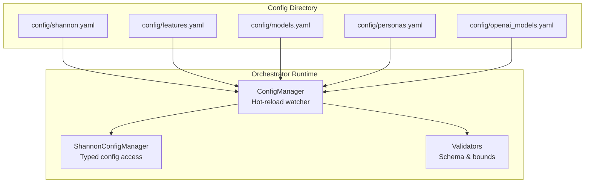
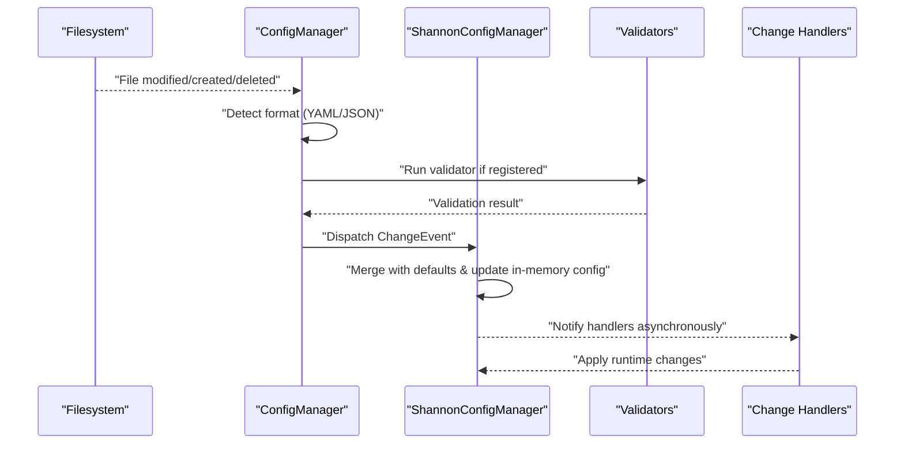
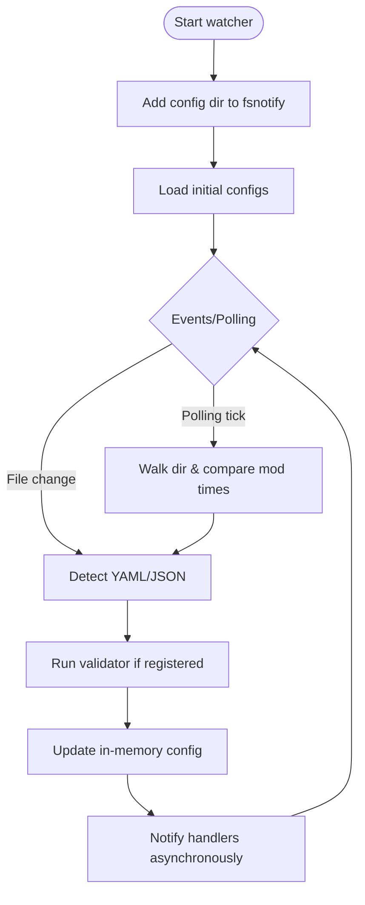
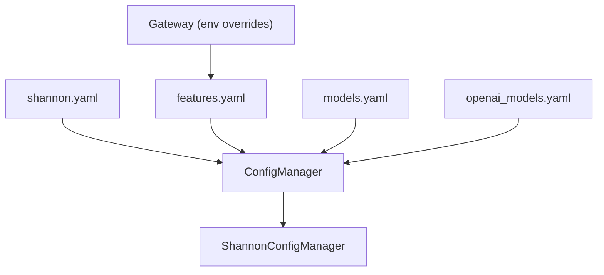

# Core Configuration Files

<cite>
**Referenced Files in This Document**
- [shannon.yaml](file://config/shannon.yaml)
- [models.yaml](file://config/models.yaml)
- [features.yaml](file://config/features.yaml)
- [personas.yaml](file://config/personas.yaml)
- [openai_models.yaml](file://config/openai_models.yaml)
- [config.go](file://go/orchestrator/internal/config/config.go)
- [manager.go](file://go/orchestrator/internal/config/manager.go)
- [shannon.go](file://go/orchestrator/internal/config/shannon.go)
- [main.go](file://go/orchestrator/cmd/gateway/main.go)
</cite>

## Table of Contents
1. [Introduction](#introduction)
2. [Project Structure](#project-structure)
3. [Core Components](#core-components)
4. [Architecture Overview](#architecture-overview)
5. [Detailed Component Analysis](#detailed-component-analysis)
6. [Dependency Analysis](#dependency-analysis)
7. [Performance Considerations](#performance-considerations)
8. [Troubleshooting Guide](#troubleshooting-guide)
9. [Conclusion](#conclusion)

## Introduction
This document explains Shannon’s core configuration system with a focus on orchestrator service configuration, LLM provider definitions, feature flags, agent personas, and OpenAI-compatible model registries. It covers configuration validation, hot-reload capabilities, and precedence rules across YAML and environment variables. Practical examples and troubleshooting guidance are included to help operators manage and tune the system effectively.

## Project Structure
Shannon’s configuration lives primarily under the config/ directory and is consumed by the Go orchestrator and supporting services. The orchestrator’s configuration manager watches the config directory for changes and applies updates dynamically.

**Diagram sources**
- [manager.go](file://go/orchestrator/internal/config/manager.go#L58-L85)
- [shannon.go](file://go/orchestrator/internal/config/shannon.go#L668-L714)

**Section sources**
- [manager.go](file://go/orchestrator/internal/config/manager.go#L58-L85)
- [shannon.go](file://go/orchestrator/internal/config/shannon.go#L668-L714)

## Core Components
- shannon.yaml: Orchestrator service configuration including ports, timeouts, authentication, circuit breakers, degradation, health checks, agents, temporal, logging, policy, vector/embeddings, tracing, streaming, workflow behavior, sessions, and feature flags.
- models.yaml: Centralized LLM provider configurations, model catalogs, pricing, model tiers, selection strategy, cost controls, prompt caching, provider settings, feature flags, capabilities matrix, rate limits, monitoring, and alerts.
- features.yaml: Feature toggles, execution modes, agent configuration, orchestration settings, workflow enhancements, enforcement defaults, security, storage, vector intelligence, observability, and environment-specific overrides.
- personas.yaml: Planned persona definitions for agent roles and behavioral settings (currently not loaded by the system).
- openai_models.yaml: OpenAI-compatible model registry mapping OpenAI-style model names to workflow modes, context settings, rate limits, and defaults.

**Section sources**
- [shannon.yaml](file://config/shannon.yaml#L1-L378)
- [models.yaml](file://config/models.yaml#L1-L776)
- [features.yaml](file://config/features.yaml#L1-L270)
- [personas.yaml](file://config/personas.yaml#L1-L161)
- [openai_models.yaml](file://config/openai_models.yaml#L1-L109)

## Architecture Overview
The orchestrator uses a typed configuration manager to load, validate, and hot-reload configuration files. Handlers receive change events and update internal runtime state atomically.

**Diagram sources**
- [manager.go](file://go/orchestrator/internal/config/manager.go#L304-L446)
- [shannon.go](file://go/orchestrator/internal/config/shannon.go#L716-L731)

## Detailed Component Analysis

### shannon.yaml: Orchestrator Service Configuration
- Service
  - Ports: service.port, service.health_port
  - Timeouts: service.graceful_timeout, service.read_timeout, service.write_timeout
  - Limits: service.max_header_bytes
- Authentication
  - auth.enabled, auth.skip_auth, auth.jwt_secret, auth.access_token_expiry, auth.refresh_token_expiry
  - auth.api_key_rate_limit, auth.default_tenant_limit, auth.enable_registration, auth.require_email_verification
- Sessions
  - session.max_history, session.ttl, session.cache_size, session.token_budget_per_task, session.token_budget_per_agent
- Circuit Breakers
  - circuit_breakers.redis/database/grpc: max_requests, interval, timeout, max_failures, on_state_change, enabled
- Degradation
  - degradation.enabled, degradation.check_interval, thresholds (minor/moderate/severe), mode_downgrade rules, partial_results, fallback_behaviors
- Health Checks
  - health.enabled, health.check_interval, health.timeout, health.port, health.checks.* (redis/database/agent_core/llm_service)
- Agents
  - agents.max_concurrent, agents.default_timeout, agents.health_check_port, agents.retry_count, agents.retry_backoff, endpoints
- Temporal
  - temporal.host_port, temporal.namespace, temporal.task_queue, temporal.timeout, temporal.retry_policy.*
- Logging
  - logging.level, logging.development, logging.encoding, logging.output_paths, logging.error_output_paths
- Vector/Embeddings
  - vector.enabled, vector.host/port, collections, top_k, threshold, timeout, default_model, cache_ttl, expected_embedding_dim, use_redis_cache, redis_addr, MMR settings
  - embeddings.base_url, embeddings.default_model, embeddings.timeout, embeddings.cache_ttl, embeddings.max_lru, embeddings.chunking.*
- Tracing
  - tracing.enabled, tracing.service_name, tracing.otlp_endpoint
- Streaming
  - streaming.ring_capacity
- Workflow Behavior
  - workflow.bypass_single_result
- Feature Flags
  - features.ads_research

Configuration precedence:
- Environment variables override selected fields in runtime (see Environment Overrides section).
- File-based configuration is validated and applied atomically via the ConfigManager.

**Section sources**
- [shannon.yaml](file://config/shannon.yaml#L4-L300)
- [shannon.go](file://go/orchestrator/internal/config/shannon.go#L10-L59)
- [shannon.go](file://go/orchestrator/internal/config/shannon.go#L572-L662)

### models.yaml: LLM Provider Configurations, Pricing, and Model Availability
- Model Tiers
  - model_tiers.small/medium/large: ordered provider/model lists with priority weights
- Selection Strategy
  - selection_strategy.mode, fallback_enabled, max_retries, timeout_seconds
- Cost Controls
  - cost_controls.max_cost_per_request, max_tokens_per_request, daily_budget_usd, alert_threshold_percent
- Prompt Caching
  - prompt_cache.enabled, similarity_threshold, ttl_seconds, max_cache_size_mb
- Provider Settings
  - provider_settings.*: base_url, timeout, max_retries per provider
- Model Catalog
  - model_catalog.<provider>.<model>: model_id, tier, context_window, max_tokens, capabilities (functions/streaming/vision/reasoning)
- Centralized Pricing
  - pricing.defaults.combined_per_1k and provider.model-specific input_per_1k/output_per_1k
- Feature Flags
  - feature_flags.*: thinking_mode, computer_use, multimodal, function_calling, batch_processing, prompt_caching
- Model Capabilities Matrix
  - model_capabilities.multimodal_models, thinking_models, coding_specialists, long_context_models
- Rate Limits
  - rate_limits.default_rpm/default_tpm, tier_overrides.small/medium/large
- Monitoring and Alerts
  - monitoring.enabled, metrics_export_interval, cost_tracking, performance_tracking, error_tracking
  - alerts.cost_threshold_usd, error_rate_threshold, latency_threshold_ms

Practical usage:
- Use model_tiers to steer model selection by complexity.
- Configure provider_settings for regional endpoints and retries.
- Set pricing for cost-aware budgeting and alerts.

**Section sources**
- [models.yaml](file://config/models.yaml#L16-L776)

### features.yaml: Feature Flags and Runtime Toggles
- Execution Modes
  - execution_modes.simple/standard/complex: latency caps, orchestration behavior, tool-only, memory limits
- Agent Configuration
  - agent.max_concurrent, agent.memory_limit_mb, agent.timeout_seconds, agent.sandbox_enabled, agent.wasm_runtime, FSM settings, tool limits and timeouts
- Orchestration
  - orchestration.engine, task_queue, namespace, worker concurrency, routing options, session settings
- Workflow Enhancements
  - workflows.reflection, synthesis.bypass_single_result, tool_execution.parallelism/auto_selection, complexity thresholds, DAG settings, approval workflow, templates fallback, P2P coordination
- Enforcement Defaults
  - enforcement.timeout_seconds, max_tokens, rate_limiting.rps, provider_rate_control_enabled, circuit_breaker thresholds
- Continuous Learning
  - continuous_learning.enabled, case_memory, q_learning, privacy settings
- Security
  - security.authentication.enabled/method, authorization.enabled/rbac, policy_engine.provider, input/output validation/filtering, rate limiting
- Storage
  - storage.postgres.redis.vector_db settings
- Vector Intelligence
  - vector.host/port/collections/top_k/threshold/timeout, filesystem artifacts
- Observability
  - observability.tracing.metrics.logging.health_checks settings
- Experimental Features
  - web3_integration, attestation, federated_learning, multi_modal
- Environment Overrides
  - environments.development/staging/production toggles for debug, auth, authorization, and experimental features

**Section sources**
- [features.yaml](file://config/features.yaml#L1-L270)
- [config.go](file://go/orchestrator/internal/config/config.go#L33-L125)

### personas.yaml: Agent Role Configurations and Behavioral Settings
- Status
  - This file is planned but not currently loaded by the system; active role presets are in the Python LLM service.
- Personas
  - generalist, researcher, coder, analyst: system prompts, tool availability, token budgets, temperature, keyword matching
- Selection
  - selection.method, complexity_threshold, llm_timeout_ms, cache_ttl

Note: Tool names in this file differ from the actual tool registry and require mapping when activated.

**Section sources**
- [personas.yaml](file://config/personas.yaml#L1-L161)

### openai_models.yaml: OpenAI-Compatible Model Definitions
- Models
  - shannon-deep-research, shannon-quick-research, shannon-standard-research, shannon-academic-research, shannon-ads-research, shannon-chat, shannon-complex
  - Each defines workflow_mode, context overrides, description, max_tokens_default, rate_limit.requests_per_minute/tokens_per_minute
- Defaults
  - default_model, settings.max_tokens_limit, default_temperature, session_ttl, default_rate_limit

Usage:
- POST /v1/chat/completions with model set to one of the named models to route to specific workflows and apply rate limits.

**Section sources**
- [openai_models.yaml](file://config/openai_models.yaml#L8-L109)

### Configuration Validation, Hot-Reload, and Precedence

#### Validation
- shannon.yaml validation enforces:
  - Port ranges for service and health ports
  - Degradation thresholds constrained to valid ranges
  - Agent concurrency and retry bounds
  - Session context windows within [5, 200]
  - Token budgets within [1000, 200000] and per-task >= per-agent

**Section sources**
- [shannon.go](file://go/orchestrator/internal/config/shannon.go#L572-L662)

#### Hot-Reload
- ConfigManager watches a directory for YAML/JSON changes and emits ChangeEvents to registered handlers.
- Supports polling fallback for unreliable filesystems.
- Validates configurations before applying updates.
- Provides manual reload APIs and programmatic setters for testing.

**Diagram sources**
- [manager.go](file://go/orchestrator/internal/config/manager.go#L87-L130)
- [manager.go](file://go/orchestrator/internal/config/manager.go#L303-L344)
- [manager.go](file://go/orchestrator/internal/config/manager.go#L448-L548)

**Section sources**
- [manager.go](file://go/orchestrator/internal/config/manager.go#L58-L85)
- [manager.go](file://go/orchestrator/internal/config/manager.go#L303-L344)
- [manager.go](file://go/orchestrator/internal/config/manager.go#L448-L548)

#### Precedence Rules
- Environment Variables Override:
  - Metrics port resolution: METRICS_PORT env overrides features.yaml observability.metrics.port
  - Gateway authentication: GATEWAY_SKIP_AUTH env overrides features.yaml.gateway.skip_auth
  - Budget and enforcement: BACKPRESSURE_THRESHOLD, MAX_BACKPRESSURE_DELAY_MS, CIRCUIT_FAILURE_THRESHOLD, CIRCUIT_RESET_TIMEOUT_MS, CIRCUIT_HALF_OPEN_REQUESTS, RATE_LIMIT_REQUESTS, RATE_LIMIT_INTERVAL_MS, WORKFLOW_SYNTH_BYPASS_SINGLE, TOOL_PARALLELISM, ENABLE_TOOL_SELECTION, PROVIDER_RATE_CONTROL_ENABLED
- File Resolution:
  - CONFIG_PATH determines features.yaml location (default /app/config/features.yaml or ./config/features.yaml)
  - MODELS_CONFIG_PATH determines models.yaml location (default /app/config/models.yaml)
  - shannon.yaml validators and handlers are registered for hot-reload

**Section sources**
- [config.go](file://go/orchestrator/internal/config/config.go#L60-L75)
- [config.go](file://go/orchestrator/internal/config/config.go#L127-L215)
- [config.go](file://go/orchestrator/internal/config/config.go#L227-L263)
- [config.go](file://go/orchestrator/internal/config/config.go#L285-L303)
- [main.go](file://go/orchestrator/cmd/gateway/main.go#L38-L56)

## Dependency Analysis
The orchestrator composes configuration from multiple sources and exposes typed access to runtime components.

**Diagram sources**
- [shannon.go](file://go/orchestrator/internal/config/shannon.go#L668-L714)
- [config.go](file://go/orchestrator/internal/config/config.go#L33-L58)
- [main.go](file://go/orchestrator/cmd/gateway/main.go#L38-L56)

**Section sources**
- [shannon.go](file://go/orchestrator/internal/config/shannon.go#L668-L714)
- [config.go](file://go/orchestrator/internal/config/config.go#L33-L58)
- [main.go](file://go/orchestrator/cmd/gateway/main.go#L38-L56)

## Performance Considerations
- Circuit Breakers and Degradation: Tune thresholds and fallback behaviors to maintain responsiveness under load.
- Session Budgets: Align token budgets with workload complexity to prevent excessive memory usage.
- Vector Search: Adjust top_k, threshold, and MMR settings for recall vs. diversity trade-offs.
- Rate Limits: Use provider-specific rate control judiciously to avoid unnecessary latency.
- Logging and Tracing: Keep logging levels and tracing sampling reasonable in production.

[No sources needed since this section provides general guidance]

## Troubleshooting Guide
Common issues and resolutions:
- Invalid service port or health port
  - Symptom: Startup/validation error indicating out-of-range port values.
  - Fix: Ensure service.port and service.health_port are within 1–65535.
- Degradation thresholds out of range
  - Symptom: Validation error for error_rate_percentage not between 0 and 100.
  - Fix: Adjust degradation.thresholds.*.error_rate_percentage accordingly.
- Session context windows or token budgets invalid
  - Symptom: Validation error for context_window_default/context_window_debugging not in [5, 200] or budgets outside [1000, 200000].
  - Fix: Correct session.* values and ensure token_budget_per_task >= token_budget_per_agent.
- Environment variable conflicts
  - Symptom: Unexpected auth behavior or metrics port.
  - Fix: Verify GATEWAY_SKIP_AUTH and METRICS_PORT; remember env overrides take precedence.
- Hot-reload not triggering
  - Symptom: Changes to YAML not applied.
  - Fix: Confirm file watcher is active, file format is YAML/JSON, and validators pass; enable polling fallback if needed.

**Section sources**
- [shannon.go](file://go/orchestrator/internal/config/shannon.go#L572-L662)
- [manager.go](file://go/orchestrator/internal/config/manager.go#L303-L344)

## Conclusion
Shannon’s configuration system provides a robust, typed, and hot-reloadable foundation for orchestrator behavior, LLM routing, and feature toggles. By leveraging file-based configuration with environment overrides and validators, operators can safely evolve system behavior in production while maintaining stability through circuit breakers, degradation, and health checks.