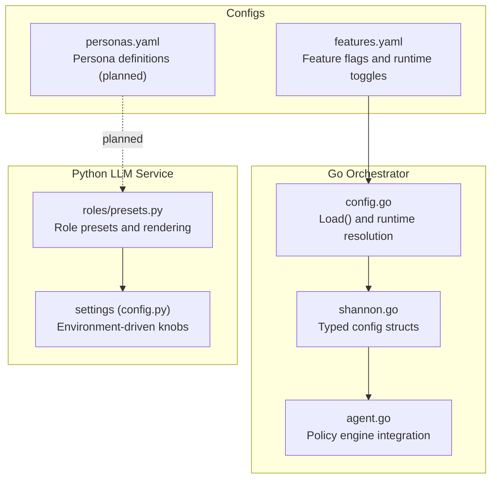
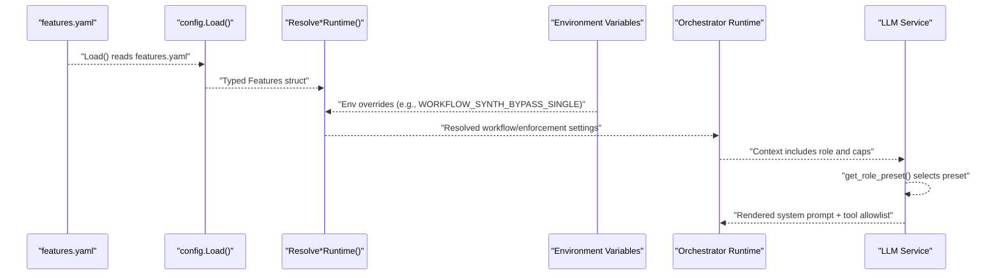
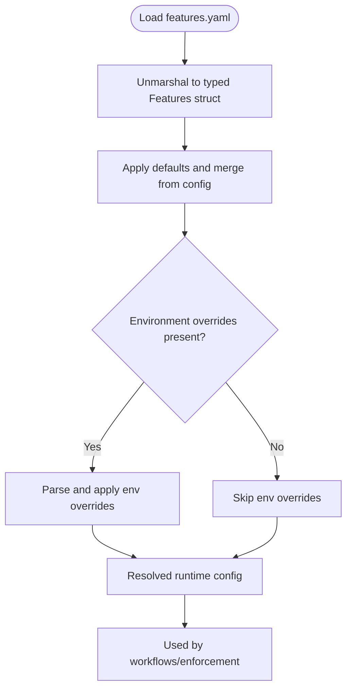
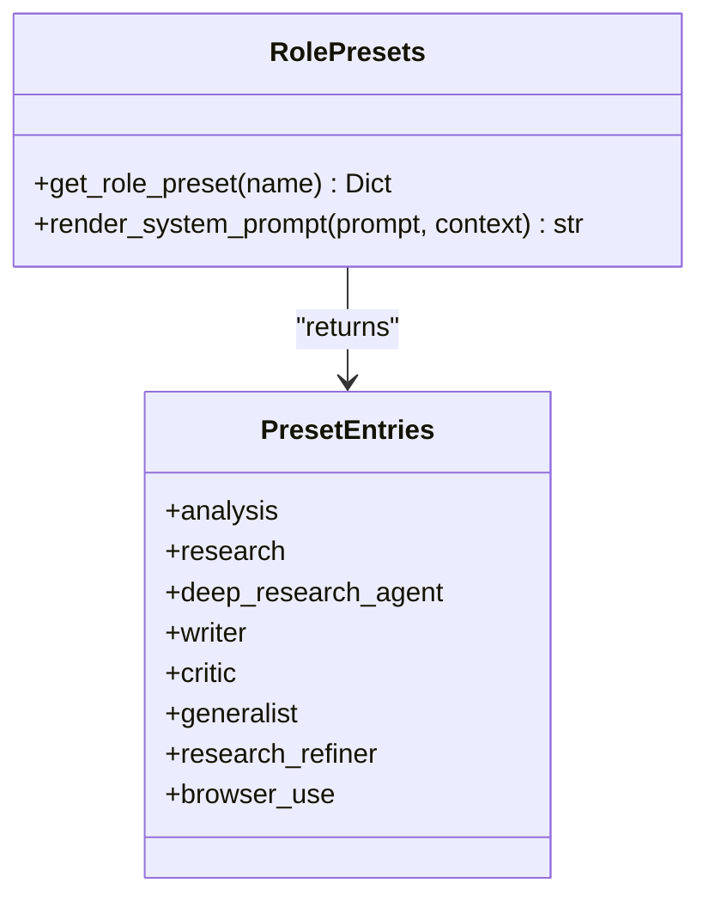
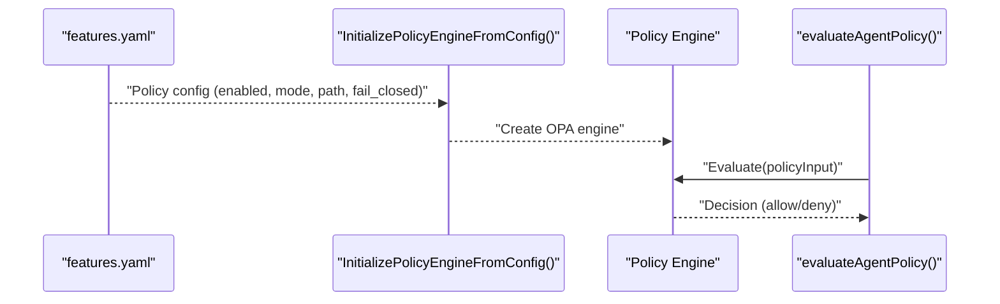
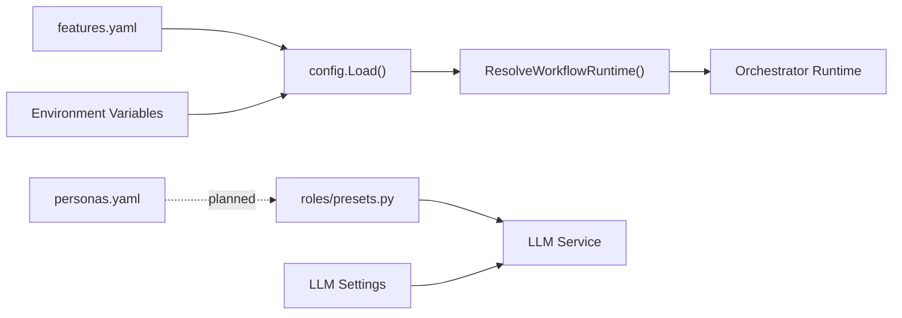

# Feature Flags and Agent Personas

<cite>
**Referenced Files in This Document**
- [features.yaml](file://config/features.yaml)
- [personas.yaml](file://config/personas.yaml)
- [presets.py](file://python/llm-service/llm_service/roles/presets.py)
- [config.go](file://go/orchestrator/internal/config/config.go)
- [shannon.go](file://go/orchestrator/internal/config/shannon.go)
- [agent.go](file://go/orchestrator/internal/activities/agent.go)
</cite>

## Table of Contents
1. [Introduction](#introduction)
2. [Project Structure](#project-structure)
3. [Core Components](#core-components)
4. [Architecture Overview](#architecture-overview)
5. [Detailed Component Analysis](#detailed-component-analysis)
6. [Dependency Analysis](#dependency-analysis)
7. [Performance Considerations](#performance-considerations)
8. [Troubleshooting Guide](#troubleshooting-guide)
9. [Conclusion](#conclusion)

## Introduction
This document explains how feature flags and agent persona configuration are modeled and applied in the system. It covers:
- Feature flags and runtime toggles defined in features.yaml and consumed by the Go orchestrator and Python LLM service
- Agent persona configuration described in personas.yaml and the active role presets in the Python LLM service
- Practical guidance for enabling/disabling features, managing persona variations, and understanding how these configurations influence system behavior

## Project Structure
The relevant configuration and runtime components are distributed across:
- Go orchestrator configuration and runtime resolution
- Python LLM service role presets and environment-driven settings
- YAML configuration files defining feature flags and personas

**Diagram sources**
- [config.go](file://go/orchestrator/internal/config/config.go#L33-L58)
- [shannon.go](file://go/orchestrator/internal/config/shannon.go#L11-L59)
- [agent.go](file://go/orchestrator/internal/activities/agent.go#L470-L553)
- [presets.py](file://python/llm-service/llm_service/roles/presets.py#L12-L249)
- [config.py](file://python/llm-service/llm_service/config.py#L6-L101)
- [features.yaml](file://config/features.yaml#L1-L270)
- [personas.yaml](file://config/personas.yaml#L1-L161)

**Section sources**
- [config.go](file://go/orchestrator/internal/config/config.go#L33-L58)
- [shannon.go](file://go/orchestrator/internal/config/shannon.go#L11-L59)
- [presets.py](file://python/llm-service/llm_service/roles/presets.py#L12-L249)
- [config.py](file://python/llm-service/llm_service/config.py#L6-L101)
- [features.yaml](file://config/features.yaml#L1-L270)
- [personas.yaml](file://config/personas.yaml#L1-L161)

## Core Components
- Feature flags and runtime toggles
  - Loaded from features.yaml and resolved into runtime settings for workflows, enforcement, and observability
  - Environment variables override selected feature flags at runtime
- Agent personas
  - personas.yaml describes a planned persona system; currently, the active role presets are defined in the Python LLM service
  - Role presets include system prompts, tool allowlists, and token/temperature caps

**Section sources**
- [features.yaml](file://config/features.yaml#L1-L270)
- [config.go](file://go/orchestrator/internal/config/config.go#L94-L125)
- [config.go](file://go/orchestrator/internal/config/config.go#L227-L263)
- [config.go](file://go/orchestrator/internal/config/config.go#L280-L303)
- [personas.yaml](file://config/personas.yaml#L1-L161)
- [presets.py](file://python/llm-service/llm_service/roles/presets.py#L12-L249)

## Architecture Overview
The system resolves feature flags from YAML and environment variables, then applies them across runtime subsystems. Agent roles are selected via context and rendered from presets in the Python LLM service.

**Diagram sources**
- [config.go](file://go/orchestrator/internal/config/config.go#L33-L58)
- [config.go](file://go/orchestrator/internal/config/config.go#L227-L263)
- [config.go](file://go/orchestrator/internal/config/config.go#L285-L303)
- [presets.py](file://python/llm-service/llm_service/roles/presets.py#L276-L288)

## Detailed Component Analysis

### Feature Flags and Runtime Toggles (features.yaml)
- Execution modes
  - simple, standard, complex modes define latency targets, orchestration behavior, and agent concurrency
- Agent and orchestration
  - Agent concurrency, memory limits, timeouts, FSM iteration limits, tool execution caps
  - Orchestration engine, task queue, worker concurrency, routing heuristics, session TTL and context size
- Workflows
  - Reflection: enable/disable, retries, confidence thresholds, evaluation criteria, timeout
  - Synthesis: bypass single-result behavior
  - Tool execution: parallelism and auto-selection
  - Complexity thresholds for model tier selection and DAG thresholds
  - Approval workflow: enable/disable, complexity threshold, dangerous tools list
  - Templates: fallback behavior
  - P2P coordination: enable/disable and timeout
- Enforcement defaults
  - Global timeouts and token limits
  - Rate limiting: RPS and provider rate control toggle
  - Circuit breaker: error threshold, min requests, window seconds
- Continuous learning
  - Enable/disable, case memory, Q-learning parameters, privacy controls
- Security
  - Authentication and authorization toggles, policy engine provider, input validation, output filtering, rate limiting
- Gateway
  - Auth bypass toggle
- Storage and vector intelligence
  - Postgres/Redis/VDB toggles, collection sizing, embedding dimensions, vector collections, filesystem artifacts path and size limits
- Observability
  - Tracing provider and sampling rate, metrics provider and port, logging level/format, health checks
- Experimental features
  - Web3 integration, attestation, federated learning, multi-modal capabilities
- Environments
  - Development/staging/production overrides for debug, auth, authorization, and experimental toggles

Operational guidance
- Gradual rollouts and A/B testing
  - Use environment-specific overrides to flip flags per environment
  - Combine with environment variables for quick, safe toggles in production
- Controlled releases
  - Keep experimental features disabled by default; enable per environment as appropriate
  - Use approval workflow and dangerous tools lists to gate sensitive actions

**Section sources**
- [features.yaml](file://config/features.yaml#L4-L270)
- [config.go](file://go/orchestrator/internal/config/config.go#L94-L125)
- [config.go](file://go/orchestrator/internal/config/config.go#L227-L263)
- [config.go](file://go/orchestrator/internal/config/config.go#L285-L303)

### Feature Flag Resolution and Environment Overrides
The Go orchestrator loads features.yaml and exposes typed configuration. It also merges environment variables to override specific flags at runtime.

**Diagram sources**
- [config.go](file://go/orchestrator/internal/config/config.go#L33-L58)
- [config.go](file://go/orchestrator/internal/config/config.go#L127-L215)
- [config.go](file://go/orchestrator/internal/config/config.go#L227-L263)
- [config.go](file://go/orchestrator/internal/config/config.go#L285-L303)

**Section sources**
- [config.go](file://go/orchestrator/internal/config/config.go#L33-L58)
- [config.go](file://go/orchestrator/internal/config/config.go#L127-L215)
- [config.go](file://go/orchestrator/internal/config/config.go#L227-L263)
- [config.go](file://go/orchestrator/internal/config/config.go#L285-L303)

### Agent Personas and Role Presets
Personas system
- personas.yaml documents a planned persona system with roles, tool allowlists, token budgets, and keywords
- The file includes a warning that it is not currently loaded or used; active role presets are in the Python LLM service

Active role presets
- The Python LLM service defines role presets with system prompts, allowed tools, and token/temperature caps
- Roles include generalist, analysis, research, deep research agent, writer, critic, research refiner, and browser_use
- A get_role_preset() function maps role names to presets and provides safe fallbacks

**Diagram sources**
- [presets.py](file://python/llm-service/llm_service/roles/presets.py#L12-L249)
- [presets.py](file://python/llm-service/llm_service/roles/presets.py#L276-L318)

Personas.yaml (planned)
- Describes roles such as researcher, coder, analyst, and generalist
- Includes system prompts, tool allowlists, token budgets, and keyword-based selection hints
- Notes that tool names differ from the actual tool registry and require mapping

**Section sources**
- [personas.yaml](file://config/personas.yaml#L1-L161)
- [presets.py](file://python/llm-service/llm_service/roles/presets.py#L12-L249)
- [presets.py](file://python/llm-service/llm_service/roles/presets.py#L276-L318)

### Policy Engine Integration and Safety
The orchestrator initializes and evaluates a policy engine using configuration derived from features.yaml and environment variables. This influences agent execution decisions and safety gates.

**Diagram sources**
- [agent.go](file://go/orchestrator/internal/activities/agent.go#L494-L553)
- [agent.go](file://go/orchestrator/internal/activities/agent.go#L562-L649)

**Section sources**
- [agent.go](file://go/orchestrator/internal/activities/agent.go#L494-L553)
- [agent.go](file://go/orchestrator/internal/activities/agent.go#L562-L649)

## Dependency Analysis
- Go orchestrator depends on features.yaml for runtime configuration and environment variables for overrides
- Python LLM service depends on role presets for agent behavior and environment variables for operational knobs
- Personas.yaml is documented but not actively loaded; role presets serve as the active persona mechanism

**Diagram sources**
- [config.go](file://go/orchestrator/internal/config/config.go#L33-L58)
- [config.go](file://go/orchestrator/internal/config/config.go#L227-L263)
- [presets.py](file://python/llm-service/llm_service/roles/presets.py#L276-L318)
- [config.py](file://python/llm-service/llm_service/config.py#L6-L101)
- [personas.yaml](file://config/personas.yaml#L1-L161)

**Section sources**
- [config.go](file://go/orchestrator/internal/config/config.go#L33-L58)
- [config.go](file://go/orchestrator/internal/config/config.go#L227-L263)
- [presets.py](file://python/llm-service/llm_service/roles/presets.py#L276-L318)
- [config.py](file://python/llm-service/llm_service/config.py#L6-L101)
- [personas.yaml](file://config/personas.yaml#L1-L161)

## Performance Considerations
- Feature flags can alter latency and throughput:
  - Execution modes set latency targets and orchestration complexity
  - Workflow synthesis bypass and tool parallelism affect processing time
  - Provider rate control and circuit breakers influence stability under load
- Role presets tune token budgets and temperature to balance quality and cost
- Environment overrides enable rapid adjustments without redeployment

[No sources needed since this section provides general guidance]

## Troubleshooting Guide
- Feature flags not taking effect
  - Verify features.yaml path resolution and that environment variables are set correctly
  - Confirm environment overrides for specific flags (e.g., provider rate control, workflow synthesis bypass)
- Personas not applied
  - personas.yaml is not currently loaded; ensure roles are selected via context and rendered from presets
  - Check that role names match expected aliases and that tool names align with the actual tool registry
- Policy decisions
  - Inspect policy engine initialization and evaluation logs; confirm environment and fail-closed settings

**Section sources**
- [config.go](file://go/orchestrator/internal/config/config.go#L33-L58)
- [config.go](file://go/orchestrator/internal/config/config.go#L285-L303)
- [agent.go](file://go/orchestrator/internal/activities/agent.go#L494-L553)
- [personas.yaml](file://config/personas.yaml#L1-L161)
- [presets.py](file://python/llm-service/llm_service/roles/presets.py#L276-L318)

## Conclusion
Feature flags in features.yaml provide a centralized, environment-aware mechanism to control system behavior, while role presets in the Python LLM service define agent personas and behaviors. For safe operations:
- Use environment-specific overrides for controlled rollouts
- Keep experimental features disabled by default
- Align persona tool names with the actual tool registry and rely on active presets for runtime behavior
- Monitor policy engine decisions and adjust flags as needed

[No sources needed since this section summarizes without analyzing specific files]