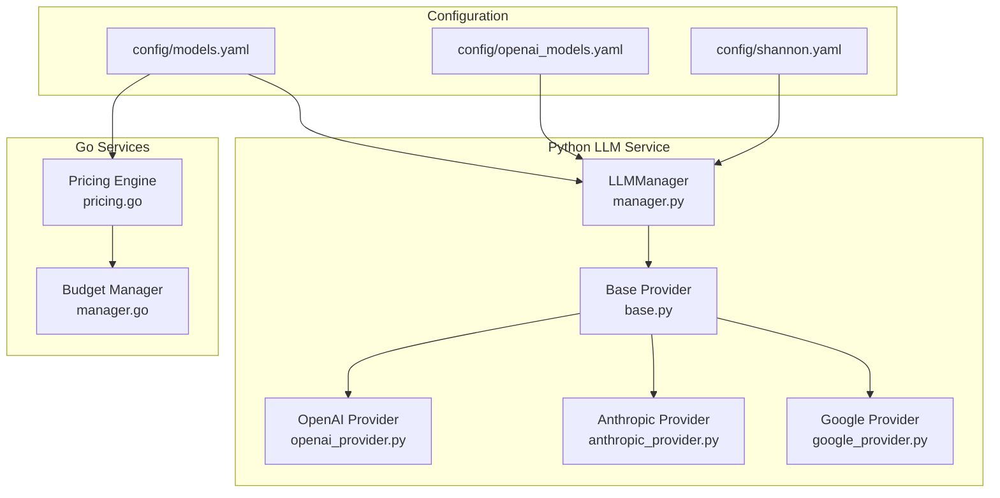
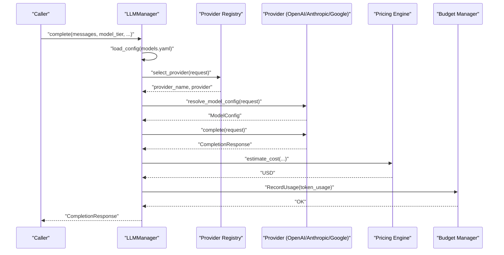
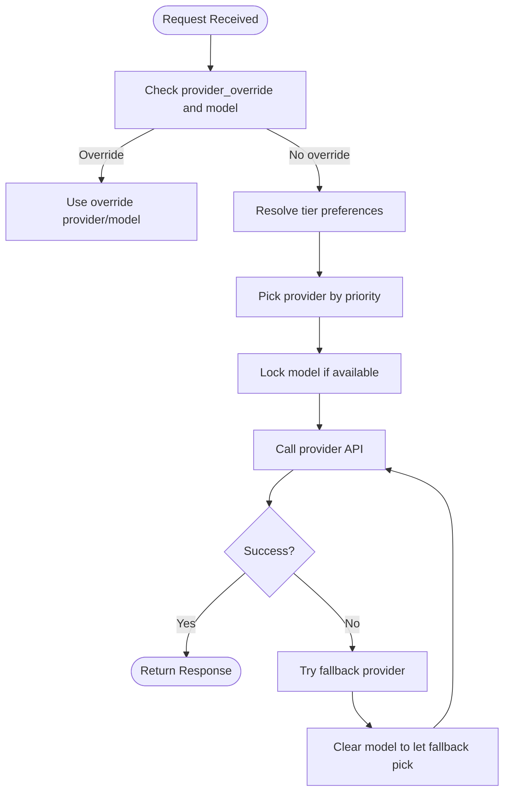
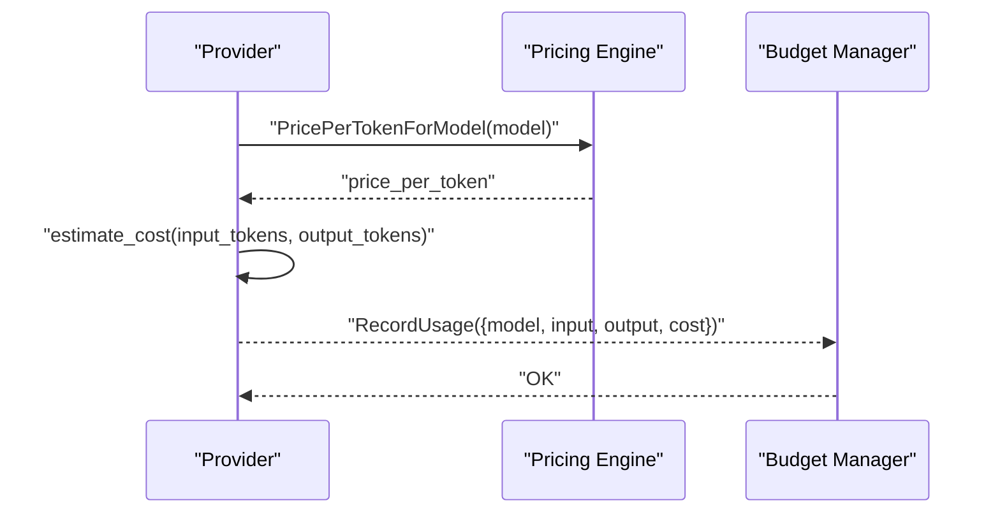
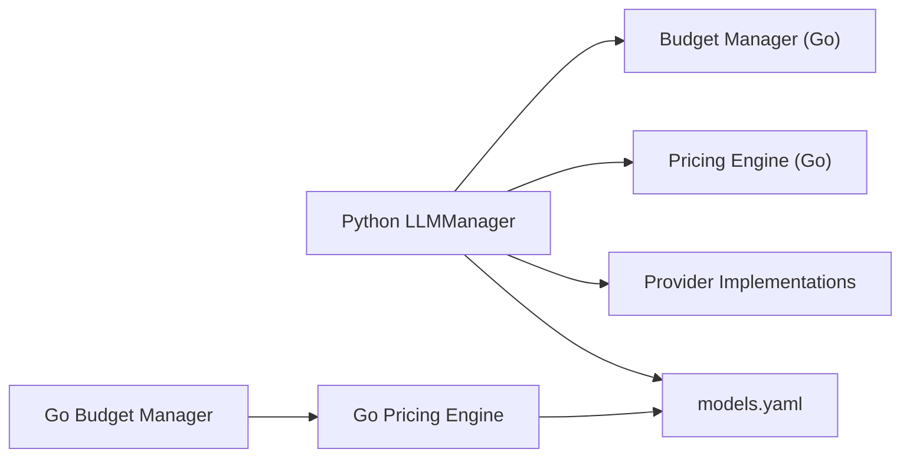

# LLM Provider and Model Configuration

<cite>
**Referenced Files in This Document**
- [models.yaml](file://config/models.yaml)
- [openai_models.yaml](file://config/openai_models.yaml)
- [shannon.yaml](file://config/shannon.yaml)
- [manager.py](file://python/llm-service/llm_provider/manager.py)
- [base.py](file://python/llm-service/llm_provider/base.py)
- [openai_provider.py](file://python/llm-service/llm_provider/openai_provider.py)
- [anthropic_provider.py](file://python/llm-service/llm_provider/anthropic_provider.py)
- [google_provider.py](file://python/llm-service/llm_provider/google_provider.py)
- [pricing.go](file://go/orchestrator/internal/pricing/pricing.go)
- [manager.go](file://go/orchestrator/internal/budget/manager.go)
</cite>

## Table of Contents
1. [Introduction](#introduction)
2. [Project Structure](#project-structure)
3. [Core Components](#core-components)
4. [Architecture Overview](#architecture-overview)
5. [Detailed Component Analysis](#detailed-component-analysis)
6. [Dependency Analysis](#dependency-analysis)
7. [Performance Considerations](#performance-considerations)
8. [Troubleshooting Guide](#troubleshooting-guide)
9. [Conclusion](#conclusion)

## Introduction
This document explains how to configure and operate LLM providers and models in the Shannon platform. It covers:
- The unified model catalog and tiering system
- Pricing configuration and cost tracking across Python and Go
- Provider configuration (authentication, timeouts, rate limits)
- Model selection logic, fallback strategies, and availability monitoring
- Practical guidance for configuring providers (OpenAI, Anthropic, Google, and others)
- Cost management, budget controls, and performance characteristics

## Project Structure
The configuration system centers around three YAML files and provider implementations:
- config/models.yaml: Unified model catalog, tiers, pricing, provider settings, capabilities, and cost controls
- config/openai_models.yaml: OpenAI-compatible model registry for workflow routing and rate limits
- config/shannon.yaml: Orchestrator-wide runtime configuration (budgets, degradation, health, etc.)

Provider implementations live under python/llm-service/llm_provider and integrate with the unified model catalog.

**Diagram sources**
- [models.yaml](file://config/models.yaml#L1-L776)
- [openai_models.yaml](file://config/openai_models.yaml#L1-L109)
- [shannon.yaml](file://config/shannon.yaml#L1-L378)
- [manager.py](file://python/llm-service/llm_provider/manager.py#L1-L800)
- [base.py](file://python/llm-service/llm_provider/base.py#L1-L486)
- [openai_provider.py](file://python/llm-service/llm_provider/openai_provider.py#L1-L802)
- [anthropic_provider.py](file://python/llm-service/llm_provider/anthropic_provider.py#L1-L303)
- [google_provider.py](file://python/llm-service/llm_provider/google_provider.py#L1-L435)
- [pricing.go](file://go/orchestrator/internal/pricing/pricing.go#L1-L428)
- [manager.go](file://go/orchestrator/internal/budget/manager.go#L1-L800)

**Section sources**
- [models.yaml](file://config/models.yaml#L1-L776)
- [openai_models.yaml](file://config/openai_models.yaml#L1-L109)
- [shannon.yaml](file://config/shannon.yaml#L1-L378)

## Core Components
- Unified model catalog and tiers: Defines providers, models, capabilities, context windows, and pricing per provider
- Provider settings: Base URLs, timeouts, retries per provider
- Selection strategy: Priority-based routing, fallback, and timeouts
- Cost controls: Per-request and per-day caps, token limits
- Prompt caching: Similarity threshold, TTL, and cache size
- Pricing engine: Centralized pricing lookup and cost estimation
- Budget manager: Token budgets, cost tracking, backpressure, and rate limiting

**Section sources**
- [models.yaml](file://config/models.yaml#L16-L135)
- [pricing.go](file://go/orchestrator/internal/pricing/pricing.go#L17-L52)
- [manager.go](file://go/orchestrator/internal/budget/manager.go#L18-L59)

## Architecture Overview
The Python LLM Manager translates unified configuration into provider instances, selects models by tier, enforces rate limits, caches responses, and tracks usage. Pricing and cost tracking are coordinated with the Go pricing engine and budget manager.

**Diagram sources**
- [manager.py](file://python/llm-service/llm_provider/manager.py#L538-L687)
- [base.py](file://python/llm-service/llm_provider/base.py#L283-L307)
- [pricing.go](file://go/orchestrator/internal/pricing/pricing.go#L198-L250)
- [manager.go](file://go/orchestrator/internal/budget/manager.go#L290-L349)

## Detailed Component Analysis

### Unified Model Catalog and Tiers (models.yaml)
- Model tiers: small, medium, large define provider/model priorities and target allocations
- Selection strategy: mode, fallback, max retries, and timeout
- Cost controls: max cost per request, max tokens per request, daily budget, alert threshold
- Prompt caching: enable/disable, similarity threshold, TTL, max size
- Provider settings: base URLs, timeouts, retries per provider
- Model catalog: per-provider model definitions with context windows, max tokens, capabilities
- Pricing: per-model input/output prices per 1K tokens; defaults for unknown models
- Capabilities: multimodal, thinking, coding specialists, long-context
- Rate limits: default RPM/TPM and tier overrides
- Monitoring and alerts: metrics export, cost tracking, performance, error tracking, thresholds

Key configuration areas:
- model_tiers: ordered providers per tier with priority
- selection_strategy: fallback and timeout behavior
- cost_controls: budget and spending caps
- prompt_cache: caching behavior
- provider_settings: per-provider base_url, timeout, max_retries
- model_catalog: per-model metadata and capabilities
- pricing: per-model pricing overrides
- model_capabilities: curated capability lists
- rate_limits: global and tier-specific limits
- monitoring/alerts: metrics and thresholds

**Section sources**
- [models.yaml](file://config/models.yaml#L16-L135)
- [models.yaml](file://config/models.yaml#L199-L776)

### OpenAI-Compatible Model Registry (openai_models.yaml)
Defines workflow modes and rate limits for OpenAI-compatible model aliases:
- Workflow modes: research, simple, supervisor
- Context overrides: research strategies, iteration settings, verification
- Rate limits: per-model RPM and TPM
- Defaults: max_tokens_default, default temperature, session TTL

This registry maps model aliases (e.g., shannon-deep-research) to workflow behavior and operational constraints.

**Section sources**
- [openai_models.yaml](file://config/openai_models.yaml#L8-L109)

### Provider Configuration and Authentication
- Environment-based discovery: providers are initialized from environment variables when models.yaml is not present
- Provider-specific environment variables:
  - OPENAI_API_KEY for OpenAI
  - ANTHROPIC_API_KEY for Anthropic
  - GOOGLE_API_KEY for Google
  - GROQ_API_KEY for Groq
  - XAI_API_KEY for xAI
  - ZAI_API_KEY, DEEPSEEK_API_KEY, QWEN_API_KEY, OLLAMA_API_KEY for openai_compatible providers
- Provider settings in models.yaml:
  - base_url, timeout, max_retries per provider
  - Additional settings for Bedrock (region) and Ollama (local base_url)

**Section sources**
- [manager.py](file://python/llm-service/llm_provider/manager.py#L217-L264)
- [models.yaml](file://config/models.yaml#L137-L198)

### Model Selection Logic and Fallback
- Provider override: explicit provider_override in requests
- Specific model override: request.model resolves to a provider/model pair
- Tier-based selection: manager consults tier preferences and provider model availability
- Fallback mechanism: if primary provider fails, manager tries a fallback provider and clears model selection to allow the fallback to choose a compatible model
- Hedged requests: optional parallel primary and fallback requests with winner selection

**Diagram sources**
- [manager.py](file://python/llm-service/llm_provider/manager.py#L747-L800)
- [manager.py](file://python/llm-service/llm_provider/manager.py#L670-L686)

**Section sources**
- [manager.py](file://python/llm-service/llm_provider/manager.py#L538-L687)
- [manager.py](file://python/llm-service/llm_provider/manager.py#L747-L800)

### Provider Implementations and Model-Specific Behavior
- OpenAIProvider:
  - Supports both Chat Completions and Responses APIs
  - Token counting via tiktoken with model-specific encoders
  - Adjusts max tokens based on context window headroom
  - Handles GPT-5 family special cases (max_completion_tokens, content extraction)
  - Function/tool call normalization
- AnthropicProvider:
  - Converts messages and functions to Claude format
  - Respects temperature/top_p exclusivity
  - Validates context window headroom
- GoogleProvider:
  - Converts messages to Gemini format (user/model roles)
  - Uses Google AI SDK with safety settings
  - Estimates tokens or uses model counters when available

**Section sources**
- [openai_provider.py](file://python/llm-service/llm_provider/openai_provider.py#L88-L472)
- [anthropic_provider.py](file://python/llm-service/llm_provider/anthropic_provider.py#L101-L226)
- [google_provider.py](file://python/llm-service/llm_provider/google_provider.py#L172-L277)

### Pricing Tracking and Cost Management
- Centralized pricing:
  - Pricing engine loads models.yaml and exposes per-token pricing
  - Supports combined or split input/output pricing
  - Provides fallback defaults for unknown models
- Cost estimation:
  - Providers estimate cost using model input/output prices per 1K tokens
  - Budget manager records actual usage and accumulates cost
- Budget controls:
  - Task/session token budgets with warnings and optional hard limits
  - Backpressure delays proportional to budget usage
  - Idempotency tracking to prevent double-counting

**Diagram sources**
- [pricing.go](file://go/orchestrator/internal/pricing/pricing.go#L178-L250)
- [manager.go](file://go/orchestrator/internal/budget/manager.go#L290-L349)

**Section sources**
- [pricing.go](file://go/orchestrator/internal/pricing/pricing.go#L168-L250)
- [manager.go](file://go/orchestrator/internal/budget/manager.go#L18-L59)
- [manager.go](file://go/orchestrator/internal/budget/manager.go#L290-L349)

### Model Capabilities, Context Windows, and Performance
- Capabilities matrix:
  - Multimodal models, thinking models, coding specialists, long-context models
- Context windows and max tokens:
  - Defined per model in model_catalog
  - Providers clamp max tokens to context window headroom
- Performance characteristics:
  - Streaming support varies by provider and model
  - Vision support indicated per model
  - Reasoning support flagged for models that advertise it

**Section sources**
- [models.yaml](file://config/models.yaml#L714-L748)
- [models.yaml](file://config/models.yaml#L199-L776)
- [openai_provider.py](file://python/llm-service/llm_provider/openai_provider.py#L133-L173)
- [anthropic_provider.py](file://python/llm-service/llm_provider/anthropic_provider.py#L116-L133)
- [google_provider.py](file://python/llm-service/llm_provider/google_provider.py#L189-L213)

### Provider Configuration Examples
- OpenAI:
  - Set OPENAI_API_KEY
  - Optionally configure base_url, timeout, max_retries in models.yaml provider_settings
- Anthropic:
  - Set ANTHROPIC_API_KEY
  - Provider settings in models.yaml
- Google:
  - Set GOOGLE_API_KEY
  - Configure safety settings in provider settings if needed
- xAI/DeepSeek/Qwen/Ollama/Zai/Meta/Mistral/Cohere/Bedrock:
  - Set respective API keys
  - Configure base_url and timeouts in provider_settings
  - Bedrock requires region setting

**Section sources**
- [manager.py](file://python/llm-service/llm_provider/manager.py#L217-L264)
- [models.yaml](file://config/models.yaml#L137-L198)

### Model Locking, Availability Monitoring, and Automatic Fallback
- Model locking:
  - When a specific model is requested, the manager locks it for the request if available
- Availability monitoring:
  - Providers maintain model catalogs from models.yaml
  - Circuit breakers and hedged requests improve resilience
- Automatic fallback:
  - On failure, manager tries fallback provider and clears model selection to allow fallback to choose a compatible model

**Section sources**
- [manager.py](file://python/llm-service/llm_provider/manager.py#L765-L800)
- [manager.py](file://python/llm-service/llm_provider/manager.py#L670-L686)

### Optimizing Model Selection Based on Task Complexity and Cost Constraints
- Use model_tiers.small for fast, cost-optimized tasks without heavy reasoning
- Use model_tiers.medium for balanced tasks
- Use model_tiers.large for complex reasoning tasks
- Tune selection_strategy.mode (priority, round-robin, least-cost, random)
- Enforce cost_controls to cap spending per request and per day
- Monitor llm_requests_total{tier="..."} metrics to observe real distribution
- Use rate_limits to align provider throughput with workload

**Section sources**
- [models.yaml](file://config/models.yaml#L16-L135)
- [models.yaml](file://config/models.yaml#L749-L776)

## Dependency Analysis
- Python LLM Manager depends on:
  - models.yaml for provider definitions, model catalogs, pricing, and routing
  - Provider implementations for API-specific logic
  - Pricing engine for cost estimation
  - Budget manager for usage tracking and enforcement
- Go services depend on:
  - models.yaml for pricing and tier preferences
  - Budget manager for usage aggregation and cost tracking

**Diagram sources**
- [manager.py](file://python/llm-service/llm_provider/manager.py#L169-L195)
- [pricing.go](file://go/orchestrator/internal/pricing/pricing.go#L87-L123)
- [manager.go](file://go/orchestrator/internal/budget/manager.go#L115-L146)

**Section sources**
- [manager.py](file://python/llm-service/llm_provider/manager.py#L169-L195)
- [pricing.go](file://go/orchestrator/internal/pricing/pricing.go#L87-L123)
- [manager.go](file://go/orchestrator/internal/budget/manager.go#L115-L146)

## Performance Considerations
- Prompt caching reduces repeated compute for similar prompts
- Rate limiting prevents provider throttling
- Hedged requests can reduce tail latency at the cost of doubled requests
- Context window headroom clamping prevents over-requesting tokens
- Streaming APIs improve perceived latency for long responses

[No sources needed since this section provides general guidance]

## Troubleshooting Guide
- Provider initialization failures:
  - Ensure API keys are set or present in models.yaml provider settings
  - Verify base_url and timeouts are correct
- Model not available:
  - Confirm model alias exists in provider.models
  - Check model.enabled flags in model_catalog
- Excessive cost or budget exceeded:
  - Review cost_controls and adjust max_cost_per_request or daily_budget
  - Inspect usage reports from Budget Manager
- Latency and timeouts:
  - Increase provider timeout or reduce max_tokens
  - Enable hedged requests cautiously
- Circuit breakers:
  - Monitor circuit breaker metrics and adjust thresholds or recovery time

**Section sources**
- [manager.py](file://python/llm-service/llm_provider/manager.py#L266-L343)
- [models.yaml](file://config/models.yaml#L137-L198)
- [manager.go](file://go/orchestrator/internal/budget/manager.go#L641-L762)

## Conclusion
The Shannon platform centralizes model configuration, pricing, and provider behavior in models.yaml, enabling consistent selection, cost control, and performance across providers. The Python LLM Manager and Go services coordinate model routing, caching, rate limiting, and budget enforcement to deliver a robust, cost-aware inference pipeline.