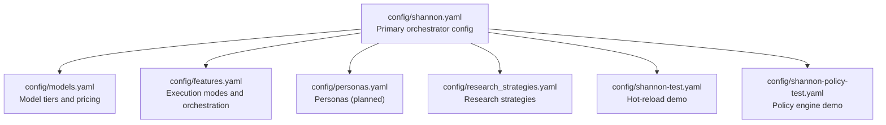
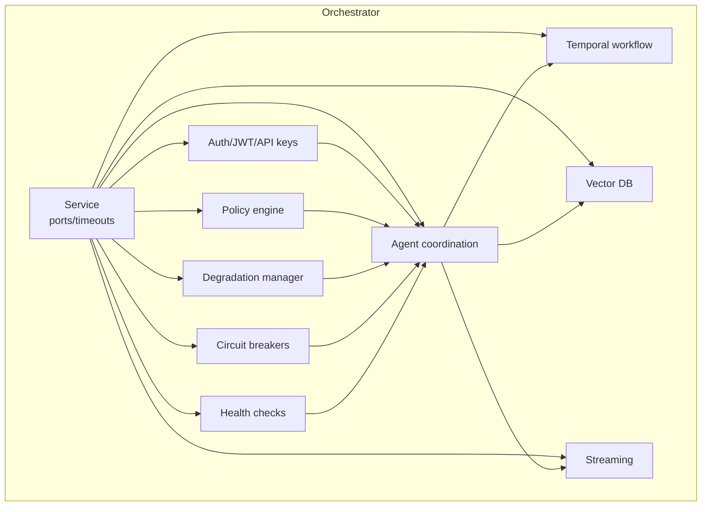
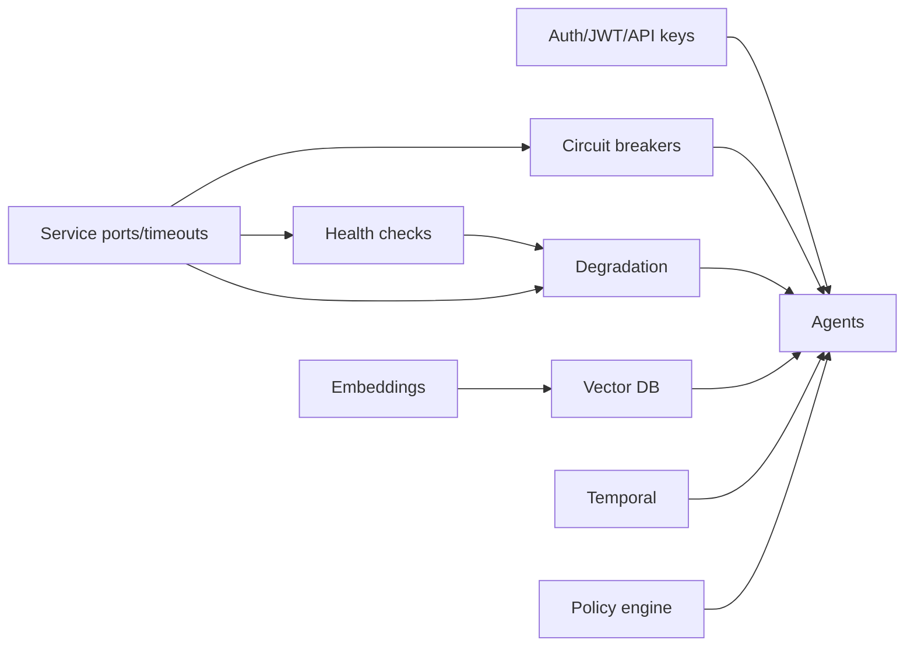

# Shannon Orchestrator Configuration

<cite>
**Referenced Files in This Document**
- [shannon.yaml](file://config/shannon.yaml)
- [shannon-test.yaml](file://config/shannon-test.yaml)
- [shannon-policy-test.yaml](file://config/shannon-policy-test.yaml)
- [models.yaml](file://config/models.yaml)
- [features.yaml](file://config/features.yaml)
- [personas.yaml](file://config/personas.yaml)
- [research_strategies.yaml](file://config/research_strategies.yaml)
</cite>

## Table of Contents
1. [Introduction](#introduction)
2. [Project Structure](#project-structure)
3. [Core Components](#core-components)
4. [Architecture Overview](#architecture-overview)
5. [Detailed Component Analysis](#detailed-component-analysis)
6. [Dependency Analysis](#dependency-analysis)
7. [Performance Considerations](#performance-considerations)
8. [Troubleshooting Guide](#troubleshooting-guide)
9. [Conclusion](#conclusion)
10. [Appendices](#appendices)

## Introduction
This document provides comprehensive configuration guidance for the main Shannon orchestrator configuration file (shannon.yaml). It explains service ports and timeouts, authentication and tenant settings, session and token budget management, circuit breakers for Redis, database, and gRPC, MCP and OpenAPI tools configuration, degradation and health monitoring, agent coordination, policy enforcement, temporal workflow settings, logging, vector database, and streaming parameters. Practical examples and troubleshooting advice are included for common operational scenarios.

## Project Structure
The orchestrator’s primary configuration is defined in the YAML file under the config directory. Supporting configuration files define model tiers, features, personas, and research strategies that influence runtime behavior.

**Diagram sources**
- [shannon.yaml](file://config/shannon.yaml#L1-L378)
- [models.yaml](file://config/models.yaml#L1-L776)
- [features.yaml](file://config/features.yaml#L1-L270)
- [personas.yaml](file://config/personas.yaml#L1-L161)
- [research_strategies.yaml](file://config/research_strategies.yaml#L1-L53)
- [shannon-test.yaml](file://config/shannon-test.yaml#L1-L113)
- [shannon-policy-test.yaml](file://config/shannon-policy-test.yaml#L1-L79)

**Section sources**
- [shannon.yaml](file://config/shannon.yaml#L1-L378)

## Core Components
This section summarizes the main configuration areas and their roles in orchestrator operation.

- Service configuration: Defines the main gRPC port, health port, and HTTP timeouts for graceful shutdown and request handling.
- Authentication: Enables JWT-based authentication, token expirations, API key rate limits, and tenant limits.
- Session management: Controls session TTL, history retention, local cache size, and token budgets per task and agent.
- Circuit breakers: Configures Redis, database, and gRPC circuit breaker thresholds and behavior.
- MCP tools: Declares MCP tool endpoints and parameters with cost and category metadata.
- OpenAPI tools: Declares OpenAPI tool specs with authentication methods and rate limits.
- Degradation and health: Sets thresholds and fallback behaviors for system resilience and periodic health checks.
- Agents and coordination: Defines concurrency, timeouts, retry behavior, and endpoints for agent-core and LLM service.
- Policy enforcement: Enables OPA policy engine, mode, path, and audit settings.
- Temporal workflow: Host, namespace, task queue, and retry policy for workflow execution.
- Logging and tracing: Log level, encoding, output paths, and OTLP tracing configuration.
- Vector database: Qdrant host/port, collection names, embedding model, cache, and MMR settings.
- Streaming and workflows: Ring capacity for event replay and workflow bypass behavior.

**Section sources**
- [shannon.yaml](file://config/shannon.yaml#L4-L378)

## Architecture Overview
The orchestrator reads shannon.yaml at startup and applies hot-reloadable changes. It coordinates agents, manages sessions, enforces policies, and integrates with vector databases and temporal workflows.

**Diagram sources**
- [shannon.yaml](file://config/shannon.yaml#L4-L378)

## Detailed Component Analysis

### Service Configuration
- Port and health port: Main gRPC port and separate health port for probes.
- Timeouts: Graceful shutdown timeout, read timeout, write timeout, and max header bytes for HTTP.
- Typical values:
  - Port: 50052
  - Health port: 8081
  - Graceful timeout: 30s
  - Read/write timeouts: 30s
  - Max header bytes: 2097152

Operational guidance:
- Adjust timeouts for high-latency networks or large payloads.
- Keep health port distinct from main port for dedicated monitoring.

**Section sources**
- [shannon.yaml](file://config/shannon.yaml#L4-L10)

### Authentication and Tenant Management
- Enable authentication globally and optionally skip auth for development.
- JWT settings: secret, access token expiry, refresh token expiry.
- API key limits: per-key request limit and default tenant limit.
- Registration and email verification toggles.

Practical example:
- For production, set a strong JWT secret and enable registration with email verification.

**Section sources**
- [shannon.yaml](file://config/shannon.yaml#L12-L22)

### Session Management
- Session history retention per session in Redis.
- Session TTL and local cache size for active sessions.
- Token budgets:
  - Per task budget
  - Per agent budget

Operational guidance:
- Increase cache size for high concurrency workloads.
- Tune TTL to balance memory usage and session continuity.

**Section sources**
- [shannon.yaml](file://config/shannon.yaml#L23-L29)

### Circuit Breakers
Configured for Redis, database, and gRPC with:
- Max requests per interval
- Interval and timeout
- Max failures before opening
- State change notifications
- Enable/disable flag

Example thresholds:
- Redis: 5 requests, 30s interval, 60s timeout, 5 failures
- Database: 3 requests, 30s interval, 60s timeout, 3 failures
- gRPC: 10 requests, 30s interval, 60s timeout, 10 failures

**Section sources**
- [shannon.yaml](file://config/shannon.yaml#L30-L51)

### MCP Tools Configuration
- Each MCP tool defines:
  - Enabled flag
  - URL and function name
  - Description, category, and cost per use
  - Parameter list with name, type, required flag, and description
  - Optional headers (use environment variable references for secrets)

Security note:
- MCP domains must be allowed via environment variables.
- Use environment variables for sensitive headers.

**Section sources**
- [shannon.yaml](file://config/shannon.yaml#L53-L90)

### OpenAPI Tools Configuration
- Each OpenAPI tool defines:
  - Enabled flag
  - Spec source: URL or inline YAML/JSON
  - Authentication type and config (none, api_key, bearer, basic)
  - Category, base cost, rate limit, timeout, and max response size
  - Optional filters: operations and tags
  - Optional base URL override

Security note:
- Allowed domains must be configured via environment variables.
- Use environment variables for API keys and tokens.

**Section sources**
- [shannon.yaml](file://config/shannon.yaml#L91-L158)

### Degradation Policies and Health Monitoring
- Degradation:
  - Enabled flag and check interval
  - Thresholds for minor, moderate, and severe conditions (CBs open, dependencies down, error rate, latency)
  - Mode downgrade rules for complex/standard/simple/agent DAG
  - Partial results settings: success thresholds, timeout override, and max wait time
  - Fallback behaviors for LLM generation, vector search, agent execution, synthesis, and session updates
- Health:
  - Enabled flag, check interval, and timeout
  - Health port
  - Per-check configuration for Redis, database, agent-core, and LLM service (enabled, critical, timeout, interval)

Operational guidance:
- Start with conservative thresholds and adjust based on observed system behavior.
- Use partial results to improve resiliency under latency or partial failures.

**Section sources**
- [shannon.yaml](file://config/shannon.yaml#L159-L240)

### Agent Coordination Settings
- Max concurrent agents
- Default timeout
- Retry count and backoff
- Agent endpoints:
  - agent-core endpoint
  - LLM service endpoint

**Section sources**
- [shannon.yaml](file://config/shannon.yaml#L241-L249)

### Policy Enforcement Configuration
- Policy engine:
  - Enabled flag
  - Mode: off, dry-run, enforce
  - Path to policies
  - Fail-closed behavior
  - Environment tag
  - Audit settings: enabled, log level, include input/decision

**Section sources**
- [shannon.yaml](file://config/shannon.yaml#L251-L262)

### Temporal Workflow Settings
- Host and port, namespace, task queue
- Workflow timeout
- Retry policy: initial interval, backoff coefficient, maximum interval, maximum attempts

**Section sources**
- [shannon.yaml](file://config/shannon.yaml#L263-L273)

### Logging Configuration
- Level, development mode, encoding
- Output and error output paths

**Section sources**
- [shannon.yaml](file://config/shannon.yaml#L274-L282)

### Vector Database Setup
- Enabled flag, host, port, and collection names
- Search parameters: top-k, threshold, timeout
- Embedding model, cache TTL, and Redis cache toggle
- Redis address and expected embedding dimension
- MMR settings: enable, lambda, pool multiplier

**Section sources**
- [shannon.yaml](file://config/shannon.yaml#L283-L304)

### Embeddings Configuration
- Base URL and default model
- Timeout, cache TTL, and LRU size
- Chunking configuration: enabled, max tokens, overlap, minimum chunk size

**Section sources**
- [shannon.yaml](file://config/shannon.yaml#L305-L318)

### Tracing Configuration
- Enabled flag, service name, and OTLP endpoint

**Section sources**
- [shannon.yaml](file://config/shannon.yaml#L319-L323)

### Streaming Parameters
- Ring capacity: number of recent events retained per workflow for replay

**Section sources**
- [shannon.yaml](file://config/shannon.yaml#L324-L327)

### Workflow Orchestration Behavior
- Bypass single result: skip synthesis when only one successful result exists

**Section sources**
- [shannon.yaml](file://config/shannon.yaml#L328-L331)

### Workflow and Cognitive Workflows
- DAG workflow: simple threshold and max parallel agents
- Complexity thresholds for model tier selection
- Approval workflow: enabled flag, complexity threshold, and dangerous tools list
- Cognitive workflows: exploratory, react, research, scientific iterations and parameters

**Section sources**
- [shannon.yaml](file://config/shannon.yaml#L329-L372)

### Feature Flags
- Ads research workflow flag (open source disabled)

**Section sources**
- [shannon.yaml](file://config/shannon.yaml#L373-L378)

## Dependency Analysis
Configuration interdependencies:
- Authentication affects agent and tool access.
- Circuit breakers protect downstream dependencies (Redis, DB, gRPC).
- Degradation thresholds and fallback behaviors depend on health checks.
- Vector and embeddings settings impact retrieval performance.
- Temporal settings coordinate workflow execution.
- Policy engine influences request gating and auditing.

**Diagram sources**
- [shannon.yaml](file://config/shannon.yaml#L4-L378)

**Section sources**
- [shannon.yaml](file://config/shannon.yaml#L4-L378)

## Performance Considerations
- Circuit breaker tuning: increase intervals and timeouts for high-latency systems; raise failure thresholds cautiously.
- Session and cache sizing: scale cache_size and TTL with expected concurrency and memory footprint.
- Token budgets: align budgets with model pricing and SLAs; monitor usage via metrics.
- Vector search: tune top-k and thresholds to balance recall and latency.
- Temporal retry policy: use exponential backoff to avoid thundering herd effects.
- Logging: switch to JSON encoding and stdout/stderr for containerized deployments.

[No sources needed since this section provides general guidance]

## Troubleshooting Guide
Common configuration issues and resolutions:
- Authentication problems:
  - Verify JWT secret and token expirations.
  - Confirm API key rate limits and tenant limits.
- Circuit breaker false positives:
  - Increase max_requests, interval, or timeout.
  - Lower max_failures for stricter thresholds.
- Health check failures:
  - Adjust check_interval and timeout.
  - Disable non-critical checks temporarily to isolate issues.
- Vector DB connectivity:
  - Verify host, port, and collection names.
  - Check embedding model and dimension alignment.
- Policy engine decisions:
  - Start in dry-run mode and enable audit logs.
  - Review policy path and environment context.
- Temporal workflow stalls:
  - Inspect retry policy and task queue backlog.
  - Validate host and namespace settings.
- Streaming replay issues:
  - Increase ring_capacity for complex workflows.

**Section sources**
- [shannon.yaml](file://config/shannon.yaml#L12-L22)
- [shannon.yaml](file://config/shannon.yaml#L30-L51)
- [shannon.yaml](file://config/shannon.yaml#L214-L240)
- [shannon.yaml](file://config/shannon.yaml#L283-L304)
- [shannon.yaml](file://config/shannon.yaml#L251-L262)
- [shannon.yaml](file://config/shannon.yaml#L263-L273)
- [shannon.yaml](file://config/shannon.yaml#L324-L327)

## Conclusion
The shannon.yaml file centralizes orchestrator behavior, enabling robust operation across authentication, session management, resilience, tooling, vector search, workflows, and observability. Use the provided examples and troubleshooting tips to tailor the configuration to your environment and workload characteristics.

[No sources needed since this section summarizes without analyzing specific files]

## Appendices

### Practical Configuration Scenarios
- Development hot-reload demo:
  - Change health port, timeouts, circuit breaker parameters, and logging configuration.
  - Reference: [shannon-test.yaml](file://config/shannon-test.yaml#L1-L113)
- Policy engine testing:
  - Enable policy engine with dry-run mode and audit logging.
  - Reference: [shannon-policy-test.yaml](file://config/shannon-policy-test.yaml#L1-L79)
- Model tier and cost controls:
  - Configure model tiers, selection strategy, cost controls, and provider settings.
  - Reference: [models.yaml](file://config/models.yaml#L1-L776)
- Execution modes and orchestration:
  - Define execution modes, agent capabilities, orchestration settings, and workflow enhancements.
  - Reference: [features.yaml](file://config/features.yaml#L1-L270)
- Personas (planned):
  - System prompts and tool sets for persona-driven task assignment.
  - Reference: [personas.yaml](file://config/personas.yaml#L1-L161)
- Research strategies:
  - Strategy-specific agent model tiers and iteration counts.
  - Reference: [research_strategies.yaml](file://config/research_strategies.yaml#L1-L53)

**Section sources**
- [shannon-test.yaml](file://config/shannon-test.yaml#L1-L113)
- [shannon-policy-test.yaml](file://config/shannon-policy-test.yaml#L1-L79)
- [models.yaml](file://config/models.yaml#L1-L776)
- [features.yaml](file://config/features.yaml#L1-L270)
- [personas.yaml](file://config/personas.yaml#L1-L161)
- [research_strategies.yaml](file://config/research_strategies.yaml#L1-L53)