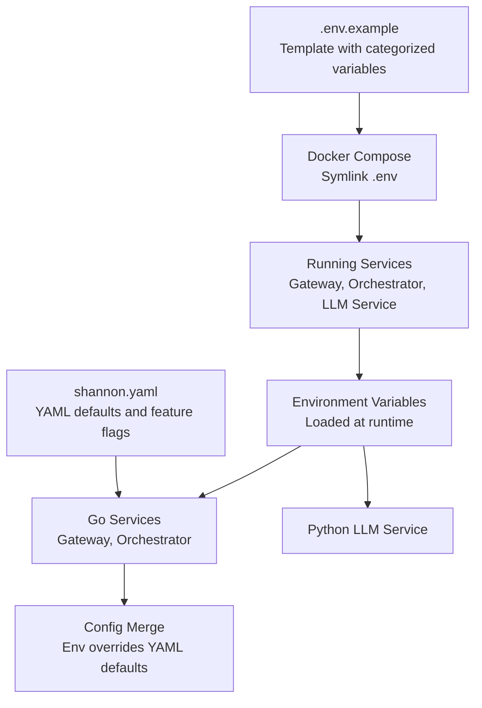
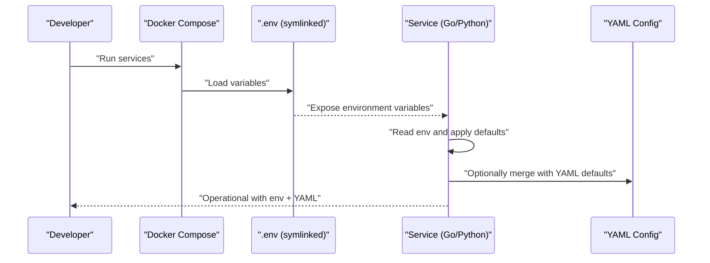
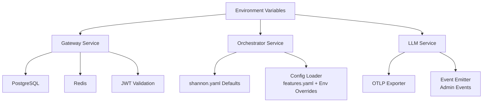

# Environment Variables

<cite>
**Referenced Files in This Document**
- [.env.example](file://.env.example)
- [environment-configuration.md](file://docs/environment-configuration.md)
- [shannon.yaml](file://config/shannon.yaml)
- [config.go](file://go/orchestrator/internal/config/config.go)
- [main.go](file://go/orchestrator/cmd/gateway/main.go)
- [jwt.go](file://go/orchestrator/internal/auth/jwt.go)
- [shannon.go](file://go/orchestrator/internal/config/shannon.go)
- [main.py](file://python/llm-service/main.py)
</cite>

## Table of Contents
1. [Introduction](#introduction)
2. [Project Structure](#project-structure)
3. [Core Components](#core-components)
4. [Architecture Overview](#architecture-overview)
5. [Detailed Component Analysis](#detailed-component-analysis)
6. [Dependency Analysis](#dependency-analysis)
7. [Performance Considerations](#performance-considerations)
8. [Troubleshooting Guide](#troubleshooting-guide)
9. [Conclusion](#conclusion)
10. [Appendices](#appendices)

## Introduction
This document provides comprehensive environment variable documentation for the Shannon platform. It covers all supported variables for API keys, secrets, runtime toggles, and configuration overrides. It explains the .env.example file structure, distinguishes required versus optional variables, and details how environment variables take precedence over YAML configuration. It also includes examples for development, staging, and production environments, along with security best practices and troubleshooting guidance.

## Project Structure
Shannon’s environment configuration spans:
- A root .env.example template with categorized variables
- Docker Compose deployment with symlinked .env
- Go services (gateway, orchestrator) that read environment variables
- Python LLM service that reads environment variables for telemetry and event ingestion
- YAML configuration files (shannon.yaml) that define defaults and can be overridden by environment variables in specific components

**Diagram sources**
- [.env.example](file://.env.example#L1-L248)
- [environment-configuration.md](file://docs/environment-configuration.md#L18-L56)
- [shannon.yaml](file://config/shannon.yaml#L1-L378)
- [config.go](file://go/orchestrator/internal/config/config.go#L34-L58)

**Section sources**
- [.env.example](file://.env.example#L1-L248)
- [environment-configuration.md](file://docs/environment-configuration.md#L18-L56)

## Core Components
This section enumerates the major categories of environment variables and highlights required vs optional variables.

- Core runtime
  - ENVIRONMENT: dev | staging | prod (affects logging and policy)
  - DEBUG: boolean toggle
  - SERVICE_NAME: service identifier used by the Python LLM service
  - Required: No
  - Optional: Yes

- LLM provider API keys (set at least one)
  - OPENAI_API_KEY: required for memory features (embeddings)
  - ANTHROPIC_API_KEY
  - GOOGLE_API_KEY
  - GROQ_API_KEY
  - XAI_API_KEY, XAI_PREFER_RESPONSES
  - DEEPSEEK_API_KEY
  - QWEN_API_KEY
  - MISTRAL_API_KEY
  - AWS_ACCESS_KEY_ID, AWS_SECRET_ACCESS_KEY, AWS_REGION
  - OLLAMA_API_KEY (empty for local Ollama), OLLAMA_BASE_URL
  - Required: At least one provider key; OPENAI_API_KEY required for memory features
  - Optional: All others

- Web search providers
  - WEB_SEARCH_PROVIDER: serpapi | google | bing | exa | firecrawl
  - GOOGLE_SEARCH_API_KEY, GOOGLE_SEARCH_ENGINE_ID
  - SERPAPI_API_KEY
  - BING_API_KEY
  - EXA_API_KEY
  - FIRECRAWL_API_KEY
  - Required: Optional; choose one provider if web search is needed
  - Optional: Yes

- Web fetch provider
  - WEB_FETCH_PROVIDER: firecrawl | exa | python
  - Required: Optional
  - Optional: Yes

- Data stores
  - POSTGRES_HOST, POSTGRES_PORT, POSTGRES_DB, POSTGRES_USER, POSTGRES_PASSWORD, POSTGRES_SSLMODE
  - REDIS_HOST, REDIS_PORT, REDIS_PASSWORD, REDIS_TTL_SECONDS, REDIS_ADDR, REDIS_URL
  - QDRANT_URL, QDRANT_HOST, QDRANT_PORT
  - LLM_REDIS_URL (optional dedicated Redis for LLM caching)
  - Required: Optional; required for full-memory and vector features
  - Optional: Yes

- Service endpoints and configuration files
  - TEMPORAL_HOST
  - LLM_SERVICE_URL
  - AGENT_CORE_ADDR
  - ADMIN_SERVER
  - ORCHESTRATOR_GRPC
  - CONFIG_PATH, MODELS_CONFIG_PATH, SHANNON_CONFIG_PATH
  - EVENTS_INGEST_URL, EVENTS_AUTH_TOKEN, APPROVALS_AUTH_TOKEN
  - Required: Optional; required for inter-service communication
  - Optional: Yes

- Model routing and budgets
  - DEFAULT_MODEL_TIER: small | medium | large
  - COMPLEXITY_MODEL_ID, DECOMPOSITION_MODEL_ID
  - MAX_TOKENS, TEMPERATURE
  - MAX_TOKENS_PER_REQUEST, MAX_COST_PER_REQUEST
  - LLM_DISABLE_BUDGETS
  - HISTORY_WINDOW_MESSAGES, HISTORY_WINDOW_DEBUG_MESSAGES
  - WORKFLOW_SYNTH_BYPASS_SINGLE
  - TOKEN_BUDGET_PER_AGENT
  - Required: Optional
  - Optional: Yes

- Cache and rate limiting
  - ENABLE_CACHE, CACHE_SIMILARITY_THRESHOLD
  - RATE_LIMIT_REQUESTS, RATE_LIMIT_WINDOW
  - PROVIDER_RATE_CONTROL_ENABLED
  - WEB_SEARCH_RATE_LIMIT, CALCULATOR_RATE_LIMIT, PYTHON_EXECUTOR_RATE_LIMIT
  - PARTIAL_CHUNK_CHARS
  - Required: Optional
  - Optional: Yes

- Tool execution and workflow controls
  - TOOL_PARALLELISM
  - ENABLE_TOOL_SELECTION
  - PRIORITY_QUEUES
  - STREAMING_RING_CAPACITY
  - COMPRESSION_TRIGGER_RATIO, COMPRESSION_TARGET_RATIO
  - ENFORCE_TIMEOUT_SECONDS, ENFORCE_MAX_TOKENS
  - ENFORCE_RATE_RPS
  - ENFORCE_CB_ERROR_THRESHOLD, ENFORCE_CB_WINDOW_SECONDS, ENFORCE_CB_MIN_REQUESTS
  - ENFORCE_RATE_REDIS_URL, ENFORCE_RATE_REDIS_PREFIX, ENFORCE_RATE_REDIS_TTL
  - Required: Optional
  - Optional: Yes

- Approvals and security
  - APPROVAL_ENABLED
  - APPROVAL_COMPLEXITY_THRESHOLD
  - APPROVAL_DANGEROUS_TOOLS
  - APPROVAL_TIMEOUT_SECONDS
  - JWT_SECRET: required for production
  - GATEWAY_SKIP_AUTH
  - Required: Optional; JWT_SECRET required for production
  - Optional: Yes

- Templates
  - TEMPLATE_FALLBACK_ENABLED
  - CONTINUOUS_LEARNING_ENABLED
  - TEMPLATES_PATH
  - Required: Optional
  - Optional: Yes

- Observability and telemetry
  - OTEL_SERVICE_NAME, OTEL_EXPORTER_OTLP_ENDPOINT, OTEL_ENABLED
  - LOG_FORMAT, METRICS_PORT
  - Required: Optional
  - Optional: Yes

- Python WASI sandbox
  - PYTHON_WASI_WASM_PATH, PYTHON_WASI_SESSION_TIMEOUT
  - WASI_MEMORY_LIMIT_MB, WASI_TIMEOUT_SECONDS
  - Required: Optional
  - Optional: Yes

- OpenAPI and MCP integrations
  - OPENAPI_ALLOWED_DOMAINS, OPENAPI_MAX_SPEC_SIZE, OPENAPI_FETCH_TIMEOUT, OPENAPI_RETRIES, OPENAPI_LOG_REQUESTS
  - MCP_ALLOWED_DOMAINS, MCP_MAX_RESPONSE_BYTES, MCP_RETRIES, MCP_TIMEOUT_SECONDS, MCP_REGISTER_TOKEN
  - MCP_RATE_LIMIT_DEFAULT, MCP_CB_FAILURES, MCP_CB_RECOVERY_SECONDS, MCP_COST_TO_TOKENS
  - Required: Optional
  - Optional: Yes

- Browser automation (Playwright Service)
  - PLAYWRIGHT_SERVICE_URL
  - BROWSER_SESSION_TTL, BROWSER_MAX_SESSIONS, BROWSER_HEADLESS
  - BROWSER_VIEWPORT_WIDTH, BROWSER_VIEWPORT_HEIGHT
  - Required: Optional
  - Optional: Yes

- Advanced orchestrator controls
  - EVENTLOG_BATCH_SIZE, EVENTLOG_BATCH_INTERVAL_MS
  - RATE_LIMIT_INTERVAL_MS
  - BACKPRESSURE_THRESHOLD, MAX_BACKPRESSURE_DELAY_MS
  - CIRCUIT_FAILURE_THRESHOLD, CIRCUIT_HALF_OPEN_REQUESTS, CIRCUIT_RESET_TIMEOUT_MS
  - WORKER_ACT, WORKER_WF and variants
  - LLM_TIMEOUT_SECONDS
  - Required: Optional
  - Optional: Yes

- Miscellaneous
  - SHANNON_WORKSPACE, SEED_DATA
  - AGENT_TIMEOUT_SECONDS
  - Required: Optional
  - Optional: Yes

**Section sources**
- [.env.example](file://.env.example#L12-L248)

## Architecture Overview
This section explains how environment variables are loaded and how they interact with YAML configuration.

- Docker Compose loading precedence
  - Shell environment variables
  - .env file in the docker-compose directory
  - env_file directive
  - environment section in docker-compose.yml
- Root .env.example provides a comprehensive template; Docker Compose symlinks .env into the compose directory for service discovery.
- Go services (gateway, orchestrator) read environment variables directly and may merge with YAML defaults where applicable.
- Python LLM service reads environment variables for telemetry and event ingestion.

**Diagram sources**
- [environment-configuration.md](file://docs/environment-configuration.md#L18-L56)
- [config.go](file://go/orchestrator/internal/config/config.go#L34-L58)

**Section sources**
- [environment-configuration.md](file://docs/environment-configuration.md#L18-L56)

## Detailed Component Analysis

### Environment Variable Categories and Examples

- Development example
  - Set ENVIRONMENT=dev, DEBUG=true, JWT_SECRET for local development
  - Use minimal providers (e.g., OPENAI_API_KEY for memory)
  - Keep GATEWAY_SKIP_AUTH=1 for easy local testing
  - Reference: [Development guidance](file://.env.example#L12-L16)

- Staging example
  - Set ENVIRONMENT=staging, enable OTEL_ENABLED=false or true depending on needs
  - Use real provider keys; configure REDIS_URL, POSTGRES_* securely
  - Set JWT_SECRET to a strong secret; disable GATEWAY_SKIP_AUTH
  - Reference: [Staging guidance](file://.env.example#L12-L16)

- Production example
  - Set ENVIRONMENT=prod, enable OTEL_ENABLED=true
  - Use strong JWT_SECRET generated via secure randomness
  - Configure all data stores (Postgres, Redis, Qdrant) with production endpoints
  - Provide all required provider keys; restrict MCP/OpenAPI domains
  - Reference: [Production guidance](file://.env.example#L12-L16)

- Required vs optional
  - Required for memory features: OPENAI_API_KEY
  - Required for security: JWT_SECRET (production)
  - Optional: All other variables; choose providers and features as needed
  - Reference: [Required variables](file://docs/environment-configuration.md#L62-L83)

**Section sources**
- [.env.example](file://.env.example#L12-L248)
- [environment-configuration.md](file://docs/environment-configuration.md#L62-L140)

### JWT Secrets and Security
- JWT_SECRET is used by the gateway and orchestrator for signing access tokens.
- The gateway initializes JWTManager with the secret and uses it for token validation.
- The orchestrator YAML defines a default JWT secret; environment variables override it.
- Security best practices:
  - Generate a cryptographically secure secret for production
  - Do not commit secrets to version control
  - Rotate secrets periodically and revoke stale sessions
- References:
  - [Gateway JWT initialization](file://go/orchestrator/cmd/gateway/main.go#L93-L95)
  - [JWT manager](file://go/orchestrator/internal/auth/jwt.go#L26-L33)
  - [Orchestrator default JWT secret](file://config/shannon.yaml#L15-L15)

**Section sources**
- [main.go](file://go/orchestrator/cmd/gateway/main.go#L93-L95)
- [jwt.go](file://go/orchestrator/internal/auth/jwt.go#L26-L33)
- [shannon.yaml](file://config/shannon.yaml#L15-L15)

### Database Connection Strings
- Postgres configuration is read from environment variables and passed to the database client.
- Variables include host, port, database name, user, password, and SSL mode.
- Reference: [Postgres config usage](file://go/orchestrator/cmd/gateway/main.go#L59-L66)

**Section sources**
- [main.go](file://go/orchestrator/cmd/gateway/main.go#L59-L66)

### Redis Configuration
- Redis URL is parsed and used for rate limiting, idempotency, and caching.
- Variables include REDIS_URL, REDIS_ADDR, REDIS_TTL_SECONDS, and optional LLM_REDIS_URL.
- Reference: [Redis client initialization](file://go/orchestrator/cmd/gateway/main.go#L78-L84)

**Section sources**
- [main.go](file://go/orchestrator/cmd/gateway/main.go#L78-L84)

### Provider API Keys
- LLM providers: OPENAI_API_KEY, ANTHROPIC_API_KEY, GOOGLE_API_KEY, GROQ_API_KEY, XAI_API_KEY, DEEPSEEK_API_KEY, QWEN_API_KEY, MISTRAL_API_KEY, AWS_ACCESS_KEY_ID/SECRET_ACCESS_KEY/REGION, OLLAMA_API_KEY/BASE_URL
- Web search: WEB_SEARCH_PROVIDER plus provider-specific keys
- Web fetch: WEB_FETCH_PROVIDER plus provider-specific keys
- Reference: [Provider variables](file://.env.example#L17-L61)

**Section sources**
- [.env.example](file://.env.example#L17-L61)

### YAML Configuration Precedence
- The Go configuration loader reads features.yaml and supports environment overrides for selected runtime knobs.
- Examples of environment overrides:
  - WORKFLOW_SYNTH_BYPASS_SINGLE
  - TOOL_PARALLELISM
  - ENABLE_TOOL_SELECTION
  - PROVIDER_RATE_CONTROL_ENABLED
  - BACKPRESSURE_THRESHOLD, MAX_BACKPRESSURE_DELAY_MS
  - CIRCUIT_FAILURE_THRESHOLD, CIRCUIT_RESET_TIMEOUT_MS, CIRCUIT_HALF_OPEN_REQUESTS
  - RATE_LIMIT_REQUESTS, RATE_LIMIT_INTERVAL_MS
- The orchestrator YAML defines defaults for auth, logging, vector, and other subsystems; environment variables override where applicable.
- References:
  - [Features loader and env overrides](file://go/orchestrator/internal/config/config.go#L34-L58)
  - [Workflow runtime resolution](file://go/orchestrator/internal/config/config.go#L227-L263)
  - [Enforcement runtime resolution](file://go/orchestrator/internal/config/config.go#L285-L303)
  - [Budget env overrides](file://go/orchestrator/internal/config/config.go#L127-L215)
  - [Orchestrator defaults](file://config/shannon.yaml#L12-L378)

**Section sources**
- [config.go](file://go/orchestrator/internal/config/config.go#L34-L58)
- [config.go](file://go/orchestrator/internal/config/config.go#L127-L215)
- [config.go](file://go/orchestrator/internal/config/config.go#L227-L263)
- [config.go](file://go/orchestrator/internal/config/config.go#L285-L303)
- [shannon.go](file://go/orchestrator/internal/config/shannon.go#L327-L570)
- [shannon.yaml](file://config/shannon.yaml#L12-L378)

### Observability and Telemetry
- OpenTelemetry variables: OTEL_SERVICE_NAME, OTEL_EXPORTER_OTLP_ENDPOINT, OTEL_ENABLED
- Metrics port override: METRICS_PORT
- Logging format: LOG_FORMAT
- Reference: [LLM service telemetry](file://python/llm-service/main.py#L48-L69)

**Section sources**
- [main.py](file://python/llm-service/main.py#L48-L69)
- [.env.example](file://.env.example#L172-L178)

## Dependency Analysis
This section maps how environment variables influence service behavior and configuration merging.

**Diagram sources**
- [main.go](file://go/orchestrator/cmd/gateway/main.go#L59-L95)
- [config.go](file://go/orchestrator/internal/config/config.go#L34-L58)
- [shannon.go](file://go/orchestrator/internal/config/shannon.go#L327-L570)
- [main.py](file://python/llm-service/main.py#L48-L99)

**Section sources**
- [main.go](file://go/orchestrator/cmd/gateway/main.go#L59-L95)
- [config.go](file://go/orchestrator/internal/config/config.go#L34-L58)
- [shannon.go](file://go/orchestrator/internal/config/shannon.go#L327-L570)
- [main.py](file://python/llm-service/main.py#L48-L99)

## Performance Considerations
- Use environment overrides for rate limits and timeouts to tune performance per environment.
- Prefer domain restrictions for MCP and OpenAPI integrations to reduce overhead.
- Tune streaming and compression ratios for memory-bound workloads.
- Monitor metrics via METRICS_PORT and adjust capacity accordingly.

[No sources needed since this section provides general guidance]

## Troubleshooting Guide
Common environment configuration issues and resolutions:

- Missing web search provider
  - Symptom: Error indicating no web search provider configured
  - Resolution: Set WEB_SEARCH_PROVIDER and the corresponding API key; ensure .env symlink is in place
  - Reference: [Issue and solution](file://docs/environment-configuration.md#L143-L156)

- Docker Compose warnings about missing variables
  - Symptom: Build-time warnings about unset variables
  - Resolution: These are often safe if the symlink exists and variables are present inside containers
  - Reference: [Warnings and verification](file://docs/environment-configuration.md#L157-L168)

- Rate limit errors in multi-agent execution
  - Symptom: Rate limit exceeded errors
  - Resolution: The codebase now applies per-session rate limiting; verify tool-specific limits and service versions
  - Reference: [Resolution note](file://docs/environment-configuration.md#L169-L176)

- WASI interpreter path invalid
  - Symptom: Python tool execution fails due to missing WASI runtime
  - Resolution: Set PYTHON_WASI_WASM_PATH to the correct path for your environment
  - Reference: [WASI path guidance](file://docs/environment-configuration.md#L177-L191)

- Verifying environment variables
  - Use docker compose config and exec commands to confirm variables are loaded
  - Reference: [Troubleshooting commands](file://docs/environment-configuration.md#L264-L282)

**Section sources**
- [environment-configuration.md](file://docs/environment-configuration.md#L143-L191)
- [environment-configuration.md](file://docs/environment-configuration.md#L264-L282)

## Conclusion
Shannon’s environment configuration combines a comprehensive .env.example template with Docker Compose precedence and targeted YAML defaults. By understanding which variables are required for specific features (e.g., memory, security), how environment variables override YAML defaults, and how to apply security best practices, teams can deploy Shannon reliably across development, staging, and production environments.

[No sources needed since this section summarizes without analyzing specific files]

## Appendices

### Environment Variable Precedence Summary
- Docker Compose precedence: Shell env > .env symlink > env_file > environment section
- Gateway and orchestrator services read environment variables directly
- Selected runtime knobs can be overridden via environment variables even when defaults exist in YAML
- References:
  - [Compose precedence](file://docs/environment-configuration.md#L18-L26)
  - [Gateway env usage](file://go/orchestrator/cmd/gateway/main.go#L59-L100)
  - [Config loader and overrides](file://go/orchestrator/internal/config/config.go#L34-L58)

**Section sources**
- [environment-configuration.md](file://docs/environment-configuration.md#L18-L26)
- [main.go](file://go/orchestrator/cmd/gateway/main.go#L59-L100)
- [config.go](file://go/orchestrator/internal/config/config.go#L34-L58)