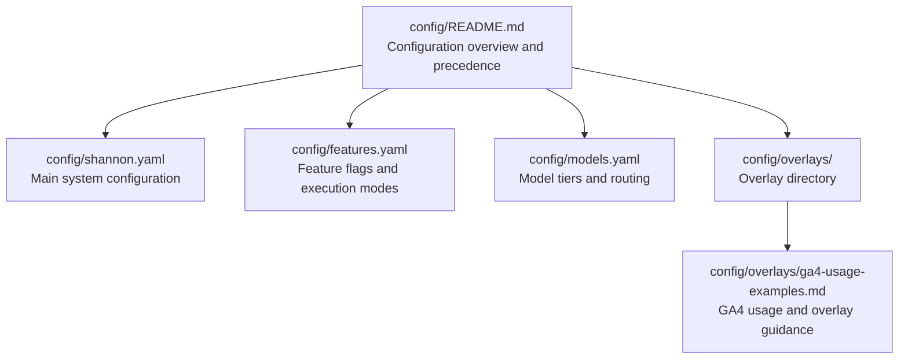
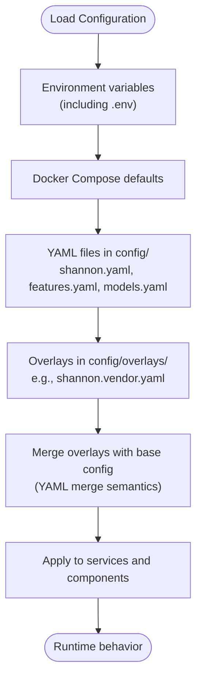
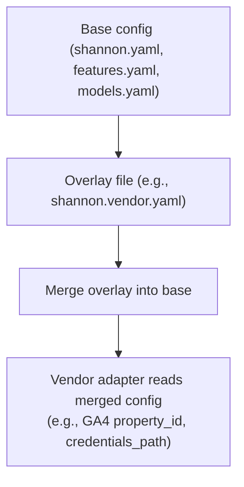
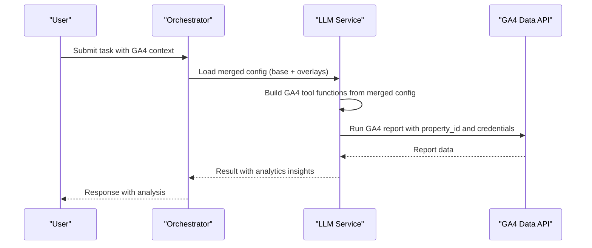
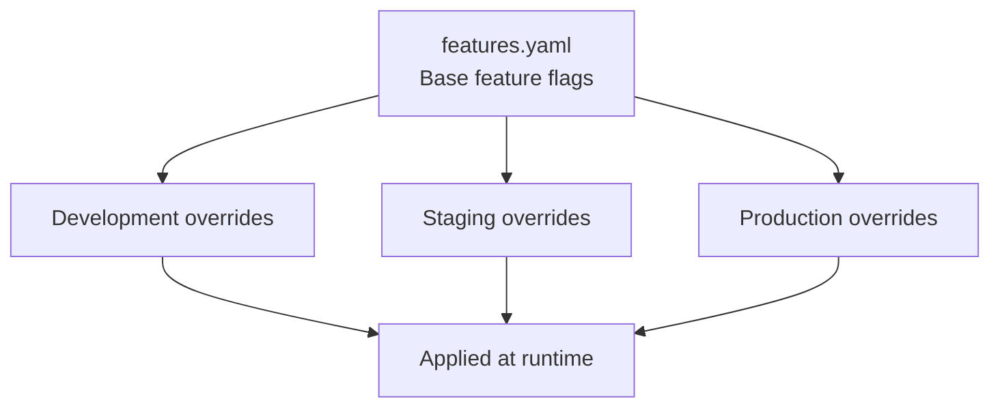
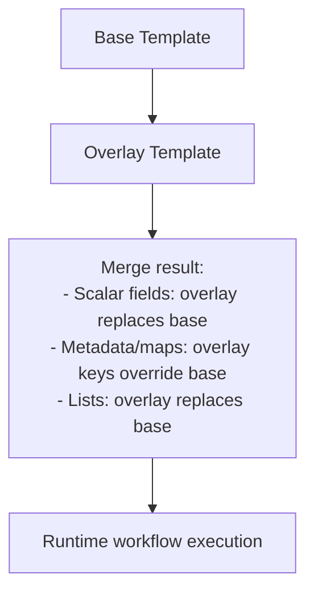
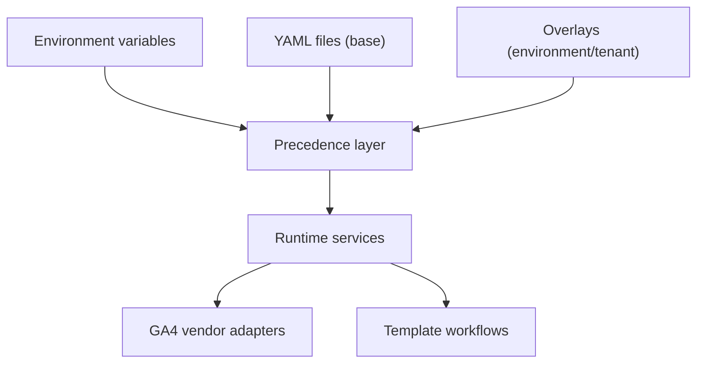

# Overlay Configuration

<cite>
**Referenced Files in This Document**
- [config/README.md](file://config/README.md)
- [config/shannon.yaml](file://config/shannon.yaml)
- [config/features.yaml](file://config/features.yaml)
- [config/models.yaml](file://config/models.yaml)
- [config/overlays/ga4-usage-examples.md](file://config/overlays/ga4-usage-examples.md)
- [python/llm-service/llm_service/roles/ga4/analytics_agent.py](file://python/llm-service/llm_service/roles/ga4/analytics_agent.py)
- [go/orchestrator/internal/templates/registry.go](file://go/orchestrator/internal/templates/registry.go)
</cite>

## Table of Contents
1. [Introduction](#introduction)
2. [Project Structure](#project-structure)
3. [Core Components](#core-components)
4. [Architecture Overview](#architecture-overview)
5. [Detailed Component Analysis](#detailed-component-analysis)
6. [Dependency Analysis](#dependency-analysis)
7. [Performance Considerations](#performance-considerations)
8. [Troubleshooting Guide](#troubleshooting-guide)
9. [Conclusion](#conclusion)
10. [Appendices](#appendices)

## Introduction
This document explains Shannon’s configuration overlay system for environment-specific customization and feature enablement. It covers the overlay directory structure, YAML merge semantics, precedence rules, and practical examples such as GA4 usage configuration and OpenAPI tool overlays. It also provides guidance on creating custom overlays, managing configuration complexity across environments, and validating and deploying overlays safely.

## Project Structure
Shannon organizes configuration under the config directory, with dedicated files for system-wide settings, feature flags, model routing, and overlays. Overlays are intended to augment or override base configuration for specific environments or tenants.

**Diagram sources**
- [config/README.md](file://config/README.md#L1-L305)
- [config/shannon.yaml](file://config/shannon.yaml#L1-L378)
- [config/features.yaml](file://config/features.yaml#L1-L270)
- [config/models.yaml](file://config/models.yaml#L1-L776)
- [config/overlays/ga4-usage-examples.md](file://config/overlays/ga4-usage-examples.md#L1-L575)

**Section sources**
- [config/README.md](file://config/README.md#L1-L305)

## Core Components
- Main system configuration: defines service ports, authentication, policy engine, circuit breakers, degradation, health checks, orchestration, logging, vector DB, tracing, streaming, workflow orchestration, and feature flags.
- Feature flags: controls execution modes, agent behavior, orchestration, workflows, enforcement, learning, security, storage, observability, and environment-specific overrides.
- Model configuration: defines model tiers, selection strategy, cost controls, provider settings, catalog, capabilities, rate limits, and monitoring.
- Overlays: environment-specific or tenant-specific YAML fragments that override or extend base configuration. The repository documents an overlay for GA4 vendor adapters and outlines how overlays integrate with tool definitions.

Practical examples:
- GA4 usage overlay: demonstrates how to supply GA4 property ID and credentials via an overlay file and how to use OAuth access tokens per request for multi-tenant scenarios.
- OpenAPI tool overlays: the main configuration comments indicate vendor-specific tool collections should be configured via overlays.

**Section sources**
- [config/shannon.yaml](file://config/shannon.yaml#L1-L378)
- [config/features.yaml](file://config/features.yaml#L1-L270)
- [config/models.yaml](file://config/models.yaml#L1-L776)
- [config/overlays/ga4-usage-examples.md](file://config/overlays/ga4-usage-examples.md#L1-L575)

## Architecture Overview
Shannon’s configuration system applies a layered precedence model. Values from higher-precedence sources override lower-precedence ones. Overlays are applied as part of the configuration loading process to customize behavior per environment or tenant.

**Diagram sources**
- [config/README.md](file://config/README.md#L5-L11)
- [config/overlays/ga4-usage-examples.md](file://config/overlays/ga4-usage-examples.md#L64-L71)

## Detailed Component Analysis

### Overlay Directory and YAML Merge Semantics
- Location: Overlays live under config/overlays/. The repository includes a GA4 usage guide that demonstrates creating an overlay file named shannon.vendor.yaml to define vendor-specific settings such as GA4 property ID and credentials path.
- Merge intent: Overlays are intended to override or extend base configuration values. While the repository does not include a dedicated overlay merging library, the GA4 guide illustrates the expected outcome: supplying GA4 credentials and property ID via an overlay file so that vendor adapters can access them at runtime.
- Practical guidance: Place environment-specific or tenant-specific settings in overlay files and ensure they align with the base configuration schema. For vendor adapters, supply credentials and identifiers through overlays to keep secrets out of version control.

**Diagram sources**
- [config/overlays/ga4-usage-examples.md](file://config/overlays/ga4-usage-examples.md#L64-L71)
- [python/llm-service/llm_service/roles/ga4/analytics_agent.py](file://python/llm-service/llm_service/roles/ga4/analytics_agent.py#L13-L60)

**Section sources**
- [config/overlays/ga4-usage-examples.md](file://config/overlays/ga4-usage-examples.md#L1-L575)

### GA4 Usage Configuration Overlay
- Purpose: Enable GA4 analytics tools by providing property ID and service account credentials via an overlay.
- Steps:
  - Create a service account and download a JSON key file into config/overlays/.
  - Grant the service account viewer access to the GA4 property.
  - Define ga4.property_id and ga4.credentials_path in an overlay file (e.g., shannon.vendor.yaml).
  - Optionally use OAuth access tokens per request for multi-tenant scenarios.
- Runtime behavior: The GA4 analytics role preset dynamically constructs tool functions and schemas using the merged configuration, enabling queries against the GA4 Data API.

**Diagram sources**
- [config/overlays/ga4-usage-examples.md](file://config/overlays/ga4-usage-examples.md#L64-L71)
- [python/llm-service/llm_service/roles/ga4/analytics_agent.py](file://python/llm-service/llm_service/roles/ga4/analytics_agent.py#L13-L60)

**Section sources**
- [config/overlays/ga4-usage-examples.md](file://config/overlays/ga4-usage-examples.md#L1-L575)
- [python/llm-service/llm_service/roles/ga4/analytics_agent.py](file://python/llm-service/llm_service/roles/ga4/analytics_agent.py#L1-L341)

### Feature Flag Overlays and Environment-Specific Customizations
- Base configuration: The features.yaml file defines execution modes, agent behavior, orchestration, workflows, enforcement, learning, security, storage, observability, and experimental features.
- Environment overrides: The environments section enables environment-specific toggles such as debug mode, authentication, authorization, and experimental feature flags for development, staging, and production.
- Practical usage: Use overlays to adjust feature flags per environment. For example, enable continuous learning in staging while keeping it disabled in production.

**Diagram sources**
- [config/features.yaml](file://config/features.yaml#L253-L270)

**Section sources**
- [config/features.yaml](file://config/features.yaml#L1-L270)

### Template and Workflow Overlays (YAML Merge Behavior)
- The Go orchestrator includes a template registry that merges base and overlay templates. The merge logic demonstrates how overlay values replace base values when present, and how metadata, nodes, and edges are handled.
- Implication for configuration overlays: When applying overlays to template-based workflows, fields present in the overlay replace those in the base template. This mirrors typical YAML merge semantics: scalar values and nested maps are overridden by overlay values, while lists are replaced.

**Diagram sources**
- [go/orchestrator/internal/templates/registry.go](file://go/orchestrator/internal/templates/registry.go#L318-L377)

**Section sources**
- [go/orchestrator/internal/templates/registry.go](file://go/orchestrator/internal/templates/registry.go#L318-L377)

### OpenAPI Tool Overlays
- The main configuration indicates vendor-specific tool collections should be configured via overlays. This aligns with the overlay directory structure and the principle of keeping environment-specific tool definitions out of the base configuration.
- Guidance: Define OpenAPI tool sets in overlay files and reference them from the base configuration. This keeps vendor credentials and endpoint details environment-specific and secure.

**Section sources**
- [config/shannon.yaml](file://config/shannon.yaml#L94-L97)

## Dependency Analysis
- Configuration precedence influences which values take effect at runtime. Environment variables override YAML files, and overlays further refine the effective configuration.
- Vendor adapters depend on merged configuration values (e.g., GA4 property ID and credentials). The GA4 analytics role preset constructs tool functions from the merged configuration.
- Template overlays influence workflow execution by overriding template defaults, metadata, nodes, and edges.

**Diagram sources**
- [config/README.md](file://config/README.md#L5-L11)
- [config/overlays/ga4-usage-examples.md](file://config/overlays/ga4-usage-examples.md#L64-L71)
- [python/llm-service/llm_service/roles/ga4/analytics_agent.py](file://python/llm-service/llm_service/roles/ga4/analytics_agent.py#L13-L60)
- [go/orchestrator/internal/templates/registry.go](file://go/orchestrator/internal/templates/registry.go#L318-L377)

**Section sources**
- [config/README.md](file://config/README.md#L5-L11)
- [config/overlays/ga4-usage-examples.md](file://config/overlays/ga4-usage-examples.md#L1-L575)
- [python/llm-service/llm-service/roles/ga4/analytics_agent.py](file://python/llm-service/llm_service/roles/ga4/analytics_agent.py#L1-L341)
- [go/orchestrator/internal/templates/registry.go](file://go/orchestrator/internal/templates/registry.go#L318-L377)

## Performance Considerations
- Hot-reload capability allows most configuration changes to apply without restarting services, reducing downtime during iterative tuning.
- Overlays should be kept minimal and targeted to avoid excessive merge complexity and to maintain fast reload times.
- For vendor adapters, ensure credentials and endpoints are efficient and cached where appropriate to minimize latency.

**Section sources**
- [config/README.md](file://config/README.md#L181-L207)

## Troubleshooting Guide
- Configuration not loading: Verify file permissions, syntax, and that the orchestrator logs show configuration load success.
- Hot-reload not working: Confirm file watchers detect changes and review configuration manager logs for reload activity.
- Invalid configuration values: Inspect logs for validation errors and revert to a known-good backup if necessary.
- GA4 tools unavailable: Ensure the overlay includes ga4.property_id and ga4.credentials_path and that the service account has proper permissions.

**Section sources**
- [config/README.md](file://config/README.md#L267-L297)
- [config/overlays/ga4-usage-examples.md](file://config/overlays/ga4-usage-examples.md#L546-L562)

## Conclusion
Shannon’s overlay system provides a flexible, layered approach to environment-specific configuration and feature enablement. By organizing overlays under config/overlays/, applying clear precedence rules, and leveraging YAML merge semantics, teams can safely manage complexity across development, staging, and production environments. The GA4 usage examples demonstrate how to supply vendor credentials via overlays, while the template registry illustrates how overlays integrate with workflow configurations.

## Appendices

### Overlay Precedence and Merge Semantics
- Precedence order (highest to lowest):
  1. Environment variables (including .env files or runtime exports)
  2. Docker Compose defaults
  3. YAML configuration files in config/
  4. Overlays in config/overlays/
- Merge behavior:
  - Scalar values: overlay replaces base
  - Nested maps: overlay keys override base keys
  - Lists: overlay replaces base list
  - Metadata and template nodes/edges: overlay replaces base where present

**Section sources**
- [config/README.md](file://config/README.md#L5-L11)
- [go/orchestrator/internal/templates/registry.go](file://go/orchestrator/internal/templates/registry.go#L318-L377)

### Practical Overlay Creation Checklist
- Identify environment or tenant needs (e.g., vendor credentials, feature flags, tool endpoints).
- Create or edit an overlay file under config/overlays/ with the appropriate schema.
- Keep secrets out of version control by placing sensitive files in config/overlays/ and ensuring they are gitignored.
- Validate configuration changes using the documented hot-reload workflow and monitoring.
- Document rationale for changes and maintain backups of working configurations.

**Section sources**
- [config/overlays/ga4-usage-examples.md](file://config/overlays/ga4-usage-examples.md#L1-L575)
- [config/README.md](file://config/README.md#L235-L266)