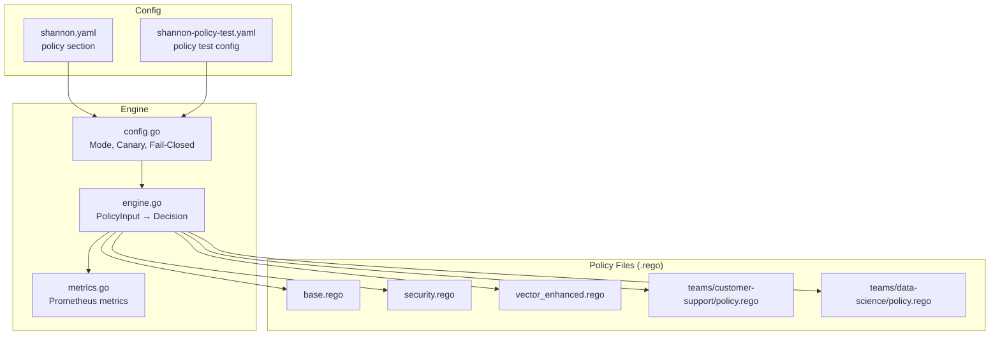
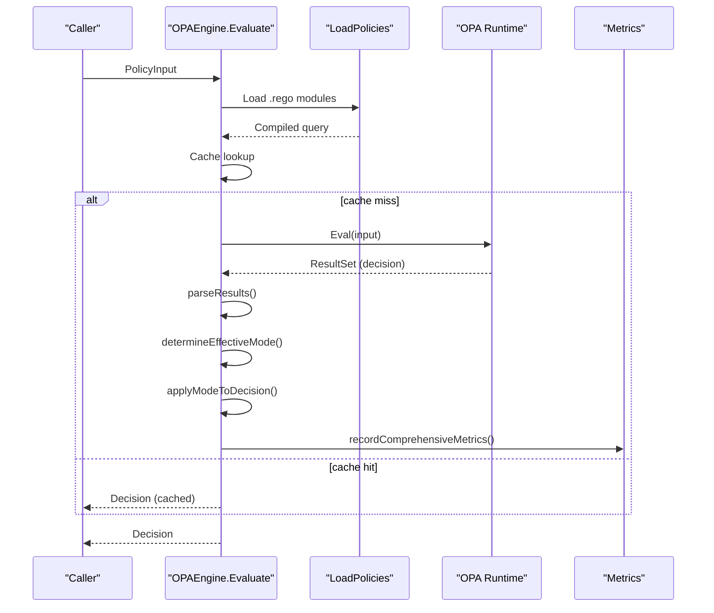
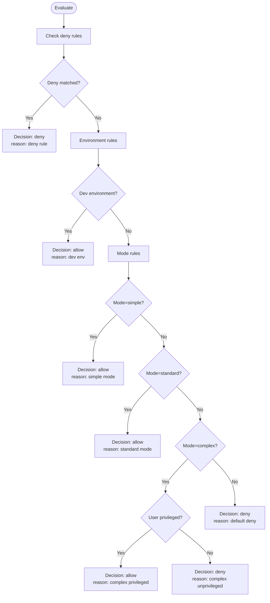
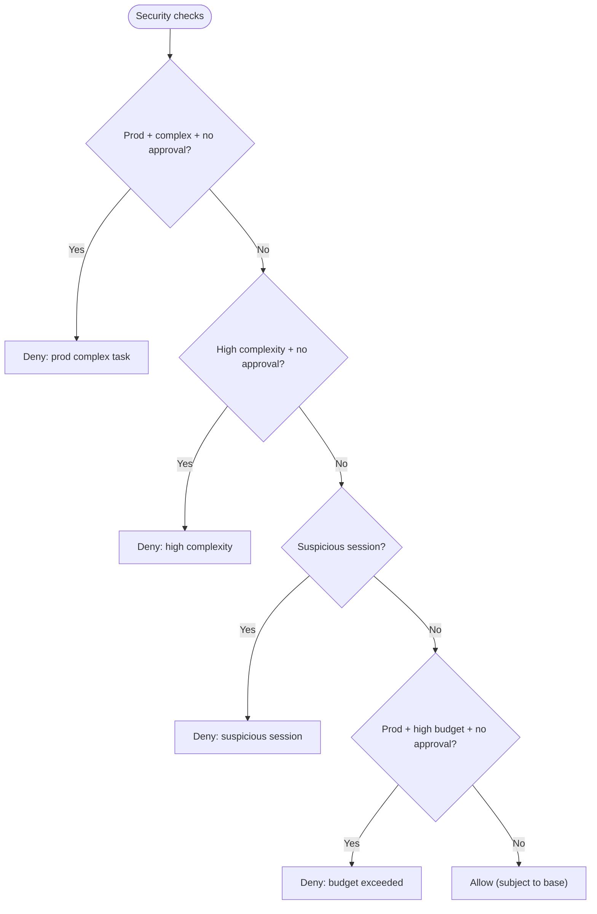
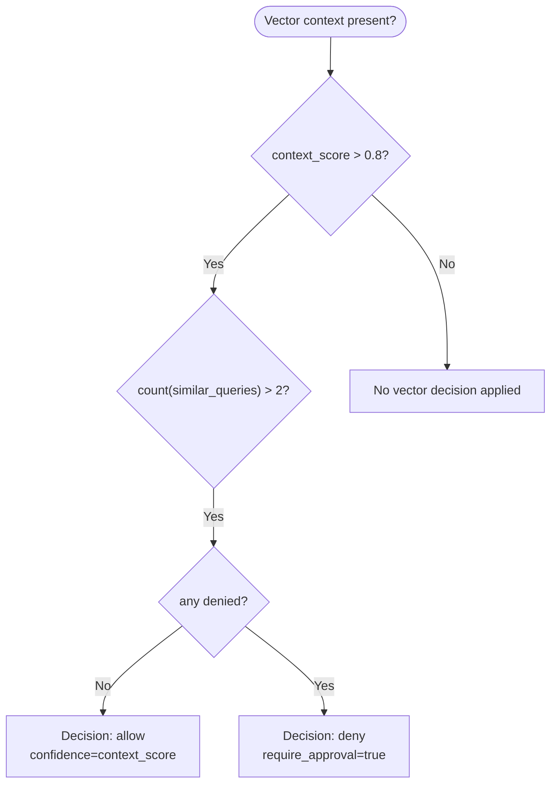
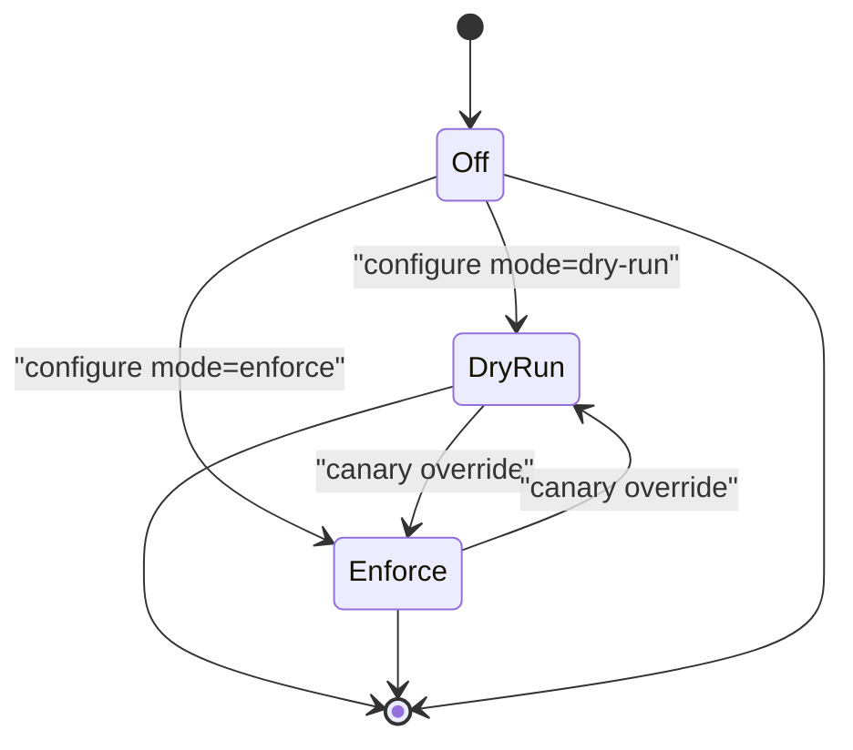
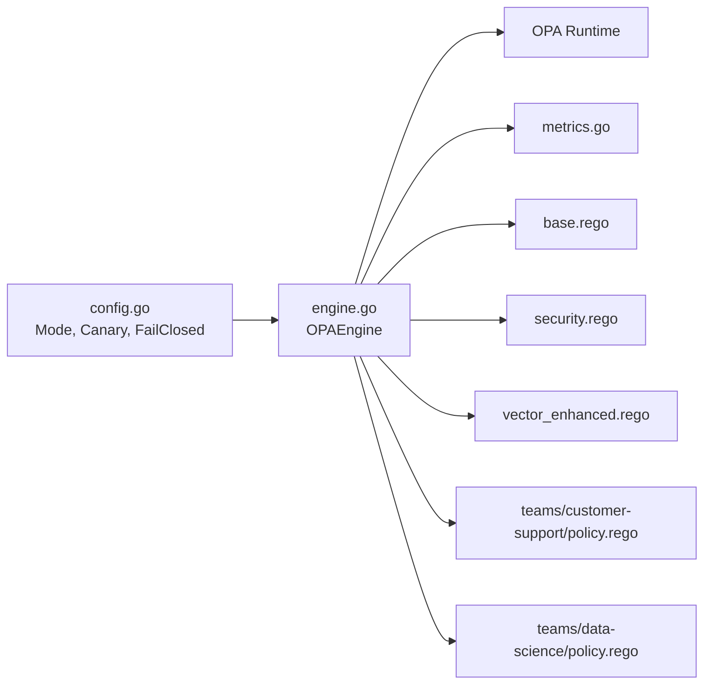
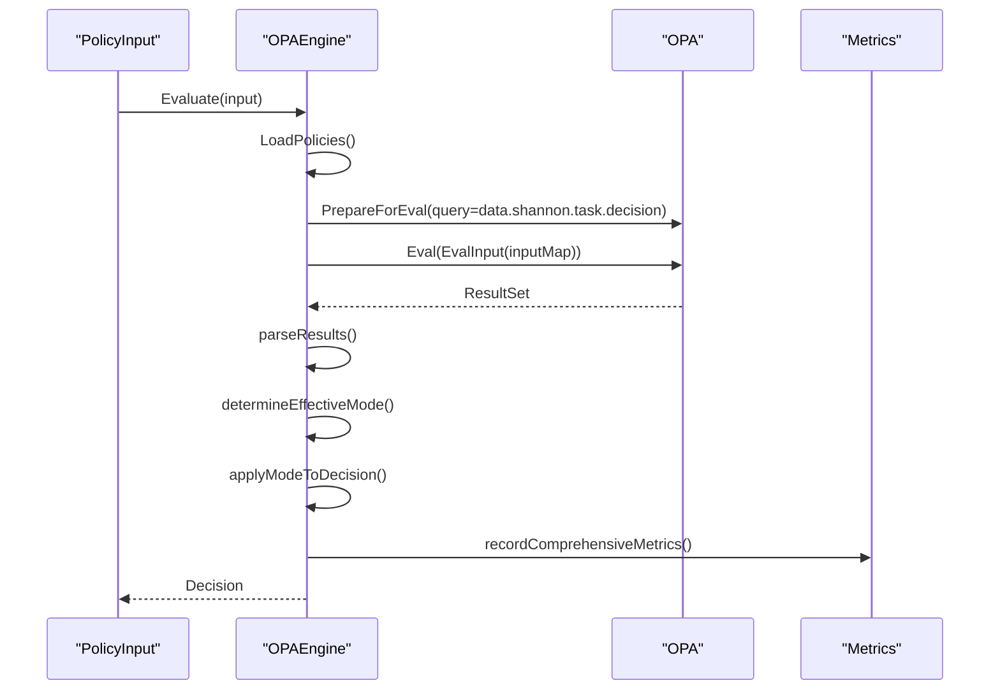

# Policy Configuration

<cite>
**Referenced Files in This Document**
- [base.rego](file://config/opa/policies/base.rego)
- [security.rego](file://config/opa/policies/security.rego)
- [vector_enhanced.rego](file://config/opa/policies/vector_enhanced.rego)
- [customer-support policy.rego](file://config/opa/policies/teams/customer-support/policy.rego)
- [data-science policy.rego](file://config/opa/policies/teams/data-science/policy.rego)
- [OPA README](file://config/opa/README.md)
- [Policy Engine: engine.go](file://go/orchestrator/internal/policy/engine.go)
- [Policy Engine: config.go](file://go/orchestrator/internal/policy/config.go)
- [Policy Engine: metrics.go](file://go/orchestrator/internal/policy/metrics.go)
- [Shannon config: shannon.yaml](file://config/shannon.yaml)
- [Policy test config: shannon-policy-test.yaml](file://config/shannon-policy-test.yaml)
- [Policy load tests script](file://go/orchestrator/scripts/run-policy-load-tests.sh)
</cite>

## Table of Contents
1. [Introduction](#introduction)
2. [Project Structure](#project-structure)
3. [Core Components](#core-components)
4. [Architecture Overview](#architecture-overview)
5. [Detailed Component Analysis](#detailed-component-analysis)
6. [Dependency Analysis](#dependency-analysis)
7. [Performance Considerations](#performance-considerations)
8. [Troubleshooting Guide](#troubleshooting-guide)
9. [Conclusion](#conclusion)
10. [Appendices](#appendices)

## Introduction
This document describes the Open Policy Agent (OPA) integration for Shannon’s policy engine. It explains the policy directory structure, the Rego language constructs used across policies, and how policy evaluation integrates with the orchestrator. It covers:
- Base allowlist/deny rules
- Security overrides
- Vector-enhanced decision logic
- Team-specific policies for customer support and data science
- Policy evaluation context, decision logging, and audit trails
- Policy modes (off, dry-run, enforce), fail-closed/fail-open behavior
- Custom policy development, testing, and troubleshooting

## Project Structure
The policy system is organized around a central OPA policy directory with modular files:
- Core policies: base.rego, security.rego, vector_enhanced.rego
- Team-specific policies: teams/customer-support/policy.rego, teams/data-science/policy.rego
- Engine and configuration: policy engine implementation, config, and metrics
- Configuration: shannon.yaml and a dedicated policy test config

**Diagram sources**
- [base.rego](file://config/opa/policies/base.rego#L1-L272)
- [security.rego](file://config/opa/policies/security.rego#L1-L52)
- [vector_enhanced.rego](file://config/opa/policies/vector_enhanced.rego#L1-L28)
- [customer-support policy.rego](file://config/opa/policies/teams/customer-support/policy.rego#L1-L45)
- [data-science policy.rego](file://config/opa/policies/teams/data-science/policy.rego#L1-L37)
- [Policy Engine: engine.go](file://go/orchestrator/internal/policy/engine.go#L1-L748)
- [Policy Engine: config.go](file://go/orchestrator/internal/policy/config.go#L1-L296)
- [Policy Engine: metrics.go](file://go/orchestrator/internal/policy/metrics.go#L1-L232)
- [Shannon config: shannon.yaml](file://config/shannon.yaml#L251-L262)
- [Policy test config: shannon-policy-test.yaml](file://config/shannon-policy-test.yaml#L16-L26)

**Section sources**
- [OPA README](file://config/opa/README.md#L81-L96)
- [Shannon config: shannon.yaml](file://config/shannon.yaml#L251-L262)

## Core Components
- PolicyInput: The request context passed to OPA, including identifiers, query, mode, environment, IP address, complexity score, token budget, optional vector-enhanced fields, and timestamp.
- Decision: The structured result returned by the policy engine, including allow flag, reason, optional require_approval, obligations, policy version, and audit tags.
- OPAEngine: Loads and compiles all .rego files from the configured path, evaluates against PolicyInput, applies canary/dry-run/enforce logic, and records metrics.
- Config: Defines operational modes (off/dry-run/enforce), fail-closed behavior, environment, canary rollout, and emergency kill switch.
- Metrics: Exposes Prometheus metrics for evaluations, durations, cache performance, canary routing, deny reasons, policy load/version, and SLOs.

**Section sources**
- [Policy Engine: engine.go](file://go/orchestrator/internal/policy/engine.go#L32-L83)
- [Policy Engine: engine.go](file://go/orchestrator/internal/policy/engine.go#L197-L282)
- [Policy Engine: config.go](file://go/orchestrator/internal/policy/config.go#L59-L83)
- [Policy Engine: metrics.go](file://go/orchestrator/internal/policy/metrics.go#L11-L143)

## Architecture Overview
The policy engine compiles all Rego modules under the configured path and evaluates them against a unified decision query. The engine supports:
- Deny-before-allow precedence
- Environment-specific rules
- Team-specific allowances
- Vector-enhanced decisions when context is present
- Canary rollout and emergency kill switch
- Audit logging and comprehensive metrics

**Diagram sources**
- [Policy Engine: engine.go](file://go/orchestrator/internal/policy/engine.go#L117-L195)
- [Policy Engine: engine.go](file://go/orchestrator/internal/policy/engine.go#L197-L282)
- [Policy Engine: engine.go](file://go/orchestrator/internal/policy/engine.go#L458-L594)
- [Policy Engine: engine.go](file://go/orchestrator/internal/policy/engine.go#L609-L656)
- [Policy Engine: metrics.go](file://go/orchestrator/internal/policy/metrics.go#L145-L221)

## Detailed Component Analysis

### Base Policy (base.rego)
- Purpose: Fundamental allowlist/deny rules, environment handling, user/agent allowlists, query pattern controls, token budget enforcement, and system limits.
- Key behaviors:
  - Default deny with a clear reason
  - Deny rules take precedence over allow rules
  - Environment-specific allowances (development vs production)
  - Mode-based rules: simple, standard, complex
  - User allowlists (allowed_users, privileged_users)
  - Pattern-based checks: safe, suspicious, dangerous
  - Token budget enforcement per mode
  - Agent allowlist and system limits
  - Blocked users enforcement

**Diagram sources**
- [base.rego](file://config/opa/policies/base.rego#L10-L272)

**Section sources**
- [base.rego](file://config/opa/policies/base.rego#L1-L272)

### Security Overrides (security.rego)
- Purpose: Additional security checks that can override base allow rules.
- Key behaviors:
  - Production restrictions for complex tasks without approvals
  - High complexity score gating
  - Suspicious session detection (request volume/time window or blocked IP ranges)
  - Token budget restrictions in production
  - Approvals via context flags

**Diagram sources**
- [security.rego](file://config/opa/policies/security.rego#L1-L52)

**Section sources**
- [security.rego](file://config/opa/policies/security.rego#L1-L52)

### Vector-Enhanced Decisions (vector_enhanced.rego)
- Purpose: Additive logic that applies when vector context is present (similar queries, context score).
- Key behaviors:
  - Allow if context_score is high and many similar successful queries exist
  - Deny with require_approval if context_score is high and any similar denied query exists

**Diagram sources**
- [vector_enhanced.rego](file://config/opa/policies/vector_enhanced.rego#L1-L28)

**Section sources**
- [vector_enhanced.rego](file://config/opa/policies/vector_enhanced.rego#L1-L28)

### Team-Specific Policies

#### Customer Support (teams/customer-support/policy.rego)
- Purpose: Constrain support agents to limited models, token budgets, and safe tools.
- Key behaviors:
  - Allowed models restricted to mini tiers
  - Token budget capped at 5000
  - Denied tools: database_write, code_execution, system_command
  - Allowed tools: web_search, database_read, knowledge_base
  - Decision includes obligations for max_tokens, allowed_models, and tool restrictions

**Section sources**
- [customer-support policy.rego](file://config/opa/policies/teams/customer-support/policy.rego#L1-L45)

#### Data Science (teams/data-science/policy.rego)
- Purpose: Grant data scientists broader access with higher budgets and full tool allowance.
- Key behaviors:
  - Allowed models include high-tier models
  - Token budget set to 50000
  - All tools allowed
  - Decision includes obligations for max_tokens and allowed_models

**Section sources**
- [data-science policy.rego](file://config/opa/policies/teams/data-science/policy.rego#L1-L37)

### Policy Evaluation Context and Decision Logging
- PolicyInput fields include identifiers, query, mode, environment, IP address, complexity score, token budget, optional vector context, and timestamp.
- Decision includes allow flag, reason, optional require_approval, obligations, policy version, and audit tags.
- Audit logging can be configured in shannon.yaml under policy.audit with log levels and inclusion flags.
- Engine logs evaluation outcomes and can emit detailed metrics for dashboards and SLOs.

**Section sources**
- [Policy Engine: engine.go](file://go/orchestrator/internal/policy/engine.go#L32-L83)
- [Policy Engine: engine.go](file://go/orchestrator/internal/policy/engine.go#L310-L359)
- [Shannon config: shannon.yaml](file://config/shannon.yaml#L257-L262)

### Policy Modes and Enforcement Behavior
- Modes:
  - off: Engine disabled
  - dry-run: Evaluate but always allow; log what would have happened
  - enforce: Respect policy decision
- Fail-closed vs fail-open:
  - fail_closed=true: On policy load failures or evaluation errors, deny
  - fail_closed=false: On policy load failures or evaluation errors, allow
- Canary rollout: Percentage-based routing with explicit user/agent overrides and emergency kill switch.

**Diagram sources**
- [Policy Engine: config.go](file://go/orchestrator/internal/policy/config.go#L9-L19)
- [Policy Engine: engine.go](file://go/orchestrator/internal/policy/engine.go#L462-L533)
- [Policy Engine: engine.go](file://go/orchestrator/internal/policy/engine.go#L535-L594)

**Section sources**
- [Policy Engine: config.go](file://go/orchestrator/internal/policy/config.go#L9-L19)
- [Policy Engine: engine.go](file://go/orchestrator/internal/policy/engine.go#L462-L594)
- [OPA README](file://config/opa/README.md#L234-L241)

## Dependency Analysis
- Policy engine depends on:
  - OPA runtime for compiling and evaluating Rego modules
  - Prometheus metrics for observability
  - Configuration for mode, environment, canary, and fail-closed
- Policy files are loaded dynamically from the configured path and compiled into a single evaluation query targeting data.shannon.task.decision.
- Team-specific policies are additive and apply when team context is present in input.

**Diagram sources**
- [Policy Engine: config.go](file://go/orchestrator/internal/policy/config.go#L59-L83)
- [Policy Engine: engine.go](file://go/orchestrator/internal/policy/engine.go#L117-L195)
- [Policy Engine: metrics.go](file://go/orchestrator/internal/policy/metrics.go#L11-L143)
- [base.rego](file://config/opa/policies/base.rego#L1-L272)
- [security.rego](file://config/opa/policies/security.rego#L1-L52)
- [vector_enhanced.rego](file://config/opa/policies/vector_enhanced.rego#L1-L28)
- [customer-support policy.rego](file://config/opa/policies/teams/customer-support/policy.rego#L1-L45)
- [data-science policy.rego](file://config/opa/policies/teams/data-science/policy.rego#L1-L37)

**Section sources**
- [Policy Engine: engine.go](file://go/orchestrator/internal/policy/engine.go#L117-L195)

## Performance Considerations
- Sub-millisecond evaluation latency is targeted and measured via Prometheus histograms.
- Decision cache reduces repeated evaluations with a deterministic key and TTL.
- Canary rollout and emergency kill switch provide staged enforcement and safety.
- Load tests and benchmarks are available to validate performance targets.

**Section sources**
- [Policy Engine: metrics.go](file://go/orchestrator/internal/policy/metrics.go#L21-L28)
- [Policy Engine: engine.go](file://go/orchestrator/internal/policy/engine.go#L361-L451)
- [Policy load tests script](file://go/orchestrator/scripts/run-policy-load-tests.sh#L64-L70)

## Troubleshooting Guide
Common issues and resolutions:
- Policy not loading:
  - Verify .rego syntax and file permissions
  - Check orchestrator logs for compilation errors
- Unexpected denials:
  - Review deny rules precedence
  - Verify user IDs in allowlists
  - Confirm environment matches policy rules
- Policy not enforcing:
  - Ensure policy.enabled is true
  - Confirm policy.mode is enforce
  - Verify policy.path is correct
- Policy hot reload:
  - Edits to .rego files trigger automatic reload without restart

**Section sources**
- [OPA README](file://config/opa/README.md#L356-L372)

## Conclusion
Shannon’s OPA-based policy engine provides a flexible, observable, and secure framework for governing task execution. With deny-before-allow precedence, environment-aware rules, team-specific allowances, and vector-enhanced decisions, it balances safety and usability. The engine supports staged rollouts, comprehensive auditing, and robust metrics for continuous improvement.

## Appendices

### Policy Decision Flow (Code-Level)

**Diagram sources**
- [Policy Engine: engine.go](file://go/orchestrator/internal/policy/engine.go#L117-L195)
- [Policy Engine: engine.go](file://go/orchestrator/internal/policy/engine.go#L197-L282)
- [Policy Engine: engine.go](file://go/orchestrator/internal/policy/engine.go#L609-L656)

### Policy Configuration Reference
- Core configuration keys:
  - enabled: Enable/disable policy engine
  - mode: off | dry-run | enforce
  - path: Path to .rego policy files
  - fail_closed: true (deny on error) or false (allow on error)
  - environment: dev | staging | prod
  - audit: Logging configuration (enabled, log_level, include_input, include_decision)
  - canary: Percentage rollout, enforce/dry-run user/agent overrides, SLO thresholds
  - emergency_kill_switch: Force dry-run mode

**Section sources**
- [Shannon config: shannon.yaml](file://config/shannon.yaml#L251-L262)
- [Policy Engine: config.go](file://go/orchestrator/internal/policy/config.go#L59-L83)
- [OPA README](file://config/opa/README.md#L161-L232)