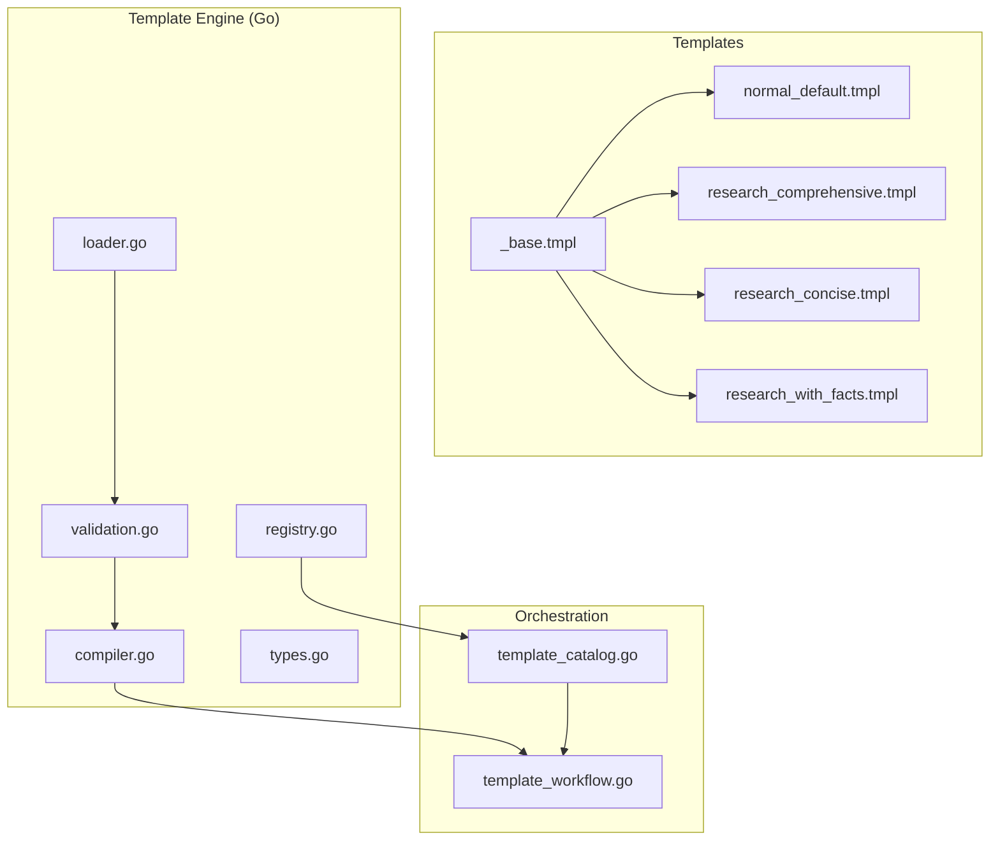
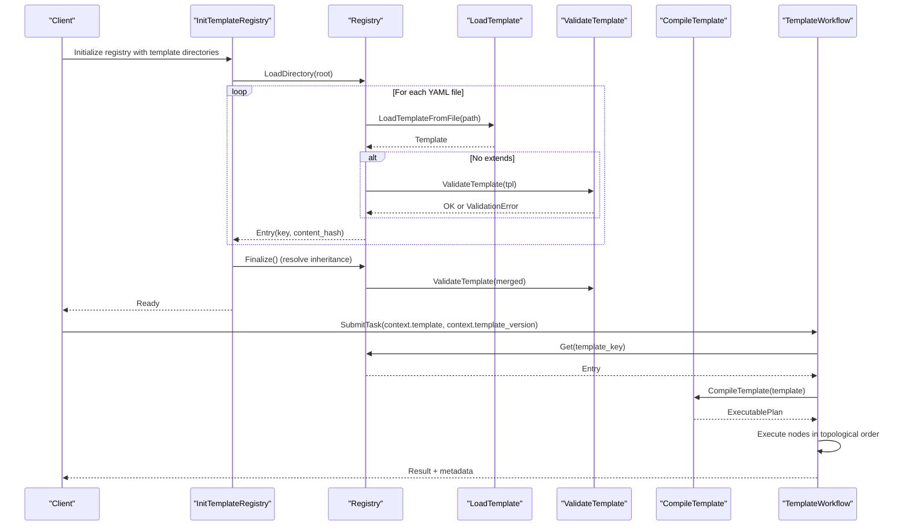
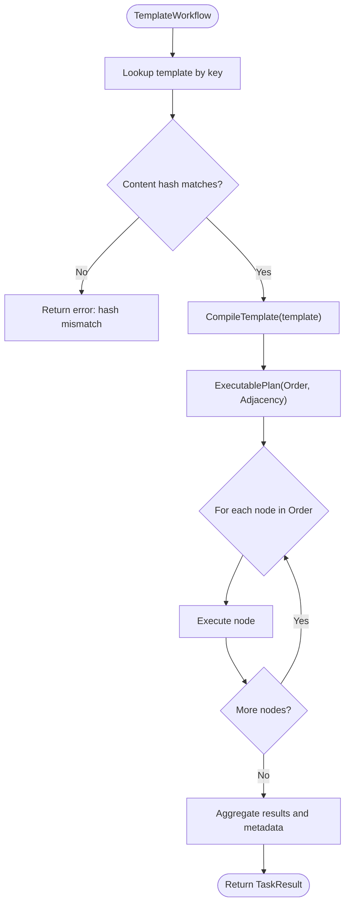
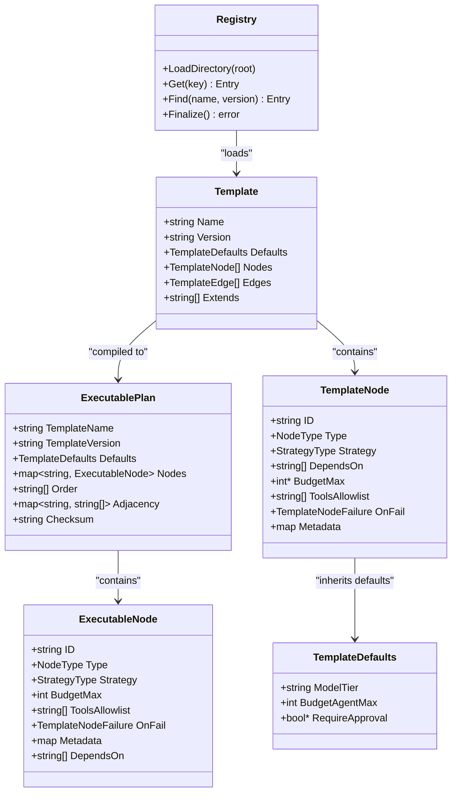
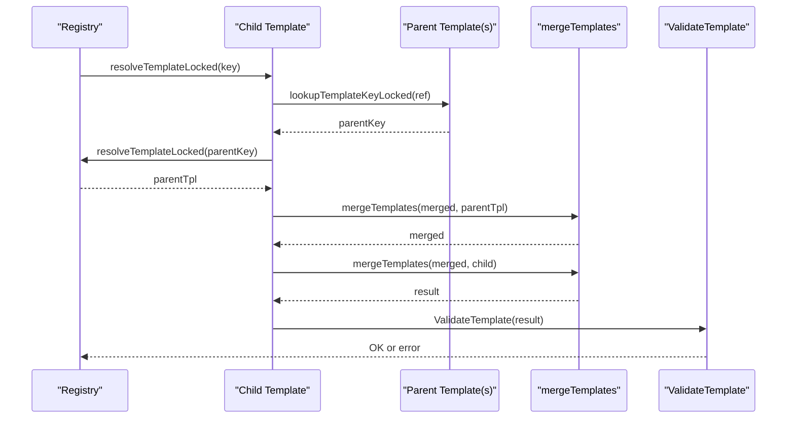
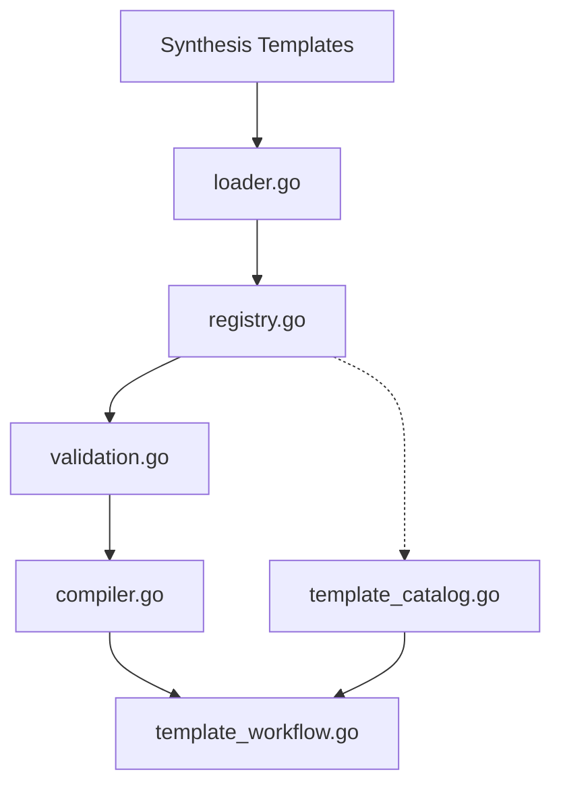

# Template Configuration

<cite>
**Referenced Files in This Document**
- [_base.tmpl](file://config/templates/synthesis/_base.tmpl)
- [normal_default.tmpl](file://config/templates/synthesis/normal_default.tmpl)
- [research_comprehensive.tmpl](file://config/templates/synthesis/research_comprehensive.tmpl)
- [research_concise.tmpl](file://config/templates/synthesis/research_concise.tmpl)
- [research_with_facts.tmpl](file://config/templates/synthesis/research_with_facts.tmpl)
- [compiler.go](file://go/orchestrator/internal/templates/compiler.go)
- [loader.go](file://go/orchestrator/internal/templates/loader.go)
- [validation.go](file://go/orchestrator/internal/templates/validation.go)
- [types.go](file://go/orchestrator/internal/templates/types.go)
- [registry.go](file://go/orchestrator/internal/templates/registry.go)
- [template_catalog.go](file://go/orchestrator/internal/workflows/template_catalog.go)
- [template_workflow.go](file://go/orchestrator/internal/workflows/template_workflow.go)
- [templates.md](file://docs/templates.md)
- [template-user-guide.md](file://docs/template-user-guide.md)
</cite>

## Table of Contents
1. [Introduction](#introduction)
2. [Project Structure](#project-structure)
3. [Core Components](#core-components)
4. [Architecture Overview](#architecture-overview)
5. [Detailed Component Analysis](#detailed-component-analysis)
6. [Dependency Analysis](#dependency-analysis)
7. [Performance Considerations](#performance-considerations)
8. [Troubleshooting Guide](#troubleshooting-guide)
9. [Conclusion](#conclusion)
10. [Appendices](#appendices)

## Introduction
This document describes the Shannon synthesis template system used to produce deterministic, structured outputs for research and non-research tasks. It explains the foundational template structure, inheritance patterns, and specialized templates. It also documents template syntax, variable substitution, conditional logic, compilation, validation, error handling, and best practices for versioning, backward compatibility, and migration.

## Project Structure
Shannon’s synthesis templates live under config/templates/synthesis and are complemented by a robust Go-based template engine that loads, validates, merges inheritance, compiles to executable plans, and integrates with workflow orchestration.

**Diagram sources**
- [loader.go](file://go/orchestrator/internal/templates/loader.go#L11-L32)
- [validation.go](file://go/orchestrator/internal/templates/validation.go#L68-L196)
- [compiler.go](file://go/orchestrator/internal/templates/compiler.go#L31-L122)
- [registry.go](file://go/orchestrator/internal/templates/registry.go#L51-L87)
- [template_catalog.go](file://go/orchestrator/internal/workflows/template_catalog.go#L18-L62)
- [template_workflow.go](file://go/orchestrator/internal/workflows/template_workflow.go#L31-L172)

**Section sources**
- [loader.go](file://go/orchestrator/internal/templates/loader.go#L11-L32)
- [validation.go](file://go/orchestrator/internal/templates/validation.go#L68-L196)
- [compiler.go](file://go/orchestrator/internal/templates/compiler.go#L31-L122)
- [registry.go](file://go/orchestrator/internal/templates/registry.go#L51-L87)
- [template_catalog.go](file://go/orchestrator/internal/workflows/template_catalog.go#L18-L62)
- [template_workflow.go](file://go/orchestrator/internal/workflows/template_workflow.go#L31-L172)

## Core Components
- Synthesis templates define prompts and rules for generating structured outputs. They rely on a shared foundation and reusable partials.
- The template engine loads YAML templates, validates structure and constraints, resolves inheritance, and compiles to an executable plan.
- The orchestration layer selects a template by name@version, compiles it, and executes nodes deterministically.

Key template files:
- _base.tmpl: Defines the protected synthesis contract, citation handling, and reusable partials.
- normal_default.tmpl: Default synthesis for non-research tasks.
- research_comprehensive.tmpl: Deep research synthesis with strict coverage and citation requirements.
- research_concise.tmpl: Concise research synthesis with reduced structure.
- research_with_facts.tmpl: Research synthesis plus a structured facts appendix.

**Section sources**
- [_base.tmpl](file://config/templates/synthesis/_base.tmpl#L1-L143)
- [normal_default.tmpl](file://config/templates/synthesis/normal_default.tmpl#L1-L45)
- [research_comprehensive.tmpl](file://config/templates/synthesis/research_comprehensive.tmpl#L1-L130)
- [research_concise.tmpl](file://config/templates/synthesis/research_concise.tmpl#L1-L69)
- [research_with_facts.tmpl](file://config/templates/synthesis/research_with_facts.tmpl#L1-L128)

## Architecture Overview
The synthesis template system follows a layered pipeline: templates are loaded from disk, validated, merged via inheritance, compiled into an executable plan, and executed deterministically by the workflow engine.

**Diagram sources**
- [template_catalog.go](file://go/orchestrator/internal/workflows/template_catalog.go#L18-L62)
- [registry.go](file://go/orchestrator/internal/templates/registry.go#L51-L87)
- [loader.go](file://go/orchestrator/internal/templates/loader.go#L11-L32)
- [validation.go](file://go/orchestrator/internal/templates/validation.go#L68-L196)
- [compiler.go](file://go/orchestrator/internal/templates/compiler.go#L31-L122)
- [template_workflow.go](file://go/orchestrator/internal/workflows/template_workflow.go#L58-L172)

## Detailed Component Analysis

### Foundational Template (_base.tmpl)
_base.tmpl establishes the protected synthesis contract and reusable partials:
- System contract: defines output format, citation policy, conflict resolution, and source priority.
- Citation list rendering: adapts to CitationAgentEnabled behavior.
- Language instruction: enforces query language matching.
- Reusable partials:
  - citation_handling_research: comprehensive citation integration guidance.
  - citation_handling_concise: concise citation integration guidance.
  - coverage_checklist_citations: coverage requirements for research templates.

Template syntax highlights:
- Define named blocks with {{- define "block_name" -}} ... {{- end -}}.
- Conditional logic with {{- if ... -}} ... {{- else -}} ... {{- end -}}.
- Variable interpolation with {{ .Variable }}.
- Range loops for dynamic headings in research templates.
- Functions like len, add, gt used in templates.

**Section sources**
- [_base.tmpl](file://config/templates/synthesis/_base.tmpl#L13-L143)

### Specialized Templates

#### normal_default.tmpl
Purpose: Default synthesis for non-research tasks.
Key behaviors:
- Inherits system_contract and language_instruction.
- Provides formatting guidelines tailored to query complexity.
- Conditionally adds inline citations when sources are present.

Template variables:
- .Query, .QueryLanguage, .AvailableCitations, .CitationCount, .LanguageInstruction, .AgentResults.

**Section sources**
- [normal_default.tmpl](file://config/templates/synthesis/normal_default.tmpl#L1-L45)

#### research_comprehensive.tmpl
Purpose: Comprehensive multi-section research synthesis.
Key behaviors:
- Enforces coverage checklist and strict section structure.
- Uses citation_handling_research and coverage_checklist_citations.
- Supports anti-compression rules to preserve structured artifacts.
- Quality standards emphasize temporal context and authoritative sourcing.

Template variables:
- .Query, .QueryLanguage, .ResearchAreas, .AvailableCitations, .CitationCount, .MinCitations, .LanguageInstruction, .AgentResults, .TargetWords, .CitationAgentEnabled.

**Section sources**
- [research_comprehensive.tmpl](file://config/templates/synthesis/research_comprehensive.tmpl#L1-L130)

#### research_concise.tmpl
Purpose: Concise research synthesis with reduced structure.
Key behaviors:
- Uses citation_handling_concise.
- Emphasizes confident, authoritative statements when well-supported.
- Anti-compression rule to prioritize non-synthesis agent outputs.

Template variables:
- Same as comprehensive minus TargetWords.

**Section sources**
- [research_concise.tmpl](file://config/templates/synthesis/research_concise.tmpl#L1-L69)

#### research_with_facts.tmpl
Purpose: Research synthesis with a structured facts JSON appendix.
Key behaviors:
- Adds a “Structured Facts” section with JSON schema.
- Enforces extraction guidelines for facts, categories, confidence, and entities.
- Integrates with citation handling similar to comprehensive.

Template variables:
- Same as comprehensive with TargetWords.

**Section sources**
- [research_with_facts.tmpl](file://config/templates/synthesis/research_with_facts.tmpl#L1-L128)

### Template Syntax, Variables, and Conditional Logic
- Blocks and partials: {{- define "name" -}} ... {{- end -}}; {{- template "partial" . -}}.
- Conditionals: {{- if gt .CitationCount 0 -}}, {{- if .CitationAgentEnabled -}}.
- Loops: {{- range .ResearchAreas -}} ... {{- end -}}.
- Functions: len, add, gt used in templates.
- Variables: dot notation .Variable, e.g., .AvailableCitations, .ResearchAreas, .CitationAgentEnabled.

**Section sources**
- [_base.tmpl](file://config/templates/synthesis/_base.tmpl#L72-L143)
- [research_comprehensive.tmpl](file://config/templates/synthesis/research_comprehensive.tmpl#L67-L88)
- [research_concise.tmpl](file://config/templates/synthesis/research_concise.tmpl#L41-L47)

### Template Compilation and Execution
Compilation transforms a validated template into an ExecutablePlan:
- Validates structural and graph constraints.
- Builds adjacency and in-degree maps.
- Computes topological order for deterministic execution.
- Produces Order and Adjacency for node scheduling.

Execution:
- TemplateWorkflow retrieves the template by key, verifies content hash, compiles, and executes nodes in order.
- Records per-node results, aggregates tokens, and emits completion events.

**Diagram sources**
- [template_workflow.go](file://go/orchestrator/internal/workflows/template_workflow.go#L58-L172)
- [compiler.go](file://go/orchestrator/internal/templates/compiler.go#L31-L122)

**Section sources**
- [compiler.go](file://go/orchestrator/internal/templates/compiler.go#L31-L122)
- [template_workflow.go](file://go/orchestrator/internal/workflows/template_workflow.go#L58-L172)

### Template Loading, Validation, and Registry
Loading:
- LoadDirectory walks a directory, filters YAML files, and loads each template.
- decodeTemplate uses YAML decoder with KnownFields enabled.

Validation:
- ValidateTemplate checks name, nodes, node IDs, node types, strategies, budgets, dependencies, edges, and cycles.
- Returns ValidationError with multiple ValidationIssue entries.

Registry:
- Registry stores templates by canonical key (name@version).
- Finalize resolves inheritance via mergeTemplates and validates merged templates.
- Supports lookup by exact key or by name with best-version selection.

**Diagram sources**
- [types.go](file://go/orchestrator/internal/templates/types.go#L24-L77)
- [registry.go](file://go/orchestrator/internal/templates/registry.go#L19-L49)
- [compiler.go](file://go/orchestrator/internal/templates/compiler.go#L8-L29)

**Section sources**
- [loader.go](file://go/orchestrator/internal/templates/loader.go#L11-L42)
- [validation.go](file://go/orchestrator/internal/templates/validation.go#L68-L196)
- [registry.go](file://go/orchestrator/internal/templates/registry.go#L51-L242)
- [types.go](file://go/orchestrator/internal/templates/types.go#L24-L77)
- [compiler.go](file://go/orchestrator/internal/templates/compiler.go#L31-L122)

### Template Inheritance Patterns
- Extends: A template can extend one or more parent templates by name or name@version.
- Resolution: Finalize traverses extends references, detects cycles, and merges parents into a single template.
- Merging: Defaults, metadata, nodes, and edges are merged; overlay takes precedence for overlapping keys.
- Validation: After merging, the resulting template is validated again.

**Diagram sources**
- [registry.go](file://go/orchestrator/internal/templates/registry.go#L219-L288)
- [registry.go](file://go/orchestrator/internal/templates/registry.go#L290-L317)
- [registry.go](file://go/orchestrator/internal/templates/registry.go#L319-L359)
- [validation.go](file://go/orchestrator/internal/templates/validation.go#L68-L196)

**Section sources**
- [registry.go](file://go/orchestrator/internal/templates/registry.go#L219-L288)
- [registry.go](file://go/orchestrator/internal/templates/registry.go#L290-L317)
- [registry.go](file://go/orchestrator/internal/templates/registry.go#L319-L359)
- [validation.go](file://go/orchestrator/internal/templates/validation.go#L68-L196)

### Template Compilation Process
- ValidateTemplate ensures structural correctness and graph acyclicity.
- CompileTemplate builds ExecutablePlan:
  - Copies defaults and nodes.
  - Resolves depends_on and explicit edges into adjacency and in-degree.
  - Computes topological order; detects cycles.
  - Produces Order and Adjacency for deterministic execution.

**Section sources**
- [validation.go](file://go/orchestrator/internal/templates/validation.go#L68-L196)
- [compiler.go](file://go/orchestrator/internal/templates/compiler.go#L31-L122)

### Validation Rules and Error Handling
Validation covers:
- Required fields and non-empty names.
- Node IDs uniqueness and presence.
- Allowed node types and strategies.
- Budget constraints and dependencies.
- Edge validity and cycles detection.
- Error model aggregates multiple issues with stable codes for metrics.

Error handling:
- Load errors are aggregated into LoadError.
- Validation errors return ValidationError with multiple issues.
- Registry tracks validation metrics by issue code.

**Section sources**
- [validation.go](file://go/orchestrator/internal/templates/validation.go#L9-L50)
- [validation.go](file://go/orchestrator/internal/templates/validation.go#L68-L196)
- [registry.go](file://go/orchestrator/internal/templates/registry.go#L116-L162)

### Template Parameterization and Custom Development
- Parameterization occurs via context passed to the orchestrator; templates receive variables like .Query, .AvailableCitations, .ResearchAreas, .CitationAgentEnabled, and .TargetWords.
- To develop a custom synthesis template:
  - Start from _base.tmpl and include {{- template "system_contract" . -}}.
  - Add your own synthesis requirements and formatting rules.
  - Use reusable partials like {{- template "citation_handling_research" . -}} or {{- template "citation_handling_concise" . -}}.
  - Optionally define custom partials for repeated logic.
  - Test with registry.LoadDirectory and Finalize to validate inheritance and structure.

Best practices:
- Keep templates deterministic; avoid randomness.
- Use citation partials to enforce consistent citation behavior.
- Prefer modular, composable designs with inheritance.
- Keep variable names aligned with template variables documented above.

**Section sources**
- [_base.tmpl](file://config/templates/synthesis/_base.tmpl#L13-L143)
- [research_comprehensive.tmpl](file://config/templates/synthesis/research_comprehensive.tmpl#L20-L130)
- [research_concise.tmpl](file://config/templates/synthesis/research_concise.tmpl#L18-L69)
- [research_with_facts.tmpl](file://config/templates/synthesis/research_with_facts.tmpl#L21-L128)

### Versioning, Backward Compatibility, and Migration
- Versioning: Templates are keyed by name@version; registry supports exact matches and best-version selection.
- Backward compatibility: When extending templates, prefer additive changes and avoid breaking the protected contract defined in _base.tmpl.
- Migration strategies:
  - Introduce new versions with clear changes; keep old versions available.
  - Use registry.Find to select latest compatible version when exact version is not required.
  - Validate merged templates after inheritance to catch conflicts early.

**Section sources**
- [registry.go](file://go/orchestrator/internal/templates/registry.go#L164-L177)
- [registry.go](file://go/orchestrator/internal/templates/registry.go#L179-L205)
- [registry.go](file://go/orchestrator/internal/templates/registry.go#L219-L242)

## Dependency Analysis
The template system exhibits clear separation of concerns:
- Templates define prompts and rules.
- Loader and Registry manage discovery, parsing, and inheritance.
- Validation enforces structural and graph constraints.
- Compiler produces an executable plan.
- Orchestration executes nodes deterministically.

**Diagram sources**
- [loader.go](file://go/orchestrator/internal/templates/loader.go#L11-L32)
- [registry.go](file://go/orchestrator/internal/templates/registry.go#L51-L87)
- [validation.go](file://go/orchestrator/internal/templates/validation.go#L68-L196)
- [compiler.go](file://go/orchestrator/internal/templates/compiler.go#L31-L122)
- [template_workflow.go](file://go/orchestrator/internal/workflows/template_workflow.go#L31-L172)
- [template_catalog.go](file://go/orchestrator/internal/workflows/template_catalog.go#L18-L62)

**Section sources**
- [loader.go](file://go/orchestrator/internal/templates/loader.go#L11-L32)
- [registry.go](file://go/orchestrator/internal/templates/registry.go#L51-L87)
- [validation.go](file://go/orchestrator/internal/templates/validation.go#L68-L196)
- [compiler.go](file://go/orchestrator/internal/templates/compiler.go#L31-L122)
- [template_workflow.go](file://go/orchestrator/internal/workflows/template_workflow.go#L31-L172)
- [template_catalog.go](file://go/orchestrator/internal/workflows/template_catalog.go#L18-L62)

## Performance Considerations
- Deterministic execution: Topological ordering ensures predictable scheduling and avoids redundant recomputation.
- Budget-based degradation: Cognitive nodes can automatically downgrade strategies when budgets are tight.
- Minimizing template churn: Use inheritance to reduce duplication and improve maintainability.

[No sources needed since this section provides general guidance]

## Troubleshooting Guide
Common issues and resolutions:
- Template not found: Verify template key (name@version) and that Finalize succeeded.
- Validation errors: Inspect aggregated issues and fix structural or graph problems.
- Cycle detected: Remove or adjust depends_on and edges to form a DAG.
- Hash mismatch: Content changed after registration; re-register or update expectations.
- Inheritance cycle: Fix extends references to avoid circular dependencies.

Operational tips:
- Use ListTemplates to enumerate loaded templates and content hashes.
- Enable debug logging for template-related messages.
- Validate YAML and ensure required fields are present.

**Section sources**
- [validation.go](file://go/orchestrator/internal/templates/validation.go#L181-L196)
- [registry.go](file://go/orchestrator/internal/templates/registry.go#L116-L162)
- [template_workflow.go](file://go/orchestrator/internal/workflows/template_workflow.go#L58-L70)
- [templates.md](file://docs/templates.md#L356-L380)

## Conclusion
Shannon’s synthesis template system provides a robust, deterministic framework for generating structured outputs. By leveraging _base.tmpl and reusable partials, and by adhering to strict validation and compilation rules, teams can build reliable, maintainable synthesis workflows. Proper use of inheritance, versioning, and registry management ensures backward compatibility and smooth migration over time.

[No sources needed since this section summarizes without analyzing specific files]

## Appendices

### Template Variables Reference
- .Query: Original user query.
- .QueryLanguage: Detected language of the query.
- .AvailableCitations: Formatted citation list (may be empty).
- .CitationCount: Number of available citations.
- .LanguageInstruction: Language matching instruction.
- .AgentResults: Raw agent outputs for synthesis.
- .ResearchAreas: Array of research areas to cover.
- .MinCitations: Minimum citations to use.
- .TargetWords: Target word count for detailed findings.
- .CitationAgentEnabled: Whether a separate citation agent is enabled.

**Section sources**
- [normal_default.tmpl](file://config/templates/synthesis/normal_default.tmpl#L7-L14)
- [research_comprehensive.tmpl](file://config/templates/synthesis/research_comprehensive.tmpl#L7-L17)
- [research_concise.tmpl](file://config/templates/synthesis/research_concise.tmpl#L7-L16)
- [research_with_facts.tmpl](file://config/templates/synthesis/research_with_facts.tmpl#L8-L19)

### Execution and API Usage
- Load templates at startup via InitTemplateRegistry.
- List templates using the ListTemplates API.
- Execute a template by specifying context.template and context.template_version.
- Disable AI fallback by setting disable_ai to true.

**Section sources**
- [template-user-guide.md](file://docs/template-user-guide.md#L31-L71)
- [templates.md](file://docs/templates.md#L330-L353)