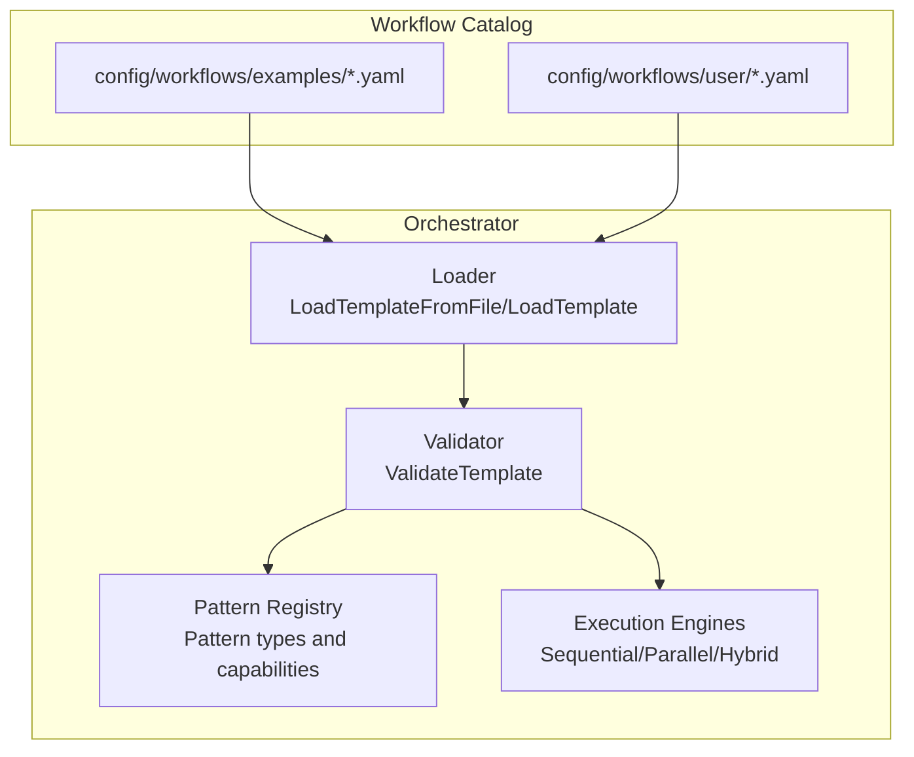
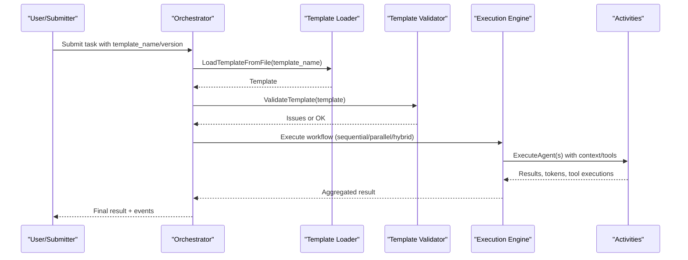
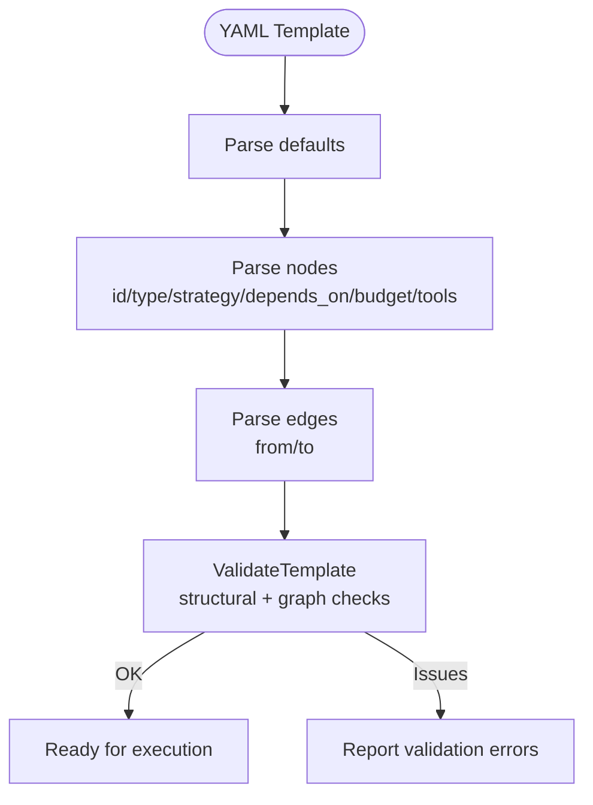
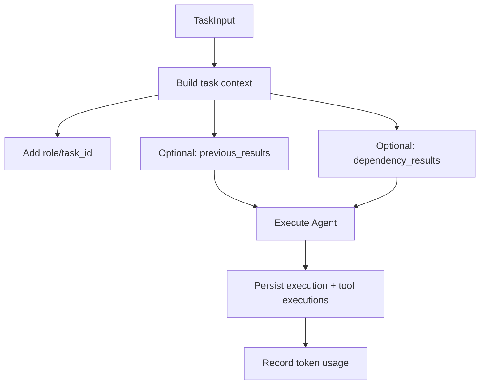
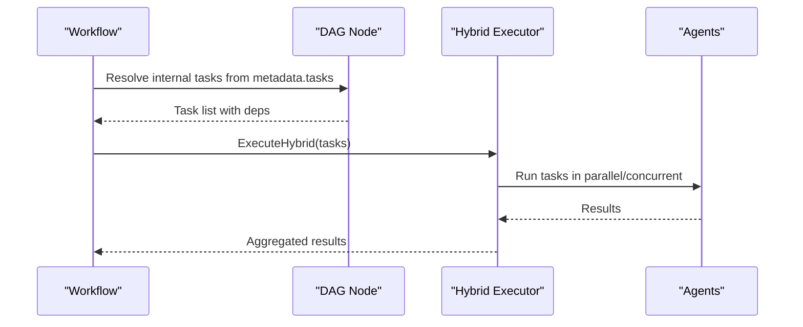
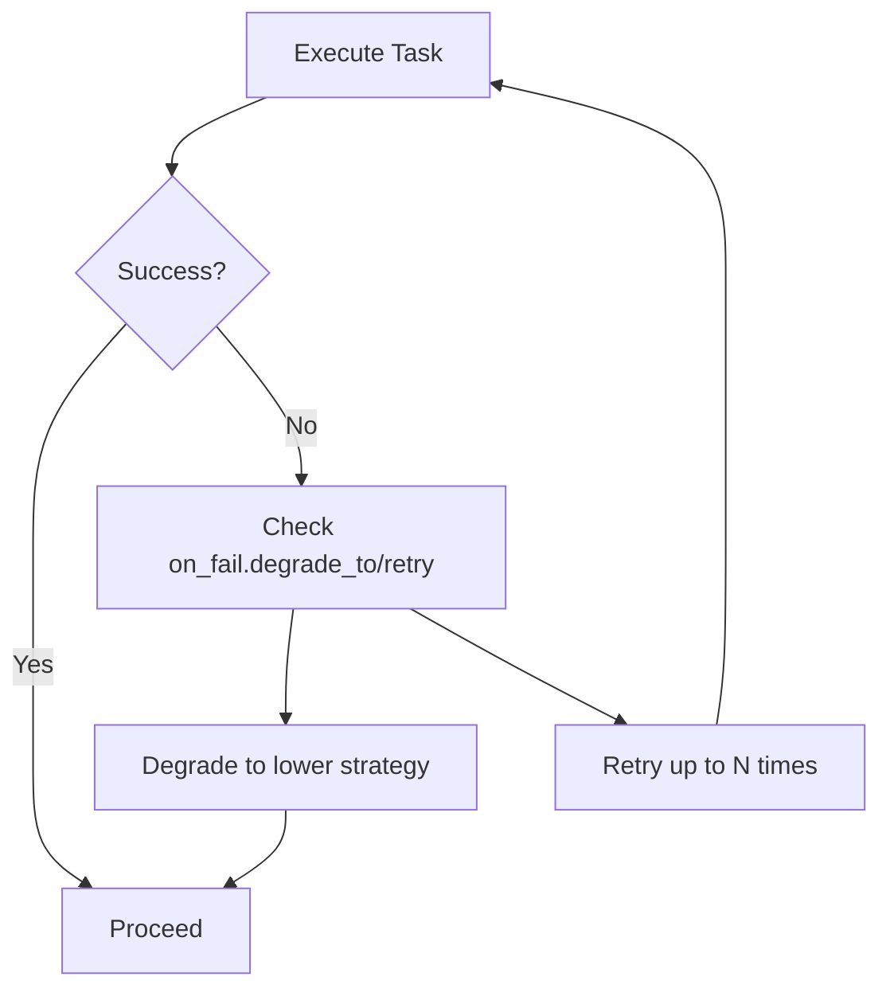
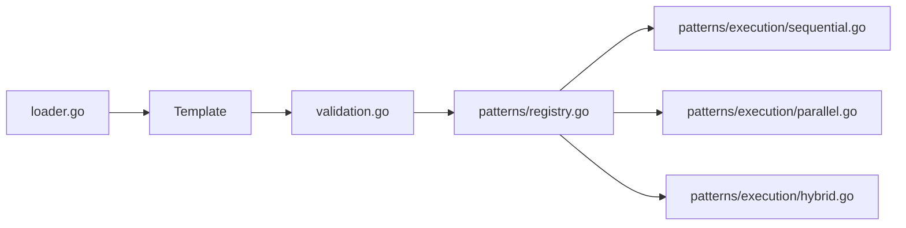

# Workflow Configuration

<cite>
**Referenced Files in This Document**
- [complex_dag.yaml](file://config/workflows/examples/complex_dag.yaml)
- [market_analysis.yaml](file://config/workflows/examples/market_analysis.yaml)
- [research_summary.yaml](file://config/workflows/examples/research_summary.yaml)
- [parallel_dag_example.yaml](file://config/workflows/examples/parallel_dag_example.yaml)
- [README.md](file://config/workflows/user/README.md)
- [validation.go](file://go/orchestrator/internal/templates/validation.go)
- [loader.go](file://go/orchestrator/internal/templates/loader.go)
- [types.go](file://go/orchestrator/internal/workflows/types.go)
- [registry.go](file://go/orchestrator/internal/workflows/patterns/registry.go)
- [sequential.go](file://go/orchestrator/internal/workflows/patterns/execution/sequential.go)
- [parallel.go](file://go/orchestrator/internal/workflows/patterns/execution/parallel.go)
- [hybrid.go](file://go/orchestrator/internal/workflows/patterns/execution/hybrid.go)
- [helpers.go](file://go/orchestrator/internal/workflows/helpers.go)
- [simple_workflow.go](file://go/orchestrator/internal/workflows/simple_workflow.go)
</cite>

## Table of Contents
1. [Introduction](#introduction)
2. [Project Structure](#project-structure)
3. [Core Components](#core-components)
4. [Architecture Overview](#architecture-overview)
5. [Detailed Component Analysis](#detailed-component-analysis)
6. [Dependency Analysis](#dependency-analysis)
7. [Performance Considerations](#performance-considerations)
8. [Troubleshooting Guide](#troubleshooting-guide)
9. [Conclusion](#conclusion)
10. [Appendices](#appendices)

## Introduction
This document explains how to configure and operate workflows in Shannon’s system. It covers the YAML structure for workflow definitions, how tasks are executed, and how to compose complex multi-agent workflows. It documents example templates (complex_dag, market_analysis, research_summary, parallel_dag_example), user-managed templates, validation, parameter passing, dynamic generation, error handling, versioning, deployment, and optimization strategies.

## Project Structure
Workflows are defined as YAML templates and validated and loaded by the orchestrator. Users can place custom templates under the user/ directory to override built-ins or extend the catalog.



**Diagram sources**
- [loader.go](file://go/orchestrator/internal/templates/loader.go#L11-L42)
- [validation.go](file://go/orchestrator/internal/templates/validation.go#L68-L196)
- [registry.go](file://go/orchestrator/internal/workflows/patterns/registry.go#L110-L189)

**Section sources**
- [README.md](file://config/workflows/user/README.md#L1-L107)

## Core Components
- Workflow YAML schema: name, version, description, defaults, nodes, edges.
- Node types: simple, cognitive, supervisor, dag.
- Strategies: react, chain_of_thought, tree_of_thoughts, debate, reflection.
- Execution engines: sequential, parallel, hybrid.
- Validation pipeline: structural checks, cycles, unknown references, budget constraints.
- Parameter passing: context propagation, tool parameters, memory injection, history shaping.
- Dynamic generation: DAG nodes with internal task lists; supervisor coordination; pattern selection.

**Section sources**
- [complex_dag.yaml](file://config/workflows/examples/complex_dag.yaml#L1-L52)
- [market_analysis.yaml](file://config/workflows/examples/market_analysis.yaml#L1-L76)
- [research_summary.yaml](file://config/workflows/examples/research_summary.yaml#L1-L37)
- [parallel_dag_example.yaml](file://config/workflows/examples/parallel_dag_example.yaml#L1-L62)
- [validation.go](file://go/orchestrator/internal/templates/validation.go#L68-L196)
- [sequential.go](file://go/orchestrator/internal/workflows/patterns/execution/sequential.go#L47-L395)
- [parallel.go](file://go/orchestrator/internal/workflows/patterns/execution/parallel.go#L48-L450)
- [hybrid.go](file://go/orchestrator/internal/workflows/patterns/execution/hybrid.go#L45-L407)

## Architecture Overview
The workflow lifecycle:
- Templates are loaded from disk or user directory.
- Validation ensures correctness and safety.
- On submission, the orchestrator routes to appropriate execution engines based on node types and strategy.
- Execution engines manage concurrency, memory, tool usage, and persistence.



**Diagram sources**
- [loader.go](file://go/orchestrator/internal/templates/loader.go#L11-L42)
- [validation.go](file://go/orchestrator/internal/templates/validation.go#L68-L196)
- [sequential.go](file://go/orchestrator/internal/workflows/patterns/execution/sequential.go#L47-L395)
- [parallel.go](file://go/orchestrator/internal/workflows/patterns/execution/parallel.go#L48-L450)
- [hybrid.go](file://go/orchestrator/internal/workflows/patterns/execution/hybrid.go#L45-L407)

## Detailed Component Analysis

### Workflow YAML Structure and Examples
- Fields:
  - name (required), version (optional), description (optional)
  - defaults: model_tier, budget_agent_max, require_approval, etc.
  - nodes: id, type, strategy, depends_on, budget_max, tools_allowlist, metadata, on_fail
  - edges: from, to pairs defining execution graph
- Examples:
  - complex_dag: multi-branch DAG with fallbacks and degrade-to strategies.
  - market_analysis: parallel branches plus supervisor synthesis and multi-agent coordination.
  - research_summary: linear cognitive pipeline with on_fail degrade and retry.
  - parallel_dag_example: internal DAG tasks with metadata.tasks and dependencies.



**Diagram sources**
- [validation.go](file://go/orchestrator/internal/templates/validation.go#L68-L196)

**Section sources**
- [complex_dag.yaml](file://config/workflows/examples/complex_dag.yaml#L1-L52)
- [market_analysis.yaml](file://config/workflows/examples/market_analysis.yaml#L1-L76)
- [research_summary.yaml](file://config/workflows/examples/research_summary.yaml#L1-L37)
- [parallel_dag_example.yaml](file://config/workflows/examples/parallel_dag_example.yaml#L1-L62)

### Execution Patterns and Engines
- Sequential: tasks run one after another; previous results can be passed forward; numeric extraction and tool param clearing supported.
- Parallel: tasks run concurrently with a semaphore; supports budgeted and non-budgeted modes; emits events and persists results.
- Hybrid: combines parallelism with dependency management; tasks without dependencies run in parallel; dependent tasks wait; supports dependency result passing and tool param clearing.

```mermaid
classDiagram
class Pattern {
+Execute(ctx, input) PatternResult
+GetType() PatternType
+GetCapabilities() []PatternCapability
+EstimateTokens(input) int
}
class SequentialConfig {
+bool EmitEvents
+map[string]interface{} Context
+bool PassPreviousResults
+bool ExtractNumericValues
+bool ClearDependentToolParams
}
class ParallelConfig {
+int MaxConcurrency
+Semaphore Semaphore
+bool EmitEvents
+map[string]interface{} Context
}
class HybridConfig {
+int MaxConcurrency
+bool EmitEvents
+map[string]interface{} Context
+Duration DependencyWaitTimeout
+Duration DependencyCheckInterval
+bool PassDependencyResults
+bool ClearDependentToolParams
}
Pattern <|.. SequentialConfig
Pattern <|.. ParallelConfig
Pattern <|.. HybridConfig
```

**Diagram sources**
- [registry.go](file://go/orchestrator/internal/workflows/patterns/registry.go#L35-L78)
- [sequential.go](file://go/orchestrator/internal/workflows/patterns/execution/sequential.go#L20-L47)
- [parallel.go](file://go/orchestrator/internal/workflows/patterns/execution/parallel.go#L19-L46)
- [hybrid.go](file://go/orchestrator/internal/workflows/patterns/execution/hybrid.go#L13-L36)

**Section sources**
- [sequential.go](file://go/orchestrator/internal/workflows/patterns/execution/sequential.go#L47-L395)
- [parallel.go](file://go/orchestrator/internal/workflows/patterns/execution/parallel.go#L48-L450)
- [hybrid.go](file://go/orchestrator/internal/workflows/patterns/execution/hybrid.go#L45-L407)

### Parameter Passing and Context Propagation
- TaskInput carries query, user/session identifiers, context, history, suggested tools, tool parameters, and flags for approvals and bypass behavior.
- Execution engines inject role/task_id into context, optionally pass previous results, extract numeric values, and clear dependent tool parameters.
- Helpers provide history conversion, compression ratio extraction, and memory fallback injection.



**Diagram sources**
- [types.go](file://go/orchestrator/internal/workflows/types.go#L8-L59)
- [sequential.go](file://go/orchestrator/internal/workflows/patterns/execution/sequential.go#L82-L165)
- [hybrid.go](file://go/orchestrator/internal/workflows/patterns/execution/hybrid.go#L219-L253)
- [helpers.go](file://go/orchestrator/internal/workflows/helpers.go#L13-L70)

**Section sources**
- [types.go](file://go/orchestrator/internal/workflows/types.go#L8-L59)
- [sequential.go](file://go/orchestrator/internal/workflows/patterns/execution/sequential.go#L82-L165)
- [hybrid.go](file://go/orchestrator/internal/workflows/patterns/execution/hybrid.go#L219-L253)
- [helpers.go](file://go/orchestrator/internal/workflows/helpers.go#L13-L70)

### Dynamic Workflow Generation
- DAG nodes can define internal tasks via metadata.tasks to create nested workflows dynamically.
- Supervisor nodes coordinate sub-agents and orchestrate synthesis.
- Hybrid execution enables dependency-aware parallelism for complex pipelines.



**Diagram sources**
- [parallel_dag_example.yaml](file://config/workflows/examples/parallel_dag_example.yaml#L23-L45)
- [market_analysis.yaml](file://config/workflows/examples/market_analysis.yaml#L48-L50)
- [hybrid.go](file://go/orchestrator/internal/workflows/patterns/execution/hybrid.go#L45-L161)

**Section sources**
- [parallel_dag_example.yaml](file://config/workflows/examples/parallel_dag_example.yaml#L18-L61)
- [market_analysis.yaml](file://config/workflows/examples/market_analysis.yaml#L42-L50)
- [hybrid.go](file://go/orchestrator/internal/workflows/patterns/execution/hybrid.go#L45-L161)

### Error Handling and Degradation
- on_fail supports degrade_to (strategy) and retry (count) to gracefully handle failures.
- Hybrid and Parallel engines emit error events and continue execution when configured.
- Simple workflow includes synthesis and token recording with best-effort fallbacks.



**Diagram sources**
- [complex_dag.yaml](file://config/workflows/examples/complex_dag.yaml#L24-L26)
- [market_analysis.yaml](file://config/workflows/examples/market_analysis.yaml#L58-L60)
- [research_summary.yaml](file://config/workflows/examples/research_summary.yaml#L22-L24)
- [parallel.go](file://go/orchestrator/internal/workflows/patterns/execution/parallel.go#L253-L275)

**Section sources**
- [complex_dag.yaml](file://config/workflows/examples/complex_dag.yaml#L24-L26)
- [market_analysis.yaml](file://config/workflows/examples/market_analysis.yaml#L58-L60)
- [research_summary.yaml](file://config/workflows/examples/research_summary.yaml#L22-L24)
- [parallel.go](file://go/orchestrator/internal/workflows/patterns/execution/parallel.go#L253-L275)

### User Workflow Management (workflows/user/)
- Place custom templates under config/workflows/user/.
- Auto-loaded on startup; override built-ins by using name@version.
- Validation script provided to catch issues early.
- Best practices: semantic versioning, small budgets during dev, metadata documentation, monitoring metrics.

**Section sources**
- [README.md](file://config/workflows/user/README.md#L1-L107)

## Dependency Analysis
- Template loading and decoding are handled by a dedicated loader.
- Validation enforces structural and graph integrity (cycles, unknown nodes, budget limits).
- Pattern registry centralizes pattern selection and capabilities.
- Execution engines depend on activities for agent execution, persistence, and token accounting.



**Diagram sources**
- [loader.go](file://go/orchestrator/internal/templates/loader.go#L11-L42)
- [validation.go](file://go/orchestrator/internal/templates/validation.go#L68-L196)
- [registry.go](file://go/orchestrator/internal/workflows/patterns/registry.go#L110-L189)
- [sequential.go](file://go/orchestrator/internal/workflows/patterns/execution/sequential.go#L47-L395)
- [parallel.go](file://go/orchestrator/internal/workflows/patterns/execution/parallel.go#L48-L450)
- [hybrid.go](file://go/orchestrator/internal/workflows/patterns/execution/hybrid.go#L45-L407)

**Section sources**
- [loader.go](file://go/orchestrator/internal/templates/loader.go#L11-L42)
- [validation.go](file://go/orchestrator/internal/templates/validation.go#L68-L196)
- [registry.go](file://go/orchestrator/internal/workflows/patterns/registry.go#L110-L189)

## Performance Considerations
- Concurrency control: set MaxConcurrency appropriately; use hybrid for dependency-aware scaling.
- Budgeting: allocate budget_agent_max and per-node budget_max; ensure node budgets do not exceed defaults.
- Token accounting: engines record input/output tokens; use model_tier derived from budgets for accurate provider detection.
- Memory and context: leverage hierarchical memory and context compression to reduce token usage.
- Events and persistence: fire-and-forget persistence avoids blocking; monitor token usage metrics.

[No sources needed since this section provides general guidance]

## Troubleshooting Guide
Common issues and resolutions:
- Validation errors:
  - Missing name, empty nodes without extends, negative budgets, duplicate node ids, unknown node types/strategies, invalid dependencies, cycles, self-loops.
- Execution failures:
  - on_fail.degrade_to must be a known strategy; retry must be non-negative; escalate_to must be a known node type.
- Performance:
  - Increase MaxConcurrency gradually; ensure budgets align with model tiers; enable compression for long histories.
- Deployment:
  - Use validate-templates.sh before deploying; follow versioning semantics; keep user templates in a separate repo if needed.

**Section sources**
- [validation.go](file://go/orchestrator/internal/templates/validation.go#L68-L196)
- [README.md](file://config/workflows/user/README.md#L77-L107)

## Conclusion
Shannon’s workflow system offers a flexible, validated, and scalable way to define multi-agent pipelines. By combining structured YAML templates with robust execution engines and strong validation, teams can build complex, dynamic workflows while maintaining safety, observability, and performance.

[No sources needed since this section summarizes without analyzing specific files]

## Appendices

### Example Workflows Reference
- complex_dag: multi-branch DAG with fallbacks and degrade-to strategies.
- market_analysis: parallel research branches plus supervisor coordination and multi-agent synthesis.
- research_summary: linear cognitive pipeline with on_fail degrade and retry.
- parallel_dag_example: internal DAG tasks with metadata.tasks and dependencies.

**Section sources**
- [complex_dag.yaml](file://config/workflows/examples/complex_dag.yaml#L1-L52)
- [market_analysis.yaml](file://config/workflows/examples/market_analysis.yaml#L1-L76)
- [research_summary.yaml](file://config/workflows/examples/research_summary.yaml#L1-L37)
- [parallel_dag_example.yaml](file://config/workflows/examples/parallel_dag_example.yaml#L1-L62)

### Submission and Composition Patterns
- Simple workflows: single-agent tasks with optional synthesis and tool citations.
- Cognitive patterns: react, chain-of-thought, tree-of-thoughts, debate, reflection selected by registry.
- Supervisor workflows: multi-agent orchestration and synthesis.

**Section sources**
- [simple_workflow.go](file://go/orchestrator/internal/workflows/simple_workflow.go#L19-L712)
- [registry.go](file://go/orchestrator/internal/workflows/patterns/registry.go#L110-L189)