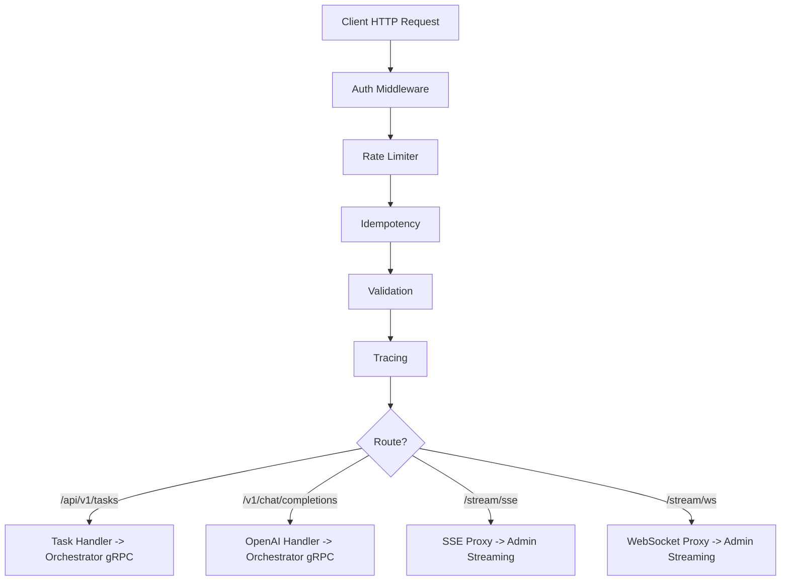

# Component Interactions

<cite>
**Referenced Files in This Document**
- [main.go](file://go/orchestrator/main.go)
- [service.go](file://go/orchestrator/internal/server/service.go)
- [streaming_service.go](file://go/orchestrator/internal/server/streaming_service.go)
- [streaming.go](file://go/orchestrator/internal/httpapi/streaming.go)
- [websocket.go](file://go/orchestrator/internal/httpapi/websocket.go)
- [manager.go](file://go/orchestrator/internal/streaming/manager.go)
- [orchestrator.proto](file://protos/orchestrator/orchestrator.proto)
- [streaming.proto](file://protos/orchestrator/streaming.proto)
- [buf.gen.yaml](file://protos/buf.gen.yaml)
- [buf.yaml](file://protos/buf.yaml)
- [main.go](file://go/orchestrator/cmd/gateway/main.go)
- [client.py](file://clients/python/src/shannon/client.py)
- [main.py](file://python/llm-service/main.py)
- [circuit_breaker.go](file://go/orchestrator/internal/circuitbreaker/circuit_breaker.go)
</cite>

## Table of Contents
1. [Introduction](#introduction)
2. [Project Structure](#project-structure)
3. [Core Components](#core-components)
4. [Architecture Overview](#architecture-overview)
5. [Detailed Component Analysis](#detailed-component-analysis)
6. [Dependency Analysis](#dependency-analysis)
7. [Performance Considerations](#performance-considerations)
8. [Troubleshooting Guide](#troubleshooting-guide)
9. [Conclusion](#conclusion)

## Introduction
This document describes the component interaction patterns and API communication in Shannon. It covers gRPC service definitions, protocol buffer schemas, gateway patterns for external access, internal service-to-service communication, streaming APIs, HTTP endpoints, WebSocket connections, real-time event streaming, API versioning and backward compatibility, service discovery mechanisms, request/response flows, error propagation, and circuit breaker implementations for resilient service communication.

## Project Structure
Shannon comprises:
- An orchestrator service exposing gRPC and HTTP APIs, with internal streaming and workflow orchestration
- A gateway service that fronts external clients with HTTP and OpenAI-compatible endpoints
- Protocol buffers defining service contracts and streaming semantics
- A Python client library for HTTP-based interactions
- An LLM service with FastAPI endpoints and event emission
- Circuit breaker and streaming subsystems for resilience and real-time updates

**Diagram sources**
- [main.go](file://go/orchestrator/cmd/gateway/main.go#L1-L688)
- [main.go](file://go/orchestrator/main.go#L1-L841)
- [service.go](file://go/orchestrator/internal/server/service.go#L1-L3182)
- [streaming_service.go](file://go/orchestrator/internal/server/streaming_service.go#L1-L180)
- [manager.go](file://go/orchestrator/internal/streaming/manager.go#L1-L921)

**Section sources**
- [main.go](file://go/orchestrator/cmd/gateway/main.go#L1-L688)
- [main.go](file://go/orchestrator/main.go#L1-L841)

## Core Components
- gRPC OrchestratorService: task submission, status, cancellation, listing, session context, approvals, workflow control, scheduling
- gRPC StreamingService: server-streaming task execution updates
- HTTP StreamingHandler: SSE and WebSocket endpoints for real-time events
- Streaming Manager: Redis-backed event streaming with replay and persistence
- Gateway: HTTP API with auth, rate limiting, idempotency, validation, and OpenAI-compatible endpoints
- Python SDK: HTTP client for task submission, streaming, and status polling
- LLM Service: FastAPI endpoints and event emission to the orchestrator
- Circuit Breaker: Resilient client-side and service-side protection

**Section sources**
- [orchestrator.proto](file://protos/orchestrator/orchestrator.proto#L1-L353)
- [streaming.proto](file://protos/orchestrator/streaming.proto#L1-L29)
- [service.go](file://go/orchestrator/internal/server/service.go#L1-L3182)
- [streaming_service.go](file://go/orchestrator/internal/server/streaming_service.go#L1-L180)
- [streaming.go](file://go/orchestrator/internal/httpapi/streaming.go#L1-L367)
- [websocket.go](file://go/orchestrator/internal/httpapi/websocket.go#L1-L155)
- [manager.go](file://go/orchestrator/internal/streaming/manager.go#L1-L921)
- [main.go](file://go/orchestrator/cmd/gateway/main.go#L1-L688)
- [client.py](file://clients/python/src/shannon/client.py#L1-L800)
- [main.py](file://python/llm-service/main.py#L1-L164)
- [circuit_breaker.go](file://go/orchestrator/internal/circuitbreaker/circuit_breaker.go#L1-L250)

## Architecture Overview
Shannon’s architecture separates external access via the gateway from internal orchestration and streaming. The gateway exposes HTTP endpoints and OpenAI-compatible routes, authenticating and rate-limiting requests before forwarding to the orchestrator. The orchestrator runs workflows via Temporal, publishes structured events to Redis Streams, and streams updates via SSE/WS or gRPC. The streaming manager supports replay, deduplication, and persistence of significant events.

**Diagram sources**
- [main.go](file://go/orchestrator/cmd/gateway/main.go#L186-L213)
- [service.go](file://go/orchestrator/internal/server/service.go#L194-L800)
- [streaming_service.go](file://go/orchestrator/internal/server/streaming_service.go#L34-L162)
- [streaming.go](file://go/orchestrator/internal/httpapi/streaming.go#L42-L366)

## Detailed Component Analysis

### gRPC Service Definitions and Protocol Buffers
- OrchestratorService defines task lifecycle, approvals, workflow control, and scheduling operations
- StreamingService provides server-streaming updates for task execution
- Protocol buffer generation is configured to produce Go and Python stubs

**Diagram sources**
- [orchestrator.proto](file://protos/orchestrator/orchestrator.proto#L10-L36)
- [streaming.proto](file://protos/orchestrator/streaming.proto#L8-L10)

**Section sources**
- [orchestrator.proto](file://protos/orchestrator/orchestrator.proto#L1-L353)
- [streaming.proto](file://protos/orchestrator/streaming.proto#L1-L29)
- [buf.gen.yaml](file://protos/buf.gen.yaml#L1-L16)
- [buf.yaml](file://protos/buf.yaml#L1-L12)

### Internal Service-to-Service Communication
- The orchestrator initializes Redis and database clients, registers gRPC services, and wires Temporal
- The gateway dials the orchestrator gRPC service and exposes HTTP endpoints
- The LLM service emits events to the orchestrator’s ingestion endpoint

**Diagram sources**
- [main.go](file://go/orchestrator/main.go#L396-L470)
- [main.go](file://go/orchestrator/cmd/gateway/main.go#L97-L108)
- [manager.go](file://go/orchestrator/internal/streaming/manager.go#L364-L492)

**Section sources**
- [main.go](file://go/orchestrator/main.go#L112-L177)
- [main.go](file://go/orchestrator/main.go#L396-L470)
- [main.go](file://go/orchestrator/cmd/gateway/main.go#L97-L108)

### Gateway Pattern for External API Access
- HTTP routes under /api/v1/* for tasks, sessions, approvals, schedules
- OpenAI-compatible routes under /v1/*
- Middleware stack: auth, rate limiting, idempotency, validation, tracing
- SSE and WebSocket proxies to the admin server’s streaming endpoints

**Diagram sources**
- [main.go](file://go/orchestrator/cmd/gateway/main.go#L135-L538)
- [main.go](file://go/orchestrator/cmd/gateway/main.go#L540-L600)

**Section sources**
- [main.go](file://go/orchestrator/cmd/gateway/main.go#L135-L538)
- [main.go](file://go/orchestrator/cmd/gateway/main.go#L540-L600)

### HTTP API Endpoints and Real-Time Streaming
- SSE: /api/v1/stream/sse with Last-Event-ID support and event type filtering
- WebSocket: /api/v1/stream/ws with heartbeat and resume from stream ID or sequence
- Timeline proxy: GET /api/v1/tasks/{id}/timeline -> admin /timeline
- StreamingHandler translates internal events to SSE event names and payloads

**Diagram sources**
- [streaming.go](file://go/orchestrator/internal/httpapi/streaming.go#L42-L366)
- [websocket.go](file://go/orchestrator/internal/httpapi/websocket.go#L23-L154)
- [main.go](file://go/orchestrator/cmd/gateway/main.go#L567-L600)

**Section sources**
- [streaming.go](file://go/orchestrator/internal/httpapi/streaming.go#L1-L367)
- [websocket.go](file://go/orchestrator/internal/httpapi/websocket.go#L1-L155)
- [main.go](file://go/orchestrator/cmd/gateway/main.go#L567-L600)

### Streaming API Implementations and Event Model
- Streaming Manager publishes events to Redis Streams with sequence numbers and stream IDs
- Supports replay from stream ID or sequence, with type filtering
- Persists important events to PostgreSQL with batching and sanitization
- gRPC StreamingService mirrors SSE semantics for client SDKs

**Diagram sources**
- [manager.go](file://go/orchestrator/internal/streaming/manager.go#L364-L492)
- [manager.go](file://go/orchestrator/internal/streaming/manager.go#L661-L696)

**Section sources**
- [manager.go](file://go/orchestrator/internal/streaming/manager.go#L1-L921)
- [streaming_service.go](file://go/orchestrator/internal/server/streaming_service.go#L1-L180)

### Python SDK and HTTP Client Integration
- The Python client submits tasks, retrieves status, lists tasks, and streams events
- Supports SSE and WS streaming URLs and handles HTTP error codes
- Provides convenience methods for waiting on completion and control operations

**Diagram sources**
- [client.py](file://clients/python/src/shannon/client.py#L163-L251)
- [client.py](file://clients/python/src/shannon/client.py#L343-L431)
- [client.py](file://clients/python/src/shannon/client.py#L507-L555)

**Section sources**
- [client.py](file://clients/python/src/shannon/client.py#L1-L800)

### LLM Service Integration and Event Emission
- The LLM service exposes FastAPI endpoints and mounts Prometheus metrics
- It initializes event emitters and can emit events to the orchestrator’s ingestion endpoint
- Integrates OpenTelemetry for distributed tracing

**Section sources**
- [main.py](file://python/llm-service/main.py#L1-L164)

### Circuit Breaker Implementation
- Implements closed/half-open/open states with configurable thresholds and timeouts
- Tracks successes/failures and transitions based on failure/success thresholds
- Used by the orchestrator to protect downstream dependencies

**Section sources**
- [circuit_breaker.go](file://go/orchestrator/internal/circuitbreaker/circuit_breaker.go#L1-L250)

## Dependency Analysis
- Protobuf generation targets Go and Python stubs for cross-language compatibility
- The orchestrator depends on Redis for streaming, PostgreSQL for persistence, and Temporal for workflow execution
- The gateway depends on the orchestrator gRPC service and Redis for rate limiting/idempotency
- The Python SDK depends on the gateway HTTP endpoints

**Diagram sources**
- [buf.gen.yaml](file://protos/buf.gen.yaml#L1-L16)
- [main.go](file://go/orchestrator/cmd/gateway/main.go#L97-L108)
- [main.go](file://go/orchestrator/main.go#L152-L166)

**Section sources**
- [buf.gen.yaml](file://protos/buf.gen.yaml#L1-L16)
- [buf.yaml](file://protos/buf.yaml#L1-L12)

## Performance Considerations
- Streaming Manager uses Redis Streams with bounded length and TTL keys to prevent memory growth
- Event batching and flushing reduces database write load; sanitization avoids storing large payloads
- SSE/WS keep-alive and heartbeat mechanisms maintain long-lived connections through proxies
- Circuit breaker prevents cascading failures under sustained load
- Temporal workers can be configured in single or priority queue modes for throughput tuning

[No sources needed since this section provides general guidance]

## Troubleshooting Guide
- First-event timeout in SSE: The handler validates workflow existence and emits an error event if unavailable
- STREAM_END and completion handling: Streams close upon receiving terminal events
- HTTP error mapping: The Python SDK maps HTTP status codes to domain-specific exceptions
- Circuit breaker state changes: Logs indicate transitions between closed/half-open/open states

**Section sources**
- [streaming.go](file://go/orchestrator/internal/httpapi/streaming.go#L284-L312)
- [streaming_service.go](file://go/orchestrator/internal/server/streaming_service.go#L108-L126)
- [client.py](file://clients/python/src/shannon/client.py#L124-L159)
- [circuit_breaker.go](file://go/orchestrator/internal/circuitbreaker/circuit_breaker.go#L224-L228)

## Conclusion
Shannon’s architecture cleanly separates external HTTP access through a gateway from internal orchestration and streaming. gRPC provides strong contracts for task lifecycle and streaming, while protocol buffers enable multi-language clients. The streaming subsystem leverages Redis Streams for efficient real-time updates with replay and persistence. The gateway enforces auth, rate limits, and idempotency, while the Python SDK simplifies client integration. Circuit breakers and streaming safeguards contribute to resilient operation under varying loads.