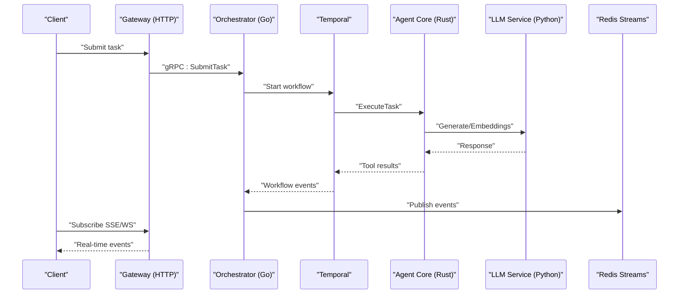
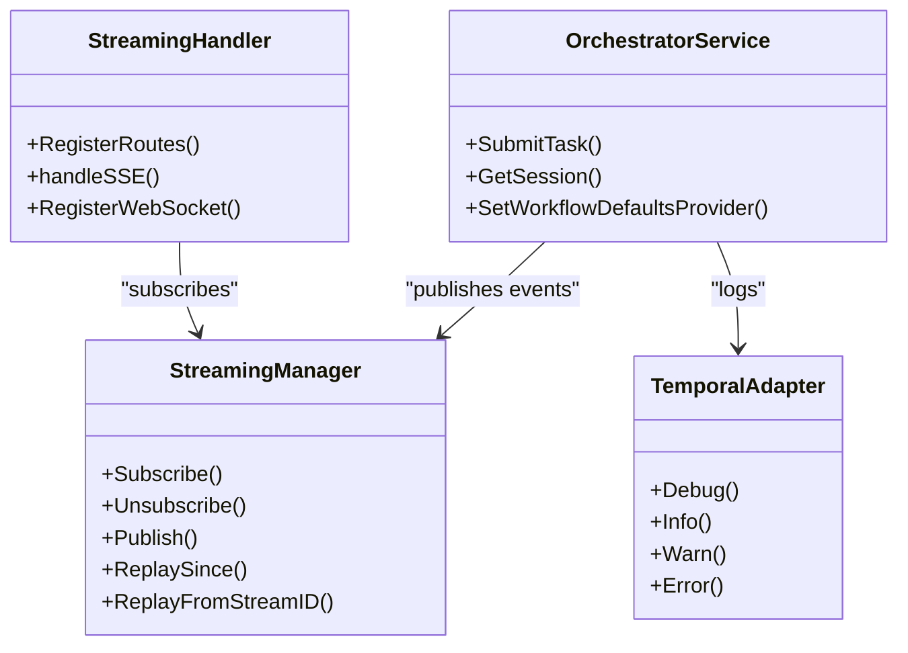
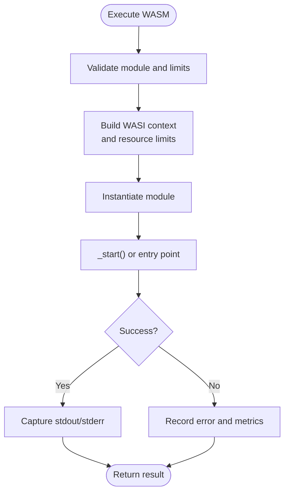
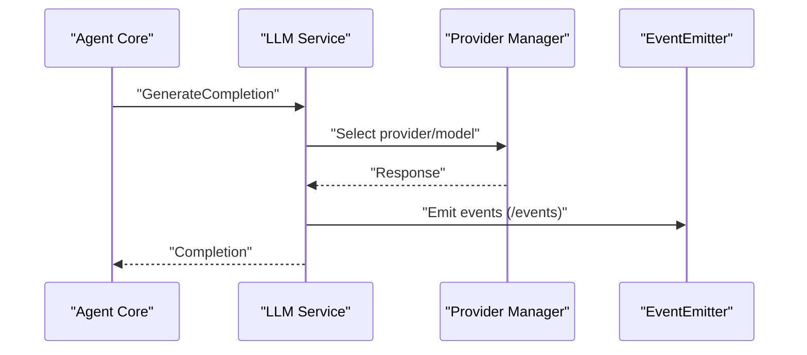
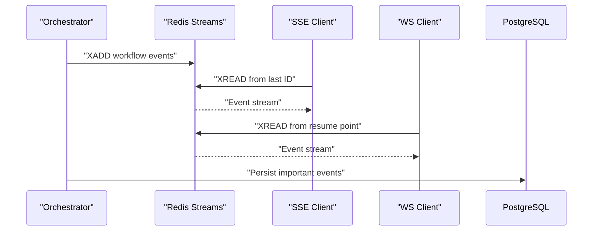
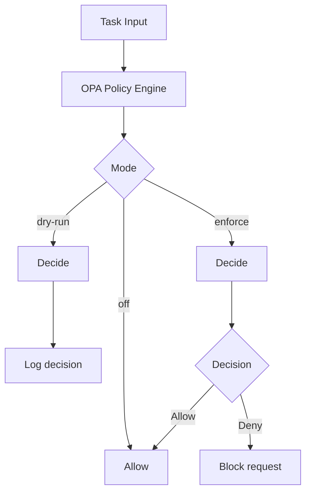
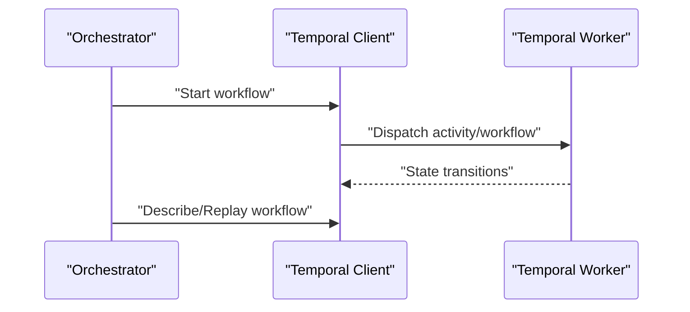
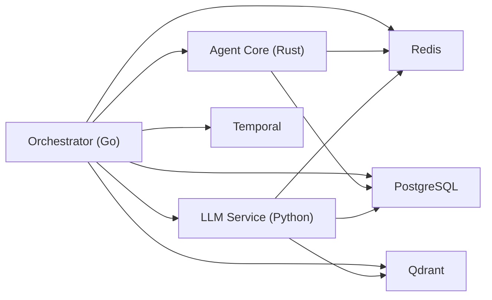

# Core Architecture

<cite>
**Referenced Files in This Document**
- [README.md](file://README.md)
- [go/orchestrator/main.go](file://go/orchestrator/main.go)
- [go/orchestrator/internal/streaming/manager.go](file://go/orchestrator/internal/streaming/manager.go)
- [go/orchestrator/internal/httpapi/streaming.go](file://go/orchestrator/internal/httpapi/streaming.go)
- [go/orchestrator/internal/httpapi/websocket.go](file://go/orchestrator/internal/httpapi/websocket.go)
- [go/orchestrator/internal/temporal/adapter.go](file://go/orchestrator/internal/temporal/adapter.go)
- [rust/agent-core/src/lib.rs](file://rust/agent-core/src/lib.rs)
- [rust/agent-core/src/wasi_sandbox.rs](file://rust/agent-core/src/wasi_sandbox.rs)
- [python/llm-service/main.py](file://python/llm-service/main.py)
- [config/shannon.yaml](file://config/shannon.yaml)
- [deploy/compose/docker-compose.yml](file://deploy/compose/docker-compose.yml)
- [protos/agent/agent.proto](file://protos/agent/agent.proto)
- [protos/llm/llm.proto](file://protos/llm/llm.proto)
- [config/opa/README.md](file://config/opa/README.md)
</cite>

## Table of Contents
1. [Introduction](#introduction)
2. [Project Structure](#project-structure)
3. [Core Components](#core-components)
4. [Architecture Overview](#architecture-overview)
5. [Detailed Component Analysis](#detailed-component-analysis)
6. [Dependency Analysis](#dependency-analysis)
7. [Performance Considerations](#performance-considerations)
8. [Troubleshooting Guide](#troubleshooting-guide)
9. [Conclusion](#conclusion)
10. [Appendices](#appendices)

## Introduction
This document describes the core system design of Shannon’s microservices architecture. It covers the high-level components—Orchestrator (Go), Agent Core (Rust), and LLM Service (Python)—and how they interact via gRPC and HTTP APIs. It explains the event-driven architecture built on Redis Streams for real-time communication, the security model using WASI sandboxing and OPA policy enforcement, and the temporal workflows system for deterministic execution and time-travel debugging. Cross-cutting concerns such as monitoring, observability, and scaling are addressed alongside infrastructure requirements and deployment topology.

## Project Structure
Shannon is organized as a multi-language microservices platform:
- Orchestrator (Go): Central task routing, session management, policy enforcement, temporal workflows, streaming, and HTTP/gRPC gateways.
- Agent Core (Rust): WASI sandboxed agent execution, tool registry, and policy enforcement.
- LLM Service (Python): Provider abstraction, tool execution, embeddings, and event emission.
- Configuration: YAML-based feature flags, model pricing, policies, and vector/embedding settings.
- Deployment: Docker Compose-based orchestration with PostgreSQL, Redis, Qdrant, and Temporal.

```mermaid
graph TB
subgraph "Client Layer"
GW["Gateway (HTTP)"]
SDK["SDKs (Python, CLI)"]
end
subgraph "Orchestrator (Go)"
ORCH["Orchestrator Service"]
TEMP["Temporal Worker"]
STR["Streaming Manager (Redis Streams)"]
end
subgraph "Agent Core (Rust)"
AC["Agent Service (gRPC)"]
WASI["WASI Sandbox"]
end
subgraph "LLM Service (Python)"
LLM["LLM Service (FastAPI)"]
end
subgraph "Data & Infra"
PG["PostgreSQL"]
RD["Redis"]
QD["Qdrant"]
TM["Temporal Server"]
end
GW --> ORCH
SDK --> GW
ORCH <- --> AC
ORCH <- --> LLM
ORCH --> STR
STR --> RD
ORCH --> PG
ORCH --> QD
ORCH --> TM
AC --> WASI
AC --> RD
AC --> PG
LLM --> RD
LLM --> PG
LLM --> QD
```

**Diagram sources**
- [deploy/compose/docker-compose.yml](file://deploy/compose/docker-compose.yml#L14-L411)
- [go/orchestrator/main.go](file://go/orchestrator/main.go#L49-L799)
- [python/llm-service/main.py](file://python/llm-service/main.py#L1-L164)
- [rust/agent-core/src/lib.rs](file://rust/agent-core/src/lib.rs#L1-L21)

**Section sources**
- [README.md](file://README.md#L201-L218)
- [deploy/compose/docker-compose.yml](file://deploy/compose/docker-compose.yml#L14-L411)

## Core Components
- Orchestrator (Go)
  - gRPC services: OrchestratorService, SessionService, StreamingService.
  - HTTP endpoints: SSE/WS streaming, approvals, timeline, health.
  - Temporal integration: Workers, schedules, and logging adapter.
  - Streaming: Redis Streams-based event bus with replay and persistence.
  - Policies: OPA engine integrated with hot-reload.
  - Configuration: YAML-based with hot-reload and environment overrides.
- Agent Core (Rust)
  - gRPC AgentService for task execution and tool discovery.
  - WASI sandbox enforcing memory, fuel, and filesystem constraints.
  - Tool registry and execution with metrics.
- LLM Service (Python)
  - FastAPI service exposing completions, embeddings, tools, and health.
  - Provider abstraction for multiple LLMs.
  - Event emission to Orchestrator’s admin endpoints.
  - OpenTelemetry tracing and Prometheus metrics.

**Section sources**
- [go/orchestrator/main.go](file://go/orchestrator/main.go#L396-L799)
- [go/orchestrator/internal/streaming/manager.go](file://go/orchestrator/internal/streaming/manager.go#L36-L93)
- [go/orchestrator/internal/httpapi/streaming.go](file://go/orchestrator/internal/httpapi/streaming.go#L18-L38)
- [rust/agent-core/src/lib.rs](file://rust/agent-core/src/lib.rs#L1-L21)
- [rust/agent-core/src/wasi_sandbox.rs](file://rust/agent-core/src/wasi_sandbox.rs#L15-L72)
- [python/llm-service/main.py](file://python/llm-service/main.py#L1-L164)
- [config/shannon.yaml](file://config/shannon.yaml#L251-L262)

## Architecture Overview
Shannon’s architecture is event-driven and workflow-centric:
- Clients submit tasks via HTTP or SDKs to the Gateway, which forwards to the Orchestrator.
- Orchestrator validates, enforces policies, and schedules Temporal workflows.
- Workflows orchestrate Agent Core for tool execution and LLM Service for generation and embeddings.
- Redis Streams carries real-time events; SSE/WS endpoints expose them to clients.
- PostgreSQL stores persistent state; Qdrant provides vector memory; Redis manages sessions and streaming.



**Diagram sources**
- [go/orchestrator/main.go](file://go/orchestrator/main.go#L49-L799)
- [go/orchestrator/internal/streaming/manager.go](file://go/orchestrator/internal/streaming/manager.go#L364-L492)
- [go/orchestrator/internal/httpapi/streaming.go](file://go/orchestrator/internal/httpapi/streaming.go#L40-L366)
- [protos/agent/agent.proto](file://protos/agent/agent.proto#L10-L17)
- [protos/llm/llm.proto](file://protos/llm/llm.proto#L9-L15)

## Detailed Component Analysis

### Orchestrator (Go)
- Responsibilities
  - Task routing, session management, approvals, and scheduling.
  - Policy enforcement via OPA with hot-reload.
  - Temporal client and workers for deterministic workflows.
  - Streaming manager backed by Redis Streams with replay and persistence.
  - HTTP admin endpoints for SSE/WS, approvals, timeline, and metrics.
- gRPC Services
  - OrchestratorService: task submission and session control.
  - SessionService: session lifecycle and history.
  - StreamingService: event streaming to clients.
- Integration Patterns
  - gRPC for internal service-to-service calls.
  - HTTP for client-facing APIs and streaming.
  - Redis Streams for real-time event distribution.
  - Temporal for durable execution and time-travel debugging.



**Diagram sources**
- [go/orchestrator/main.go](file://go/orchestrator/main.go#L368-L378)
- [go/orchestrator/internal/streaming/manager.go](file://go/orchestrator/internal/streaming/manager.go#L152-L178)
- [go/orchestrator/internal/httpapi/streaming.go](file://go/orchestrator/internal/httpapi/streaming.go#L18-L38)
- [go/orchestrator/internal/temporal/adapter.go](file://go/orchestrator/internal/temporal/adapter.go#L11-L90)

**Section sources**
- [go/orchestrator/main.go](file://go/orchestrator/main.go#L49-L799)
- [go/orchestrator/internal/streaming/manager.go](file://go/orchestrator/internal/streaming/manager.go#L36-L93)
- [go/orchestrator/internal/httpapi/streaming.go](file://go/orchestrator/internal/httpapi/streaming.go#L18-L38)
- [go/orchestrator/internal/httpapi/websocket.go](file://go/orchestrator/internal/httpapi/websocket.go#L18-L21)
- [go/orchestrator/internal/temporal/adapter.go](file://go/orchestrator/internal/temporal/adapter.go#L11-L90)

### Agent Core (Rust)
- Responsibilities
  - Executes agent tasks via WASI sandbox.
  - Manages tool registry and execution.
  - Enforces policy and rate limits.
- WASI Sandbox
  - Memory guard, fuel-based CPU control, epoch-based timeouts.
  - Read-only filesystem access and strict capability boundaries.
  - Captures stdout/stderr and emits metrics.



**Diagram sources**
- [rust/agent-core/src/wasi_sandbox.rs](file://rust/agent-core/src/wasi_sandbox.rs#L124-L433)

**Section sources**
- [rust/agent-core/src/lib.rs](file://rust/agent-core/src/lib.rs#L1-L21)
- [rust/agent-core/src/wasi_sandbox.rs](file://rust/agent-core/src/wasi_sandbox.rs#L15-L72)

### LLM Service (Python)
- Responsibilities
  - Provider abstraction for 15+ LLMs.
  - Tool execution and MCP integration.
  - Embeddings, complexity analysis, and context management.
  - Event emission to Orchestrator’s admin endpoints.
  - OpenTelemetry tracing and Prometheus metrics.



**Diagram sources**
- [python/llm-service/main.py](file://python/llm-service/main.py#L71-L114)
- [protos/llm/llm.proto](file://protos/llm/llm.proto#L21-L34)

**Section sources**
- [python/llm-service/main.py](file://python/llm-service/main.py#L1-L164)

### Streaming and Event-Driven Architecture (Redis Streams)
- Streaming Manager
  - Publishes events to Redis Streams with sequence numbers and TTL.
  - Subscribes clients via SSE or WS; supports resume via Last-Event-ID or stream IDs.
  - Persists selected events to PostgreSQL for audit and timeline.
- Streaming Handler
  - SSE: maps internal event types to SSE event names and flushes chunks.
  - WS: supports resume, filters, and heartbeat.



**Diagram sources**
- [go/orchestrator/internal/streaming/manager.go](file://go/orchestrator/internal/streaming/manager.go#L364-L492)
- [go/orchestrator/internal/httpapi/streaming.go](file://go/orchestrator/internal/httpapi/streaming.go#L40-L366)
- [go/orchestrator/internal/httpapi/websocket.go](file://go/orchestrator/internal/httpapi/websocket.go#L23-L154)

**Section sources**
- [go/orchestrator/internal/streaming/manager.go](file://go/orchestrator/internal/streaming/manager.go#L19-L93)
- [go/orchestrator/internal/httpapi/streaming.go](file://go/orchestrator/internal/httpapi/streaming.go#L40-L366)
- [go/orchestrator/internal/httpapi/websocket.go](file://go/orchestrator/internal/httpapi/websocket.go#L23-L154)

### Security Model: WASI Sandboxing and OPA
- WASI Sandboxing (Agent Core)
  - Memory guard, fuel-based CPU limits, epoch-based timeouts.
  - Read-only filesystem access and restricted capabilities.
  - Metrics and structured error reporting.
- OPA Policy Enforcement (Orchestrator)
  - YAML-based policies with hot-reload.
  - Modes: off, dry-run, enforce.
  - Audit logging and performance metrics.



**Diagram sources**
- [config/opa/README.md](file://config/opa/README.md#L234-L241)
- [config/shannon.yaml](file://config/shannon.yaml#L251-L262)

**Section sources**
- [rust/agent-core/src/wasi_sandbox.rs](file://rust/agent-core/src/wasi_sandbox.rs#L15-L72)
- [config/opa/README.md](file://config/opa/README.md#L1-L422)
- [config/shannon.yaml](file://config/shannon.yaml#L251-L262)

### Temporal Workflows and Deterministic Execution
- Temporal Client and Workers
  - Orchestrator initializes Temporal client and workers for priority queues.
  - Logging adapted to Zap for consistent observability.
  - Schedule manager wires cron-based tasks.
- Time-Travel Debugging
  - Temporal UI and replay scripts enable deterministic replay and step-by-step debugging.



**Diagram sources**
- [go/orchestrator/main.go](file://go/orchestrator/main.go#L610-L779)
- [go/orchestrator/internal/temporal/adapter.go](file://go/orchestrator/internal/temporal/adapter.go#L11-L90)

**Section sources**
- [go/orchestrator/main.go](file://go/orchestrator/main.go#L610-L779)
- [go/orchestrator/internal/temporal/adapter.go](file://go/orchestrator/internal/temporal/adapter.go#L11-L90)

## Dependency Analysis
- Service Dependencies
  - Orchestrator depends on Temporal, PostgreSQL, Redis, Qdrant, and Agent Core/LLM Service.
  - Agent Core depends on Redis and optionally Agent Core for WASI execution.
  - LLM Service depends on Redis, PostgreSQL, Qdrant, and external providers.
- Coupling and Cohesion
  - Orchestrator maintains high cohesion around workflow orchestration and delegates execution to Agent Core and LLM Service.
  - Streaming is decoupled via Redis Streams, enabling independent scaling of producers and consumers.
- External Dependencies
  - gRPC protobufs define contracts between Orchestrator and Agent Core.
  - HTTP APIs expose streaming and administrative endpoints.



**Diagram sources**
- [deploy/compose/docker-compose.yml](file://deploy/compose/docker-compose.yml#L14-L411)
- [protos/agent/agent.proto](file://protos/agent/agent.proto#L10-L17)
- [protos/llm/llm.proto](file://protos/llm/llm.proto#L9-L15)

**Section sources**
- [deploy/compose/docker-compose.yml](file://deploy/compose/docker-compose.yml#L14-L411)
- [protos/agent/agent.proto](file://protos/agent/agent.proto#L10-L17)
- [protos/llm/llm.proto](file://protos/llm/llm.proto#L9-L15)

## Performance Considerations
- Streaming
  - Redis Streams with bounded capacity and TTL to prevent memory bloat.
  - SSE/WS heartbeats and inactivity timers to manage long-lived connections.
- Temporal
  - Priority queues and configurable worker concurrency to balance load.
  - Epoch-based timeouts and fuel limits to bound CPU usage.
- WASI
  - Guard pages and strict memory limits prevent runaway memory usage.
- Observability
  - Prometheus metrics and OpenTelemetry tracing for end-to-end performance insights.

[No sources needed since this section provides general guidance]

## Troubleshooting Guide
- Health Checks
  - Use health endpoints on ports 8080 (Gateway) and 8081 (Admin/Events).
- Logs
  - Inspect service logs via Docker Compose for Orchestrator, Agent Core, LLM Service, and supporting services.
- Policy Issues
  - Verify policy mode and hot-reload behavior; check metrics for divergence and evaluation latency.
- Streaming
  - Confirm Redis connectivity and stream capacity; validate Last-Event-ID or stream IDs for resume.

**Section sources**
- [README.md](file://README.md#L395-L421)
- [config/opa/README.md](file://config/opa/README.md#L356-L372)

## Conclusion
Shannon’s architecture combines robust microservices with event-driven streaming, strong security via WASI and OPA, and deterministic execution powered by Temporal. The design emphasizes scalability, observability, and operational safety, enabling production-grade AI agent workflows with real-time visibility and replayable traces.

[No sources needed since this section summarizes without analyzing specific files]

## Appendices

### Infrastructure Requirements and Deployment Topology
- Required Services
  - PostgreSQL, Redis, Qdrant, Temporal, and supporting services.
- Ports
  - Gateway: 8080, Admin/Events: 8081, Orchestrator gRPC: 50052, Temporal UI: 8088, Grafana: 3030.
- Deployment
  - Docker Compose orchestrates all services with health checks and migrations.

**Section sources**
- [README.md](file://README.md#L191-L200)
- [deploy/compose/docker-compose.yml](file://deploy/compose/docker-compose.yml#L14-L411)

### API Contracts and Protocols
- gRPC Contracts
  - AgentService: ExecuteTask, StreamExecuteTask, GetCapabilities, HealthCheck, DiscoverTools.
  - LLMService: GenerateCompletion, StreamCompletion, EmbedText, AnalyzeComplexity, ListModels.
- HTTP Streaming
  - SSE and WebSocket endpoints for real-time event delivery with resume support.

**Section sources**
- [protos/agent/agent.proto](file://protos/agent/agent.proto#L10-L156)
- [protos/llm/llm.proto](file://protos/llm/llm.proto#L9-L49)
- [go/orchestrator/internal/httpapi/streaming.go](file://go/orchestrator/internal/httpapi/streaming.go#L34-L38)
- [go/orchestrator/internal/httpapi/websocket.go](file://go/orchestrator/internal/httpapi/websocket.go#L18-L21)