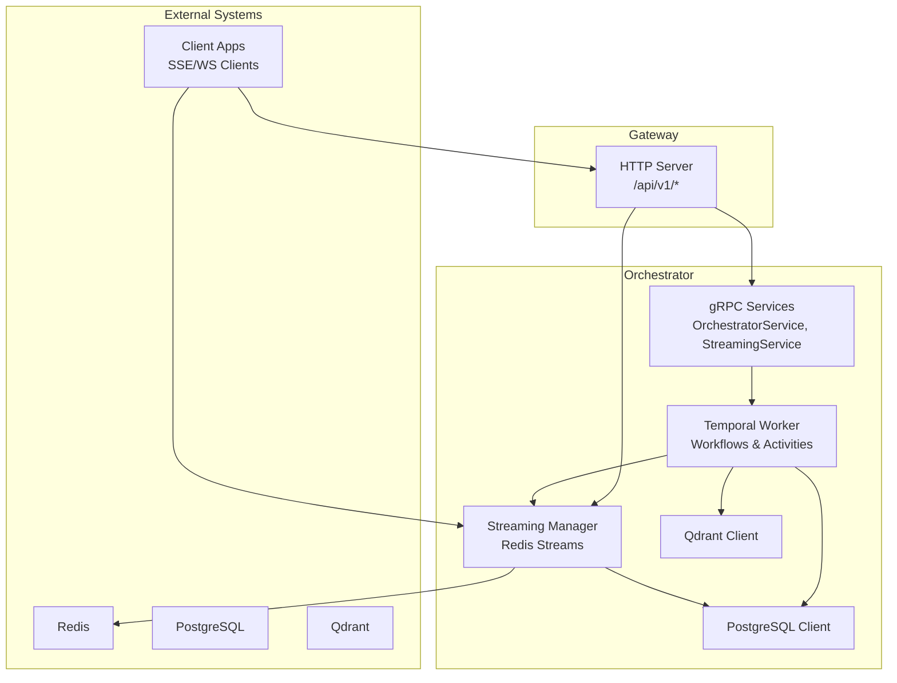
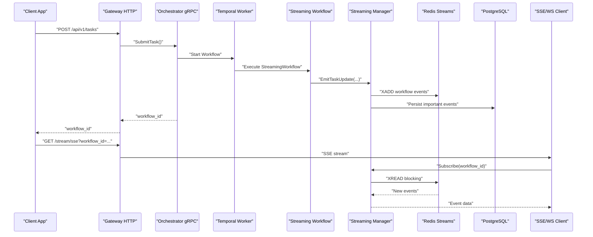
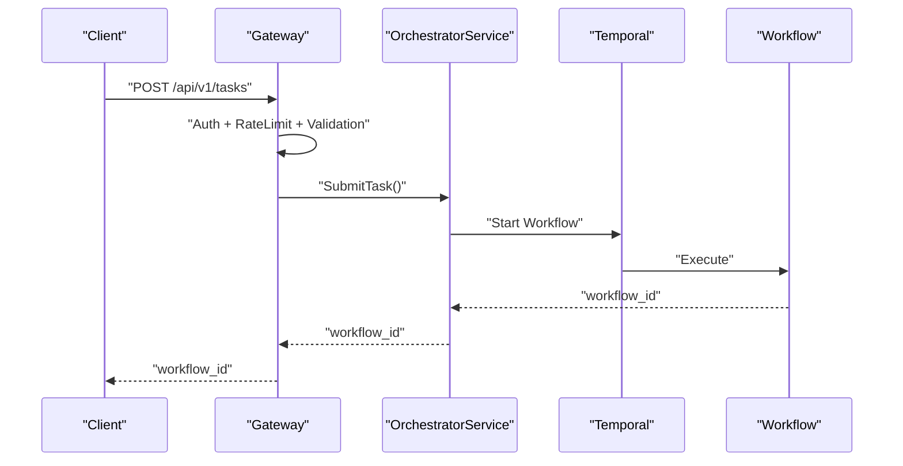
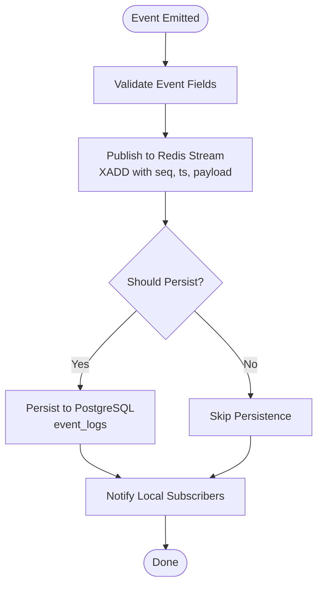
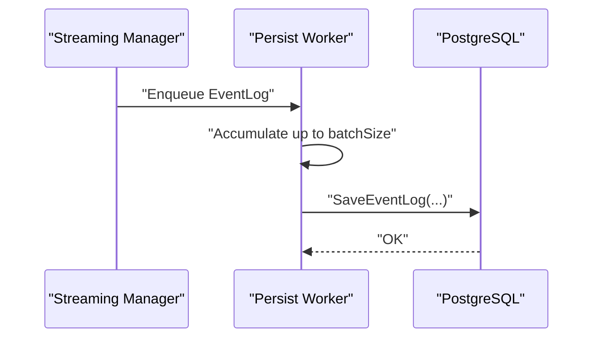
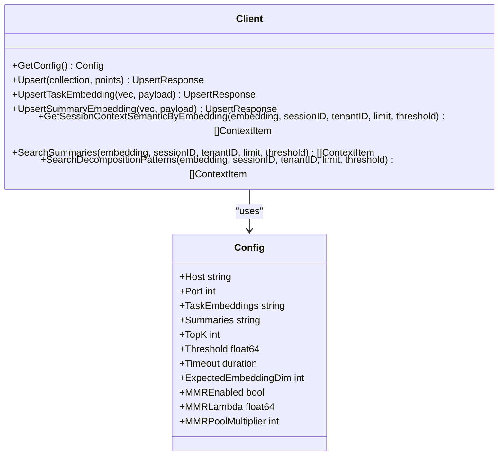
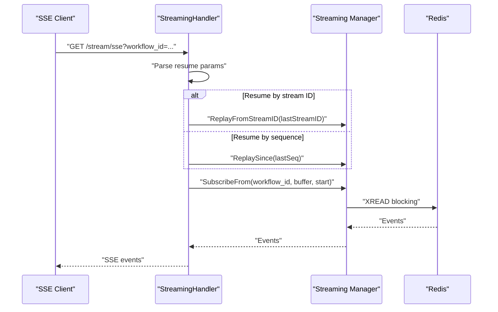
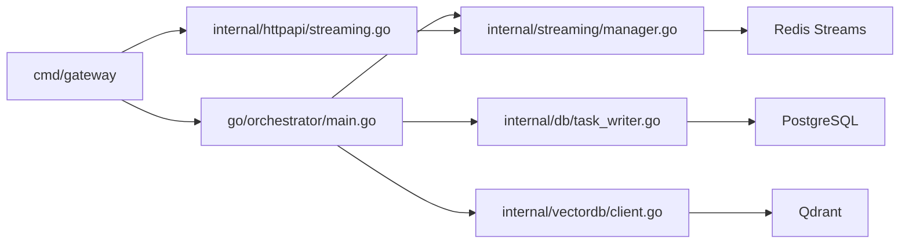

# Data Flow Architecture

<cite>
**Referenced Files in This Document**
- [main.go](file://go/orchestrator/main.go)
- [gateway/main.go](file://go/orchestrator/cmd/gateway/main.go)
- [manager.go](file://go/orchestrator/internal/streaming/manager.go)
- [streaming.go](file://go/orchestrator/internal/httpapi/streaming.go)
- [events_ingest.go](file://go/orchestrator/internal/httpapi/events_ingest.go)
- [stream_events.go](file://go/orchestrator/internal/activities/stream_events.go)
- [streaming_workflow.go](file://go/orchestrator/internal/workflows/streaming_workflow.go)
- [client.go](file://go/orchestrator/internal/vectordb/client.go)
- [task_writer.go](file://go/orchestrator/internal/db/task_writer.go)
- [models.go](file://go/orchestrator/internal/db/models.go)
- [shannon.yaml](file://config/shannon.yaml)
- [orchestrator.proto](file://protos/orchestrator/orchestrator.proto)
- [streaming.proto](file://protos/orchestrator/streaming.proto)
</cite>

## Table of Contents
1. [Introduction](#introduction)
2. [Project Structure](#project-structure)
3. [Core Components](#core-components)
4. [Architecture Overview](#architecture-overview)
5. [Detailed Component Analysis](#detailed-component-analysis)
6. [Dependency Analysis](#dependency-analysis)
7. [Performance Considerations](#performance-considerations)
8. [Troubleshooting Guide](#troubleshooting-guide)
9. [Conclusion](#conclusion)

## Introduction
This document describes Shannon's data flow architecture and event-driven design. It covers the complete pipeline from client task submission to real-time streaming responses, including Redis Streams-based event publishing and consumption, PostgreSQL persistence, and Qdrant vector search. The document explains the event-driven communication model, message formats, validation and transformation processes, and routing mechanisms across the system.

## Project Structure
Shannon is organized around a Go-based orchestrator service with supporting components:
- Gateway HTTP server exposing REST APIs and streaming endpoints
- Orchestrator service implementing gRPC APIs and Temporal workflow execution
- Streaming subsystem built on Redis Streams with SSE/WS consumers
- Persistence layer for task and event logs in PostgreSQL
- Vector database client for Qdrant semantic search
- Configuration-driven initialization and feature toggles

**Diagram sources**
- [main.go](file://go/orchestrator/main.go#L49-L800)
- [gateway/main.go](file://go/orchestrator/cmd/gateway/main.go#L30-L688)
- [manager.go](file://go/orchestrator/internal/streaming/manager.go#L1-L921)
- [client.go](file://go/orchestrator/internal/vectordb/client.go#L1-L439)

**Section sources**
- [main.go](file://go/orchestrator/main.go#L49-L800)
- [gateway/main.go](file://go/orchestrator/cmd/gateway/main.go#L30-L688)

## Core Components
- Streaming Manager: Manages Redis Streams for workflow events, handles subscription/unsubscription, publishes events, persists selected events to PostgreSQL, and supports replay.
- HTTP Streaming Handler: Converts internal streaming events to Server-Sent Events and WebSocket frames, supports resume via Last-Event-ID or Redis stream IDs.
- Event Ingest Handler: Accepts external events via HTTP for ingestion into Redis Streams.
- Workflow Engine: Executes streaming workflows, emits structured events, and coordinates agent/tool execution.
- Persistence Layer: Saves task execution, agent/tool execution, and event logs to PostgreSQL with idempotent updates.
- Vector Database Client: Performs semantic search against Qdrant collections and upserts embeddings.

**Section sources**
- [manager.go](file://go/orchestrator/internal/streaming/manager.go#L1-L921)
- [streaming.go](file://go/orchestrator/internal/httpapi/streaming.go#L1-L367)
- [events_ingest.go](file://go/orchestrator/internal/httpapi/events_ingest.go#L1-L90)
- [streaming_workflow.go](file://go/orchestrator/internal/workflows/streaming_workflow.go#L1-L709)
- [task_writer.go](file://go/orchestrator/internal/db/task_writer.go#L1-L644)
- [models.go](file://go/orchestrator/internal/db/models.go#L1-L245)
- [client.go](file://go/orchestrator/internal/vectordb/client.go#L1-L439)

## Architecture Overview
Shannon implements an event-driven architecture centered on Redis Streams for real-time event publication and consumption. Workflows emit typed events that are published to Redis and persisted to PostgreSQL for historical retrieval. Clients consume events via SSE or WebSocket endpoints exposed by the gateway and orchestrator admin server. Vector search integrates with Qdrant for semantic retrieval.

**Diagram sources**
- [gateway/main.go](file://go/orchestrator/cmd/gateway/main.go#L186-L213)
- [main.go](file://go/orchestrator/main.go#L396-L470)
- [streaming_workflow.go](file://go/orchestrator/internal/workflows/streaming_workflow.go#L21-L303)
- [streaming.go](file://go/orchestrator/internal/httpapi/streaming.go#L42-L366)
- [manager.go](file://go/orchestrator/internal/streaming/manager.go#L152-L492)

## Detailed Component Analysis

### Task Submission Flow
- Gateway validates, authenticates, and rate-limits requests before forwarding to the orchestrator.
- Orchestrator submits tasks to Temporal, which starts appropriate workflows.
- The workflow emits structured events that are published to Redis Streams and persisted to PostgreSQL.

**Diagram sources**
- [gateway/main.go](file://go/orchestrator/cmd/gateway/main.go#L186-L213)
- [main.go](file://go/orchestrator/main.go#L396-L470)

**Section sources**
- [gateway/main.go](file://go/orchestrator/cmd/gateway/main.go#L186-L213)
- [main.go](file://go/orchestrator/main.go#L396-L470)

### Real-Time Streaming via Redis Streams
- Internal event emission uses a typed event model with standardized event types.
- The Streaming Manager publishes events to Redis Streams with sequence numbers and timestamps.
- The HTTP Streaming Handler converts internal events to SSE/WS frames and supports resume via Redis stream IDs or numeric sequences.

**Diagram sources**
- [stream_events.go](file://go/orchestrator/internal/activities/stream_events.go#L72-L91)
- [manager.go](file://go/orchestrator/internal/streaming/manager.go#L365-L492)

**Section sources**
- [stream_events.go](file://go/orchestrator/internal/activities/stream_events.go#L1-L92)
- [manager.go](file://go/orchestrator/internal/streaming/manager.go#L1-L921)

### Event Persistence to PostgreSQL
- The Streaming Manager maintains a batcher that asynchronously persists important events to PostgreSQL.
- The persistence logic filters out streaming deltas and heartbeats to reduce DB load.
- Task execution records are saved with idempotent updates keyed by workflow_id.

**Diagram sources**
- [manager.go](file://go/orchestrator/internal/streaming/manager.go#L662-L696)
- [task_writer.go](file://go/orchestrator/internal/db/task_writer.go#L24-L46)

**Section sources**
- [manager.go](file://go/orchestrator/internal/streaming/manager.go#L494-L696)
- [task_writer.go](file://go/orchestrator/internal/db/task_writer.go#L24-L46)

### Vector Search Operations with Qdrant
- The Vector DB client encapsulates Qdrant HTTP operations with circuit breaker protection and tracing.
- It supports semantic search with optional MMR diversity and upsert operations for embeddings.
- Collections are configurable via the configuration system.

**Diagram sources**
- [client.go](file://go/orchestrator/internal/vectordb/client.go#L19-L439)
- [shannon.yaml](file://config/shannon.yaml#L283-L304)

**Section sources**
- [client.go](file://go/orchestrator/internal/vectordb/client.go#L1-L439)
- [shannon.yaml](file://config/shannon.yaml#L283-L304)

### Streaming Infrastructure and Resume Semantics
- The HTTP Streaming Handler supports resume via Last-Event-ID (numeric) or Redis stream ID.
- It translates internal event types to SSE event names and filters by type.
- It includes heartbeat and post-completion inactivity timers to manage long-lived connections.

**Diagram sources**
- [streaming.go](file://go/orchestrator/internal/httpapi/streaming.go#L42-L366)
- [manager.go](file://go/orchestrator/internal/streaming/manager.go#L698-L800)

**Section sources**
- [streaming.go](file://go/orchestrator/internal/httpapi/streaming.go#L1-L367)
- [manager.go](file://go/orchestrator/internal/streaming/manager.go#L142-L800)

### Data Validation, Transformation, and Routing
- Gateway applies middleware for authentication, rate limiting, idempotency, validation, and tracing.
- Event ingestion handler validates request bodies and enforces bearer token authentication when configured.
- Streaming Manager sanitizes payloads to prevent Redis/Postgres bloat and drops critical events with warnings when subscribers are slow.

**Section sources**
- [gateway/main.go](file://go/orchestrator/cmd/gateway/main.go#L128-L134)
- [events_ingest.go](file://go/orchestrator/internal/httpapi/events_ingest.go#L36-L90)
- [manager.go](file://go/orchestrator/internal/streaming/manager.go#L323-L343)

## Dependency Analysis
The orchestrator composes multiple subsystems with clear boundaries:
- Gateway depends on orchestrator gRPC services and Redis for rate limiting.
- Orchestrator initializes Redis, PostgreSQL, Qdrant, and Temporal, wires streaming and persistence, and exposes gRPC services.
- Workflows depend on activities that emit events and may call vector search and persistence.

**Diagram sources**
- [gateway/main.go](file://go/orchestrator/cmd/gateway/main.go#L30-L688)
- [main.go](file://go/orchestrator/main.go#L49-L800)
- [manager.go](file://go/orchestrator/internal/streaming/manager.go#L1-L921)
- [task_writer.go](file://go/orchestrator/internal/db/task_writer.go#L1-L644)
- [client.go](file://go/orchestrator/internal/vectordb/client.go#L1-L439)

**Section sources**
- [gateway/main.go](file://go/orchestrator/cmd/gateway/main.go#L30-L688)
- [main.go](file://go/orchestrator/main.go#L49-L800)

## Performance Considerations
- Redis Streams provides efficient, bounded buffering with configurable ring capacity per workflow.
- PostgreSQL persistence uses batching and asynchronous workers to minimize impact on event throughput.
- Vector search operations are protected by circuit breakers and tracing for observability.
- Streaming endpoints disable write timeouts to support long-lived SSE connections and include heartbeat mechanisms.

[No sources needed since this section provides general guidance]

## Troubleshooting Guide
Common operational issues and diagnostics:
- Redis connectivity failures: Verify Redis URL and credentials; the gateway tests Redis connectivity on startup.
- PostgreSQL persistence failures: Check batch sizes and intervals; the streaming manager logs warnings when the eventlog batcher is full.
- Qdrant availability: Circuit breaker protects against transient failures; verify host/port and collection configuration.
- Streaming timeouts: The SSE handler includes first-event and post-completion timers; ensure workflows are healthy and emitting events.

**Section sources**
- [gateway/main.go](file://go/orchestrator/cmd/gateway/main.go#L77-L91)
- [manager.go](file://go/orchestrator/internal/streaming/manager.go#L662-L696)
- [client.go](file://go/orchestrator/internal/vectordb/client.go#L1-L439)
- [streaming.go](file://go/orchestrator/internal/httpapi/streaming.go#L264-L312)

## Conclusion
Shannon’s architecture leverages Redis Streams for scalable, real-time event distribution, PostgreSQL for durable persistence, and Qdrant for semantic search. The event-driven model, with typed events and standardized formats, enables flexible streaming and reliable historical retrieval. Configuration-driven initialization and middleware layers provide operational resilience and extensibility.