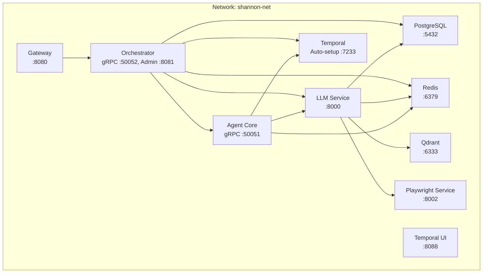
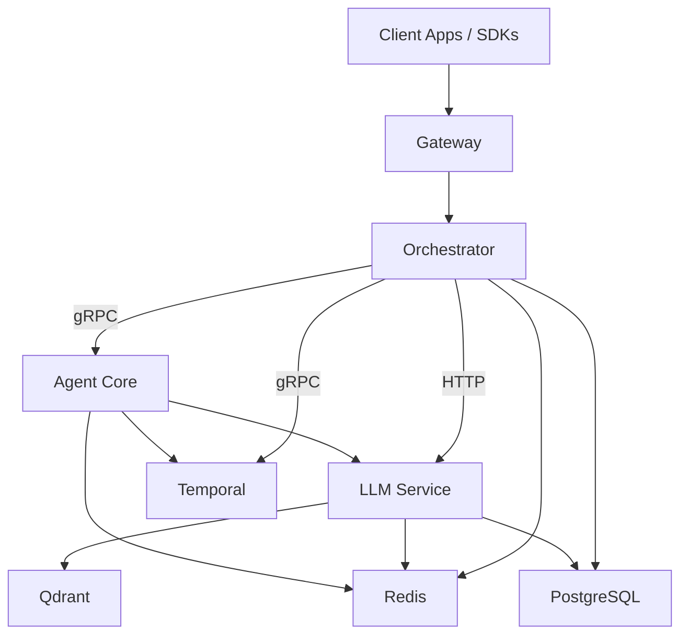
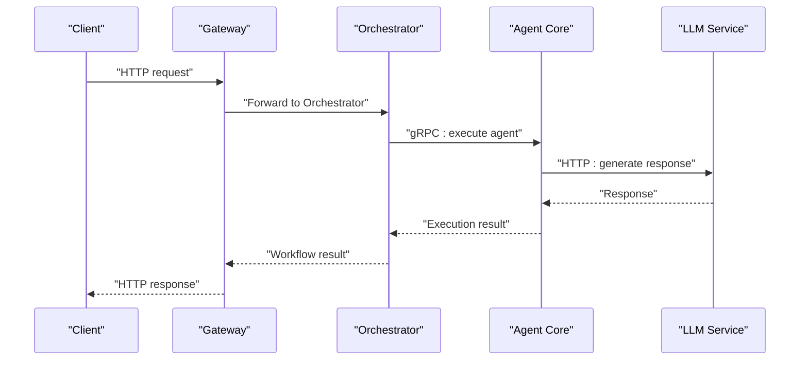
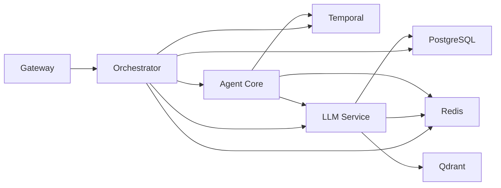

# Deployment Topology

<cite>
**Referenced Files in This Document**
- [docker-compose.yml](file://deploy/compose/docker-compose.yml)
- [docker-compose.release.yml](file://deploy/compose/docker-compose.release.yml)
- [docker-compose.override.example.yml](file://deploy/compose/docker-compose.override.example.yml)
- [docker-compose-grafana-prometheus.yml](file://deploy/compose/grafana/docker-compose-grafana-prometheus.yml)
- [.env.example](file://.env.example)
- [shannon.yaml](file://config/shannon.yaml)
- [models.yaml](file://config/models.yaml)
- [features.yaml](file://config/features.yaml)
- [001_initial_schema.sql](file://migrations/postgres/001_initial_schema.sql)
- [create_collections.py](file://migrations/qdrant/create_collections.py)
- [init_qdrant.sh](file://scripts/init_qdrant.sh)
- [Dockerfile (gateway)](file://go/orchestrator/cmd/gateway/Dockerfile)
- [Dockerfile (orchestrator)](file://go/orchestrator/Dockerfile)
- [Dockerfile (llm-service)](file://python/llm-service/Dockerfile)
- [Dockerfile (agent-core)](file://rust/agent-core/Dockerfile)
</cite>

## Table of Contents
1. [Introduction](#introduction)
2. [Project Structure](#project-structure)
3. [Core Components](#core-components)
4. [Architecture Overview](#architecture-overview)
5. [Detailed Component Analysis](#detailed-component-analysis)
6. [Dependency Analysis](#dependency-analysis)
7. [Performance Considerations](#performance-considerations)
8. [Troubleshooting Guide](#troubleshooting-guide)
9. [Conclusion](#conclusion)
10. [Appendices](#appendices)

## Introduction
This document describes Shannon’s deployment topology and infrastructure requirements. It covers Docker Compose configurations for local development and production, service mesh patterns, container orchestration, scaling strategies, and infrastructure dependencies including Redis, PostgreSQL, Qdrant, and Temporal. It also documents environment configuration, secrets management, network topology, deployment best practices, monitoring setup, and disaster recovery considerations.

## Project Structure
Shannon’s deployment is orchestrated with Docker Compose. The primary stack includes:
- Gateway (HTTP ingress)
- Orchestrator (gRPC + HTTP admin)
- LLM Service (Python)
- Agent Core (Rust WASM sandbox)
- Playwright Service (browser automation)
- Temporal (workflow orchestration)
- PostgreSQL (primary relational persistence)
- Redis (caching, rate limiting, session state)
- Qdrant (vector DB for embeddings and retrieval)
- Grafana/Prometheus (observability)

**Diagram sources**
- [docker-compose.yml](file://deploy/compose/docker-compose.yml#L14-L411)
- [docker-compose.release.yml](file://deploy/compose/docker-compose.release.yml#L14-L345)

**Section sources**
- [docker-compose.yml](file://deploy/compose/docker-compose.yml#L1-L411)
- [docker-compose.release.yml](file://deploy/compose/docker-compose.release.yml#L1-L345)

## Core Components
- Gateway: HTTP ingress and auth proxy for the platform. Exposes health and admin endpoints.
- Orchestrator: gRPC service implementing workflow orchestration, session management, and administrative APIs.
- LLM Service: Python service providing model routing, tool integrations, caching, and streaming.
- Agent Core: Rust service hosting WASM sandboxes for tool execution and agent capabilities.
- Playwright Service: Browser automation service for web scraping and UI-driven tasks.
- Temporal: Auto-setup server for workflow scheduling and persistence.
- PostgreSQL: Primary relational store for users, sessions, audit logs, and token usage.
- Redis: Caching, rate limiting, session storage, and metrics.
- Qdrant: Vector database for embeddings and similarity search.
- Grafana/Prometheus: Metrics and dashboarding included via Compose.

**Section sources**
- [docker-compose.yml](file://deploy/compose/docker-compose.yml#L14-L411)
- [docker-compose.release.yml](file://deploy/compose/docker-compose.release.yml#L14-L345)
- [docker-compose-grafana-prometheus.yml](file://deploy/compose/grafana/docker-compose-grafana-prometheus.yml)

## Architecture Overview
Shannon follows a microservices architecture with explicit separation of concerns:
- Ingress and auth via Gateway
- Business orchestration via Orchestrator (Temporal workflows)
- LLM and tooling via LLM Service
- Agent execution and sandboxing via Agent Core
- Data stores: PostgreSQL, Redis, Qdrant
- Observability via Prometheus/Grafana

**Diagram sources**
- [docker-compose.yml](file://deploy/compose/docker-compose.yml#L14-L411)
- [docker-compose.release.yml](file://deploy/compose/docker-compose.release.yml#L14-L345)

## Detailed Component Analysis

### Docker Compose: Local Development and Production
- Local development: Use the override file to enable development-friendly settings (auth bypass, ports, logging).
- Production: Use release images and environment overrides to pin versions and tune runtime parameters.

Key differences:
- Development Compose builds services from source; Release Compose pulls prebuilt images.
- Release Compose sets explicit VERSION and platform constraints for reproducibility.
- Both Composes share the same network and volumes for data persistence.

Operational notes:
- Health checks are defined for each service to ensure readiness.
- Volumes are declared for persistent data (PostgreSQL and Qdrant).
- Grafana/Prometheus stack is included via include directive.

**Section sources**
- [docker-compose.yml](file://deploy/compose/docker-compose.yml#L1-L411)
- [docker-compose.release.yml](file://deploy/compose/docker-compose.release.yml#L1-L345)
- [docker-compose.override.example.yml](file://deploy/compose/docker-compose.override.example.yml#L1-L107)
- [docker-compose-grafana-prometheus.yml](file://deploy/compose/grafana/docker-compose-grafana-prometheus.yml)

### Service Mesh Patterns
- Service-to-service communication occurs over named Docker services within the same network.
- gRPC is used for internal service calls (e.g., Orchestrator to Agent Core).
- HTTP is used for external APIs (e.g., LLM Service) and admin endpoints (e.g., Orchestrator admin).
- Temporal provides a robust workflow mesh with task queues and namespaces.

**Diagram sources**
- [docker-compose.yml](file://deploy/compose/docker-compose.yml#L14-L411)
- [docker-compose.release.yml](file://deploy/compose/docker-compose.release.yml#L14-L345)

### Container Orchestration and Scaling Strategies
- Horizontal scaling:
  - Orchestrator: Scale workers via worker concurrency settings per priority queue.
  - LLM Service: Scale replicas behind a reverse proxy or load balancer.
  - Agent Core: Scale replicas; coordinate with Redis for distributed rate limiting.
- Vertical scaling:
  - Increase CPU/memory limits for services based on workload.
  - Tune WASI sandbox timeouts and memory limits.
- Temporal:
  - Use multiple worker processes per queue to increase throughput.
  - Separate critical/high/normal/low priority queues for predictable latency.

**Section sources**
- [docker-compose.yml](file://deploy/compose/docker-compose.yml#L170-L200)
- [docker-compose.release.yml](file://deploy/compose/docker-compose.release.yml#L160-L195)
- [features.yaml](file://config/features.yaml#L44-L62)

### Infrastructure Requirements

#### Redis (Caching and Streaming)
- Role: Caching, rate limiting, session storage, metrics.
- Persistence: Append-only file enabled.
- Recommended sizing: Dedicated instance or managed service for production.
- Distributed rate limiting: Optional Redis URL for cross-service coordination.

**Section sources**
- [docker-compose.yml](file://deploy/compose/docker-compose.yml#L60-L71)
- [docker-compose.release.yml](file://deploy/compose/docker-compose.release.yml#L60-L85)
- [docker-compose.override.example.yml](file://deploy/compose/docker-compose.override.example.yml#L82-L86)
- [.env.example](file://.env.example#L74-L86)

#### PostgreSQL (Persistence)
- Role: Primary relational store for users, sessions, audit logs, token usage.
- Extensions: UUID, pg_trgm, btree_gin enabled at initialization.
- Migration: Initial schema and subsequent migrations applied at startup.

**Section sources**
- [docker-compose.yml](file://deploy/compose/docker-compose.yml#L41-L58)
- [docker-compose.release.yml](file://deploy/compose/docker-compose.release.yml#L41-L58)
- [001_initial_schema.sql](file://migrations/postgres/001_initial_schema.sql#L1-L141)

#### Qdrant (Vector Operations)
- Role: Vector similarity search for embeddings.
- Initialization: Automated creation of collections and payload indexes.
- Persistence: Volume mounted for durability.

**Section sources**
- [docker-compose.yml](file://deploy/compose/docker-compose.yml#L73-L94)
- [docker-compose.release.yml](file://deploy/compose/docker-compose.release.yml#L73-L100)
- [create_collections.py](file://migrations/qdrant/create_collections.py#L44-L227)
- [init_qdrant.sh](file://scripts/init_qdrant.sh#L1-L22)

#### Temporal (Workflow Orchestration)
- Role: Workflow scheduling, state persistence, and visibility.
- UI: Optional UI for inspection and management.
- Dependencies: Requires PostgreSQL for persistence.

**Section sources**
- [docker-compose.yml](file://deploy/compose/docker-compose.yml#L15-L40)
- [docker-compose.release.yml](file://deploy/compose/docker-compose.release.yml#L15-L40)
- [shannon.yaml](file://config/shannon.yaml#L263-L273)

### Environment Configuration and Secrets Management
- Environment variables are supplied via env_file and environment blocks in Compose.
- Sensitive values (API keys, JWT secret) should be managed externally and injected at runtime.
- Development override allows local JWT secret and auth bypass for convenience.

Recommended practices:
- Use a secrets manager or Compose secrets for sensitive values.
- Rotate JWT_SECRET in production.
- Lock down allowed domains for OpenAPI and MCP integrations.

**Section sources**
- [docker-compose.yml](file://deploy/compose/docker-compose.yml#L233-L235)
- [docker-compose.override.example.yml](file://deploy/compose/docker-compose.override.example.yml#L17-L26)
- [.env.example](file://.env.example#L160-L161)

### Network Topology
- All services are attached to a single bridge network named shannon-net.
- Services communicate using service DNS names (e.g., orchestrator:50052).
- Ports exposed for local development and UIs (Temporal UI, Grafana, Prometheus).

**Section sources**
- [docker-compose.yml](file://deploy/compose/docker-compose.yml#L3-L5)
- [docker-compose.release.yml](file://deploy/compose/docker-compose.release.yml#L3-L5)

### Monitoring and Observability
- Prometheus and Grafana are included via an included Compose file.
- Services expose metrics ports and health endpoints.
- Tracing and logging are configurable via environment variables.

**Section sources**
- [docker-compose.yml](file://deploy/compose/docker-compose.yml#L7-L8)
- [docker-compose.release.yml](file://deploy/compose/docker-compose.release.yml#L7-L8)
- [docker-compose-grafana-prometheus.yml](file://deploy/compose/grafana/docker-compose-grafana-prometheus.yml)
- [.env.example](file://.env.example#L171-L177)

## Dependency Analysis
Inter-service dependencies and coupling:
- Gateway depends on Orchestrator and data stores.
- Orchestrator depends on Temporal, PostgreSQL, Redis, and optionally Agent Core/Llm Service.
- LLM Service depends on Redis, PostgreSQL, Qdrant, and Playwright Service.
- Agent Core depends on Temporal, Redis, and LLM Service.

**Diagram sources**
- [docker-compose.yml](file://deploy/compose/docker-compose.yml#L14-L411)
- [docker-compose.release.yml](file://deploy/compose/docker-compose.release.yml#L14-L345)

**Section sources**
- [docker-compose.yml](file://deploy/compose/docker-compose.yml#L14-L411)
- [docker-compose.release.yml](file://deploy/compose/docker-compose.release.yml#L14-L345)

## Performance Considerations
- Worker concurrency: Tune worker counts per priority queue to match workload.
- Model tiering: Use model catalogs and budgets to control cost and latency.
- Caching: Enable and tune cache similarity thresholds and TTLs.
- Vector search: Adjust top-k and MMR settings for recall/latency trade-offs.
- Circuit breakers and backpressure: Configure thresholds to protect downstream systems.
- WASI sandbox: Adjust memory and timeout settings to prevent resource exhaustion.

[No sources needed since this section provides general guidance]

## Troubleshooting Guide
Common issues and remedies:
- Service health failures:
  - Check healthcheck intervals and service readiness.
  - Verify dependent services are healthy (e.g., Redis and PostgreSQL).
- Qdrant initialization:
  - Ensure qdrant-init completes successfully and collections are created.
- Temporal UI accessibility:
  - Confirm port mapping and UI configuration.
- Metrics and dashboards:
  - Validate Prometheus targets and Grafana datasource configuration.

**Section sources**
- [docker-compose.yml](file://deploy/compose/docker-compose.yml#L53-L57)
- [docker-compose.yml](file://deploy/compose/docker-compose.yml#L82-L94)
- [docker-compose.release.yml](file://deploy/compose/docker-compose.release.yml#L78-L84)
- [docker-compose.release.yml](file://deploy/compose/docker-compose.release.yml#L87-L100)

## Conclusion
Shannon’s deployment topology centers on a cohesive Docker Compose stack with clear separation of responsibilities. The design leverages Temporal for workflows, Redis for caching and rate limiting, PostgreSQL for persistence, and Qdrant for vector operations. With environment-driven configuration, health checks, and observability, the platform is suitable for both local development and production-scale deployments. Proper tuning of worker concurrency, model tiering, and caching is essential for performance and cost control.

[No sources needed since this section summarizes without analyzing specific files]

## Appendices

### Appendix A: Dockerfiles Overview
- Gateway: Multi-stage build with static binary and minimal runtime.
- Orchestrator: Builds from root with proto generation check.
- LLM Service: Python slim image with uvicorn health checks.
- Agent Core: Rust build to Debian runtime with netcat for health checks.

**Section sources**
- [Dockerfile (gateway)](file://go/orchestrator/cmd/gateway/Dockerfile#L1-L37)
- [Dockerfile (orchestrator)](file://go/orchestrator/Dockerfile#L1-L39)
- [Dockerfile (llm-service)](file://python/llm-service/Dockerfile#L1-L39)
- [Dockerfile (agent-core)](file://rust/agent-core/Dockerfile#L1-L35)

### Appendix B: Configuration References
- Global configuration: shannon.yaml for service, auth, health, vector, and workflow settings.
- Model catalog and pricing: models.yaml for provider settings, tiers, and cost controls.
- Feature flags: features.yaml for execution modes, orchestration, and observability.

**Section sources**
- [shannon.yaml](file://config/shannon.yaml#L1-L378)
- [models.yaml](file://config/models.yaml#L1-L776)
- [features.yaml](file://config/features.yaml#L1-L270)