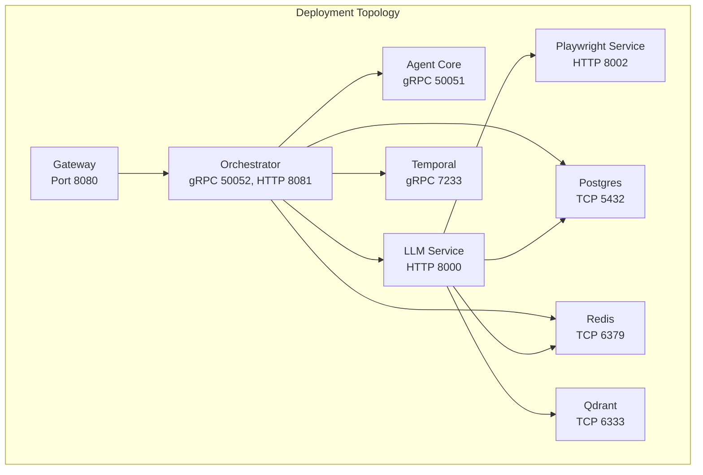
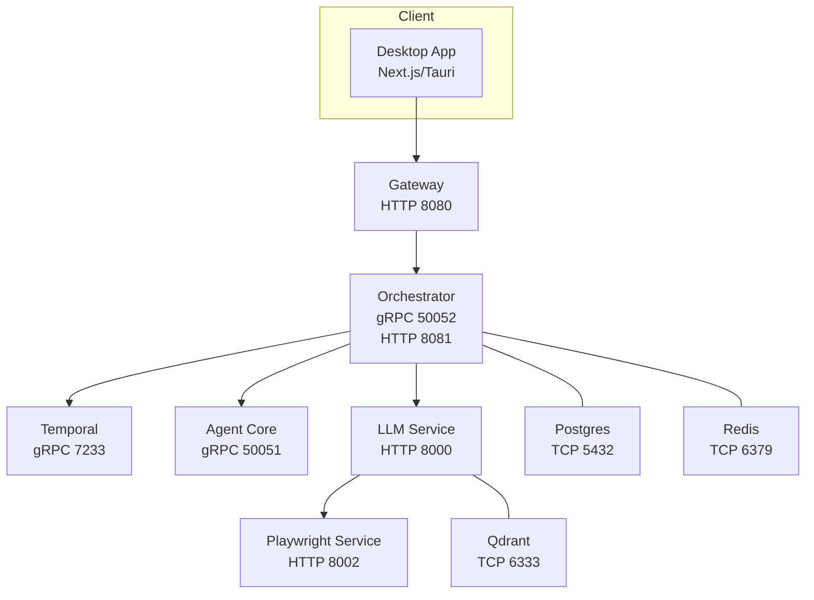
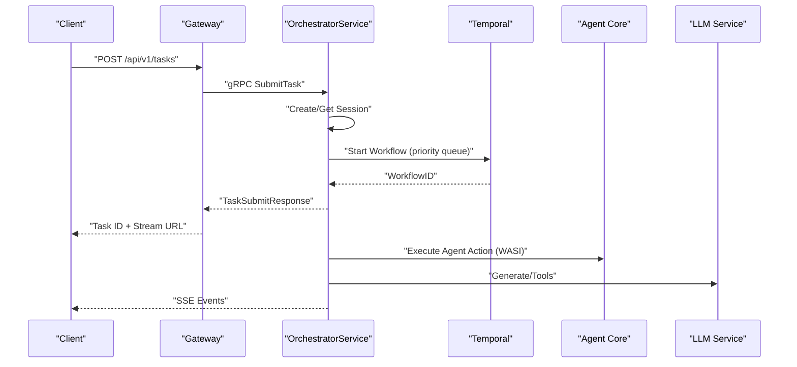
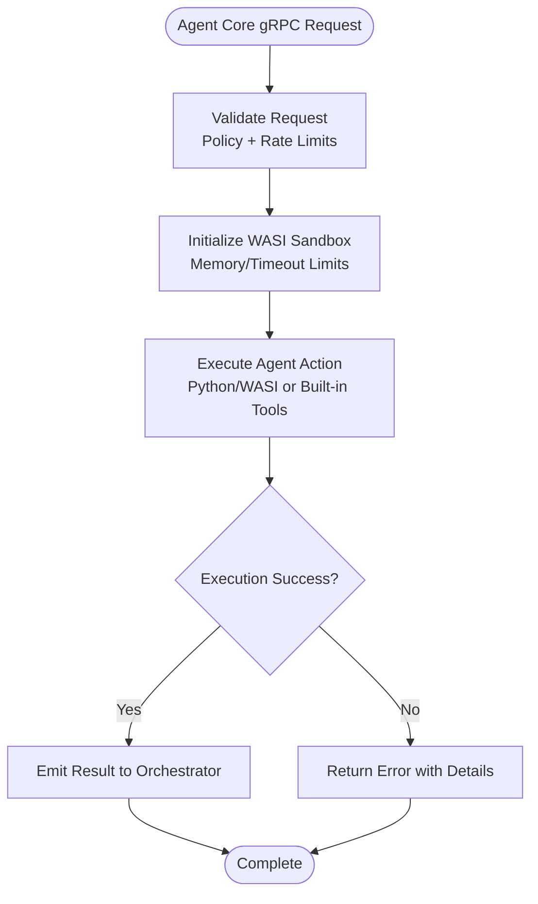
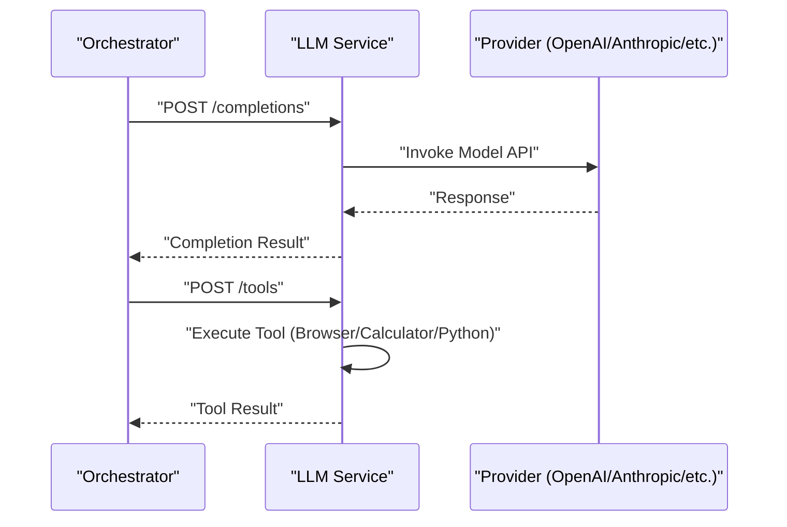
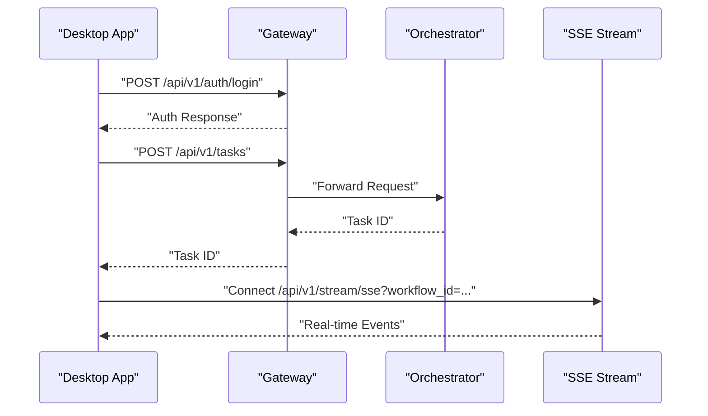
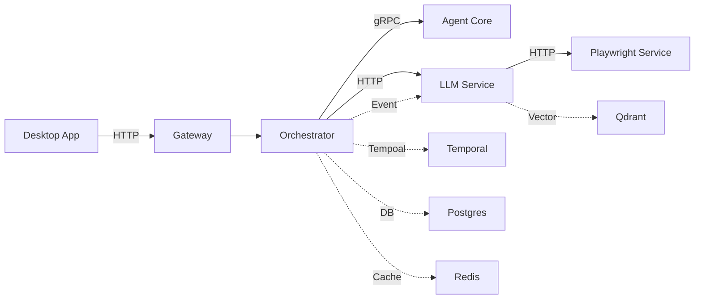

# Microservices Architecture

<cite>
**Referenced Files in This Document**
- [main.go](file://go/orchestrator/main.go)
- [service.go](file://go/orchestrator/internal/server/service.go)
- [auth.go](file://go/orchestrator/internal/httpapi/auth.go)
- [config.go](file://go/orchestrator/internal/config/config.go)
- [docker-compose.yml](file://deploy/compose/docker-compose.yml)
- [shannon.yaml](file://config/shannon.yaml)
- [main.rs](file://rust/agent-core/src/main.rs)
- [Cargo.toml](file://rust/agent-core/Cargo.toml)
- [main.py](file://python/llm-service/main.py)
- [requirements.txt](file://python/llm-service/requirements.txt)
- [layout.tsx](file://desktop/app/layout.tsx)
- [api.ts](file://desktop/lib/shannon/api.ts)
- [package.json](file://desktop/package.json)
</cite>

## Table of Contents
1. [Introduction](#introduction)
2. [Project Structure](#project-structure)
3. [Core Components](#core-components)
4. [Architecture Overview](#architecture-overview)
5. [Detailed Component Analysis](#detailed-component-analysis)
6. [Dependency Analysis](#dependency-analysis)
7. [Performance Considerations](#performance-considerations)
8. [Troubleshooting Guide](#troubleshooting-guide)
9. [Conclusion](#conclusion)

## Introduction
This document describes the microservices architecture of Shannon, an orchestration platform for multi-agent AI workflows. The system consists of four primary services:
- Orchestrator (Go): Workflow orchestration, scheduling, and gRPC/HTTP APIs
- Agent Core (Rust): Secure agent execution with WASI sandboxing
- LLM Service (Python): Language model interactions and tool execution
- Desktop Application (TypeScript/Next.js): User interface and client-side integration

The architecture emphasizes separation of concerns, secure execution boundaries, and scalable deployment patterns using Docker Compose and Kubernetes-style primitives.

## Project Structure
The repository is organized by service and domain:
- go/orchestrator: Go-based orchestrator service with gRPC and HTTP endpoints
- rust/agent-core: Rust-based agent execution service with WASI sandboxing
- python/llm-service: Python-based LLM integration and tool execution
- desktop: Next.js TypeScript desktop application
- deploy/compose: Docker Compose definitions for local deployment
- config: YAML-based configuration for services and workflows

**Diagram sources**
- [docker-compose.yml](file://deploy/compose/docker-compose.yml#L14-L411)

**Section sources**
- [docker-compose.yml](file://deploy/compose/docker-compose.yml#L14-L411)

## Core Components
This section outlines each service’s responsibilities, technology stack, and integration points.

### Orchestrator (Go)
- Responsibilities:
  - Accepts tasks via gRPC and HTTP
  - Manages sessions and context
  - Routes tasks to workflows (simple, standard, complex, supervisor, DAG)
  - Integrates with Temporal for workflow execution
  - Provides streaming and event ingestion endpoints
  - Handles authentication and authorization
- Technology Stack:
  - Go with gRPC for service-to-service communication
  - Temporal SDK for workflow orchestration
  - PostgreSQL for persistence
  - Redis for session and streaming
  - OpenTelemetry for tracing
- Key Boundaries:
  - gRPC: OrchestratorService, SessionService, StreamingService
  - HTTP: Auth, approvals, events, timeline, streaming
  - Configuration: Viper-based YAML with hot-reload

**Section sources**
- [main.go](file://go/orchestrator/main.go#L49-L800)
- [service.go](file://go/orchestrator/internal/server/service.go#L43-L191)
- [auth.go](file://go/orchestrator/internal/httpapi/auth.go#L11-L31)
- [config.go](file://go/orchestrator/internal/config/config.go#L33-L75)

### Agent Core (Rust)
- Responsibilities:
  - Executes agent actions in a WASI sandbox
  - Enforces rate limits and timeouts
  - Communicates with LLM Service for model calls
  - Exposes metrics and health endpoints
- Technology Stack:
  - Rust with Tokio async runtime
  - Tonic for gRPC
  - Wasmtime for WASI sandboxing
  - OpenTelemetry for tracing
- Security:
  - Sandboxed execution with memory and timeout limits
  - Distributed rate limiting via Redis

**Section sources**
- [main.rs](file://rust/agent-core/src/main.rs#L10-L54)
- [Cargo.toml](file://rust/agent-core/Cargo.toml#L15-L90)

### LLM Service (Python)
- Responsibilities:
  - Provides completions, embeddings, tools, and context APIs
  - Manages provider integrations (OpenAI, Anthropic, Google, Groq, xAI)
  - Implements tool execution (browser, calculator, Python WASI executor)
  - Emits events to the orchestrator
- Technology Stack:
  - FastAPI with Uvicorn
  - Prometheus client for metrics
  - OpenTelemetry for tracing
  - Redis and Postgres for caching and persistence
- Integration:
  - gRPC stubs generated from protobuf definitions
  - SSE streaming for real-time updates

**Section sources**
- [main.py](file://python/llm-service/main.py#L1-L164)
- [requirements.txt](file://python/llm-service/requirements.txt#L1-L62)

### Desktop Application (TypeScript/Next.js)
- Responsibilities:
  - Provides user interface for task submission, session management, and scheduling
  - Implements client-side API integration with the gateway
  - Supports authentication flows and SSE streaming
- Technology Stack:
  - Next.js 16 with App Router
  - Tauri for native builds (alternative to web app)
  - Radix UI and Tailwind CSS for UI components
  - Zustand/Redux for state management

**Section sources**
- [layout.tsx](file://desktop/app/layout.tsx#L1-L70)
- [api.ts](file://desktop/lib/shannon/api.ts#L1-L717)
- [package.json](file://desktop/package.json#L1-L62)

## Architecture Overview
The system follows a layered architecture:
- Gateway routes HTTP requests to the Orchestrator
- Orchestrator coordinates workflows via Temporal and interacts with Agent Core and LLM Service
- LLM Service manages model providers and tools, emitting events back to Orchestrator
- Agent Core executes actions in a secure WASI sandbox
- Persistence and caching use PostgreSQL, Redis, and Qdrant

**Diagram sources**
- [docker-compose.yml](file://deploy/compose/docker-compose.yml#L14-L411)
- [main.go](file://go/orchestrator/main.go#L396-L470)
- [main.py](file://python/llm-service/main.py#L116-L164)

## Detailed Component Analysis

### Orchestrator Service Flow
The Orchestrator accepts tasks, manages sessions, and starts workflows in Temporal. It supports priority queues and dynamic workflow routing.

**Diagram sources**
- [service.go](file://go/orchestrator/internal/server/service.go#L193-L800)
- [main.go](file://go/orchestrator/main.go#L610-L780)

**Section sources**
- [service.go](file://go/orchestrator/internal/server/service.go#L193-L800)
- [main.go](file://go/orchestrator/main.go#L610-L780)

### Agent Core Execution Flow
Agent Core receives requests, enforces policy and rate limits, and executes actions in a WASI sandbox.

**Diagram sources**
- [main.rs](file://rust/agent-core/src/main.rs#L10-L54)
- [Cargo.toml](file://rust/agent-core/Cargo.toml#L15-L90)

**Section sources**
- [main.rs](file://rust/agent-core/src/main.rs#L10-L54)
- [Cargo.toml](file://rust/agent-core/Cargo.toml#L15-L90)

### LLM Service API Flow
The LLM Service exposes REST endpoints for completions, embeddings, tools, and health checks, integrating with providers and emitting events.

**Diagram sources**
- [main.py](file://python/llm-service/main.py#L116-L164)

**Section sources**
- [main.py](file://python/llm-service/main.py#L1-L164)

### Desktop Application Integration
The desktop app communicates with the gateway, authenticates users, and streams workflow events.

**Diagram sources**
- [api.ts](file://desktop/lib/shannon/api.ts#L80-L253)
- [layout.tsx](file://desktop/app/layout.tsx#L53-L70)

**Section sources**
- [api.ts](file://desktop/lib/shannon/api.ts#L80-L253)
- [layout.tsx](file://desktop/app/layout.tsx#L53-L70)

## Dependency Analysis
Service dependencies and coupling:
- Orchestrator depends on Temporal, PostgreSQL, Redis, and Qdrant
- Agent Core depends on LLM Service and Redis for rate limiting
- LLM Service depends on Redis, Postgres, and external providers
- Desktop App depends on Gateway and SSE for real-time updates

**Diagram sources**
- [docker-compose.yml](file://deploy/compose/docker-compose.yml#L14-L411)
- [main.go](file://go/orchestrator/main.go#L472-L597)
- [main.py](file://python/llm-service/main.py#L116-L164)

**Section sources**
- [docker-compose.yml](file://deploy/compose/docker-compose.yml#L14-L411)
- [main.go](file://go/orchestrator/main.go#L472-L597)
- [main.py](file://python/llm-service/main.py#L116-L164)

## Performance Considerations
- Concurrency and Queues:
  - Orchestrator supports single or priority queues for Temporal workers
  - Environment variables control worker concurrency per priority level
- Circuit Breakers and Degradation:
  - Redis and database circuit breakers protect downstream dependencies
  - Degradation modes adjust workflow complexity under stress
- Caching and Vector Search:
  - Embeddings cache and Redis reduce repeated computations
  - Qdrant vector search with MMR improves retrieval quality
- Streaming:
  - SSE endpoints provide real-time updates with configurable ring capacity

[No sources needed since this section provides general guidance]

## Troubleshooting Guide
Common operational issues and diagnostics:
- Health Checks:
  - Orchestrator exposes health, approvals, and timeline endpoints
  - LLM Service provides readiness and liveness endpoints
- Authentication:
  - Minimal HTTP auth endpoints for registration and login
- Metrics and Tracing:
  - Prometheus metrics exposed on dedicated ports
  - OpenTelemetry tracing enabled via configuration
- Configuration Hot Reload:
  - Features and models configuration support hot-reload

**Section sources**
- [auth.go](file://go/orchestrator/internal/httpapi/auth.go#L11-L31)
- [main.py](file://python/llm-service/main.py#L137-L147)
- [shannon.yaml](file://config/shannon.yaml#L214-L240)
- [config.go](file://go/orchestrator/internal/config/config.go#L33-L75)

## Conclusion
Shannon’s microservices architecture balances modularity, security, and scalability. The Go Orchestrator coordinates workflows, the Rust Agent Core ensures secure execution, the Python LLM Service integrates providers and tools, and the Desktop Application delivers a responsive user experience. Docker Compose simplifies local deployment, while configuration-driven runtime controls enable tuning for production workloads.