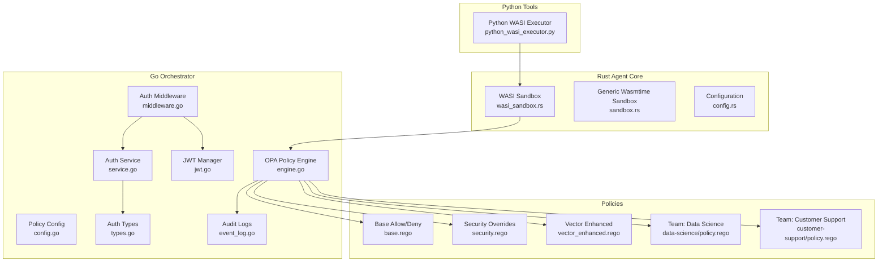
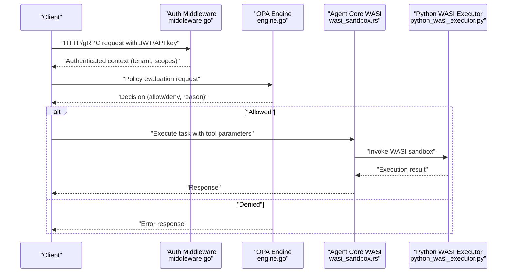
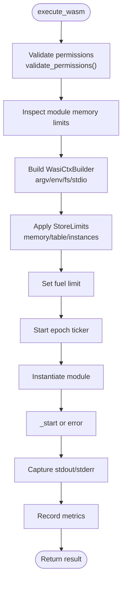
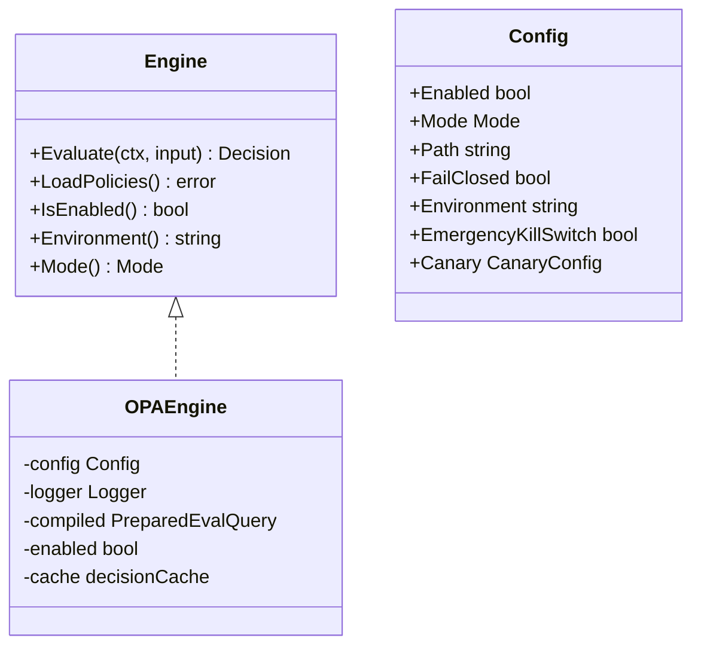
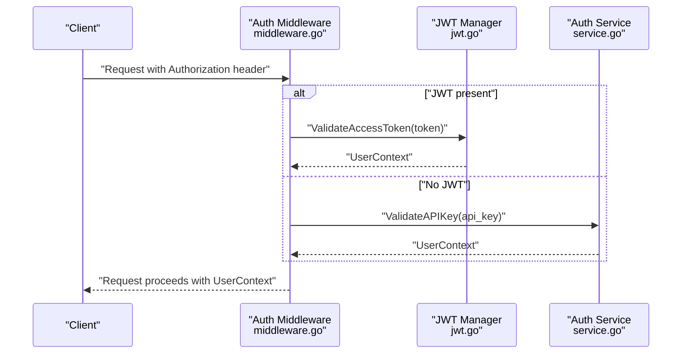
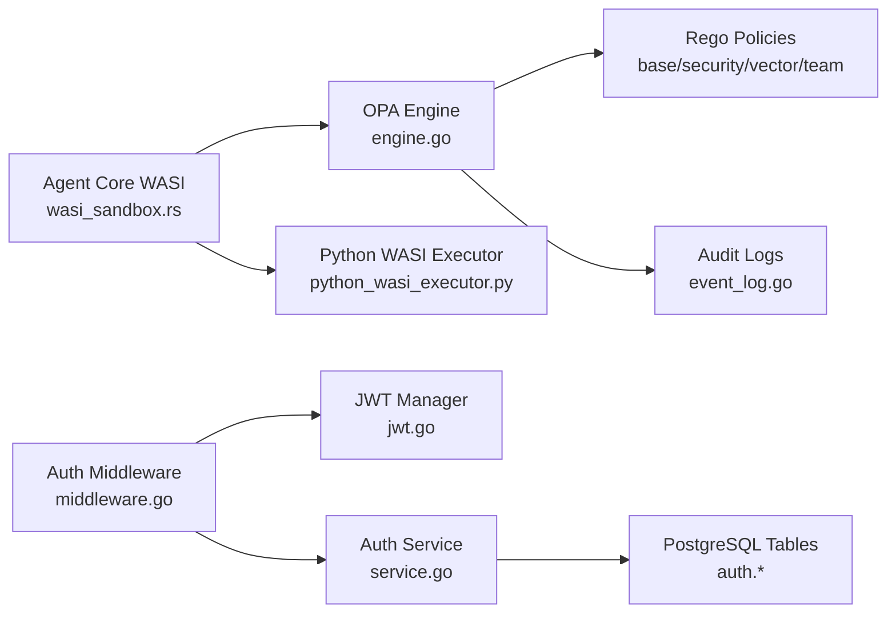

# Security Model

<cite>
**Referenced Files in This Document**
- [wasi_sandbox.rs](file://rust/agent-core/src/wasi_sandbox.rs)
- [sandbox.rs](file://rust/agent-core/src/sandbox.rs)
- [config.rs](file://rust/agent-core/src/config.rs)
- [python_wasi_executor.py](file://python/llm-service/llm_service/tools/builtin/python_wasi_executor.py)
- [engine.go](file://go/orchestrator/internal/policy/engine.go)
- [config.go](file://go/orchestrator/internal/policy/config.go)
- [base.rego](file://config/opa/policies/base.rego)
- [security.rego](file://config/opa/policies/security.rego)
- [vector_enhanced.rego](file://config/opa/policies/vector_enhanced.rego)
- [customer-support/policy.rego](file://config/opa/policies/teams/customer-support/policy.rego)
- [data-science/policy.rego](file://config/opa/policies/teams/data-science/policy.rego)
- [middleware.go](file://go/orchestrator/internal/auth/middleware.go)
- [jwt.go](file://go/orchestrator/internal/auth/jwt.go)
- [service.go](file://go/orchestrator/internal/auth/service.go)
- [types.go](file://go/orchestrator/internal/auth/types.go)
- [event_log.go](file://go/orchestrator/internal/db/event_log.go)
</cite>

## Table of Contents
1. [Introduction](#introduction)
2. [Project Structure](#project-structure)
3. [Core Components](#core-components)
4. [Architecture Overview](#architecture-overview)
5. [Detailed Component Analysis](#detailed-component-analysis)
6. [Dependency Analysis](#dependency-analysis)
7. [Performance Considerations](#performance-considerations)
8. [Troubleshooting Guide](#troubleshooting-guide)
9. [Conclusion](#conclusion)
10. [Appendices](#appendices)

## Introduction
This document describes Shannon’s security model and isolation mechanisms across the Rust Agent Core WASI sandbox, the Open Policy Agent (OPA) policy engine, and the authentication and authorization middleware. It explains how secure code execution is achieved via WebAssembly sandboxing, how policy-driven access control governs operations, and how multi-tenant isolation is enforced through JWT and API keys. It also documents security boundaries, audit trails, compliance considerations, threat modeling outcomes, and best practices for secure deployment and operation.

## Project Structure
Security-critical components are organized across three layers:
- Rust Agent Core: WASI sandbox and tool execution with resource limits and isolation.
- Go Orchestrator: Authentication, authorization, and policy enforcement via OPA.
- Configuration: OPA policies grouped by domain and team, plus agent configuration.

**Diagram sources**
- [wasi_sandbox.rs](file://rust/agent-core/src/wasi_sandbox.rs#L15-L498)
- [sandbox.rs](file://rust/agent-core/src/sandbox.rs#L102-L687)
- [config.rs](file://rust/agent-core/src/config.rs#L14-L737)
- [engine.go](file://go/orchestrator/internal/policy/engine.go#L21-L748)
- [config.go](file://go/orchestrator/internal/policy/config.go#L59-L296)
- [middleware.go](file://go/orchestrator/internal/auth/middleware.go#L23-L227)
- [jwt.go](file://go/orchestrator/internal/auth/jwt.go#L17-L211)
- [service.go](file://go/orchestrator/internal/auth/service.go#L18-L485)
- [types.go](file://go/orchestrator/internal/auth/types.go#L36-L190)
- [event_log.go](file://go/orchestrator/internal/db/event_log.go#L10-L54)
- [base.rego](file://config/opa/policies/base.rego#L1-L272)
- [security.rego](file://config/opa/policies/security.rego#L1-L52)
- [vector_enhanced.rego](file://config/opa/policies/vector_enhanced.rego#L1-L28)
- [data-science/policy.rego](file://config/opa/policies/teams/data-science/policy.rego#L1-L37)
- [customer-support/policy.rego](file://config/opa/policies/teams/customer-support/policy.rego#L1-L45)
- [python_wasi_executor.py](file://python/llm-service/llm_service/tools/builtin/python_wasi_executor.py#L54-L426)

**Section sources**
- [wasi_sandbox.rs](file://rust/agent-core/src/wasi_sandbox.rs#L15-L498)
- [sandbox.rs](file://rust/agent-core/src/sandbox.rs#L102-L687)
- [config.rs](file://rust/agent-core/src/config.rs#L14-L737)
- [engine.go](file://go/orchestrator/internal/policy/engine.go#L21-L748)
- [config.go](file://go/orchestrator/internal/policy/config.go#L59-L296)
- [middleware.go](file://go/orchestrator/internal/auth/middleware.go#L23-L227)
- [jwt.go](file://go/orchestrator/internal/auth/jwt.go#L17-L211)
- [service.go](file://go/orchestrator/internal/auth/service.go#L18-L485)
- [types.go](file://go/orchestrator/internal/auth/types.go#L36-L190)
- [event_log.go](file://go/orchestrator/internal/db/event_log.go#L10-L54)
- [base.rego](file://config/opa/policies/base.rego#L1-L272)
- [security.rego](file://config/opa/policies/security.rego#L1-L52)
- [vector_enhanced.rego](file://config/opa/policies/vector_enhanced.rego#L1-L28)
- [data-science/policy.rego](file://config/opa/policies/teams/data-science/policy.rego#L1-L37)
- [customer-support/policy.rego](file://config/opa/policies/teams/customer-support/policy.rego#L1-L45)
- [python_wasi_executor.py](file://python/llm-service/llm_service/tools/builtin/python_wasi_executor.py#L54-L426)

## Core Components
- WASI Sandbox (Rust): Enforces filesystem, memory, CPU, and timeout isolation for WASM modules using Wasmtime and WASI preview1. It validates module integrity, canonicalizes allowed paths, and uses epoch interruption for timeouts.
- Generic Wasmtime Sandbox (Rust): Provides a simpler sandbox for WASM modules without WASI, with fuel-based CPU limits and optional module caching.
- OPA Policy Engine (Go): Loads and compiles Rego policies, evaluates decisions with configurable canary rollout and fail-closed/fail-open modes, and caches decisions.
- Authentication and Authorization (Go): HTTP/gRPC middleware supporting JWT and API keys, scope-based authorization, and tenant isolation.
- Python WASI Executor (Python): Bridges Python code execution into the Agent Core via a WASI sandbox, passing code as stdin and using argv conventions for the interpreter.

**Section sources**
- [wasi_sandbox.rs](file://rust/agent-core/src/wasi_sandbox.rs#L15-L498)
- [sandbox.rs](file://rust/agent-core/src/sandbox.rs#L102-L687)
- [engine.go](file://go/orchestrator/internal/policy/engine.go#L85-L287)
- [config.go](file://go/orchestrator/internal/policy/config.go#L59-L296)
- [middleware.go](file://go/orchestrator/internal/auth/middleware.go#L23-L227)
- [jwt.go](file://go/orchestrator/internal/auth/jwt.go#L17-L211)
- [python_wasi_executor.py](file://python/llm-service/llm_service/tools/builtin/python_wasi_executor.py#L54-L426)

## Architecture Overview
The system enforces security through layered controls:
- Transport and identity: JWT/API keys and scopes in HTTP/gRPC.
- Policy: OPA evaluates allow/deny decisions with canary and SLO safeguards.
- Execution: WASI sandbox isolates code execution with strict resource limits.
- Observability: Audit logs and metrics track policy decisions and execution outcomes.

**Diagram sources**
- [middleware.go](file://go/orchestrator/internal/auth/middleware.go#L39-L227)
- [engine.go](file://go/orchestrator/internal/policy/engine.go#L197-L282)
- [wasi_sandbox.rs](file://rust/agent-core/src/wasi_sandbox.rs#L124-L433)
- [python_wasi_executor.py](file://python/llm-service/llm_service/tools/builtin/python_wasi_executor.py#L327-L386)

## Detailed Component Analysis

### WASI Sandbox Implementation (Rust Agent Core)
- Engine configuration: Enables WASI features, epoch interruption for timeouts, guard pages, and fuel metering.
- Resource limits: Memory guard size, memory/table/instance limits via StoreLimits, fuel-based CPU control, and configurable timeouts.
- Filesystem isolation: Canonicalized allowed paths, read-only preopened directories, symlink escape prevention, and macOS-specific path normalization.
- Stdio isolation: In-memory pipes for stdin/stdout/stderr capture.
- Execution lifecycle: Validates permissions, inspects module memory limits, spawns epoch ticker, executes in blocking task, and records metrics.

**Diagram sources**
- [wasi_sandbox.rs](file://rust/agent-core/src/wasi_sandbox.rs#L124-L433)

**Section sources**
- [wasi_sandbox.rs](file://rust/agent-core/src/wasi_sandbox.rs#L31-L72)
- [wasi_sandbox.rs](file://rust/agent-core/src/wasi_sandbox.rs#L216-L369)
- [wasi_sandbox.rs](file://rust/agent-core/src/wasi_sandbox.rs#L371-L421)
- [config.rs](file://rust/agent-core/src/config.rs#L39-L60)
- [config.rs](file://rust/agent-core/src/config.rs#L495-L516)

### Generic Wasmtime Sandbox (Rust Agent Core)
- Provides a simpler sandbox without WASI, using fuel-based CPU limits and optional module caching.
- Enforces input size limits and validates module format.
- Executes exported functions and tracks execution metrics.

**Section sources**
- [sandbox.rs](file://rust/agent-core/src/sandbox.rs#L102-L144)
- [sandbox.rs](file://rust/agent-core/src/sandbox.rs#L332-L452)

### Python WASI Executor (Python)
- Bridges Python code execution into Agent Core via WASI.
- Uses a cached Python WASM interpreter and passes code via stdin with argv conventions.
- Integrates with Agent Core gRPC to execute tasks securely.

**Section sources**
- [python_wasi_executor.py](file://python/llm-service/llm_service/tools/builtin/python_wasi_executor.py#L54-L82)
- [python_wasi_executor.py](file://python/llm-service/llm_service/tools/builtin/python_wasi_executor.py#L310-L386)

### Open Policy Agent (OPA) Policy Enforcement
- Engine: Loads .rego policies, compiles them into a prepared query, and evaluates inputs to produce allow/deny decisions with reasons.
- Modes: off, dry-run, enforce; with canary rollout and emergency kill switch.
- Caching: LRU cache with TTL keyed by environment, mode, user, agent, token budget, complexity, and hashed query.
- Metrics: Comprehensive evaluation metrics, SLO tracking, and cache statistics.
- Policies: Base allow/deny rules, security overrides, vector-enhanced decisions, and team-specific allowances.

**Diagram sources**
- [engine.go](file://go/orchestrator/internal/policy/engine.go#L21-L115)
- [engine.go](file://go/orchestrator/internal/policy/engine.go#L85-L93)
- [config.go](file://go/orchestrator/internal/policy/config.go#L59-L83)

**Section sources**
- [engine.go](file://go/orchestrator/internal/policy/engine.go#L117-L195)
- [engine.go](file://go/orchestrator/internal/policy/engine.go#L197-L282)
- [engine.go](file://go/orchestrator/internal/policy/engine.go#L458-L594)
- [config.go](file://go/orchestrator/internal/policy/config.go#L85-L126)
- [config.go](file://go/orchestrator/internal/policy/config.go#L128-L209)

### Authentication and Authorization Middleware (JWT and API Keys)
- HTTP/gRPC middleware supports JWT bearer tokens and API keys, with development-mode bypass.
- Scope-based authorization checks and tenant isolation via context.
- JWT manager signs/validates tokens with registered claims, custom claims (tenant, username, email, role, scopes), and issuer validation.
- Auth service manages user registration, login, refresh tokens, and API key creation/validation with constant-time comparisons and audit logging.

**Diagram sources**
- [middleware.go](file://go/orchestrator/internal/auth/middleware.go#L39-L114)
- [jwt.go](file://go/orchestrator/internal/auth/jwt.go#L94-L143)
- [service.go](file://go/orchestrator/internal/auth/service.go#L243-L322)

**Section sources**
- [middleware.go](file://go/orchestrator/internal/auth/middleware.go#L23-L227)
- [jwt.go](file://go/orchestrator/internal/auth/jwt.go#L17-L211)
- [service.go](file://go/orchestrator/internal/auth/service.go#L18-L485)
- [types.go](file://go/orchestrator/internal/auth/types.go#L104-L117)

### Multi-Tenant Isolation
- TenantID is carried in JWT and API key contexts; middleware injects UserContext into request context.
- Auth service associates API keys with tenants and scopes; refresh tokens and audit logs are tenant-scoped.
- Policy decisions can incorporate environment, user, agent, and token budget to tailor enforcement per tenant.

**Section sources**
- [types.go](file://go/orchestrator/internal/auth/types.go#L104-L117)
- [service.go](file://go/orchestrator/internal/auth/service.go#L243-L322)
- [middleware.go](file://go/orchestrator/internal/auth/middleware.go#L40-L114)

### Audit Trails and Compliance
- Audit events recorded for login, logout, token refresh, API key creation/use/deletion, permission changes, password changes, and account lifecycle.
- Event logs persisted with deduplication by workflow/type/sequence where applicable.
- Policy engine records evaluation metrics, cache hits/misses, and SLO compliance for operational auditing.

**Section sources**
- [types.go](file://go/orchestrator/internal/auth/types.go#L150-L163)
- [service.go](file://go/orchestrator/internal/auth/service.go#L444-L465)
- [event_log.go](file://go/orchestrator/internal/db/event_log.go#L24-L46)
- [engine.go](file://go/orchestrator/internal/policy/engine.go#L609-L656)

## Dependency Analysis
- Agent Core depends on OPA for policy decisions and on the Python WASI executor for secure code execution.
- OPA depends on policy files and environment configuration.
- Auth middleware depends on JWT manager and auth service; auth service depends on database and bcrypt.

**Diagram sources**
- [wasi_sandbox.rs](file://rust/agent-core/src/wasi_sandbox.rs#L124-L433)
- [engine.go](file://go/orchestrator/internal/policy/engine.go#L117-L195)
- [base.rego](file://config/opa/policies/base.rego#L1-L272)
- [security.rego](file://config/opa/policies/security.rego#L1-L52)
- [vector_enhanced.rego](file://config/opa/policies/vector_enhanced.rego#L1-L28)
- [data-science/policy.rego](file://config/opa/policies/teams/data-science/policy.rego#L1-L37)
- [customer-support/policy.rego](file://config/opa/policies/teams/customer-support/policy.rego#L1-L45)
- [python_wasi_executor.py](file://python/llm-service/llm_service/tools/builtin/python_wasi_executor.py#L327-L386)
- [middleware.go](file://go/orchestrator/internal/auth/middleware.go#L39-L114)
- [jwt.go](file://go/orchestrator/internal/auth/jwt.go#L94-L143)
- [service.go](file://go/orchestrator/internal/auth/service.go#L243-L322)
- [event_log.go](file://go/orchestrator/internal/db/event_log.go#L24-L46)

**Section sources**
- [wasi_sandbox.rs](file://rust/agent-core/src/wasi_sandbox.rs#L124-L433)
- [engine.go](file://go/orchestrator/internal/policy/engine.go#L117-L195)
- [middleware.go](file://go/orchestrator/internal/auth/middleware.go#L39-L114)

## Performance Considerations
- WASI sandbox uses epoch interruption and guard pages to bound execution time and memory. Fuel-based CPU limits provide deterministic CPU throttling.
- Module caching in the generic sandbox reduces compilation overhead.
- OPA decision cache improves latency and throughput; SLO metrics help tune canary rollout and cache TTL.
- Python WASI executor caches the interpreter and uses argv conventions to minimize overhead.

[No sources needed since this section provides general guidance]

## Troubleshooting Guide
- WASI sandbox failures: Check module format and memory limits; validate allowed paths and canonicalization; confirm epoch interruption and timeout configuration.
- Policy evaluation errors: Verify policy load success, decision query correctness, and input conversion; inspect cache hit/miss and SLO metrics.
- Authentication issues: Confirm JWT signature and issuer, API key validity and expiration, and scope presence; review audit logs for failed attempts.
- Audit gaps: Ensure audit event logging is enabled and database connectivity is healthy; verify deduplication logic for event logs.

**Section sources**
- [wasi_sandbox.rs](file://rust/agent-core/src/wasi_sandbox.rs#L141-L177)
- [engine.go](file://go/orchestrator/internal/policy/engine.go#L117-L195)
- [service.go](file://go/orchestrator/internal/auth/service.go#L118-L169)
- [event_log.go](file://go/orchestrator/internal/db/event_log.go#L24-L46)

## Conclusion
Shannon’s security model combines strong isolation via WASI sandboxing, robust policy-driven governance with OPA, and multi-tenant authentication with JWT and API keys. Together, these controls establish clear security boundaries, enforce capability restrictions, and provide comprehensive auditability and compliance support.

[No sources needed since this section summarizes without analyzing specific files]

## Appendices

### Threat Modeling and Controls
- Threat: Malicious WASM module execution
  - Control: Module inspection, canonicalized allowed paths, read-only FS, guard pages, epoch interruption, fuel limits.
- Threat: Unauthorized access to tools or data
  - Control: JWT/API key validation, scope checks, tenant isolation, policy allowlists/denylists.
- Threat: Policy bypass or misconfiguration
  - Control: Fail-closed mode, canary rollout, emergency kill switch, SLO monitoring, decision caching with TTL.
- Threat: Replay or token theft
  - Control: Short-lived JWTs, refresh token storage with hashes, constant-time comparisons, audit logs.

[No sources needed since this section provides general guidance]

### Best Practices for Secure Agent Execution and Policy Enforcement
- Configure conservative WASI limits (memory, fuel, timeouts) and restrict allowed filesystem paths.
- Use OPA canary rollout with SLO thresholds before enabling enforce mode.
- Enforce scope-based authorization and tenant isolation at all boundaries.
- Monitor policy evaluation latency, cache hit rates, and deny reasons; adjust thresholds accordingly.
- Maintain audit logs for all authentication, authorization, and policy decisions.

[No sources needed since this section provides general guidance]