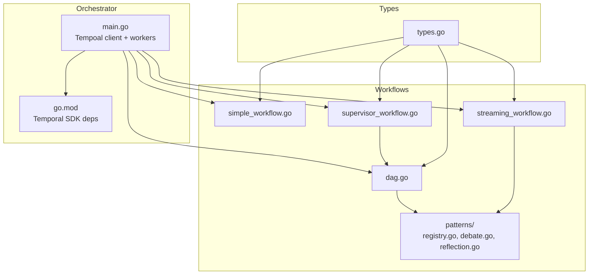
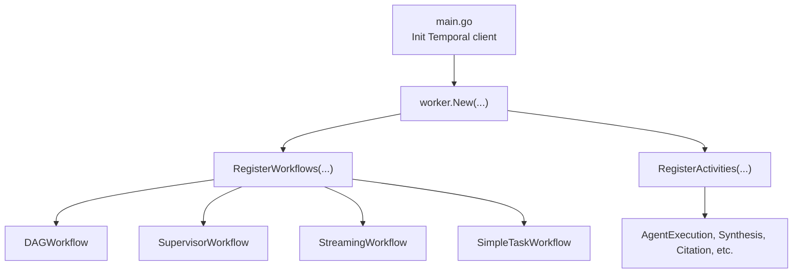
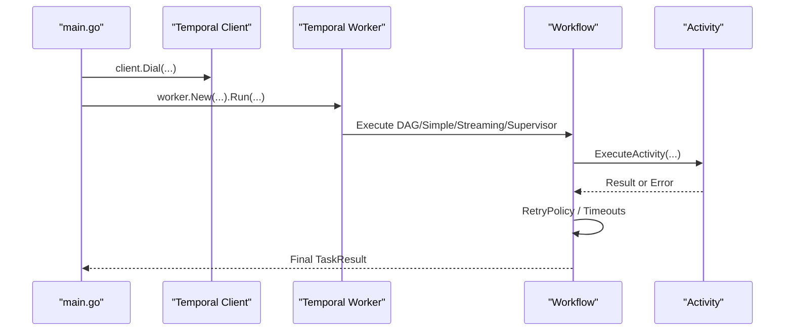
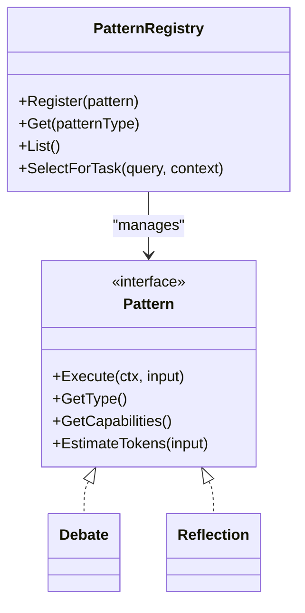
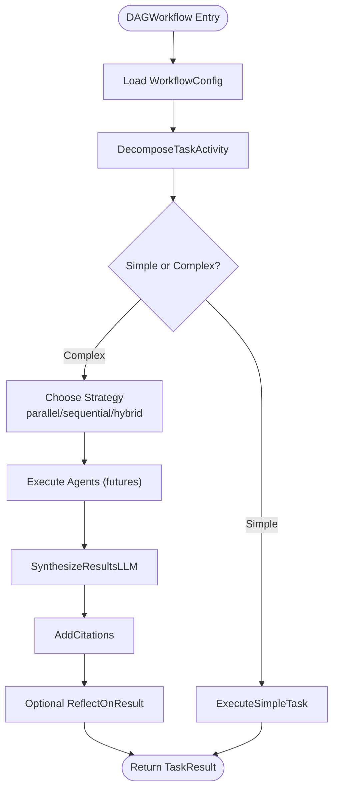
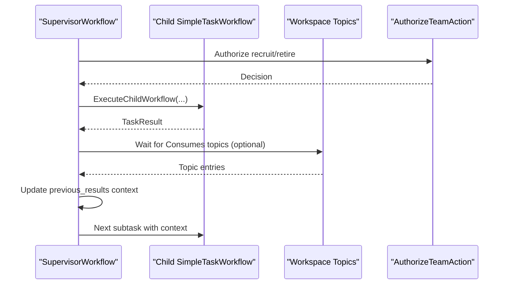
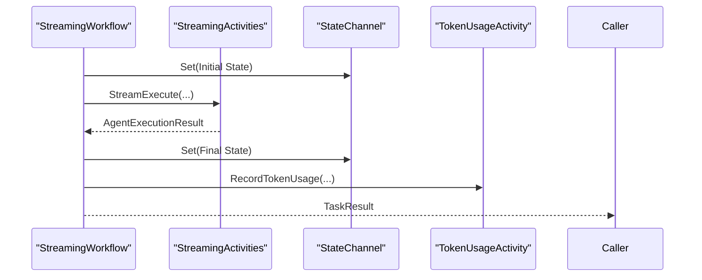
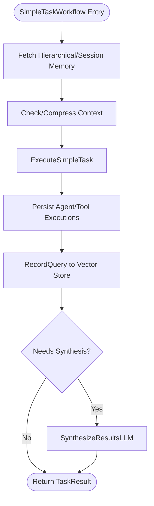
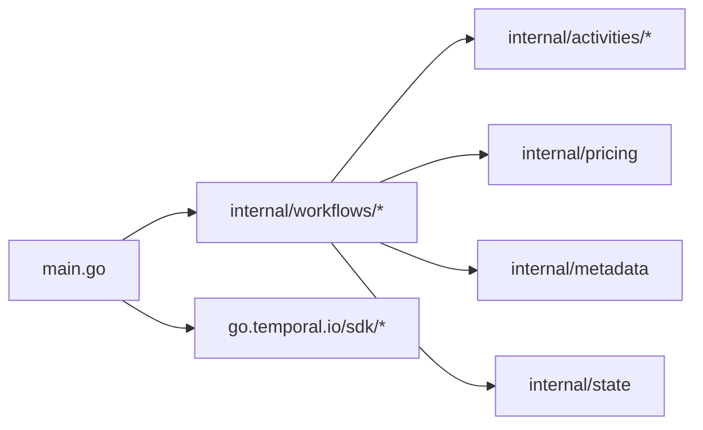

# Temporal Workflows

<cite>
**Referenced Files in This Document**
- [main.go](file://go/orchestrator/main.go)
- [go.mod](file://go/orchestrator/go.mod)
- [types.go](file://go/orchestrator/internal/workflows/types.go)
- [registry.go](file://go/orchestrator/internal/workflows/patterns/registry.go)
- [debate.go](file://go/orchestrator/internal/workflows/patterns/debate.go)
- [reflection.go](file://go/orchestrator/internal/workflows/patterns/reflection.go)
- [dag.go](file://go/orchestrator/internal/workflows/strategies/dag.go)
- [supervisor_workflow.go](file://go/orchestrator/internal/workflows/supervisor_workflow.go)
- [streaming_workflow.go](file://go/orchestrator/internal/workflows/streaming_workflow.go)
- [simple_workflow.go](file://go/orchestrator/internal/workflows/simple_workflow.go)
</cite>

## Table of Contents
1. [Introduction](#introduction)
2. [Project Structure](#project-structure)
3. [Core Components](#core-components)
4. [Architecture Overview](#architecture-overview)
5. [Detailed Component Analysis](#detailed-component-analysis)
6. [Dependency Analysis](#dependency-analysis)
7. [Performance Considerations](#performance-considerations)
8. [Troubleshooting Guide](#troubleshooting-guide)
9. [Conclusion](#conclusion)

## Introduction
This document explains the temporal workflows system in Shannon, focusing on how Temporal.io orchestrates multi-agent, streaming, and DAG workflows reliably. It covers cognitive patterns (research, debate, reflection), supervisor-agent hierarchies, streaming workflows, routing, activity coordination, cross-agent communication, persistence, replay, and lifecycle management with retries and error handling.

## Project Structure
The temporal workflows live under the Go orchestrator module. The main entry initializes Temporal clients and workers, wires activity registries, and exposes HTTP/admin endpoints. Workflows are organized by domain:
- Cognitive patterns: debate, reflection, and others
- Execution strategies: DAG, parallel/sequential/hybrid
- Hierarchical supervisors coordinating child workflows
- Streaming workflows for real-time output
- Simple workflows for single-agent tasks

**Diagram sources**
- [main.go](file://go/orchestrator/main.go#L610-L779)
- [go.mod](file://go/orchestrator/go.mod#L28-L29)
- [simple_workflow.go](file://go/orchestrator/internal/workflows/simple_workflow.go#L19-L712)
- [dag.go](file://go/orchestrator/internal/workflows/strategies/dag.go#L24-L800)
- [supervisor_workflow.go](file://go/orchestrator/internal/workflows/supervisor_workflow.go#L40-L800)
- [streaming_workflow.go](file://go/orchestrator/internal/workflows/streaming_workflow.go#L20-L709)
- [registry.go](file://go/orchestrator/internal/workflows/patterns/registry.go#L1-L190)
- [debate.go](file://go/orchestrator/internal/workflows/patterns/debate.go#L48-L473)
- [reflection.go](file://go/orchestrator/internal/workflows/patterns/reflection.go#L17-L170)
- [types.go](file://go/orchestrator/internal/workflows/types.go#L8-L59)

**Section sources**
- [main.go](file://go/orchestrator/main.go#L610-L779)
- [go.mod](file://go/orchestrator/go.mod#L28-L29)

## Core Components
- Temporal client and workers: Created and configured in the main entry, with priority queues and activity/workflow concurrency tuned via environment variables.
- Workflow types: Strongly typed inputs and results define the contract between workflows and activities.
- Pattern registry: Manages cognitive patterns (debate, reflection, etc.) and selection logic.
- Strategies: DAG workflow composes parallel/sequential/hybrid execution with optional reflection and synthesis.
- Supervisor workflow: Hierarchical orchestration delegating subtasks to child workflows, with dynamic team actions and P2P coordination.
- Streaming workflows: Real-time output with typed state channels and checkpoints.
- Simple workflow: Optimized single-agent execution with memory retrieval and synthesis gating.

**Section sources**
- [main.go](file://go/orchestrator/main.go#L610-L779)
- [types.go](file://go/orchestrator/internal/workflows/types.go#L8-L59)
- [registry.go](file://go/orchestrator/internal/workflows/patterns/registry.go#L71-L190)
- [dag.go](file://go/orchestrator/internal/workflows/strategies/dag.go#L24-L800)
- [supervisor_workflow.go](file://go/orchestrator/internal/workflows/supervisor_workflow.go#L40-L800)
- [streaming_workflow.go](file://go/orchestrator/internal/workflows/streaming_workflow.go#L20-L709)
- [simple_workflow.go](file://go/orchestrator/internal/workflows/simple_workflow.go#L19-L712)

## Architecture Overview
Shannon’s orchestrator embeds a Temporal worker that registers workflows and activities. The main process:
- Initializes health, metrics, streaming, and admin endpoints
- Creates a Temporal client with retry and backoff
- Starts workers on priority queues or a single queue
- Wires the orchestrator service and schedule manager

**Diagram sources**
- [main.go](file://go/orchestrator/main.go#L610-L779)

**Section sources**
- [main.go](file://go/orchestrator/main.go#L610-L779)

## Detailed Component Analysis

### Temporal Integration and Lifecycle Management
- Client creation: The orchestrator dials the Temporal service with retry/backoff and sets a logger adapter. It then wires the Temporal client to streaming services and schedule manager.
- Workers: Workers are started on priority queues or a single queue depending on environment flags. Concurrency is configurable via environment variables.
- Control signals: Workflows use a control signal handler to support pause/resume/cancel points during decomposition, execution, synthesis, and completion.
- Timeouts and retries: Activities specify StartToClose and heartbeat timeouts; RetryPolicy is configured per activity. Workflows use exponential backoff for dependency waits.

**Diagram sources**
- [main.go](file://go/orchestrator/main.go#L610-L779)
- [simple_workflow.go](file://go/orchestrator/internal/workflows/simple_workflow.go#L70-L315)
- [dag.go](file://go/orchestrator/internal/workflows/strategies/dag.go#L40-L120)

**Section sources**
- [main.go](file://go/orchestrator/main.go#L610-L779)
- [simple_workflow.go](file://go/orchestrator/internal/workflows/simple_workflow.go#L70-L315)
- [dag.go](file://go/orchestrator/internal/workflows/strategies/dag.go#L40-L120)

### Cognitive Patterns: Research, Debate, Reflection
- Pattern registry: Central registry for multi-agent patterns with capability descriptors and selection strategy.
- Debate pattern: Multi-agent debate with configurable number of debaters, rounds, perspectives, and optional consensus/moderation/voting.
- Reflection pattern: Iterative reflection with evaluation and re-synthesis when thresholds are not met, with token accounting.

**Diagram sources**
- [registry.go](file://go/orchestrator/internal/workflows/patterns/registry.go#L71-L190)
- [debate.go](file://go/orchestrator/internal/workflows/patterns/debate.go#L48-L473)
- [reflection.go](file://go/orchestrator/internal/workflows/patterns/reflection.go#L17-L170)

**Section sources**
- [registry.go](file://go/orchestrator/internal/workflows/patterns/registry.go#L71-L190)
- [debate.go](file://go/orchestrator/internal/workflows/patterns/debate.go#L48-L473)
- [reflection.go](file://go/orchestrator/internal/workflows/patterns/reflection.go#L17-L170)

### DAG Workflows and Activity Coordination
- Strategy selection: Based on decomposition results, the workflow chooses between simple, sequential, parallel, or hybrid execution.
- Parallel/sequential/hybrid: Uses futures to coordinate agent execution, collects results, and aggregates tokens.
- Synthesis and citations: Performs synthesis with optional reflection, injects citations, and records token usage.
- Control points: Pause/resume/cancel checks at key stages.

**Diagram sources**
- [dag.go](file://go/orchestrator/internal/workflows/strategies/dag.go#L24-L800)

**Section sources**
- [dag.go](file://go/orchestrator/internal/workflows/strategies/dag.go#L24-L800)

### Supervisor-Agent Hierarchies and Cross-Agent Communication
- Supervisor workflow coordinates sub-teams via child workflows, emitting progress and dependency satisfaction events.
- Mailbox and query handlers enable cross-agent messaging and team state inspection.
- Dynamic team actions: Recruitment and retirement signals with policy authorization.
- P2P coordination: Optional dependency synchronization across subtasks using workspace topics and exponential backoff waits.

**Diagram sources**
- [supervisor_workflow.go](file://go/orchestrator/internal/workflows/supervisor_workflow.go#L40-L800)

**Section sources**
- [supervisor_workflow.go](file://go/orchestrator/internal/workflows/supervisor_workflow.go#L40-L800)

### Streaming Workflows and Typed State Management
- StreamingWorkflow: Executes a single agent with streaming output, typed state channel, checkpoints, and heartbeat timeouts.
- ParallelStreamingWorkflow: Runs multiple streams in parallel, aggregates results, performs synthesis, and records token usage.
- State management: Typed state channel validates and checkpoints execution phases.

**Diagram sources**
- [streaming_workflow.go](file://go/orchestrator/internal/workflows/streaming_workflow.go#L20-L709)

**Section sources**
- [streaming_workflow.go](file://go/orchestrator/internal/workflows/streaming_workflow.go#L20-L709)

### Simple Workflows and Persistence
- SimpleTaskWorkflow: Optimized single-agent path with memory retrieval, context compression, and synthesis gating for JSON/raw outputs.
- Persistence: Records agent/tool executions and query records; updates sessions with tokens and models.

**Diagram sources**
- [simple_workflow.go](file://go/orchestrator/internal/workflows/simple_workflow.go#L19-L712)

**Section sources**
- [simple_workflow.go](file://go/orchestrator/internal/workflows/simple_workflow.go#L19-L712)

## Dependency Analysis
- Temporal SDK: The orchestrator depends on the Temporal Go SDK for client and worker operations.
- Internal packages: Workflows depend on activities, pricing, metadata, and state utilities.
- External services: PostgreSQL, Redis, LLM service, and agent core are integrated via health checks and streaming.

**Diagram sources**
- [main.go](file://go/orchestrator/main.go#L3-L46)
- [go.mod](file://go/orchestrator/go.mod#L28-L29)

**Section sources**
- [main.go](file://go/orchestrator/main.go#L3-L46)
- [go.mod](file://go/orchestrator/go.mod#L28-L29)

## Performance Considerations
- Concurrency tuning: Priority queues and worker sizes are controlled via environment variables for balanced throughput.
- Timeouts and heartbeats: Activities use StartToClose and heartbeat timeouts to detect stalls and avoid long blocking.
- Token accounting: Workflows record token usage per phase to enable accurate cost tracking and budgeting.
- Compression and synthesis gating: Reduces context size and avoids unnecessary synthesis for simple outputs.

[No sources needed since this section provides general guidance]

## Troubleshooting Guide
- Temporal connectivity: The main process retries connecting to the Temporal host with backoff and logs warnings until ready.
- Retry policies: Activities specify RetryPolicy with maximum attempts; workflows use exponential backoff for dependency waits.
- Control signals: Pause/resume/cancel points help diagnose bottlenecks during decomposition, execution, and synthesis.
- Streaming diagnostics: Heartbeat timeouts and checkpoints aid in identifying stalled streams.

**Section sources**
- [main.go](file://go/orchestrator/main.go#L624-L638)
- [simple_workflow.go](file://go/orchestrator/internal/workflows/simple_workflow.go#L70-L315)
- [dag.go](file://go/orchestrator/internal/workflows/strategies/dag.go#L670-L800)
- [streaming_workflow.go](file://go/orchestrator/internal/workflows/streaming_workflow.go#L94-L150)

## Conclusion
Shannon’s temporal workflows system provides robust, replayable orchestration for multi-agent, streaming, and hierarchical tasks. With Temporal’s reliability primitives, the system supports cognitive patterns, DAG strategies, supervisor hierarchies, and streaming outputs—while maintaining strong state management, persistence, and observability. The modular design enables incremental enhancements and safe replays for debugging and time-travel investigations.