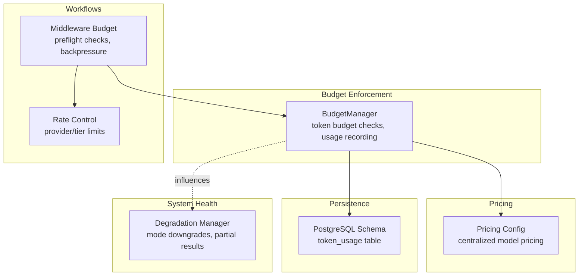
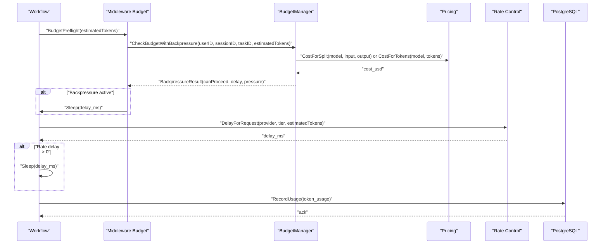
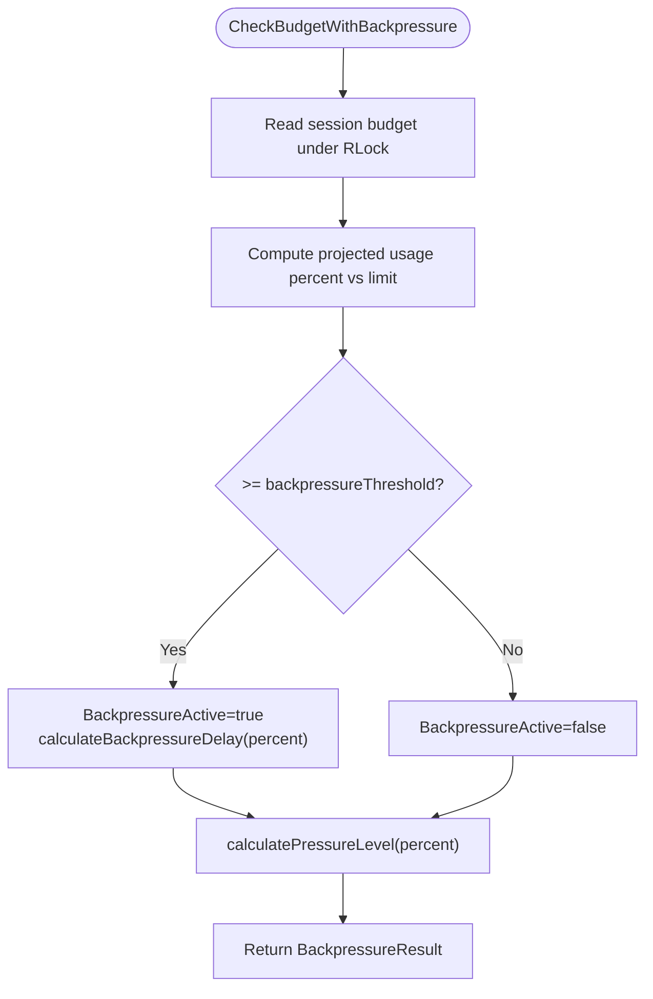
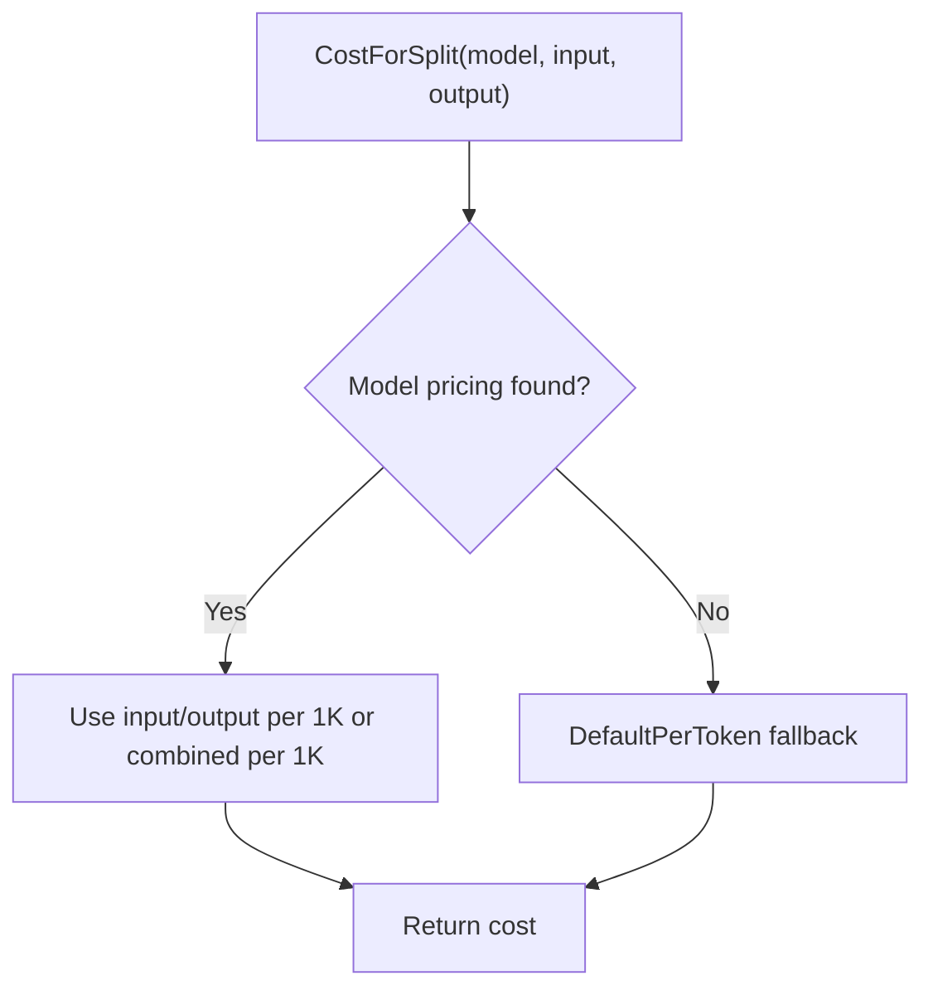
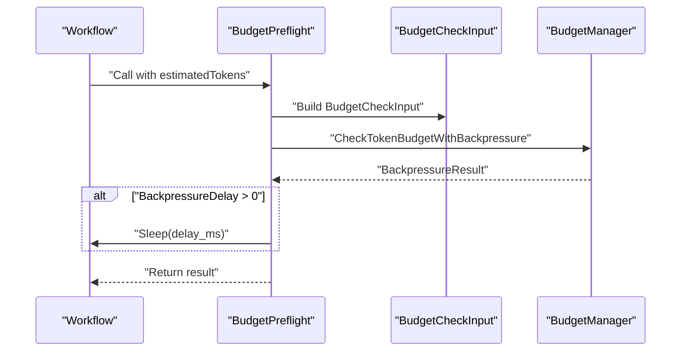
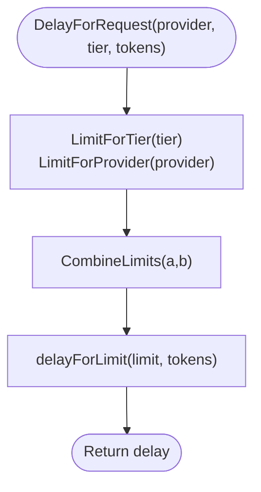
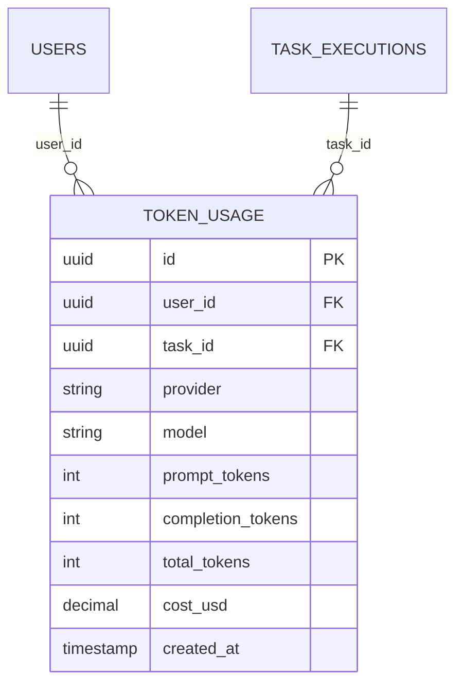
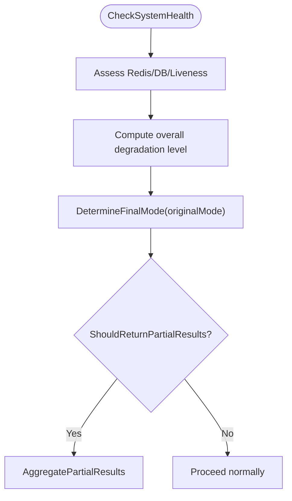
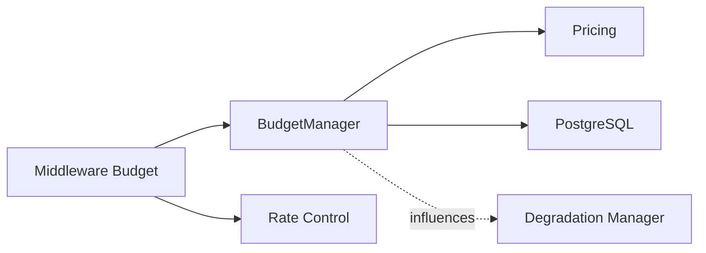

# Cost Management

<cite>
**Referenced Files in This Document**
- [manager.go](file://go/orchestrator/internal/budget/manager.go)
- [pricing.go](file://go/orchestrator/internal/pricing/pricing.go)
- [shannon.yaml](file://config/shannon.yaml)
- [models.yaml](file://config/models.yaml)
- [middleware_budget.go](file://go/orchestrator/internal/workflows/middleware_budget.go)
- [ratecontrol.go](file://go/orchestrator/internal/ratecontrol/ratecontrol.go)
- [001_initial_schema.sql](file://migrations/postgres/001_initial_schema.sql)
- [manager_test.go](file://go/orchestrator/internal/budget/manager_test.go)
- [manager.go](file://go/orchestrator/internal/degradation/manager.go)
</cite>

## Table of Contents
1. [Introduction](#introduction)
2. [Project Structure](#project-structure)
3. [Core Components](#core-components)
4. [Architecture Overview](#architecture-overview)
5. [Detailed Component Analysis](#detailed-component-analysis)
6. [Dependency Analysis](#dependency-analysis)
7. [Performance Considerations](#performance-considerations)
8. [Troubleshooting Guide](#troubleshooting-guide)
9. [Conclusion](#conclusion)
10. [Appendices](#appendices)

## Introduction
This document explains Shannon’s token budget control and pricing optimization system. It covers hard token budget enforcement, automatic model fallback and tiering, pricing tracking and cost calculation, budget allocation strategies, automatic model switching when thresholds are reached, configuration options for per-task and per-agent budgets, and cost monitoring. Practical examples show how to set budget constraints, configure fallback models, and monitor spending. Cost optimization strategies for research workflows and multi-agent operations are included, along with budget reporting and cost allocation across tenants for enterprise deployments.

## Project Structure
Shannon’s cost management spans several modules:
- Budget enforcement and usage tracking in the orchestrator budget manager
- Centralized pricing configuration and cost calculation
- Workflow middleware that integrates budget checks and optional backpressure delays
- Provider-level rate control to smooth token usage
- Database schema for persistent cost tracking
- Degradation management that influences model tier selection under system stress

**Diagram sources**
- [manager.go](file://go/orchestrator/internal/budget/manager.go#L59-L110)
- [pricing.go](file://go/orchestrator/internal/pricing/pricing.go#L17-L52)
- [middleware_budget.go](file://go/orchestrator/internal/workflows/middleware_budget.go#L18-L84)
- [ratecontrol.go](file://go/orchestrator/internal/ratecontrol/ratecontrol.go#L15-L28)
- [001_initial_schema.sql](file://migrations/postgres/001_initial_schema.sql#L94-L105)
- [manager.go](file://go/orchestrator/internal/degradation/manager.go#L11-L46)

**Section sources**
- [manager.go](file://go/orchestrator/internal/budget/manager.go#L59-L110)
- [pricing.go](file://go/orchestrator/internal/pricing/pricing.go#L17-L52)
- [middleware_budget.go](file://go/orchestrator/internal/workflows/middleware_budget.go#L18-L84)
- [ratecontrol.go](file://go/orchestrator/internal/ratecontrol/ratecontrol.go#L15-L28)
- [001_initial_schema.sql](file://migrations/postgres/001_initial_schema.sql#L94-L105)
- [manager.go](file://go/orchestrator/internal/degradation/manager.go#L11-L46)

## Core Components
- BudgetManager: Enforces token budgets per session, estimates cost, records usage, and emits budget threshold events. Supports backpressure and circuit breaker integration.
- Pricing module: Centralized model pricing configuration with fallback defaults and model tier selection helpers.
- Workflow middleware: Performs preflight budget checks with optional backpressure delays and provider rate control.
- Rate control: Computes per-request delays based on tier and provider limits.
- Database schema: Persistent token usage tracking with user, task, provider, model, and cost fields.
- Degradation manager: Downgrades workflow modes and enables partial results when system health is poor.

**Section sources**
- [manager.go](file://go/orchestrator/internal/budget/manager.go#L59-L110)
- [pricing.go](file://go/orchestrator/internal/pricing/pricing.go#L17-L52)
- [middleware_budget.go](file://go/orchestrator/internal/workflows/middleware_budget.go#L18-L84)
- [ratecontrol.go](file://go/orchestrator/internal/ratecontrol/ratecontrol.go#L15-L28)
- [001_initial_schema.sql](file://migrations/postgres/001_initial_schema.sql#L94-L105)
- [manager.go](file://go/orchestrator/internal/degradation/manager.go#L11-L46)

## Architecture Overview
The budget enforcement pipeline integrates workflow-level checks, provider rate control, and centralized pricing to ensure cost and token constraints are respected. When budgets near thresholds, the system can apply backpressure or degrade execution modes.

**Diagram sources**
- [middleware_budget.go](file://go/orchestrator/internal/workflows/middleware_budget.go#L18-L84)
- [manager.go](file://go/orchestrator/internal/budget/manager.go#L175-L288)
- [pricing.go](file://go/orchestrator/internal/pricing/pricing.go#L198-L250)
- [ratecontrol.go](file://go/orchestrator/internal/ratecontrol/ratecontrol.go#L163-L189)
- [001_initial_schema.sql](file://migrations/postgres/001_initial_schema.sql#L94-L105)

## Detailed Component Analysis

### BudgetManager: Hard Budget Enforcement and Backpressure
- TokenBudget: Tracks task and session budgets, cost tracking, and enforcement flags (hard limit, warning threshold, approval requirement).
- CheckBudget: Validates estimated tokens against task/session budgets and warns when thresholds are exceeded; emits streaming BUDGET_THRESHOLD events.
- CheckBudgetWithBackpressure: Adds backpressure delay proportional to projected usage percentage beyond threshold; pressure levels are low/medium/high/critical.
- RecordUsage: Calculates cost using centralized pricing, updates in-memory counters with overflow protection, stores usage in token_usage, and marks idempotency keys.
- GetUsageReport: Aggregates token usage and cost by user/task/model/provider over a time window.
- Enhanced features: Circuit breaker, priority tiers, dynamic session allocation, and idempotency tracking.

**Diagram sources**
- [manager.go](file://go/orchestrator/internal/budget/manager.go#L677-L762)

**Section sources**
- [manager.go](file://go/orchestrator/internal/budget/manager.go#L18-L110)
- [manager.go](file://go/orchestrator/internal/budget/manager.go#L175-L288)
- [manager.go](file://go/orchestrator/internal/budget/manager.go#L677-L762)
- [manager.go](file://go/orchestrator/internal/budget/manager.go#L290-L349)
- [manager.go](file://go/orchestrator/internal/budget/manager.go#L351-L416)

### Pricing Module: Centralized Pricing and Model Tier Selection
- Centralized pricing: Defaults and per-model pricing (input/output per 1K tokens) with fallback logic.
- Cost calculation: CostForSplit uses separate input/output rates when available; otherwise falls back to combined or default pricing.
- Model tier selection: Helpers to retrieve priority-1 provider/model for a tier and to find the best model for a given provider and tier.

**Diagram sources**
- [pricing.go](file://go/orchestrator/internal/pricing/pricing.go#L198-L250)

**Section sources**
- [pricing.go](file://go/orchestrator/internal/pricing/pricing.go#L17-L52)
- [pricing.go](file://go/orchestrator/internal/pricing/pricing.go#L198-L250)
- [pricing.go](file://go/orchestrator/internal/pricing/pricing.go#L289-L394)

### Workflow Middleware: Preflight Checks and Backpressure
- BudgetPreflight: Executes a budget preflight activity, applies backpressure sleep if active, optionally applies provider rate control delay, and returns the backpressure result.
- Estimation helpers: EstimateTokens and EstimateTokensWithConfig compute coarse token estimates based on decomposition complexity and thresholds.

**Diagram sources**
- [middleware_budget.go](file://go/orchestrator/internal/workflows/middleware_budget.go#L18-L84)

**Section sources**
- [middleware_budget.go](file://go/orchestrator/internal/workflows/middleware_budget.go#L18-L84)
- [middleware_budget.go](file://go/orchestrator/internal/workflows/middleware_budget.go#L92-L119)

### Rate Control: Provider-Level Throttling
- Rate limits: Per-tier and per-provider limits from models.yaml with built-in defaults.
- Combined limits: Min/max logic to combine tier and provider limits.
- Delay computation: Computes delay per request based on RPM and TPM constraints.

**Diagram sources**
- [ratecontrol.go](file://go/orchestrator/internal/ratecontrol/ratecontrol.go#L163-L189)

**Section sources**
- [ratecontrol.go](file://go/orchestrator/internal/ratecontrol/ratecontrol.go#L15-L28)
- [ratecontrol.go](file://go/orchestrator/internal/ratecontrol/ratecontrol.go#L114-L168)
- [ratecontrol.go](file://go/orchestrator/internal/ratecontrol/ratecontrol.go#L170-L212)

### Database Schema: Persistent Cost Tracking
- token_usage table persists user_id, task_id, provider, model, prompt_tokens, completion_tokens, total_tokens, cost_usd, and created_at.
- Indexes support efficient queries by user, time, and provider/model combinations.

**Diagram sources**
- [001_initial_schema.sql](file://migrations/postgres/001_initial_schema.sql#L94-L105)

**Section sources**
- [001_initial_schema.sql](file://migrations/postgres/001_initial_schema.sql#L94-L105)

### Degradation Manager: Automatic Model Switching Under Stress
- Determines system health and recommends execution mode downgrades (simple/standard/complex).
- Enables partial results when success thresholds are met.
- Influences budget enforcement by reducing complexity and token usage targets.

**Diagram sources**
- [manager.go](file://go/orchestrator/internal/degradation/manager.go#L137-L206)

**Section sources**
- [manager.go](file://go/orchestrator/internal/degradation/manager.go#L11-L46)
- [manager.go](file://go/orchestrator/internal/degradation/manager.go#L137-L206)
- [manager.go](file://go/orchestrator/internal/degradation/manager.go#L208-L243)

## Dependency Analysis
- BudgetManager depends on:
  - Pricing module for cost calculations
  - Streaming for budget threshold events
  - Database for persistent usage records
  - Rate control for provider-level delays
  - Degradation manager for mode adjustments
- Workflow middleware composes BudgetManager and RateControl
- Pricing module reads models.yaml for tier and pricing configuration

**Diagram sources**
- [middleware_budget.go](file://go/orchestrator/internal/workflows/middleware_budget.go#L18-L84)
- [manager.go](file://go/orchestrator/internal/budget/manager.go#L59-L110)
- [pricing.go](file://go/orchestrator/internal/pricing/pricing.go#L17-L52)
- [ratecontrol.go](file://go/orchestrator/internal/ratecontrol/ratecontrol.go#L15-L28)
- [manager.go](file://go/orchestrator/internal/degradation/manager.go#L11-L46)

**Section sources**
- [middleware_budget.go](file://go/orchestrator/internal/workflows/middleware_budget.go#L18-L84)
- [manager.go](file://go/orchestrator/internal/budget/manager.go#L59-L110)
- [pricing.go](file://go/orchestrator/internal/pricing/pricing.go#L17-L52)
- [ratecontrol.go](file://go/orchestrator/internal/ratecontrol/ratecontrol.go#L15-L28)
- [manager.go](file://go/orchestrator/internal/degradation/manager.go#L11-L46)

## Performance Considerations
- In-memory budget caches minimize database overhead for frequent checks.
- Backpressure delays scale with projected usage to prevent exceeding session budgets.
- Provider rate control prevents bursty requests that could trigger downstream throttling.
- Idempotency tracking avoids double-counting retries.
- Streaming budget threshold events enable real-time observability without blocking operations.

[No sources needed since this section provides general guidance]

## Troubleshooting Guide
Common issues and resolutions:
- Budget exceeded with hard limit: Review task/session budgets and adjust via configuration or reduce token estimates.
- Warning threshold reached: Investigate token usage patterns and consider lowering complexity or enabling backpressure.
- Missing model pricing: Verify models.yaml pricing entries; the system falls back to default pricing when unknown.
- Duplicate usage records: Confirm idempotency keys and TTL settings to prevent double counting.
- Provider rate limit exceeded: Tune tier/provider limits in models.yaml or reduce estimated tokens.

**Section sources**
- [manager.go](file://go/orchestrator/internal/budget/manager.go#L175-L288)
- [manager.go](file://go/orchestrator/internal/budget/manager.go#L290-L349)
- [pricing.go](file://go/orchestrator/internal/pricing/pricing.go#L198-L250)
- [manager_test.go](file://go/orchestrator/internal/budget/manager_test.go#L37-L80)

## Conclusion
Shannon’s cost management system enforces hard token budgets with backpressure and optional approvals, leverages centralized pricing for accurate cost tracking, and integrates provider-level rate control to smooth usage. Automatic model tiering and degradation management help maintain system stability and cost efficiency under varying loads. The database-backed token usage tracking provides robust reporting and auditing for enterprise deployments.

[No sources needed since this section summarizes without analyzing specific files]

## Appendices

### Configuration Options for Budgets and Pricing
- Session-level token budgets:
  - token_budget_per_task
  - token_budget_per_agent
- Pricing controls:
  - max_cost_per_request
  - max_tokens_per_request
  - alert_threshold_percent
- Model tiers and provider overrides:
  - model_tiers.providers with priority and tier mapping
  - selection_strategy for model selection mode and fallback

**Section sources**
- [shannon.yaml](file://config/shannon.yaml#L23-L29)
- [models.yaml](file://config/models.yaml#L123-L129)
- [models.yaml](file://config/models.yaml#L16-L115)

### Practical Examples

- Setting per-task and per-agent budgets
  - Configure token_budget_per_task and token_budget_per_agent in the service session section.
  - Reference: [shannon.yaml](file://config/shannon.yaml#L23-L29)

- Configuring fallback models by tier
  - Adjust model_tiers.providers and selection_strategy in models.yaml to define priority-1 models and selection mode.
  - Reference: [models.yaml](file://config/models.yaml#L16-L115), [models.yaml](file://config/models.yaml#L117-L122)

- Monitoring spending
  - Use GetUsageReport to aggregate token usage and cost by user/task/model/provider.
  - Reference: [manager.go](file://go/orchestrator/internal/budget/manager.go#L351-L416)

- Applying backpressure and rate control
  - Middleware BudgetPreflight applies backpressure delays and provider rate control delays.
  - Reference: [middleware_budget.go](file://go/orchestrator/internal/workflows/middleware_budget.go#L18-L84), [ratecontrol.go](file://go/orchestrator/internal/ratecontrol/ratecontrol.go#L163-L189)

- Cost optimization for research workflows
  - Reduce complexity thresholds and leverage degradation manager to switch to simpler modes when system health drops.
  - Reference: [models.yaml](file://config/models.yaml#L339-L343), [manager.go](file://go/orchestrator/internal/degradation/manager.go#L178-L206)

- Multi-agent operations
  - Use WithAgentBudget to annotate contexts with per-agent token budgets; integrate with middleware preflights.
  - Reference: [middleware_budget.go](file://go/orchestrator/internal/workflows/middleware_budget.go#L86-L90)

- Budget reporting and tenant allocation
  - token_usage table supports filtering by user_id and joins with task_executions for workflow-level aggregation.
  - Reference: [001_initial_schema.sql](file://migrations/postgres/001_initial_schema.sql#L94-L105)