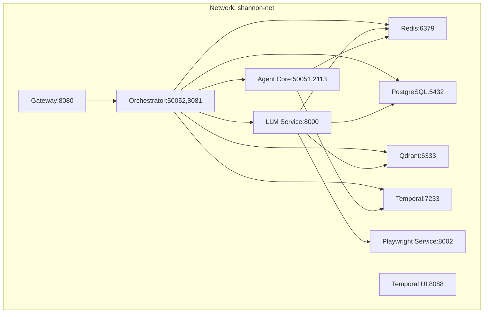
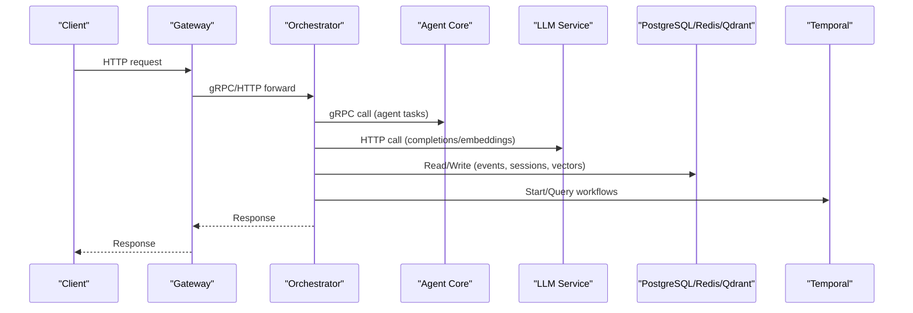
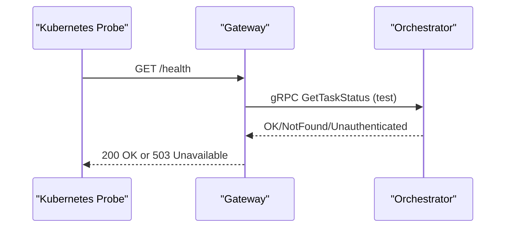
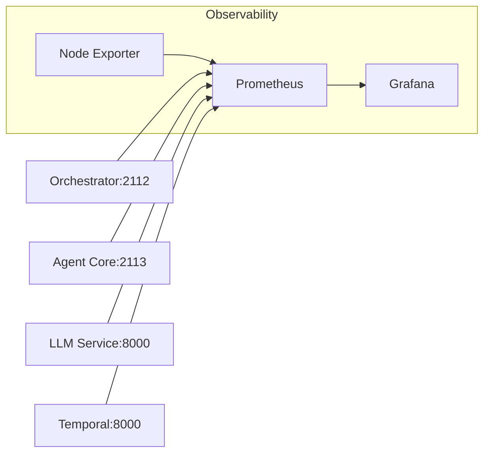
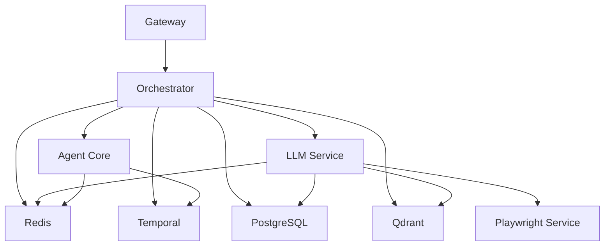

# Deployment and Operations

<cite>
**Referenced Files in This Document**
- [docker-compose.yml](file://deploy/compose/docker-compose.yml)
- [docker-compose.release.yml](file://deploy/compose/docker-compose.release.yml)
- [docker-compose.override.example.yml](file://deploy/compose/docker-compose.override.example.yml)
- [docker-compose-grafana-prometheus.yml](file://deploy/compose/grafana/docker-compose-grafana-prometheus.yml)
- [.env.example](file://.env.example)
- [shannon.yaml](file://config/shannon.yaml)
- [prometheus.yml](file://observability/prometheus/prometheus.yml)
- [alerts.yml](file://observability/prometheus/alerts.yml)
- [policy.json](file://observability/grafana/dashboards/policy.json)
- [prometheus.yml](file://deploy/compose/grafana/config/provisioning/datasources/prometheus.yml)
- [import-dashboards.sh](file://deploy/compose/grafana/scripts/import-dashboards.sh)
- [Dockerfile (Gateway)](file://go/orchestrator/cmd/gateway/Dockerfile)
- [Dockerfile (LLM Service)](file://python/llm-service/Dockerfile)
- [health.go (Orchestrator HTTP)](file://go/orchestrator/internal/health/http.go)
- [health.py (LLM Service API)](file://python/llm-service/llm_service/api/health.py)
- [health.go (Gateway Handler)](file://go/orchestrator/cmd/gateway/internal/handlers/health.go)
- [app.py (Playwright Service)](file://python/playwright-service/app.py)
</cite>

## Table of Contents
1. [Introduction](#introduction)
2. [Project Structure](#project-structure)
3. [Core Components](#core-components)
4. [Architecture Overview](#architecture-overview)
5. [Detailed Component Analysis](#detailed-component-analysis)
6. [Dependency Analysis](#dependency-analysis)
7. [Performance Considerations](#performance-considerations)
8. [Troubleshooting Guide](#troubleshooting-guide)
9. [Conclusion](#conclusion)
10. [Appendices](#appendices)

## Introduction
This document provides production-ready deployment and operations guidance for Shannon’s infrastructure. It covers Docker Compose configurations for development and production, environment configuration, service dependencies, monitoring and observability with Prometheus, Grafana, and OpenTelemetry, scaling and high availability strategies, health checks, troubleshooting, backup and recovery, disaster recovery, security hardening, performance tuning, and enterprise best practices.

## Project Structure
Shannon’s deployment is orchestrated with Docker Compose and includes:
- Core services: gateway, orchestrator, agent-core, llm-service, playwright-service
- Data stores: PostgreSQL (with pgvector), Redis, Qdrant
- Temporal workflow engine and UI
- Observability stack: Prometheus, Grafana, and alerting rules
- Configuration: environment variables, service configs, and Grafana dashboards

**Diagram sources**
- [docker-compose.yml](file://deploy/compose/docker-compose.yml#L14-L411)
- [docker-compose.release.yml](file://deploy/compose/docker-compose.release.yml#L14-L345)

**Section sources**
- [docker-compose.yml](file://deploy/compose/docker-compose.yml#L1-L411)
- [docker-compose.release.yml](file://deploy/compose/docker-compose.release.yml#L1-L345)

## Core Components
- Gateway: Exposes the public API and proxies to orchestrator. Health endpoints include readiness and liveness checks.
- Orchestrator: gRPC service with HTTP admin endpoints, workflow orchestration, and health server.
- Agent Core: Rust service exposing gRPC and metrics; integrates with WASM sandbox and rate limiting.
- LLM Service: Python FastAPI service providing completions, embeddings, tools, and health endpoints.
- Playwright Service: Browser automation service with session management and concurrency controls.
- Data Stores: PostgreSQL (pgvector), Redis, Qdrant.
- Temporal: Workflow engine with UI for visibility and control.
- Observability: Prometheus scraping, Grafana dashboards, and alerting rules.

**Section sources**
- [docker-compose.yml](file://deploy/compose/docker-compose.yml#L14-L411)
- [docker-compose.release.yml](file://deploy/compose/docker-compose.release.yml#L14-L345)
- [shannon.yaml](file://config/shannon.yaml#L1-L378)

## Architecture Overview
The system is composed of microservices communicating over gRPC and HTTP. The gateway acts as the ingress, delegating to orchestrator, which coordinates agent-core, llm-service, and external systems. Data stores and Temporal provide persistence and workflow execution respectively. Observability is integrated via Prometheus metrics and Grafana dashboards.

**Diagram sources**
- [docker-compose.yml](file://deploy/compose/docker-compose.yml#L14-L411)
- [health.go (Gateway Handler)](file://go/orchestrator/cmd/gateway/internal/handlers/health.go#L37-L108)
- [health.go (Orchestrator HTTP)](file://go/orchestrator/internal/health/http.go#L27-L321)
- [health.py (LLM Service API)](file://python/llm-service/llm_service/api/health.py#L7-L42)

## Detailed Component Analysis

### Docker Compose Environments
- Development: Use the override file to enable local debugging, hot reload, and anonymous Grafana access.
- Production: Use release images and environment variables for secrets and endpoints.

Key differences:
- Release Compose uses prebuilt images and sets VERSION for tagged releases.
- Development Compose mounts code and exposes ports for interactive debugging.
- Both include Grafana/Prometheus stack and node exporter.

**Section sources**
- [docker-compose.yml](file://deploy/compose/docker-compose.yml#L1-L411)
- [docker-compose.release.yml](file://deploy/compose/docker-compose.release.yml#L1-L345)
- [docker-compose.override.example.yml](file://deploy/compose/docker-compose.override.example.yml#L1-L107)

### Environment Configuration
- Centralized via .env.example with sections for credentials, endpoints, caches, rate limits, and observability.
- Services read from .env and environment variables; defaults are embedded in services.
- Critical secrets: JWT_SECRET, API keys for LLM providers, and database credentials.

Operational guidance:
- Copy .env.example to .env and populate required values.
- For production, rotate JWT_SECRET and avoid development defaults.
- Configure provider keys for embeddings and tooling.

**Section sources**
- [.env.example](file://.env.example#L1-L248)
- [docker-compose.yml](file://deploy/compose/docker-compose.yml#L14-L411)
- [docker-compose.release.yml](file://deploy/compose/docker-compose.release.yml#L14-L345)

### Service Dependencies and Startup Order
- Depends-on conditions ensure dependent services start after prerequisites:
  - agent-core requires temporal and redis healthy.
  - orchestrator requires temporal started, postgres and redis healthy.
  - llm-service requires redis, qdrant, postgres healthy, and playwright-service.
  - gateway requires orchestrator started and redis/postgres healthy.
- Health checks:
  - PostgreSQL: pg_isready.
  - Redis: redis-cli ping.
  - Agent Core: TCP connect to gRPC port.
  - Orchestrator: TCP connect to gRPC port.
  - LLM Service: HTTP health/live endpoint.
  - Gateway: HTTP health endpoint.

**Section sources**
- [docker-compose.yml](file://deploy/compose/docker-compose.yml#L14-L411)
- [docker-compose.release.yml](file://deploy/compose/docker-compose.release.yml#L14-L345)

### Health Checks and Readiness/Liveness
- Gateway: /health and readiness check against orchestrator via gRPC.
- Orchestrator: Dedicated health server with /health, /health/ready, /health/live, and detailed health.
- LLM Service: /, /ready, /live endpoints.
- Playwright Service: Health endpoint exposed by FastAPI app.

**Diagram sources**
- [health.go (Gateway Handler)](file://go/orchestrator/cmd/gateway/internal/handlers/health.go#L37-L108)

**Section sources**
- [health.go (Gateway Handler)](file://go/orchestrator/cmd/gateway/internal/handlers/health.go#L37-L108)
- [health.go (Orchestrator HTTP)](file://go/orchestrator/internal/health/http.go#L27-L321)
- [health.py (LLM Service API)](file://python/llm-service/llm_service/api/health.py#L7-L42)

### Observability Stack: Prometheus, Grafana, Alerts
- Prometheus scrapes orchestrator, agent-core, llm-service, temporal, and node exporter.
- Grafana provisioned with Prometheus data source and dashboard import script.
- Alerting rules define SLO-based and service health alerts.

**Diagram sources**
- [prometheus.yml](file://observability/prometheus/prometheus.yml#L21-L78)
- [docker-compose-grafana-prometheus.yml](file://deploy/compose/grafana/docker-compose-grafana-prometheus.yml#L1-L86)

**Section sources**
- [prometheus.yml](file://observability/prometheus/prometheus.yml#L1-L78)
- [alerts.yml](file://observability/prometheus/alerts.yml#L1-L143)
- [docker-compose-grafana-prometheus.yml](file://deploy/compose/grafana/docker-compose-grafana-prometheus.yml#L1-L86)
- [prometheus.yml](file://deploy/compose/grafana/config/provisioning/datasources/prometheus.yml#L1-L11)
- [import-dashboards.sh](file://deploy/compose/grafana/scripts/import-dashboards.sh#L1-L224)
- [policy.json](file://observability/grafana/dashboards/policy.json#L1-L651)

### Scaling, Load Balancing, and High Availability
- Horizontal scaling:
  - Orchestrator workers: configure worker counts per priority queue and single-queue modes.
  - Agent Core: adjust TOOL_PARALLELISM for concurrent tool execution.
  - LLM Service: increase replicas behind a reverse proxy or load balancer.
- Load balancing:
  - Use an external load balancer or ingress controller to distribute traffic to gateway instances.
- High availability:
  - PostgreSQL: consider managed Postgres or HA cluster.
  - Redis: Redis Sentinel or managed Redis for failover.
  - Qdrant: multi-node cluster for horizontal scaling.
  - Temporal: clustered deployment with multiple frontend nodes.

**Section sources**
- [docker-compose.yml](file://deploy/compose/docker-compose.yml#L139-L226)
- [docker-compose.release.yml](file://deploy/compose/docker-compose.release.yml#L141-L212)
- [shannon.yaml](file://config/shannon.yaml#L241-L249)

### Backup and Recovery Procedures
- PostgreSQL:
  - Schedule regular logical backups using pg_dump.
  - Restore from latest backup and replay WAL if needed.
- Redis:
  - Enable AOF persistence and snapshot backups.
  - Validate backup integrity and test restore procedures.
- Qdrant:
  - Back up storage volume or use Qdrant snapshots.
  - Verify collection integrity and re-index if necessary.
- Disaster recovery:
  - Maintain offsite backups and test DR drills quarterly.
  - Automate failover procedures for primary dependencies.

[No sources needed since this section provides general guidance]

### Security Hardening
- Secrets management:
  - Store JWT_SECRET, API keys, and database passwords in a secrets manager.
  - Rotate regularly and restrict access.
- Network:
  - Restrict inbound ports; only expose 8080 (gateway) externally.
  - Use internal networks and disable host networking.
- Authentication and authorization:
  - Enable JWT-based auth in production.
  - Use API keys and tenant isolation.
- Container hardening:
  - Run containers as non-root where possible.
  - Pin image digests and scan images regularly.
- Observability:
  - Enable OpenTelemetry tracing for production.
  - Secure Prometheus/Grafana with authentication and TLS termination.

**Section sources**
- [.env.example](file://.env.example#L160-L161)
- [docker-compose.yml](file://deploy/compose/docker-compose.yml#L369-L407)
- [docker-compose.release.yml](file://deploy/compose/docker-compose.release.yml#L310-L344)

### Performance Tuning
- Worker configuration:
  - Adjust worker counts per priority level in orchestrator configuration.
  - Tune TOOL_PARALLELISM in agent-core for tool execution concurrency.
- Caching and rate limiting:
  - Enable and tune cache similarity thresholds.
  - Configure rate limits for providers and internal services.
- Database and vector search:
  - Optimize PostgreSQL settings and indexing.
  - Tune Qdrant shard and replication settings.
- Observability:
  - Use Prometheus retention and compaction settings appropriate for production scale.

**Section sources**
- [docker-compose.yml](file://deploy/compose/docker-compose.yml#L139-L226)
- [docker-compose.release.yml](file://deploy/compose/docker-compose.release.yml#L141-L212)
- [shannon.yaml](file://config/shannon.yaml#L159-L213)

### Operational Best Practices
- Environment separation:
  - Use distinct .env files for dev, staging, and prod.
- Logging and auditing:
  - Enable structured logging and audit trails for policy decisions.
- Maintenance windows:
  - Schedule rolling updates and zero-downtime deployments.
- Monitoring:
  - Define SLOs and runbooks aligned with alerting rules.

**Section sources**
- [.env.example](file://.env.example#L12-L14)
- [alerts.yml](file://observability/prometheus/alerts.yml#L1-L143)

## Dependency Analysis
The following diagram shows service-level dependencies and their health check relationships.

**Diagram sources**
- [docker-compose.yml](file://deploy/compose/docker-compose.yml#L14-L411)
- [docker-compose.release.yml](file://deploy/compose/docker-compose.release.yml#L14-L345)

**Section sources**
- [docker-compose.yml](file://deploy/compose/docker-compose.yml#L14-L411)
- [docker-compose.release.yml](file://deploy/compose/docker-compose.release.yml#L14-L345)

## Performance Considerations
- Tune worker concurrency and tool parallelism based on workload.
- Monitor token usage and budget thresholds to prevent runaway costs.
- Use MMR and embedding caching to optimize vector search performance.
- Scale stateful components (PostgreSQL, Redis, Qdrant) independently.

[No sources needed since this section provides general guidance]

## Troubleshooting Guide
Common issues and resolutions:
- Service down:
  - Check health endpoints: /health, /health/ready, /health/live.
  - Review service logs and health server output.
- Dependency failures:
  - Verify PostgreSQL/Redis/Qdrant connectivity and credentials.
  - Confirm Temporal UI accessibility and workflow status.
- Metrics and dashboards:
  - Ensure Prometheus scrapes all targets and Grafana data source is configured.
  - Validate dashboard import script executed successfully.
- Browser automation:
  - Confirm Playwright service health and session limits.

**Section sources**
- [health.go (Orchestrator HTTP)](file://go/orchestrator/internal/health/http.go#L27-L321)
- [health.py (LLM Service API)](file://python/llm-service/llm_service/api/health.py#L7-L42)
- [health.go (Gateway Handler)](file://go/orchestrator/cmd/gateway/internal/handlers/health.go#L37-L108)
- [docker-compose-grafana-prometheus.yml](file://deploy/compose/grafana/docker-compose-grafana-prometheus.yml#L1-L86)
- [import-dashboards.sh](file://deploy/compose/grafana/scripts/import-dashboards.sh#L1-L224)
- [app.py (Playwright Service)](file://python/playwright-service/app.py#L1-L200)

## Conclusion
Shannon’s deployment leverages Docker Compose for local development and release images for production, with a robust observability stack and health checking across services. By following the environment configuration, scaling strategies, security hardening, and operational best practices outlined here, teams can achieve reliable, scalable, and secure operations suitable for enterprise environments.

## Appendices

### Practical Examples
- Development setup:
  - Copy override example to docker-compose.override.yml and adjust ports and secrets.
  - Start services with docker compose up -d.
- Production rollout:
  - Set .env values for production, pin image versions, and deploy with release Compose.
  - Import Grafana dashboards and configure alerting.

**Section sources**
- [docker-compose.override.example.yml](file://deploy/compose/docker-compose.override.example.yml#L1-L107)
- [docker-compose.release.yml](file://deploy/compose/docker-compose.release.yml#L1-L345)

### Container Images and Build Notes
- Gateway: Multi-stage Go build with static binary and minimal Alpine runtime.
- LLM Service: Python slim image with uvicorn ASGI server and health checks.

**Section sources**
- [Dockerfile (Gateway)](file://go/orchestrator/cmd/gateway/Dockerfile#L1-L37)
- [Dockerfile (LLM Service)](file://python/llm-service/Dockerfile#L1-L39)