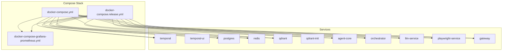
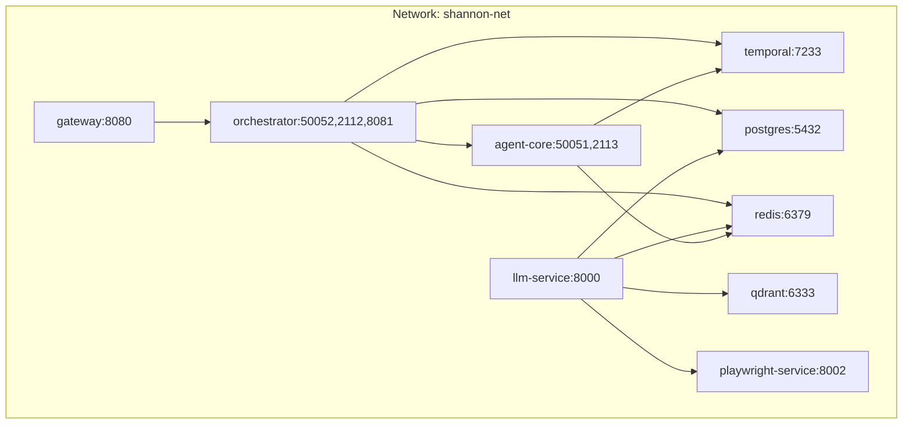
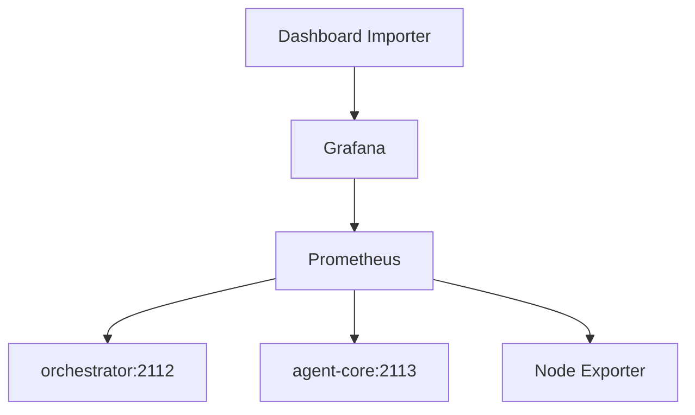
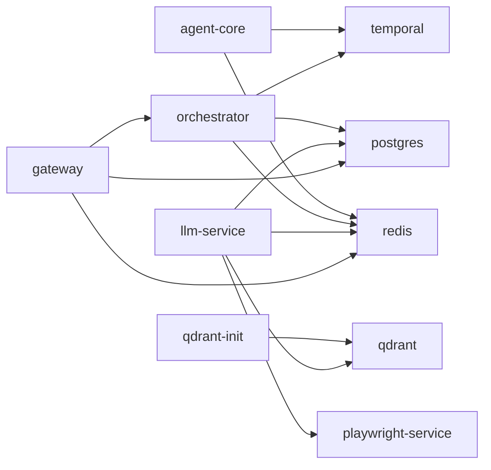

# Docker Deployment

<cite>
**Referenced Files in This Document**
- [docker-compose.yml](file://deploy/compose/docker-compose.yml)
- [docker-compose.override.example.yml](file://deploy/compose/docker-compose.override.example.yml)
- [.env.example](file://.env.example)
- [docker-compose.release.yml](file://deploy/compose/docker-compose.release.yml)
- [docker-compose-grafana-prometheus.yml](file://deploy/compose/grafana/docker-compose-grafana-prometheus.yml)
- [Dockerfile (agent-core)](file://rust/agent-core/Dockerfile)
- [Dockerfile (orchestrator)](file://go/orchestrator/Dockerfile)
- [Dockerfile (llm-service)](file://python/llm-service/Dockerfile)
- [Dockerfile (playwright-service)](file://python/playwright-service/Dockerfile)
- [Dockerfile (gateway)](file://go/orchestrator/cmd/gateway/Dockerfile)
- [features.yaml](file://config/features.yaml)
- [models.yaml](file://config/models.yaml)
- [shannon.yaml](file://config/shannon.yaml)
- [prometheus.yml](file://deploy/compose/grafana/config/prometheus.yml)
- [grafana.ini](file://deploy/compose/grafana/config/grafana.ini)
</cite>

## Table of Contents
1. [Introduction](#introduction)
2. [Project Structure](#project-structure)
3. [Core Components](#core-components)
4. [Architecture Overview](#architecture-overview)
5. [Detailed Component Analysis](#detailed-component-analysis)
6. [Dependency Analysis](#dependency-analysis)
7. [Performance Considerations](#performance-considerations)
8. [Troubleshooting Guide](#troubleshooting-guide)
9. [Conclusion](#conclusion)
10. [Appendices](#appendices)

## Introduction
This document provides comprehensive Docker deployment guidance for Shannon’s containerized infrastructure. It covers the Docker Compose setup, service definitions, network configuration, volume management, environment variable configuration, health checks, dependency management, and operational patterns for both development and production. It also documents volume mounting strategies, service discovery, resource allocation, security contexts, and production hardening measures.

## Project Structure
Shannon’s deployment is orchestrated with Docker Compose across three primary files:
- Base composition for local development and CI
- Release composition for production images
- Grafana/Prometheus stack included via include directive

**Diagram sources**
- [docker-compose.yml](file://deploy/compose/docker-compose.yml#L1-L411)
- [docker-compose.release.yml](file://deploy/compose/docker-compose.release.yml#L1-L345)
- [docker-compose-grafana-prometheus.yml](file://deploy/compose/grafana/docker-compose-grafana-prometheus.yml#L1-L86)

**Section sources**
- [docker-compose.yml](file://deploy/compose/docker-compose.yml#L1-L411)
- [docker-compose.release.yml](file://deploy/compose/docker-compose.release.yml#L1-L345)
- [docker-compose-grafana-prometheus.yml](file://deploy/compose/grafana/docker-compose-grafana-prometheus.yml#L1-L86)

## Core Components
This section summarizes each service, its purpose, ports, health checks, and dependencies.

- temporal
  - Purpose: Temporal server with auto-setup
  - Ports: 7233
  - Depends on: postgres
  - Health: Not defined in base compose; relies on service_started condition
- temporal-ui
  - Purpose: Temporal UI
  - Ports: 8088
  - Depends on: temporal
- postgres
  - Purpose: Vector-enabled Postgres (pgvector)
  - Ports: 5432
  - Volumes: postgres_data, migrations mounted
  - Health: pg_isready check
- redis
  - Purpose: In-memory cache and rate limiting
  - Ports: 6379
  - Health: ping check
- qdrant
  - Purpose: Vector database
  - Ports: 6333
  - Volumes: qdrant_data
- qdrant-init
  - Purpose: Initialize Qdrant collections
  - Depends on: qdrant
  - Restarts: no
- agent-core
  - Purpose: Agent runtime with WASM sandbox
  - Ports: 50051, 2113
  - Health: TCP connect to 50051
  - Depends on: temporal (started), redis (healthy)
  - Volumes: config, wasm-interpreters
- orchestrator
  - Purpose: Workflow orchestration and gRPC/HTTP API
  - Ports: 50052, 2112, 8081
  - Health: TCP connect to 50052
  - Depends on: temporal (started), postgres (healthy), redis (healthy)
  - Volumes: config
- llm-service
  - Purpose: LLM orchestration, caching, tooling, and streaming
  - Ports: 8000
  - Health: HTTP GET /health/live
  - Depends on: redis (healthy), qdrant (started), postgres (healthy), playwright-service (healthy)
  - Volumes: config, wasm-interpreters
- playwright-service
  - Purpose: Headless browser automation
  - Ports: 8002
  - Health: HTTP GET /health
  - Volumes: None
  - shm_size: 2GB
- gateway
  - Purpose: Public HTTP entrypoint to orchestrator
  - Ports: 8080
  - Health: HTTP GET /health
  - Depends on: orchestrator (started), redis (healthy), postgres (healthy)
  - Volumes: config

**Section sources**
- [docker-compose.yml](file://deploy/compose/docker-compose.yml#L14-L411)
- [docker-compose.release.yml](file://deploy/compose/docker-compose.release.yml#L14-L345)

## Architecture Overview
The system is a multi-service mesh connected via a shared bridge network. Services communicate using DNS names within the network. Persistent state is stored in named volumes for Postgres and Qdrant. Grafana/Prometheus is included for observability.

**Diagram sources**
- [docker-compose.yml](file://deploy/compose/docker-compose.yml#L14-L411)
- [docker-compose.release.yml](file://deploy/compose/docker-compose.release.yml#L14-L345)

## Detailed Component Analysis

### Network Configuration
- A single bridge network named shannon-net is used by all services.
- Services discover each other by DNS names (e.g., postgres, redis, temporal, qdrant, orchestrator, agent-core, llm-service, playwright-service, gateway).
- Port exposure is minimal in release compose; internal communication uses service names.

**Section sources**
- [docker-compose.yml](file://deploy/compose/docker-compose.yml#L3-L5)
- [docker-compose.release.yml](file://deploy/compose/docker-compose.release.yml#L3-L5)

### Volume Management
- Named volumes:
  - postgres_data: stores Postgres data and seeds with migrations
  - qdrant_data: stores Qdrant vectors and indices
- Bind mounts:
  - agent-core and orchestrator mount config and wasm-interpreters read-only
  - llm-service mounts config and wasm-interpreters read-only
  - Release compose mounts ./config and ./wasm-interpreters for runtime configuration
- Grafana/Prometheus:
  - Prometheus data and Grafana data persisted to named volumes
  - Node Exporter exposes host metrics

**Section sources**
- [docker-compose.yml](file://deploy/compose/docker-compose.yml#L10-L12)
- [docker-compose.yml](file://deploy/compose/docker-compose.yml#L48-L50)
- [docker-compose.yml](file://deploy/compose/docker-compose.yml#L78-L79)
- [docker-compose.yml](file://deploy/compose/docker-compose.yml#L134-L136)
- [docker-compose.yml](file://deploy/compose/docker-compose.yml#L224-L225)
- [docker-compose.yml](file://deploy/compose/docker-compose.yml#L337-L339)
- [docker-compose.release.yml](file://deploy/compose/docker-compose.release.yml#L10-L12)
- [docker-compose.release.yml](file://deploy/compose/docker-compose.release.yml#L48-L50)
- [docker-compose.release.yml](file://deploy/compose/docker-compose.release.yml#L78-L79)
- [docker-compose.release.yml](file://deploy/compose/docker-compose.release.yml#L136-L138)
- [docker-compose.release.yml](file://deploy/compose/docker-compose.release.yml#L210-L211)
- [docker-compose.release.yml](file://deploy/compose/docker-compose.release.yml#L305-L307)
- [docker-compose-grafana-prometheus.yml](file://deploy/compose/grafana/docker-compose-grafana-prometheus.yml#L5-L7)
- [docker-compose-grafana-prometheus.yml](file://deploy/compose/grafana/docker-compose-grafana-prometheus.yml#L24-L26)

### Environment Variables and Configuration
- Global environment:
  - .env.example defines platform-wide variables for API keys, providers, data stores, endpoints, model routing, cache and rate limiting, approvals, templates, observability, WASM sandbox, OpenAPI/MCP hardening, and browser automation.
- Service-specific environment:
  - agent-core: logging, metrics port, enforcement and rate-limiting parameters, LLM service URL, timeouts, WASM settings, Redis enforcement URL
  - orchestrator: Temporal host, Postgres credentials and SSL mode, metrics port, timeouts, priority queues, tool selection, LLM partials, event batching, citations debug, backpressure and circuit breaker parameters, rate limits, worker concurrency per priority, approvals, events ingestion, templates, JWT secret
  - llm-service: Redis and Postgres connectivity, debug/environment/service name, model configs, default model tier and temperature, token limits and budgets, cache settings, rate limits, web search providers and keys, OpenAPI/MCP hardening, WASM settings, agent-core address, OTel, events ingestion, playwright-service URL
  - playwright-service: host/port, debug, session TTL and max sessions, browser viewport/headless
  - gateway: port, orchestrator gRPC/admin endpoints, Postgres credentials and SSL mode, Redis URL, JWT secret, auth bypass flag
- Overrides:
  - docker-compose.override.example adds development-friendly settings (auth bypass, debug logs, local JWT secret, optional local code mounts, exposing ports for local debugging, enabling Prometheus/Grafana)

**Section sources**
- [.env.example](file://.env.example#L1-L248)
- [docker-compose.yml](file://deploy/compose/docker-compose.yml#L101-L120)
- [docker-compose.yml](file://deploy/compose/docker-compose.yml#L144-L200)
- [docker-compose.yml](file://deploy/compose/docker-compose.yml#L235-L321)
- [docker-compose.yml](file://deploy/compose/docker-compose.yml#L347-L367)
- [docker-compose.yml](file://deploy/compose/docker-compose.yml#L376-L390)
- [docker-compose.override.example.yml](file://deploy/compose/docker-compose.override.example.yml#L16-L31)
- [docker-compose.override.example.yml](file://deploy/compose/docker-compose.override.example.yml#L36-L46)
- [docker-compose.override.example.yml](file://deploy/compose/docker-compose.override.example.yml#L47-L57)
- [docker-compose.override.example.yml](file://deploy/compose/docker-compose.override.example.yml#L58-L68)
- [docker-compose.override.example.yml](file://deploy/compose/docker-compose.override.example.yml#L69-L78)
- [docker-compose.override.example.yml](file://deploy/compose/docker-compose.override.example.yml#L82-L86)
- [docker-compose.override.example.yml](file://deploy/compose/docker-compose.override.example.yml#L88-L101)

### Health Checks and Dependencies
- Health checks:
  - postgres: pg_isready
  - redis: ping
  - qdrant: TCP port check in release compose
  - agent-core: TCP connect to 50051
  - orchestrator: TCP connect to 50052
  - llm-service: HTTP GET /health/live
  - playwright-service: HTTP GET /health
  - gateway: HTTP GET /health
- Dependencies:
  - qdrant-init depends on qdrant and runs once to initialize collections
  - agent-core depends on temporal (started) and redis (healthy)
  - orchestrator depends on temporal (started), postgres (healthy), redis (healthy)
  - llm-service depends on redis (healthy), qdrant (started), postgres (healthy), playwright-service (healthy)
  - gateway depends on orchestrator (started), redis (healthy), postgres (healthy)

**Section sources**
- [docker-compose.yml](file://deploy/compose/docker-compose.yml#L53-L58)
- [docker-compose.yml](file://deploy/compose/docker-compose.yml#L66-L71)
- [docker-compose.yml](file://deploy/compose/docker-compose.yml#L80-L94)
- [docker-compose.yml](file://deploy/compose/docker-compose.yml#L129-L134)
- [docker-compose.yml](file://deploy/compose/docker-compose.yml#L219-L224)
- [docker-compose.yml](file://deploy/compose/docker-compose.yml#L332-L337)
- [docker-compose.yml](file://deploy/compose/docker-compose.yml#L360-L367)
- [docker-compose.yml](file://deploy/compose/docker-compose.yml#L400-L405)
- [docker-compose.release.yml](file://deploy/compose/docker-compose.release.yml#L53-L58)
- [docker-compose.release.yml](file://deploy/compose/docker-compose.release.yml#L66-L71)
- [docker-compose.release.yml](file://deploy/compose/docker-compose.release.yml#L80-L85)
- [docker-compose.release.yml](file://deploy/compose/docker-compose.release.yml#L131-L136)
- [docker-compose.release.yml](file://deploy/compose/docker-compose.release.yml#L205-L210)
- [docker-compose.release.yml](file://deploy/compose/docker-compose.release.yml#L300-L305)
- [docker-compose.release.yml](file://deploy/compose/docker-compose.release.yml#L337-L342)

### Service Discovery Patterns
- Internal DNS names:
  - postgres, redis, temporal, qdrant, orchestrator, agent-core, llm-service, playwright-service, gateway
- Endpoint configuration:
  - .env.example centralizes endpoint URLs for services (e.g., LLM_SERVICE_URL, AGENT_CORE_ADDR, ADMIN_SERVER, ORCHESTRATOR_GRPC)
- Release compose uses published images and environment variables; development compose builds from source.

**Section sources**
- [.env.example](file://.env.example#L91-L102)
- [docker-compose.yml](file://deploy/compose/docker-compose.yml#L14-L411)
- [docker-compose.release.yml](file://deploy/compose/docker-compose.release.yml#L14-L345)

### Container Resource Allocation and Security Contexts
- Resource hints visible in compose:
  - playwright-service sets shm_size to 2GB to support browser automation
- Security considerations:
  - Playwright service runs as a non-root user and installs Chromium to a shared path
  - Gateway Dockerfile copies a statically linked binary and uses minimal base image
  - Grafana admin credentials are configurable via environment variables
- Production hardening recommendations:
  - Replace default JWT_SECRET with a strong random secret
  - Enable TLS for Postgres and Redis connections
  - Restrict Prometheus/Grafana exposure to trusted networks
  - Use read-only root filesystems and drop unnecessary capabilities where feasible
  - Enforce network policies to limit inter-service traffic to essential ports

**Section sources**
- [docker-compose.yml](file://deploy/compose/docker-compose.yml#L367-L367)
- [docker-compose.release.yml](file://deploy/compose/docker-compose.release.yml#L310-L344)
- [docker-compose-grafana-prometheus.yml](file://deploy/compose/grafana/docker-compose-grafana-prometheus.yml#L28-L31)
- [Dockerfile (playwright-service)](file://python/playwright-service/Dockerfile#L41-L47)
- [Dockerfile (gateway)](file://go/orchestrator/cmd/gateway/Dockerfile#L24-L37)

### Practical Deployment Examples

#### Development Deployment
- Steps:
  - Copy the override file and adjust development settings as needed
  - Bring up the stack with compose
  - Access gateway at http://localhost:8080
  - Temporal UI at http://localhost:8088
  - Grafana at http://localhost:3000 (credentials in override)
- Notes:
  - Auth bypass and debug logs are enabled by default in the override
  - Optional local code mounts can be enabled for hot reload

**Section sources**
- [docker-compose.override.example.yml](file://deploy/compose/docker-compose.override.example.yml#L1-L107)
- [docker-compose.yml](file://deploy/compose/docker-compose.yml#L3-L8)

#### Production Deployment
- Steps:
  - Use the release compose file
  - Set VERSION to pin images
  - Provide .env with secure secrets and provider keys
  - Persist volumes and configure backups
- Notes:
  - Uses published images for agent-core, orchestrator, llm-service, and gateway
  - Health checks and dependencies are defined for resilience

**Section sources**
- [docker-compose.release.yml](file://deploy/compose/docker-compose.release.yml#L1-L345)
- [.env.example](file://.env.example#L1-L248)

#### Scaling Services
- Horizontal scaling:
  - Orchestrator and agent-core can be scaled behind the gateway
  - Redis and Postgres are single-instance by default; scale Redis with clustering or use managed services
  - Qdrant can be clustered for high availability (outside the scope of current compose)
- Vertical scaling:
  - Adjust worker concurrency and timeouts in orchestrator configuration
  - Tune WASM memory and timeouts in agent-core and llm-service

[No sources needed since this section provides general guidance]

### Observability and Metrics
- Prometheus scrapes orchestrator (2112) and agent-core (2113) metrics endpoints
- Grafana dashboard importer provisions dashboards after Grafana starts
- Node Exporter exposes host-level metrics

**Diagram sources**
- [prometheus.yml](file://deploy/compose/grafana/config/prometheus.yml#L1-L28)
- [docker-compose-grafana-prometheus.yml](file://deploy/compose/grafana/docker-compose-grafana-prometheus.yml#L1-L86)

**Section sources**
- [prometheus.yml](file://deploy/compose/grafana/config/prometheus.yml#L1-L28)
- [docker-compose-grafana-prometheus.yml](file://deploy/compose/grafana/docker-compose-grafana-prometheus.yml#L1-L86)

## Dependency Analysis
The following diagram shows service dependencies and their conditions.

**Diagram sources**
- [docker-compose.yml](file://deploy/compose/docker-compose.yml#L82-L94)
- [docker-compose.yml](file://deploy/compose/docker-compose.yml#L121-L128)
- [docker-compose.yml](file://deploy/compose/docker-compose.yml#L208-L215)
- [docker-compose.yml](file://deploy/compose/docker-compose.yml#L321-L330)
- [docker-compose.yml](file://deploy/compose/docker-compose.yml#L391-L398)

**Section sources**
- [docker-compose.yml](file://deploy/compose/docker-compose.yml#L82-L94)
- [docker-compose.yml](file://deploy/compose/docker-compose.yml#L121-L128)
- [docker-compose.yml](file://deploy/compose/docker-compose.yml#L208-L215)
- [docker-compose.yml](file://deploy/compose/docker-compose.yml#L321-L330)
- [docker-compose.yml](file://deploy/compose/docker-compose.yml#L391-L398)

## Performance Considerations
- Worker concurrency:
  - Configure orchestrator worker counts per priority and single-queue mode via environment variables
- Caching and rate limiting:
  - Enable cache and tune similarity threshold in llm-service
  - Set rate limits and provider rate control in orchestrator and llm-service
- Model routing:
  - Adjust model tiers and budgets in .env and models.yaml
- Vector search:
  - Tune top_k and thresholds in features.yaml and shannon.yaml
- Browser automation:
  - Increase playwright-service session limits and adjust session TTL for throughput

[No sources needed since this section provides general guidance]

## Troubleshooting Guide
- Health check failures:
  - Verify service ports and health endpoints
  - Confirm dependencies are healthy (postgres, redis, temporal, qdrant)
- Connectivity issues:
  - Ensure services are on the same network and use DNS names
  - Check firewall and port exposure
- Data persistence:
  - Confirm named volumes are attached and not accidentally removed
- Grafana/Prometheus:
  - Validate scraping targets and dashboard import completion
- Secrets and auth:
  - Replace default JWT_SECRET and enable proper auth in production

**Section sources**
- [docker-compose.yml](file://deploy/compose/docker-compose.yml#L53-L58)
- [docker-compose.yml](file://deploy/compose/docker-compose.yml#L66-L71)
- [docker-compose.yml](file://deploy/compose/docker-compose.yml#L80-L94)
- [docker-compose.yml](file://deploy/compose/docker-compose.yml#L129-L134)
- [docker-compose.yml](file://deploy/compose/docker-compose.yml#L219-L224)
- [docker-compose.yml](file://deploy/compose/docker-compose.yml#L332-L337)
- [docker-compose.yml](file://deploy/compose/docker-compose.yml#L360-L367)
- [docker-compose.yml](file://deploy/compose/docker-compose.yml#L400-L405)
- [docker-compose.release.yml](file://deploy/compose/docker-compose.release.yml#L80-L85)
- [docker-compose-grafana-prometheus.yml](file://deploy/compose/grafana/docker-compose-grafana-prometheus.yml#L44-L62)

## Conclusion
Shannon’s Docker Compose setup provides a robust, modular foundation for deploying the multi-service architecture. By leveraging named volumes, health checks, and a shared network, the stack is resilient and observable. For production, pair the compose configuration with strong secrets, TLS, and hardened runtime settings. Use the override file for development ergonomics and the release compose for reproducible deployments.

## Appendices

### Appendix A: Service Port Reference
- temporal: 7233
- temporal-ui: 8088
- postgres: 5432
- redis: 6379
- qdrant: 6333
- agent-core: 50051, 2113
- orchestrator: 50052, 2112, 8081
- llm-service: 8000
- playwright-service: 8002
- gateway: 8080
- Prometheus: 9090
- Grafana: 3000
- Node Exporter: 9100

**Section sources**
- [docker-compose.yml](file://deploy/compose/docker-compose.yml#L26-L39)
- [docker-compose.yml](file://deploy/compose/docker-compose.yml#L51-L58)
- [docker-compose.yml](file://deploy/compose/docker-compose.yml#L64-L71)
- [docker-compose.yml](file://deploy/compose/docker-compose.yml#L76-L85)
- [docker-compose.yml](file://deploy/compose/docker-compose.yml#L126-L137)
- [docker-compose.yml](file://deploy/compose/docker-compose.yml#L215-L226)
- [docker-compose.yml](file://deploy/compose/docker-compose.yml#L330-L340)
- [docker-compose.yml](file://deploy/compose/docker-compose.yml#L358-L367)
- [docker-compose.yml](file://deploy/compose/docker-compose.yml#L398-L407)
- [docker-compose-grafana-prometheus.yml](file://deploy/compose/grafana/docker-compose-grafana-prometheus.yml#L8-L15)
- [docker-compose-grafana-prometheus.yml](file://deploy/compose/grafana/docker-compose-grafana-prometheus.yml#L22-L29)
- [docker-compose-grafana-prometheus.yml](file://deploy/compose/grafana/docker-compose-grafana-prometheus.yml#L67-L78)

### Appendix B: Configuration Files Overview
- features.yaml: Feature flags, execution modes, agent/tool/workflow settings, enforcement defaults, storage, observability
- models.yaml: Model tiers, selection strategy, cost controls, provider settings, catalog, capabilities, rate limits
- shannon.yaml: Orchestrator service config, auth, session budgets, circuit breakers, MCP/OpenAPI tools, degradation, health checks, vector/search, logging, tracing, streaming, workflows, cognitive workflows, features

**Section sources**
- [features.yaml](file://config/features.yaml#L1-L270)
- [models.yaml](file://config/models.yaml#L1-L776)
- [shannon.yaml](file://config/shannon.yaml#L1-L378)