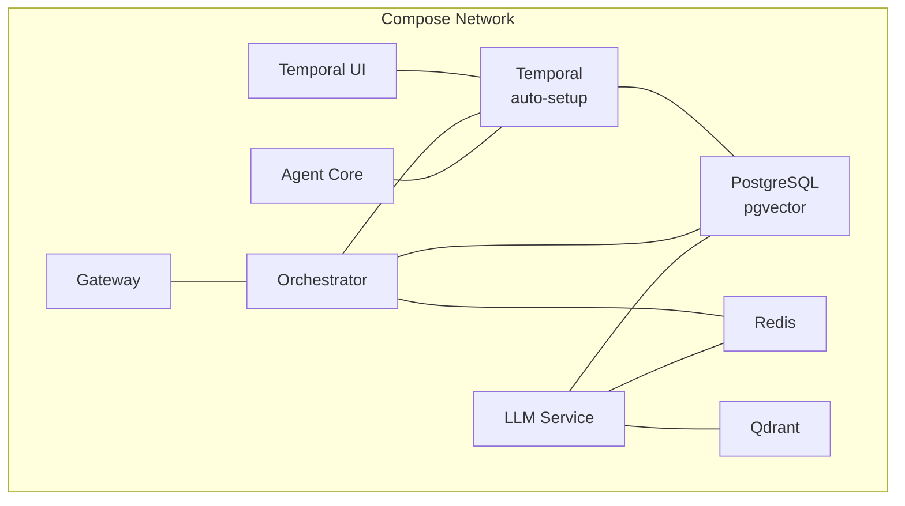

# Infrastructure Setup

<cite>
**Referenced Files in This Document**
- [docker-compose.yml](file://deploy/compose/docker-compose.yml)
- [docker-compose.release.yml](file://deploy/compose/docker-compose.release.yml)
- [docker-compose.override.example.yml](file://deploy/compose/docker-compose.override.example.yml)
- [bootstrap_qdrant.sh](file://scripts/bootstrap_qdrant.sh)
- [init-qdrant-collections.sh](file://scripts/init-qdrant-collections.sh)
- [seed_postgres.sh](file://scripts/seed_postgres.sh)
- [001_initial_schema.sql](file://migrations/postgres/001_initial_schema.sql)
- [create_collections.py](file://migrations/qdrant/create_collections.py)
- [create_decomposition_patterns.py](file://migrations/qdrant/create_decomposition_patterns.py)
- [shannon.yaml](file://config/shannon.yaml)
- [models.yaml](file://config/models.yaml)
- [features.yaml](file://config/features.yaml)
- [client.go](file://go/orchestrator/internal/db/client.go)
- [client.go](file://go/orchestrator/internal/vectordb/client.go)
- [adapter.go](file://go/orchestrator/internal/temporal/adapter.go)
</cite>

## Table of Contents
1. [Introduction](#introduction)
2. [Project Structure](#project-structure)
3. [Core Components](#core-components)
4. [Architecture Overview](#architecture-overview)
5. [Detailed Component Analysis](#detailed-component-analysis)
6. [Dependency Analysis](#dependency-analysis)
7. [Performance Considerations](#performance-considerations)
8. [Troubleshooting Guide](#troubleshooting-guide)
9. [Conclusion](#conclusion)
10. [Appendices](#appendices)

## Introduction
This document provides a comprehensive guide to setting up Shannon’s backend infrastructure. It covers:
- PostgreSQL database initialization, schema migrations, and data seeding
- Qdrant vector database setup, collection creation, and indexing strategies
- Redis configuration for caching and streaming
- Temporal.io setup for workflow orchestration, including auto-setup configuration and UI integration
- Practical examples for schema management, vector collection initialization, and service bootstrapping
- Prerequisites, hardware recommendations, and performance tuning
- Troubleshooting and validation procedures

## Project Structure
Shannon’s infrastructure is orchestrated primarily through Docker Compose. The stack includes:
- Temporal auto-setup and UI
- PostgreSQL with pgvector extension and migrations
- Redis for caching and rate limiting
- Qdrant vector database with initialization scripts
- Orchestrator, LLM service, agent core, gateway, and supporting services

**Diagram sources**
- [docker-compose.yml](file://deploy/compose/docker-compose.yml#L14-L411)
- [docker-compose.release.yml](file://deploy/compose/docker-compose.release.yml#L14-L345)

**Section sources**
- [docker-compose.yml](file://deploy/compose/docker-compose.yml#L1-L411)
- [docker-compose.release.yml](file://deploy/compose/docker-compose.release.yml#L1-L345)

## Core Components
- PostgreSQL (pgvector): Stores user sessions, tasks, token usage, audit logs, and related persistence tables. Migrations are mounted at container startup.
- Redis: Provides caching, rate limiting, and session storage for streaming.
- Qdrant: Vector database for embeddings and semantic search across collections.
- Temporal: Auto-setup with UI for workflow orchestration.
- Orchestrator, LLM Service, Agent Core, Gateway: Application services depending on the above infrastructure.

Practical setup steps:
- Bring up the stack with Docker Compose
- Seed PostgreSQL with initial schema and optional data
- Initialize Qdrant collections
- Validate health of all services

**Section sources**
- [docker-compose.yml](file://deploy/compose/docker-compose.yml#L41-L86)
- [docker-compose.release.yml](file://deploy/compose/docker-compose.release.yml#L41-L101)
- [seed_postgres.sh](file://scripts/seed_postgres.sh#L1-L17)
- [init-qdrant-collections.sh](file://scripts/init-qdrant-collections.sh#L1-L62)
- [bootstrap_qdrant.sh](file://scripts/bootstrap_qdrant.sh#L1-L23)

## Architecture Overview
The infrastructure follows a microservice architecture with clear separation of concerns:
- Data persistence: PostgreSQL with migrations
- Vector search: Qdrant with payload indexes
- Caching and rate limiting: Redis
- Workflow orchestration: Temporal
- API gateway and service mesh: Gateway -> Orchestrator -> LLM Service -> Agent Core

**Diagram sources**
- [docker-compose.yml](file://deploy/compose/docker-compose.yml#L14-L411)
- [docker-compose.release.yml](file://deploy/compose/docker-compose.release.yml#L14-L345)

## Detailed Component Analysis

### PostgreSQL Database Initialization and Schema Management
- Image: pgvector/pgvector:pg16
- Credentials and database: shannon/shannon/shannon
- Migrations: Mounted from ./migrations/postgres into /docker-entrypoint-initdb.d
- Extensions: uuid-ossp, pg_trgm, btree_gin
- Initial schema: 001_initial_schema.sql defines users, sessions, prompts, token usage, audit logs, and indexes
- Additional migrations: 002 through 011 add task execution tables, authentication, event logs, and other persistence structures

**Diagram sources**
- [001_initial_schema.sql](file://migrations/postgres/001_initial_schema.sql#L4-L141)
- [docker-compose.yml](file://deploy/compose/docker-compose.yml#L41-L58)

Practical steps:
- Start services: docker compose up -d postgres
- Seed data (optional): ./scripts/seed_postgres.sh
- Validate schema: Connect to the database and inspect tables and indexes

Validation tips:
- Confirm extensions exist
- Verify table existence and primary keys
- Check indexes exist for common filters

**Section sources**
- [001_initial_schema.sql](file://migrations/postgres/001_initial_schema.sql#L4-L141)
- [docker-compose.yml](file://deploy/compose/docker-compose.yml#L41-L58)
- [seed_postgres.sh](file://scripts/seed_postgres.sh#L1-L17)

### Qdrant Vector Database Setup and Collection Initialization
- Image: qdrant/qdrant:latest
- Persistence: volume qdrant_data mounted to /qdrant/storage
- Two initialization approaches:
  - Containerized init job: Python script mounts from ./migrations/qdrant and creates collections
  - Standalone scripts:
    - init-qdrant-collections.sh: Creates task_embeddings and decomposition_patterns with Cosine vectors
    - bootstrap_qdrant.sh: Creates tool_results and cases collections

**Diagram sources**
- [create_collections.py](file://migrations/qdrant/create_collections.py#L44-L227)
- [create_decomposition_patterns.py](file://migrations/qdrant/create_decomposition_patterns.py#L24-L126)
- [init-qdrant-collections.sh](file://scripts/init-qdrant-collections.sh#L22-L55)
- [bootstrap_qdrant.sh](file://scripts/bootstrap_qdrant.sh#L8-L21)

Practical steps:
- Start services: docker compose up -d qdrant
- Initialize collections: docker compose run qdrant-init
- Or run standalone scripts:
  - ./scripts/init-qdrant-collections.sh
  - ./scripts/bootstrap_qdrant.sh

Validation tips:
- List collections: curl http://localhost:6333/collections
- Verify payload indexes exist for filters and timestamps

**Section sources**
- [create_collections.py](file://migrations/qdrant/create_collections.py#L44-L227)
- [create_decomposition_patterns.py](file://migrations/qdrant/create_decomposition_patterns.py#L24-L126)
- [init-qdrant-collections.sh](file://scripts/init-qdrant-collections.sh#L22-L55)
- [bootstrap_qdrant.sh](file://scripts/bootstrap_qdrant.sh#L8-L21)

### Redis Configuration for Caching and Streaming
- Image: redis:7-alpine
- Persistence: appendonly enabled (AOF)
- Ports: 6379 exposed
- Services depend on Redis for:
  - LLM service caching and rate limiting
  - Orchestrator session caching and streaming buffers
  - Agent Core enforcement and rate limiting

**Diagram sources**
- [docker-compose.yml](file://deploy/compose/docker-compose.yml#L60-L71)
- [docker-compose.release.yml](file://deploy/compose/docker-compose.release.yml#L60-L85)

Practical steps:
- Start Redis: docker compose up -d redis
- Validate health: docker compose exec redis redis-cli ping
- Adjust TTL and rate limits in service configs as needed

**Section sources**
- [docker-compose.yml](file://deploy/compose/docker-compose.yml#L60-L71)
- [docker-compose.release.yml](file://deploy/compose/docker-compose.release.yml#L60-L85)

### Temporal.io Setup for Workflow Orchestration
- Image: temporalio/auto-setup:latest
- Depends on PostgreSQL
- UI: temporalio/ui:2.40.1
- Ports: 7233 (Temporal), 8088 (UI)
- Services connect to Temporal via host temporal:7233

**Diagram sources**
- [docker-compose.yml](file://deploy/compose/docker-compose.yml#L15-L39)
- [docker-compose.release.yml](file://deploy/compose/docker-compose.release.yml#L15-L40)

Practical steps:
- Start services: docker compose up -d temporal temporal-ui
- Access UI at http://localhost:8088
- Verify Temporal health and namespaces/task queues

**Section sources**
- [docker-compose.yml](file://deploy/compose/docker-compose.yml#L15-L39)
- [docker-compose.release.yml](file://deploy/compose/docker-compose.release.yml#L15-L40)

### Database Client and Vector DB Clients (Code-Level)
The Go services use dedicated clients for robust operations:
- Database client: connection pooling, async write queue, circuit breaker, health checks
- Vector DB client: HTTP wrapper around Qdrant, fallback search/query endpoints, tracing, and MMR support

**Diagram sources**
- [client.go](file://go/orchestrator/internal/db/client.go#L16-L146)
- [client.go](file://go/orchestrator/internal/vectordb/client.go#L19-L54)
- [adapter.go](file://go/orchestrator/internal/temporal/adapter.go#L11-L90)

**Section sources**
- [client.go](file://go/orchestrator/internal/db/client.go#L16-L146)
- [client.go](file://go/orchestrator/internal/vectordb/client.go#L19-L54)
- [adapter.go](file://go/orchestrator/internal/temporal/adapter.go#L11-L90)

## Dependency Analysis
- PostgreSQL is a hard dependency for Orchestrator and LLM Service
- Redis is a hard dependency for caching and rate limiting
- Qdrant is a hard dependency for vector search and embeddings
- Temporal is a hard dependency for workflow orchestration
- The orchestrator depends on Temporal for workflow execution and on PostgreSQL/Redis for persistence and caching

**Diagram sources**
- [docker-compose.yml](file://deploy/compose/docker-compose.yml#L14-L411)
- [docker-compose.release.yml](file://deploy/compose/docker-compose.release.yml#L14-L345)

**Section sources**
- [docker-compose.yml](file://deploy/compose/docker-compose.yml#L14-L411)
- [docker-compose.release.yml](file://deploy/compose/docker-compose.release.yml#L14-L345)

## Performance Considerations
- PostgreSQL
  - Connection pool sizing: adjust MaxConnections and IdleConnections in the database client
  - Indexes: ensure selective indexes on frequently filtered columns (user_id, tenant_id, timestamps)
  - Migrations: keep migrations minimal and idempotent to reduce downtime
- Redis
  - AOF persistence ensures durability; monitor memory usage and eviction policies
  - Tune TTL for cached entries to balance freshness and cost
- Qdrant
  - Use payload indexes for frequent filters (session_id, user_id, tenant_id)
  - Optimize HNSW parameters (ef_construct, m) for recall vs speed trade-offs
  - Enable MMR for diverse retrieval when needed
- Temporal
  - Scale workers and task queues based on workload
  - Monitor UI for workflow lag and retry rates

[No sources needed since this section provides general guidance]

## Troubleshooting Guide
Common issues and resolutions:
- PostgreSQL not ready
  - Symptom: Orchestrator/LLM Service cannot connect
  - Resolution: Check health check and migrations mount; ensure initdb.d scripts succeed
  - Validation: docker compose logs postgres
- Qdrant not reachable
  - Symptom: Vector search failures
  - Resolution: Ensure qdrant-init ran or run init scripts manually
  - Validation: curl http://localhost:6333/health
- Redis connectivity issues
  - Symptom: Cache misses or rate limit failures
  - Resolution: Confirm AOF is enabled and service is healthy
  - Validation: redis-cli ping
- Temporal UI not loading
  - Symptom: UI returns 404 or connection refused
  - Resolution: Verify temporal and temporal-ui are healthy and ports are mapped
  - Validation: docker compose logs temporal-ui
- Vector collection missing
  - Symptom: 404 or empty results from vector search
  - Resolution: Re-run init scripts or qdrant-init job
  - Validation: curl http://localhost:6333/collections

**Section sources**
- [docker-compose.yml](file://deploy/compose/docker-compose.yml#L53-L57)
- [docker-compose.yml](file://deploy/compose/docker-compose.yml#L80-L94)
- [docker-compose.yml](file://deploy/compose/docker-compose.yml#L30-L39)
- [init-qdrant-collections.sh](file://scripts/init-qdrant-collections.sh#L20-L55)

## Conclusion
Shannon’s infrastructure is designed for modularity and resilience. By leveraging Docker Compose, standardized migrations, and robust client libraries, the platform achieves predictable bootstrapping and scalable operations. Follow the steps outlined above to initialize databases, vector stores, caches, and orchestration systems, and use the troubleshooting guide to diagnose and resolve common issues.

[No sources needed since this section summarizes without analyzing specific files]

## Appendices

### Practical Examples

- Database schema management
  - Initialize schema: docker compose up -d postgres
  - Seed data: ./scripts/seed_postgres.sh
  - Validate: connect to PostgreSQL and inspect tables/indexes

- Vector collection initialization
  - Automated: docker compose run qdrant-init
  - Manual: ./scripts/init-qdrant-collections.sh
  - Bootstrap: ./scripts/bootstrap_qdrant.sh

- Service bootstrapping
  - Full stack: docker compose up -d
  - Development overrides: copy docker-compose.override.example.yml to docker-compose.override.yml and adjust ports/logging

- Configuration references
  - Global orchestrator config: [shannon.yaml](file://config/shannon.yaml#L283-L300)
  - Model tiers and pricing: [models.yaml](file://config/models.yaml#L16-L120)
  - Feature flags and vector settings: [features.yaml](file://config/features.yaml#L196-L212)

**Section sources**
- [seed_postgres.sh](file://scripts/seed_postgres.sh#L1-L17)
- [init-qdrant-collections.sh](file://scripts/init-qdrant-collections.sh#L1-L62)
- [bootstrap_qdrant.sh](file://scripts/bootstrap_qdrant.sh#L1-L23)
- [docker-compose.override.example.yml](file://deploy/compose/docker-compose.override.example.yml#L1-L107)
- [shannon.yaml](file://config/shannon.yaml#L283-L300)
- [models.yaml](file://config/models.yaml#L16-L120)
- [features.yaml](file://config/features.yaml#L196-L212)