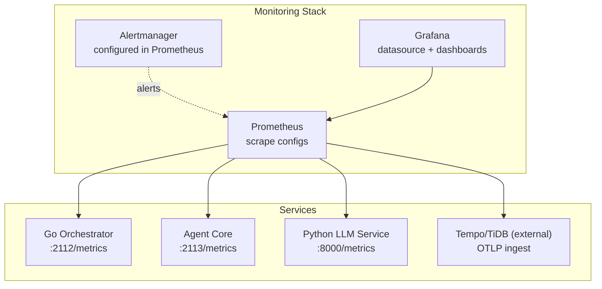
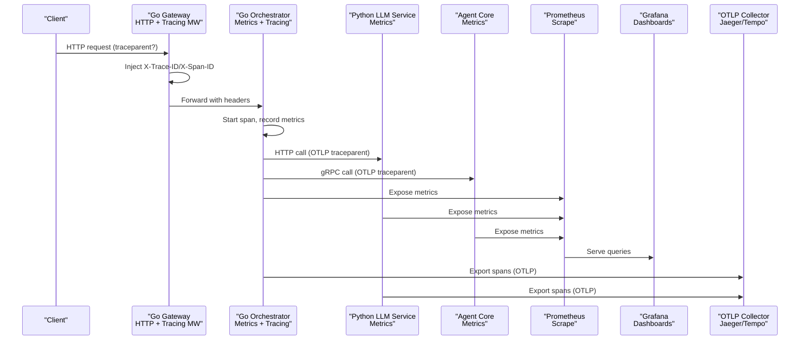
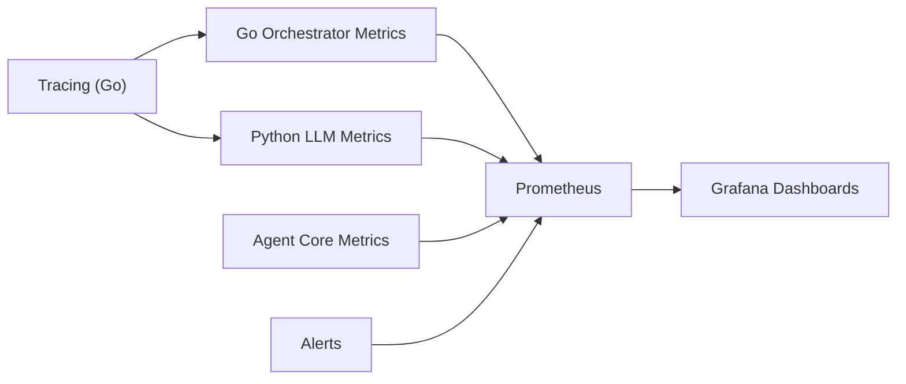

# Monitoring and Observability

<cite>
**Referenced Files in This Document**
- [observability/README.md](file://observability/README.md)
- [observability/POLICY-METRICS.md](file://observability/POLICY-METRICS.md)
- [observability/prometheus/alerts.yml](file://observability/prometheus/alerts.yml)
- [observability/prometheus/prometheus.yml](file://observability/prometheus/prometheus.yml)
- [deploy/compose/grafana/docker-compose-grafana-prometheus.yml](file://deploy/compose/grafana/docker-compose-grafana-prometheus.yml)
- [deploy/compose/grafana/config/provisioning/datasources/prometheus.yml](file://deploy/compose/grafana/config/provisioning/datasources/prometheus.yml)
- [observability/grafana/dashboards/enforcement.json](file://observability/grafana/dashboards/enforcement.json)
- [observability/grafana/dashboards/policy.json](file://observability/grafana/dashboards/policy.json)
- [go/orchestrator/internal/metrics/metrics.go](file://go/orchestrator/internal/metrics/metrics.go)
- [go/orchestrator/cmd/gateway/internal/openai/metrics.go](file://go/orchestrator/cmd/gateway/internal/openai/metrics.go)
- [python/llm-service/llm_service/metrics.py](file://python/llm-service/llm_service/metrics.py)
- [rust/agent-core/src/metrics.rs](file://rust/agent-core/src/metrics.rs)
- [go/orchestrator/internal/tracing/tracing.go](file://go/orchestrator/internal/tracing/tracing.go)
- [go/orchestrator/cmd/gateway/internal/middleware/tracing.go](file://go/orchestrator/cmd/gateway/internal/middleware/tracing.go)
</cite>

## Table of Contents
1. [Introduction](#introduction)
2. [Project Structure](#project-structure)
3. [Core Components](#core-components)
4. [Architecture Overview](#architecture-overview)
5. [Detailed Component Analysis](#detailed-component-analysis)
6. [Dependency Analysis](#dependency-analysis)
7. [Performance Considerations](#performance-considerations)
8. [Troubleshooting Guide](#troubleshooting-guide)
9. [Conclusion](#conclusion)
10. [Appendices](#appendices)

## Introduction
This document provides comprehensive monitoring and observability guidance for Shannon’s production infrastructure. It covers Prometheus metrics collection, metric definitions, alerting rules, Grafana dashboards, OpenTelemetry tracing, distributed tracing, service mesh observability, log aggregation strategies, metric correlation, and performance monitoring. It also includes practical examples for setting up monitoring stacks, configuring alerts, interpreting system metrics, troubleshooting workflows, incident response procedures, capacity planning, performance optimization, and system health assessment.

## Project Structure
Shannon’s observability stack is organized around three pillars:
- Metrics exposure and collection via Prometheus
- Grafana dashboards for visualization
- OpenTelemetry tracing across services

**Diagram sources**
- [observability/prometheus/prometheus.yml](file://observability/prometheus/prometheus.yml#L20-L78)
- [deploy/compose/grafana/docker-compose-grafana-prometheus.yml](file://deploy/compose/grafana/docker-compose-grafana-prometheus.yml#L2-L86)
- [deploy/compose/grafana/config/provisioning/datasources/prometheus.yml](file://deploy/compose/grafana/config/provisioning/datasources/prometheus.yml#L1-L11)

**Section sources**
- [observability/README.md](file://observability/README.md#L44-L73)
- [observability/prometheus/prometheus.yml](file://observability/prometheus/prometheus.yml#L1-L78)
- [deploy/compose/grafana/docker-compose-grafana-prometheus.yml](file://deploy/compose/grafana/docker-compose-grafana-prometheus.yml#L1-L86)

## Core Components
- Prometheus configuration defines jobs for orchestrator, agent-core, LLM service, Temporal, and optional exporters.
- Alert rules cover policy SLOs, service health, workflow performance, and token usage.
- Grafana dashboards visualize policy enforcement, policy engine SLOs, and enforcement gateway drops.
- Metrics are exposed by Go, Rust, and Python services with standardized naming and labels.
- OpenTelemetry tracing is implemented with W3C traceparent propagation and OTLP export.

**Section sources**
- [observability/prometheus/prometheus.yml](file://observability/prometheus/prometheus.yml#L20-L78)
- [observability/prometheus/alerts.yml](file://observability/prometheus/alerts.yml#L1-L143)
- [observability/grafana/dashboards/policy.json](file://observability/grafana/dashboards/policy.json#L1-L651)
- [observability/grafana/dashboards/enforcement.json](file://observability/grafana/dashboards/enforcement.json#L1-L55)
- [go/orchestrator/internal/metrics/metrics.go](file://go/orchestrator/internal/metrics/metrics.go#L1-L630)
- [go/orchestrator/cmd/gateway/internal/openai/metrics.go](file://go/orchestrator/cmd/gateway/internal/openai/metrics.go#L1-L234)
- [python/llm-service/llm_service/metrics.py](file://python/llm-service/llm_service/metrics.py#L1-L161)
- [rust/agent-core/src/metrics.rs](file://rust/agent-core/src/metrics.rs#L1-L304)
- [go/orchestrator/internal/tracing/tracing.go](file://go/orchestrator/internal/tracing/tracing.go#L1-L148)
- [go/orchestrator/cmd/gateway/internal/middleware/tracing.go](file://go/orchestrator/cmd/gateway/internal/middleware/tracing.go#L1-L100)

## Architecture Overview
The observability pipeline integrates metrics, tracing, and visualization:

**Diagram sources**
- [go/orchestrator/cmd/gateway/internal/middleware/tracing.go](file://go/orchestrator/cmd/gateway/internal/middleware/tracing.go#L24-L58)
- [go/orchestrator/internal/tracing/tracing.go](file://go/orchestrator/internal/tracing/tracing.go#L27-L82)
- [go/orchestrator/internal/metrics/metrics.go](file://go/orchestrator/internal/metrics/metrics.go#L518-L543)
- [python/llm-service/llm_service/metrics.py](file://python/llm-service/llm_service/metrics.py#L65-L136)
- [rust/agent-core/src/metrics.rs](file://rust/agent-core/src/metrics.rs#L85-L257)
- [observability/prometheus/prometheus.yml](file://observability/prometheus/prometheus.yml#L20-L78)
- [observability/prometheus/alerts.yml](file://observability/prometheus/alerts.yml#L1-L143)

## Detailed Component Analysis

### Prometheus Metrics Collection Setup
- Jobs are defined for orchestrator, agent-core, LLM service, Temporal, and optional exporters.
- External labels include monitor and environment for multi-cluster or multi-environment setups.
- Alertmanager is configured to receive alerts from Prometheus.

**Section sources**
- [observability/prometheus/prometheus.yml](file://observability/prometheus/prometheus.yml#L1-L78)

### Alerting Rules Configuration
- Policy engine SLOs: error rate, latency, cache hit rate, denial rate, emergency kill switch.
- Service health: orchestrator, agent-core, LLM service down.
- Workflow performance: error rate and scheduling latency.
- Token usage: budget exceeded rate and spikes.

**Section sources**
- [observability/prometheus/alerts.yml](file://observability/prometheus/alerts.yml#L1-L143)

### Grafana Dashboard Implementation
- Policy Engine Production Monitoring dashboard:
  - Decision overview, error rate SLO, latency SLO (P50/P95/P99), cache hit rate.
  - Canary rollout status, policy version info, top deny reasons.
  - Dry-run vs enforce decisions, error budget, routing breakdown.
- Enforcement Gateway dashboard:
  - Request enforcement drops vs allowed.
  - Circuit breaker open state and drop rates.

**Section sources**
- [observability/grafana/dashboards/policy.json](file://observability/grafana/dashboards/policy.json#L1-L651)
- [observability/grafana/dashboards/enforcement.json](file://observability/grafana/dashboards/enforcement.json#L1-L55)

### OpenTelemetry Tracing Integration
- Go Orchestrator:
  - Minimal OTLP tracer provider with batch exporter.
  - W3C traceparent generation/injection and parsing.
  - HTTP spans with method and URL attributes.
- Python LLM Service:
  - Auto-instrumentation via environment variables for OTLP export.
- Headers propagated:
  - W3C traceparent for HTTP hops.
  - X-Workflow-ID and X-Run-ID propagated in gRPC metadata.

**Section sources**
- [go/orchestrator/internal/tracing/tracing.go](file://go/orchestrator/internal/tracing/tracing.go#L27-L82)
- [go/orchestrator/internal/tracing/tracing.go](file://go/orchestrator/internal/tracing/tracing.go#L84-L148)
- [go/orchestrator/cmd/gateway/internal/middleware/tracing.go](file://go/orchestrator/cmd/gateway/internal/middleware/tracing.go#L24-L58)
- [observability/README.md](file://observability/README.md#L9-L43)

### Service Mesh Observability
- The tracing layer supports hop-by-hop propagation across HTTP and gRPC boundaries.
- gRPC metadata carries workflow identifiers to correlate traces across service boundaries.
- Distributed tracing enables end-to-end latency analysis and bottleneck identification.

**Section sources**
- [go/orchestrator/internal/tracing/tracing.go](file://go/orchestrator/internal/tracing/tracing.go#L106-L123)
- [observability/README.md](file://observability/README.md#L10-L13)

### Metrics Exposure and Definitions
- Go Orchestrator:
  - Workflow, task, agent, session, memory, cache, vector DB, embedding, pricing fallback, chunking, complexity, model tier/provider selection, OpenAI-compatible API metrics.
- Python LLM Service:
  - LLM requests, durations, tokens, cost, MCP requests, planner fallbacks, active connections, errors.
- Rust Agent Core:
  - Tasks, FSM, memory pool, tools, gRPC, enforcement drops/allowed.
- Naming and labeling conventions:
  - Consistent metric families with descriptive names and label sets for drill-down.

**Section sources**
- [go/orchestrator/internal/metrics/metrics.go](file://go/orchestrator/internal/metrics/metrics.go#L1-L630)
- [go/orchestrator/cmd/gateway/internal/openai/metrics.go](file://go/orchestrator/cmd/gateway/internal/openai/metrics.go#L1-L234)
- [python/llm-service/llm_service/metrics.py](file://python/llm-service/llm_service/metrics.py#L1-L161)
- [rust/agent-core/src/metrics.rs](file://rust/agent-core/src/metrics.rs#L1-L304)

### Practical Examples
- Setting up the monitoring stack:
  - Use the provided Docker Compose to launch Prometheus, Grafana, and Node Exporter.
  - Configure Grafana datasource to Prometheus and import dashboards via script.
- Configuring alerts:
  - Place alert rules under the Prometheus rule file and reload configuration.
- Interpreting metrics:
  - Use policy dashboard to track SLOs and canary rollout.
  - Use enforcement dashboard to monitor drops and circuit breaker state.
  - Use workflow dashboards to assess error rates and latency.

**Section sources**
- [deploy/compose/grafana/docker-compose-grafana-prometheus.yml](file://deploy/compose/grafana/docker-compose-grafana-prometheus.yml#L1-L86)
- [deploy/compose/grafana/config/provisioning/datasources/prometheus.yml](file://deploy/compose/grafana/config/provisioning/datasources/prometheus.yml#L1-L11)
- [observability/prometheus/alerts.yml](file://observability/prometheus/alerts.yml#L1-L143)
- [observability/grafana/dashboards/policy.json](file://observability/grafana/dashboards/policy.json#L1-L651)
- [observability/grafana/dashboards/enforcement.json](file://observability/grafana/dashboards/enforcement.json#L1-L55)

## Dependency Analysis

**Diagram sources**
- [go/orchestrator/internal/tracing/tracing.go](file://go/orchestrator/internal/tracing/tracing.go#L27-L82)
- [go/orchestrator/internal/metrics/metrics.go](file://go/orchestrator/internal/metrics/metrics.go#L1-L630)
- [python/llm-service/llm_service/metrics.py](file://python/llm-service/llm_service/metrics.py#L1-L161)
- [rust/agent-core/src/metrics.rs](file://rust/agent-core/src/metrics.rs#L1-L304)
- [observability/prometheus/prometheus.yml](file://observability/prometheus/prometheus.yml#L20-L78)
- [observability/prometheus/alerts.yml](file://observability/prometheus/alerts.yml#L1-L143)

**Section sources**
- [observability/prometheus/prometheus.yml](file://observability/prometheus/prometheus.yml#L20-L78)
- [observability/prometheus/alerts.yml](file://observability/prometheus/alerts.yml#L1-L143)

## Performance Considerations
- Use histograms for latency and throughput to capture percentiles and distributions.
- Apply appropriate bucket sizes for high-sensitivity metrics (e.g., policy latency).
- Monitor cache hit rates and tune cache size/TTL to reduce backend load.
- Track token usage and budget exceeded rates to prevent runaway consumption.
- Correlate policy engine latency with application performance to identify regressions.

[No sources needed since this section provides general guidance]

## Troubleshooting Guide
- Policy Engine:
  - High latency: inspect cache hit rate and policy complexity; review deny reason trends.
  - High error rate: validate policy syntax and input formats; check logs.
  - High denial rate: compare with security events; adjust rules or user allowlists.
  - Low cache hit rate: reduce request variance or increase cache capacity.
- Service Health:
  - Down alerts: verify service readiness, network connectivity, and resource limits.
- Workflow Performance:
  - Elevated error rates or scheduling latency: investigate queue backlogs and provider throttles.
- Token Usage:
  - Budget exceeded or spikes: review request patterns and implement stricter quotas.

**Section sources**
- [observability/POLICY-METRICS.md](file://observability/POLICY-METRICS.md#L166-L203)
- [observability/prometheus/alerts.yml](file://observability/prometheus/alerts.yml#L62-L143)

## Conclusion
Shannon’s observability stack provides robust metrics, tracing, and visualization for production monitoring. By leveraging Prometheus and Grafana dashboards, enforcing strict SLO-based alerting, and maintaining distributed tracing across services, operators can achieve strong operational visibility, accelerate incident response, and continuously optimize system performance.

[No sources needed since this section summarizes without analyzing specific files]

## Appendices

### Appendix A: Grafana Dashboard Import Steps
- Import policy and enforcement dashboards into Grafana.
- Ensure Prometheus is scraping services on the configured ports.
- Validate datasource configuration and dashboard refresh intervals.

**Section sources**
- [observability/grafana/dashboards/policy.json](file://observability/grafana/dashboards/policy.json#L1-L651)
- [observability/grafana/dashboards/enforcement.json](file://observability/grafana/dashboards/enforcement.json#L1-L55)
- [deploy/compose/grafana/config/provisioning/datasources/prometheus.yml](file://deploy/compose/grafana/config/provisioning/datasources/prometheus.yml#L1-L11)

### Appendix B: Tracing Configuration
- Enable tracing in configuration for the orchestrator and set OTLP endpoint.
- Python service uses environment variables for OTLP export.
- Validate trace propagation via headers and span continuity across services.

**Section sources**
- [observability/README.md](file://observability/README.md#L20-L43)
- [go/orchestrator/internal/tracing/tracing.go](file://go/orchestrator/internal/tracing/tracing.go#L27-L82)

### Appendix C: Metrics Reference
- Core metric families and labels are defined consistently across services.
- Use label filters to isolate incidents and correlate metrics across components.

**Section sources**
- [go/orchestrator/internal/metrics/metrics.go](file://go/orchestrator/internal/metrics/metrics.go#L1-L630)
- [go/orchestrator/cmd/gateway/internal/openai/metrics.go](file://go/orchestrator/cmd/gateway/internal/openai/metrics.go#L1-L234)
- [python/llm-service/llm_service/metrics.py](file://python/llm-service/llm_service/metrics.py#L1-L161)
- [rust/agent-core/src/metrics.rs](file://rust/agent-core/src/metrics.rs#L1-L304)