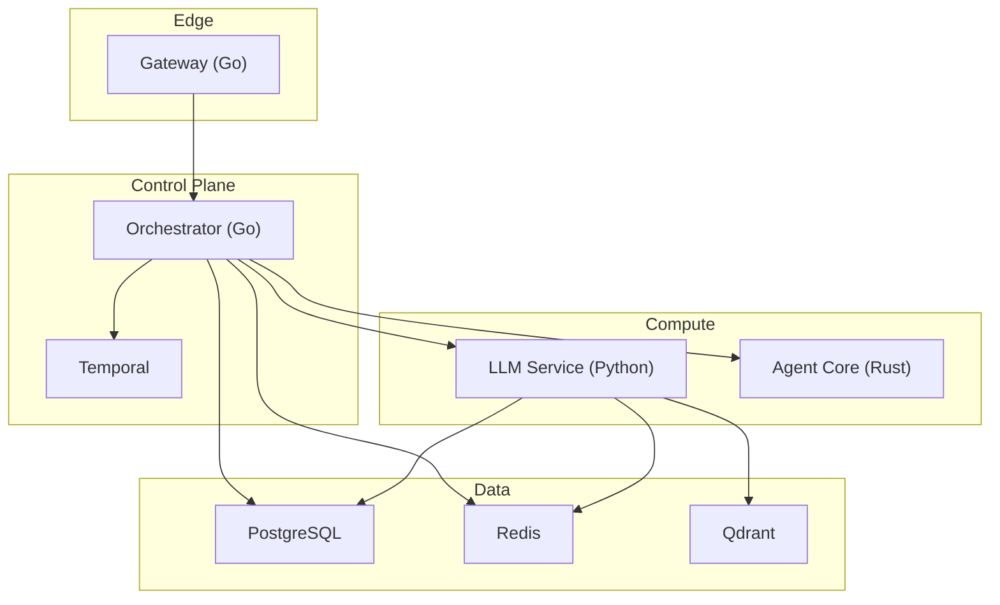
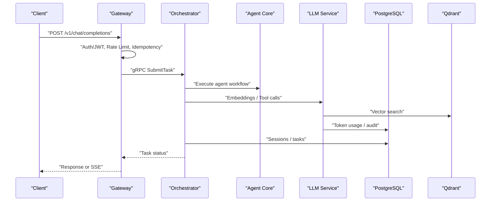
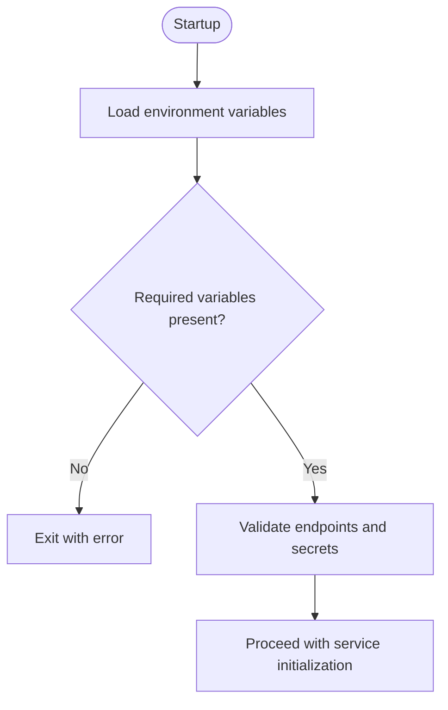
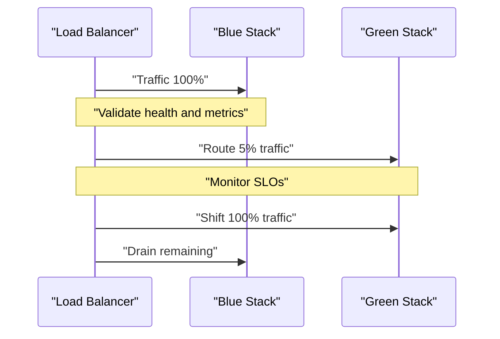
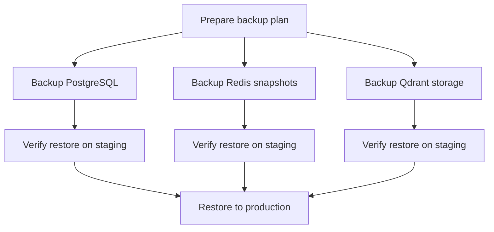
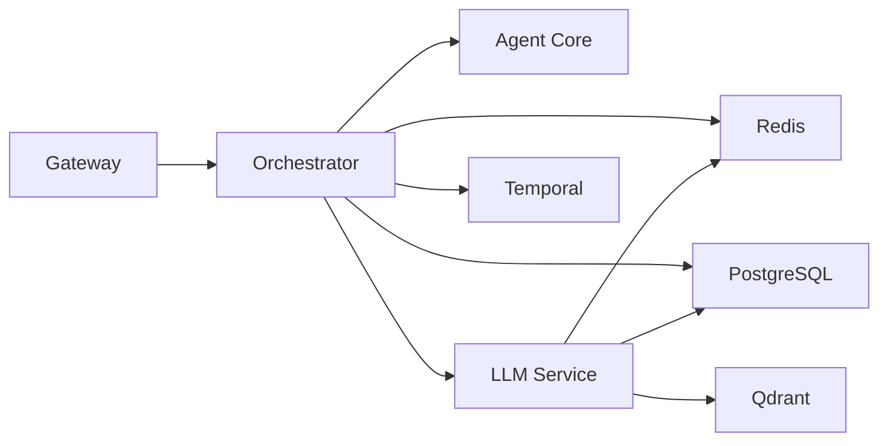

# Production Operations

<cite>
**Referenced Files in This Document**
- [config/shannon.yaml](file://config/shannon.yaml)
- [config/features.yaml](file://config/features.yaml)
- [config/models.yaml](file://config/models.yaml)
- [deploy/compose/docker-compose.yml](file://deploy/compose/docker-compose.yml)
- [deploy/compose/docker-compose.release.yml](file://deploy/compose/docker-compose.release.yml)
- [go/orchestrator/cmd/gateway/main.go](file://go/orchestrator/cmd/gateway/main.go)
- [go/orchestrator/internal/config/config.go](file://go/orchestrator/internal/config/config.go)
- [go/orchestrator/internal/health/manager.go](file://go/orchestrator/internal/health/manager.go)
- [go/orchestrator/internal/circuitbreaker/circuit_breaker.go](file://go/orchestrator/internal/circuitbreaker/circuit_breaker.go)
- [go/orchestrator/internal/degradation/manager.go](file://go/orchestrator/internal/degradation/manager.go)
- [observability/prometheus/prometheus.yml](file://observability/prometheus/prometheus.yml)
- [scripts/bootstrap_qdrant.sh](file://scripts/bootstrap_qdrant.sh)
- [docs/environment-configuration.md](file://docs/environment-configuration.md)
- [docs/troubleshooting.md](file://docs/troubleshooting.md)
- [migrations/postgres/001_initial_schema.sql](file://migrations/postgres/001_initial_schema.sql)
</cite>

## Table of Contents
1. [Introduction](#introduction)
2. [Project Structure](#project-structure)
3. [Core Components](#core-components)
4. [Architecture Overview](#architecture-overview)
5. [Detailed Component Analysis](#detailed-component-analysis)
6. [Dependency Analysis](#dependency-analysis)
7. [Performance Considerations](#performance-considerations)
8. [Troubleshooting Guide](#troubleshooting-guide)
9. [Conclusion](#conclusion)
10. [Appendices](#appendices)

## Introduction
This document provides production operations guidance for Shannon’s enterprise deployment. It covers environment configuration management, secrets handling, configuration drift prevention, deployment strategies (blue-green, rolling updates, canary), backup and recovery for PostgreSQL, Redis, and Qdrant, disaster recovery planning, high availability, failover procedures, capacity planning, scaling strategies, performance optimization, security hardening, network segmentation, compliance, and operational runbooks for common scenarios.

## Project Structure
Shannon’s production stack is orchestrated with Docker Compose and includes:
- Gateway (Go) exposing OpenAI-compatible APIs and authentication
- Orchestrator (Go) coordinating workflows and sessions
- LLM Service (Python) providing model routing, tool execution, and embeddings
- Agent Core (Rust) for WASI sandboxed tool execution
- Temporal for workflow execution and persistence
- PostgreSQL for relational data and audit logs
- Redis for caching, rate limiting, and idempotency
- Qdrant for vector storage and retrieval
- Grafana/Prometheus for observability

**Diagram sources**
- [deploy/compose/docker-compose.yml](file://deploy/compose/docker-compose.yml#L14-L411)
- [go/orchestrator/cmd/gateway/main.go](file://go/orchestrator/cmd/gateway/main.go#L30-L639)

**Section sources**
- [deploy/compose/docker-compose.yml](file://deploy/compose/docker-compose.yml#L1-L411)

## Core Components
- Configuration Management
  - Centralized YAML configs define service ports, timeouts, health checks, vector DB, embeddings, policy, temporal, logging, streaming, and workflow behavior.
  - Environment variables override defaults and supply secrets and feature flags.
- Health and Resilience
  - Health manager with configurable checks and criticality flags.
  - Circuit breakers protect downstream dependencies.
  - Degradation manager dynamically adjusts execution modes and returns partial results.
- Observability
  - Prometheus scraping targets for orchestrator, agent-core, llm-service, temporal, and optional exporters for Postgres and Redis.
- Data Persistence
  - PostgreSQL schema with users, sessions, prompts, learning cases, token usage, and audit logs.
  - Qdrant collections bootstrapped for vector storage.

**Section sources**
- [config/shannon.yaml](file://config/shannon.yaml#L1-L378)
- [config/features.yaml](file://config/features.yaml#L1-L270)
- [go/orchestrator/internal/health/manager.go](file://go/orchestrator/internal/health/manager.go#L1-L603)
- [go/orchestrator/internal/circuitbreaker/circuit_breaker.go](file://go/orchestrator/internal/circuitbreaker/circuit_breaker.go#L1-L250)
- [go/orchestrator/internal/degradation/manager.go](file://go/orchestrator/internal/degradation/manager.go#L1-L243)
- [observability/prometheus/prometheus.yml](file://observability/prometheus/prometheus.yml#L1-L78)
- [migrations/postgres/001_initial_schema.sql](file://migrations/postgres/001_initial_schema.sql#L1-L141)

## Architecture Overview
The production architecture emphasizes separation of concerns:
- Gateway handles authentication, rate limiting, idempotency, and proxies streaming endpoints.
- Orchestrator manages sessions, approvals, schedules, and delegates to Agent Core and LLM Service.
- LLM Service integrates model providers, tool execution, embeddings, and vector caching.
- Temporal provides durable workflow execution and persistence.
- Data stores are provisioned as managed services with persistent volumes.

**Diagram sources**
- [go/orchestrator/cmd/gateway/main.go](file://go/orchestrator/cmd/gateway/main.go#L135-L538)
- [deploy/compose/docker-compose.yml](file://deploy/compose/docker-compose.yml#L139-L226)

## Detailed Component Analysis

### Environment Configuration Management and Secrets Handling
- Environment loading precedence in Docker Compose is shell env > .env symlink > env_file > environment blocks.
- Create a symlink from deploy/compose/.env to the root .env to ensure variables are available at build and runtime.
- Critical variables include JWT_SECRET, provider API keys, and service endpoints. Validation should occur on startup.
- Use environment-specific files (.env.production, .env.staging) and switch symlinks accordingly.

**Diagram sources**
- [docs/environment-configuration.md](file://docs/environment-configuration.md#L16-L57)
- [go/orchestrator/cmd/gateway/main.go](file://go/orchestrator/cmd/gateway/main.go#L30-L96)

**Section sources**
- [docs/environment-configuration.md](file://docs/environment-configuration.md#L1-L292)
- [go/orchestrator/cmd/gateway/main.go](file://go/orchestrator/cmd/gateway/main.go#L30-L130)

### Configuration Drift Prevention
- Use centralized YAML configs (shannon.yaml, features.yaml, models.yaml) with environment overrides.
- Gate runtime toggles via features.yaml and environment variables to avoid ad-hoc code changes.
- Maintain a single source of truth for ports, timeouts, and feature flags; apply changes via controlled rollouts.

**Section sources**
- [config/shannon.yaml](file://config/shannon.yaml#L1-L378)
- [config/features.yaml](file://config/features.yaml#L1-L270)
- [config/models.yaml](file://config/models.yaml#L1-L776)
- [go/orchestrator/internal/config/config.go](file://go/orchestrator/internal/config/config.go#L33-L58)

### Deployment Strategies
- Blue-Green Deployments
  - Maintain two identical environments behind a load balancer. Switch traffic after validating the new version.
  - Use release images tagged with VERSION and swap service images in docker-compose.release.yml.
- Rolling Updates
  - Gradually replace instances with new versions while keeping minimum uptime. Configure restart policies and health checks.
- Canary Releases
  - Route a small percentage of traffic to the new version using a reverse proxy or ingress controller. Monitor latency, error rates, and partial results behavior.

**Diagram sources**
- [deploy/compose/docker-compose.release.yml](file://deploy/compose/docker-compose.release.yml#L141-L212)

**Section sources**
- [deploy/compose/docker-compose.release.yml](file://deploy/compose/docker-compose.release.yml#L1-L345)

### Backup and Recovery Procedures
- PostgreSQL
  - Use logical backups (e.g., pg_dump) and point-in-time recovery (PITR) with archived WAL segments.
  - Validate backups regularly and restore to a staging environment before production restores.
- Redis
  - Enable AOF persistence and snapshot periodically. Back up AOF/RDB snapshots to secure storage.
  - For disaster recovery, restore from the latest consistent snapshot and rehydrate in-memory state.
- Qdrant
  - Persist data directory mounted as a volume. Back up the qdrant/storage directory.
  - Recreate collections and vectors using scripts or init jobs after restore.

**Diagram sources**
- [deploy/compose/docker-compose.yml](file://deploy/compose/docker-compose.yml#L10-L58)
- [scripts/bootstrap_qdrant.sh](file://scripts/bootstrap_qdrant.sh#L1-L23)

**Section sources**
- [deploy/compose/docker-compose.yml](file://deploy/compose/docker-compose.yml#L10-L85)
- [scripts/bootstrap_qdrant.sh](file://scripts/bootstrap_qdrant.sh#L1-L23)
- [migrations/postgres/001_initial_schema.sql](file://migrations/postgres/001_initial_schema.sql#L1-L141)

### Disaster Recovery Planning and High Availability
- High Availability
  - Stateless services (Gateway, Orchestrator, LLM Service) scale horizontally behind a load balancer.
  - Use persistent volumes for PostgreSQL and Qdrant; ensure multi-AZ placement and replication.
  - Redis can be clustered or use sentinel for failover; otherwise, promote a replica.
- Failover Procedures
  - Temporal: Failover auto-setup to primary Postgres; verify namespace and task queue connectivity.
  - PostgreSQL: Failover to standby; ensure replication lag is within SLO.
  - Redis: Failover to replica; reconfigure clients to new endpoint.
  - Qdrant: Failover to secondary node or restore from backup; reinitialize collections.

**Section sources**
- [deploy/compose/docker-compose.yml](file://deploy/compose/docker-compose.yml#L15-L40)
- [go/orchestrator/internal/health/manager.go](file://go/orchestrator/internal/health/manager.go#L364-L381)

### Capacity Planning, Scaling, and Performance Optimization
- Horizontal Scaling
  - Scale Orchestrator and LLM Service replicas behind a load balancer.
  - Adjust worker concurrency for workflows and activities in environment variables.
- Throughput and Latency Targets
  - Tune embedding dimensions, top-k, and MMR settings for Qdrant.
  - Optimize model tier selection and provider rate control.
- Observability
  - Prometheus scrapes orchestrator, agent-core, and llm-service metrics; alert on latency, error rate, and saturation.

**Section sources**
- [config/models.yaml](file://config/models.yaml#L1-L776)
- [observability/prometheus/prometheus.yml](file://observability/prometheus/prometheus.yml#L22-L54)

### Security Hardening, Network Segmentation, and Compliance
- Authentication and Authorization
  - Enable JWT-based authentication in production; set JWT_SECRET to a strong, unique secret.
  - Gate runtime toggles via features.yaml and environment variables.
- Network Segmentation
  - Place services in a dedicated bridge network; restrict inbound ports to necessary ones.
  - Use private networks for data plane (PostgreSQL, Redis, Qdrant) and limit egress.
- Secrets Management
  - Store secrets in a vault; mount as environment variables or secrets mounts.
  - Never commit secrets to the repository; maintain .env.example with placeholders.
- Compliance
  - Enable audit logging and retention policies.
  - Sanitize inputs and filter outputs; redact secrets and PII.

**Section sources**
- [config/features.yaml](file://config/features.yaml#L148-L176)
- [docs/environment-configuration.md](file://docs/environment-configuration.md#L126-L140)

### Operational Runbooks

#### Service Outage
- Symptom: Gateway/Orchestrator/LLM Service not responding.
- Actions:
  - Check health endpoints and logs.
  - Validate dependencies (PostgreSQL, Redis, Qdrant) health.
  - Restart unhealthy containers; verify readiness probes pass.
  - If Redis down, restore from AOF/RDB; reconfigure clients.

**Section sources**
- [go/orchestrator/internal/health/manager.go](file://go/orchestrator/internal/health/manager.go#L161-L177)
- [deploy/compose/docker-compose.yml](file://deploy/compose/docker-compose.yml#L53-L71)

#### Performance Degradation
- Symptom: Increased latency, higher error rates, saturation of providers.
- Actions:
  - Inspect Prometheus metrics for latency and error spikes.
  - Reduce concurrency or enable provider rate control.
  - Downgrade execution mode via degradation manager; return partial results when appropriate.

**Section sources**
- [go/orchestrator/internal/degradation/manager.go](file://go/orchestrator/internal/degradation/manager.go#L173-L206)
- [config/shannon.yaml](file://config/shannon.yaml#L159-L213)

#### Security Incident
- Symptom: Unauthorized access, exposed secrets, audit anomalies.
- Actions:
  - Rotate JWT_SECRET and provider API keys immediately.
  - Review audit logs and revoke compromised API keys.
  - Enforce RBAC and input/output filtering; re-validate environment configuration.

**Section sources**
- [config/features.yaml](file://config/features.yaml#L148-L176)
- [docs/troubleshooting.md](file://docs/troubleshooting.md#L1-L41)

### Maintenance Procedures, Update Workflows, and Change Management
- Maintenance Windows
  - Perform blue-green swaps during scheduled maintenance windows.
  - Validate rollback plan before proceeding.
- Update Workflow
  - Tag release images; update VERSION in docker-compose.release.yml.
  - Roll out to staging; promote to production after validation.
- Change Management
  - Use pull requests for configuration changes; review and approve.
  - Apply environment overrides via features.yaml and environment variables.

**Section sources**
- [deploy/compose/docker-compose.release.yml](file://deploy/compose/docker-compose.release.yml#L102-L140)
- [config/features.yaml](file://config/features.yaml#L253-L270)

## Dependency Analysis
The system exhibits layered dependencies:
- Gateway depends on Orchestrator (gRPC), Redis, and Postgres.
- Orchestrator depends on Agent Core, LLM Service, Temporal, Redis, and Postgres.
- LLM Service depends on Redis, Postgres, Qdrant, and external providers.

**Diagram sources**
- [go/orchestrator/cmd/gateway/main.go](file://go/orchestrator/cmd/gateway/main.go#L97-L108)
- [deploy/compose/docker-compose.yml](file://deploy/compose/docker-compose.yml#L139-L226)

**Section sources**
- [go/orchestrator/cmd/gateway/main.go](file://go/orchestrator/cmd/gateway/main.go#L97-L108)
- [deploy/compose/docker-compose.yml](file://deploy/compose/docker-compose.yml#L139-L226)

## Performance Considerations
- Tune embedding dimensions, top-k, and MMR parameters for Qdrant.
- Adjust model tier selection and provider rate control to meet SLOs.
- Use circuit breakers and degradation strategies to protect the system under load.
- Monitor latency and throughput via Prometheus and adjust concurrency and timeouts.

[No sources needed since this section provides general guidance]

## Troubleshooting Guide
- Tokens count > 0 but result is empty: Verify provider response handling and cached responses.
- Tools unexpectedly enabled/disabled: Ensure allowed_tools are correctly passed in requests.
- Session result not visible in history: Append assistant message and save once to avoid stale overwrite.

**Section sources**
- [docs/troubleshooting.md](file://docs/troubleshooting.md#L1-L41)

## Conclusion
This guide consolidates Shannon’s production operations practices: robust environment configuration and secrets handling, drift prevention via centralized configs and environment overrides, resilient deployment strategies, comprehensive backup and recovery, disaster recovery planning, high availability, performance tuning, and security hardening. Adopt the runbooks and change management processes to ensure reliable, scalable, and secure operations.

[No sources needed since this section summarizes without analyzing specific files]

## Appendices

### Appendix A: Key Configuration Reference
- Service ports and timeouts: [config/shannon.yaml](file://config/shannon.yaml#L4-L10)
- Health checks and critical dependencies: [config/shannon.yaml](file://config/shannon.yaml#L214-L240)
- Vector DB and embeddings: [config/shannon.yaml](file://config/shannon.yaml#L283-L304)
- Model tiers and provider settings: [config/models.yaml](file://config/models.yaml#L16-L198)
- Feature flags and enforcement defaults: [config/features.yaml](file://config/features.yaml#L111-L127)

**Section sources**
- [config/shannon.yaml](file://config/shannon.yaml#L4-L240)
- [config/models.yaml](file://config/models.yaml#L16-L198)
- [config/features.yaml](file://config/features.yaml#L111-L127)