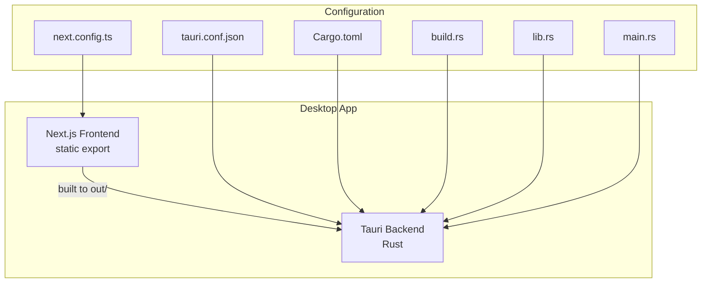
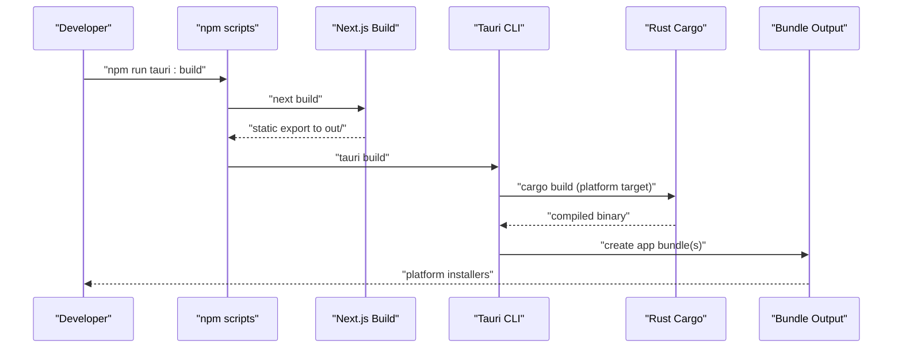
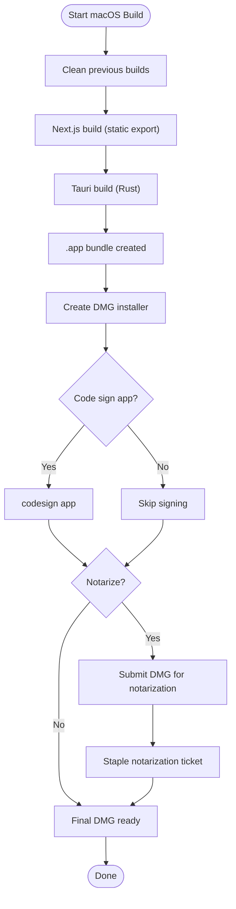
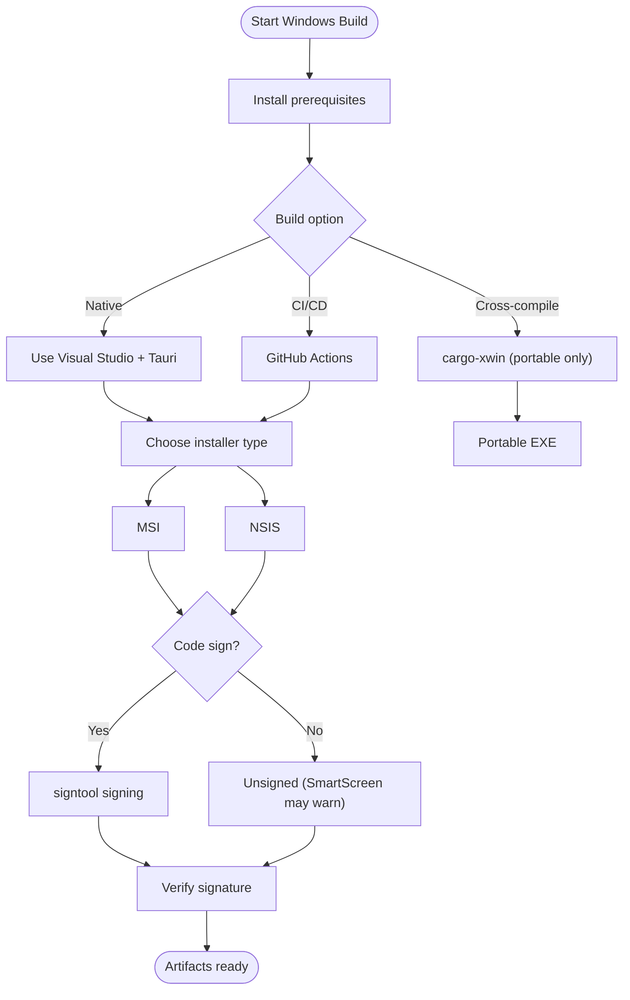
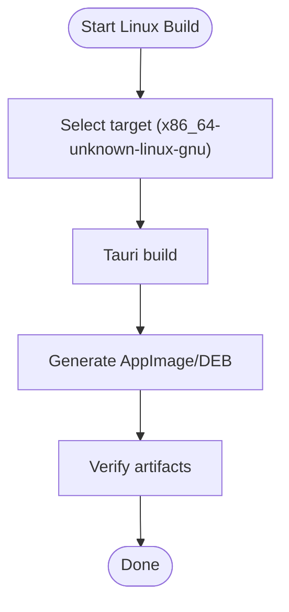
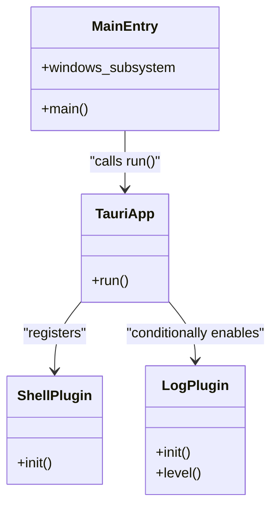
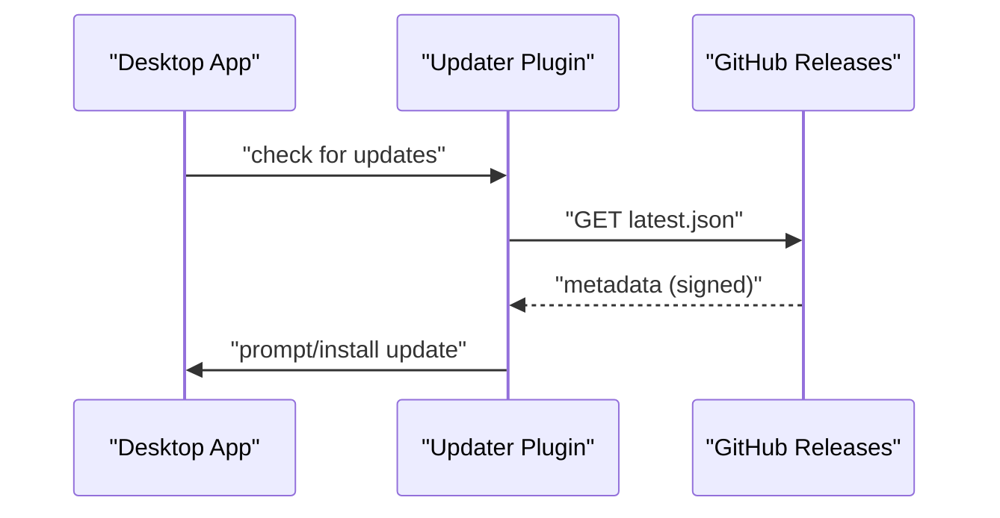
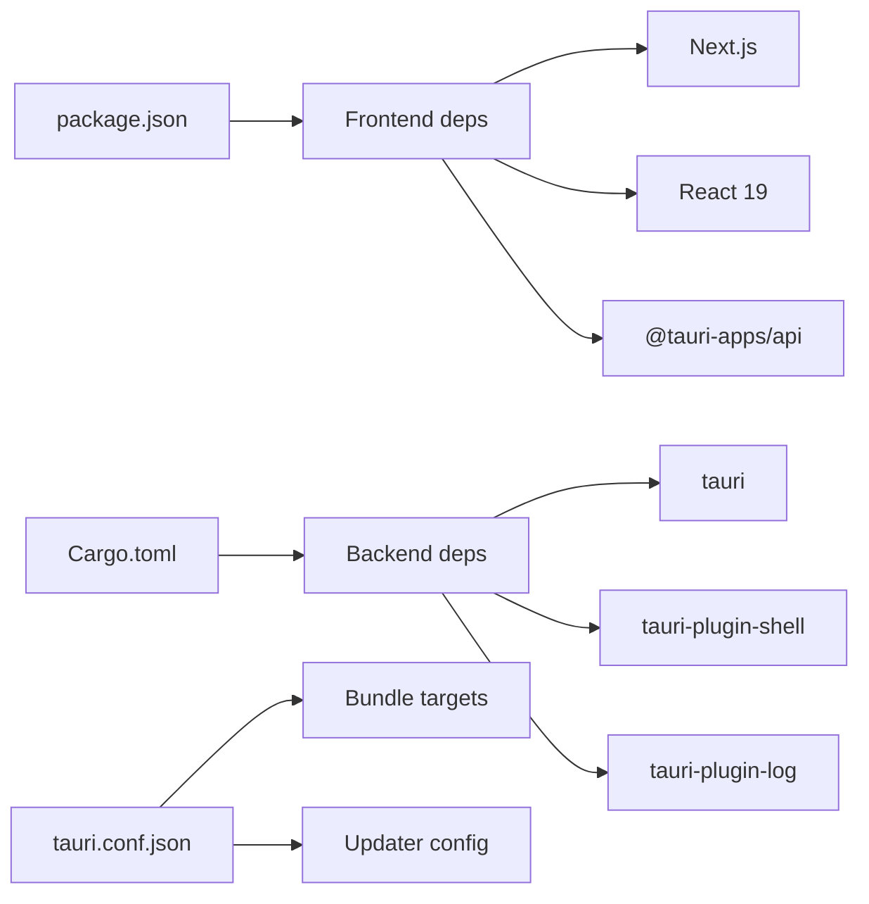

# Build and Deployment

<cite>
**Referenced Files in This Document**
- [package.json](file://desktop/package.json)
- [next.config.ts](file://desktop/next.config.ts)
- [tsconfig.json](file://desktop/tsconfig.json)
- [Cargo.toml](file://desktop/src-tauri/Cargo.toml)
- [tauri.conf.json](file://desktop/src-tauri/tauri.conf.json)
- [build.rs](file://desktop/src-tauri/build.rs)
- [main.rs](file://desktop/src-tauri/src/main.rs)
- [lib.rs](file://desktop/src-tauri/src/lib.rs)
- [desktop-app-build-guide.md](file://desktop/desktop-app-build-guide.md)
- [desktop-app-windows-build.md](file://desktop/desktop-app-windows-build.md)
</cite>

## Table of Contents
1. [Introduction](#introduction)
2. [Project Structure](#project-structure)
3. [Core Components](#core-components)
4. [Architecture Overview](#architecture-overview)
5. [Detailed Component Analysis](#detailed-component-analysis)
6. [Dependency Analysis](#dependency-analysis)
7. [Performance Considerations](#performance-considerations)
8. [Troubleshooting Guide](#troubleshooting-guide)
9. [Conclusion](#conclusion)
10. [Appendices](#appendices)

## Introduction
This document provides comprehensive build and deployment guidance for the Shannon desktop application. It covers prerequisites, dependency management, platform-specific configurations, the Tauri build system, code signing, distribution packaging, development workflow (hot reload, debugging, testing), deployment strategies, auto-update mechanisms, release management, troubleshooting, and production optimization techniques. The application is a Tauri-based desktop app wrapping a Next.js frontend, with Rust backend plugins.

## Project Structure
The desktop application is organized into two primary parts:
- Frontend: Next.js application configured for static export and React 19.
- Backend: Tauri application written in Rust, embedding the Next.js output and exposing native capabilities via plugins.

Key build-related files:
- Next.js configuration defines static export and image handling.
- Tauri configuration defines bundling targets, updater endpoint, and plugin setup.
- Rust crate defines dependencies and entry points.

**Diagram sources**
- [next.config.ts](file://desktop/next.config.ts#L1-L12)
- [tauri.conf.json](file://desktop/src-tauri/tauri.conf.json#L1-L53)
- [Cargo.toml](file://desktop/src-tauri/Cargo.toml#L1-L27)
- [build.rs](file://desktop/src-tauri/build.rs#L1-L4)
- [lib.rs](file://desktop/src-tauri/src/lib.rs#L1-L18)
- [main.rs](file://desktop/src-tauri/src/main.rs#L1-L7)

**Section sources**
- [next.config.ts](file://desktop/next.config.ts#L1-L12)
- [tsconfig.json](file://desktop/tsconfig.json#L1-L35)
- [tauri.conf.json](file://desktop/src-tauri/tauri.conf.json#L1-L53)
- [Cargo.toml](file://desktop/src-tauri/Cargo.toml#L1-L27)
- [build.rs](file://desktop/src-tauri/build.rs#L1-L4)
- [lib.rs](file://desktop/src-tauri/src/lib.rs#L1-L18)
- [main.rs](file://desktop/src-tauri/src/main.rs#L1-L7)

## Core Components
- Next.js build pipeline: Static export configuration and TypeScript compilation.
- Tauri build pipeline: Rust compilation, embedding of Next.js output, and platform-specific bundling.
- Updater plugin: Configured for GitHub releases endpoint with GPG public key.
- Plugins: Shell plugin for OS-level commands; log plugin enabled in debug builds.

Key build scripts and commands:
- Development: Next.js dev server launched by Tauri dev command.
- Production: Tauri build triggers Next.js build and Rust compilation.

**Section sources**
- [package.json](file://desktop/package.json#L1-L62)
- [next.config.ts](file://desktop/next.config.ts#L1-L12)
- [tauri.conf.json](file://desktop/src-tauri/tauri.conf.json#L6-L11)
- [Cargo.toml](file://desktop/src-tauri/Cargo.toml#L20-L27)
- [lib.rs](file://desktop/src-tauri/src/lib.rs#L4-L16)

## Architecture Overview
The build pipeline integrates Next.js and Tauri as follows:
- Next.js compiles TypeScript to JavaScript and exports static assets.
- Tauri embeds the exported assets and bundles platform-specific installers.
- The updater plugin fetches release metadata from a configured endpoint.

**Diagram sources**
- [package.json](file://desktop/package.json#L5-L12)
- [next.config.ts](file://desktop/next.config.ts#L3-L5)
- [tauri.conf.json](file://desktop/src-tauri/tauri.conf.json#L6-L11)
- [Cargo.toml](file://desktop/src-tauri/Cargo.toml#L1-L27)

## Detailed Component Analysis

### macOS Build and Distribution
- Prerequisites: Node.js, Rust, Xcode Command Line Tools, Tauri CLI.
- Build commands: Development and production builds via Tauri scripts.
- Output: .app bundle and DMG installer.
- Code signing and notarization: Optional but recommended for distribution outside the App Store.
- Auto-updates: Configured via the updater plugin with a GitHub releases endpoint and public key.

**Diagram sources**
- [desktop-app-build-guide.md](file://desktop/desktop-app-build-guide.md#L64-L79)
- [desktop-app-build-guide.md](file://desktop/desktop-app-build-guide.md#L336-L367)
- [tauri.conf.json](file://desktop/src-tauri/tauri.conf.json#L26-L51)

**Section sources**
- [desktop-app-build-guide.md](file://desktop/desktop-app-build-guide.md#L18-L36)
- [desktop-app-build-guide.md](file://desktop/desktop-app-build-guide.md#L53-L81)
- [desktop-app-build-guide.md](file://desktop/desktop-app-build-guide.md#L169-L214)
- [desktop-app-build-guide.md](file://desktop/desktop-app-build-guide.md#L336-L367)
- [tauri.conf.json](file://desktop/src-tauri/tauri.conf.json#L26-L51)

### Windows Build and Distribution
- Prerequisites: Windows 10/11, Node.js, Rust, Visual Studio Build Tools, WebView2 runtime.
- Build options: Native Windows build (MSI, NSIS, portable EXE), cross-compilation (portable EXE only), or CI/CD.
- Installer types: MSI (Windows Installer), NSIS (custom installer), portable EXE (no install).
- Code signing: Recommended to avoid SmartScreen warnings; supports automated signing via Tauri configuration.
- WebView2 bundling: Users can install runtime, bootstrapper can be downloaded, or runtime can be embedded.

**Diagram sources**
- [desktop-app-windows-build.md](file://desktop/desktop-app-windows-build.md#L39-L98)
- [desktop-app-windows-build.md](file://desktop/desktop-app-windows-build.md#L145-L216)
- [desktop-app-windows-build.md](file://desktop/desktop-app-windows-build.md#L299-L354)

**Section sources**
- [desktop-app-windows-build.md](file://desktop/desktop-app-windows-build.md#L20-L36)
- [desktop-app-windows-build.md](file://desktop/desktop-app-windows-build.md#L39-L104)
- [desktop-app-windows-build.md](file://desktop/desktop-app-windows-build.md#L145-L216)
- [desktop-app-windows-build.md](file://desktop/desktop-app-windows-build.md#L299-L354)

### Linux Build and Distribution
- Platform support: AppImage and DEB packages are referenced as supported distributions.
- Target selection: Use Tauri’s target flag for Linux builds.
- Prerequisites: Follow Tauri’s Linux prerequisites for your distribution.

**Diagram sources**
- [desktop/README.md](file://desktop/README.md#L159-L160)

**Section sources**
- [desktop/README.md](file://desktop/README.md#L41-L41)
- [desktop/README.md](file://desktop/README.md#L59-L59)
- [desktop/README.md](file://desktop/README.md#L148-L148)
- [desktop/README.md](file://desktop/README.md#L159-L160)

### Tauri Build System and Plugins
- Entry points: Rust main initializes the Tauri runtime and conditionally enables logging in debug builds.
- Plugins: Shell plugin is registered; log plugin is enabled in debug mode.
- Build integration: Tauri build invokes Rust compilation and embeds Next.js static export.

**Diagram sources**
- [lib.rs](file://desktop/src-tauri/src/lib.rs#L1-L18)
- [main.rs](file://desktop/src-tauri/src/main.rs#L1-L7)
- [Cargo.toml](file://desktop/src-tauri/Cargo.toml#L20-L27)

**Section sources**
- [lib.rs](file://desktop/src-tauri/src/lib.rs#L1-L18)
- [main.rs](file://desktop/src-tauri/src/main.rs#L1-L7)
- [Cargo.toml](file://desktop/src-tauri/Cargo.toml#L20-L27)

### Auto-Update Mechanism
- Updater plugin: Configured with a public key and a GitHub releases endpoint.
- Endpoint format: Expects a JSON file containing release metadata for the updater to parse.
- Distribution: Ensure the endpoint is reachable and the JSON is properly formatted.

**Diagram sources**
- [tauri.conf.json](file://desktop/src-tauri/tauri.conf.json#L44-L50)

**Section sources**
- [tauri.conf.json](file://desktop/src-tauri/tauri.conf.json#L44-L50)

## Dependency Analysis
- Frontend dependencies: Next.js, React 19, Radix UI, Tailwind CSS, Redux, and Tauri APIs.
- Backend dependencies: Tauri core, shell plugin, and logging plugin.
- Build-time dependencies: Tauri CLI, Rust toolchain, platform SDKs (Xcode on macOS, Visual Studio on Windows).

**Diagram sources**
- [package.json](file://desktop/package.json#L14-L60)
- [Cargo.toml](file://desktop/src-tauri/Cargo.toml#L20-L27)
- [tauri.conf.json](file://desktop/src-tauri/tauri.conf.json#L26-L51)

**Section sources**
- [package.json](file://desktop/package.json#L14-L60)
- [Cargo.toml](file://desktop/src-tauri/Cargo.toml#L20-L27)
- [tauri.conf.json](file://desktop/src-tauri/tauri.conf.json#L26-L51)

## Performance Considerations
- Static export: Next.js static export reduces runtime overhead and improves startup time.
- Minimize plugin surface: Keep only necessary plugins enabled to reduce binary size and attack surface.
- Platform-specific optimizations: Enable appropriate Rust release optimizations and strip debug symbols for production.
- Asset optimization: Ensure images and assets are optimized prior to export.

[No sources needed since this section provides general guidance]

## Troubleshooting Guide
Common build issues and resolutions:
- Missing Tauri shell plugin dependency in the frontend.
- TypeScript type mismatches in UI components.
- Stale build cache causing outdated behavior.
- Rust compilation failures requiring toolchain updates and cache cleaning.
- Windows-specific issues: missing MSVC, WebView2 runtime, NSIS/WiX toolsets.
- Signature and notarization problems on macOS and Windows.

Actions:
- Reinstall missing dependencies.
- Perform a full clean rebuild.
- Update Rust toolchain and clean caches.
- Install required Windows toolchains and runtimes.
- Verify signatures and notarization tickets.

**Section sources**
- [desktop-app-build-guide.md](file://desktop/desktop-app-build-guide.md#L84-L166)
- [desktop-app-windows-build.md](file://desktop/desktop-app-windows-build.md#L419-L474)

## Conclusion
The Shannon desktop application uses a streamlined build pipeline combining Next.js static export and Tauri bundling. By following platform-specific prerequisites, leveraging the provided scripts, configuring code signing and notarization, and utilizing the updater plugin, teams can reliably produce production-ready installers across macOS, Windows, and Linux. Adopting the troubleshooting steps and performance recommendations ensures smooth development and deployment workflows.

[No sources needed since this section summarizes without analyzing specific files]

## Appendices

### Development Workflow
- Hot reload: Tauri dev command launches the Next.js dev server and opens the app with live reload.
- Debugging: Use browser devtools for frontend; enable logging plugin in debug builds for backend logs.
- Testing: Validate functionality after each build; test on clean machines to simulate end-user environments.

**Section sources**
- [package.json](file://desktop/package.json#L5-L12)
- [lib.rs](file://desktop/src-tauri/src/lib.rs#L6-L12)

### Release Management
- Version alignment: Keep product version consistent across configuration files.
- Artifact verification: Generate and document checksums for installers.
- Distribution checklist: Test installers, verify signatures/notarization, and document system requirements.

**Section sources**
- [desktop-app-build-guide.md](file://desktop/desktop-app-build-guide.md#L169-L214)
- [desktop-app-windows-build.md](file://desktop/desktop-app-windows-build.md#L358-L394)