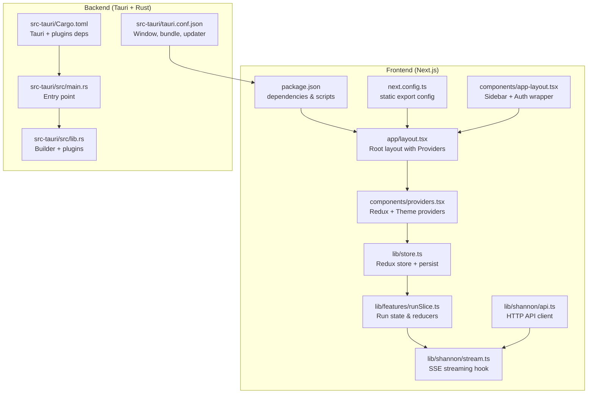
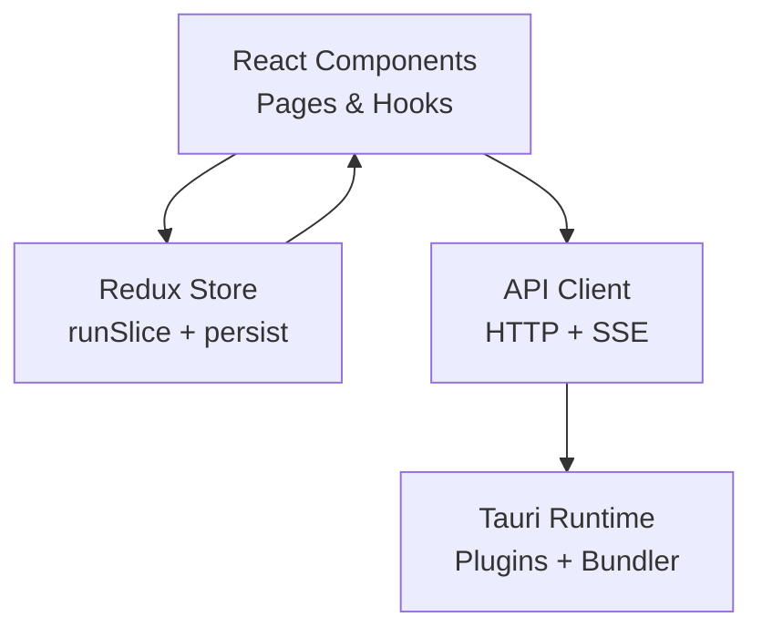
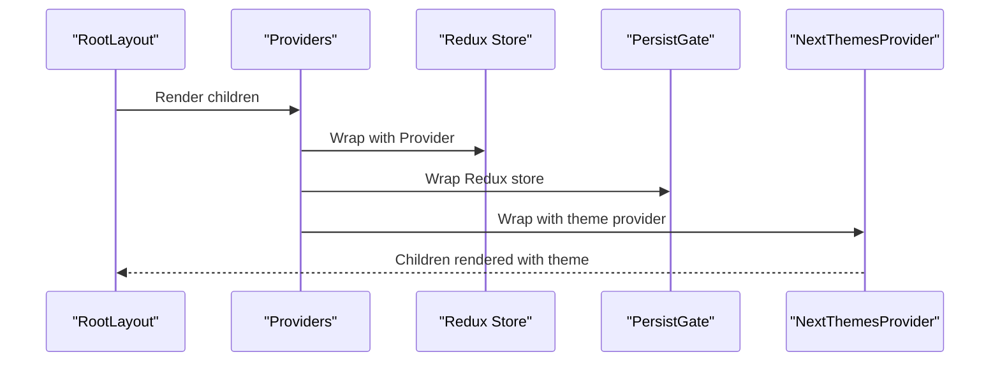
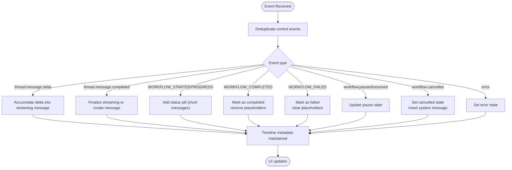
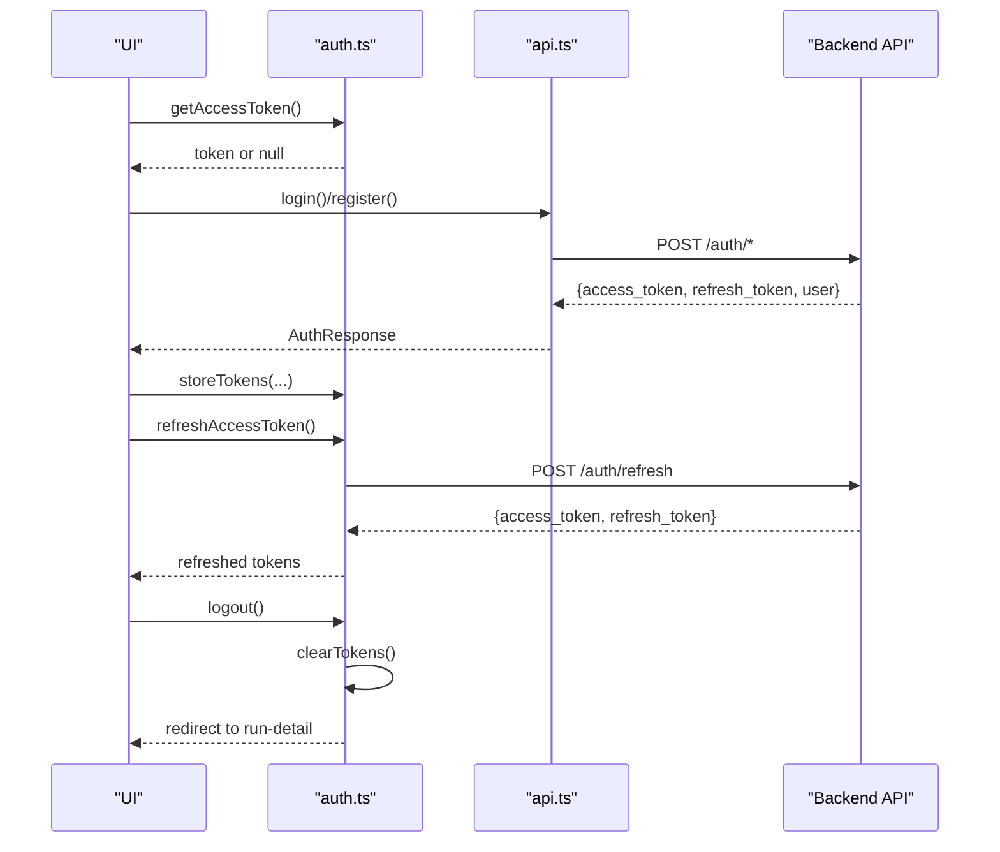
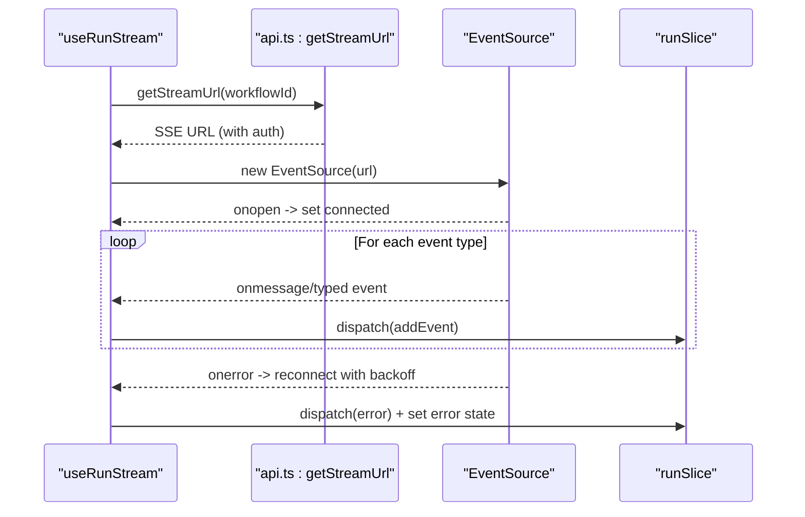
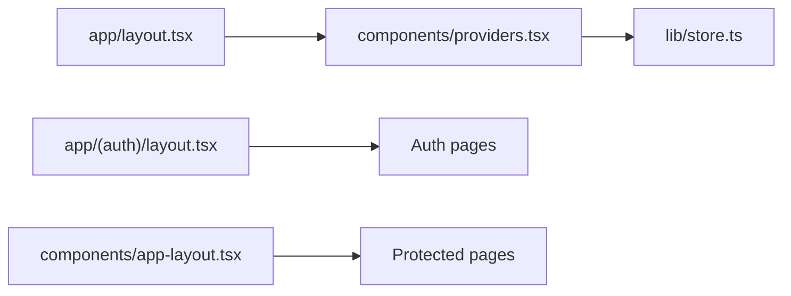
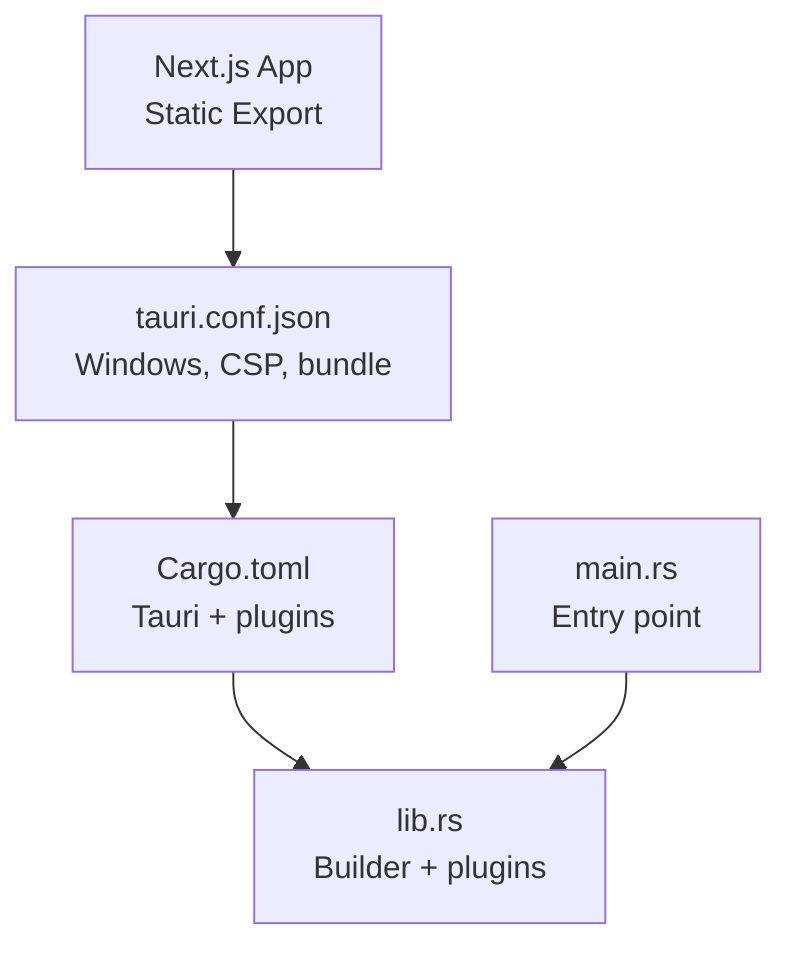
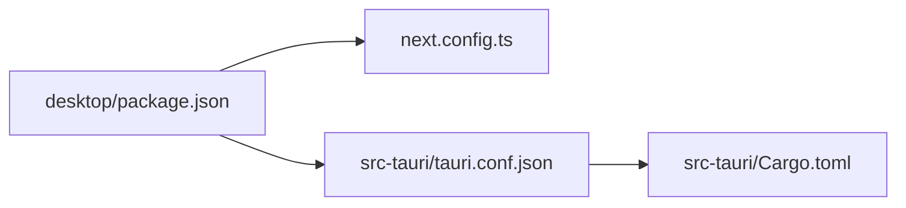

# Desktop Application Architecture

<cite>
**Referenced Files in This Document**
- [package.json](file://desktop/package.json)
- [next.config.ts](file://desktop/next.config.ts)
- [tauri.conf.json](file://desktop/src-tauri/tauri.conf.json)
- [Cargo.toml](file://desktop/src-tauri/Cargo.toml)
- [providers.tsx](file://desktop/components/providers.tsx)
- [store.ts](file://desktop/lib/store.ts)
- [auth.ts](file://desktop/lib/auth.ts)
- [layout.tsx](file://desktop/app/layout.tsx)
- [layout.tsx](file://desktop/app/(auth)/layout.tsx)
- [runSlice.ts](file://desktop/lib/features/runSlice.ts)
- [api.ts](file://desktop/lib/shannon/api.ts)
- [stream.ts](file://desktop/lib/shannon/stream.ts)
- [app-layout.tsx](file://desktop/components/app-layout.tsx)
- [main.rs](file://desktop/src-tauri/src/main.rs)
- [lib.rs](file://desktop/src-tauri/src/lib.rs)
</cite>

## Table of Contents
1. [Introduction](#introduction)
2. [Project Structure](#project-structure)
3. [Core Components](#core-components)
4. [Architecture Overview](#architecture-overview)
5. [Detailed Component Analysis](#detailed-component-analysis)
6. [Dependency Analysis](#dependency-analysis)
7. [Performance Considerations](#performance-considerations)
8. [Security Considerations](#security-considerations)
9. [Troubleshooting Guide](#troubleshooting-guide)
10. [Conclusion](#conclusion)

## Introduction
This document describes the desktop application architecture for Shannon, a Tauri-based cross-platform application that combines a Next.js React frontend with a Rust backend. The frontend is built as a static export for native bundling, while the backend integrates Tauri plugins for shell operations and logging. The application uses Redux Toolkit for state management, a custom provider system for theme and persistence, and a streaming API for real-time orchestration updates. Desktop-specific integration points include window configuration, updater plugin, and native OS features exposed via Tauri.

## Project Structure
The desktop application is organized into two primary parts:
- Frontend (Next.js + React): located under the desktop directory, configured for static export and Tauri bundling.
- Backend (Tauri + Rust): located under desktop/src-tauri, defining the Tauri runtime, plugins, and build configuration.

**Diagram sources**
- [package.json](file://desktop/package.json#L1-L62)
- [next.config.ts](file://desktop/next.config.ts#L1-L12)
- [layout.tsx](file://desktop/app/layout.tsx#L1-L70)
- [providers.tsx](file://desktop/components/providers.tsx#L1-L25)
- [store.ts](file://desktop/lib/store.ts#L1-L35)
- [runSlice.ts](file://desktop/lib/features/runSlice.ts#L1-L800)
- [api.ts](file://desktop/lib/shannon/api.ts#L1-L717)
- [stream.ts](file://desktop/lib/shannon/stream.ts#L1-L197)
- [app-layout.tsx](file://desktop/components/app-layout.tsx#L1-L26)
- [tauri.conf.json](file://desktop/src-tauri/tauri.conf.json#L1-L53)
- [Cargo.toml](file://desktop/src-tauri/Cargo.toml#L1-L27)
- [main.rs](file://desktop/src-tauri/src/main.rs#L1-L7)
- [lib.rs](file://desktop/src-tauri/src/lib.rs#L1-L18)

**Section sources**
- [package.json](file://desktop/package.json#L1-L62)
- [next.config.ts](file://desktop/next.config.ts#L1-L12)
- [tauri.conf.json](file://desktop/src-tauri/tauri.conf.json#L1-L53)
- [Cargo.toml](file://desktop/src-tauri/Cargo.toml#L1-L27)

## Core Components
- Provider system: Wraps the app with Redux store, persistence, and theme providers to deliver a consistent UI and state layer.
- Redux store: Centralized state powered by Redux Toolkit with persisted reducers for run-related state.
- Authentication utilities: Local storage-backed token management with refresh logic and logout handling.
- API client: Typed HTTP client for authentication, tasks, sessions, schedules, and streaming endpoints.
- Streaming hook: SSE-based hook that connects to the backend stream, dispatches events to Redux, and manages reconnection.
- Layout and navigation: App layout with sidebar, trigger, and authentication guard for protected routes.

**Section sources**
- [providers.tsx](file://desktop/components/providers.tsx#L1-L25)
- [store.ts](file://desktop/lib/store.ts#L1-L35)
- [auth.ts](file://desktop/lib/auth.ts#L1-L142)
- [api.ts](file://desktop/lib/shannon/api.ts#L1-L717)
- [stream.ts](file://desktop/lib/shannon/stream.ts#L1-L197)
- [app-layout.tsx](file://desktop/components/app-layout.tsx#L1-L26)

## Architecture Overview
The application follows a layered architecture:
- Presentation layer: Next.js pages and components render UI and manage user interactions.
- State layer: Redux slices encapsulate run state, messages, and control flags.
- Service layer: API module abstracts HTTP requests; streaming hook abstracts SSE connections.
- Platform layer: Tauri bridges the React app to native OS features and desktop packaging.

**Diagram sources**
- [layout.tsx](file://desktop/app/layout.tsx#L1-L70)
- [providers.tsx](file://desktop/components/providers.tsx#L1-L25)
- [store.ts](file://desktop/lib/store.ts#L1-L35)
- [runSlice.ts](file://desktop/lib/features/runSlice.ts#L1-L800)
- [api.ts](file://desktop/lib/shannon/api.ts#L1-L717)
- [stream.ts](file://desktop/lib/shannon/stream.ts#L1-L197)
- [tauri.conf.json](file://desktop/src-tauri/tauri.conf.json#L1-L53)

## Detailed Component Analysis

### Provider System and Theme Management
The provider stack initializes Redux, persistence, and theme providers at the root layout level. It ensures theme switching, hydration safety, and persisted state across sessions.

**Diagram sources**
- [layout.tsx](file://desktop/app/layout.tsx#L53-L69)
- [providers.tsx](file://desktop/components/providers.tsx#L9-L24)
- [store.ts](file://desktop/lib/store.ts#L21-L31)

**Section sources**
- [layout.tsx](file://desktop/app/layout.tsx#L1-L70)
- [providers.tsx](file://desktop/components/providers.tsx#L1-L25)
- [store.ts](file://desktop/lib/store.ts#L1-L35)

### Redux State Management (Run Slice)
The run slice manages orchestration events, messages, status, and control flags. It transforms backend events into UI-friendly messages, maintains session metadata, and supports pause/resume/cancel workflows.

**Diagram sources**
- [runSlice.ts](file://desktop/lib/features/runSlice.ts#L81-L800)

**Section sources**
- [runSlice.ts](file://desktop/lib/features/runSlice.ts#L1-L800)

### Authentication and Token Management
Authentication relies on local storage for tokens and user info, with a refresh mechanism and logout behavior. The API client selects appropriate auth headers based on available credentials.

**Diagram sources**
- [auth.ts](file://desktop/lib/auth.ts#L28-L141)
- [api.ts](file://desktop/lib/shannon/api.ts#L80-L154)

**Section sources**
- [auth.ts](file://desktop/lib/auth.ts#L1-L142)
- [api.ts](file://desktop/lib/shannon/api.ts#L1-L200)

### API Connectivity and Streaming
The API client centralizes HTTP calls and header selection. The streaming hook establishes SSE connections, parses events, tracks last event IDs for resuming, and reconnects with exponential backoff.

**Diagram sources**
- [stream.ts](file://desktop/lib/shannon/stream.ts#L30-L182)
- [api.ts](file://desktop/lib/shannon/api.ts#L237-L253)
- [runSlice.ts](file://desktop/lib/features/runSlice.ts#L81-L800)

**Section sources**
- [api.ts](file://desktop/lib/shannon/api.ts#L1-L717)
- [stream.ts](file://desktop/lib/shannon/stream.ts#L1-L197)
- [runSlice.ts](file://desktop/lib/features/runSlice.ts#L1-L800)

### Routing and Navigation
The application uses Next.js file-based routing with route groups for authentication. The root layout wraps all pages with providers, while the app layout provides a sidebar and authentication guard for protected areas.

**Diagram sources**
- [layout.tsx](file://desktop/app/layout.tsx#L1-L70)
- [layout.tsx](file://desktop/app/(auth)/layout.tsx#L1-L14)
- [app-layout.tsx](file://desktop/components/app-layout.tsx#L1-L26)
- [providers.tsx](file://desktop/components/providers.tsx#L1-L25)

**Section sources**
- [layout.tsx](file://desktop/app/layout.tsx#L1-L70)
- [layout.tsx](file://desktop/app/(auth)/layout.tsx#L1-L14)
- [app-layout.tsx](file://desktop/components/app-layout.tsx#L1-L26)

### Desktop Integration Points
Tauri integrates the React app into native desktop packaging and exposes plugins for shell operations and logging. The configuration defines window properties, bundling targets, and updater endpoints.

**Diagram sources**
- [tauri.conf.json](file://desktop/src-tauri/tauri.conf.json#L1-L53)
- [Cargo.toml](file://desktop/src-tauri/Cargo.toml#L1-L27)
- [lib.rs](file://desktop/src-tauri/src/lib.rs#L1-L18)
- [main.rs](file://desktop/src-tauri/src/main.rs#L1-L7)

**Section sources**
- [tauri.conf.json](file://desktop/src-tauri/tauri.conf.json#L1-L53)
- [Cargo.toml](file://desktop/src-tauri/Cargo.toml#L1-L27)
- [lib.rs](file://desktop/src-tauri/src/lib.rs#L1-L18)
- [main.rs](file://desktop/src-tauri/src/main.rs#L1-L7)

## Dependency Analysis
The frontend depends on Next.js, React, Redux Toolkit, and Tauri APIs. The backend depends on Tauri and its plugins. The API client depends on environment variables for base URLs and auth headers.

**Diagram sources**
- [package.json](file://desktop/package.json#L1-L62)
- [next.config.ts](file://desktop/next.config.ts#L1-L12)
- [tauri.conf.json](file://desktop/src-tauri/tauri.conf.json#L1-L53)
- [Cargo.toml](file://desktop/src-tauri/Cargo.toml#L1-L27)

**Section sources**
- [package.json](file://desktop/package.json#L1-L62)
- [next.config.ts](file://desktop/next.config.ts#L1-L12)
- [tauri.conf.json](file://desktop/src-tauri/tauri.conf.json#L1-L53)
- [Cargo.toml](file://desktop/src-tauri/Cargo.toml#L1-L27)

## Performance Considerations
- Static export: The Next.js configuration exports the app for efficient desktop bundling and reduced server overhead.
- Streaming efficiency: The SSE hook tracks last event IDs and reconnects with exponential backoff to minimize data duplication and improve resilience.
- State normalization: The run slice deduplicates control events and filters long status messages to reduce UI churn.
- Persistence: Redux Persist reduces reinitialization costs by restoring state on startup.

[No sources needed since this section provides general guidance]

## Security Considerations
- Authentication headers: The API client selects headers in order of preference (API key, Bearer token, X-User-Id for development), ensuring secure transport when available.
- Token storage: Tokens and user info are stored in local storage; refresh logic prevents concurrent refresh attempts.
- CSP: The Tauri configuration disables CSP for development flexibility; production builds should enforce strict policies.
- Updater: The updater plugin is configured with a public key and endpoint; ensure endpoints are trusted and TLS is enforced.

**Section sources**
- [api.ts](file://desktop/lib/shannon/api.ts#L13-L38)
- [auth.ts](file://desktop/lib/auth.ts#L85-L129)
- [tauri.conf.json](file://desktop/src-tauri/tauri.conf.json#L22-L24)
- [tauri.conf.json](file://desktop/src-tauri/tauri.conf.json#L44-L51)

## Troubleshooting Guide
- Streaming errors: The SSE hook dispatches an error event and sets the connection state to error; check network connectivity and backend endpoints.
- Reconnection: Exponential backoff is applied; verify backend event IDs and ensure last-event-id tracking is intact.
- Authentication failures: Confirm token availability and refresh endpoint; clear tokens on 401/invalid refresh to avoid stale state.
- Theme and hydration: Use the theme provider attributes and hydration suppression to prevent mismatched themes on initial render.

**Section sources**
- [stream.ts](file://desktop/lib/shannon/stream.ts#L156-L181)
- [runSlice.ts](file://desktop/lib/features/runSlice.ts#L295-L302)
- [auth.ts](file://desktop/lib/auth.ts#L100-L129)
- [layout.tsx](file://desktop/app/layout.tsx#L59-L69)

## Conclusion
Shannon’s desktop application leverages Tauri to combine a modern React/Next.js frontend with a robust Rust backend. The provider stack, Redux state management, and SSE streaming form a cohesive data flow, while Tauri enables native packaging and OS integration. By following the outlined patterns and considerations, developers can extend functionality, maintain security, and optimize performance for cross-platform deployment.