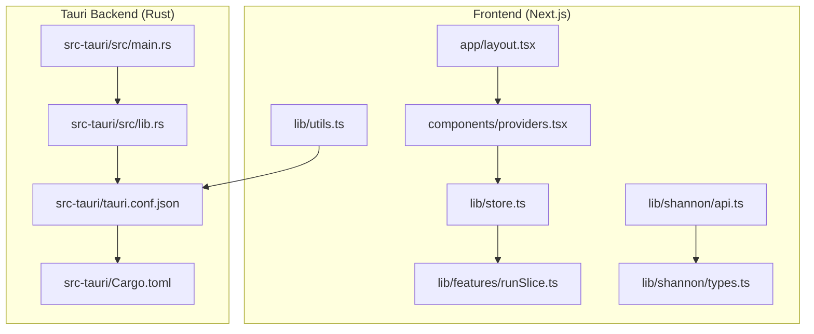
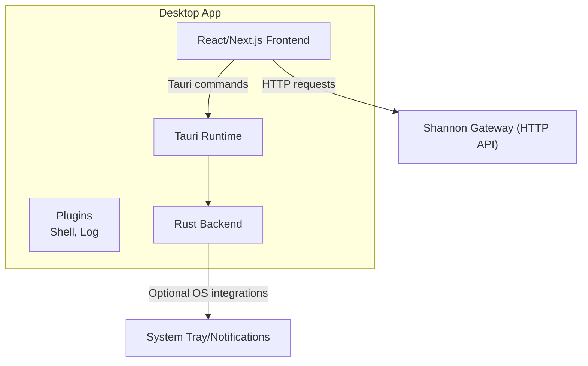
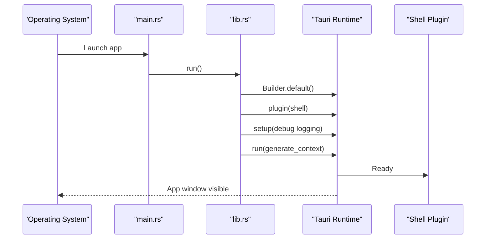
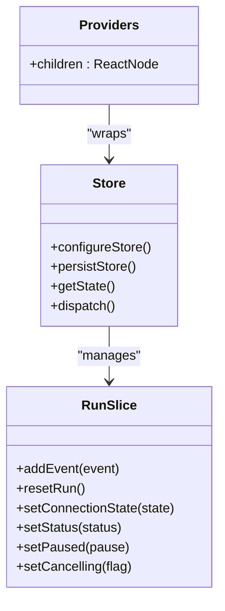
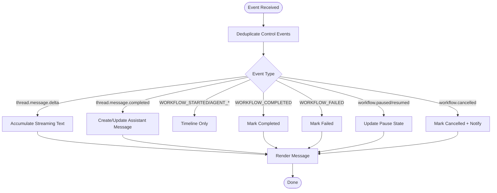
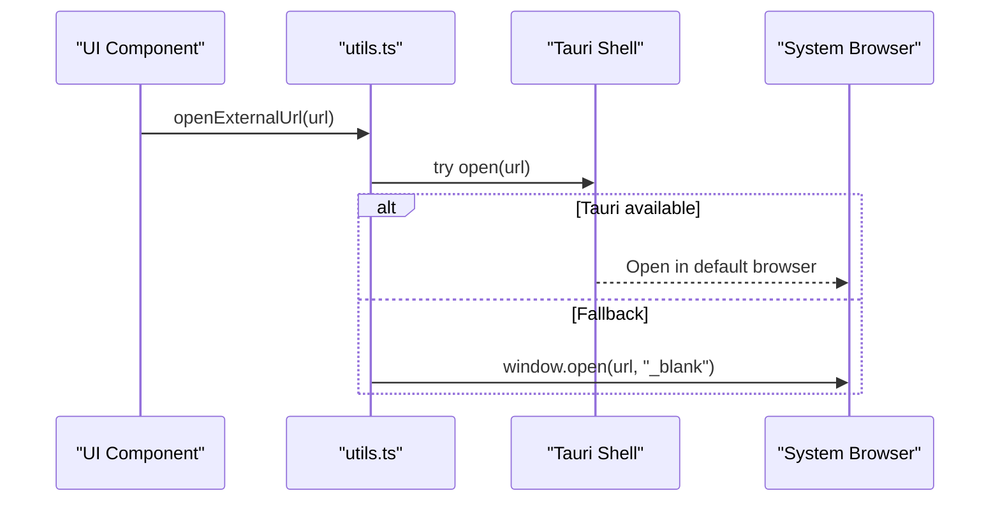
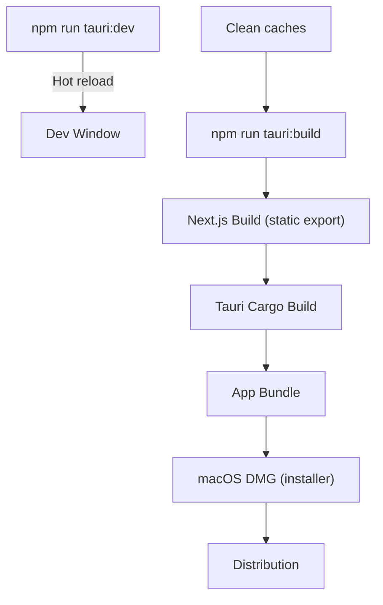
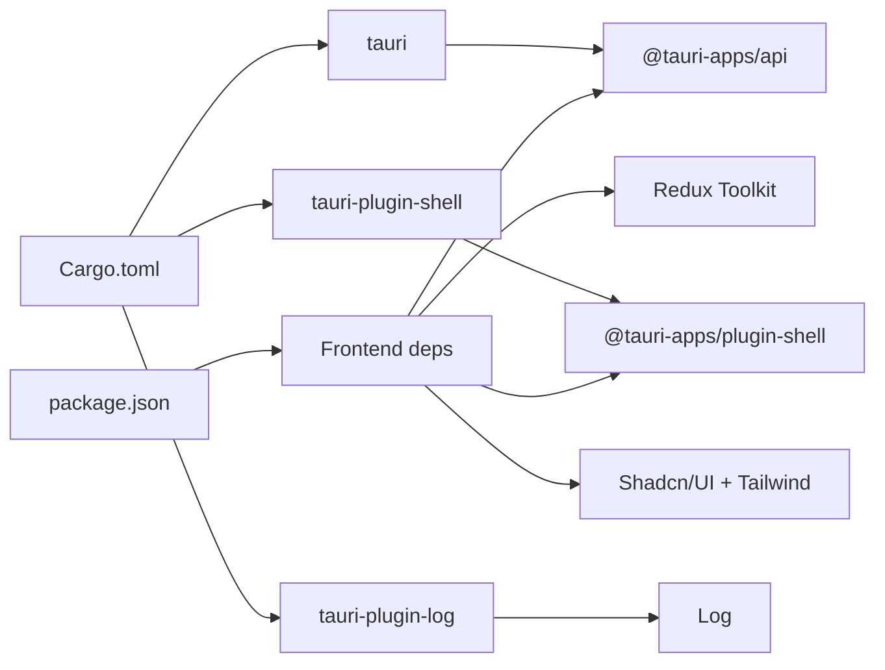

# Desktop Application

<cite>
**Referenced Files in This Document**
- [package.json](file://desktop/package.json)
- [tauri.conf.json](file://desktop/src-tauri/tauri.conf.json)
- [Cargo.toml](file://desktop/src-tauri/Cargo.toml)
- [main.rs](file://desktop/src-tauri/src/main.rs)
- [lib.rs](file://desktop/src-tauri/src/lib.rs)
- [next.config.ts](file://desktop/next.config.ts)
- [desktop-app-build-guide.md](file://desktop/desktop-app-build-guide.md)
- [layout.tsx](file://desktop/app/layout.tsx)
- [providers.tsx](file://desktop/components/providers.tsx)
- [store.ts](file://desktop/lib/store.ts)
- [runSlice.ts](file://desktop/lib/features/runSlice.ts)
- [api.ts](file://desktop/lib/shannon/api.ts)
- [types.ts](file://desktop/lib/shannon/types.ts)
- [utils.ts](file://desktop/lib/utils.ts)
</cite>

## Table of Contents
1. [Introduction](#introduction)
2. [Project Structure](#project-structure)
3. [Core Components](#core-components)
4. [Architecture Overview](#architecture-overview)
5. [Detailed Component Analysis](#detailed-component-analysis)
6. [Dependency Analysis](#dependency-analysis)
7. [Performance Considerations](#performance-considerations)
8. [Troubleshooting Guide](#troubleshooting-guide)
9. [Conclusion](#conclusion)
10. [Appendices](#appendices)

## Introduction
This document describes the Shannon desktop application, a Tauri-based cross-platform native client featuring a React frontend and a Rust backend. It covers the desktop architecture, build and distribution process for macOS, Windows, and Linux, and details desktop-specific capabilities such as system tray integration, offline task history, and native notifications. It also documents the desktop API surface, file system access, local database usage with Dexie.js, deployment and auto-update mechanisms, and platform-specific considerations for security and performance.

## Project Structure
The desktop application is organized into two primary parts:
- React/Next.js frontend under the desktop directory
- Tauri Rust backend under desktop/src-tauri

Key areas:
- Frontend pages and components under desktop/app and desktop/components
- State management and features under desktop/lib
- Tauri configuration and Rust entry points under desktop/src-tauri
- Build configuration and scripts under desktop

**Diagram sources**
- [layout.tsx](file://desktop/app/layout.tsx#L1-L70)
- [providers.tsx](file://desktop/components/providers.tsx#L1-L25)
- [store.ts](file://desktop/lib/store.ts#L1-L35)
- [runSlice.ts](file://desktop/lib/features/runSlice.ts#L1-L812)
- [api.ts](file://desktop/lib/shannon/api.ts#L1-L717)
- [types.ts](file://desktop/lib/shannon/types.ts#L1-L304)
- [utils.ts](file://desktop/lib/utils.ts#L1-L29)
- [main.rs](file://desktop/src-tauri/src/main.rs#L1-L7)
- [lib.rs](file://desktop/src-tauri/src/lib.rs#L1-L18)
- [tauri.conf.json](file://desktop/src-tauri/tauri.conf.json#L1-L53)
- [Cargo.toml](file://desktop/src-tauri/Cargo.toml#L1-L27)

**Section sources**
- [package.json](file://desktop/package.json#L1-L62)
- [next.config.ts](file://desktop/next.config.ts#L1-L12)
- [tauri.conf.json](file://desktop/src-tauri/tauri.conf.json#L1-L53)
- [Cargo.toml](file://desktop/src-tauri/Cargo.toml#L1-L27)

## Core Components
- Tauri runtime and plugins: Initializes the desktop shell and logging plugins and sets up the application lifecycle.
- React/Next.js frontend: Provides the UI, routing, theming, and state management.
- Redux store with persisted state: Manages run state, messages, and control flags for task execution.
- Event-driven run slice: Transforms backend streaming events into UI messages and status updates.
- API module: Encapsulates authentication, task/session/event endpoints, and streaming URLs.
- Utilities: Cross-platform URL opening and UI helpers.

**Section sources**
- [lib.rs](file://desktop/src-tauri/src/lib.rs#L1-L18)
- [providers.tsx](file://desktop/components/providers.tsx#L1-L25)
- [store.ts](file://desktop/lib/store.ts#L1-L35)
- [runSlice.ts](file://desktop/lib/features/runSlice.ts#L1-L812)
- [api.ts](file://desktop/lib/shannon/api.ts#L1-L717)
- [utils.ts](file://desktop/lib/utils.ts#L1-L29)

## Architecture Overview
The desktop app combines a React SPA built with Next.js and bundled statically with Tauri. The Rust backend initializes Tauri, registers plugins (shell and log), and embeds the frontend assets into the app bundle. The frontend communicates with the backend via Tauri commands and with the Shannon gateway via HTTP APIs.

**Diagram sources**
- [tauri.conf.json](file://desktop/src-tauri/tauri.conf.json#L1-L53)
- [lib.rs](file://desktop/src-tauri/src/lib.rs#L1-L18)
- [api.ts](file://desktop/lib/shannon/api.ts#L1-L717)

## Detailed Component Analysis

### Tauri Backend
The Rust backend defines the desktop entry point and initializes Tauri with plugins. It conditionally enables logging in debug builds and registers the shell plugin for system interactions.

**Diagram sources**
- [main.rs](file://desktop/src-tauri/src/main.rs#L1-L7)
- [lib.rs](file://desktop/src-tauri/src/lib.rs#L1-L18)

**Section sources**
- [main.rs](file://desktop/src-tauri/src/main.rs#L1-L7)
- [lib.rs](file://desktop/src-tauri/src/lib.rs#L1-L18)
- [Cargo.toml](file://desktop/src-tauri/Cargo.toml#L1-L27)

### Frontend Providers and State
The Providers component wires Redux with persistence and theme support. The Redux store composes reducers and applies middleware to handle asynchronous flows and persisted state.

**Diagram sources**
- [providers.tsx](file://desktop/components/providers.tsx#L1-L25)
- [store.ts](file://desktop/lib/store.ts#L1-L35)
- [runSlice.ts](file://desktop/lib/features/runSlice.ts#L1-L812)

**Section sources**
- [providers.tsx](file://desktop/components/providers.tsx#L1-L25)
- [store.ts](file://desktop/lib/store.ts#L1-L35)
- [runSlice.ts](file://desktop/lib/features/runSlice.ts#L1-L812)

### Event Streaming and UI Updates
The run slice transforms backend streaming events into UI messages and status indicators. It deduplicates control events, manages pause/resume/cancel states, and ensures only appropriate content appears in the conversation view.

**Diagram sources**
- [runSlice.ts](file://desktop/lib/features/runSlice.ts#L1-L812)
- [types.ts](file://desktop/lib/shannon/types.ts#L1-L304)

**Section sources**
- [runSlice.ts](file://desktop/lib/features/runSlice.ts#L1-L812)
- [types.ts](file://desktop/lib/shannon/types.ts#L1-L304)

### Desktop-Specific APIs and Utilities
- URL opening: Uses Tauri shell when available, falls back to window.open for web contexts.
- External links: Ensures safe opening via system browser.

**Diagram sources**
- [utils.ts](file://desktop/lib/utils.ts#L1-L29)

**Section sources**
- [utils.ts](file://desktop/lib/utils.ts#L1-L29)

### Build and Distribution
The desktop app uses Next.js for frontend bundling and Tauri for packaging into native installers. The build pipeline produces platform-specific bundles and DMGs for macOS.

**Diagram sources**
- [desktop-app-build-guide.md](file://desktop/desktop-app-build-guide.md#L53-L81)
- [next.config.ts](file://desktop/next.config.ts#L1-L12)
- [tauri.conf.json](file://desktop/src-tauri/tauri.conf.json#L1-L53)

**Section sources**
- [desktop-app-build-guide.md](file://desktop/desktop-app-build-guide.md#L53-L81)
- [next.config.ts](file://desktop/next.config.ts#L1-L12)
- [tauri.conf.json](file://desktop/src-tauri/tauri.conf.json#L1-L53)

## Dependency Analysis
- Frontend dependencies include React, Next.js, Redux, Radix UI, Tailwind, and Tauri APIs.
- Tauri dependencies include tauri, tauri-plugin-shell, and tauri-plugin-log.
- The frontend relies on the backend for system interactions (shell) and on the gateway for data.

**Diagram sources**
- [package.json](file://desktop/package.json#L1-L62)
- [Cargo.toml](file://desktop/src-tauri/Cargo.toml#L1-L27)

**Section sources**
- [package.json](file://desktop/package.json#L1-L62)
- [Cargo.toml](file://desktop/src-tauri/Cargo.toml#L1-L27)

## Performance Considerations
- Static export: Next.js static export reduces runtime overhead and improves startup time.
- Streaming rendering: The run slice efficiently accumulates deltas and updates only affected UI nodes.
- Persistence: Redux persistence avoids repeated network fetches for UI state.
- Plugin logging: Conditional logging in debug builds helps diagnose performance issues without impacting release builds.

[No sources needed since this section provides general guidance]

## Troubleshooting Guide
Common issues and resolutions:
- Missing shell plugin: Install @tauri-apps/plugin-shell and rebuild.
- TypeScript type mismatches: Align frontend event types with backend definitions.
- Stale builds: Clean Next.js, output, and Tauri target directories before rebuilding.
- Rust compilation failures: Update Rust toolchain and clean cargo cache.

**Section sources**
- [desktop-app-build-guide.md](file://desktop/desktop-app-build-guide.md#L84-L166)

## Conclusion
The Shannon desktop application leverages Tauri to deliver a native-feeling React/Next.js experience with robust system integration. Its architecture supports offline-friendly UI state, efficient event streaming, and straightforward distribution across platforms. The included build and distribution guide, combined with the modular frontend and backend, provides a solid foundation for customization and extension.

[No sources needed since this section summarizes without analyzing specific files]

## Appendices

### Desktop Features and Capabilities
- System tray integration: Available via Tauri shell and window controls; configure in tauri.conf.json.
- Offline task history: Managed by Redux persistence; UI renders historical sessions and tasks.
- Native notifications: Accessible through Tauri shell APIs; integrate with run state transitions.
- File system access: Through Tauri shell commands; define capabilities in tauri.conf.json.
- Local database: Dexie.js is present in dependencies; integrate for structured offline data.

**Section sources**
- [tauri.conf.json](file://desktop/src-tauri/tauri.conf.json#L1-L53)
- [store.ts](file://desktop/lib/store.ts#L1-L35)
- [package.json](file://desktop/package.json#L1-L62)

### Desktop API Surface
- Authentication: API key, JWT bearer, or user ID header selection.
- Task/session/event endpoints: Submit tasks, list sessions, fetch events, control tasks.
- Streaming: SSE URL construction with API key/token fallback.
- Schedules: List, create, update, pause/resume, and delete scheduled tasks.

**Section sources**
- [api.ts](file://desktop/lib/shannon/api.ts#L1-L717)
- [types.ts](file://desktop/lib/shannon/types.ts#L1-L304)

### Build and Deployment
- macOS DMG: Static export + Tauri bundle produces a DMG installer.
- CI/CD: GitHub Actions example demonstrates automated builds and checksum generation.
- Security hardening: Code signing and notarization recommended for distribution.

**Section sources**
- [desktop-app-build-guide.md](file://desktop/desktop-app-build-guide.md#L169-L443)

### Platform-Specific Considerations
- macOS: Minimum system version configured; DMG packaging; Gatekeeper prompts on first launch.
- Windows/Linux: Tauri targets “all” in configuration; adjust bundle settings per platform.

**Section sources**
- [tauri.conf.json](file://desktop/src-tauri/tauri.conf.json#L26-L43)

### Auto-Update Mechanism
- Updater plugin configured with public key and release endpoint; integrates with Tauri’s updater.

**Section sources**
- [tauri.conf.json](file://desktop/src-tauri/tauri.conf.json#L44-L51)