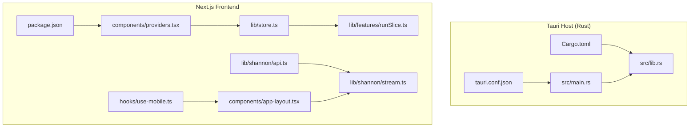
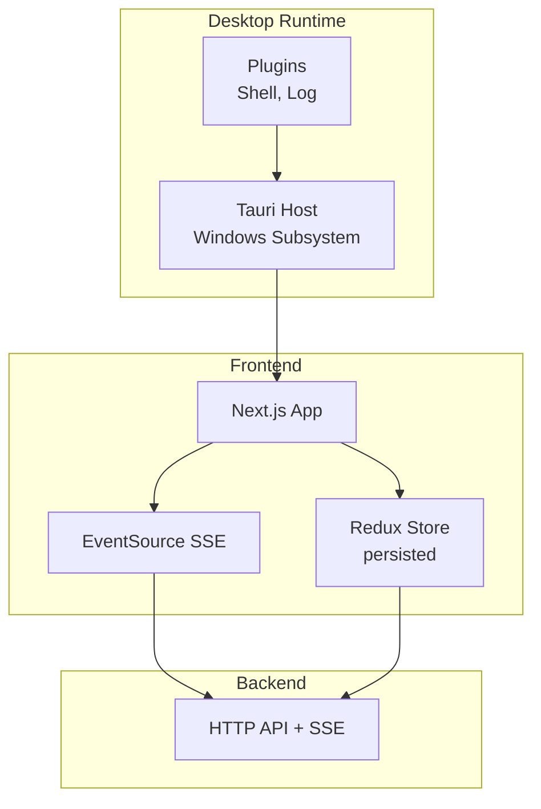
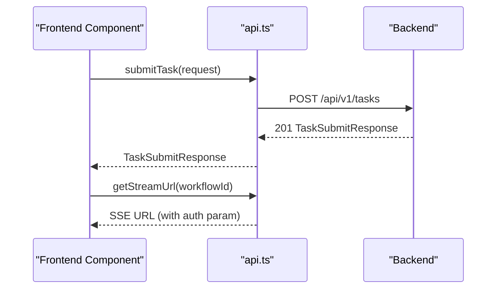
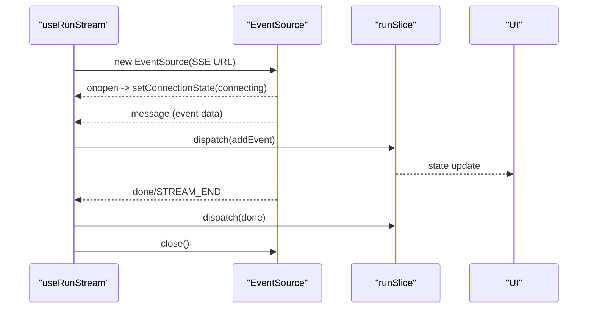
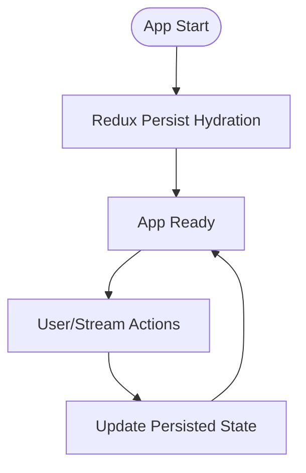
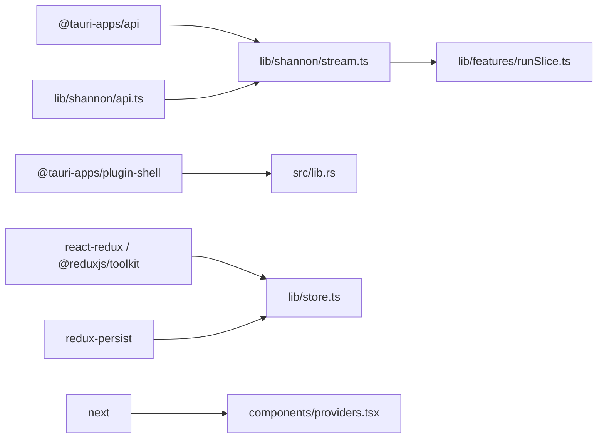

# Desktop-Specific Features

<cite>
**Referenced Files in This Document**
- [tauri.conf.json](file://desktop/src-tauri/tauri.conf.json)
- [Cargo.toml](file://desktop/src-tauri/Cargo.toml)
- [main.rs](file://desktop/src-tauri/src/main.rs)
- [lib.rs](file://desktop/src-tauri/src/lib.rs)
- [package.json](file://desktop/package.json)
- [api.ts](file://desktop/lib/shannon/api.ts)
- [stream.ts](file://desktop/lib/shannon/stream.ts)
- [store.ts](file://desktop/lib/store.ts)
- [providers.tsx](file://desktop/components/providers.tsx)
- [app-layout.tsx](file://desktop/components/app-layout.tsx)
- [use-mobile.ts](file://desktop/hooks/use-mobile.ts)
- [runSlice.ts](file://desktop/lib/features/runSlice.ts)
- [radar-store.ts](file://desktop/lib/radar/store.ts)
</cite>

## Table of Contents
1. [Introduction](#introduction)
2. [Project Structure](#project-structure)
3. [Core Components](#core-components)
4. [Architecture Overview](#architecture-overview)
5. [Detailed Component Analysis](#detailed-component-analysis)
6. [Dependency Analysis](#dependency-analysis)
7. [Performance Considerations](#performance-considerations)
8. [Troubleshooting Guide](#troubleshooting-guide)
9. [Conclusion](#conclusion)

## Introduction
This document explains the desktop application’s specific features and capabilities built on Tauri + Next.js. It focuses on system tray integration, native notifications, offline functionality, the local API client, WebSocket/SSE streaming for real-time updates, and data persistence strategies. It also covers mobile responsiveness, touch interactions, platform-specific optimizations, practical desktop API usage examples, event handling, backend integration, performance optimization, memory management, resource utilization, and security/sandboxing considerations.

## Project Structure
The desktop application is organized into:
- Tauri Rust application (native host) under desktop/src-tauri
- Next.js frontend under desktop/app and supporting libraries under desktop/lib
- UI components and hooks under desktop/components and desktop/hooks
- Build and runtime configuration under desktop/package.json and desktop/src-tauri/tauri.conf.json

**Diagram sources**
- [tauri.conf.json](file://desktop/src-tauri/tauri.conf.json#L1-L53)
- [Cargo.toml](file://desktop/src-tauri/Cargo.toml#L1-L27)
- [main.rs](file://desktop/src-tauri/src/main.rs#L1-L7)
- [lib.rs](file://desktop/src-tauri/src/lib.rs#L1-L18)
- [package.json](file://desktop/package.json#L1-L62)
- [providers.tsx](file://desktop/components/providers.tsx#L1-L25)
- [store.ts](file://desktop/lib/store.ts#L1-L35)
- [runSlice.ts](file://desktop/lib/features/runSlice.ts)
- [api.ts](file://desktop/lib/shannon/api.ts#L1-L717)
- [stream.ts](file://desktop/lib/shannon/stream.ts#L1-L197)
- [app-layout.tsx](file://desktop/components/app-layout.tsx#L1-L26)
- [use-mobile.ts](file://desktop/hooks/use-mobile.ts#L1-L20)

**Section sources**
- [tauri.conf.json](file://desktop/src-tauri/tauri.conf.json#L1-L53)
- [Cargo.toml](file://desktop/src-tauri/Cargo.toml#L1-L27)
- [package.json](file://desktop/package.json#L1-L62)

## Core Components
- Local API client: Implements authentication header selection, task/session/event APIs, and streaming URL construction for SSE.
- Streaming subsystem: Uses EventSource to receive real-time events and dispatches Redux actions for UI updates.
- Data persistence: Redux persisted root store with redux-persist for offline-friendly state.
- Providers: Wraps the app with Redux, persistence, and theme provider.
- Layout and responsive hooks: Provides sidebar layout and mobile breakpoint detection.

**Section sources**
- [api.ts](file://desktop/lib/shannon/api.ts#L1-L717)
- [stream.ts](file://desktop/lib/shannon/stream.ts#L1-L197)
- [store.ts](file://desktop/lib/store.ts#L1-L35)
- [providers.tsx](file://desktop/components/providers.tsx#L1-L25)
- [app-layout.tsx](file://desktop/components/app-layout.tsx#L1-L26)
- [use-mobile.ts](file://desktop/hooks/use-mobile.ts#L1-L20)

## Architecture Overview
The desktop app runs as a Tauri application hosting a Next.js SPA. The frontend communicates with the backend via HTTP and SSE. The Rust side initializes plugins and can expose Tauri commands for system tray and notifications.

**Diagram sources**
- [main.rs](file://desktop/src-tauri/src/main.rs#L1-L7)
- [lib.rs](file://desktop/src-tauri/src/lib.rs#L1-L18)
- [package.json](file://desktop/package.json#L14-L46)
- [api.ts](file://desktop/lib/shannon/api.ts#L1-L717)
- [stream.ts](file://desktop/lib/shannon/stream.ts#L1-L197)

## Detailed Component Analysis

### System Tray Integration
- Current state: The Tauri configuration and Rust initialization show no explicit tray icon or menu registration. The shell plugin is loaded, enabling file and process operations but not tray APIs.
- Recommended approach: Use Tauri v2 tray APIs to add a tray icon, context menu, and lifecycle controls. Bind menu actions to Tauri commands for minimizing/restoring the window or invoking backend tasks.
- Security note: Keep tray operations minimal and delegate heavy work to backend services.

**Section sources**
- [tauri.conf.json](file://desktop/src-tauri/tauri.conf.json#L1-L53)
- [lib.rs](file://desktop/src-tauri/src/lib.rs#L1-L18)
- [Cargo.toml](file://desktop/src-tauri/Cargo.toml#L20-L27)

### Native Notifications
- Current state: No explicit notification plugin is declared in the Tauri configuration or Rust initialization.
- Recommended approach: Add a notification plugin to the Tauri builder and expose a Tauri command to trigger native OS notifications. Use the frontend to request permission and display notifications based on SSE events.
- UX note: Batch or throttle notifications to avoid user fatigue.

**Section sources**
- [tauri.conf.json](file://desktop/src-tauri/tauri.conf.json#L1-L53)
- [lib.rs](file://desktop/src-tauri/src/lib.rs#L1-L18)
- [Cargo.toml](file://desktop/src-tauri/Cargo.toml#L20-L27)

### Offline Functionality
- Persistence strategy: The Redux store is persisted using redux-persist with localStorage by default. This allows the UI to remain functional when offline and rehydrate state on reload.
- Limitations: Persistent state does not replace backend synchronization. Long-running tasks and streaming require connectivity.
- Recommendations: 
  - Persist only UI state and recent sessions/tasks; keep mutable runtime state in-memory.
  - Implement optimistic updates with conflict resolution upon reconnection.
  - Use background sync to reconcile offline changes with backend.

**Section sources**
- [store.ts](file://desktop/lib/store.ts#L1-L35)
- [providers.tsx](file://desktop/components/providers.tsx#L1-L25)

### Local API Client Implementation
- Authentication headers: The client selects between API key, Bearer token, and X-User-Id depending on availability.
- Endpoints: Supports authentication, task submission, retrieval, listing, session queries, event streams, and scheduling operations.
- Streaming URL: Constructs SSE URLs with API key or token fallback for EventSource compatibility.
- Error handling: Throws descriptive errors on HTTP failures; callers should surface messages to users.

**Diagram sources**
- [api.ts](file://desktop/lib/shannon/api.ts#L177-L253)

**Section sources**
- [api.ts](file://desktop/lib/shannon/api.ts#L1-L717)

### WebSocket/SSE Streaming for Real-Time Updates
- EventSource-based streaming: The hook connects to SSE endpoints and listens for a wide range of event types emitted by the backend.
- Reconnection logic: Exponential backoff up to a maximum delay; tracks last event ID for resuming streams.
- Redux integration: Parses events, enriches with timestamps, and dispatches to the run slice for UI updates.
- Cleanup: Properly closes connections and clears timeouts on unmount.

**Diagram sources**
- [stream.ts](file://desktop/lib/shannon/stream.ts#L1-L197)
- [runSlice.ts](file://desktop/lib/features/runSlice.ts)

**Section sources**
- [stream.ts](file://desktop/lib/shannon/stream.ts#L1-L197)

### Data Persistence Strategies
- Root store: Configured with a persisted reducer keyed at "root".
- Ignored actions: Serializability checks ignore persistence lifecycle actions.
- Scope: Currently persists run-related state; extend cautiously to avoid bloating local storage.

**Diagram sources**
- [store.ts](file://desktop/lib/store.ts#L14-L29)

**Section sources**
- [store.ts](file://desktop/lib/store.ts#L1-L35)

### Mobile Responsiveness and Touch Interactions
- Breakpoint: A media-query-based hook detects mobile width below 768px.
- UI adaptation: The layout uses a sidebar with a trigger, enabling compact navigation on small screens.
- Touch interactions: Next.js and Radix UI components provide accessible touch targets; ensure adequate spacing and contrast for mobile.

**Section sources**
- [use-mobile.ts](file://desktop/hooks/use-mobile.ts#L1-L20)
- [app-layout.tsx](file://desktop/components/app-layout.tsx#L1-L26)

### Platform-Specific Optimizations
- Windows subsystem: The Windows subsystem is configured to prevent extra console windows in release builds.
- Bundling: Tauri configuration defines product metadata, icons, and bundle targets for cross-platform distribution.
- Logging: Debug builds initialize a logging plugin; release builds omit verbose logs.

**Section sources**
- [main.rs](file://desktop/src-tauri/src/main.rs#L1-L7)
- [tauri.conf.json](file://desktop/src-tauri/tauri.conf.json#L1-L53)
- [lib.rs](file://desktop/src-tauri/src/lib.rs#L1-L18)

### Practical Examples: Desktop API Usage and Event Handling
- Authentication flow:
  - Register and login using the API client; store tokens and API keys in secure storage.
  - Use getAuthHeaders to automatically attach credentials to requests.
- Task lifecycle:
  - Submit a task, capture workflow_id, and start streaming events via useRunStream.
  - Pause/resume/cancel tasks using dedicated control endpoints.
- Scheduling:
  - Create/update schedules and monitor runs; integrate with SSE for live updates.
- Event handling:
  - Subscribe to event types such as workflow lifecycle, agent steps, LLM prompts/outputs, tool invocations, and approvals.
  - Dispatch Redux actions to update UI state and timelines.

**Section sources**
- [api.ts](file://desktop/lib/shannon/api.ts#L80-L142)
- [api.ts](file://desktop/lib/shannon/api.ts#L177-L253)
- [api.ts](file://desktop/lib/shannon/api.ts#L431-L495)
- [api.ts](file://desktop/lib/shannon/api.ts#L631-L704)
- [stream.ts](file://desktop/lib/shannon/stream.ts#L84-L151)

### Backend Integration Patterns
- SSE endpoint construction: The API module builds SSE URLs with either API key or token parameters for EventSource compatibility.
- Session and event history: Retrieve session metadata and event streams for audit and replay.
- Radar store: A separate Zustand store manages radar UI state and metrics; integrates with SSE-driven updates.

**Section sources**
- [api.ts](file://desktop/lib/shannon/api.ts#L237-L253)
- [api.ts](file://desktop/lib/shannon/api.ts#L378-L409)
- [radar-store.ts](file://desktop/lib/radar/store.ts#L1-L106)

## Dependency Analysis
The desktop app composes Tauri plugins, Next.js, Redux, and SSE streaming. Dependencies are declared in package.json and Cargo.toml.

**Diagram sources**
- [package.json](file://desktop/package.json#L28-L46)
- [lib.rs](file://desktop/src-tauri/src/lib.rs#L4-L4)
- [store.ts](file://desktop/lib/store.ts#L1-L35)
- [providers.tsx](file://desktop/components/providers.tsx#L1-L25)
- [api.ts](file://desktop/lib/shannon/api.ts#L1-L717)
- [stream.ts](file://desktop/lib/shannon/stream.ts#L1-L197)
- [runSlice.ts](file://desktop/lib/features/runSlice.ts)

**Section sources**
- [package.json](file://desktop/package.json#L14-L46)
- [Cargo.toml](file://desktop/src-tauri/Cargo.toml#L20-L27)

## Performance Considerations
- Streaming efficiency:
  - Use exponential backoff with a capped maximum delay to avoid thundering herds on reconnection.
  - Track last event ID to minimize duplicate processing and enable resumable streams.
- Memory management:
  - Limit persisted state size; avoid storing large payloads in Redux.
  - Dispose of EventSource instances and timers on component unmount.
- Resource utilization:
  - Defer heavy computations off the UI thread; leverage backend streaming for near-real-time updates.
  - Minimize DOM updates by batching Redux actions and using memoized selectors.
- Bundle size:
  - Keep Tauri plugins scoped; avoid unnecessary Rust crates.
  - Tree-shake unused UI components and lazy-load non-critical routes.

[No sources needed since this section provides general guidance]

## Troubleshooting Guide
- SSE connection errors:
  - Inspect the stream hook’s error handling and dispatched error events; verify backend SSE endpoints and authentication parameters.
- Authentication failures:
  - Confirm API key or token presence and validity; ensure getAuthHeaders returns appropriate headers.
- Persistence issues:
  - Verify redux-persist configuration and ignored actions; clear stale keys if hydration fails.
- Mobile layout problems:
  - Check the mobile breakpoint and sidebar behavior; ensure touch-friendly sizing and spacing.

**Section sources**
- [stream.ts](file://desktop/lib/shannon/stream.ts#L156-L181)
- [api.ts](file://desktop/lib/shannon/api.ts#L13-L38)
- [store.ts](file://desktop/lib/store.ts#L23-L28)
- [use-mobile.ts](file://desktop/hooks/use-mobile.ts#L1-L20)

## Conclusion
The desktop application leverages Tauri for native execution, Next.js for a responsive UI, and SSE for real-time updates. While system tray and native notifications are not yet integrated, the architecture supports easy addition of these features. Persistence and streaming are designed for resilience, and the frontend is structured to adapt to mobile and touch environments. By following the recommended patterns and performance guidelines, the app can deliver a robust, efficient, and user-friendly desktop experience.