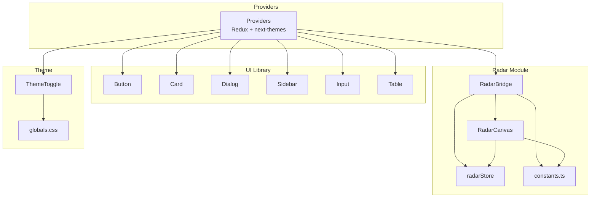
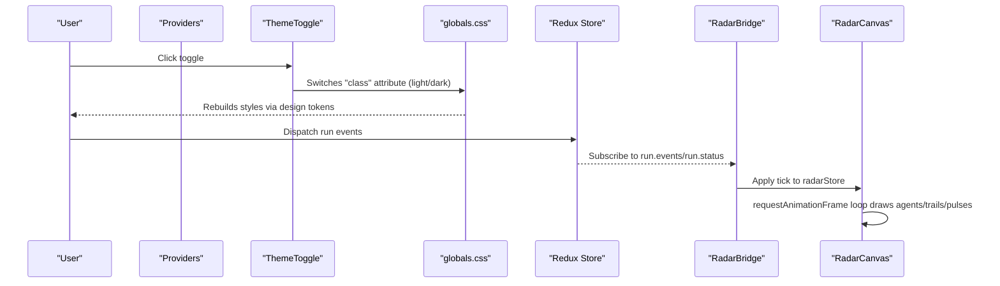
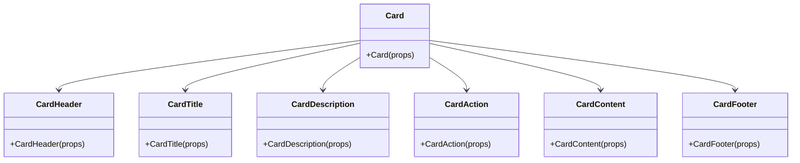
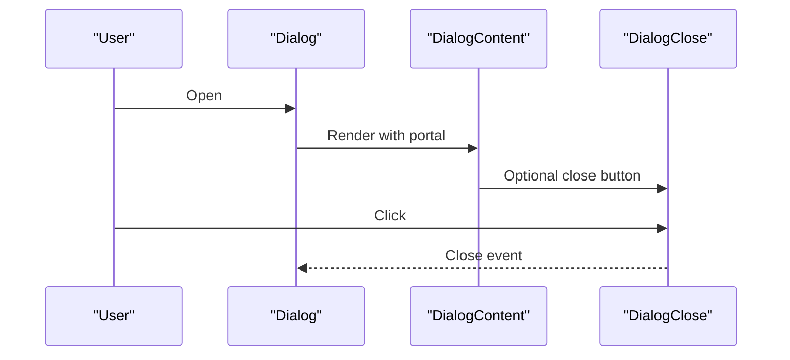
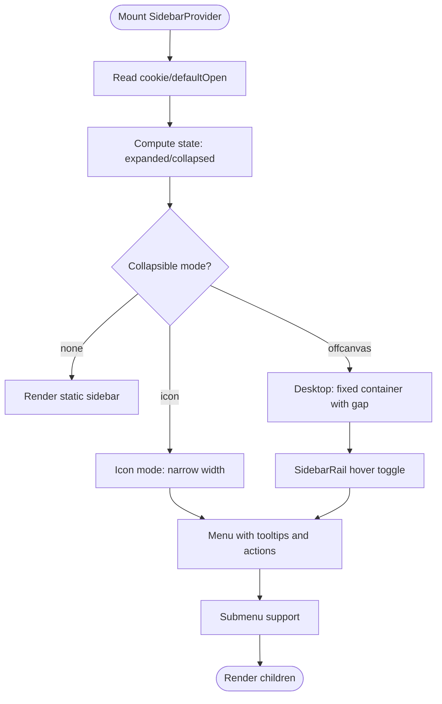
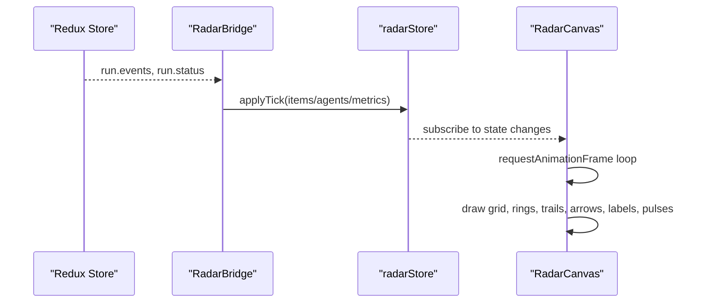
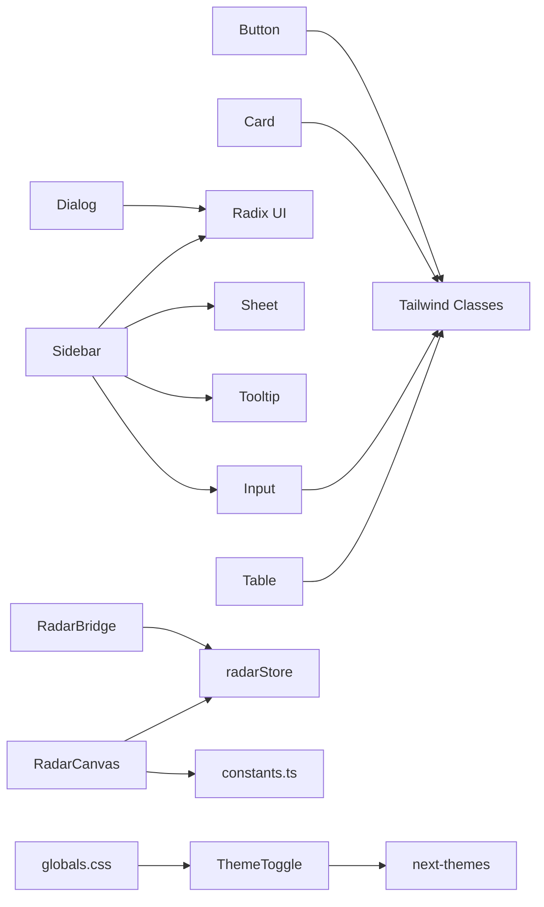

# UI Components and Design System

<cite>
**Referenced Files in This Document**
- [desktop/components/ui/button.tsx](file://desktop/components/ui/button.tsx)
- [desktop/components/ui/card.tsx](file://desktop/components/ui/card.tsx)
- [desktop/components/ui/dialog.tsx](file://desktop/components/ui/dialog.tsx)
- [desktop/components/ui/sidebar.tsx](file://desktop/components/ui/sidebar.tsx)
- [desktop/components/ui/input.tsx](file://desktop/components/ui/input.tsx)
- [desktop/components/ui/table.tsx](file://desktop/components/ui/table.tsx)
- [desktop/components/radar/RadarBridge.tsx](file://desktop/components/radar/RadarBridge.tsx)
- [desktop/components/radar/RadarCanvas.tsx](file://desktop/components/radar/RadarCanvas.tsx)
- [desktop/components/theme-toggle.tsx](file://desktop/components/theme-toggle.tsx)
- [desktop/components/providers.tsx](file://desktop/components/providers.tsx)
- [desktop/app/globals.css](file://desktop/app/globals.css)
- [desktop/lib/radar/constants.ts](file://desktop/lib/radar/constants.ts)
- [desktop/lib/radar/store.ts](file://desktop/lib/radar/store.ts)
- [desktop/lib/radar/types.ts](file://desktop/lib/radar/types.ts)
</cite>

## Table of Contents
1. [Introduction](#introduction)
2. [Project Structure](#project-structure)
3. [Core Components](#core-components)
4. [Architecture Overview](#architecture-overview)
5. [Detailed Component Analysis](#detailed-component-analysis)
6. [Dependency Analysis](#dependency-analysis)
7. [Performance Considerations](#performance-considerations)
8. [Troubleshooting Guide](#troubleshooting-guide)
9. [Conclusion](#conclusion)
10. [Appendices](#appendices)

## Introduction
This document describes the desktop application’s UI components and design system. It covers the component library (buttons, cards, dialogs, sidebars, inputs, tables), specialized components (radar visualization), and the underlying design system (typography, color scheme, spacing, responsive behavior). It also documents theming support, dark mode implementation, state management, and integration patterns. Accessibility and cross-platform consistency are addressed throughout.

## Project Structure
The desktop UI is built with Next.js and Radix UI primitives, styled via Tailwind CSS and a custom design token system. Components are organized under a dedicated components directory, with a separate radar module for specialized visualization. Theming is provided by next-themes and persisted via a Redux store wrapper.



**Diagram sources**
- [desktop/components/providers.tsx](file://desktop/components/providers.tsx#L9-L24)
- [desktop/components/ui/button.tsx](file://desktop/components/ui/button.tsx#L39-L60)
- [desktop/components/ui/card.tsx](file://desktop/components/ui/card.tsx#L5-L92)
- [desktop/components/ui/dialog.tsx](file://desktop/components/ui/dialog.tsx#L9-L143)
- [desktop/components/ui/sidebar.tsx](file://desktop/components/ui/sidebar.tsx#L154-L254)
- [desktop/components/ui/input.tsx](file://desktop/components/ui/input.tsx#L5-L21)
- [desktop/components/ui/table.tsx](file://desktop/components/ui/table.tsx#L5-L117)
- [desktop/components/radar/RadarBridge.tsx](file://desktop/components/radar/RadarBridge.tsx#L36-L301)
- [desktop/components/radar/RadarCanvas.tsx](file://desktop/components/radar/RadarCanvas.tsx#L22-L479)
- [desktop/components/theme-toggle.tsx](file://desktop/components/theme-toggle.tsx#L8-L45)
- [desktop/app/globals.css](file://desktop/app/globals.css#L1-L124)
- [desktop/lib/radar/store.ts](file://desktop/lib/radar/store.ts#L30-L106)
- [desktop/lib/radar/constants.ts](file://desktop/lib/radar/constants.ts#L1-L24)

**Section sources**
- [desktop/components/providers.tsx](file://desktop/components/providers.tsx#L9-L24)
- [desktop/app/globals.css](file://desktop/app/globals.css#L1-L124)

## Core Components
This section summarizes the primary UI components and their responsibilities.

- Button
  - Purpose: Primary action affordance with variants and sizes.
  - Props: variant, size, asChild, className, plus native button attributes.
  - Styling: Uses class variance authority (cva) with focus-visible, disabled, and invalid states.
  - Accessibility: Inherits focus-visible ring and supports aria-invalid.
  - Usage: Replace native button with Button for consistent styling and behavior.

- Card
  - Purpose: Content grouping with header, title, description, action, content, footer slots.
  - Props: className for each slot; data-slot attributes for styling hooks.
  - Styling: Tailwind-based with responsive grid for header layout and card-specific shadows/borders.

- Dialog
  - Purpose: Modal overlay with close button, header/footer, title, and description.
  - Props: showCloseButton flag; content receives children and optional close trigger.
  - Behavior: Uses Radix UI primitives with animated enter/exit transitions.

- Sidebar
  - Purpose: Navigation container with responsive behavior, collapsible modes, and keyboard shortcut.
  - Props: side, variant, collapsible, defaultOpen, open, onOpenChange.
  - Features: Cookie-backed persistence, mobile Sheet fallback, tooltip-integrated menu buttons, rail resizing, inset/floating variants.

- Input
  - Purpose: Text field with focus-visible ring, disabled states, and aria-invalid styling.
  - Props: type, className, plus native input attributes.

- Table
  - Purpose: Scrollable data table with header/body/footer and cell components.
  - Props: Forward refs to HTML elements; hover and selected states.

Integration highlights:
- Providers wrap the app with Redux store and next-themes to enable theme switching and persisted state.
- ThemeToggle toggles between light/dark themes and avoids hydration mismatches.

**Section sources**
- [desktop/components/ui/button.tsx](file://desktop/components/ui/button.tsx#L39-L60)
- [desktop/components/ui/card.tsx](file://desktop/components/ui/card.tsx#L5-L92)
- [desktop/components/ui/dialog.tsx](file://desktop/components/ui/dialog.tsx#L9-L143)
- [desktop/components/ui/sidebar.tsx](file://desktop/components/ui/sidebar.tsx#L154-L254)
- [desktop/components/ui/input.tsx](file://desktop/components/ui/input.tsx#L5-L21)
- [desktop/components/ui/table.tsx](file://desktop/components/ui/table.tsx#L5-L117)
- [desktop/components/theme-toggle.tsx](file://desktop/components/theme-toggle.tsx#L8-L45)
- [desktop/components/providers.tsx](file://desktop/components/providers.tsx#L9-L24)

## Architecture Overview
The UI architecture centers on:
- Component library built with Radix UI and Tailwind, enabling accessible, composable UI.
- Design tokens defined in CSS custom properties and consumed via @theme to ensure consistent color and spacing.
- Theming via next-themes with class-based switching and system preference awareness.
- Specialized radar visualization powered by a Zustand store and a canvas renderer with requestAnimationFrame-driven updates.



**Diagram sources**
- [desktop/components/providers.tsx](file://desktop/components/providers.tsx#L9-L24)
- [desktop/components/theme-toggle.tsx](file://desktop/components/theme-toggle.tsx#L8-L45)
- [desktop/app/globals.css](file://desktop/app/globals.css#L1-L124)
- [desktop/components/radar/RadarBridge.tsx](file://desktop/components/radar/RadarBridge.tsx#L36-L301)
- [desktop/components/radar/RadarCanvas.tsx](file://desktop/components/radar/RadarCanvas.tsx#L22-L479)

## Detailed Component Analysis

### Button
- Variants: default, destructive, outline, secondary, ghost, link.
- Sizes: default, sm, lg, icon, icon-sm, icon-lg.
- Composition: Supports asChild to render as a slot for semantic correctness.
- Focus/accessibility: Focus-visible ring and destructive invalid states.

```mermaid
classDiagram
class Button {
+variant : string
+size : string
+asChild : boolean
+className : string
}
class Variants {
<<enum>>
default
destructive
outline
secondary
ghost
link
}
class Sizes {
<<enum>>
default
sm
lg
icon
"icon-sm"
"icon-lg"
}
Button --> Variants : "uses"
Button --> Sizes : "uses"
```

**Diagram sources**
- [desktop/components/ui/button.tsx](file://desktop/components/ui/button.tsx#L7-L37)

**Section sources**
- [desktop/components/ui/button.tsx](file://desktop/components/ui/button.tsx#L39-L60)

### Card
- Slots: Card, CardHeader, CardTitle, CardDescription, CardAction, CardContent, CardFooter.
- Layout: Header grid adapts to presence of actions; content padding and borders applied consistently.



**Diagram sources**
- [desktop/components/ui/card.tsx](file://desktop/components/ui/card.tsx#L5-L92)

**Section sources**
- [desktop/components/ui/card.tsx](file://desktop/components/ui/card.tsx#L5-L92)

### Dialog
- Primitives: Root, Trigger, Portal, Close, Overlay, Content.
- Optional close button and directional animations; header/footer/title/description slots.



**Diagram sources**
- [desktop/components/ui/dialog.tsx](file://desktop/components/ui/dialog.tsx#L9-L143)

**Section sources**
- [desktop/components/ui/dialog.tsx](file://desktop/components/ui/dialog.tsx#L9-L143)

### Sidebar
- Provider manages state, cookies, keyboard shortcut (Ctrl/Cmd+B), and responsive behavior.
- Modes: offcanvas, icon, none; variants: sidebar, floating, inset.
- Menu system: groups, labels, buttons, actions, badges, submenus, skeletons.



**Diagram sources**
- [desktop/components/ui/sidebar.tsx](file://desktop/components/ui/sidebar.tsx#L56-L254)

**Section sources**
- [desktop/components/ui/sidebar.tsx](file://desktop/components/ui/sidebar.tsx#L154-L254)

### Input
- Focus-visible ring, disabled states, and aria-invalid styling.
- Consistent sizing and placeholder/text selection styles.

**Section sources**
- [desktop/components/ui/input.tsx](file://desktop/components/ui/input.tsx#L5-L21)

### Table
- Scrollable container with standard table semantics and hover/selected states.
- Head/body/footer/row/cell/caption components.

**Section sources**
- [desktop/components/ui/table.tsx](file://desktop/components/ui/table.tsx#L5-L117)

### Radar Visualization
- Bridge: Syncs Redux run events to the radar store, deduplicates, spawns/accelerates/removes flights, and handles completion.
- Canvas: Draws radar grid, rings, trails, arrows, labels, and arrival pulses; respects dark mode; refresh cadence controlled by constants.
- Store: Zustand store managing items, agents, metrics, and tick diffs.
- Types: Strongly typed work items, agents, and metrics.



**Diagram sources**
- [desktop/components/radar/RadarBridge.tsx](file://desktop/components/radar/RadarBridge.tsx#L36-L301)
- [desktop/components/radar/RadarCanvas.tsx](file://desktop/components/radar/RadarCanvas.tsx#L22-L479)
- [desktop/lib/radar/store.ts](file://desktop/lib/radar/store.ts#L30-L106)
- [desktop/lib/radar/types.ts](file://desktop/lib/radar/types.ts#L5-L51)

**Section sources**
- [desktop/components/radar/RadarBridge.tsx](file://desktop/components/radar/RadarBridge.tsx#L36-L301)
- [desktop/components/radar/RadarCanvas.tsx](file://desktop/components/radar/RadarCanvas.tsx#L22-L479)
- [desktop/lib/radar/store.ts](file://desktop/lib/radar/store.ts#L30-L106)
- [desktop/lib/radar/types.ts](file://desktop/lib/radar/types.ts#L5-L51)
- [desktop/lib/radar/constants.ts](file://desktop/lib/radar/constants.ts#L1-L24)

## Dependency Analysis
- Component library depends on Radix UI primitives and Tailwind utilities.
- Sidebar integrates with Sheet for mobile, Tooltip for contextual hints, and Input for filtering/search.
- Radar components depend on a shared Zustand store and constants for rendering behavior.
- Theming is decoupled from components via next-themes and CSS custom properties.



**Diagram sources**
- [desktop/components/ui/button.tsx](file://desktop/components/ui/button.tsx#L1-L60)
- [desktop/components/ui/card.tsx](file://desktop/components/ui/card.tsx#L1-L92)
- [desktop/components/ui/dialog.tsx](file://desktop/components/ui/dialog.tsx#L1-L144)
- [desktop/components/ui/sidebar.tsx](file://desktop/components/ui/sidebar.tsx#L1-L26)
- [desktop/components/ui/input.tsx](file://desktop/components/ui/input.tsx#L1-L22)
- [desktop/components/ui/table.tsx](file://desktop/components/ui/table.tsx#L1-L118)
- [desktop/components/radar/RadarBridge.tsx](file://desktop/components/radar/RadarBridge.tsx#L1-L302)
- [desktop/components/radar/RadarCanvas.tsx](file://desktop/components/radar/RadarCanvas.tsx#L1-L479)
- [desktop/components/theme-toggle.tsx](file://desktop/components/theme-toggle.tsx#L1-L46)
- [desktop/app/globals.css](file://desktop/app/globals.css#L1-L124)
- [desktop/lib/radar/store.ts](file://desktop/lib/radar/store.ts#L1-L106)
- [desktop/lib/radar/constants.ts](file://desktop/lib/radar/constants.ts#L1-L24)

**Section sources**
- [desktop/components/ui/sidebar.tsx](file://desktop/components/ui/sidebar.tsx#L1-L26)
- [desktop/components/radar/RadarBridge.tsx](file://desktop/components/radar/RadarBridge.tsx#L1-L302)
- [desktop/components/radar/RadarCanvas.tsx](file://desktop/components/radar/RadarCanvas.tsx#L1-L479)
- [desktop/components/theme-toggle.tsx](file://desktop/components/theme-toggle.tsx#L1-L46)
- [desktop/app/globals.css](file://desktop/app/globals.css#L1-L124)

## Performance Considerations
- Radar rendering
  - Refresh cadence controlled by a constant; drawing occurs at a capped frame rate using requestAnimationFrame.
  - Trails and pulses are time-based with bounded lifespans to limit memory growth.
  - Device pixel ratio scaling ensures crisp rendering on high-DPI displays.
- Sidebar
  - Cookie-backed persistence reduces re-computation on mount.
  - Collapsible modes minimize DOM and layout work on smaller screens.
- Theming
  - next-themes with disableTransitionOnChange avoids visible flicker during SSR hydration.

Recommendations:
- Keep radar constants tuned to target refresh rates and avoid excessive trail counts.
- Prefer icon mode for dense navigation on small screens.
- Use CSS custom properties for theme tokens to minimize repaints.

**Section sources**
- [desktop/lib/radar/constants.ts](file://desktop/lib/radar/constants.ts#L21-L24)
- [desktop/components/radar/RadarCanvas.tsx](file://desktop/components/radar/RadarCanvas.tsx#L170-L171)
- [desktop/components/ui/sidebar.tsx](file://desktop/components/ui/sidebar.tsx#L85-L88)
- [desktop/components/theme-toggle.tsx](file://desktop/components/theme-toggle.tsx#L12-L18)

## Troubleshooting Guide
- Hydration mismatch on theme toggle
  - Mounted guard prevents mismatch between server-rendered and client-rendered UI.
- Sidebar keyboard shortcut not working
  - Ensure Ctrl/Cmd+B is not intercepted by browser extensions; verify event listener cleanup.
- Radar not updating
  - Confirm run status is “running” and events are being dispatched; check bridge initialization and tick IDs.
- Canvas artifacts on resize
  - ResizeObserver or window resize listener should recalculate DPR and redraw static elements.

**Section sources**
- [desktop/components/theme-toggle.tsx](file://desktop/components/theme-toggle.tsx#L12-L18)
- [desktop/components/ui/sidebar.tsx](file://desktop/components/ui/sidebar.tsx#L96-L110)
- [desktop/components/radar/RadarBridge.tsx](file://desktop/components/radar/RadarBridge.tsx#L49-L64)
- [desktop/components/radar/RadarCanvas.tsx](file://desktop/components/radar/RadarCanvas.tsx#L38-L51)

## Conclusion
Shannon’s desktop UI combines a robust component library with a cohesive design system. The component library emphasizes accessibility and composability, while the radar visualization demonstrates advanced state management and canvas rendering. Theming is centralized via next-themes and CSS custom properties, ensuring consistent light/dark experiences. The architecture supports responsive behavior, cross-platform parity, and maintainable customization.

## Appendices

### Design Tokens and Theming
- Color scheme
  - Base palette defined in CSS custom properties for light and dark modes.
  - Semantic tokens for backgrounds, foregrounds, borders, accents, and charts.
- Typography
  - Font families exposed via CSS variables; Tailwind typography plugin enabled.
- Spacing and radii
  - Radius tokens standardized across components.

**Section sources**
- [desktop/app/globals.css](file://desktop/app/globals.css#L7-L45)
- [desktop/app/globals.css](file://desktop/app/globals.css#L47-L114)

### Component Composition Patterns
- Slot-based composition
  - Buttons support asChild to render as semantic elements.
  - Sidebar menu buttons accept asChild for anchor-like behavior.
- Container/content separation
  - Cards and dialogs split content into header/content/footer for consistent layouts.
- Responsive composition
  - Sidebar switches to Sheet on mobile; table wraps in an overflow container.

**Section sources**
- [desktop/components/ui/button.tsx](file://desktop/components/ui/button.tsx#L49-L57)
- [desktop/components/ui/sidebar.tsx](file://desktop/components/ui/sidebar.tsx#L509-L523)
- [desktop/components/ui/card.tsx](file://desktop/components/ui/card.tsx#L18-L82)
- [desktop/components/ui/dialog.tsx](file://desktop/components/ui/dialog.tsx#L83-L104)
- [desktop/components/ui/table.tsx](file://desktop/components/ui/table.tsx#L8-L16)

### Accessibility Considerations
- Focus management
  - Focus-visible rings on interactive elements; proper focus order maintained.
- ARIA and semantics
  - Dialogs include sr-only labels; inputs support aria-invalid states.
- Screen reader support
  - Hidden labels for icons; semantic markup for tables and cards.

**Section sources**
- [desktop/components/ui/button.tsx](file://desktop/components/ui/button.tsx#L7-L8)
- [desktop/components/ui/dialog.tsx](file://desktop/components/ui/dialog.tsx#L69-L77)
- [desktop/components/ui/input.tsx](file://desktop/components/ui/input.tsx#L10-L15)

### Integration Patterns
- Redux + next-themes
  - Providers wrap the app to supply theme and persisted store.
- Event-driven UI updates
  - RadarBridge subscribes to run events and updates the radar store accordingly.
- Theming hooks
  - ThemeToggle toggles the theme and reflects changes immediately.

**Section sources**
- [desktop/components/providers.tsx](file://desktop/components/providers.tsx#L9-L24)
- [desktop/components/theme-toggle.tsx](file://desktop/components/theme-toggle.tsx#L8-L45)
- [desktop/components/radar/RadarBridge.tsx](file://desktop/components/radar/RadarBridge.tsx#L36-L64)