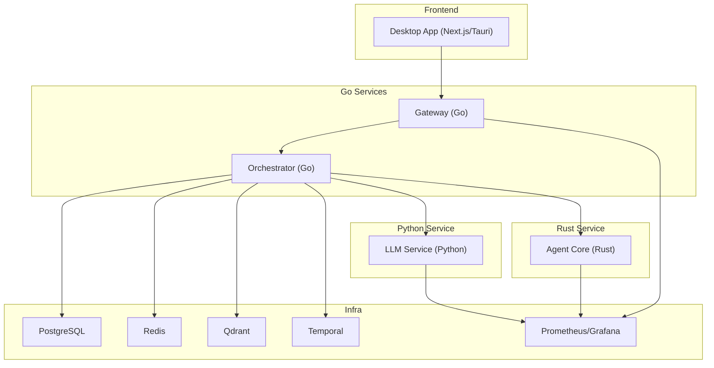
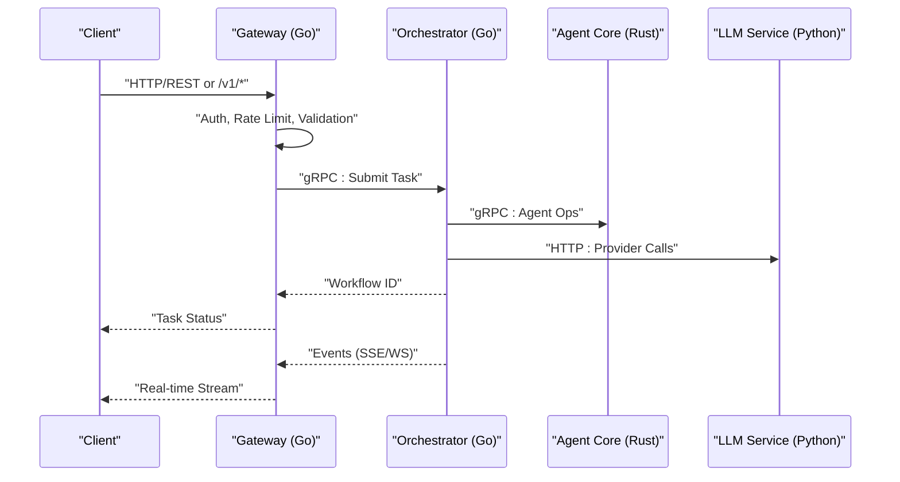
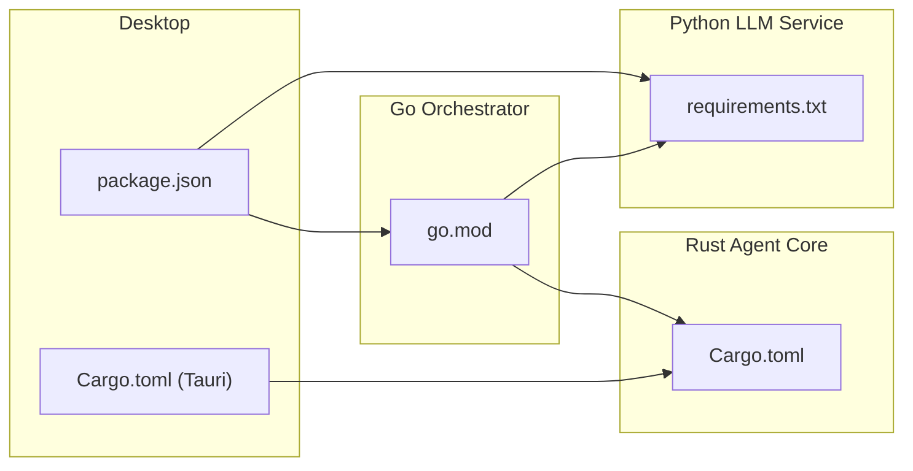

# Development Guide

<cite>
**Referenced Files in This Document**
- [CONTRIBUTING.md](file://CONTRIBUTING.md)
- [README.md](file://README.md)
- [Makefile](file://Makefile)
- [go.mod](file://go/orchestrator/go.mod)
- [Cargo.toml](file://rust/agent-core/Cargo.toml)
- [requirements.txt](file://python/llm-service/requirements.txt)
- [models.yaml](file://config/models.yaml)
- [generate_protos_local.sh](file://scripts/generate_protos_local.sh)
- [install_buf.sh](file://scripts/install_buf.sh)
- [main.go](file://go/orchestrator/cmd/gateway/main.go)
- [main.py](file://python/llm-service/main.py)
- [main.rs](file://rust/agent-core/src/main.rs)
- [run.sh](file://tests/e2e/run.sh)
- [package.json](file://desktop/package.json)
- [Cargo.toml](file://desktop/src-tauri/Cargo.toml)
- [Dockerfile](file://python/llm-service/Dockerfile)
- [Dockerfile](file://rust/agent-core/Dockerfile)
</cite>

## Table of Contents
1. [Introduction](#introduction)
2. [Project Structure](#project-structure)
3. [Core Components](#core-components)
4. [Architecture Overview](#architecture-overview)
5. [Detailed Component Analysis](#detailed-component-analysis)
6. [Dependency Analysis](#dependency-analysis)
7. [Performance Considerations](#performance-considerations)
8. [Troubleshooting Guide](#troubleshooting-guide)
9. [Conclusion](#conclusion)
10. [Appendices](#appendices)

## Introduction
This development guide provides a comprehensive, contributor-focused walkthrough for building, testing, and debugging Shannon. It covers environment setup for Go, Rust, and Python; build and code generation processes; dependency management; contribution workflow; debugging and local development; testing procedures; and best practices for performance and code quality.

## Project Structure
Shannon is a multi-language, multi-service platform composed of:
- Go-based orchestrator and gateway
- Rust-based agent core
- Python-based LLM service
- TypeScript/Next.js desktop application
- Protocol buffers for cross-language RPC
- Docker Compose for local orchestration
- Makefile-driven developer workflows

**Diagram sources**
- [main.go](file://go/orchestrator/cmd/gateway/main.go#L1-L688)
- [main.py](file://python/llm-service/main.py#L1-L164)
- [main.rs](file://rust/agent-core/src/main.rs#L1-L54)
- [package.json](file://desktop/package.json#L1-L62)
- [Cargo.toml](file://desktop/src-tauri/Cargo.toml#L1-L27)

**Section sources**
- [README.md](file://README.md#L1-L517)
- [CONTRIBUTING.md](file://CONTRIBUTING.md#L291-L352)

## Core Components
- Orchestrator (Go): Temporal workflow engine, budgeting, memory, pricing, and activity orchestration.
- Agent Core (Rust): gRPC service exposing agent operations, WASI sandbox, tool execution, and metrics.
- LLM Service (Python): Provider abstraction, MCP tools, streaming, and observability.
- Gateway (Go): REST API gateway with OpenAI-compatible endpoints, auth, rate limiting, and SSE/WS proxy.
- Desktop App (TypeScript/Next.js): Real-time UI for task monitoring and agent interactions.
- Protobuf Definitions: Shared RPC contracts across services.

**Section sources**
- [CONTRIBUTING.md](file://CONTRIBUTING.md#L291-L352)
- [go.mod](file://go/orchestrator/go.mod#L1-L99)
- [Cargo.toml](file://rust/agent-core/Cargo.toml#L1-L90)
- [requirements.txt](file://python/llm-service/requirements.txt#L1-L62)

## Architecture Overview
Shannon’s runtime architecture integrates gRPC and HTTP layers with a Temporal workflow engine and persistent stores. The Gateway exposes REST and OpenAI-compatible APIs, authenticates requests, and proxies streaming endpoints. The Orchestrator coordinates workflows, manages budgets, and interacts with the Agent Core and LLM Service. The Agent Core executes tools in a WASI sandbox, while the LLM Service handles provider integrations and tooling.

**Diagram sources**
- [main.go](file://go/orchestrator/cmd/gateway/main.go#L135-L600)
- [main.rs](file://rust/agent-core/src/main.rs#L30-L48)
- [main.py](file://python/llm-service/main.py#L116-L151)

**Section sources**
- [README.md](file://README.md#L201-L218)
- [CONTRIBUTING.md](file://CONTRIBUTING.md#L291-L352)

## Detailed Component Analysis

### Development Environment Setup
- Prerequisites:
  - Go 1.22+ (for orchestrator)
  - Rust stable (for agent core)
  - Python 3.11+ (for LLM service)
  - Docker and Docker Compose
  - Make, curl, grpcurl
  - protoc (Protocol Buffers compiler)
  - Node.js 18+ and npm (for desktop)
  - An API key for at least one supported LLM provider

- Quick-start commands:
  - One-stop setup: create .env, generate protobufs, download WASI interpreter, start services, run smoke tests.
  - Local development: start dependencies in Docker, then run each service in separate terminals.

- Ports and endpoints:
  - Agent Core (Rust): 50051
  - Orchestrator (Go): 50052
  - LLM Service (Python): 8000
  - Gateway: 8080
  - Admin/Events: 8081
  - Temporal UI: 8088
  - Grafana: 3030
  - Prometheus: 9090

**Section sources**
- [CONTRIBUTING.md](file://CONTRIBUTING.md#L16-L96)
- [README.md](file://README.md#L32-L200)

### Build Processes and Code Generation
- Protobuf generation:
  - Primary: make proto uses buf to generate Go and Python stubs.
  - Fallback: make proto-local installs language-specific tools and regenerates stubs without BSR.
  - Scripts ensure protobuf/grpc-tools compatibility across languages.

- Makefile targets:
  - setup-env, setup, check-env, dev, down, logs, ps, proto, proto-local, fmt, lint, ci, test, smoke, coverage, integration-tests, replay, and more.

- Docker builds:
  - LLM Service: multi-stage build with slim Python base, health check, and exposed port.
  - Agent Core: multi-stage build with Debian runtime, CA certificates, and netcat for readiness.

**Section sources**
- [Makefile](file://Makefile#L69-L86)
- [generate_protos_local.sh](file://scripts/generate_protos_local.sh#L1-L81)
- [install_buf.sh](file://scripts/install_buf.sh#L1-L40)
- [Dockerfile](file://python/llm-service/Dockerfile#L1-L39)
- [Dockerfile](file://rust/agent-core/Dockerfile#L1-L35)

### Dependency Management
- Go (orchestrator):
  - go.mod pins Go toolchain and dependencies including Temporal SDK, gRPC, OPA, Prometheus, Redis, and others.

- Rust (agent-core):
  - Cargo.toml defines Tokio, Tonic, WASMtime/WASI, OpenTelemetry, Prometheus, Redis, and tracing.

- Python (LLM service):
  - requirements.txt lists FastAPI, uvicorn, gRPC, provider SDKs, Redis, SQLAlchemy, Prometheus, OpenTelemetry, and testing libraries.

- Desktop (TypeScript/Next.js):
  - package.json defines Next.js, Tauri, Radix UI, Redux, Tailwind, and dev tooling.

**Section sources**
- [go.mod](file://go/orchestrator/go.mod#L1-L99)
- [Cargo.toml](file://rust/agent-core/Cargo.toml#L1-L90)
- [requirements.txt](file://python/llm-service/requirements.txt#L1-L62)
- [package.json](file://desktop/package.json#L1-L62)

### Contribution Workflow
- Branching:
  - Feature branches: feature/your-feature-name
  - Fix branches: fix/issue-description

- Code style:
  - Go: gofmt, go mod tidy
  - Rust: cargo fmt, cargo clippy
  - Python: black, isort, PEP 8

- Protobuf updates:
  - After editing .proto files, run make proto and rebuild services.

- Testing:
  - Unit tests: make test
  - CI checks: make ci
  - E2E smoke tests: make smoke
  - Deterministic replay: make replay-export and make replay

- Commit messages:
  - feat:, fix:, docs:, style:, refactor:, test:, chore:

- Pull Request checklist:
  - Follow style guidelines, pass tests, update docs, run make ci, no new warnings.

**Section sources**
- [CONTRIBUTING.md](file://CONTRIBUTING.md#L97-L213)

### Debugging Techniques and Local Development
- Enable debug logging:
  - Set RUST_LOG=debug and LOG_LEVEL=debug.
  - View service logs via docker compose logs.

- Common issues:
  - Proto changes not reflected: make proto, docker compose build, docker compose up -d.
  - Temporal workflow issues: temporal workflow describe or Docker exec to UI.
  - Database queries: psql to inspect task_executions and sessions.

- Deterministic replay:
  - Export workflow history with make replay-export, then replay with make replay.

**Section sources**
- [CONTRIBUTING.md](file://CONTRIBUTING.md#L372-L420)

### Testing Procedures
- Unit tests:
  - Go: go test ./...
  - Rust: cargo test
  - Python: pytest

- Integration tests:
  - scripts run integration tests for single agent flow, session memory, and Qdrant.

- End-to-end tests:
  - tests/e2e/run.sh orchestrates multiple test suites and collects metrics.

- Coverage:
  - make coverage-go, make coverage-python, and make coverage-gate enforce thresholds.

**Section sources**
- [Makefile](file://Makefile#L114-L127)
- [Makefile](file://Makefile#L229-L247)
- [run.sh](file://tests/e2e/run.sh#L1-L195)

### Practical Examples
- Adding a new LLM provider:
  - Implement provider in python/llm-service/providers/, add pricing to config/models.yaml, update tiers if needed, add tests.

- Adding a new tool:
  - Define tool in python/llm-service/tools/, register with MCP if external, add tool description, include print() statements for WASI, write integration tests.

- Adding a new workflow pattern:
  - Create pattern in go/orchestrator/internal/workflows/strategies/, register in workflow router, add complexity analysis logic, test with replay.

- Updating Protocol Buffers:
  - Modify .proto files in protos/, run make proto, update all three services, rebuild and test.

**Section sources**
- [CONTRIBUTING.md](file://CONTRIBUTING.md#L421-L447)

### Service Integration Points
- Gateway:
  - Handles auth, rate limiting, validation, and proxies SSE/WS to admin server.
  - Provides OpenAI-compatible endpoints under /v1/.

- Agent Core:
  - gRPC service with reflection enabled, metrics server, and WASI sandbox.

- LLM Service:
  - FastAPI app with routers for completions, embeddings, tools, and providers; Prometheus metrics mount.

**Section sources**
- [main.go](file://go/orchestrator/cmd/gateway/main.go#L135-L600)
- [main.rs](file://rust/agent-core/src/main.rs#L30-L48)
- [main.py](file://python/llm-service/main.py#L116-L151)

## Dependency Analysis
This section maps key dependencies across services and highlights inter-service relationships.

**Diagram sources**
- [go.mod](file://go/orchestrator/go.mod#L1-L99)
- [Cargo.toml](file://rust/agent-core/Cargo.toml#L1-L90)
- [requirements.txt](file://python/llm-service/requirements.txt#L1-L62)
- [package.json](file://desktop/package.json#L1-L62)
- [Cargo.toml](file://desktop/src-tauri/Cargo.toml#L1-L27)

**Section sources**
- [go.mod](file://go/orchestrator/go.mod#L1-L99)
- [Cargo.toml](file://rust/agent-core/Cargo.toml#L1-L90)
- [requirements.txt](file://python/llm-service/requirements.txt#L1-L62)
- [package.json](file://desktop/package.json#L1-L62)
- [Cargo.toml](file://desktop/src-tauri/Cargo.toml#L1-L27)

## Performance Considerations
- Metrics and dashboards:
  - Prometheus metrics endpoints and Grafana dashboards for real-time monitoring.
- Time-travel debugging:
  - Use deterministic replay to step through failed workflows and identify bottlenecks.
- Cost control:
  - Centralized pricing in config/models.yaml with model tiers and budget enforcement.
- Observability:
  - OpenTelemetry tracing and Prometheus metrics across services.

**Section sources**
- [CONTRIBUTING.md](file://CONTRIBUTING.md#L448-L453)
- [models.yaml](file://config/models.yaml#L1-L776)

## Troubleshooting Guide
- Environment setup:
  - Ensure .env symlink exists and Docker Compose config validates.
- Protobuf regeneration:
  - If stubs are missing, run make setup or make proto-local.
- Service health:
  - Use docker compose logs and health endpoints to diagnose startup issues.
- Database and Redis:
  - Connect to Postgres and Redis to inspect state and session data.

**Section sources**
- [Makefile](file://Makefile#L32-L58)
- [README.md](file://README.md#L395-L421)

## Conclusion
This guide consolidates Shannon’s development workflow, build processes, and operational practices. By following the environment setup, contribution workflow, and testing procedures outlined here, contributors can efficiently develop, debug, and integrate new features across the multi-language stack.

## Appendices

### A. Quick Commands Reference
- Setup: make setup
- Dev stack: make dev
- Smoke tests: make smoke
- CI checks: make ci
- Protobuf generation: make proto or make proto-local
- Coverage: make coverage
- Deterministic replay: make replay-export and make replay

**Section sources**
- [Makefile](file://Makefile#L21-L127)

### B. Configuration Highlights
- Centralized model pricing and tiers in config/models.yaml.
- Feature flags and provider settings for LLM integration.
- Metrics, alerts, and monitoring configuration.

**Section sources**
- [models.yaml](file://config/models.yaml#L1-L776)