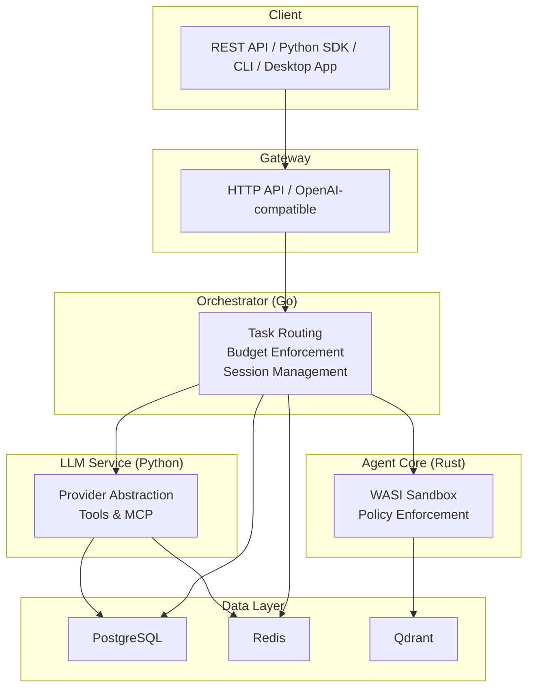
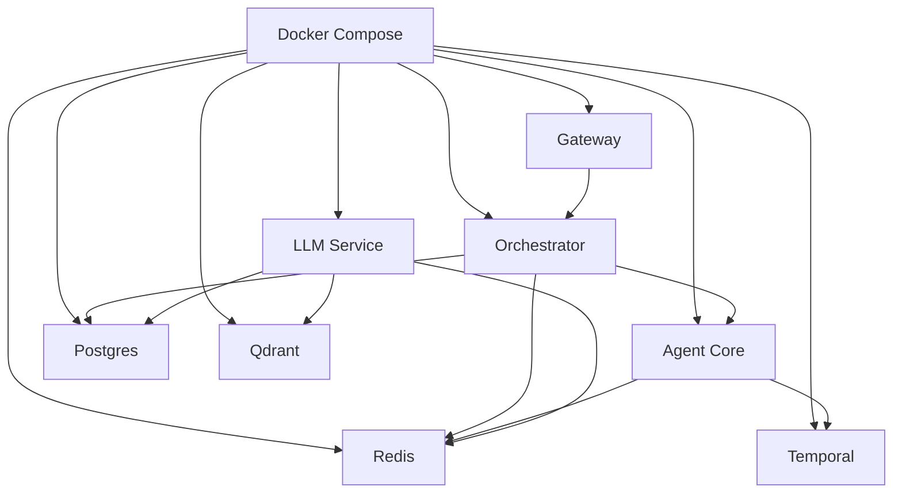

# Getting Started

<cite>
**Referenced Files in This Document**
- [README.md](file://README.md)
- [scripts/install.sh](file://scripts/install.sh)
- [deploy/compose/docker-compose.yml](file://deploy/compose/docker-compose.yml)
- [.env.example](file://.env.example)
- [clients/python/README.md](file://clients/python/README.md)
- [clients/python/examples/simple_task.py](file://clients/python/examples/simple_task.py)
- [clients/python/examples/simple_streaming.py](file://clients/python/examples/simple_streaming.py)
- [scripts/submit_task.sh](file://scripts/submit_task.sh)
- [desktop/README.md](file://desktop/README.md)
- [docs/environment-configuration.md](file://docs/environment-configuration.md)
- [docs/troubleshooting.md](file://docs/troubleshooting.md)
- [config/README.md](file://config/README.md)
- [config/models.yaml](file://config/models.yaml)
</cite>

## Table of Contents
1. [Introduction](#introduction)
2. [Prerequisites](#prerequisites)
3. [Installation](#installation)
4. [Environment Configuration](#environment-configuration)
5. [Interaction Methods](#interaction-methods)
6. [Practical Examples](#practical-examples)
7. [Architecture Overview](#architecture-overview)
8. [Dependency Analysis](#dependency-analysis)
9. [Performance Considerations](#performance-considerations)
10. [Troubleshooting Guide](#troubleshooting-guide)
11. [Conclusion](#conclusion)

## Introduction
Shannon is a production-grade AI agent platform designed to solve real-world scaling challenges: runaway costs, non-deterministic failures, and security risks. It provides a robust orchestration layer with multi-agent workflows, real-time streaming, WASI sandboxed code execution, and enterprise-grade governance.

This Getting Started guide focuses on rapid onboarding for beginners and experienced developers alike. You will learn how to install Shannon, configure environment variables, and interact with the system using four methods: REST API, Python SDK, native desktop app, and web UI.

## Prerequisites
Before installing Shannon, ensure your environment meets the following requirements:
- Docker and Docker Compose installed and running
- At least one LLM provider API key (OpenAI or Anthropic recommended)
- Optional: Web search and web fetch API keys (SerpAPI or Firecrawl)

Key prerequisites are summarized in the project’s quick start section and installation script.

**Section sources**
- [README.md](file://README.md#L34-L58)
- [scripts/install.sh](file://scripts/install.sh#L16-L26)

## Installation
There are two primary installation paths: Quick Install and Manual Setup.

### Quick Install
The quickest way to get up and running is to use the provided installer script. It downloads configuration, prompts for API keys, pulls Docker images, and starts all services.

- Run the installer:
  ```bash
  curl -fsSL https://raw.githubusercontent.com/Kocoro-lab/Shannon/v0.1.0/scripts/install.sh | bash
  ```
- The script creates a local installation directory, downloads configuration and migrations, and starts services.
- After installation, test the gateway:
  ```bash
  curl -X POST http://localhost:8080/api/v1/tasks \
    -H "Content-Type: application/json" \
    -d '{"query": "What is 2+2?", "session_id": "test"}'
  ```

What the installer does:
- Downloads production compose and Grafana config
- Creates .env.example and copies it to .env
- Downloads configuration files and database migrations
- Pulls Docker images and starts services

**Section sources**
- [README.md](file://README.md#L39-L47)
- [scripts/install.sh](file://scripts/install.sh#L1-L168)

### Manual Setup
If you prefer to set up manually or are cloning the repository:

1. Create .env from the example and add your API keys:
   ```bash
   cp .env.example .env
   # Edit .env with your API keys
   ```
2. Create the Docker Compose symlink so services can read .env:
   ```bash
   cd deploy/compose
   ln -sf ../../.env .env
   ```
3. Start services:
   ```bash
   docker compose -f docker-compose.release.yml up -d
   ```

Notes:
- The release compose file is used for production-like deployments.
- The development compose mounts config and wasm interpreters from the host.

**Section sources**
- [docs/environment-configuration.md](file://docs/environment-configuration.md#L27-L56)
- [README.md](file://README.md#L474-L483)

## Environment Configuration
Shannon uses layered configuration. The highest priority is environment variables (including .env), followed by Docker Compose defaults, and finally YAML configuration files.

### Required API Keys
At minimum, set one LLM provider key. OpenAI is required for memory features (embeddings). Recommended optional keys include SerpAPI for web search and Firecrawl for web fetch.

- Required:
  - OPENAI_API_KEY
- Recommended:
  - SERPAPI_API_KEY (for web search)
  - FIRECRAWL_API_KEY (for web fetch)

### Core Endpoints and Paths
- Gateway: http://localhost:8080
- Admin/Events: http://localhost:8081
- Orchestrator gRPC: localhost:50052
- Temporal UI: http://localhost:8088
- Grafana: http://localhost:3030

### Configuration Files
- config/models.yaml: LLM providers, model tiers, and routing
- config/features.yaml: Feature flags and execution modes
- config/shannon.yaml: Main system configuration (service, auth, policy, etc.)

**Section sources**
- [README.md](file://README.md#L172-L190)
- [.env.example](file://.env.example#L17-L61)
- [config/README.md](file://config/README.md#L14-L47)
- [config/models.yaml](file://config/models.yaml#L16-L136)

## Interaction Methods
Shannon supports four primary interaction methods. Choose the one that fits your workflow best.

### 1) REST API
Use the HTTP REST API directly. The gateway exposes:
- Task submission: POST /api/v1/tasks
- Status and results: GET /api/v1/tasks/{id}
- Real-time streaming: GET /api/v1/stream/sse?workflow_id=...

Example workflow:
- Submit a task
- Stream events via SSE
- Retrieve final result

Ports and endpoints are documented in the project’s quick start.

**Section sources**
- [README.md](file://README.md#L66-L86)

### 2) Python SDK
Install the official Python SDK and use it to submit tasks, stream events, and manage sessions and schedules.

- Install:
  ```bash
  pip install shannon-sdk
  ```
- Initialize client and submit a task
- Stream events and wait for completion

The SDK includes CLI commands and comprehensive examples.

**Section sources**
- [README.md](file://README.md#L93-L128)
- [clients/python/README.md](file://clients/python/README.md#L7-L15)

### 3) Native Desktop App
Download pre-built desktop applications for macOS, Windows, and Linux, or build from source using Tauri and Next.js.

- Download from GitHub Releases
- Or build locally:
  ```bash
  cd desktop
  npm install
  npm run tauri:build
  ```

Benefits include system tray integration, offline history, and native performance.

**Section sources**
- [README.md](file://README.md#L130-L152)
- [desktop/README.md](file://desktop/README.md#L28-L61)

### 4) Web UI (Development)
Run the desktop app as a local web server for development and testing.

- Start the frontend:
  ```bash
  cd desktop
  npm install
  npm run dev
  ```
- Open http://localhost:3000

This mode supports real-time SSE streaming, session/task management, and visual workflow execution.

**Section sources**
- [README.md](file://README.md#L154-L171)
- [desktop/README.md](file://desktop/README.md#L7-L27)

## Practical Examples
Below are practical examples for each interaction method. Replace placeholders with your actual values.

### REST API: Submit a Task and Stream Events
- Submit a task:
  ```bash
  curl -X POST http://localhost:8080/api/v1/tasks \
    -H "Content-Type: application/json" \
    -d '{"query": "What is the capital of France?", "session_id": "demo-session"}'
  ```
- Stream events:
  ```bash
  curl -N "http://localhost:8080/api/v1/stream/sse?workflow_id=task-dev-123"
  ```
- Get final result:
  ```bash
  curl "http://localhost:8080/api/v1/tasks/task-dev-123"
  ```

**Section sources**
- [README.md](file://README.md#L70-L86)

### Python SDK: Submit Task and Wait
- Initialize client and submit:
  ```python
  from shannon import ShannonClient

  with ShannonClient(base_url="http://localhost:8080") as client:
      handle = client.submit_task("What is the capital of France?", session_id="demo-session")
      result = client.wait(handle.task_id)
      print(result.result)
  ```
- CLI equivalent:
  ```bash
  python -m shannon.cli --base-url http://localhost:8080 submit "What is the capital of France?" --wait
  ```

**Section sources**
- [clients/python/README.md](file://clients/python/README.md#L17-L51)
- [clients/python/examples/simple_task.py](file://clients/python/examples/simple_task.py#L1-L48)

### Python SDK: Stream Events
- Stream LLM outputs and tool invocations:
  ```python
  from shannon import ShannonClient, EventType

  client = ShannonClient(base_url="http://localhost:8080")
  handle = client.submit_task("Research recent developments in quantum computing...")
  for event in client.stream(handle.workflow_id, types=[EventType.LLM_PARTIAL, EventType.TOOL_INVOKED, EventType.WORKFLOW_COMPLETED]):
      if event.type == EventType.LLM_PARTIAL:
          print(f"💭 {event.message}")
      elif event.type == EventType.TOOL_INVOKED:
          print(f"🔧 Tool: {event.message}")
      elif event.type == EventType.WORKFLOW_COMPLETED:
          break
  ```

**Section sources**
- [clients/python/examples/simple_streaming.py](file://clients/python/examples/simple_streaming.py#L1-L45)

### CLI: Submit Task and Manage Sessions
- Submit and wait:
  ```bash
  python -m shannon.cli --base-url http://localhost:8080 submit "Calculate factorial of 10" --wait
  ```
- List sessions:
  ```bash
  python -m shannon.cli --base-url http://localhost:8080 session-list --limit 5
  ```

**Section sources**
- [clients/python/README.md](file://clients/python/README.md#L74-L87)

### gRPC (Advanced): Submit Task and Poll Status
- Submit via gRPC:
  ```bash
  grpcurl -plaintext -d '{
    "metadata": {"userId":"dev","sessionId":"session-123"},
    "query": "Execute Python: print('Hello, World!')",
    "context": {}
  }' localhost:50052 shannon.orchestrator.OrchestratorService/SubmitTask
  ```
- Poll status:
  ```bash
  grpcurl -plaintext -d '{"taskId":"task-123"}' localhost:50052 shannon.orchestrator.OrchestratorService/GetTaskStatus
  ```

**Section sources**
- [scripts/submit_task.sh](file://scripts/submit_task.sh#L21-L36)

## Architecture Overview
Shannon’s runtime architecture consists of:
- Gateway (REST and OpenAI-compatible API)
- Orchestrator (Go) for task routing, budget enforcement, and session management
- Agent Core (Rust) for WASI sandboxed execution and policy enforcement
- LLM Service (Python) for provider abstraction and tool execution
- Data stores: PostgreSQL, Redis, Qdrant



**Diagram sources**
- [README.md](file://README.md#L201-L218)

**Section sources**
- [README.md](file://README.md#L201-L218)

## Dependency Analysis
Shannon’s runtime stack and interdependencies:
- Docker Compose orchestrates services and mounts configuration and wasm interpreters
- Gateway depends on Orchestrator and Redis/Postgres for persistence
- Orchestrator depends on Temporal, Postgres, and Redis
- Agent Core depends on Temporal and Redis; connects to LLM Service for tool execution
- LLM Service depends on Redis, Qdrant, Postgres, and external LLM providers



**Diagram sources**
- [deploy/compose/docker-compose.yml](file://deploy/compose/docker-compose.yml#L14-L407)

**Section sources**
- [deploy/compose/docker-compose.yml](file://deploy/compose/docker-compose.yml#L14-L407)

## Performance Considerations
- Token budgets and model tiering help control costs and latency
- Enable caching and adjust rate limits for tool-heavy workloads
- Use session continuity to reduce repeated context overhead
- Monitor metrics via Grafana and Prometheus dashboards
- Tune WASI memory and timeout settings for Python tool execution

[No sources needed since this section provides general guidance]

## Troubleshooting Guide
Common issues and resolutions:

- Services not starting:
  - Ensure .env has required API keys
  - Verify ports 8080, 8081, 50052 are free
  - Recreate containers if needed

- Task execution fails:
  - Validate LLM API key
  - Check orchestrator logs
  - Confirm config files exist in ./config/

- Out of memory:
  - Reduce WASI_MEMORY_LIMIT_MB
  - Lower HISTORY_WINDOW_MESSAGES
  - Adjust Docker memory limits

- Environment variables not loading:
  - Create the symlink: deploy/compose/.env -> ../../.env
  - Verify variables inside the container

- Web search provider not configured:
  - Set WEB_SEARCH_PROVIDER and the corresponding API key
  - Restart services

- WASI interpreter path invalid:
  - Inside Docker containers, use /opt/wasm-interpreters
  - Locally, use ./wasm-interpreters

Health checks and logs:
- Health endpoints for gateway and admin
- View logs per service or all services

**Section sources**
- [README.md](file://README.md#L395-L438)
- [docs/environment-configuration.md](file://docs/environment-configuration.md#L141-L190)
- [docs/troubleshooting.md](file://docs/troubleshooting.md#L1-L41)

## Conclusion
You are now ready to use Shannon effectively. Start with the Quick Install to spin up the system, configure your API keys, and choose your preferred interaction method. Explore the Python SDK and CLI for programmatic workflows, or use the native desktop app for a streamlined UI. For production deployments, follow the environment configuration best practices and monitor metrics to keep costs and performance under control.

[No sources needed since this section summarizes without analyzing specific files]