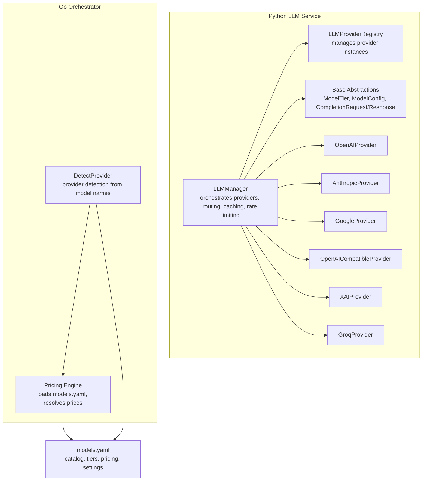
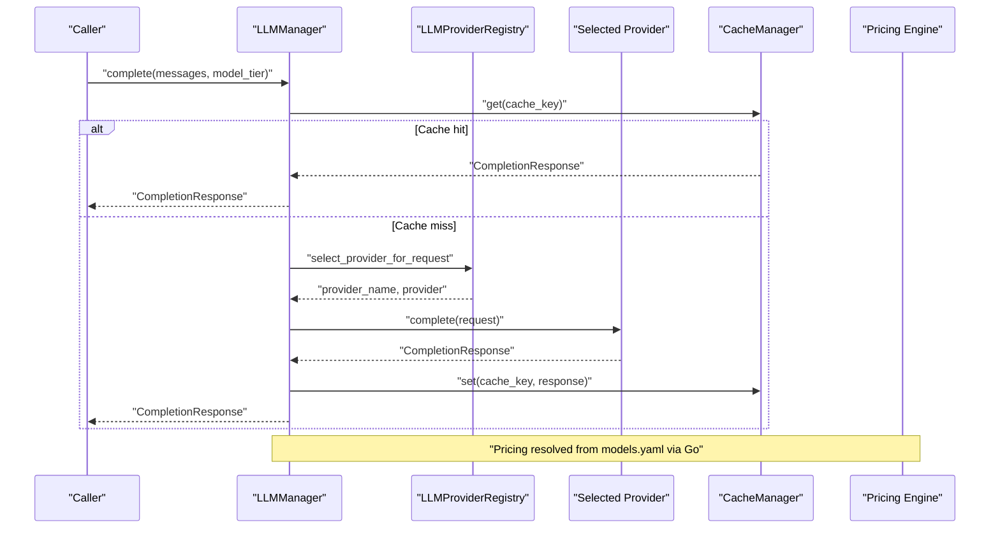
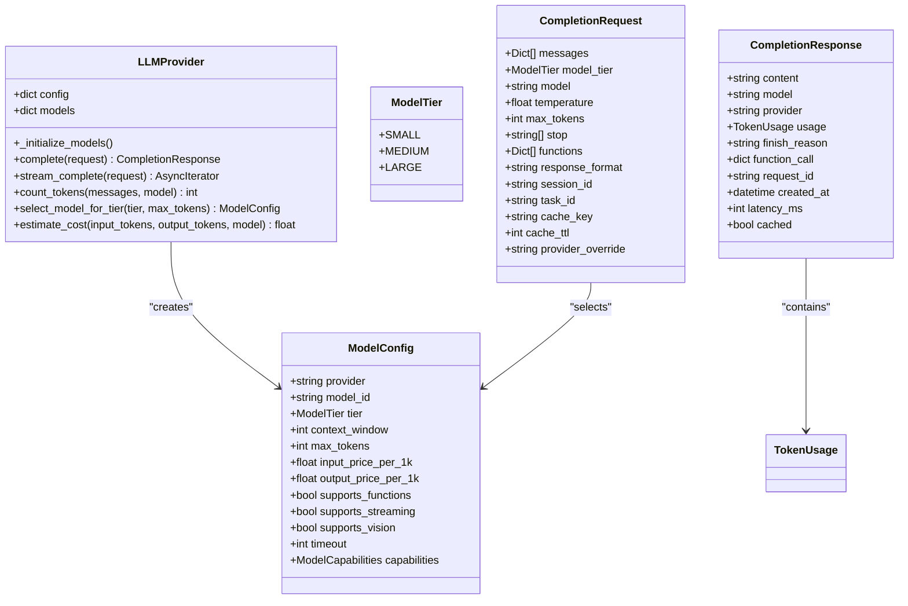
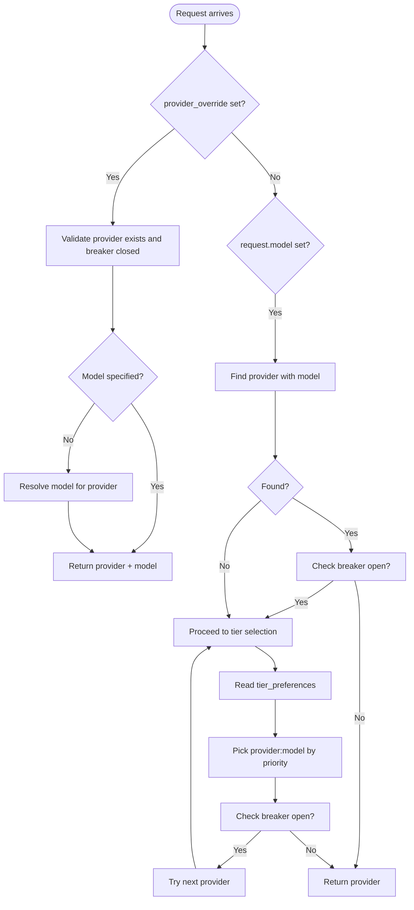
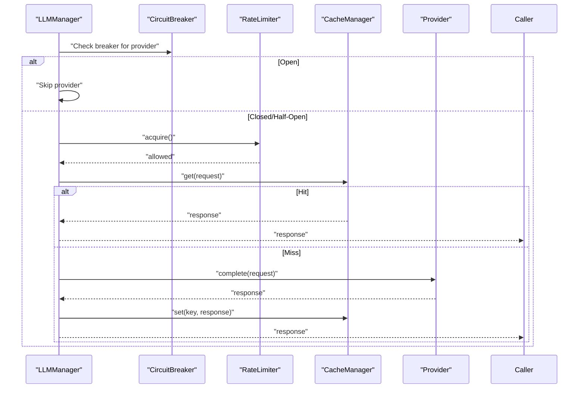
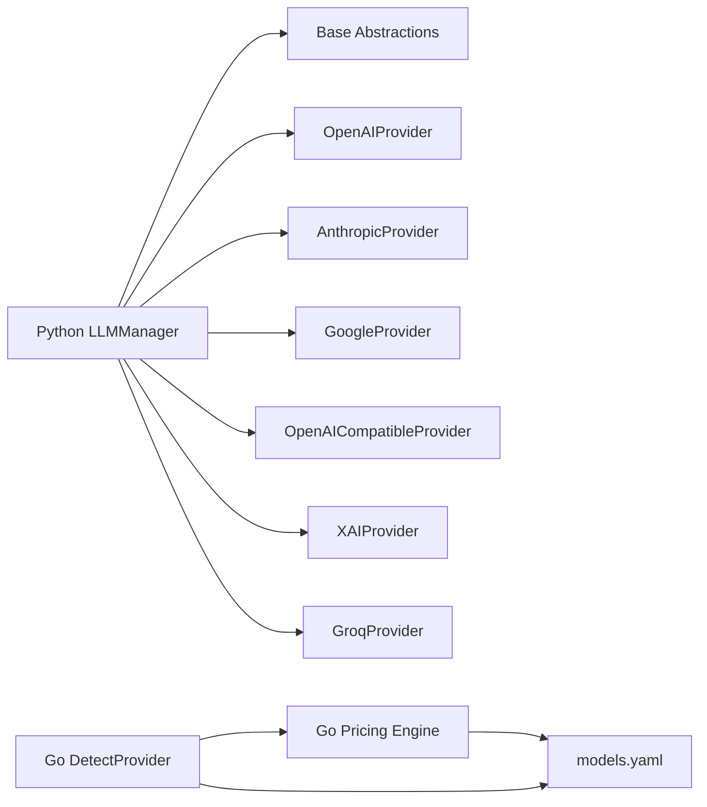

# LLM Provider Integration

<cite>
**Referenced Files in This Document**
- [manager.py](file://python/llm-service/llm_provider/manager.py)
- [base.py](file://python/llm-service/llm_provider/base.py)
- [openai_provider.py](file://python/llm-service/llm_provider/openai_provider.py)
- [anthropic_provider.py](file://python/llm-service/llm_provider/anthropic_provider.py)
- [google_provider.py](file://python/llm-service/llm_provider/google_provider.py)
- [openai_compatible.py](file://python/llm-service/llm_provider/openai_compatible.py)
- [xai_provider.py](file://python/llm-service/llm_provider/xai_provider.py)
- [groq_provider.py](file://python/llm-service/llm_provider/groq_provider.py)
- [models.yaml](file://config/models.yaml)
- [provider.go](file://go/orchestrator/internal/models/provider.go)
- [pricing.go](file://go/orchestrator/internal/pricing/pricing.go)
- [circuit_breaker.go](file://go/orchestrator/internal/circuitbreaker/circuit_breaker.go)
</cite>

## Table of Contents
1. [Introduction](#introduction)
2. [Project Structure](#project-structure)
3. [Core Components](#core-components)
4. [Architecture Overview](#architecture-overview)
5. [Detailed Component Analysis](#detailed-component-analysis)
6. [Dependency Analysis](#dependency-analysis)
7. [Performance Considerations](#performance-considerations)
8. [Troubleshooting Guide](#troubleshooting-guide)
9. [Conclusion](#conclusion)
10. [Appendices](#appendices)

## Introduction
This document explains Shannon's multi-provider LLM integration architecture. It covers the provider abstraction layer supporting 15+ LLM providers (including OpenAI, Anthropic, Google, DeepSeek, Qwen, Groq, X.AI, Mistral, Meta, Cohere, Bedrock, and local models), provider selection algorithms, automatic failover, model tier management, pricing configuration, model availability tracking, performance optimization, provider-specific features and limitations, and operational aspects such as health monitoring, rate limiting, and cost optimization. Practical examples demonstrate configuring multiple providers, setting up model tiers, and implementing custom provider adapters.

## Project Structure
Shannon implements a unified Python provider manager with pluggable provider adapters, complemented by Go-based orchestration for model catalog and pricing resolution. The configuration is centralized in a unified YAML file that defines model catalogs, tiers, pricing, and provider settings.

**Diagram sources**
- [manager.py](file://python/llm-service/llm_provider/manager.py#L110-L800)
- [base.py](file://python/llm-service/llm_provider/base.py#L154-L486)
- [openai_provider.py](file://python/llm-service/llm_provider/openai_provider.py#L17-L802)
- [anthropic_provider.py](file://python/llm-service/llm_provider/anthropic_provider.py#L22-L303)
- [google_provider.py](file://python/llm-service/llm_provider/google_provider.py#L24-L435)
- [openai_compatible.py](file://python/llm-service/llm_provider/openai_compatible.py#L21-L368)
- [xai_provider.py](file://python/llm-service/llm_provider/xai_provider.py#L31-L578)
- [groq_provider.py](file://python/llm-service/llm_provider/groq_provider.py#L23-L266)
- [provider.go](file://go/orchestrator/internal/models/provider.go#L18-L133)
- [pricing.go](file://go/orchestrator/internal/pricing/pricing.go#L17-L428)
- [models.yaml](file://config/models.yaml#L16-L198)

**Section sources**
- [manager.py](file://python/llm-service/llm_provider/manager.py#L110-L800)
- [base.py](file://python/llm-service/llm_provider/base.py#L154-L486)
- [models.yaml](file://config/models.yaml#L16-L198)
- [provider.go](file://go/orchestrator/internal/models/provider.go#L18-L133)
- [pricing.go](file://go/orchestrator/internal/pricing/pricing.go#L17-L428)

## Core Components
- Provider Abstraction Layer
  - LLMProvider base class defines the contract for all providers, including model initialization, completion, streaming, and token counting.
  - ModelTier enumerates small/medium/large tiers for cost and performance optimization.
  - ModelConfig encapsulates provider, model_id, tier, context_window, max_tokens, pricing, and capabilities.
  - CompletionRequest/CompletionResponse unify request/response handling across providers.
- Provider Registry
  - LLMProviderRegistry manages provider instances and tier routing.
- LLMManager
  - Central coordinator that loads configuration, initializes providers, routes requests, applies caching, enforces rate limits, tracks usage, and handles failures/fallbacks.
- Pricing and Catalog Resolution
  - Go-side pricing engine loads models.yaml and resolves pricing and provider mappings.
  - Provider detection logic infers provider from model names using catalog and pattern matching.

**Section sources**
- [base.py](file://python/llm-service/llm_provider/base.py#L18-L486)
- [manager.py](file://python/llm-service/llm_provider/manager.py#L110-L800)
- [pricing.go](file://go/orchestrator/internal/pricing/pricing.go#L17-L428)
- [provider.go](file://go/orchestrator/internal/models/provider.go#L18-L133)

## Architecture Overview
Shannon’s architecture separates concerns between Python (provider orchestration) and Go (catalog/pricing). The Python manager selects providers based on tiers and preferences, applies caching and rate limiting, and streams responses. The Go orchestrator resolves provider mappings and pricing from models.yaml.

**Diagram sources**
- [manager.py](file://python/llm-service/llm_provider/manager.py#L538-L687)
- [base.py](file://python/llm-service/llm_provider/base.py#L309-L361)
- [pricing.go](file://go/orchestrator/internal/pricing/pricing.go#L17-L428)

## Detailed Component Analysis

### Provider Abstraction Layer
- LLMProvider
  - Enforces a uniform interface across providers: complete, stream_complete, count_tokens, select_model_for_tier, estimate_cost.
  - Loads model configurations from YAML and constructs ModelConfig objects with capabilities and pricing.
- ModelTier and ModelConfig
  - Tier-driven selection ensures cost-effective choices for simple tasks and higher-capability models for complex ones.
  - Capabilities include tool/function support, JSON mode, reasoning, vision, and streaming.
- CompletionRequest/CompletionResponse
  - Standardized fields for messages, parameters, session/task metadata, caching, and usage tracking.

**Diagram sources**
- [base.py](file://python/llm-service/llm_provider/base.py#L18-L486)

**Section sources**
- [base.py](file://python/llm-service/llm_provider/base.py#L18-L486)

### Provider Registry and Selection
- LLMProviderRegistry
  - Maintains provider instances and tier routing lists.
  - Provides select_provider_for_request based on tier preferences.
- Provider Selection Logic
  - Priority override via provider_override.
  - Specific model override with breaker checks.
  - Tier-based selection from model_tiers preferences.
  - Circuit breaker gating to avoid failing providers.

**Diagram sources**
- [manager.py](file://python/llm-service/llm_provider/manager.py#L747-L800)
- [base.py](file://python/llm-service/llm_provider/base.py#L309-L361)

**Section sources**
- [manager.py](file://python/llm-service/llm_provider/manager.py#L747-L800)
- [base.py](file://python/llm-service/llm_provider/base.py#L309-L361)

### Provider Implementations

#### OpenAI Provider
- Features
  - Prefers Responses API for reasoning-heavy tasks when supported; falls back to Chat Completions.
  - Handles GPT-5 family nuances (max_completion_tokens, content extraction).
  - Robust token usage extraction with provider-reported usage or estimation.
- Streaming
  - Supports streaming with usage metadata injection.
- Limitations
  - Certain parameters unsupported for GPT-5 chat models.

**Section sources**
- [openai_provider.py](file://python/llm-service/llm_provider/openai_provider.py#L85-L800)

#### Anthropic Provider
- Features
  - Converts messages and tools to Claude format.
  - Handles temperature/top_p exclusivity.
  - Extracts tool_use as function_call for compatibility.
- Limitations
  - No public tokenizer; uses estimation.

**Section sources**
- [anthropic_provider.py](file://python/llm-service/llm_provider/anthropic_provider.py#L101-L303)

#### Google Provider
- Features
  - Converts messages to Gemini format, flattening multi-part content.
  - Uses native async where available; otherwise executor fallback.
  - Extracts usage metadata and estimates when unavailable.
- Limitations
  - Safety settings configurable; defaults permissive.

**Section sources**
- [google_provider.py](file://python/llm-service/llm_provider/google_provider.py#L169-L435)

#### OpenAI-Compatible Providers (DeepSeek, Qwen, Ollama, etc.)
- Features
  - Reuse OpenAI chat completions surface with custom base URLs.
  - Default model catalogs for common providers when none configured.
  - Robust content extraction for list-based responses.
- Limitations
  - Some providers may not return usage; falls back to estimation.

**Section sources**
- [openai_compatible.py](file://python/llm-service/llm_provider/openai_compatible.py#L191-L368)

#### X.AI Provider
- Features
  - Intentionally OpenAI-compatible; prefers Responses API for reasoning models.
  - Sanitizes messages to avoid rejected fields.
  - Tracks Live Search surcharge in cost calculation.
- Limitations
  - Does not support response_format, user, or seed; certain stop parameters for reasoning models.

**Section sources**
- [xai_provider.py](file://python/llm-service/llm_provider/xai_provider.py#L157-L578)

#### Groq Provider
- Features
  - OpenAI-compatible client with Groq base URL.
  - Supports functions and tool calling for compatible models.
- Limitations
  - Validates API key format; otherwise similar to OpenAI-compatible.

**Section sources**
- [groq_provider.py](file://python/llm-service/llm_provider/groq_provider.py#L63-L266)

### Caching, Rate Limiting, and Resilience
- Caching
  - LLMManager caches CompletionResponse keyed by normalized request parameters.
  - Supports in-memory cache or Redis cache backend if available.
  - Skips cache for unsafe/invalid responses and strict JSON modes.
- Rate Limiting
  - Per-provider RateLimiter enforces requests-per-minute windows.
- Resilience
  - Circuit Breaker per provider guards against repeated failures.
  - Hedged requests can be enabled to race primary and fallback providers.
  - Automatic fallback to alternate providers when configured.

**Diagram sources**
- [manager.py](file://python/llm-service/llm_provider/manager.py#L538-L687)
- [circuit_breaker.go](file://go/orchestrator/internal/circuitbreaker/circuit_breaker.go#L96-L145)

**Section sources**
- [manager.py](file://python/llm-service/llm_provider/manager.py#L462-L502)
- [manager.py](file://python/llm-service/llm_provider/manager.py#L600-L687)
- [circuit_breaker.go](file://go/orchestrator/internal/circuitbreaker/circuit_breaker.go#L96-L145)

### Pricing Configuration and Model Availability
- Centralized Pricing
  - models.yaml contains pricing per model/provider and defaults.
  - Go pricing engine loads models.yaml and resolves prices for cost calculations.
- Model Catalog and Tiers
  - model_catalog defines provider.model_id, tier, context_window, max_tokens, capabilities.
  - model_tiers define ordered provider:model entries by priority per tier.
- Provider Settings
  - provider_settings define base URLs, timeouts, and retries per provider.
- Capability Flags
  - model_capabilities lists multimodal, thinking, coding specialists, and long-context models.

**Section sources**
- [models.yaml](file://config/models.yaml#L16-L198)
- [models.yaml](file://config/models.yaml#L199-L776)
- [pricing.go](file://go/orchestrator/internal/pricing/pricing.go#L17-L428)

### Provider Detection and Catalog Resolution
- DetectProvider
  - Infers provider from model names using models.yaml catalog and pattern matching.
  - Special-case handling for Groq and Meta→Ollama mapping for Llama models.
- Reverse Lookup
  - GetProviderForModel finds which provider offers a given model across tiers.

**Section sources**
- [provider.go](file://go/orchestrator/internal/models/provider.go#L18-L133)
- [pricing.go](file://go/orchestrator/internal/pricing/pricing.go#L396-L427)

### Practical Examples

#### Example: Configure Multiple Providers
- Environment-based initialization
  - Set environment variables for each provider (e.g., OPENAI_API_KEY, ANTHROPIC_API_KEY, GOOGLE_API_KEY, GROQ_API_KEY, XAI_API_KEY).
  - LLMManager auto-detects providers from environment and loads models.yaml for model definitions.
- Explicit configuration
  - Define providers in models.yaml under model_catalog and provider_settings.
  - Configure model_tiers with provider:model priorities per tier.

**Section sources**
- [manager.py](file://python/llm-service/llm_provider/manager.py#L218-L264)
- [models.yaml](file://config/models.yaml#L138-L198)

#### Example: Set Up Model Tiers
- Define model_tiers.small/medium/large with ordered provider:model entries and priority.
- Use selection_strategy.mode and fallback settings to control selection behavior.

**Section sources**
- [models.yaml](file://config/models.yaml#L16-L122)

#### Example: Implement a Custom Provider Adapter
- Subclass LLMProvider and implement:
  - _initialize_models to populate self.models from YAML or defaults.
  - complete(request) and stream_complete(request) with provider-specific logic.
  - count_tokens(messages, model) using provider tokenizer or estimation.
- Register the provider in LLMManager._initialize_providers with appropriate type mapping.

**Section sources**
- [base.py](file://python/llm-service/llm_provider/base.py#L154-L201)
- [manager.py](file://python/llm-service/llm_provider/manager.py#L266-L343)

## Dependency Analysis
- Python Manager depends on provider adapters and base abstractions.
- Go pricing and provider detection depend on models.yaml.
- Inter-module dependencies:
  - Python LLMManager → provider adapters → OpenAI SDKs/HTTP clients.
  - Go DetectProvider → pricing engine → models.yaml.
  - Both systems coordinate around unified models.yaml for pricing and catalog.

**Diagram sources**
- [manager.py](file://python/llm-service/llm_provider/manager.py#L266-L343)
- [provider.go](file://go/orchestrator/internal/models/provider.go#L18-L133)
- [pricing.go](file://go/orchestrator/internal/pricing/pricing.go#L17-L428)
- [models.yaml](file://config/models.yaml#L16-L198)

**Section sources**
- [manager.py](file://python/llm-service/llm_provider/manager.py#L266-L343)
- [provider.go](file://go/orchestrator/internal/models/provider.go#L18-L133)
- [pricing.go](file://go/orchestrator/internal/pricing/pricing.go#L17-L428)

## Performance Considerations
- Cost Optimization
  - Use ModelTier.SMALL for simple tasks; leverage model_tiers.small for cost-first routing.
  - Centralized pricing in models.yaml enables consistent cost tracking across services.
- Latency Reduction
  - Enable hedged requests (when safe) to race primary and fallback providers.
  - Use streaming APIs where supported to reduce perceived latency.
- Throughput
  - Per-provider RateLimiter enforces RPM windows; tune provider_settings.max_retries and timeouts.
  - Redis cache reduces repeated compute; ensure cache TTL aligns with content volatility.

[No sources needed since this section provides general guidance]

## Troubleshooting Guide
- Provider Failures
  - Circuit Breaker opens after consecutive failures; monitor state and adjust thresholds.
  - Automatic fallback to alternate providers when configured.
- Cache Issues
  - Cache poisoning protections for strict JSON modes; cache skips truncated/filtered outputs.
- Token Counting
  - Some providers lack tokenizers; base estimator used with overhead adjustments.
- Streaming
  - Provider-specific streaming differences; normalize by yielding text and usage metadata.

**Section sources**
- [manager.py](file://python/llm-service/llm_provider/manager.py#L554-L591)
- [manager.py](file://python/llm-service/llm_provider/manager.py#L670-L686)
- [circuit_breaker.go](file://go/orchestrator/internal/circuitbreaker/circuit_breaker.go#L130-L145)

## Conclusion
Shannon’s multi-provider architecture combines a robust Python provider abstraction with Go-based catalog/pricing resolution. The system emphasizes cost-aware tier selection, automatic failover, resilient caching and rate limiting, and unified configuration via models.yaml. Provider-specific adapters encapsulate API differences while maintaining a consistent interface, enabling scalable and cost-effective LLM usage across diverse providers and environments.

## Appendices

### Provider Selection and Migration Notes
- Provider Override
  - Use provider_override to force a specific provider; breaker checks apply.
- Model Updates
  - Update models.yaml to reflect new models and pricing; reload pricing in Go services.
- Compatibility Management
  - Use provider_settings.base_url and timeouts to adapt to endpoint changes.
  - Leverage DetectProvider and GetProviderForModel for runtime mapping and diagnostics.

**Section sources**
- [manager.py](file://python/llm-service/llm_provider/manager.py#L747-L763)
- [provider.go](file://go/orchestrator/internal/models/provider.go#L18-L133)
- [pricing.go](file://go/orchestrator/internal/pricing/pricing.go#L396-L427)