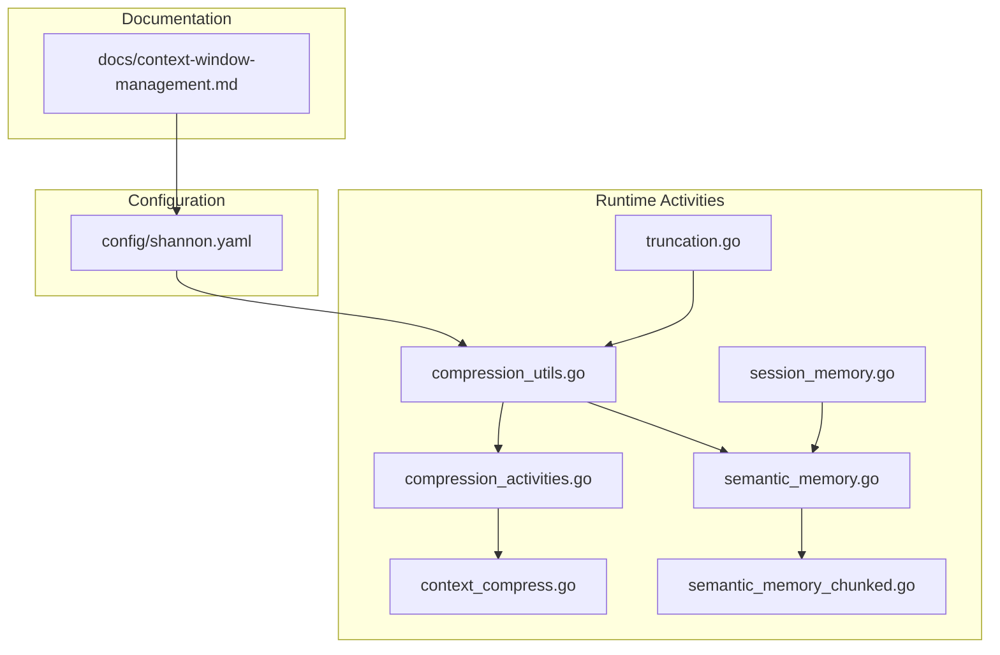
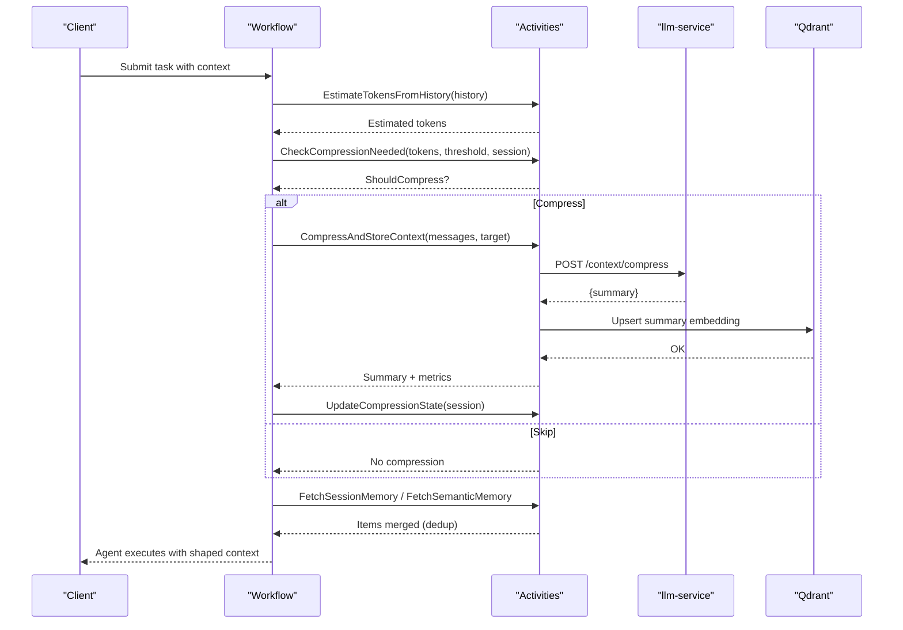
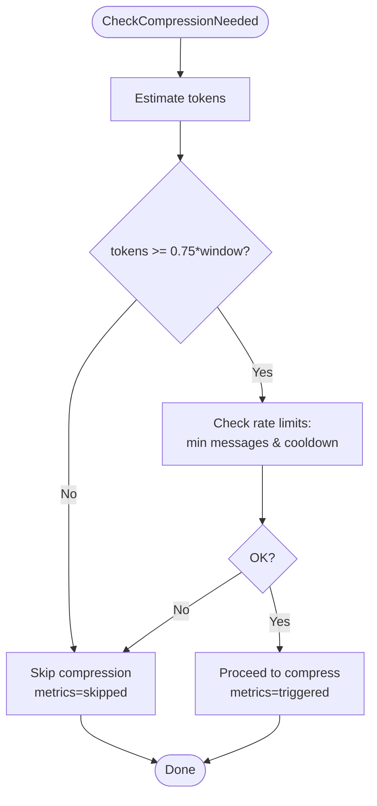
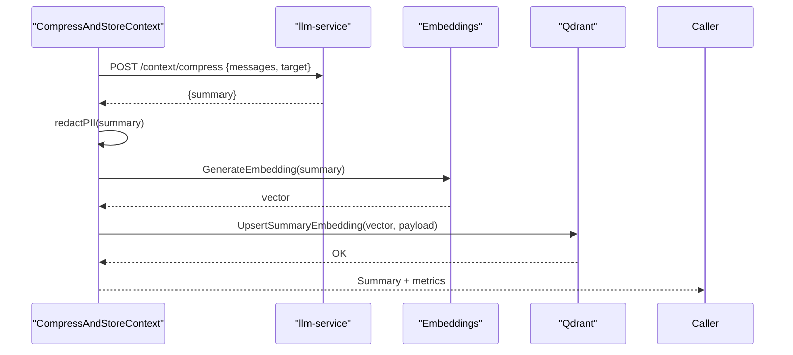
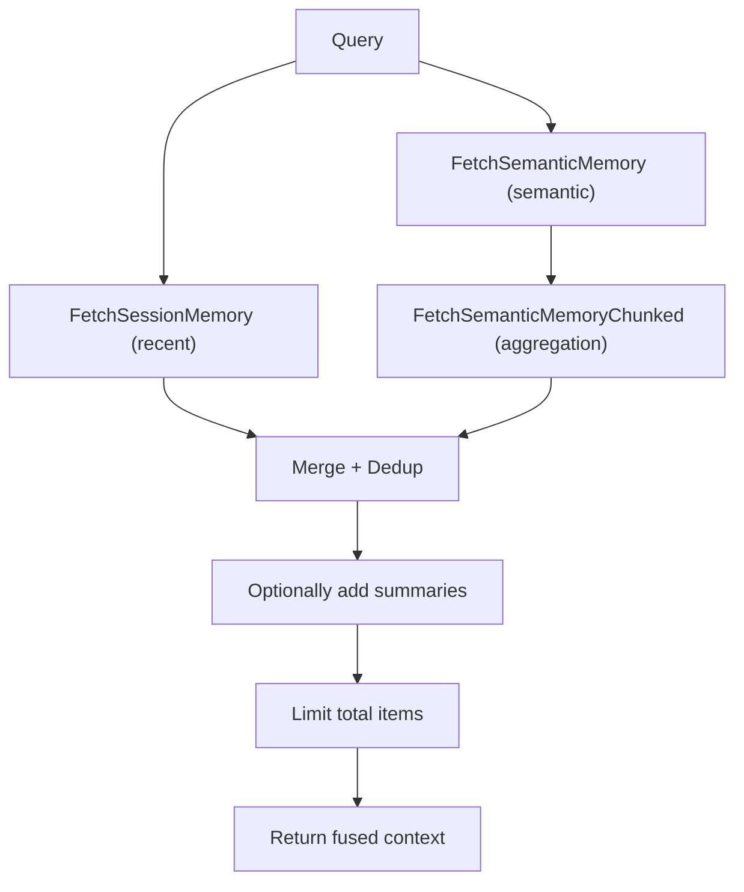
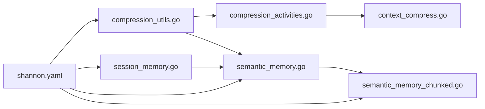

# Context Window Management

<cite>
**Referenced Files in This Document**
- [context-window-management.md](file://docs/context-window-management.md)
- [context_compress.go](file://go/orchestrator/internal/activities/context_compress.go)
- [compression_activities.go](file://go/orchestrator/internal/activities/compression_activities.go)
- [compression_utils.go](file://go/orchestrator/internal/activities/compression_utils.go)
- [truncation.go](file://go/orchestrator/internal/activities/truncation.go)
- [agent_truncate_test.go](file://go/orchestrator/internal/activities/agent_truncate_test.go)
- [session_memory.go](file://go/orchestrator/internal/activities/session_memory.go)
- [semantic_memory.go](file://go/orchestrator/internal/activities/semantic_memory.go)
- [semantic_memory_chunked.go](file://go/orchestrator/internal/activities/semantic_memory_chunked.go)
- [shannon.yaml](file://config/shannon.yaml)
</cite>

## Table of Contents
1. [Introduction](#introduction)
2. [Project Structure](#project-structure)
3. [Core Components](#core-components)
4. [Architecture Overview](#architecture-overview)
5. [Detailed Component Analysis](#detailed-component-analysis)
6. [Dependency Analysis](#dependency-analysis)
7. [Performance Considerations](#performance-considerations)
8. [Troubleshooting Guide](#troubleshooting-guide)
9. [Conclusion](#conclusion)
10. [Appendices](#appendices)

## Introduction
This document explains how Shannon’s memory system manages the LLM context window to sustain long-running, multi-turn conversations while optimizing token usage, cost, and performance. It covers intelligent truncation and compression strategies, including summarization, selective retention, and priority-based content filtering. It also documents configuration knobs, thresholds, and tuning practices, and addresses edge cases such as long sessions, multi-agent workflows, and context overflow.

## Project Structure
The context window management spans documentation, configuration, and runtime activities:
- Documentation defines presets, budgets, and compression behavior
- Configuration files define defaults and tunables
- Activities implement token estimation, compression checks, summarization, and memory retrieval

**Diagram sources**
- [context-window-management.md](file://docs/context-window-management.md#L1-L370)
- [shannon.yaml](file://config/shannon.yaml#L23-L107)
- [compression_utils.go](file://go/orchestrator/internal/activities/compression_utils.go#L18-L67)
- [compression_activities.go](file://go/orchestrator/internal/activities/compression_activities.go#L26-L89)
- [context_compress.go](file://go/orchestrator/internal/activities/context_compress.go#L42-L177)
- [semantic_memory.go](file://go/orchestrator/internal/activities/semantic_memory.go#L50-L221)
- [semantic_memory_chunked.go](file://go/orchestrator/internal/activities/semantic_memory_chunked.go#L16-L276)
- [session_memory.go](file://go/orchestrator/internal/activities/session_memory.go#L26-L67)
- [truncation.go](file://go/orchestrator/internal/activities/truncation.go#L3-L17)

**Section sources**
- [context-window-management.md](file://docs/context-window-management.md#L1-L370)
- [shannon.yaml](file://config/shannon.yaml#L23-L107)

## Core Components
- Token budget and window sizing: configurable defaults and request overrides
- Compression triggers and rate limiting: token threshold and session-based cooldowns
- Summarization pipeline: external LLM service call, PII redaction, embedding, and vector store upsert
- Memory retrieval: recent and semantic memory with hierarchical fusion and deduplication
- Truncation safeguards: streaming and prompt-length limits

**Section sources**
- [context-window-management.md](file://docs/context-window-management.md#L64-L122)
- [compression_activities.go](file://go/orchestrator/internal/activities/compression_activities.go#L26-L89)
- [context_compress.go](file://go/orchestrator/internal/activities/context_compress.go#L42-L177)
- [semantic_memory.go](file://go/orchestrator/internal/activities/semantic_memory.go#L50-L221)
- [truncation.go](file://go/orchestrator/internal/activities/truncation.go#L3-L17)

## Architecture Overview
The system estimates token usage, decides whether to compress, and shapes context by retaining primers and recents while injecting a compressed summary. Memory retrieval augments context with recent and semantic items.

**Diagram sources**
- [compression_utils.go](file://go/orchestrator/internal/activities/compression_utils.go#L69-L153)
- [compression_activities.go](file://go/orchestrator/internal/activities/compression_activities.go#L26-L89)
- [context_compress.go](file://go/orchestrator/internal/activities/context_compress.go#L42-L177)
- [semantic_memory.go](file://go/orchestrator/internal/activities/semantic_memory.go#L50-L221)
- [session_memory.go](file://go/orchestrator/internal/activities/session_memory.go#L26-L67)

## Detailed Component Analysis

### Token Budget and Window Management
- Presets and overrides:
  - Default window sizes and debugging preset
  - Request-level overrides via context fields
  - Environment variables for operational control
- Budgets:
  - Per-agent and per-task budgets with enforcement modes
  - Global defaults in configuration and runtime clamping via environment/request

Practical configuration examples and tuning guidance are documented in the context window guide.

**Section sources**
- [context-window-management.md](file://docs/context-window-management.md#L9-L27)
- [context-window-management.md](file://docs/context-window-management.md#L64-L122)
- [shannon.yaml](file://config/shannon.yaml#L23-L28)

### Compression Decision Engine
- Threshold-based trigger: compression activates when estimated tokens exceed 75% of model window
- Rate limiting: minimum message delta and cooldown period enforced via session state
- Metrics and logging: event counters and reasons for skipping/triggering

**Diagram sources**
- [compression_activities.go](file://go/orchestrator/internal/activities/compression_activities.go#L26-L89)
- [compression_utils.go](file://go/orchestrator/internal/activities/compression_utils.go#L69-L153)

**Section sources**
- [compression_activities.go](file://go/orchestrator/internal/activities/compression_activities.go#L26-L89)
- [compression_utils.go](file://go/orchestrator/internal/activities/compression_utils.go#L69-L153)

### Summarization and Storage Pipeline
- Calls external LLM service to generate a compressed summary of middle context
- Applies best-effort PII redaction before storage
- Generates embedding and upserts summary into vector database for later retrieval
- Records compression metrics and ratio histograms

**Diagram sources**
- [context_compress.go](file://go/orchestrator/internal/activities/context_compress.go#L42-L177)

**Section sources**
- [context_compress.go](file://go/orchestrator/internal/activities/context_compress.go#L42-L177)

### Memory Retrieval and Hierarchical Fusion
- Recent memory: fetches recent items from vector store for a session
- Semantic memory: performs embedding-based similarity search with chunk aggregation
- Hierarchical fusion: merges recent, semantic, and summary items with deduplication and source tagging
- Limits total items to prevent context explosion

**Diagram sources**
- [semantic_memory.go](file://go/orchestrator/internal/activities/semantic_memory.go#L50-L221)
- [semantic_memory_chunked.go](file://go/orchestrator/internal/activities/semantic_memory_chunked.go#L16-L276)
- [session_memory.go](file://go/orchestrator/internal/activities/session_memory.go#L26-L67)

**Section sources**
- [semantic_memory.go](file://go/orchestrator/internal/activities/semantic_memory.go#L50-L221)
- [semantic_memory_chunked.go](file://go/orchestrator/internal/activities/semantic_memory_chunked.go#L16-L276)
- [session_memory.go](file://go/orchestrator/internal/activities/session_memory.go#L26-L67)

### Truncation Safeguards
- Centralized limits for streaming outputs and prompts to avoid oversized payloads
- UTF-8-safe truncation tests ensure correctness across languages and emoji

**Section sources**
- [truncation.go](file://go/orchestrator/internal/activities/truncation.go#L3-L17)
- [agent_truncate_test.go](file://go/orchestrator/internal/activities/agent_truncate_test.go#L7-L151)

## Dependency Analysis
- Activities depend on:
  - Embeddings service for vectorization
  - Vector DB for storage and retrieval
  - Session manager for compression state
  - LLM service for summarization
- Configuration ties together budgets, window sizes, and vector DB settings

**Diagram sources**
- [compression_utils.go](file://go/orchestrator/internal/activities/compression_utils.go#L18-L67)
- [compression_activities.go](file://go/orchestrator/internal/activities/compression_activities.go#L26-L89)
- [context_compress.go](file://go/orchestrator/internal/activities/context_compress.go#L42-L177)
- [semantic_memory.go](file://go/orchestrator/internal/activities/semantic_memory.go#L50-L221)
- [semantic_memory_chunked.go](file://go/orchestrator/internal/activities/semantic_memory_chunked.go#L16-L276)
- [session_memory.go](file://go/orchestrator/internal/activities/session_memory.go#L26-L67)
- [shannon.yaml](file://config/shannon.yaml#L23-L107)

**Section sources**
- [shannon.yaml](file://config/shannon.yaml#L23-L107)

## Performance Considerations
- Compression effectiveness increases with longer histories; substantial token savings observed for large histories
- Latency impact includes brief overhead for summary generation and vector operations
- Memory footprint minimized by storing only shaped history in workflows and caching summaries in vector DB

**Section sources**
- [context-window-management.md](file://docs/context-window-management.md#L219-L242)

## Troubleshooting Guide
Common issues and remedies:
- Context seems truncated: increase window size or use debugging preset; inspect compression events
- Token budget exceeded: raise per-agent or per-task budgets; ensure compression is triggered
- Compression not triggering: lower per-request budget to force trigger; verify message count and token estimation thresholds
- Compression too aggressive: adjust primers and recents counts; tune target ratio

**Section sources**
- [context-window-management.md](file://docs/context-window-management.md#L307-L347)

## Conclusion
Shannon’s context window management balances continuity and efficiency through configurable windows, token-aware compression, and memory fusion. By combining summarization, selective retention, and robust safeguards, it sustains long-running, multi-turn conversations while controlling cost and latency.

## Appendices

### Practical Configuration Examples
- Environment variables for window sizes, budgets, and compression thresholds
- YAML configuration for defaults and vector DB settings
- Request-level overrides for per-task tuning

**Section sources**
- [context-window-management.md](file://docs/context-window-management.md#L64-L122)
- [shannon.yaml](file://config/shannon.yaml#L23-L107)