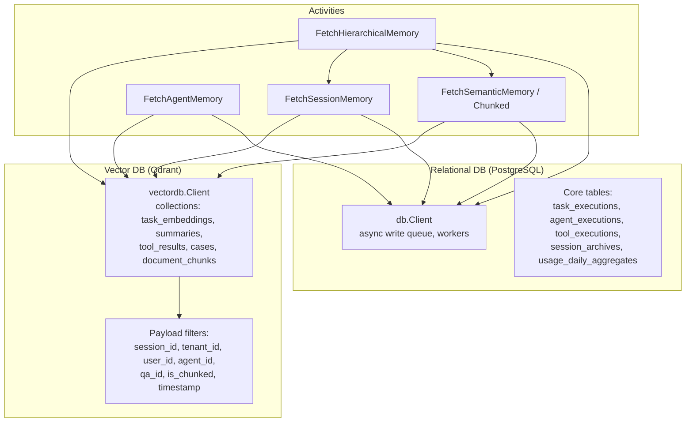
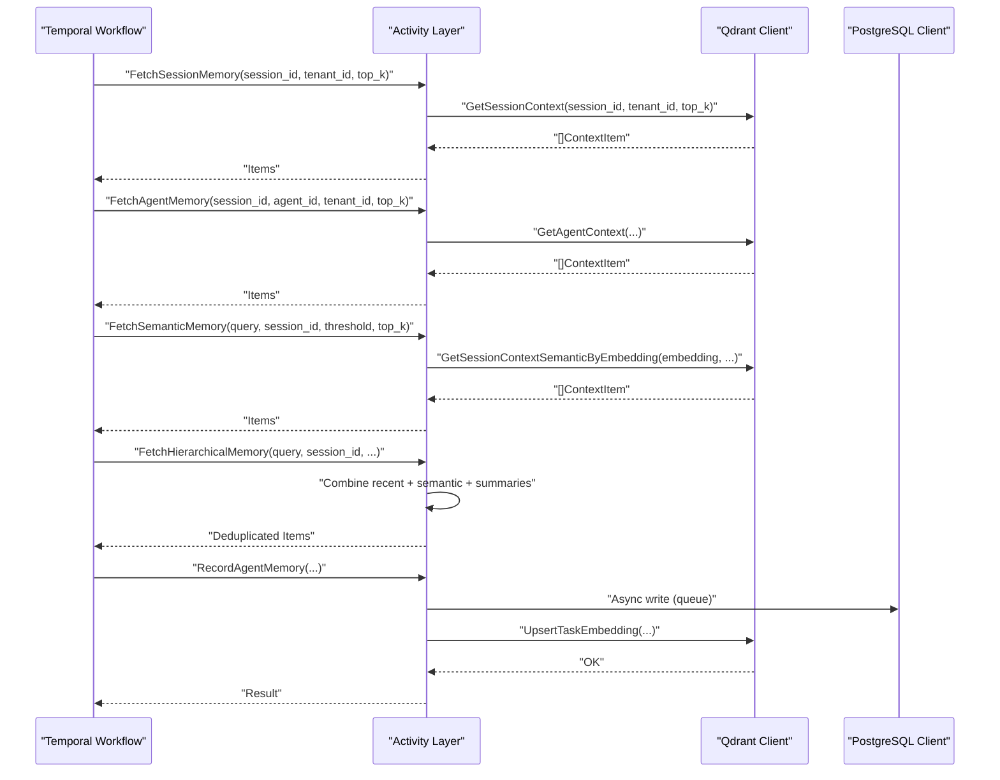
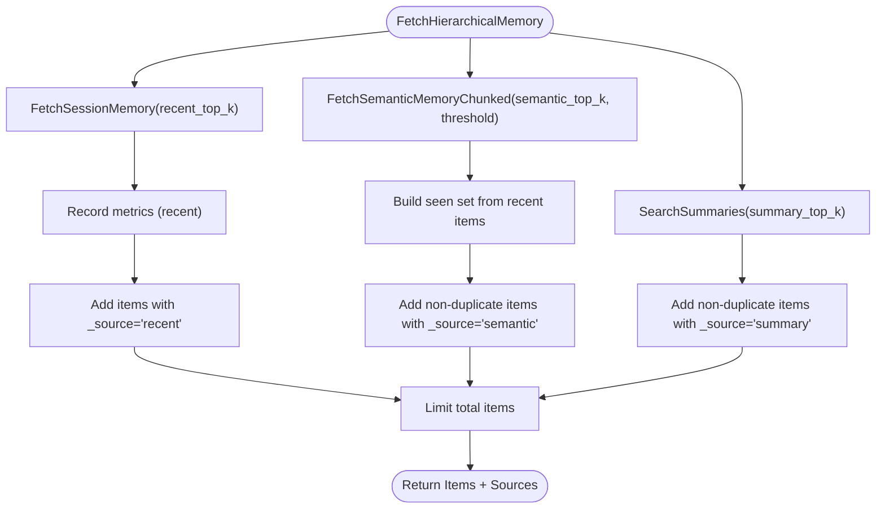
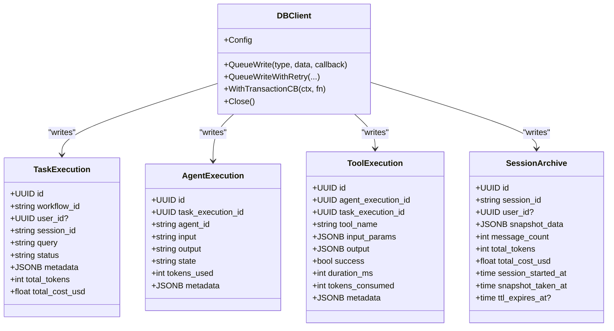
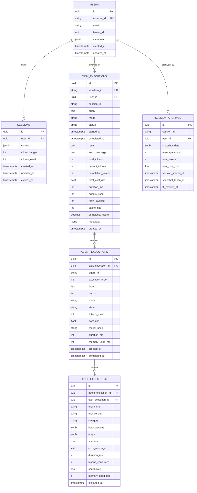
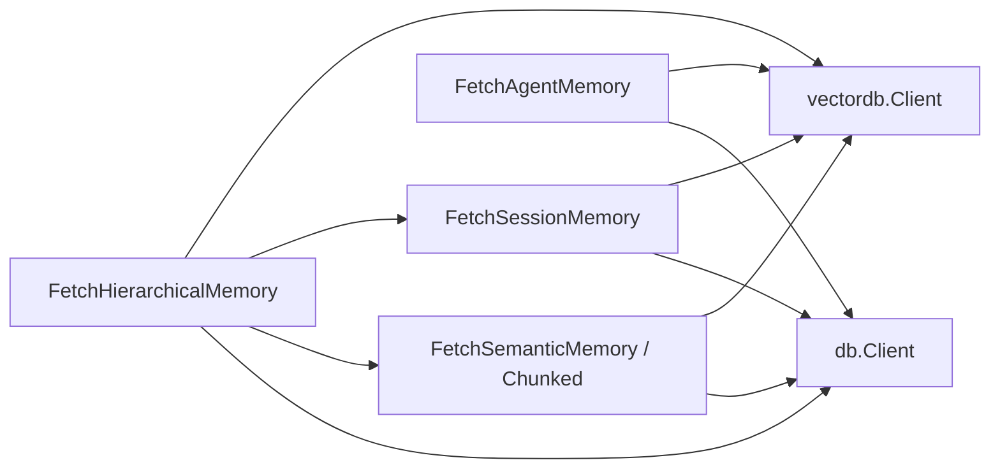

# Memory Persistence and Retrieval

<cite>
**Referenced Files in This Document**
- [agent_memory.go](file://go/orchestrator/internal/activities/agent_memory.go)
- [session_memory.go](file://go/orchestrator/internal/activities/session_memory.go)
- [semantic_memory.go](file://go/orchestrator/internal/activities/semantic_memory.go)
- [semantic_memory_chunked.go](file://go/orchestrator/internal/activities/semantic_memory_chunked.go)
- [client.go (vector DB)](file://go/orchestrator/internal/vectordb/client.go)
- [models.go (PostgreSQL)](file://go/orchestrator/internal/db/models.go)
- [client.go (PostgreSQL)](file://go/orchestrator/internal/db/client.go)
- [001_initial_schema.sql](file://migrations/postgres/001_initial_schema.sql)
- [002_persistence_tables.sql](file://migrations/postgres/002_persistence_tables.sql)
- [create_collections.py](file://migrations/qdrant/create_collections.py)
</cite>

## Table of Contents
1. [Introduction](#introduction)
2. [Project Structure](#project-structure)
3. [Core Components](#core-components)
4. [Architecture Overview](#architecture-overview)
5. [Detailed Component Analysis](#detailed-component-analysis)
6. [Dependency Analysis](#dependency-analysis)
7. [Performance Considerations](#performance-considerations)
8. [Troubleshooting Guide](#troubleshooting-guide)
9. [Conclusion](#conclusion)
10. [Appendices](#appendices)

## Introduction
This document explains how Shannon persists and retrieves conversational history, agent memories, and contextual data across sessions and system restarts. It covers the dual-layer persistence architecture: PostgreSQL for structured execution and audit data, and Qdrant for vectorized semantic memory and fast similarity search. It also documents database schema, indexing strategies, data lifecycle management, session continuity, backup and restore procedures, data migration strategies, archival policies, consistency guarantees, and performance optimizations for large-scale memory storage.

## Project Structure
The memory system spans three primary areas:
- Vector database (Qdrant) for semantic memory and similarity search
- Relational database (PostgreSQL) for structured execution, auditing, and analytics
- Activity layer that orchestrates memory reads/writes across sessions and agents

**Diagram sources**
- [client.go (vector DB)](file://go/orchestrator/internal/vectordb/client.go#L1-L439)
- [session_memory.go](file://go/orchestrator/internal/activities/session_memory.go#L1-L68)
- [agent_memory.go](file://go/orchestrator/internal/activities/agent_memory.go#L1-L89)
- [semantic_memory.go](file://go/orchestrator/internal/activities/semantic_memory.go#L1-L222)
- [semantic_memory_chunked.go](file://go/orchestrator/internal/activities/semantic_memory_chunked.go#L1-L351)
- [client.go (PostgreSQL)](file://go/orchestrator/internal/db/client.go#L1-L498)
- [models.go (PostgreSQL)](file://go/orchestrator/internal/db/models.go#L1-L245)

**Section sources**
- [client.go (vector DB)](file://go/orchestrator/internal/vectordb/client.go#L1-L439)
- [client.go (PostgreSQL)](file://go/orchestrator/internal/db/client.go#L1-L498)
- [models.go (PostgreSQL)](file://go/orchestrator/internal/db/models.go#L1-L245)

## Core Components
- Vector DB client: Provides semantic search, upsert, and collection management for embeddings and summaries.
- Activity layer: Implements fetching and recording of session, agent, and semantic memory with deduplication and chunk aggregation.
- Relational DB client: Manages asynchronous writes for task, agent, tool, session archive, and audit logs with batching and health checks.
- Database schema: Defines tables and indexes for structured persistence and analytics.

Key responsibilities:
- Persist Q&A pairs and summaries as embeddings with session/tenant/user/agent filters.
- Retrieve recent and semantic context with optional diversity re-ranking.
- Archive session snapshots and maintain daily usage aggregates.
- Enforce graceful degradation and circuit-breaking for resilience.

**Section sources**
- [client.go (vector DB)](file://go/orchestrator/internal/vectordb/client.go#L1-L439)
- [session_memory.go](file://go/orchestrator/internal/activities/session_memory.go#L1-L68)
- [agent_memory.go](file://go/orchestrator/internal/activities/agent_memory.go#L1-L89)
- [semantic_memory.go](file://go/orchestrator/internal/activities/semantic_memory.go#L1-L222)
- [semantic_memory_chunked.go](file://go/orchestrator/internal/activities/semantic_memory_chunked.go#L1-L351)
- [client.go (PostgreSQL)](file://go/orchestrator/internal/db/client.go#L1-L498)
- [models.go (PostgreSQL)](file://go/orchestrator/internal/db/models.go#L1-L245)

## Architecture Overview
The memory architecture integrates vector and relational persistence with Temporal activities:

**Diagram sources**
- [session_memory.go](file://go/orchestrator/internal/activities/session_memory.go#L1-L68)
- [agent_memory.go](file://go/orchestrator/internal/activities/agent_memory.go#L1-L89)
- [semantic_memory.go](file://go/orchestrator/internal/activities/semantic_memory.go#L1-L222)
- [semantic_memory_chunked.go](file://go/orchestrator/internal/activities/semantic_memory_chunked.go#L1-L351)
- [client.go (vector DB)](file://go/orchestrator/internal/vectordb/client.go#L1-L439)
- [client.go (PostgreSQL)](file://go/orchestrator/internal/db/client.go#L1-L498)

## Detailed Component Analysis

### Vector Memory Retrieval and Storage
- Session memory: Retrieves recent items scoped to a session and tenant, emitting progress events and metrics.
- Agent memory: Filters by both session and agent identifiers for agent-scoped context.
- Semantic memory: Generates embeddings for queries and performs similarity search with optional MMR diversity re-ranking and chunk aggregation.
- Hierarchical memory: Combines recent, semantic, and summary results with deduplication across sources.

**Diagram sources**
- [semantic_memory.go](file://go/orchestrator/internal/activities/semantic_memory.go#L50-L222)
- [semantic_memory_chunked.go](file://go/orchestrator/internal/activities/semantic_memory_chunked.go#L16-L276)
- [session_memory.go](file://go/orchestrator/internal/activities/session_memory.go#L26-L67)

**Section sources**
- [session_memory.go](file://go/orchestrator/internal/activities/session_memory.go#L1-L68)
- [agent_memory.go](file://go/orchestrator/internal/activities/agent_memory.go#L1-L89)
- [semantic_memory.go](file://go/orchestrator/internal/activities/semantic_memory.go#L1-L222)
- [semantic_memory_chunked.go](file://go/orchestrator/internal/activities/semantic_memory_chunked.go#L1-L351)
- [client.go (vector DB)](file://go/orchestrator/internal/vectordb/client.go#L232-L438)

### Relational Persistence and Async Writes
- Asynchronous write queue with configurable workers batches writes for task, agent, tool, session archive, and audit logs.
- Health checks and circuit-breaker protection for database operations.
- Structured models define JSONB fields for flexible payloads and metadata.

**Diagram sources**
- [client.go (PostgreSQL)](file://go/orchestrator/internal/db/client.go#L1-L498)
- [models.go (PostgreSQL)](file://go/orchestrator/internal/db/models.go#L62-L170)

**Section sources**
- [client.go (PostgreSQL)](file://go/orchestrator/internal/db/client.go#L1-L498)
- [models.go (PostgreSQL)](file://go/orchestrator/internal/db/models.go#L1-L245)

### Database Schema and Indexing Strategies
- Initial schema establishes users, sessions, prompts, learning cases, token usage, and audit logs with appropriate indexes.
- Persistence tables add task_executions, agent_executions, tool_executions, session_archives, and usage_daily_aggregates with foreign keys and indexes.
- Qdrant collections include task_embeddings, tool_results, cases, document_chunks, and summaries with payload indexes for session/tenant/user/agent and temporal fields.

**Diagram sources**
- [001_initial_schema.sql](file://migrations/postgres/001_initial_schema.sql#L9-L141)
- [002_persistence_tables.sql](file://migrations/postgres/002_persistence_tables.sql#L8-L254)

**Section sources**
- [001_initial_schema.sql](file://migrations/postgres/001_initial_schema.sql#L1-L141)
- [002_persistence_tables.sql](file://migrations/postgres/002_persistence_tables.sql#L1-L254)

### Session Continuity and Data Lifecycle
- Session continuity: Activities filter by session_id and tenant_id to maintain coherent context across agent interactions and workflow executions.
- Data lifecycle: Qdrant payloads include timestamps and identifiers enabling recent-first retrieval and deduplication. PostgreSQL tables track execution history, usage, and audits for lifecycle management and analytics.

**Section sources**
- [session_memory.go](file://go/orchestrator/internal/activities/session_memory.go#L26-L67)
- [semantic_memory.go](file://go/orchestrator/internal/activities/semantic_memory.go#L50-L222)
- [client.go (vector DB)](file://go/orchestrator/internal/vectordb/client.go#L232-L438)
- [models.go (PostgreSQL)](file://go/orchestrator/internal/db/models.go#L62-L170)

### Practical Examples: Backup, Restore, Migration, Archival
- Backup and restore:
  - PostgreSQL: Use logical backups (e.g., pg_dump/pg_restore) for task_executions, agent_executions, tool_executions, session_archives, and audit_logs.
  - Qdrant: Back up collection data externally (e.g., export points) and recreate collections with payload indexes.
- Data migration:
  - Apply SQL migrations in order; ensure foreign keys and indexes are created as per migration scripts.
  - For vector data, re-index or re-upsert points after schema changes.
- Archival:
  - Periodic snapshots of session state are stored in session_archives for long-term retention and offline analysis.

**Section sources**
- [002_persistence_tables.sql](file://migrations/postgres/002_persistence_tables.sql#L112-L134)
- [create_collections.py](file://migrations/qdrant/create_collections.py#L44-L227)

### Relationship Between In-Memory Caching and Persistent Storage
- In-memory caching: Not explicitly implemented in the referenced code; vector and relational persistence are the primary stores.
- Persistent storage: Qdrant for embeddings and summaries; PostgreSQL for structured execution and audit data.
- Consistency: Activities gracefully degrade when services are unavailable; async writes ensure durability without blocking workflows.
- Eventual consistency: Vector search results may lag behind latest upserts by refresh intervals; deduplication mitigates stale overlaps.

**Section sources**
- [client.go (vector DB)](file://go/orchestrator/internal/vectordb/client.go#L96-L169)
- [client.go (PostgreSQL)](file://go/orchestrator/internal/db/client.go#L148-L196)

### Data Retention, GDPR Compliance, Secure Deletion
- Retention: Configure TTL on session_archives and Qdrant payload timestamps; implement soft-delete patterns for sessions.
- GDPR: Provide user-centric deletion by filtering and removing records by user_id, session_id, and tenant_id; redact PII during ingestion when requested.
- Secure deletion: Remove vectors and associated payloads from Qdrant; cascade deletes for relational tables; purge audit trails per policy.

[No sources needed since this section provides general guidance]

## Dependency Analysis
The activity layer depends on the vector DB client for semantic and recent context retrieval and on the relational DB client for durable writes. The vector DB client encapsulates HTTP calls to Qdrant with circuit breaking and tracing.

**Diagram sources**
- [session_memory.go](file://go/orchestrator/internal/activities/session_memory.go#L1-L68)
- [agent_memory.go](file://go/orchestrator/internal/activities/agent_memory.go#L1-L89)
- [semantic_memory.go](file://go/orchestrator/internal/activities/semantic_memory.go#L1-L222)
- [semantic_memory_chunked.go](file://go/orchestrator/internal/activities/semantic_memory_chunked.go#L1-L351)
- [client.go (vector DB)](file://go/orchestrator/internal/vectordb/client.go#L1-L439)
- [client.go (PostgreSQL)](file://go/orchestrator/internal/db/client.go#L1-L498)

**Section sources**
- [client.go (vector DB)](file://go/orchestrator/internal/vectordb/client.go#L1-L439)
- [client.go (PostgreSQL)](file://go/orchestrator/internal/db/client.go#L1-L498)

## Performance Considerations
- Vector search:
  - Use MMR re-ranking for diversity when enabled; tune lambda and pool multiplier.
  - Index payload fields in Qdrant (session_id, tenant_id, user_id, agent_id, qa_id, is_chunked, timestamp).
- Relational writes:
  - Async write queue with configurable workers and batch flushing improves throughput.
  - Health checks and circuit breakers protect against overload.
- Query patterns:
  - Favor session-scoped filters to reduce search space.
  - Limit returned items to prevent context overflow.

**Section sources**
- [semantic_memory_chunked.go](file://go/orchestrator/internal/activities/semantic_memory_chunked.go#L85-L97)
- [client.go (vector DB)](file://go/orchestrator/internal/vectordb/client.go#L114-L169)
- [client.go (PostgreSQL)](file://go/orchestrator/internal/db/client.go#L148-L196)

## Troubleshooting Guide
- Vector DB unavailability:
  - Activities gracefully return empty results; metrics reflect misses.
  - Circuit breaker protects downstream calls; inspect Qdrant connectivity and payload indexes.
- Database queue saturation:
  - Synchronous fallback occurs when queue is full; monitor worker counts and batch sizes.
  - Health checks log failures; investigate connection pool limits and SSL settings.
- Deduplication anomalies:
  - Ensure _point_id and composite keys are populated; verify payload structure consistency.

**Section sources**
- [session_memory.go](file://go/orchestrator/internal/activities/session_memory.go#L32-L46)
- [semantic_memory.go](file://go/orchestrator/internal/activities/semantic_memory.go#L84-L162)
- [client.go (PostgreSQL)](file://go/orchestrator/internal/db/client.go#L332-L391)

## Conclusion
Shannon’s memory system combines Qdrant vector search with PostgreSQL relational persistence to deliver robust, scalable, and resilient conversational memory. Activities orchestrate session, agent, and semantic retrieval with deduplication and chunk aggregation, while async writes and health checks ensure durability and performance. Proper indexing, lifecycle management, and GDPR-aligned deletion enable secure and compliant operations at scale.

## Appendices

### Appendix A: Vector Collections and Payload Indexes
- Collections: task_embeddings, tool_results, cases, document_chunks, summaries.
- Payload indexes: session_id, tenant_id, user_id, agent_id, qa_id, is_chunked, timestamp, reward, tool_name, document_id, chunk_index.

**Section sources**
- [create_collections.py](file://migrations/qdrant/create_collections.py#L44-L227)