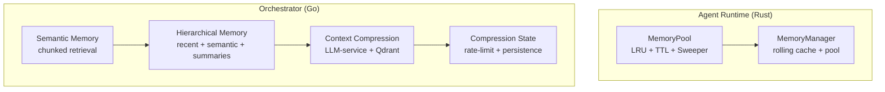
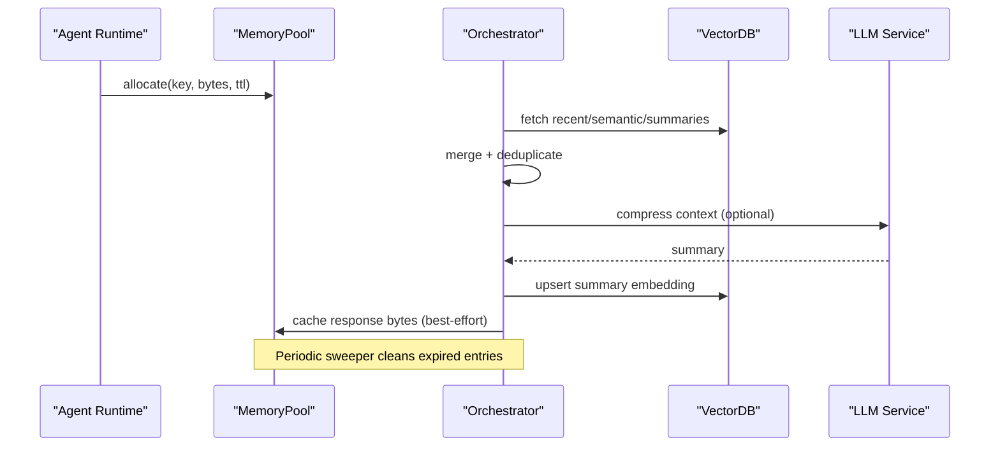
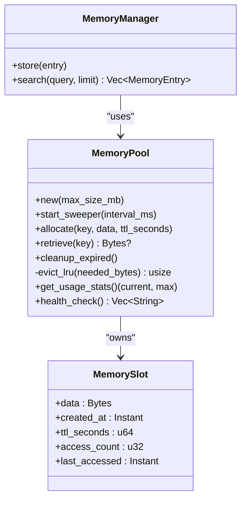
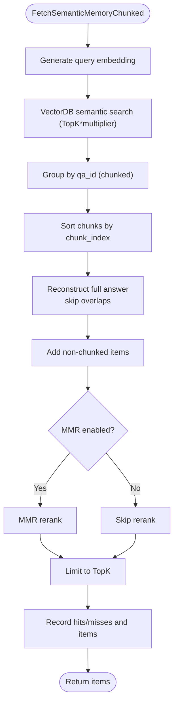
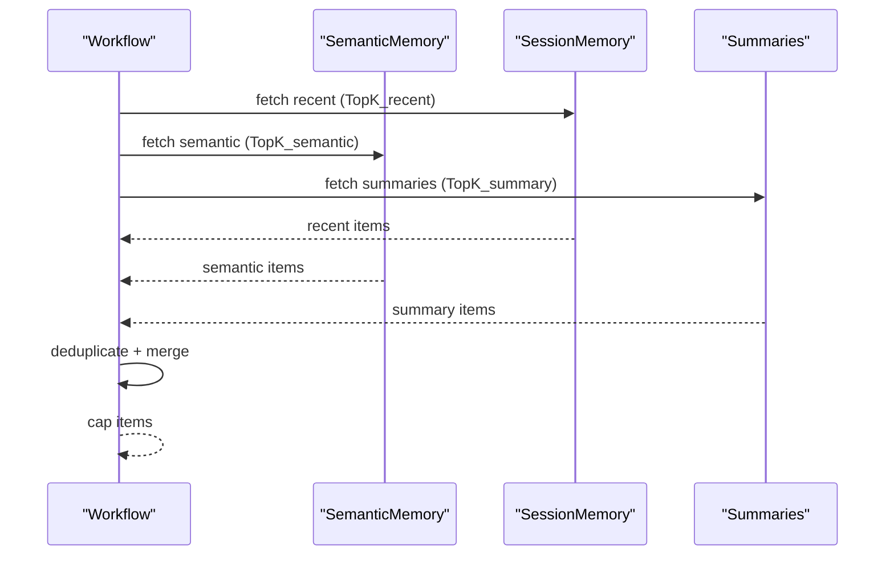
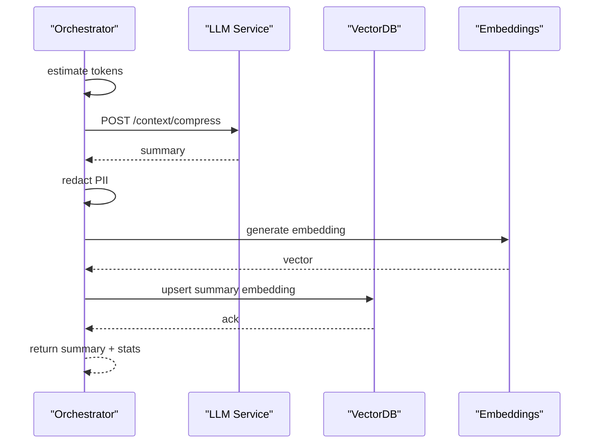
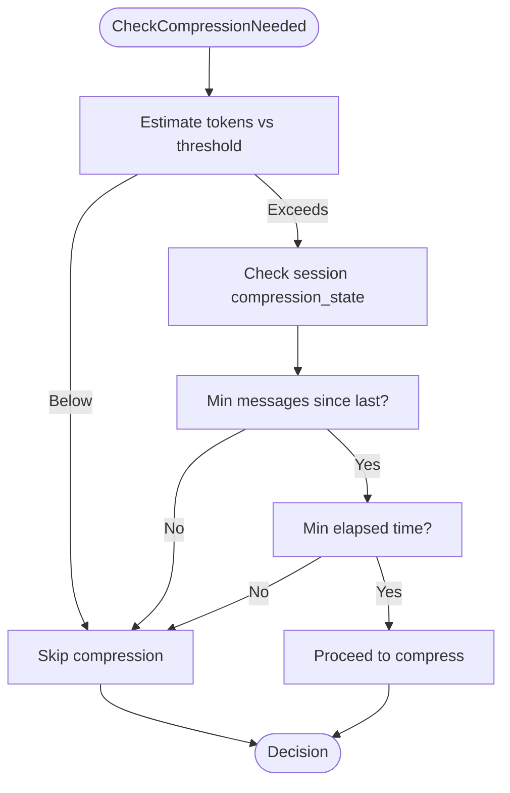
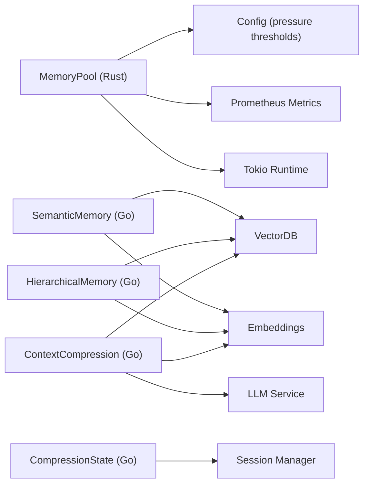

# Memory Pool and Optimization

<cite>
**Referenced Files in This Document**
- [memory.rs](file://rust/agent-core/src/memory.rs)
- [compression_activities.go](file://go/orchestrator/internal/activities/compression_activities.go)
- [compression_utils.go](file://go/orchestrator/internal/activities/compression_utils.go)
- [context_compress.go](file://go/orchestrator/internal/activities/context_compress.go)
- [semantic_memory.go](file://go/orchestrator/internal/activities/semantic_memory.go)
- [semantic_memory_chunked.go](file://go/orchestrator/internal/activities/semantic_memory_chunked.go)
- [session_memory.go](file://go/orchestrator/internal/activities/session_memory.go)
- [agent_memory.go](file://go/orchestrator/internal/activities/agent_memory.go)
- [openapi.go](file://go/orchestrator/cmd/gateway/internal/handlers/openapi.go)
</cite>

## Table of Contents
1. [Introduction](#introduction)
2. [Project Structure](#project-structure)
3. [Core Components](#core-components)
4. [Architecture Overview](#architecture-overview)
5. [Detailed Component Analysis](#detailed-component-analysis)
6. [Dependency Analysis](#dependency-analysis)
7. [Performance Considerations](#performance-considerations)
8. [Troubleshooting Guide](#troubleshooting-guide)
9. [Conclusion](#conclusion)
10. [Appendices](#appendices)

## Introduction
This document explains Shannon’s memory pool architecture and optimization strategies across Rust agent execution and Go orchestration layers. It covers:
- MemoryPool implementation with LRU eviction, TTL-based expiration, and dynamic sizing
- Memory allocation policies, pressure monitoring, and automatic cleanup
- Compression activities that reduce context size and optimize storage
- Practical configuration, capacity planning, and performance tuning
- Relationship between memory pools and agent execution contexts, garbage collection, and resource cleanup
- Leak prevention, monitoring/alerting for memory pressure, and scaling guidance
- Metrics collection, usage patterns, and best practices

## Project Structure
Shannon’s memory system spans:
- Rust agent-core for in-process memory pooling during agent tasks
- Go orchestrator for semantic memory retrieval, hierarchical fusion, and context compression

**Diagram sources**
- [memory.rs](file://rust/agent-core/src/memory.rs#L86-L523)
- [semantic_memory.go](file://go/orchestrator/internal/activities/semantic_memory.go#L25-L221)
- [semantic_memory_chunked.go](file://go/orchestrator/internal/activities/semantic_memory_chunked.go#L16-L276)
- [context_compress.go](file://go/orchestrator/internal/activities/context_compress.go#L42-L177)
- [compression_activities.go](file://go/orchestrator/internal/activities/compression_activities.go#L26-L89)

**Section sources**
- [memory.rs](file://rust/agent-core/src/memory.rs#L75-L138)
- [semantic_memory.go](file://go/orchestrator/internal/activities/semantic_memory.go#L25-L221)
- [semantic_memory_chunked.go](file://go/orchestrator/internal/activities/semantic_memory_chunked.go#L16-L276)
- [context_compress.go](file://go/orchestrator/internal/activities/context_compress.go#L42-L177)
- [compression_activities.go](file://go/orchestrator/internal/activities/compression_activities.go#L26-L89)

## Core Components
- MemoryPool (Rust): In-process, thread-safe pool with LRU eviction, TTL expiration, and background sweeper. Tracks usage, high-water mark, and exposes metrics.
- MemoryManager (Rust): Rolling buffer plus a MemoryPool cache for recent responses.
- Semantic Memory (Go): Embedding-based retrieval with chunk aggregation and optional MMR reranking.
- Hierarchical Memory (Go): Combines recent, semantic, and summary results with deduplication.
- Context Compression (Go): Summarizes long histories via llm-service and persists summaries to Qdrant.
- Compression State (Go): Session-scoped rate-limiting and persistence of compression cadence.

**Section sources**
- [memory.rs](file://rust/agent-core/src/memory.rs#L86-L523)
- [semantic_memory.go](file://go/orchestrator/internal/activities/semantic_memory.go#L25-L221)
- [semantic_memory_chunked.go](file://go/orchestrator/internal/activities/semantic_memory_chunked.go#L16-L276)
- [context_compress.go](file://go/orchestrator/internal/activities/context_compress.go#L42-L177)
- [compression_activities.go](file://go/orchestrator/internal/activities/compression_activities.go#L26-L89)

## Architecture Overview
End-to-end memory optimization pipeline:
- Agent execution uses MemoryPool to cache short-lived artifacts (e.g., recent responses) with TTL and LRU eviction.
- Orchestration retrieves recent and semantic context, optionally aggregates chunked content, and deduplicates results.
- When context approaches model window limits, compression is triggered to produce summaries stored in vector DB for future retrieval.
- Compression decisions are rate-limited by session state to avoid churn.

**Diagram sources**
- [memory.rs](file://rust/agent-core/src/memory.rs#L140-L207)
- [session_memory.go](file://go/orchestrator/internal/activities/session_memory.go#L26-L67)
- [semantic_memory.go](file://go/orchestrator/internal/activities/semantic_memory.go#L25-L221)
- [semantic_memory_chunked.go](file://go/orchestrator/internal/activities/semantic_memory_chunked.go#L16-L276)
- [context_compress.go](file://go/orchestrator/internal/activities/context_compress.go#L42-L177)

## Detailed Component Analysis

### Rust MemoryPool: LRU, TTL, and Dynamic Sizing
- Scope: In-process caching during agent execution; not persistent.
- Policies:
  - TTL semantics: zero TTL expires immediately; positive TTLs expire based on creation time.
  - Allocation rejects when exceeding capacity even after LRU eviction.
  - LRU eviction prioritizes least-recently-used; ties broken by creation time.
  - Background sweeper periodically frees expired entries and logs pressure.
- Metrics:
  - Allocation counters (success/rejected), eviction counters (expired/LRU), allocation size histogram, and pool usage totals.
- Pressure monitoring:
  - Warn/critical thresholds derived from global pressure threshold configuration.
  - Logs at 75% and 90% usage; high-water mark tracked.

**Diagram sources**
- [memory.rs](file://rust/agent-core/src/memory.rs#L86-L523)

**Section sources**
- [memory.rs](file://rust/agent-core/src/memory.rs#L86-L138)
- [memory.rs](file://rust/agent-core/src/memory.rs#L140-L207)
- [memory.rs](file://rust/agent-core/src/memory.rs#L209-L298)
- [memory.rs](file://rust/agent-core/src/memory.rs#L300-L382)
- [memory.rs](file://rust/agent-core/src/memory.rs#L384-L435)
- [memory.rs](file://rust/agent-core/src/memory.rs#L448-L523)

### Semantic Memory Retrieval and Chunk Aggregation
- FetchSemanticMemory delegates to FetchSemanticMemoryChunked to support chunked content reconstruction.
- Groups chunked items by QA ID, sorts by chunk_index, and reconstructs full answers while handling overlap.
- Optional MMR reranking improves diversity when enabled.
- Returns deduplicated items and records retrieval metrics.

**Diagram sources**
- [semantic_memory_chunked.go](file://go/orchestrator/internal/activities/semantic_memory_chunked.go#L16-L276)

**Section sources**
- [semantic_memory_chunked.go](file://go/orchestrator/internal/activities/semantic_memory_chunked.go#L16-L276)

### Hierarchical Memory Fusion
- Combines recent session memory, semantic memory, and summaries.
- Deduplicates across sources using stable keys (point ID, id, or composite).
- Limits total returned items to prevent context explosion.

**Diagram sources**
- [semantic_memory.go](file://go/orchestrator/internal/activities/semantic_memory.go#L50-L221)

**Section sources**
- [semantic_memory.go](file://go/orchestrator/internal/activities/semantic_memory.go#L25-L221)

### Context Compression and Persistence
- Estimates original tokens from history and calls llm-service /context/compress to produce a summary.
- Redacts PII heuristically and records compression metrics (ratio, tokens saved).
- Generates embedding and upserts summary into Qdrant; returns stored flag and token counts.

**Diagram sources**
- [context_compress.go](file://go/orchestrator/internal/activities/context_compress.go#L42-L177)

**Section sources**
- [context_compress.go](file://go/orchestrator/internal/activities/context_compress.go#L42-L177)

### Compression Decision and State Management
- Token threshold computed from model window size; compression triggers at 75% of window.
- Rate limiting enforced via session metadata: minimum messages since last compression and minimum elapsed time.
- After successful compression, session metadata is updated to track compression cadence.

**Diagram sources**
- [compression_activities.go](file://go/orchestrator/internal/activities/compression_activities.go#L26-L89)
- [compression_utils.go](file://go/orchestrator/internal/activities/compression_utils.go#L69-L153)

**Section sources**
- [compression_activities.go](file://go/orchestrator/internal/activities/compression_activities.go#L26-L89)
- [compression_utils.go](file://go/orchestrator/internal/activities/compression_utils.go#L69-L153)

### Agent-Specific Memory Operations
- FetchAgentMemory retrieves agent-scoped items filtered by session and agent identifiers from vector DB.
- RecordAgentMemory stores agent-specific interactions with metadata and reuses shared recording logic.

**Section sources**
- [agent_memory.go](file://go/orchestrator/internal/activities/agent_memory.go#L22-L89)

## Dependency Analysis
- Rust MemoryPool depends on:
  - Global configuration for pressure thresholds
  - Prometheus metrics for allocations, evictions, and pool usage
  - Tokio runtime for background sweeper
- Go orchestrator components depend on:
  - VectorDB for session/semantic/summary retrieval
  - Embeddings service for vectorization
  - LLM service for context compression
  - Session manager for compression state persistence

**Diagram sources**
- [memory.rs](file://rust/agent-core/src/memory.rs#L109-L137)
- [semantic_memory.go](file://go/orchestrator/internal/activities/semantic_memory.go#L25-L221)
- [context_compress.go](file://go/orchestrator/internal/activities/context_compress.go#L42-L177)
- [compression_activities.go](file://go/orchestrator/internal/activities/compression_activities.go#L104-L157)

**Section sources**
- [memory.rs](file://rust/agent-core/src/memory.rs#L109-L137)
- [semantic_memory.go](file://go/orchestrator/internal/activities/semantic_memory.go#L25-L221)
- [context_compress.go](file://go/orchestrator/internal/activities/context_compress.go#L42-L177)
- [compression_activities.go](file://go/orchestrator/internal/activities/compression_activities.go#L104-L157)

## Performance Considerations
- MemoryPool sizing:
  - Configure pool size in MB; default pool size for MemoryManager is 64 MB.
  - Use high-water mark and pressure thresholds to tune capacity.
- LRU behavior:
  - Tie-breaking by creation time ensures deterministic eviction order.
- Background sweeper:
  - Tunable interval to balance CPU usage and cleanup latency.
- Compression thresholds:
  - Model window size drives 75% trigger; adjust model tiers and thresholds per workload.
- Retrieval efficiency:
  - Use TopK multiplier and optional MMR reranking to reduce search space and improve diversity.
- Storage reuse:
  - Summaries enable repeated retrieval without recomputation.

[No sources needed since this section provides general guidance]

## Troubleshooting Guide
- MemoryPool allocation rejected:
  - Indicates pool exhaustion despite LRU eviction; increase pool size or reduce TTLs.
  - Monitor allocation counters and eviction reasons.
- Excessive pressure warnings:
  - Investigate TTL misconfiguration or missing sweeper; verify pressure thresholds.
- Compression not triggering:
  - Verify token estimation and model window; confirm session compression_state meets rate limits.
- Compression failures:
  - Check llm-service availability and summary upsert; review PII redaction outcomes.
- Memory leaks:
  - Ensure proper TTL usage and periodic cleanup; verify sweeper lifecycle.

**Section sources**
- [memory.rs](file://rust/agent-core/src/memory.rs#L215-L233)
- [compression_activities.go](file://go/orchestrator/internal/activities/compression_activities.go#L26-L89)
- [context_compress.go](file://go/orchestrator/internal/activities/context_compress.go#L82-L98)

## Conclusion
Shannon’s memory system combines a robust in-process MemoryPool with orchestrated semantic retrieval, chunk aggregation, and context compression. Together, these components deliver efficient memory usage, scalable context management, and resilient operation under varying workloads. Proper configuration of pool sizes, compression thresholds, and background maintenance ensures optimal performance and reliability.

[No sources needed since this section summarizes without analyzing specific files]

## Appendices

### Practical Configuration Examples
- MemoryPool pool size:
  - Set via constructor with MB value; default MemoryManager pool is 64 MB.
- Compression thresholds:
  - Trigger ratio and target ratio exposed in gateway OpenAPI; adjust per model tier and use case.
- Retrieval tuning:
  - Adjust TopK and MMR parameters for diversity and performance.

**Section sources**
- [memory.rs](file://rust/agent-core/src/memory.rs#L109-L138)
- [openapi.go](file://go/orchestrator/cmd/gateway/internal/handlers/openapi.go#L743-L757)

### Capacity Planning and Scaling
- Plan pool size based on typical response sizes and concurrency.
- Scale vector DB and embedding services alongside retrieval volume.
- Use compression to reduce context size and storage costs; monitor compression ratios and token savings.

[No sources needed since this section provides general guidance]

### Monitoring and Alerting
- Key metrics:
  - Memory pool total and used bytes, allocation counters, eviction counters, allocation size histogram.
  - Compression events, compression ratio, and tokens saved.
- Alerts:
  - Pressure thresholds at 75% and 90% usage; configure external alerts based on these metrics.

**Section sources**
- [memory.rs](file://rust/agent-core/src/memory.rs#L38-L73)
- [context_compress.go](file://go/orchestrator/internal/activities/context_compress.go#L112-L125)