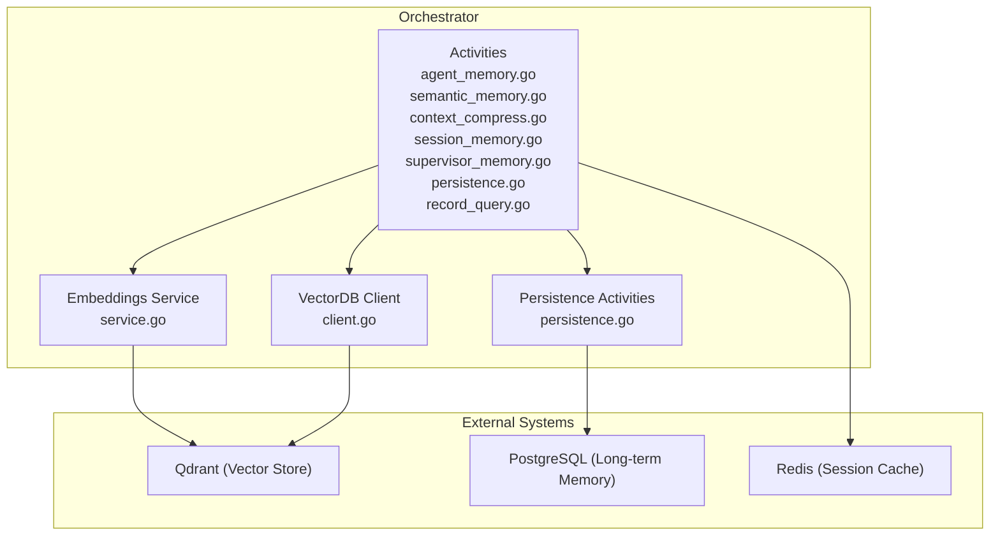
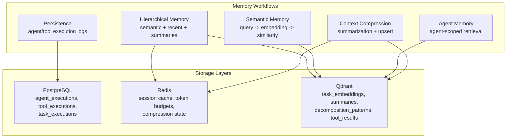
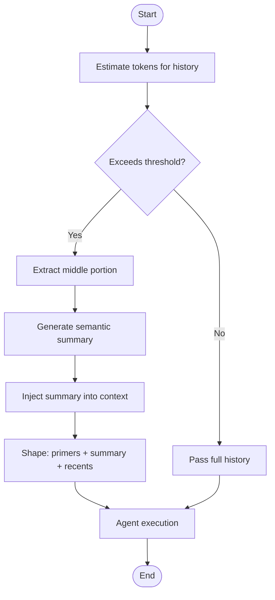
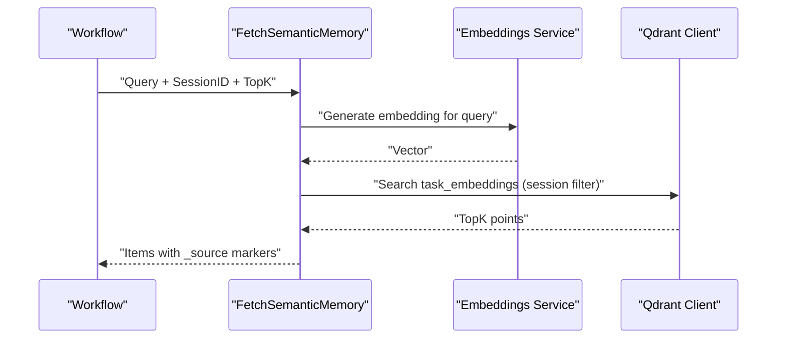
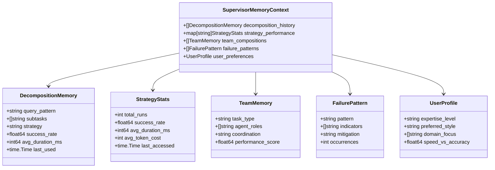
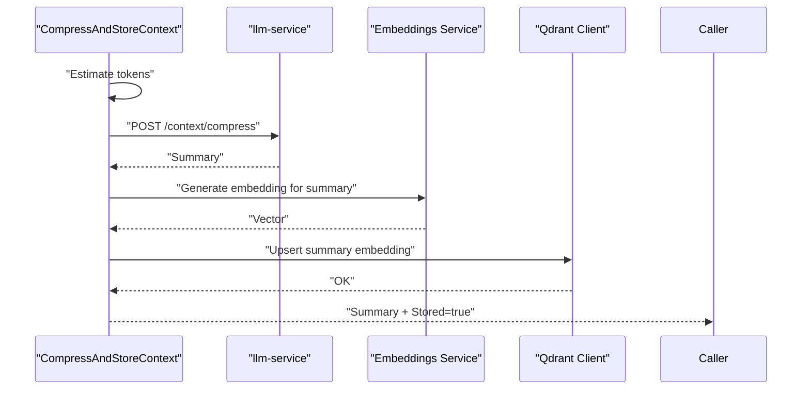
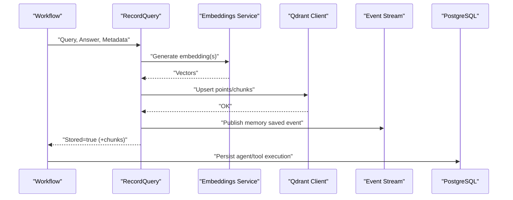
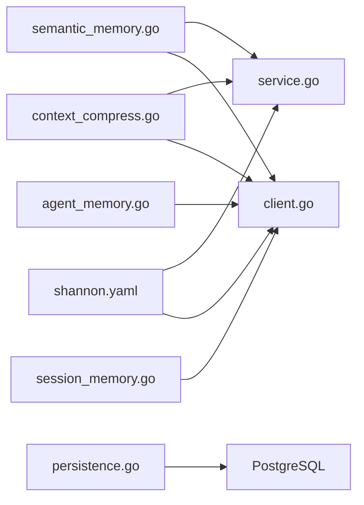

# Memory System

<cite>
**Referenced Files in This Document**
- [memory-system-architecture.md](file://docs/memory-system-architecture.md)
- [context-window-management.md](file://docs/context-window-management.md)
- [agent_memory.go](file://go/orchestrator/internal/activities/agent_memory.go)
- [semantic_memory.go](file://go/orchestrator/internal/activities/semantic_memory.go)
- [context_compress.go](file://go/orchestrator/internal/activities/context_compress.go)
- [session_memory.go](file://go/orchestrator/internal/activities/session_memory.go)
- [supervisor_memory.go](file://go/orchestrator/internal/activities/supervisor_memory.go)
- [client.go](file://go/orchestrator/internal/vectordb/client.go)
- [service.go](file://go/orchestrator/internal/embeddings/service.go)
- [persistence.go](file://go/orchestrator/internal/activities/persistence.go)
- [record_query.go](file://go/orchestrator/internal/activities/record_query.go)
- [shannon.yaml](file://config/shannon.yaml)
- [005_alter_memory_system.sql](file://migrations/postgres/005_alter_memory_system.sql)
</cite>

## Table of Contents
1. [Introduction](#introduction)
2. [Project Structure](#project-structure)
3. [Core Components](#core-components)
4. [Architecture Overview](#architecture-overview)
5. [Detailed Component Analysis](#detailed-component-analysis)
6. [Dependency Analysis](#dependency-analysis)
7. [Performance Considerations](#performance-considerations)
8. [Troubleshooting Guide](#troubleshooting-guide)
9. [Conclusion](#conclusion)
10. [Appendices](#appendices)

## Introduction
This document explains Shannon’s memory system with a focus on context window management and long-term memory capabilities. It covers agent memory management, context compression, semantic memory using vector databases, persistence and retrieval strategies, and operational policies. Practical configuration examples, tuning guidance, and scalability/security considerations are included to help operators deploy and operate the memory system effectively at scale.

## Project Structure
Shannon’s memory system spans multiple layers:
- Activities orchestrate memory operations (fetch, record, compress, persistence).
- Vector database (Qdrant) stores embeddings and payloads for semantic search.
- Embedding service generates vectors with caching.
- PostgreSQL persists agent/tool execution metrics and history.
- Configuration defines memory-related parameters and defaults.

**Diagram sources**
- [agent_memory.go](file://go/orchestrator/internal/activities/agent_memory.go#L1-L89)
- [semantic_memory.go](file://go/orchestrator/internal/activities/semantic_memory.go#L1-L222)
- [context_compress.go](file://go/orchestrator/internal/activities/context_compress.go#L1-L215)
- [session_memory.go](file://go/orchestrator/internal/activities/session_memory.go#L1-L68)
- [supervisor_memory.go](file://go/orchestrator/internal/activities/supervisor_memory.go#L1-L957)
- [persistence.go](file://go/orchestrator/internal/activities/persistence.go#L1-L232)
- [record_query.go](file://go/orchestrator/internal/activities/record_query.go#L1-L270)
- [service.go](file://go/orchestrator/internal/embeddings/service.go#L1-L274)
- [client.go](file://go/orchestrator/internal/vectordb/client.go#L1-L439)

**Section sources**
- [memory-system-architecture.md](file://docs/memory-system-architecture.md#L1-L239)
- [context-window-management.md](file://docs/context-window-management.md#L1-L370)

## Core Components
- Hierarchical memory: merges recent, semantic, and compressed summaries.
- Session memory: recent chronological items scoped to a session.
- Agent memory: agent-scoped interactions stored and retrieved.
- Supervisor memory: enhanced memory with decomposition patterns, strategy performance, failure patterns, and user preferences.
- Context compression: automatic compression of long histories to fit token budgets.
- Persistence: agent/tool execution records for analytics and observability.
- Vector database: Qdrant-backed semantic search with hybrid retrieval.
- Embeddings: OpenAI-compatible embeddings with batching and caching.

**Section sources**
- [semantic_memory.go](file://go/orchestrator/internal/activities/semantic_memory.go#L33-L222)
- [session_memory.go](file://go/orchestrator/internal/activities/session_memory.go#L14-L68)
- [agent_memory.go](file://go/orchestrator/internal/activities/agent_memory.go#L9-L89)
- [supervisor_memory.go](file://go/orchestrator/internal/activities/supervisor_memory.go#L70-L253)
- [context_compress.go](file://go/orchestrator/internal/activities/context_compress.go#L21-L177)
- [persistence.go](file://go/orchestrator/internal/activities/persistence.go#L13-L232)
- [client.go](file://go/orchestrator/internal/vectordb/client.go#L19-L439)
- [service.go](file://go/orchestrator/internal/embeddings/service.go#L17-L274)

## Architecture Overview
Shannon’s memory architecture integrates three storage layers:
- PostgreSQL: persistent execution and task metadata.
- Redis: fast session cache and token budgets.
- Qdrant: vector embeddings for semantic search and hybrid retrieval.

**Diagram sources**
- [memory-system-architecture.md](file://docs/memory-system-architecture.md#L11-L47)
- [semantic_memory.go](file://go/orchestrator/internal/activities/semantic_memory.go#L25-L31)
- [session_memory.go](file://go/orchestrator/internal/activities/session_memory.go#L26-L32)
- [agent_memory.go](file://go/orchestrator/internal/activities/agent_memory.go#L22-L50)
- [context_compress.go](file://go/orchestrator/internal/activities/context_compress.go#L42-L177)
- [persistence.go](file://go/orchestrator/internal/activities/persistence.go#L77-L158)

## Detailed Component Analysis

### Context Window Management
Context window management ensures long-running sessions remain within token budgets by:
- Configurable window sizes (default and debugging presets).
- Per-agent and per-task token budgets with clamping.
- Sliding window compression: preserves primers, recent messages, and injects a semantic summary of the middle portion.

**Diagram sources**
- [context-window-management.md](file://docs/context-window-management.md#L127-L145)
- [context_compress.go](file://go/orchestrator/internal/activities/context_compress.go#L42-L177)

Practical configuration examples:
- Environment variables for window size and budgets.
- Request-level overrides for use case presets and per-agent budgets.
- Tuning compression thresholds and target ratios.

**Section sources**
- [context-window-management.md](file://docs/context-window-management.md#L64-L122)
- [context_compress.go](file://go/orchestrator/internal/activities/context_compress.go#L21-L177)

### Semantic Memory and Hybrid Retrieval
Semantic memory uses vector similarity to retrieve relevant prior interactions:
- Embeddings generated via the embeddings service.
- Qdrant search with session filters and optional thresholds.
- Hybrid retrieval combining recent, semantic, and summary items with deduplication.

**Diagram sources**
- [semantic_memory.go](file://go/orchestrator/internal/activities/semantic_memory.go#L25-L31)
- [service.go](file://go/orchestrator/internal/embeddings/service.go#L82-L157)
- [client.go](file://go/orchestrator/internal/vectordb/client.go#L232-L304)

Additional hybrid retrieval includes:
- Session recent items.
- Compressed summaries for historical context.
- Deduplication across sources using point IDs and composite keys.

**Section sources**
- [semantic_memory.go](file://go/orchestrator/internal/activities/semantic_memory.go#L50-L222)
- [session_memory.go](file://go/orchestrator/internal/activities/session_memory.go#L26-L68)

### Agent Memory
Agent memory scopes retrieval to a specific agent within a session:
- Filtering by session_id and agent_id in Qdrant.
- Graceful degradation when vector services are unavailable.
- Payload conversion for downstream use.

**Section sources**
- [agent_memory.go](file://go/orchestrator/internal/activities/agent_memory.go#L9-L89)
- [client.go](file://go/orchestrator/internal/vectordb/client.go#L306-L377)

### Supervisor Memory
Enhanced supervisor memory enriches decisions with:
- Decomposition patterns (similar previous tasks).
- Strategy performance metrics.
- Failure patterns and user preferences.
- Epsilon-greedy selection and strategy scoring.

**Diagram sources**
- [supervisor_memory.go](file://go/orchestrator/internal/activities/supervisor_memory.go#L70-L129)

**Section sources**
- [supervisor_memory.go](file://go/orchestrator/internal/activities/supervisor_memory.go#L186-L253)
- [supervisor_memory.go](file://go/orchestrator/internal/activities/supervisor_memory.go#L255-L319)
- [supervisor_memory.go](file://go/orchestrator/internal/activities/supervisor_memory.go#L321-L379)
- [supervisor_memory.go](file://go/orchestrator/internal/activities/supervisor_memory.go#L419-L484)
- [supervisor_memory.go](file://go/orchestrator/internal/activities/supervisor_memory.go#L486-L546)
- [supervisor_memory.go](file://go/orchestrator/internal/activities/supervisor_memory.go#L610-L688)
- [supervisor_memory.go](file://go/orchestrator/internal/activities/supervisor_memory.go#L811-L879)
- [supervisor_memory.go](file://go/orchestrator/internal/activities/supervisor_memory.go#L881-L933)

### Context Compression
Compression activates when history approaches budget thresholds:
- Estimates tokens from character counts plus overhead.
- Calls llm-service for a semantic summary.
- Upserts summary embedding into Qdrant with PII redaction.
- Records metrics for compression events and ratios.

**Diagram sources**
- [context_compress.go](file://go/orchestrator/internal/activities/context_compress.go#L42-L177)
- [service.go](file://go/orchestrator/internal/embeddings/service.go#L82-L157)
- [client.go](file://go/orchestrator/internal/vectordb/client.go#L217-L230)

**Section sources**
- [context_compress.go](file://go/orchestrator/internal/activities/context_compress.go#L21-L177)

### Memory Persistence and Retrieval
- RecordQuery: stores query-answer pairs or chunked answers with embeddings; deduplicates near-duplicates; publishes friendly progress events.
- RecordAgentMemory: agent-scoped variant using shared core logic.
- Persistence activities: persist agent and tool executions to PostgreSQL for analytics and observability.

**Diagram sources**
- [record_query.go](file://go/orchestrator/internal/activities/record_query.go#L71-L270)
- [service.go](file://go/orchestrator/internal/embeddings/service.go#L159-L273)
- [client.go](file://go/orchestrator/internal/vectordb/client.go#L171-L230)
- [persistence.go](file://go/orchestrator/internal/activities/persistence.go#L77-L158)

**Section sources**
- [record_query.go](file://go/orchestrator/internal/activities/record_query.go#L17-L270)
- [agent_memory.go](file://go/orchestrator/internal/activities/agent_memory.go#L52-L89)
- [persistence.go](file://go/orchestrator/internal/activities/persistence.go#L13-L232)
- [005_alter_memory_system.sql](file://migrations/postgres/005_alter_memory_system.sql#L1-L117)

## Dependency Analysis
Memory components depend on:
- Embeddings service for vector generation and caching.
- Qdrant client for search and upsert operations.
- PostgreSQL for execution persistence.
- Redis for session cache and token budget tracking.

**Diagram sources**
- [semantic_memory.go](file://go/orchestrator/internal/activities/semantic_memory.go#L1-L222)
- [agent_memory.go](file://go/orchestrator/internal/activities/agent_memory.go#L1-L89)
- [session_memory.go](file://go/orchestrator/internal/activities/session_memory.go#L1-L68)
- [context_compress.go](file://go/orchestrator/internal/activities/context_compress.go#L1-L215)
- [persistence.go](file://go/orchestrator/internal/activities/persistence.go#L1-L232)
- [service.go](file://go/orchestrator/internal/embeddings/service.go#L1-L274)
- [client.go](file://go/orchestrator/internal/vectordb/client.go#L1-L439)
- [shannon.yaml](file://config/shannon.yaml#L283-L318)

**Section sources**
- [shannon.yaml](file://config/shannon.yaml#L23-L28)
- [shannon.yaml](file://config/shannon.yaml#L283-L318)

## Performance Considerations
- Embedding batching reduces API calls and cost; LRU and Redis caching minimize latency.
- Vector search uses MMR diversity re-ranking and payload indexes for faster filtering.
- Compression reduces context size with minimal quality impact; metrics track effectiveness.
- Hierarchical retrieval caps total items to prevent context explosion.

[No sources needed since this section provides general guidance]

## Troubleshooting Guide
Common issues and resolutions:
- Context seems truncated: increase window size, use debugging preset, or adjust primer/recents counts.
- Token budget exceeded: raise per-agent or per-task budgets; ensure compression triggers.
- Compression not triggering: lower per-request budgets to force compression; verify history length and thresholds.
- Compression too aggressive: increase primers/recents counts; tune target ratios.

Privacy and PII handling:
- Summaries are PII-redacted before storage.
- Embedding generation and vector upsert occur server-side.
- Token counts are estimates; events do not expose raw content.

**Section sources**
- [context-window-management.md](file://docs/context-window-management.md#L307-L347)
- [context_compress.go](file://go/orchestrator/internal/activities/context_compress.go#L179-L215)

## Conclusion
Shannon’s memory system combines configurable context windows, semantic vector search, and compression to sustain long, context-rich interactions. Hierarchical retrieval, supervisor memory, and persistence provide robustness and insight for continuous improvement. With careful configuration and monitoring, the system scales efficiently while preserving privacy and data governance.

[No sources needed since this section summarizes without analyzing specific files]

## Appendices

### Practical Configuration Examples
- Environment variables for context window and budgets.
- Configuration file settings for session, vector, and embeddings.
- Request-level overrides for use case presets and budgets.

**Section sources**
- [context-window-management.md](file://docs/context-window-management.md#L64-L122)
- [shannon.yaml](file://config/shannon.yaml#L23-L28)
- [shannon.yaml](file://config/shannon.yaml#L283-L318)

### Memory Cleanup Policies
- Session TTL and max history limits in Redis.
- Optional TTL-based cleanup for supervisor memory strategy performance cache.
- Decomposition pattern storage with fallback to generic embeddings collection.

**Section sources**
- [shannon.yaml](file://config/shannon.yaml#L23-L28)
- [supervisor_memory.go](file://go/orchestrator/internal/activities/supervisor_memory.go#L881-L933)
- [supervisor_memory.go](file://go/orchestrator/internal/activities/supervisor_memory.go#L844-L879)

### Security, Data Retention, and Compliance
- Embeddings provider requirement: OpenAI API key for memory features; graceful degradation otherwise.
- PII redaction in summaries and query/answer redaction during storage.
- Access control via authentication and role-based permissions.
- Data minimization and anonymization via UUIDs and payload-only storage.

**Section sources**
- [memory-system-architecture.md](file://docs/memory-system-architecture.md#L32-L50)
- [context_compress.go](://go/orchestrator/internal/activities/context_compress.go#L179-L215)
- [record_query.go](file://go/orchestrator/internal/activities/record_query.go#L40-L47)