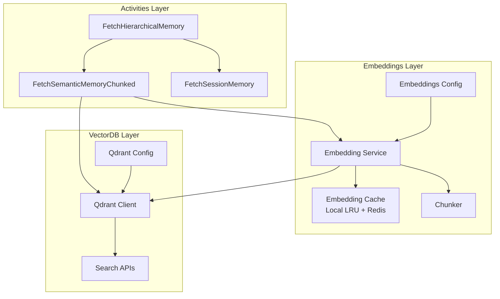
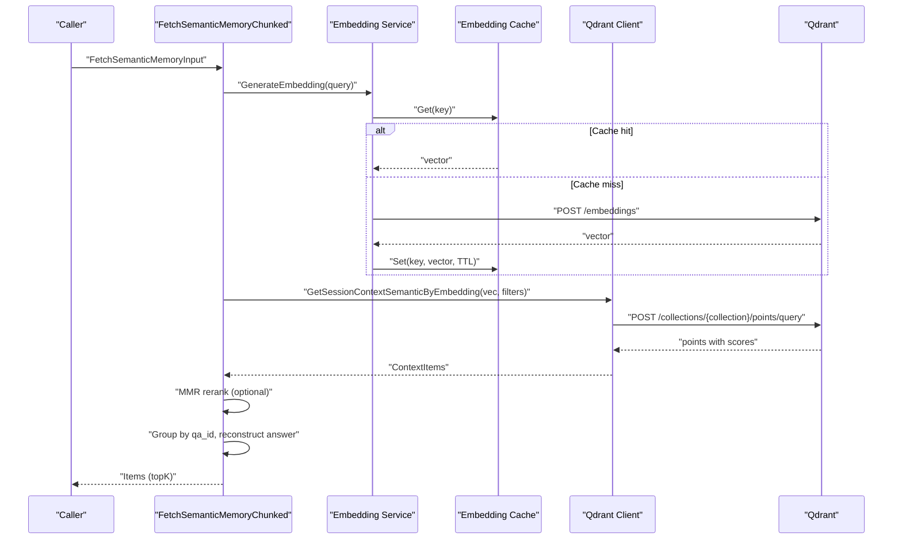
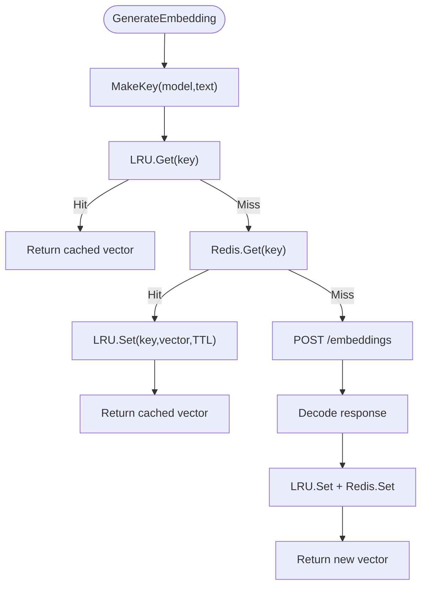
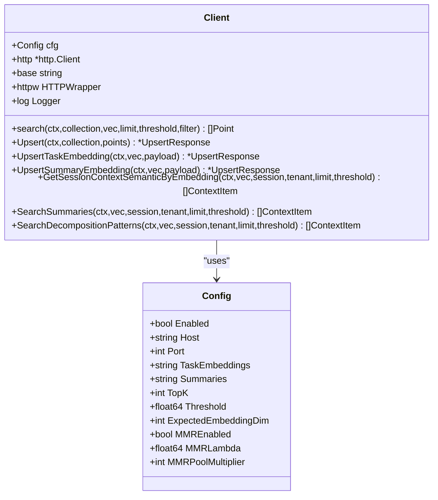
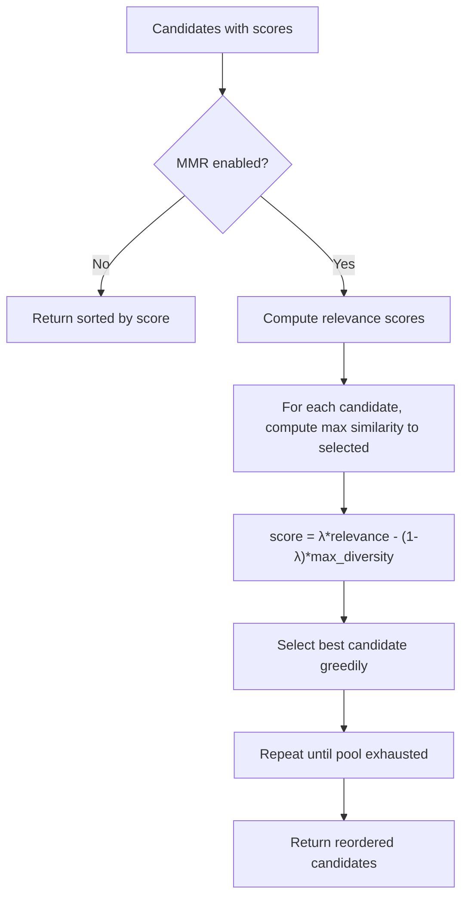
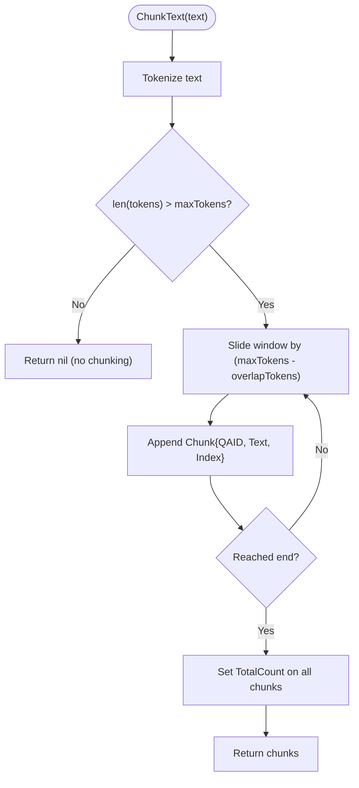
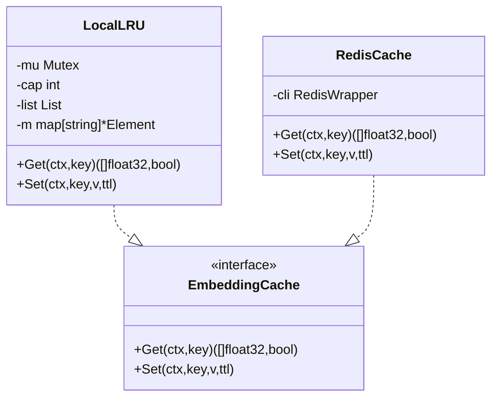
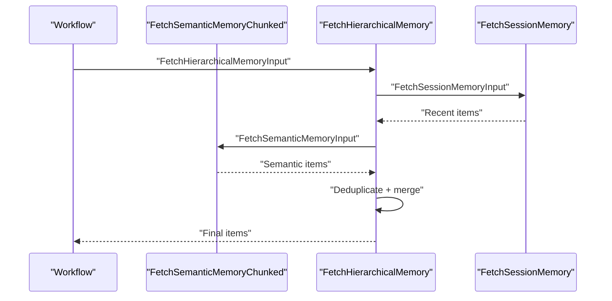
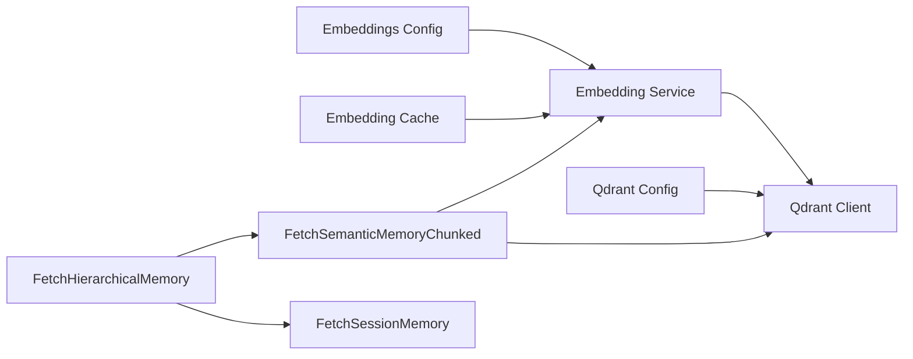

# Semantic Memory System

<cite>
**Referenced Files in This Document**
- [service.go](file://go/orchestrator/internal/embeddings/service.go)
- [cache.go](file://go/orchestrator/internal/embeddings/cache.go)
- [chunking.go](file://go/orchestrator/internal/embeddings/chunking.go)
- [types.go](file://go/orchestrator/internal/embeddings/types.go)
- [client.go](file://go/orchestrator/internal/vectordb/client.go)
- [search.go](file://go/orchestrator/internal/vectordb/search.go)
- [types.go](file://go/orchestrator/internal/vectordb/types.go)
- [semantic_memory.go](file://go/orchestrator/internal/activities/semantic_memory.go)
- [semantic_memory_chunked.go](file://go/orchestrator/internal/activities/semantic_memory_chunked.go)
- [session_memory.go](file://go/orchestrator/internal/activities/session_memory.go)
- [shannon.yaml](file://config/shannon.yaml)
- [memory_test.go](file://go/orchestrator/internal/activities/memory_test.go)
</cite>

## Table of Contents
1. [Introduction](#introduction)
2. [Project Structure](#project-structure)
3. [Core Components](#core-components)
4. [Architecture Overview](#architecture-overview)
5. [Detailed Component Analysis](#detailed-component-analysis)
6. [Dependency Analysis](#dependency-analysis)
7. [Performance Considerations](#performance-considerations)
8. [Troubleshooting Guide](#troubleshooting-guide)
9. [Conclusion](#conclusion)
10. [Appendices](#appendices)

## Introduction
This document explains Shannon’s semantic memory system that powers contextual knowledge recall using vector databases and embeddings. The platform converts textual knowledge into dense vectors, stores them in a vector database, and retrieves semantically similar memories during runtime. It integrates:
- Embedding generation with caching and batching
- Vector database integration with Qdrant
- Semantic similarity search with optional MMR diversity reranking
- Chunking strategies for long documents and reconstruction
- Hierarchical memory fusion combining recent and semantic context
- Practical workflows for knowledge recall and persistence

## Project Structure
The semantic memory system spans three primary layers:
- Embeddings layer: Generates and caches embeddings
- Vector database layer: Stores and retrieves vectors from Qdrant
- Activities layer: Orchestrates memory retrieval and fusion

**Diagram sources**
- [service.go](file://go/orchestrator/internal/embeddings/service.go#L17-L56)
- [cache.go](file://go/orchestrator/internal/embeddings/cache.go#L17-L129)
- [chunking.go](file://go/orchestrator/internal/embeddings/chunking.go#L9-L106)
- [client.go](file://go/orchestrator/internal/vectordb/client.go#L19-L64)
- [search.go](file://go/orchestrator/internal/vectordb/search.go#L16-L49)
- [semantic_memory_chunked.go](file://go/orchestrator/internal/activities/semantic_memory_chunked.go#L16-L351)
- [semantic_memory.go](file://go/orchestrator/internal/activities/semantic_memory.go#L25-L222)
- [session_memory.go](file://go/orchestrator/internal/activities/session_memory.go#L26-L67)

**Section sources**
- [service.go](file://go/orchestrator/internal/embeddings/service.go#L17-L56)
- [client.go](file://go/orchestrator/internal/vectordb/client.go#L19-L64)
- [semantic_memory_chunked.go](file://go/orchestrator/internal/activities/semantic_memory_chunked.go#L16-L351)

## Core Components
- Embedding Service: Generates embeddings for single or batch texts, with LRU and Redis caching, and supports chunked content.
- Embedding Cache: Provides local LRU cache and Redis-backed cache with TTL and serialization.
- Chunker: Splits long texts into overlapping chunks with configurable token budgets and overlap.
- Qdrant Client: Performs semantic search, upserts, and specialized retrieval (session, agent, summaries).
- Memory Activities: Provide semantic, hierarchical, and session-based memory retrieval with deduplication and optional MMR reranking.

**Section sources**
- [types.go](file://go/orchestrator/internal/embeddings/types.go#L5-L23)
- [cache.go](file://go/orchestrator/internal/embeddings/cache.go#L17-L129)
- [chunking.go](file://go/orchestrator/internal/embeddings/chunking.go#L9-L106)
- [types.go](file://go/orchestrator/internal/vectordb/types.go#L5-L57)
- [semantic_memory.go](file://go/orchestrator/internal/activities/semantic_memory.go#L11-L23)
- [semantic_memory_chunked.go](file://go/orchestrator/internal/activities/semantic_memory_chunked.go#L16-L351)

## Architecture Overview
The semantic memory pipeline follows a consistent flow:
1. Query enters via memory activities.
2. Embedding service generates a query vector (with caching and batching).
3. Qdrant client performs semantic search with filters (session, tenant).
4. Results are optionally reranked with MMR and grouped by chunked QA pairs.
5. Aggregated answers are reconstructed and returned to the caller.

**Diagram sources**
- [semantic_memory_chunked.go](file://go/orchestrator/internal/activities/semantic_memory_chunked.go#L28-L83)
- [service.go](file://go/orchestrator/internal/embeddings/service.go#L82-L157)
- [cache.go](file://go/orchestrator/internal/embeddings/cache.go#L98-L123)
- [client.go](file://go/orchestrator/internal/vectordb/client.go#L232-L304)

## Detailed Component Analysis

### Embedding Generation Pipeline
- Caching strategy:
  - Local LRU cache with TTL for fast local reuse
  - Optional Redis cache for cross-instance sharing
  - Keys derived deterministically from model and text
- Batch vs single:
  - Batch embeddings are preferred for throughput
  - Single embeddings used when batching is not applicable
- Metrics:
  - Records outcomes (hit, miss, error) and durations

**Diagram sources**
- [service.go](file://go/orchestrator/internal/embeddings/service.go#L82-L157)
- [cache.go](file://go/orchestrator/internal/embeddings/cache.go#L98-L123)
- [cache.go](file://go/orchestrator/internal/embeddings/cache.go#L126-L129)

**Section sources**
- [service.go](file://go/orchestrator/internal/embeddings/service.go#L82-L157)
- [service.go](file://go/orchestrator/internal/embeddings/service.go#L159-L273)
- [cache.go](file://go/orchestrator/internal/embeddings/cache.go#L17-L129)
- [types.go](file://go/orchestrator/internal/embeddings/types.go#L5-L23)

### Vector Database Integration with Qdrant
- Client initialization:
  - Validates and initializes with defaults for host, port, collections, timeouts, and MMR settings
- Search:
  - Uses modern /points/query endpoint with fallback to legacy /points/search
  - Supports filters by session and tenant, optional score threshold, and returning vectors for reranking
- Upsert:
  - Inserts points with vector and payload; helpers for task embeddings and summaries
- Retrieval helpers:
  - Session context by embedding
  - Summaries and decomposition patterns with session/tenant filters

**Diagram sources**
- [client.go](file://go/orchestrator/internal/vectordb/client.go#L19-L64)
- [client.go](file://go/orchestrator/internal/vectordb/client.go#L96-L169)
- [client.go](file://go/orchestrator/internal/vectordb/client.go#L171-L230)
- [client.go](file://go/orchestrator/internal/vectordb/client.go#L232-L438)
- [types.go](file://go/orchestrator/internal/vectordb/types.go#L5-L26)

**Section sources**
- [client.go](file://go/orchestrator/internal/vectordb/client.go#L96-L169)
- [client.go](file://go/orchestrator/internal/vectordb/client.go#L171-L230)
- [client.go](file://go/orchestrator/internal/vectordb/client.go#L232-L438)
- [types.go](file://go/orchestrator/internal/vectordb/types.go#L5-L57)

### Similarity Matching and Reranking
- Cosine similarity is computed between query and candidate vectors.
- Optional MMR reranking balances relevance and diversity using a lambda parameter.
- Candidate pool is expanded using a multiplier to improve reranking quality.

**Diagram sources**
- [semantic_memory_chunked.go](file://go/orchestrator/internal/activities/semantic_memory_chunked.go#L298-L350)

**Section sources**
- [semantic_memory_chunked.go](file://go/orchestrator/internal/activities/semantic_memory_chunked.go#L278-L350)

### Chunking Strategies for Large Documents
- Chunker configuration:
  - Enables chunking, sets max tokens per chunk, overlap tokens, and tokenizer mode
- Chunk generation:
  - Splits text into overlapping segments; assigns a shared QA ID to related chunks
  - Reconstruction preserves order and minimizes overlap by skipping approximate overlap length
- Token estimation:
  - Provides estimations for token counts and model-specific adjustments

**Diagram sources**
- [chunking.go](file://go/orchestrator/internal/embeddings/chunking.go#L61-L106)

**Section sources**
- [chunking.go](file://go/orchestrator/internal/embeddings/chunking.go#L9-L106)
- [semantic_memory_chunked.go](file://go/orchestrator/internal/activities/semantic_memory_chunked.go#L200-L242)

### Embedding Caching Mechanisms
- Local LRU:
  - Thread-safe LRU with TTL eviction
  - Fast-path lookup before Redis
- Redis cache:
  - Circuit-breaker wrapped Redis client
  - Serialized float32 vectors stored as byte arrays
- Key derivation:
  - Deterministic MD5-based keys from model and text

**Diagram sources**
- [cache.go](file://go/orchestrator/internal/embeddings/cache.go#L17-L78)
- [cache.go](file://go/orchestrator/internal/embeddings/cache.go#L80-L123)
- [cache.go](file://go/orchestrator/internal/embeddings/cache.go#L125-L134)

**Section sources**
- [cache.go](file://go/orchestrator/internal/embeddings/cache.go#L17-L129)

### Query Processing Workflows
- Semantic memory:
  - Generates query embedding, expands candidate pool, optionally reranks with MMR, groups by QA ID, reconstructs answers, sorts by score, and limits results.
- Hierarchical memory:
  - Combines recent session memory, semantic memory, and optional summaries; deduplicates across sources; limits total items.
- Session memory:
  - Retrieves recent items for a session using scroll API with timestamp-based sorting.

**Diagram sources**
- [semantic_memory.go](file://go/orchestrator/internal/activities/semantic_memory.go#L50-L222)
- [session_memory.go](file://go/orchestrator/internal/activities/session_memory.go#L26-L67)
- [semantic_memory_chunked.go](file://go/orchestrator/internal/activities/semantic_memory_chunked.go#L16-L276)

**Section sources**
- [semantic_memory_chunked.go](file://go/orchestrator/internal/activities/semantic_memory_chunked.go#L16-L276)
- [semantic_memory.go](file://go/orchestrator/internal/activities/semantic_memory.go#L25-L222)
- [session_memory.go](file://go/orchestrator/internal/activities/session_memory.go#L26-L67)

### Relationship Between Semantic Memory and Traditional Context Management
- Traditional context management relies on recent message history and explicit context windows.
- Semantic memory augments this by retrieving semantically similar prior experiences, enabling broader knowledge recall beyond strict recency.
- Hierarchical memory fusion combines both modalities to balance temporal relevance and semantic relevance.

[No sources needed since this section provides conceptual comparison]

## Dependency Analysis
- Embedding service depends on:
  - Embedding cache (local LRU and Redis)
  - Qdrant client for upsert and search
- Qdrant client depends on:
  - HTTP client with circuit breaker
  - Tracing and metrics
- Activities depend on:
  - Embedding service for query vectors
  - Qdrant client for retrieval
  - Deduplication and merging logic

**Diagram sources**
- [service.go](file://go/orchestrator/internal/embeddings/service.go#L17-L56)
- [cache.go](file://go/orchestrator/internal/embeddings/cache.go#L17-L129)
- [client.go](file://go/orchestrator/internal/vectordb/client.go#L19-L64)
- [semantic_memory_chunked.go](file://go/orchestrator/internal/activities/semantic_memory_chunked.go#L16-L351)
- [semantic_memory.go](file://go/orchestrator/internal/activities/semantic_memory.go#L25-L222)
- [session_memory.go](file://go/orchestrator/internal/activities/session_memory.go#L26-L67)

**Section sources**
- [service.go](file://go/orchestrator/internal/embeddings/service.go#L17-L56)
- [client.go](file://go/orchestrator/internal/vectordb/client.go#L19-L64)
- [semantic_memory_chunked.go](file://go/orchestrator/internal/activities/semantic_memory_chunked.go#L16-L351)

## Performance Considerations
- Embedding caching:
  - Use batch embeddings for multiple texts to reduce overhead
  - Tune LRU capacity and Redis TTL to balance freshness and hit rates
- Vector search:
  - Increase candidate pool multiplier to improve MMR reranking quality
  - Adjust TopK and threshold to control recall precision
- MMR:
  - Tune lambda to balance relevance and diversity
- Chunking:
  - Choose max tokens and overlap to fit downstream model context windows
- Network and reliability:
  - Circuit breakers protect Qdrant; ensure timeouts and retries are tuned appropriately

[No sources needed since this section provides general guidance]

## Troubleshooting Guide
- Empty or missing embeddings:
  - Verify embedding service availability and model configuration
  - Check cache keys and TTL settings
- Qdrant search failures:
  - Confirm collection names and filters
  - Validate embedding dimensions against expected values
- MMR not applied:
  - Ensure vectors are returned with results and MMR is enabled
- Duplicate results:
  - Use deduplication logic that leverages point IDs and composite keys
- Hierarchical memory limits:
  - Reduce total items to prevent context overflow

**Section sources**
- [service.go](file://go/orchestrator/internal/embeddings/service.go#L126-L157)
- [client.go](file://go/orchestrator/internal/vectordb/client.go#L124-L169)
- [semantic_memory_chunked.go](file://go/orchestrator/internal/activities/semantic_memory_chunked.go#L85-L97)
- [semantic_memory.go](file://go/orchestrator/internal/activities/semantic_memory.go#L84-L162)

## Conclusion
Shannon’s semantic memory system combines robust embedding generation with Qdrant-powered similarity search to deliver scalable, accurate knowledge recall. The system emphasizes caching, batching, chunking, and optional MMR reranking to optimize both performance and recall quality. Hierarchical memory fusion ensures that recent and semantic context complement each other, while configuration-driven parameters allow tuning for diverse workloads.

[No sources needed since this section summarizes without analyzing specific files]

## Appendices

### Configuration Reference
- Embeddings:
  - Base URL, default model, timeout, cache TTL, LRU capacity, chunking parameters
- Vector database:
  - Host, port, collection names, TopK, threshold, expected embedding dimension, MMR settings
- Example keys:
  - vector.enabled, vector.host, vector.port, vector.top_k, vector.threshold, vector.mmr_enabled, vector.mmr_lambda, vector.mmr_pool_multiplier, embeddings.base_url, embeddings.default_model, embeddings.chunking.enabled, embeddings.chunking.max_tokens

**Section sources**
- [shannon.yaml](file://config/shannon.yaml#L283-L318)
- [types.go](file://go/orchestrator/internal/embeddings/types.go#L5-L23)
- [types.go](file://go/orchestrator/internal/vectordb/types.go#L5-L26)

### Practical Examples
- Semantic search:
  - Generate embedding for a query, search within session, optionally rerank with MMR, reconstruct chunked answers, and return top-K results.
- Knowledge recall patterns:
  - Combine recent session memory with semantic memory and summaries; deduplicate across sources; cap total items.
- Memory persistence strategies:
  - Upsert task embeddings and summaries; leverage scroll API for recent retrieval; use filters for session and tenant isolation.

**Section sources**
- [semantic_memory_chunked.go](file://go/orchestrator/internal/activities/semantic_memory_chunked.go#L16-L276)
- [semantic_memory.go](file://go/orchestrator/internal/activities/semantic_memory.go#L50-L222)
- [client.go](file://go/orchestrator/internal/vectordb/client.go#L171-L230)
- [search.go](file://go/orchestrator/internal/vectordb/search.go#L51-L139)

### Testing Highlights
- Chunking pipeline end-to-end
- Reconstruction accuracy and order preservation
- Idempotency and duplicate prevention
- Batch embedding efficiency
- MMR diversity reranking effectiveness
- Chunk overlap correctness
- Dimension validation flow
- Configurable summary limits

**Section sources**
- [memory_test.go](file://go/orchestrator/internal/activities/memory_test.go#L80-L147)
- [memory_test.go](file://go/orchestrator/internal/activities/memory_test.go#L149-L217)
- [memory_test.go](file://go/orchestrator/internal/activities/memory_test.go#L219-L262)
- [memory_test.go](file://go/orchestrator/internal/activities/memory_test.go#L264-L302)
- [memory_test.go](file://go/orchestrator/internal/activities/memory_test.go#L304-L368)
- [memory_test.go](file://go/orchestrator/internal/activities/memory_test.go#L370-L401)
- [memory_test.go](file://go/orchestrator/internal/activities/memory_test.go#L403-L426)
- [memory_test.go](file://go/orchestrator/internal/activities/memory_test.go#L428-L476)