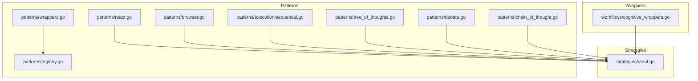
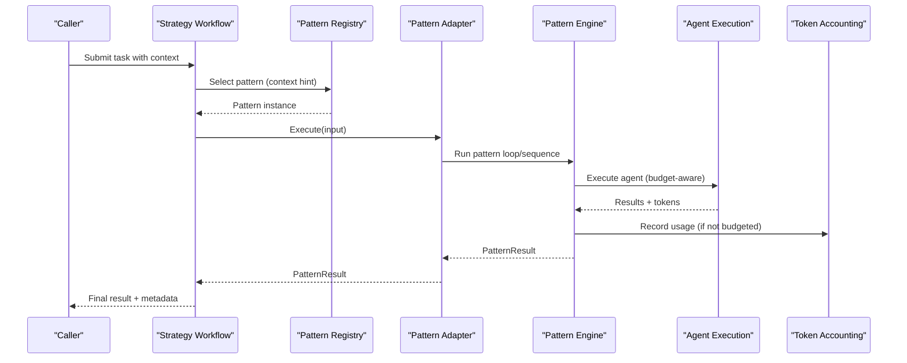
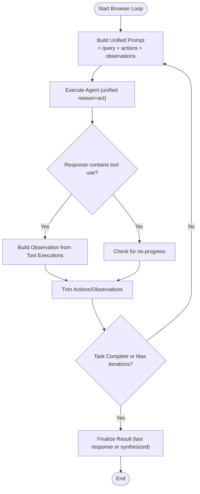
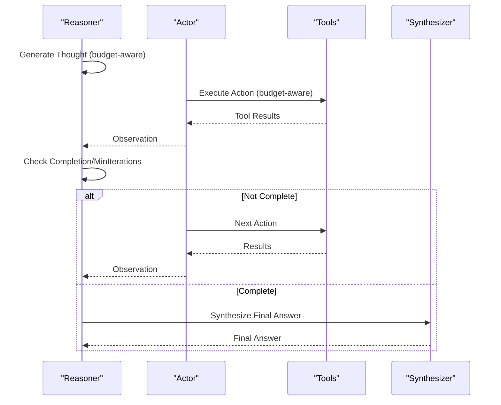
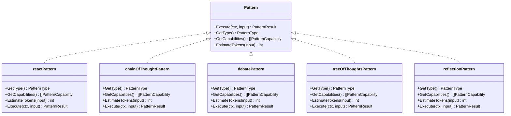
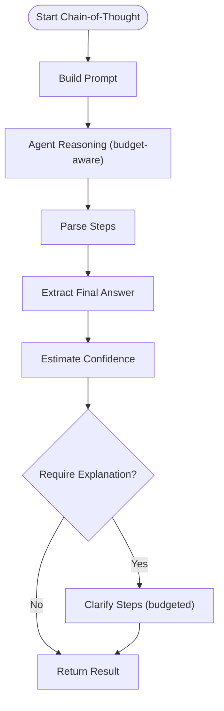
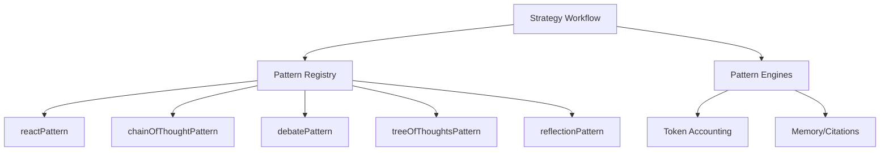

# Cognitive Patterns

<cite>
**Referenced Files in This Document**
- [patterns/browser.go](file://go/orchestrator/internal/workflows/patterns/browser.go)
- [patterns/react.go](file://go/orchestrator/internal/workflows/patterns/react.go)
- [patterns/wrappers.go](file://go/orchestrator/internal/workflows/patterns/wrappers.go)
- [patterns/registry.go](file://go/orchestrator/internal/workflows/patterns/registry.go)
- [patterns/execution/sequential.go](file://go/orchestrator/internal/workflows/patterns/execution/sequential.go)
- [strategies/react.go](file://go/orchestrator/internal/workflows/strategies/react.go)
- [patterns/tree_of_thoughts.go](file://go/orchestrator/internal/workflows/patterns/tree_of_thoughts.go)
- [patterns/debate.go](file://go/orchestrator/internal/workflows/patterns/debate.go)
- [patterns/chain_of_thought.go](file://go/orchestrator/internal/workflows/patterns/chain_of_thought.go)
- [workflows/cognitive_wrappers.go](file://go/orchestrator/internal/workflows/cognitive_wrappers.go)
</cite>

## Table of Contents
1. [Introduction](#introduction)
2. [Project Structure](#project-structure)
3. [Core Components](#core-components)
4. [Architecture Overview](#architecture-overview)
5. [Detailed Component Analysis](#detailed-component-analysis)
6. [Dependency Analysis](#dependency-analysis)
7. [Performance Considerations](#performance-considerations)
8. [Troubleshooting Guide](#troubleshooting-guide)
9. [Conclusion](#conclusion)
10. [Appendices](#appendices)

## Introduction
This document explains the cognitive patterns that power advanced reasoning and problem-solving in Shannon’s multi-agent system. It focuses on three core families:
- Browser use patterns for web-based information gathering
- React patterns for adaptive, step-by-step reasoning and response generation
- Wrapper patterns for composing and selecting cognitive patterns

It also details how these patterns integrate with agent workflows, the execution contexts, input processing, and output synthesis mechanisms. Practical examples illustrate applications in research workflows, decision support systems, and interactive analysis tasks. Finally, it covers performance optimization, memory utilization, cost management, customization, domain adaptation, and integration with external knowledge sources.

## Project Structure
Shannon organizes cognitive patterns under a dedicated patterns package with supporting execution utilities, a registry for pattern selection, and strategy-level workflows that orchestrate pattern execution within agent sessions.

**Diagram sources**
- [patterns/react.go](file://go/orchestrator/internal/workflows/patterns/react.go#L1-L905)
- [patterns/browser.go](file://go/orchestrator/internal/workflows/patterns/browser.go#L1-L500)
- [patterns/wrappers.go](file://go/orchestrator/internal/workflows/patterns/wrappers.go#L1-L264)
- [patterns/registry.go](file://go/orchestrator/internal/workflows/patterns/registry.go#L1-L190)
- [patterns/execution/sequential.go](file://go/orchestrator/internal/workflows/patterns/execution/sequential.go#L1-L475)
- [strategies/react.go](file://go/orchestrator/internal/workflows/strategies/react.go#L1-L535)
- [patterns/tree_of_thoughts.go](file://go/orchestrator/internal/workflows/patterns/tree_of_thoughts.go#L1-L631)
- [patterns/debate.go](file://go/orchestrator/internal/workflows/patterns/debate.go#L1-L644)
- [patterns/chain_of_thought.go](file://go/orchestrator/internal/workflows/patterns/chain_of_thought.go#L1-L433)
- [workflows/cognitive_wrappers.go](file://go/orchestrator/internal/workflows/cognitive_wrappers.go#L1-L78)

**Section sources**
- [patterns/react.go](file://go/orchestrator/internal/workflows/patterns/react.go#L1-L905)
- [patterns/browser.go](file://go/orchestrator/internal/workflows/patterns/browser.go#L1-L500)
- [patterns/wrappers.go](file://go/orchestrator/internal/workflows/patterns/wrappers.go#L1-L264)
- [patterns/registry.go](file://go/orchestrator/internal/workflows/patterns/registry.go#L1-L190)
- [patterns/execution/sequential.go](file://go/orchestrator/internal/workflows/patterns/execution/sequential.go#L1-L475)
- [strategies/react.go](file://go/orchestrator/internal/workflows/strategies/react.go#L1-L535)
- [patterns/tree_of_thoughts.go](file://go/orchestrator/internal/workflows/patterns/tree_of_thoughts.go#L1-L631)
- [patterns/debate.go](file://go/orchestrator/internal/workflows/patterns/debate.go#L1-L644)
- [patterns/chain_of_thought.go](file://go/orchestrator/internal/workflows/patterns/chain_of_thought.go#L1-L433)
- [workflows/cognitive_wrappers.go](file://go/orchestrator/internal/workflows/cognitive_wrappers.go#L1-L78)

## Core Components
- Pattern interface and registry: Defines the contract for all cognitive patterns, capability descriptors, and a default selection strategy.
- Pattern wrappers: Concrete adapters that wrap core pattern implementations to satisfy the Pattern interface and expose standardized execution, estimation, and metadata.
- Execution engines: Utilities for sequential execution of tasks with agent memory, tool parameter handling, and token accounting.
- Strategy-level workflows: Orchestrate pattern execution within agent sessions, handle control signals, memory retrieval, context compression, citations, and cost alignment.

Key responsibilities:
- Input processing: Context merging, session memory injection, hierarchical or session memory retrieval, context compression, and budget-aware execution.
- Pattern execution: Iterative loops, tool execution, observation synthesis, and optional reflection.
- Output synthesis: Final answers, confidence scores, citations, and metadata for downstream consumption.

**Section sources**
- [patterns/registry.go](file://go/orchestrator/internal/workflows/patterns/registry.go#L1-L190)
- [patterns/wrappers.go](file://go/orchestrator/internal/workflows/patterns/wrappers.go#L1-L264)
- [patterns/execution/sequential.go](file://go/orchestrator/internal/workflows/patterns/execution/sequential.go#L1-L475)
- [strategies/react.go](file://go/orchestrator/internal/workflows/strategies/react.go#L1-L535)

## Architecture Overview
The cognitive patterns are orchestrated by strategy workflows that coordinate memory, budgeting, streaming, and token accounting. The registry enables dynamic selection of patterns based on task characteristics and context hints.

**Diagram sources**
- [strategies/react.go](file://go/orchestrator/internal/workflows/strategies/react.go#L20-L535)
- [patterns/registry.go](file://go/orchestrator/internal/workflows/patterns/registry.go#L85-L170)
- [patterns/wrappers.go](file://go/orchestrator/internal/workflows/patterns/wrappers.go#L31-L51)
- [patterns/react.go](file://go/orchestrator/internal/workflows/patterns/react.go#L47-L702)
- [patterns/execution/sequential.go](file://go/orchestrator/internal/workflows/patterns/execution/sequential.go#L47-L395)

## Detailed Component Analysis

### Browser Use Patterns
Browser patterns automate web interactions by combining reasoning and action in a unified loop. They:
- Build a unified prompt that includes task, previous actions, and recent observations
- Execute a single agent call per iteration reasoning and acting together
- Truncate base64 images and tool outputs to prevent context overflow
- Detect completion heuristics and lack of progress to terminate loops
- Record token usage and publish streaming events for progress visibility

**Diagram sources**
- [patterns/browser.go](file://go/orchestrator/internal/workflows/patterns/browser.go#L48-L294)

**Section sources**
- [patterns/browser.go](file://go/orchestrator/internal/workflows/patterns/browser.go#L1-L500)

### React Patterns (Reason-Act-Observe)
React patterns alternate between reasoning and acting, with optional reflection and citation collection:
- Alternating reasoner and actor agents generate thoughts, plan actions, and observe outcomes
- Observations are summarized to prevent memory growth
- Early termination criteria include convergence, high-confidence solutions, and citation stagnation
- Optional reflection improves quality for complex results
- Citations are collected and appended to the final report

**Diagram sources**
- [patterns/react.go](file://go/orchestrator/internal/workflows/patterns/react.go#L47-L702)
- [strategies/react.go](file://go/orchestrator/internal/workflows/strategies/react.go#L20-L535)

**Section sources**
- [patterns/react.go](file://go/orchestrator/internal/workflows/patterns/react.go#L1-L905)
- [strategies/react.go](file://go/orchestrator/internal/workflows/strategies/react.go#L1-L535)

### Wrapper Patterns (Pattern Composition)
Wrapper patterns adapt core pattern implementations to the shared Pattern interface:
- reactPattern: Wraps ReactLoop with capability for step-by-step exploration
- chainOfThoughtPattern: Wraps ChainOfThought with step-by-step reasoning
- debatePattern: Wraps Debate with multi-perspective and consensus capabilities
- treeOfThoughtsPattern: Wraps TreeOfThoughts with branching exploration
- reflectionPattern: Wraps single-pass answer with optional iterative reflection

**Diagram sources**
- [patterns/registry.go](file://go/orchestrator/internal/workflows/patterns/registry.go#L35-L70)
- [patterns/wrappers.go](file://go/orchestrator/internal/workflows/patterns/wrappers.go#L14-L264)

**Section sources**
- [patterns/registry.go](file://go/orchestrator/internal/workflows/patterns/registry.go#L1-L190)
- [patterns/wrappers.go](file://go/orchestrator/internal/workflows/patterns/wrappers.go#L1-L264)

### Additional Cognitive Patterns
- Chain-of-Thought: Guides explicit step-by-step reasoning, parsing steps and extracting final answers with confidence estimation.
- Tree of Thoughts: Systematically explores solution paths with pruning, backtracking, and confidence scoring.
- Debate: Multi-agent debate with perspectives, rounds, optional moderator or voting, and consensus detection.

**Diagram sources**
- [patterns/chain_of_thought.go](file://go/orchestrator/internal/workflows/patterns/chain_of_thought.go#L36-L295)

**Section sources**
- [patterns/chain_of_thought.go](file://go/orchestrator/internal/workflows/patterns/chain_of_thought.go#L1-L433)
- [patterns/tree_of_thoughts.go](file://go/orchestrator/internal/workflows/patterns/tree_of_thoughts.go#L1-L631)
- [patterns/debate.go](file://go/orchestrator/internal/workflows/patterns/debate.go#L1-L644)

### Execution Contexts, Input Processing, and Output Synthesis
- Context merging: Base context merged with session context and optional parent workflow ID for streaming correlation.
- Memory retrieval: Hierarchical or session memory injected into context for richer reasoning.
- Context compression: Triggered when history exceeds thresholds to reduce token usage.
- Tool execution: Results recorded and observations synthesized; tool parameters can be cleared for dependent tasks.
- Citation collection: Aggregated from agent results and appended to the final report.
- Cost alignment: Approximate model used for pricing and cost estimation; token usage recorded per agent or aggregated.

**Section sources**
- [strategies/react.go](file://go/orchestrator/internal/workflows/strategies/react.go#L73-L535)
- [patterns/execution/sequential.go](file://go/orchestrator/internal/workflows/patterns/execution/sequential.go#L47-L395)

### Practical Applications
- Research workflows: Use React patterns with research strategies to bias tool usage toward web_search and web_fetch, ensuring citations and evidence-backed conclusions.
- Decision support systems: Use Debate patterns to explore multiple perspectives and reach consensus or vote-based outcomes.
- Interactive analysis tasks: Use Chain-of-Thought for transparent step-by-step reasoning, and Tree of Thoughts for exploratory search with pruning and backtracking.

**Section sources**
- [strategies/react.go](file://go/orchestrator/internal/workflows/strategies/react.go#L20-L535)
- [patterns/debate.go](file://go/orchestrator/internal/workflows/patterns/debate.go#L48-L473)
- [patterns/chain_of_thought.go](file://go/orchestrator/internal/workflows/patterns/chain_of_thought.go#L36-L295)
- [patterns/tree_of_thoughts.go](file://go/orchestrator/internal/workflows/patterns/tree_of_thoughts.go#L52-L236)

## Dependency Analysis
The pattern registry centralizes pattern discovery and selection. Strategy workflows depend on the registry to choose the appropriate pattern and on the pattern engines for execution. Token accounting and streaming are integrated across the stack.

**Diagram sources**
- [patterns/registry.go](file://go/orchestrator/internal/workflows/patterns/registry.go#L71-L170)
- [patterns/wrappers.go](file://go/orchestrator/internal/workflows/patterns/wrappers.go#L14-L141)
- [strategies/react.go](file://go/orchestrator/internal/workflows/strategies/react.go#L20-L535)

**Section sources**
- [patterns/registry.go](file://go/orchestrator/internal/workflows/patterns/registry.go#L1-L190)
- [patterns/wrappers.go](file://go/orchestrator/internal/workflows/patterns/wrappers.go#L1-L264)
- [strategies/react.go](file://go/orchestrator/internal/workflows/strategies/react.go#L1-L535)

## Performance Considerations
- Iteration limits: React and Tree of Thoughts enforce max iterations and depth to cap compute.
- Observation trimming: Keeps recent observations and actions bounded to control memory and token usage.
- Budget-aware execution: Uses ExecuteAgentWithBudgetActivity to constrain tokens per step.
- Token accounting: Records usage per phase or consolidates when budgeted; avoids double-counting.
- Context compression: Reduces long histories to stay within model windows.
- Parallelization: Some patterns (e.g., debate) execute multiple agents concurrently to improve throughput.

[No sources needed since this section provides general guidance]

## Troubleshooting Guide
Common issues and mitigations:
- No progress loops: React detects lack of tool execution and stops after repeated iterations without progress.
- Tool failures: Strategy aggregates tool errors from agent results for diagnostics.
- Budget exceeded: Budgeted execution prevents runaway token usage; adjust budgets or tiers.
- Streaming interruptions: Control signals and child workflow wrappers ensure proper cancellation and cleanup.

**Section sources**
- [patterns/react.go](file://go/orchestrator/internal/workflows/patterns/react.go#L747-L787)
- [strategies/react.go](file://go/orchestrator/internal/workflows/strategies/react.go#L434-L449)
- [workflows/cognitive_wrappers.go](file://go/orchestrator/internal/workflows/cognitive_wrappers.go#L9-L78)

## Conclusion
Shannon’s cognitive patterns provide a modular, extensible foundation for advanced reasoning and problem-solving. By composing browser use, React-style step-by-step reasoning, and specialized patterns like debate and tree-of-thoughts, the system supports diverse workflows—from research and decision-making to interactive analysis. The registry and strategy-level orchestration enable seamless integration, while robust memory, budgeting, and token accounting keep performance and cost under control.

[No sources needed since this section summarizes without analyzing specific files]

## Appendices

### Pattern Execution Contexts
- Context merging: Base context + session context + optional parent workflow ID
- Memory: Hierarchical or session memory injected into context
- Compression: Triggered when history exceeds thresholds
- Budget: Per-step or per-task token caps
- Streaming: Events emitted for progress and completion

**Section sources**
- [strategies/react.go](file://go/orchestrator/internal/workflows/strategies/react.go#L73-L177)

### Input Processing and Output Synthesis
- Inputs: Query, context, history, session ID, user ID, optional budget and model tier
- Outputs: Final result, tokens used, confidence, metadata, and optional citations
- Synthesis: Final answer extraction, confidence scoring, and citation aggregation

**Section sources**
- [patterns/registry.go](file://go/orchestrator/internal/workflows/patterns/registry.go#L50-L69)
- [patterns/chain_of_thought.go](file://go/orchestrator/internal/workflows/patterns/chain_of_thought.go#L183-L295)
- [patterns/debate.go](file://go/orchestrator/internal/workflows/patterns/debate.go#L407-L473)

### Cost Management and Optimization
- Pricing: Approximate model used for cost estimation
- Token usage: Recorded per agent or consolidated when budgeted
- Budgeting: Per-pattern and per-step caps to control spending
- Compression: Reduces context size to lower costs

**Section sources**
- [strategies/react.go](file://go/orchestrator/internal/workflows/strategies/react.go#L493-L497)
- [patterns/execution/sequential.go](file://go/orchestrator/internal/workflows/patterns/execution/sequential.go#L270-L345)

### Customization and Domain Adaptation
- Pattern selection: Explicit hints in context or default selection strategy
- Tool biasing: Research mode biases toward web_search/web_fetch
- Prompt templates: Customizable prompts for chain-of-thought
- Perspectives: Debates support configurable perspectives and moderators

**Section sources**
- [patterns/registry.go](file://go/orchestrator/internal/workflows/patterns/registry.go#L85-L108)
- [patterns/react.go](file://go/orchestrator/internal/workflows/patterns/react.go#L302-L407)
- [patterns/chain_of_thought.go](file://go/orchestrator/internal/workflows/patterns/chain_of_thought.go#L297-L317)
- [patterns/debate.go](file://go/orchestrator/internal/workflows/patterns/debate.go#L475-L489)