# DAG Workflow Execution

<cite>
**Referenced Files in This Document**
- [dag.go](file://go/orchestrator/internal/workflows/strategies/dag.go)
- [parallel.go](file://go/orchestrator/internal/workflows/patterns/execution/parallel.go)
- [sequential.go](file://go/orchestrator/internal/workflows/patterns/execution/sequential.go)
- [hybrid.go](file://go/orchestrator/internal/workflows/patterns/execution/hybrid.go)
- [types.go](file://go/orchestrator/internal/workflows/types.go)
- [dag_workflow_bypass_test.go](file://go/orchestrator/internal/workflows/dag_workflow_bypass_test.go)
- [dag_workflow_dependent_math_test.go](file://go/orchestrator/internal/workflows/dag_workflow_dependent_math_test.go)
- [complex_dag.yaml](file://config/workflows/examples/complex_dag.yaml)
- [parallel_dag_example.yaml](file://config/workflows/examples/parallel_dag_example.yaml)
</cite>

## Table of Contents
1. [Introduction](#introduction)
2. [Project Structure](#project-structure)
3. [Core Components](#core-components)
4. [Architecture Overview](#architecture-overview)
5. [Detailed Component Analysis](#detailed-component-analysis)
6. [Dependency Analysis](#dependency-analysis)
7. [Performance Considerations](#performance-considerations)
8. [Troubleshooting Guide](#troubleshooting-guide)
9. [Conclusion](#conclusion)
10. [Appendices](#appendices)

## Introduction
This document explains Directed Acyclic Graph (DAG) workflow execution in Shannon’s multi-agent system. It covers how DAG workflows are constructed from decomposition plans, how dependencies are managed across parallel, sequential, and hybrid execution patterns, and how results are aggregated and synthesized. It also documents bypass mechanisms for single-result scenarios, mathematical dependency resolution with numeric value propagation, and robustness features such as reflection, citation injection, and token budgeting. Practical examples illustrate multi-step research workflows, data processing pipelines, and coordinated analysis tasks. Finally, it outlines validation, cycle detection, scaling, resource management, and fault tolerance strategies for large-scale multi-agent coordination.

## Project Structure
Shannon’s DAG execution spans a few core areas:
- Workflow orchestration and composition: DAGWorkflow and execution strategy selection
- Execution patterns: parallel, sequential, and hybrid
- Types and inputs/outputs for workflows
- Tests validating bypass and dependent math behavior
- YAML-based workflow templates demonstrating DAG usage

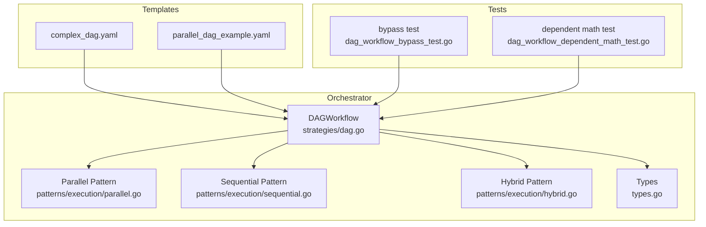

**Diagram sources**
- [dag.go](file://go/orchestrator/internal/workflows/strategies/dag.go#L24-L1053)
- [parallel.go](file://go/orchestrator/internal/workflows/patterns/execution/parallel.go#L48-L450)
- [sequential.go](file://go/orchestrator/internal/workflows/patterns/execution/sequential.go#L47-L395)
- [hybrid.go](file://go/orchestrator/internal/workflows/patterns/execution/hybrid.go#L66-L161)
- [types.go](file://go/orchestrator/internal/workflows/types.go#L8-L59)
- [complex_dag.yaml](file://config/workflows/examples/complex_dag.yaml#L1-L52)
- [parallel_dag_example.yaml](file://config/workflows/examples/parallel_dag_example.yaml#L1-L62)
- [dag_workflow_bypass_test.go](file://go/orchestrator/internal/workflows/dag_workflow_bypass_test.go#L16-L108)
- [dag_workflow_dependent_math_test.go](file://go/orchestrator/internal/workflows/dag_workflow_dependent_math_test.go#L15-L253)

**Section sources**
- [dag.go](file://go/orchestrator/internal/workflows/strategies/dag.go#L24-L1053)
- [parallel.go](file://go/orchestrator/internal/workflows/patterns/execution/parallel.go#L48-L450)
- [sequential.go](file://go/orchestrator/internal/workflows/patterns/execution/sequential.go#L47-L395)
- [hybrid.go](file://go/orchestrator/internal/workflows/patterns/execution/hybrid.go#L66-L161)
- [types.go](file://go/orchestrator/internal/workflows/types.go#L8-L59)
- [complex_dag.yaml](file://config/workflows/examples/complex_dag.yaml#L1-L52)
- [parallel_dag_example.yaml](file://config/workflows/examples/parallel_dag_example.yaml#L1-L62)
- [dag_workflow_bypass_test.go](file://go/orchestrator/internal/workflows/dag_workflow_bypass_test.go#L16-L108)
- [dag_workflow_dependent_math_test.go](file://go/orchestrator/internal/workflows/dag_workflow_dependent_math_test.go#L15-L253)

## Core Components
- DAGWorkflow: Orchestrates decomposition, selects execution strategy (parallel/sequential/hybrid), executes agents, synthesizes results, injects citations, and optionally reflects for quality.
- Execution Patterns:
  - Parallel: Runs multiple tasks concurrently with bounded concurrency and optional budgeting.
  - Sequential: Executes tasks in order, optionally passing prior results and extracting numeric values.
  - Hybrid: Combines parallelism with dependency-aware scheduling and configurable wait timeouts.
- Types: Defines TaskInput and TaskResult structures used across workflows and activities.
- Tests: Validate bypass behavior and dependent math resolution with numeric propagation.

Key behaviors:
- Strategy selection based on decomposition and dependencies
- Control signals for pause/resume/cancel
- Token budgeting and cost aggregation
- Citation collection and injection
- Reflection for quality improvement

**Section sources**
- [dag.go](file://go/orchestrator/internal/workflows/strategies/dag.go#L24-L1053)
- [parallel.go](file://go/orchestrator/internal/workflows/patterns/execution/parallel.go#L48-L450)
- [sequential.go](file://go/orchestrator/internal/workflows/patterns/execution/sequential.go#L47-L395)
- [hybrid.go](file://go/orchestrator/internal/workflows/patterns/execution/hybrid.go#L66-L161)
- [types.go](file://go/orchestrator/internal/workflows/types.go#L8-L59)

## Architecture Overview
The DAG workflow pipeline integrates decomposition, pattern execution, synthesis, and optional citation/reflection. It emits streaming events and persists agent/tool execution details.

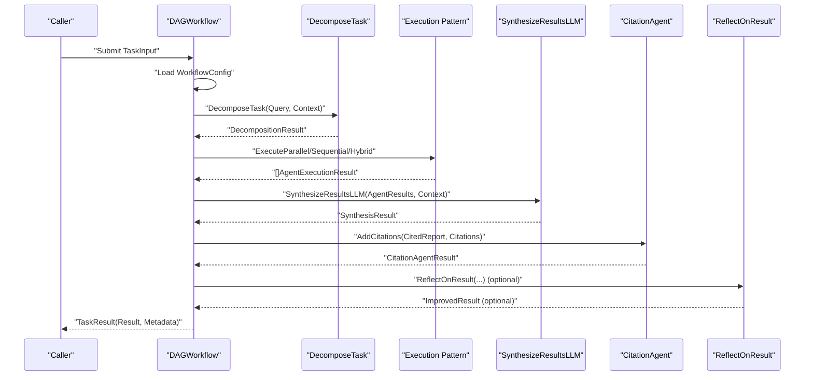

**Diagram sources**
- [dag.go](file://go/orchestrator/internal/workflows/strategies/dag.go#L64-L1053)
- [parallel.go](file://go/orchestrator/internal/workflows/patterns/execution/parallel.go#L48-L450)
- [sequential.go](file://go/orchestrator/internal/workflows/patterns/execution/sequential.go#L47-L395)
- [hybrid.go](file://go/orchestrator/internal/workflows/patterns/execution/hybrid.go#L66-L161)

## Detailed Component Analysis

### DAGWorkflow Orchestration
DAGWorkflow coordinates the entire lifecycle:
- Loads configuration with defaults if unavailable
- Decomposes the task or uses a preplanned decomposition
- Determines strategy based on dependencies and configuration
- Executes agents via selected pattern
- Synthesizes results with optional citation injection
- Optionally reflects for quality improvement
- Emits streaming events and records metrics

Notable features:
- Bypass single successful result to avoid synthesis when appropriate
- Detects synthesis subtasks and handles them specially
- Supports citation collection and re-injection
- Aggregates metadata, costs, and tool errors

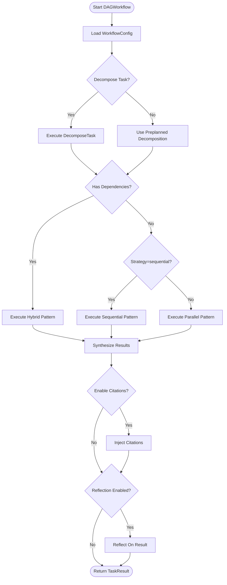

**Diagram sources**
- [dag.go](file://go/orchestrator/internal/workflows/strategies/dag.go#L64-L1053)

**Section sources**
- [dag.go](file://go/orchestrator/internal/workflows/strategies/dag.go#L24-L1053)

### Parallel Execution Pattern
Parallel execution runs multiple tasks concurrently with bounded concurrency and optional budgeting. It:
- Uses a semaphore to cap concurrency
- Emits agent start/completion events
- Records token usage and persists agent/tool executions
- Handles budgeted vs non-budgeted execution paths

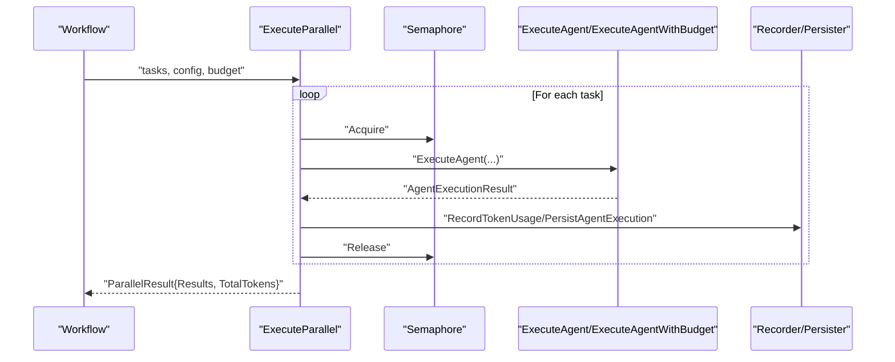

**Diagram sources**
- [parallel.go](file://go/orchestrator/internal/workflows/patterns/execution/parallel.go#L48-L450)

**Section sources**
- [parallel.go](file://go/orchestrator/internal/workflows/patterns/execution/parallel.go#L48-L450)

### Sequential Execution Pattern
Sequential execution runs tasks in order, optionally:
- Passing previous results to subsequent tasks
- Extracting numeric values from prior responses
- Clearing tool parameters for dependent tasks
- Recording token usage and persisting results

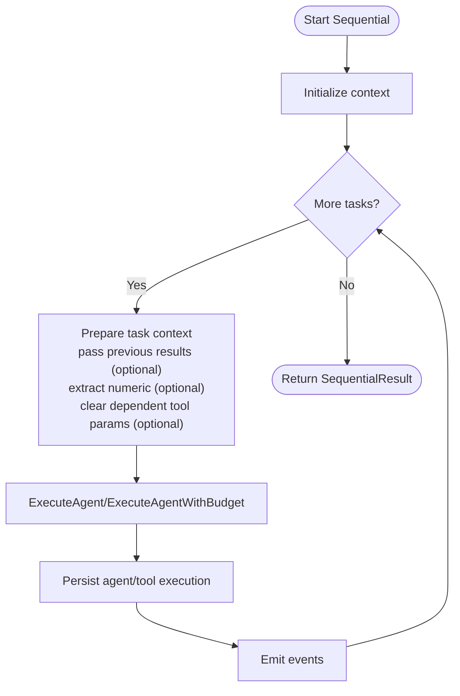

**Diagram sources**
- [sequential.go](file://go/orchestrator/internal/workflows/patterns/execution/sequential.go#L47-L395)

**Section sources**
- [sequential.go](file://go/orchestrator/internal/workflows/patterns/execution/sequential.go#L47-L395)

### Hybrid Execution Pattern
Hybrid combines parallelism with dependency-aware scheduling:
- Tasks without dependencies run in parallel up to concurrency limit
- Tasks with dependencies wait for prerequisites to complete
- Supports configurable wait timeout and check intervals
- Passes dependency results to dependent tasks when configured

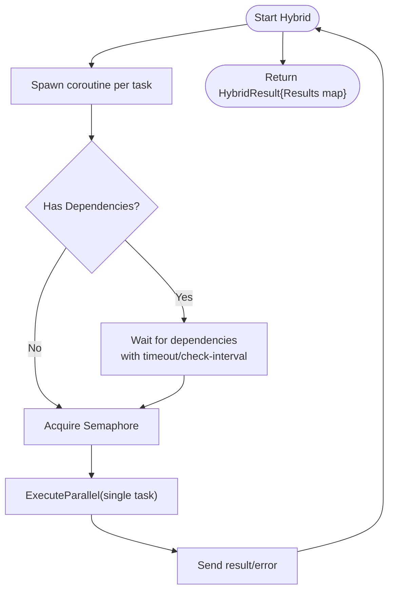

**Diagram sources**
- [hybrid.go](file://go/orchestrator/internal/workflows/patterns/execution/hybrid.go#L66-L161)

**Section sources**
- [hybrid.go](file://go/orchestrator/internal/workflows/patterns/execution/hybrid.go#L66-L161)

### Task Sequencing, Conditional Branching, and Failure Handling
- Task sequencing: Sequential and hybrid patterns enforce ordering via dependencies.
- Conditional branching: YAML templates define nodes and edges; runtime branching is implicit in the decomposition and execution strategy selection.
- Failure handling: Patterns continue execution despite failures, emit error events, and allow downstream synthesis to proceed.

**Section sources**
- [sequential.go](file://go/orchestrator/internal/workflows/patterns/execution/sequential.go#L240-L260)
- [parallel.go](file://go/orchestrator/internal/workflows/patterns/execution/parallel.go#L249-L276)
- [hybrid.go](file://go/orchestrator/internal/workflows/patterns/execution/hybrid.go#L196-L202)

### Workflow Bypass Mechanisms
When a single agent succeeds and bypass is enabled, synthesis is skipped to reduce latency and cost. The bypass logic considers:
- Tool usage (e.g., web_search)
- Response format (raw JSON vs natural language)
- Citation presence
- Role awareness (e.g., data_analytics)

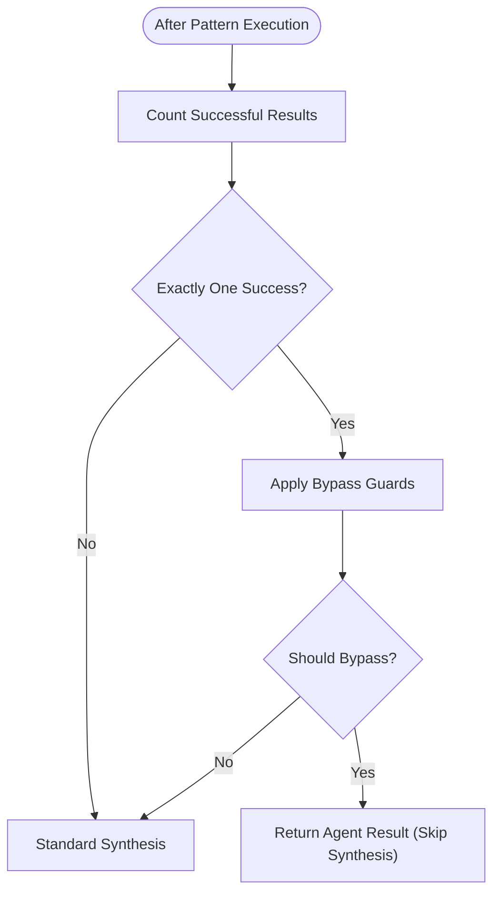

**Diagram sources**
- [dag.go](file://go/orchestrator/internal/workflows/strategies/dag.go#L342-L464)

**Section sources**
- [dag.go](file://go/orchestrator/internal/workflows/strategies/dag.go#L342-L464)
- [dag_workflow_bypass_test.go](file://go/orchestrator/internal/workflows/dag_workflow_bypass_test.go#L16-L108)

### Mathematical Dependency Resolution and Numeric Value Propagation
Dependent math chains propagate numeric values across tasks:
- Tool parameters for dependent tasks are cleared
- Previous results are passed with numeric values extracted from prior responses
- Deterministic computation yields a final numeric answer

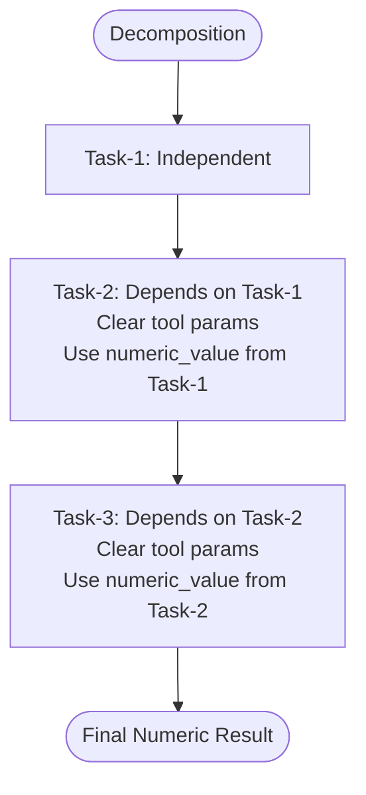

**Diagram sources**
- [dag_workflow_dependent_math_test.go](file://go/orchestrator/internal/workflows/dag_workflow_dependent_math_test.go#L15-L253)
- [sequential.go](file://go/orchestrator/internal/workflows/patterns/execution/sequential.go#L125-L160)
- [hybrid.go](file://go/orchestrator/internal/workflows/patterns/execution/hybrid.go#L236-L248)

**Section sources**
- [dag_workflow_dependent_math_test.go](file://go/orchestrator/internal/workflows/dag_workflow_dependent_math_test.go#L15-L253)
- [sequential.go](file://go/orchestrator/internal/workflows/patterns/execution/sequential.go#L125-L160)
- [hybrid.go](file://go/orchestrator/internal/workflows/patterns/execution/hybrid.go#L236-L248)

### Result Aggregation Patterns
Aggregation includes:
- Token usage aggregation across agents and synthesis
- Cost estimation using pricing utilities
- Citation collection and structured metadata
- Tool error aggregation and verification metadata

**Section sources**
- [dag.go](file://go/orchestrator/internal/workflows/strategies/dag.go#L869-L1010)

### Practical Examples
- Complex multi-branch DAG with fallbacks: Demonstrates branching from a central analysis node to multiple specialized analyses and a final synthesis with degrade-on-fail.
- Parallel DAG with internal dependencies: Shows a DAG node containing tasks with dependencies that execute in parallel within the node, followed by a synthesis step.

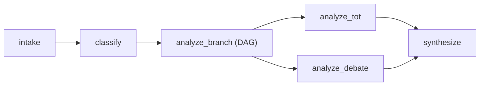

**Diagram sources**
- [complex_dag.yaml](file://config/workflows/examples/complex_dag.yaml#L1-L52)

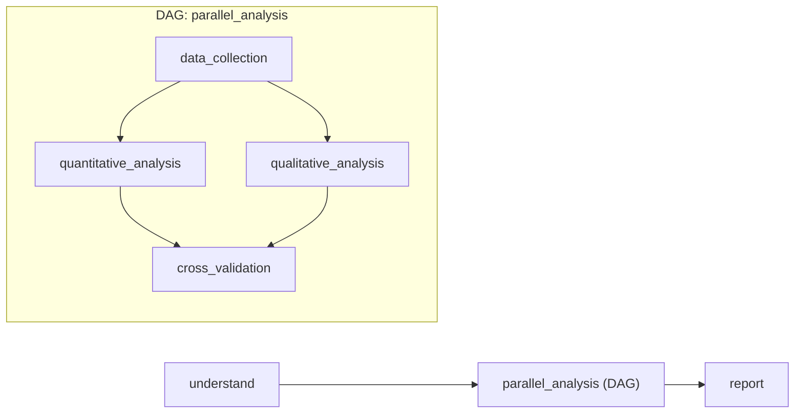

**Diagram sources**
- [parallel_dag_example.yaml](file://config/workflows/examples/parallel_dag_example.yaml#L1-L62)

**Section sources**
- [complex_dag.yaml](file://config/workflows/examples/complex_dag.yaml#L1-L52)
- [parallel_dag_example.yaml](file://config/workflows/examples/parallel_dag_example.yaml#L1-L62)

## Dependency Analysis
- Strategy selection depends on decomposition results and configuration:
  - Hybrid when dependencies exist
  - Sequential when explicitly requested
  - Parallel otherwise
- Execution patterns coordinate via channels and semaphores; hybrid uses dependency maps and wait loops.
- Metadata and token usage are aggregated centrally for reporting and billing.

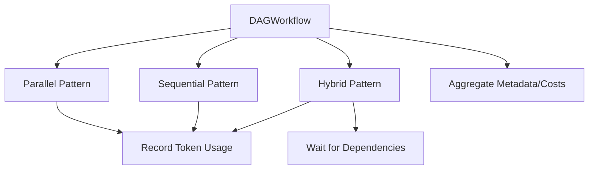

**Diagram sources**
- [dag.go](file://go/orchestrator/internal/workflows/strategies/dag.go#L262-L295)
- [parallel.go](file://go/orchestrator/internal/workflows/patterns/execution/parallel.go#L281-L362)
- [sequential.go](file://go/orchestrator/internal/workflows/patterns/execution/sequential.go#L270-L345)
- [hybrid.go](file://go/orchestrator/internal/workflows/patterns/execution/hybrid.go#L189-L207)

**Section sources**
- [dag.go](file://go/orchestrator/internal/workflows/strategies/dag.go#L262-L295)
- [parallel.go](file://go/orchestrator/internal/workflows/patterns/execution/parallel.go#L281-L362)
- [sequential.go](file://go/orchestrator/internal/workflows/patterns/execution/sequential.go#L270-L345)
- [hybrid.go](file://go/orchestrator/internal/workflows/patterns/execution/hybrid.go#L189-L207)

## Performance Considerations
- Concurrency control: Use bounded concurrency to prevent resource saturation while maintaining throughput.
- Token budgeting: Distribute budget per agent to cap costs and improve fairness.
- Numeric extraction: Reduce downstream parsing overhead by extracting numeric values early.
- Event streaming: Emit lightweight events to minimize overhead while preserving observability.
- Reflection gating: Enable reflection only when beneficial to avoid unnecessary LLM calls.

[No sources needed since this section provides general guidance]

## Troubleshooting Guide
Common issues and mitigations:
- Dependency wait timeouts: Adjust HybridDependencyTimeout and check intervals; verify dependency IDs match task IDs.
- Single-result bypass unintended: Disable bypass or refine guards for tool usage and response formats.
- Citation injection failures: Validate CitationAgent results and fallback to original synthesis when validation fails.
- Token accounting discrepancies: Ensure budgeted vs non-budgeted paths are not double-counted; verify model/provider fallbacks.

**Section sources**
- [hybrid.go](file://go/orchestrator/internal/workflows/patterns/execution/hybrid.go#L348-L407)
- [dag.go](file://go/orchestrator/internal/workflows/strategies/dag.go#L716-L758)
- [dag_workflow_bypass_test.go](file://go/orchestrator/internal/workflows/dag_workflow_bypass_test.go#L107-L108)

## Conclusion
Shannon’s DAG workflow execution provides a robust, scalable framework for multi-agent coordination. By composing parallel, sequential, and hybrid patterns, it supports complex research workflows, data processing pipelines, and coordinated analysis tasks. Built-in mechanisms for bypass, citation injection, reflection, and numeric propagation enhance efficiency and quality. With careful configuration of concurrency, budgets, and dependency timeouts, the system scales effectively while maintaining fault tolerance and observability.

[No sources needed since this section summarizes without analyzing specific files]

## Appendices

### Workflow Validation and Cycle Detection
- YAML templates define nodes and edges; runtime strategy selection avoids cycles by leveraging decomposition and dependency maps.
- Hybrid pattern enforces dependency satisfaction before execution; explicit cycles would block indefinitely.

**Section sources**
- [complex_dag.yaml](file://config/workflows/examples/complex_dag.yaml#L39-L52)
- [hybrid.go](file://go/orchestrator/internal/workflows/patterns/execution/hybrid.go#L189-L207)

### Scaling, Resource Management, and Fault Tolerance
- Horizontal scaling: Increase concurrency limits and parallel task counts judiciously.
- Resource management: Use token budgets, model tiers, and provider overrides to balance cost and performance.
- Fault tolerance: Continue execution despite individual failures; leverage reflection and degrade-on-fail configurations.

[No sources needed since this section provides general guidance]