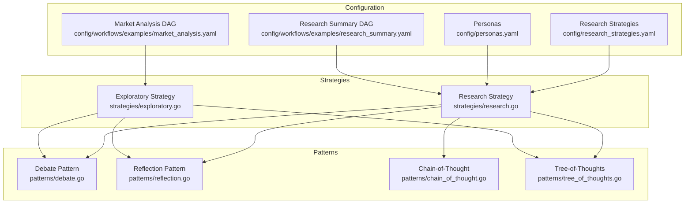
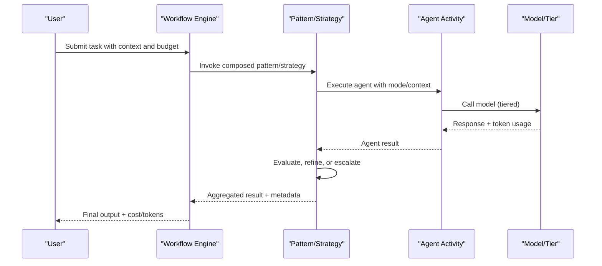
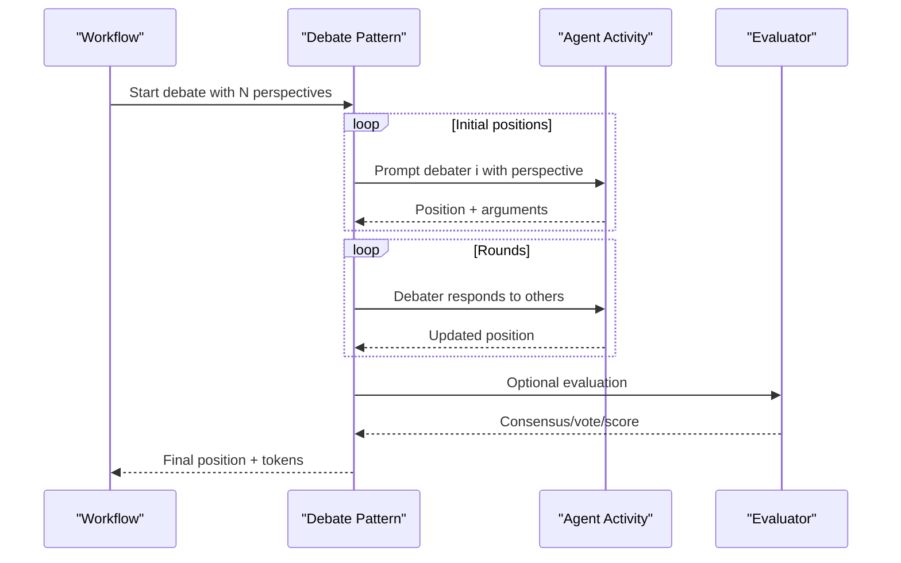
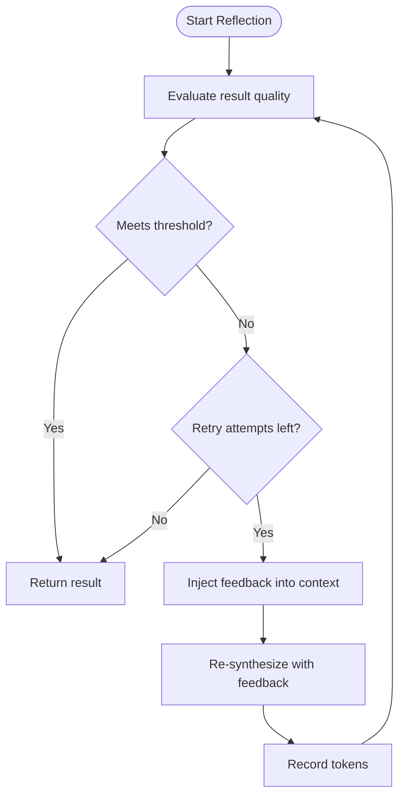
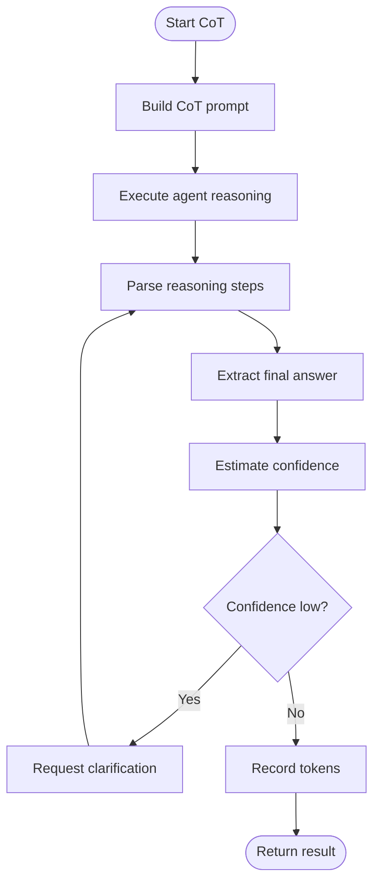
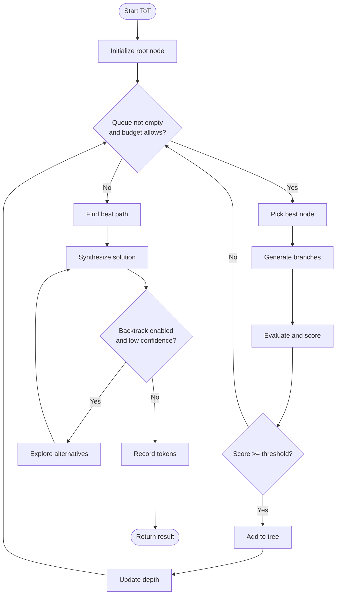
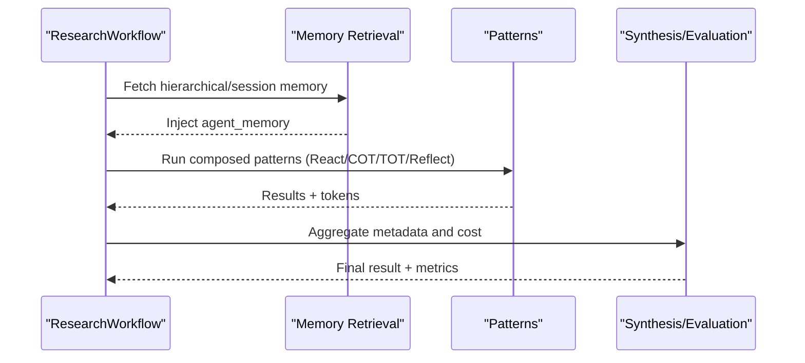
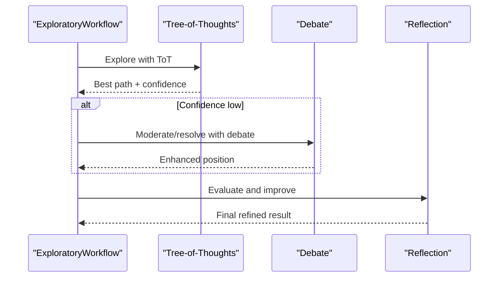
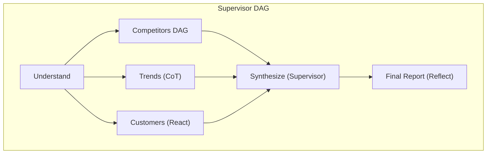
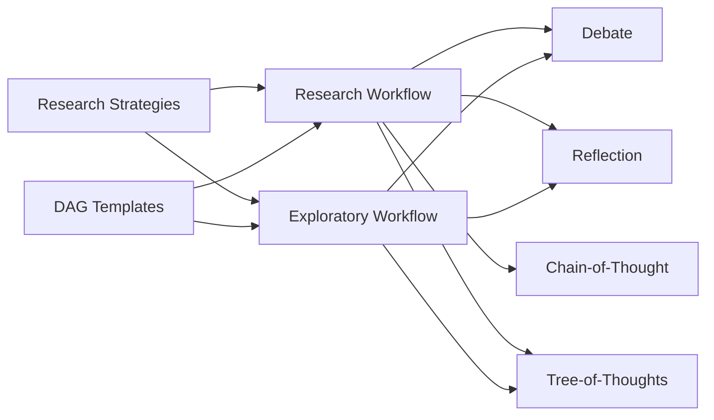

# Multi-Agent Orchestration

<cite>
**Referenced Files in This Document**
- [research_strategies.yaml](file://config/research_strategies.yaml)
- [personas.yaml](file://config/personas.yaml)
- [debate.go](file://go/orchestrator/internal/workflows/patterns/debate.go)
- [reflection.go](file://go/orchestrator/internal/workflows/patterns/reflection.go)
- [chain_of_thought.go](file://go/orchestrator/internal/workflows/patterns/chain_of_thought.go)
- [tree_of_thoughts.go](file://go/orchestrator/internal/workflows/patterns/tree_of_thoughts.go)
- [research.go](file://go/orchestrator/internal/workflows/strategies/research.go)
- [exploratory.go](file://go/orchestrator/internal/workflows/strategies/exploratory.go)
- [research_summary.yaml](file://config/workflows/examples/research_summary.yaml)
- [market_analysis.yaml](file://config/workflows/examples/market_analysis.yaml)
</cite>

## Table of Contents
1. [Introduction](#introduction)
2. [Project Structure](#project-structure)
3. [Core Components](#core-components)
4. [Architecture Overview](#architecture-overview)
5. [Detailed Component Analysis](#detailed-component-analysis)
6. [Dependency Analysis](#dependency-analysis)
7. [Performance Considerations](#performance-considerations)
8. [Troubleshooting Guide](#troubleshooting-guide)
9. [Conclusion](#conclusion)
10. [Appendices](#appendices)

## Introduction
This document explains Shannon’s multi-agent orchestration for cognitive workflows. It covers five research strategies (quick, standard, deep, academic), debate patterns for adversarial reasoning, reflection patterns for iterative improvement, supervisor-agent hierarchies, and DAG workflow execution for complex multi-step processes. It also documents chain-of-thought and tree-of-thoughts reasoning patterns, practical examples, agent selection and resource allocation, cost optimization strategies, and guidance for customizing patterns and extending them to domain-specific use cases.

## Project Structure
Shannon organizes orchestration around:
- Configuration-driven strategies and personas
- Cognitive patterns (debate, reflection, chain-of-thought, tree-of-thoughts)
- Strategy workflows (research, exploratory)
- Workflow templates (YAML DAGs) for supervisor coordination and parallelization
- Budgeting, token accounting, and model tiering for cost optimization

**Diagram sources**
- [research_strategies.yaml](file://config/research_strategies.yaml#L12-L53)
- [personas.yaml](file://config/personas.yaml#L27-L161)
- [research_summary.yaml](file://config/workflows/examples/research_summary.yaml#L1-L37)
- [market_analysis.yaml](file://config/workflows/examples/market_analysis.yaml#L1-L76)
- [debate.go](file://go/orchestrator/internal/workflows/patterns/debate.go#L48-L473)
- [reflection.go](file://go/orchestrator/internal/workflows/patterns/reflection.go#L17-L170)
- [chain_of_thought.go](file://go/orchestrator/internal/workflows/patterns/chain_of_thought.go#L36-L295)
- [tree_of_thoughts.go](file://go/orchestrator/internal/workflows/patterns/tree_of_thoughts.go#L52-L236)
- [research.go](file://go/orchestrator/internal/workflows/strategies/research.go#L705-L800)
- [exploratory.go](file://go/orchestrator/internal/workflows/strategies/exploratory.go#L17-L426)

**Section sources**
- [research_strategies.yaml](file://config/research_strategies.yaml#L1-L53)
- [personas.yaml](file://config/personas.yaml#L1-L161)
- [research_summary.yaml](file://config/workflows/examples/research_summary.yaml#L1-L37)
- [market_analysis.yaml](file://config/workflows/examples/market_analysis.yaml#L1-L76)
- [debate.go](file://go/orchestrator/internal/workflows/patterns/debate.go#L1-L644)
- [reflection.go](file://go/orchestrator/internal/workflows/patterns/reflection.go#L1-L170)
- [chain_of_thought.go](file://go/orchestrator/internal/workflows/patterns/chain_of_thought.go#L1-L433)
- [tree_of_thoughts.go](file://go/orchestrator/internal/workflows/patterns/tree_of_thoughts.go#L1-L631)
- [research.go](file://go/orchestrator/internal/workflows/strategies/research.go#L705-L800)
- [exploratory.go](file://go/orchestrator/internal/workflows/strategies/exploratory.go#L17-L426)

## Core Components
- Research strategies define concurrency, iterations, gap-filling, and model tiers to balance cost and quality.
- Cognitive patterns encapsulate reasoning and collaboration:
  - Debate: adversarial reasoning across perspectives with optional moderator/voting.
  - Reflection: iterative quality checks and re-synthesis with feedback.
  - Chain-of-thought: explicit step-by-step reasoning with confidence estimation.
  - Tree-of-thoughts: systematic branching exploration with pruning and backtracking.
- Strategy workflows compose patterns for research and exploratory tasks.
- DAG templates enable supervisor coordination, parallel sub-agent pipelines, and failure degradations.

**Section sources**
- [research_strategies.yaml](file://config/research_strategies.yaml#L12-L53)
- [debate.go](file://go/orchestrator/internal/workflows/patterns/debate.go#L17-L47)
- [reflection.go](file://go/orchestrator/internal/workflows/patterns/reflection.go#L17-L28)
- [chain_of_thought.go](file://go/orchestrator/internal/workflows/patterns/chain_of_thought.go#L17-L34)
- [tree_of_thoughts.go](file://go/orchestrator/internal/workflows/patterns/tree_of_thoughts.go#L17-L50)
- [research.go](file://go/orchestrator/internal/workflows/strategies/research.go#L705-L800)
- [exploratory.go](file://go/orchestrator/internal/workflows/strategies/exploratory.go#L17-L426)
- [research_summary.yaml](file://config/workflows/examples/research_summary.yaml#L1-L37)
- [market_analysis.yaml](file://config/workflows/examples/market_analysis.yaml#L1-L76)

## Architecture Overview
Shannon orchestrates multi-agent workflows by composing patterns and strategies with budget-aware execution and optional supervisor synthesis. The system supports:
- Hierarchical supervisor-agent relationships
- DAG-based parallel and sequential pipelines
- Iterative refinement via reflection
- Adversarial validation via debate
- Structured reasoning via chain-of-thought and tree-of-thoughts

[No sources needed since this diagram shows conceptual workflow, not actual code structure]

## Detailed Component Analysis

### Research Strategies
Shannon defines four strategies with tunable concurrency, iterations, gap-filling, and model tiers. Utility activities consistently use “small” tiers; agent execution tiers vary by strategy; synthesis uses “large.”

- quick: minimal verification, low concurrency, small tier
- standard: verification enabled, moderate concurrency and iterations, medium tier
- deep: higher concurrency and iterations, medium tier
- academic: highest concurrency and iterations, medium tier

These configurations reduce costs by 50–70% while maintaining quality, leveraging smaller models plus iteration.

**Section sources**
- [research_strategies.yaml](file://config/research_strategies.yaml#L12-L53)

### Debate Patterns (Adversarial Reasoning)
Debate coordinates multiple debaters to explore different perspectives, iterates rounds, and resolves via moderator, voting, or synthesis. It tracks tokens per round, builds debate history, and persists consensus for learning.

**Diagram sources**
- [debate.go](file://go/orchestrator/internal/workflows/patterns/debate.go#L48-L473)

**Section sources**
- [debate.go](file://go/orchestrator/internal/workflows/patterns/debate.go#L17-L473)

### Reflection Patterns (Iterative Improvement)
Reflection evaluates a result against criteria, and if below threshold, re-synthesizes with feedback. It records token usage and caps retries.

**Diagram sources**
- [reflection.go](file://go/orchestrator/internal/workflows/patterns/reflection.go#L17-L170)

**Section sources**
- [reflection.go](file://go/orchestrator/internal/workflows/patterns/reflection.go#L17-L170)

### Chain-of-Thought Reasoning
Chain-of-thought prompts agents to produce explicit reasoning steps, extracts final answers, and computes confidence. Optional clarification step requests clearer explanations when confidence is low.

**Diagram sources**
- [chain_of_thought.go](file://go/orchestrator/internal/workflows/patterns/chain_of_thought.go#L36-L295)

**Section sources**
- [chain_of_thought.go](file://go/orchestrator/internal/workflows/patterns/chain_of_thought.go#L17-L295)

### Tree-of-Thoughts Problem Solving
Tree-of-thoughts explores a branching solution space with scoring, pruning, and optional backtracking. It synthesizes a narrative solution and confidence from the best path.

**Diagram sources**
- [tree_of_thoughts.go](file://go/orchestrator/internal/workflows/patterns/tree_of_thoughts.go#L52-L236)

**Section sources**
- [tree_of_thoughts.go](file://go/orchestrator/internal/workflows/patterns/tree_of_thoughts.go#L17-L236)

### Research Strategy Workflow
The research workflow composes patterns and strategies, injects memory, manages control signals, and aggregates metadata and cost.

**Diagram sources**
- [research.go](file://go/orchestrator/internal/workflows/strategies/research.go#L705-L800)

**Section sources**
- [research.go](file://go/orchestrator/internal/workflows/strategies/research.go#L705-L800)

### Exploratory Strategy Workflow
The exploratory workflow uses tree-of-thoughts for exploration, optionally applies debate to increase confidence, and ends with reflection for final quality.

**Diagram sources**
- [exploratory.go](file://go/orchestrator/internal/workflows/strategies/exploratory.go#L17-L426)

**Section sources**
- [exploratory.go](file://go/orchestrator/internal/workflows/strategies/exploratory.go#L17-L426)

### Supervisor-Agent Hierarchies and DAG Execution
Supervisor-agent hierarchies coordinate multiple sub-agents and aggregate results. DAG templates define parallel and sequential pipelines, with metadata for coordination and failure degradations.

**Diagram sources**
- [market_analysis.yaml](file://config/workflows/examples/market_analysis.yaml#L9-L76)

**Section sources**
- [market_analysis.yaml](file://config/workflows/examples/market_analysis.yaml#L1-L76)

### Practical Examples
- Research summary pipeline: discover → reason (CoT) → explore (ToT) → finalize (Reflect)
- Market analysis pipeline: understand → parallel DAG (competitors) + trends (CoT) + customers (React) → supervisor synthesis → report (Reflect)

**Section sources**
- [research_summary.yaml](file://config/workflows/examples/research_summary.yaml#L1-L37)
- [market_analysis.yaml](file://config/workflows/examples/market_analysis.yaml#L1-L76)

## Dependency Analysis
- Strategies depend on cognitive patterns and configuration-driven tiers.
- Research and exploratory workflows orchestrate patterns and handle memory, control signals, and cost aggregation.
- DAG templates define supervisor coordination and parallelism.

**Diagram sources**
- [research_strategies.yaml](file://config/research_strategies.yaml#L12-L53)
- [research.go](file://go/orchestrator/internal/workflows/strategies/research.go#L705-L800)
- [exploratory.go](file://go/orchestrator/internal/workflows/strategies/exploratory.go#L17-L426)
- [research_summary.yaml](file://config/workflows/examples/research_summary.yaml#L1-L37)
- [market_analysis.yaml](file://config/workflows/examples/market_analysis.yaml#L1-L76)

**Section sources**
- [research_strategies.yaml](file://config/research_strategies.yaml#L12-L53)
- [research.go](file://go/orchestrator/internal/workflows/strategies/research.go#L705-L800)
- [exploratory.go](file://go/orchestrator/internal/workflows/strategies/exploratory.go#L17-L426)
- [research_summary.yaml](file://config/workflows/examples/research_summary.yaml#L1-L37)
- [market_analysis.yaml](file://config/workflows/examples/market_analysis.yaml#L1-L76)

## Performance Considerations
- Tiered model usage: utility activities small, agent execution per strategy tier, synthesis large.
- Budget-aware execution: patterns allocate per-agent or per-round budgets; token usage recorded per phase.
- Concurrency limits and iteration caps reduce cost while preserving quality.
- Context compression and memory injection reduce token overhead for long histories.

[No sources needed since this section provides general guidance]

## Troubleshooting Guide
- Control signals: workflows support pause/resume/cancel; ensure signal handler is initialized and checked before critical phases.
- Token accounting: patterns record tokens per step; verify model/provider inference when not explicitly provided.
- Budget overruns: monitor per-phase budgets and adjust strategy tiers or iterations.
- Reflection failures: fallback to previous result; ensure feedback context is injected properly.

**Section sources**
- [research.go](file://go/orchestrator/internal/workflows/strategies/research.go#L705-L800)
- [exploratory.go](file://go/orchestrator/internal/workflows/strategies/exploratory.go#L17-L426)
- [debate.go](file://go/orchestrator/internal/workflows/patterns/debate.go#L14-L473)
- [reflection.go](file://go/orchestrator/internal/workflows/patterns/reflection.go#L17-L170)
- [chain_of_thought.go](file://go/orchestrator/internal/workflows/patterns/chain_of_thought.go#L17-L295)
- [tree_of_thoughts.go](file://go/orchestrator/internal/workflows/patterns/tree_of_thoughts.go#L17-L236)

## Conclusion
Shannon’s multi-agent orchestration blends configurable research strategies with robust cognitive patterns to deliver scalable, cost-effective, and iterative reasoning. Supervisor-agent hierarchies and DAG templates enable complex, parallel workflows. With budget-aware execution, token accounting, and reflection-based quality gates, the system supports both exploratory discovery and rigorous synthesis across diverse domains.

[No sources needed since this section summarizes without analyzing specific files]

## Appendices

### Agent Selection and Role Presets
- Personas are planned but not currently loaded; role presets in the Python service are active. Use context keys to select roles or override system prompts.
- Tool availability and token budgets are defined per persona; keyword-based selection is supported.

**Section sources**
- [personas.yaml](file://config/personas.yaml#L1-L161)

### Cost Optimization Strategies
- Use strategy tiers to minimize model costs while iterating.
- Apply reflection only when thresholds are not met.
- Compress context when histories grow long.
- Monitor token usage per phase and adjust budgets.

**Section sources**
- [research_strategies.yaml](file://config/research_strategies.yaml#L3-L10)
- [research.go](file://go/orchestrator/internal/workflows/strategies/research.go#L705-L800)
- [exploratory.go](file://go/orchestrator/internal/workflows/strategies/exploratory.go#L17-L426)

### Pattern Customization and Extension
- Extend patterns by adjusting configuration (iterations, branching factor, pruning thresholds).
- Compose strategies by combining patterns in workflows or DAG templates.
- Integrate domain-specific tools and prompts via context and templates.

**Section sources**
- [research_summary.yaml](file://config/workflows/examples/research_summary.yaml#L1-L37)
- [market_analysis.yaml](file://config/workflows/examples/market_analysis.yaml#L1-L76)
- [debate.go](file://go/orchestrator/internal/workflows/patterns/debate.go#L17-L473)
- [reflection.go](file://go/orchestrator/internal/workflows/patterns/reflection.go#L17-L170)
- [chain_of_thought.go](file://go/orchestrator/internal/workflows/patterns/chain_of_thought.go#L17-L295)
- [tree_of_thoughts.go](file://go/orchestrator/internal/workflows/patterns/tree_of_thoughts.go#L17-L236)