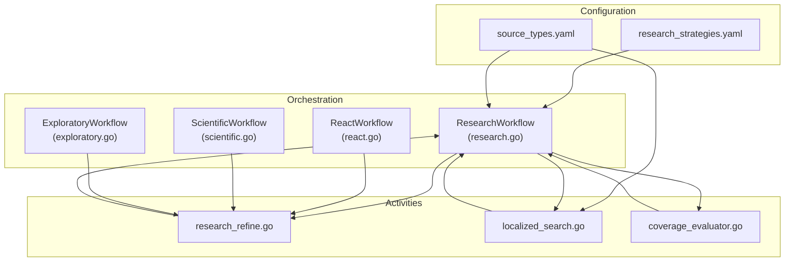
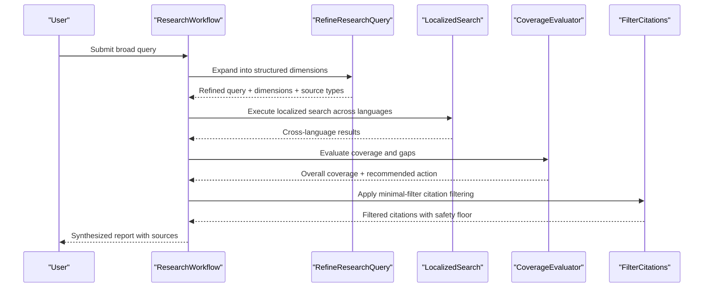
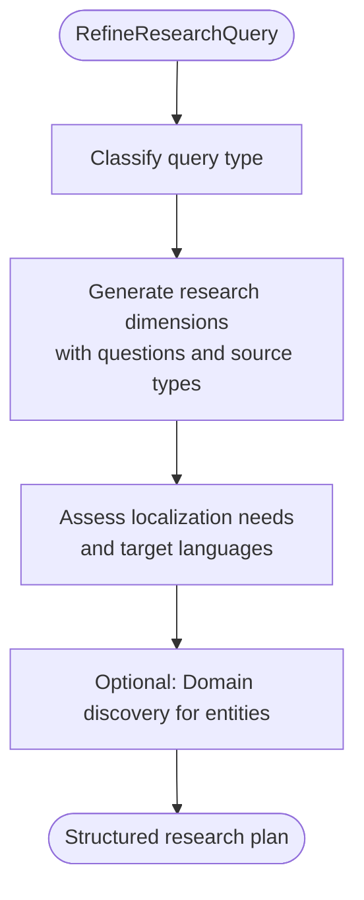
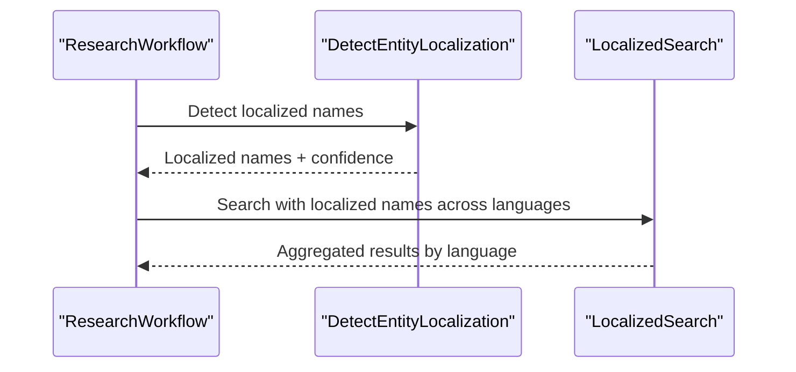
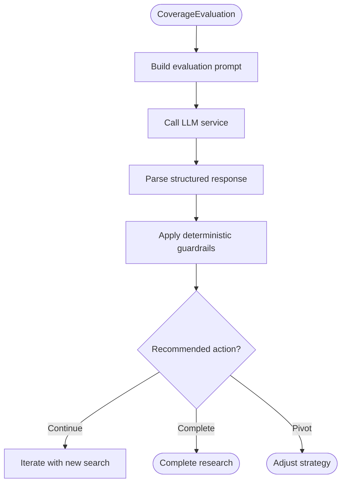
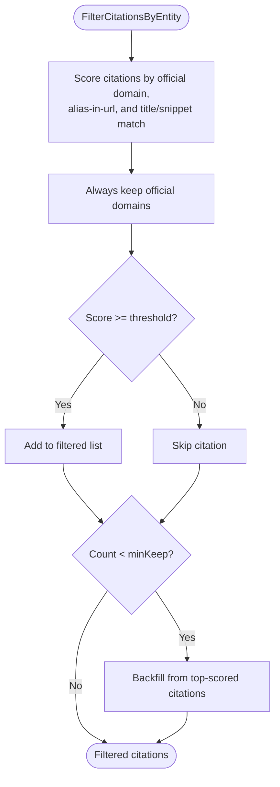
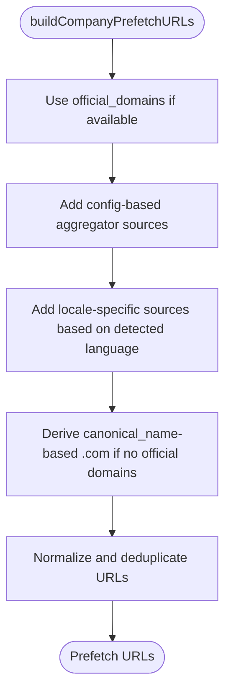
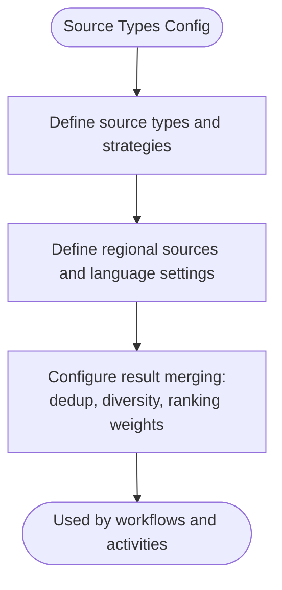
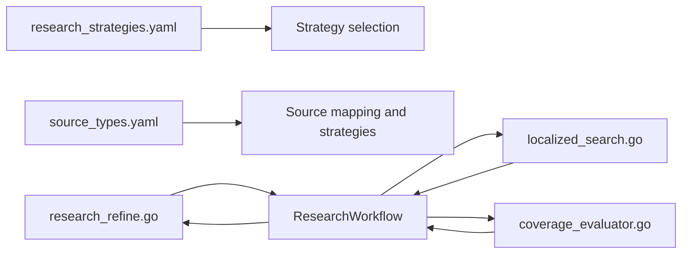

# Broad Research Strategy

<cite>
**Referenced Files in This Document**
- [research.go](file://go/orchestrator/internal/workflows/strategies/research.go)
- [research_refine.go](file://go/orchestrator/internal/activities/research_refine.go)
- [localized_search.go](file://go/orchestrator/internal/activities/localized_search.go)
- [coverage_evaluator.go](file://go/orchestrator/internal/activities/coverage_evaluator.go)
- [research_strategies.yaml](file://config/research_strategies.yaml)
- [source_types.yaml](file://config/source_types.yaml)
- [react.go](file://go/orchestrator/internal/workflows/strategies/react.go)
- [scientific.go](file://go/orchestrator/internal/workflows/strategies/scientific.go)
- [exploratory.go](file://go/orchestrator/internal/workflows/strategies/exploratory.go)
</cite>

## Table of Contents
1. [Introduction](#introduction)
2. [Project Structure](#project-structure)
3. [Core Components](#core-components)
4. [Architecture Overview](#architecture-overview)
5. [Detailed Component Analysis](#detailed-component-analysis)
6. [Dependency Analysis](#dependency-analysis)
7. [Performance Considerations](#performance-considerations)
8. [Troubleshooting Guide](#troubleshooting-guide)
9. [Conclusion](#conclusion)
10. [Appendices](#appendices)

## Introduction
This document explains the Broad Research Strategy implementation that maximizes coverage through wide-scope searches, minimal filtering, and rapid information gathering. It documents how the system minimizes citation filtering thresholds, prioritizes quantity over quality during initial discovery, and leverages multiple search sources simultaneously. It also details domain discovery algorithms, prefetch URL generation for company research, and locale-specific source targeting. Practical examples illustrate competitive analysis workflows, trend identification with broad coverage, and initial discovery phases for new topics. Provider selection for broad coverage, cost management via efficient search patterns, and integration with subsequent refinement strategies are covered.

## Project Structure
The Broad Research Strategy spans configuration, orchestration, and activities:
- Configuration defines source types, regional targeting, and result merging.
- Orchestration workflows coordinate discovery, synthesis, and refinement.
- Activities implement query refinement, localized search, coverage evaluation, and entity-based citation filtering.

**Diagram sources**
- [research.go](file://go/orchestrator/internal/workflows/strategies/research.go#L705-L800)
- [research_refine.go](file://go/orchestrator/internal/activities/research_refine.go#L66-L472)
- [localized_search.go](file://go/orchestrator/internal/activities/localized_search.go#L15-L313)
- [coverage_evaluator.go](file://go/orchestrator/internal/activities/coverage_evaluator.go#L53-L222)
- [research_strategies.yaml](file://config/research_strategies.yaml#L12-L53)
- [source_types.yaml](file://config/source_types.yaml#L5-L711)

**Section sources**
- [research.go](file://go/orchestrator/internal/workflows/strategies/research.go#L705-L800)
- [research_refine.go](file://go/orchestrator/internal/activities/research_refine.go#L66-L472)
- [localized_search.go](file://go/orchestrator/internal/activities/localized_search.go#L15-L313)
- [coverage_evaluator.go](file://go/orchestrator/internal/activities/coverage_evaluator.go#L53-L222)
- [research_strategies.yaml](file://config/research_strategies.yaml#L12-L53)
- [source_types.yaml](file://config/source_types.yaml#L5-L711)

## Core Components
- Query refinement and structured dimension planning: Converts vague queries into structured research plans with dimensions and source guidance.
- Localized search and entity localization: Detects localized entity names and executes cross-language searches.
- Coverage evaluation: Iteratively assesses coverage and recommends continuation or completion.
- Citation filtering with minimal thresholds: Applies entity-based filtering with a low threshold and safety floor to preserve breadth.
- Prefetch URL generation and domain discovery: Builds candidate URLs for company research and discovers relevant domains.
- Multi-source strategy configuration: Defines source categories, priorities, and regional targeting.

**Section sources**
- [research_refine.go](file://go/orchestrator/internal/activities/research_refine.go#L66-L472)
- [localized_search.go](file://go/orchestrator/internal/activities/localized_search.go#L69-L174)
- [coverage_evaluator.go](file://go/orchestrator/internal/activities/coverage_evaluator.go#L53-L222)
- [research.go](file://go/orchestrator/internal/workflows/strategies/research.go#L30-L302)
- [research.go](file://go/orchestrator/internal/workflows/strategies/research.go#L315-L703)
- [source_types.yaml](file://config/source_types.yaml#L5-L711)

## Architecture Overview
The Broad Research Strategy orchestrates discovery across multiple sources and languages, iteratively evaluating coverage and refining results.

**Diagram sources**
- [research.go](file://go/orchestrator/internal/workflows/strategies/research.go#L705-L800)
- [research_refine.go](file://go/orchestrator/internal/activities/research_refine.go#L66-L472)
- [localized_search.go](file://go/orchestrator/internal/activities/localized_search.go#L15-L313)
- [coverage_evaluator.go](file://go/orchestrator/internal/activities/coverage_evaluator.go#L53-L222)

## Detailed Component Analysis

### Query Refinement and Structured Dimensions
- Expands vague queries into structured research plans with dimensions and source guidance.
- Determines query type (company, industry, scientific, comparative, exploratory) and sets localization needs and target languages.
- Generates canonical names, exact queries, and official domains for focused discovery.

**Diagram sources**
- [research_refine.go](file://go/orchestrator/internal/activities/research_refine.go#L66-L472)

**Section sources**
- [research_refine.go](file://go/orchestrator/internal/activities/research_refine.go#L66-L472)

### Localized Search and Entity Localization
- Detects localized entity names and confidence levels for targeted searches.
- Executes localized searches across specified languages and aggregates results.

**Diagram sources**
- [localized_search.go](file://go/orchestrator/internal/activities/localized_search.go#L69-L174)
- [localized_search.go](file://go/orchestrator/internal/activities/localized_search.go#L15-L313)

**Section sources**
- [localized_search.go](file://go/orchestrator/internal/activities/localized_search.go#L69-L174)
- [localized_search.go](file://go/orchestrator/internal/activities/localized_search.go#L15-L313)

### Coverage Evaluation and Iterative Continuation
- Evaluates overall and per-dimension coverage, identifies critical and optional gaps, and decides whether to continue, complete, or pivot.
- Uses deterministic guardrails to ensure consistent behavior across iterations.

**Diagram sources**
- [coverage_evaluator.go](file://go/orchestrator/internal/activities/coverage_evaluator.go#L53-L222)

**Section sources**
- [coverage_evaluator.go](file://go/orchestrator/internal/activities/coverage_evaluator.go#L53-L222)

### Citation Filtering with Minimal Thresholds
- Applies entity-based filtering with a low threshold and a minimum retention safety floor.
- Preserves official domains and backfills to a minimum number of citations using a combined quality and entity relevance score.

**Diagram sources**
- [research.go](file://go/orchestrator/internal/workflows/strategies/research.go#L30-L302)

**Section sources**
- [research.go](file://go/orchestrator/internal/workflows/strategies/research.go#L30-L302)

### Prefetch URL Generation and Domain Discovery
- Builds a small set of candidate URLs for company research using official domains, configured aggregator sources, and locale-specific sources.
- Discovers relevant domains from web search tool executions and normalization rules.

**Diagram sources**
- [research.go](file://go/orchestrator/internal/workflows/strategies/research.go#L315-L703)

**Section sources**
- [research.go](file://go/orchestrator/internal/workflows/strategies/research.go#L315-L703)

### Multi-Source Strategy Configuration and Result Merging
- Defines source types (official, aggregator, news, academic, GitHub, financial, documentation, product review, social) with strategies, priorities, and result limits.
- Supports regional/locales with language-specific site lists and query templates.
- Provides result merging with deduplication, diversity controls, and weighted ranking.

**Diagram sources**
- [source_types.yaml](file://config/source_types.yaml#L5-L711)

**Section sources**
- [source_types.yaml](file://config/source_types.yaml#L5-L711)

### Provider Selection for Broad Coverage
- Uses model tier architecture to balance cost and capability: utility activities use small models; agent execution tiers vary by strategy; synthesis uses large models.
- Integrates with centralized pricing to estimate costs and align provider/model choices.

**Section sources**
- [research_strategies.yaml](file://config/research_strategies.yaml#L3-L10)
- [react.go](file://go/orchestrator/internal/workflows/strategies/react.go#L188-L208)
- [scientific.go](file://go/orchestrator/internal/workflows/strategies/scientific.go#L482-L512)

### Cost Management Through Efficient Search Patterns
- Minimizes cost by using small models for utility tasks and tiered model selection.
- Reduces iterations and tokens by focusing on breadth-first discovery, minimal filtering, and targeted prefetch URLs.

**Section sources**
- [research_strategies.yaml](file://config/research_strategies.yaml#L3-L10)
- [coverage_evaluator.go](file://go/orchestrator/internal/activities/coverage_evaluator.go#L53-L222)

### Integration with Subsequent Refinement Strategies
- Works with React, Scientific, and Exploratory workflows to refine and synthesize results.
- Emits structured metadata and integrates with session memory and context compression.

**Section sources**
- [react.go](file://go/orchestrator/internal/workflows/strategies/react.go#L85-L127)
- [scientific.go](file://go/orchestrator/internal/workflows/strategies/scientific.go#L105-L150)
- [exploratory.go](file://go/orchestrator/internal/workflows/strategies/exploratory.go#L90-L135)

## Dependency Analysis
The Broad Research Strategy depends on configuration files and coordinated activities/workflows.

**Diagram sources**
- [research_strategies.yaml](file://config/research_strategies.yaml#L12-L53)
- [source_types.yaml](file://config/source_types.yaml#L5-L711)
- [research_refine.go](file://go/orchestrator/internal/activities/research_refine.go#L66-L472)
- [localized_search.go](file://go/orchestrator/internal/activities/localized_search.go#L15-L313)
- [coverage_evaluator.go](file://go/orchestrator/internal/activities/coverage_evaluator.go#L53-L222)
- [research.go](file://go/orchestrator/internal/workflows/strategies/research.go#L705-L800)

**Section sources**
- [research_strategies.yaml](file://config/research_strategies.yaml#L12-L53)
- [source_types.yaml](file://config/source_types.yaml#L5-L711)
- [research_refine.go](file://go/orchestrator/internal/activities/research_refine.go#L66-L472)
- [localized_search.go](file://go/orchestrator/internal/activities/localized_search.go#L15-L313)
- [coverage_evaluator.go](file://go/orchestrator/internal/activities/coverage_evaluator.go#L53-L222)
- [research.go](file://go/orchestrator/internal/workflows/strategies/research.go#L705-L800)

## Performance Considerations
- Minimizing filtering thresholds and preserving official domains ensures broad coverage while preventing over-filtering.
- Using small model tiers for utility tasks and controlled iteration limits reduces token usage.
- Prefetch URLs and domain discovery reduce redundant searches and accelerate initial coverage.
- Deterministic guardrails in coverage evaluation prevent unnecessary retries and stabilize runtime.

[No sources needed since this section provides general guidance]

## Troubleshooting Guide
- If coverage evaluation fails to parse structured output, the system falls back to conservative decisions and continues iterating.
- Citation filtering applies a safety floor and backfills to maintain minimum coverage when retention is low.
- Language detection confidence warnings help diagnose localization issues; adjust target languages accordingly.

**Section sources**
- [coverage_evaluator.go](file://go/orchestrator/internal/activities/coverage_evaluator.go#L139-L151)
- [research.go](file://go/orchestrator/internal/workflows/strategies/research.go#L269-L302)
- [research_refine.go](file://go/orchestrator/internal/activities/research_refine.go#L571-L667)

## Conclusion
The Broad Research Strategy achieves broad coverage by widening search scope, minimizing filtering thresholds, and leveraging multiple sources and languages. It integrates structured refinement, localized search, and iterative coverage evaluation to balance speed and depth. Cost is managed through tiered model selection and efficient search patterns, while subsequent refinement strategies ensure high-quality synthesis.

[No sources needed since this section summarizes without analyzing specific files]

## Appendices

### Practical Examples

- Competitive analysis workflow
  - Refine query into dimensions (profiles, comparison criteria, strengths/weaknesses).
  - Execute localized searches across languages and gather results.
  - Evaluate coverage and iterate until sufficient breadth is achieved.
  - Apply minimal filtering to retain diverse sources and official domains.
  - Synthesize findings with citations and sources.

- Trend identification with broad coverage
  - Use “industry” or “scientific” query types to generate relevant dimensions.
  - Focus on news, academic, and documentation sources for current state and emerging trends.
  - Apply coverage evaluation to ensure adequate breadth before synthesis.

- Initial discovery for new topics
  - Use exploratory workflows to generate hypotheses and perspectives.
  - Employ minimal filtering to preserve variety and official sources.
  - Integrate with scientific workflows for hypothesis testing and debate.

[No sources needed since this section provides general guidance]