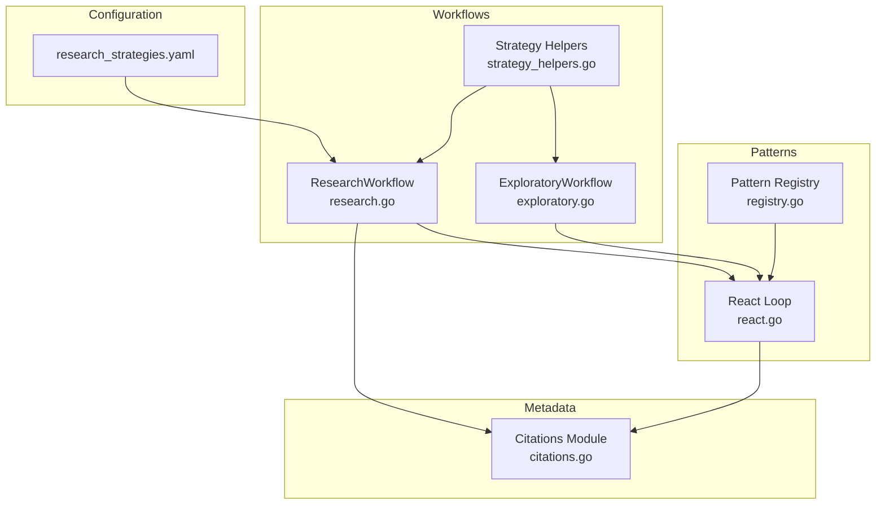
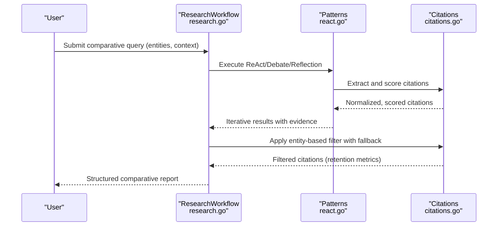
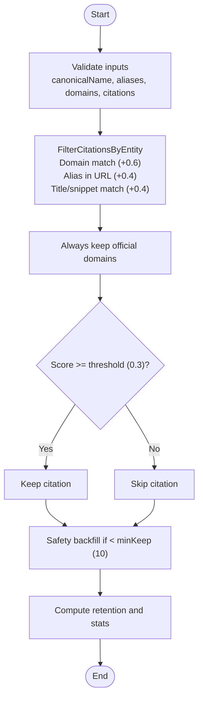
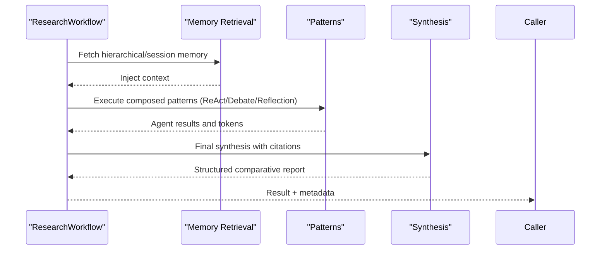
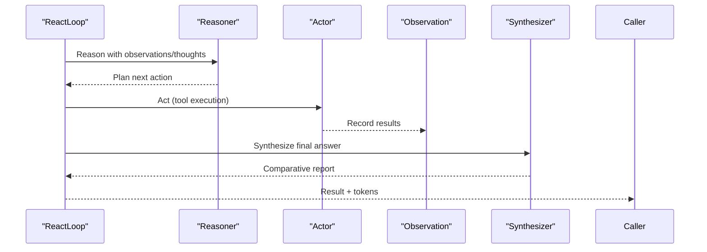
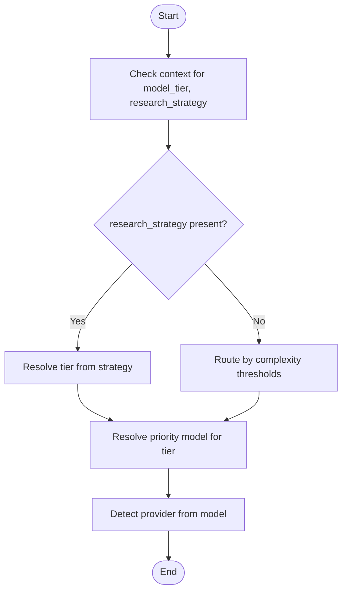
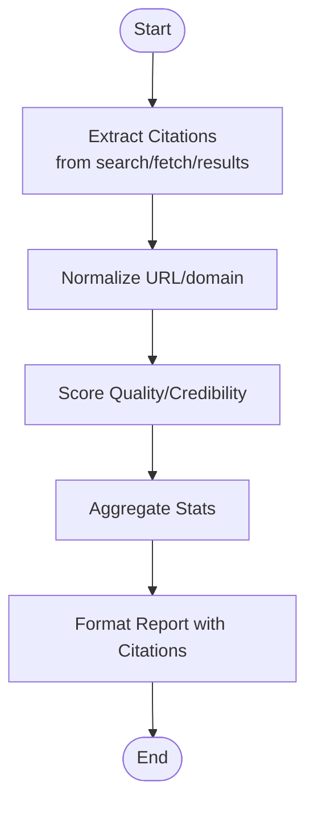
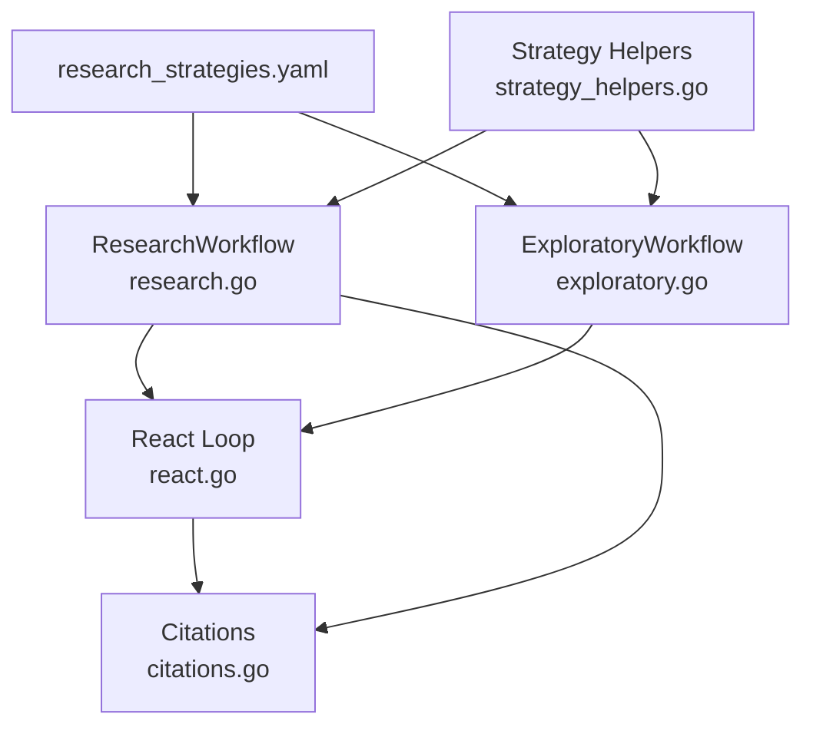

# Comparative Research Strategy

<cite>
**Referenced Files in This Document**
- [research_strategies.yaml](file://config/research_strategies.yaml)
- [research.go](file://go/orchestrator/internal/workflows/strategies/research.go)
- [types.go](file://go/orchestrator/internal/workflows/strategies/types.go)
- [citations.go](file://go/orchestrator/internal/metadata/citations.go)
- [exploratory.go](file://go/orchestrator/internal/workflows/strategies/exploratory.go)
- [strategy_helpers.go](file://go/orchestrator/internal/workflows/strategies/strategy_helpers.go)
- [react.go](file://go/orchestrator/internal/workflows/patterns/react.go)
- [registry.go](file://go/orchestrator/internal/workflows/patterns/registry.go)
- [provider_override_test.go](file://go/orchestrator/internal/workflows/strategies/provider_override_test.go)
</cite>

## Table of Contents
1. [Introduction](#introduction)
2. [Project Structure](#project-structure)
3. [Core Components](#core-components)
4. [Architecture Overview](#architecture-overview)
5. [Detailed Component Analysis](#detailed-component-analysis)
6. [Dependency Analysis](#dependency-analysis)
7. [Performance Considerations](#performance-considerations)
8. [Troubleshooting Guide](#troubleshooting-guide)
9. [Conclusion](#conclusion)
10. [Appendices](#appendices)

## Introduction
This document explains the Comparative Research Strategy implementation that enables side-by-side analysis through systematic comparison frameworks, entity pair analysis, and structured evaluation methods. It covers how comparative research scenarios are set up, how multiple entities are managed simultaneously, and how analytical consistency is maintained. It also documents comparative citation analysis, entity relationship mapping, cross-reference validation, and integration with synthesis patterns for structured reporting. Practical examples illustrate competitive benchmarking workflows, product comparison research, and multi-entity analysis for investigative reporting. Provider selection is addressed for balanced coverage, and cost optimization via comparative efficiency is explained alongside synthesis patterns.

## Project Structure
The Comparative Research Strategy spans configuration, workflow orchestration, pattern execution, and metadata handling:
- Configuration defines research strategies and model tiering for cost optimization.
- Workflow strategies implement comparative research, citation filtering, and entity mapping.
- Patterns encapsulate multi-agent approaches (ReAct, debate, reflection) used in comparative analysis.
- Metadata utilities provide citation extraction, normalization, scoring, and aggregation.

**Diagram sources**
- [research_strategies.yaml](file://config/research_strategies.yaml#L1-L53)
- [research.go](file://go/orchestrator/internal/workflows/strategies/research.go#L707-L800)
- [exploratory.go](file://go/orchestrator/internal/workflows/strategies/exploratory.go#L19-L425)
- [strategy_helpers.go](file://go/orchestrator/internal/workflows/strategies/strategy_helpers.go#L23-L84)
- [react.go](file://go/orchestrator/internal/workflows/patterns/react.go#L49-L702)
- [registry.go](file://go/orchestrator/internal/workflows/patterns/registry.go#L71-L190)
- [citations.go](file://go/orchestrator/internal/metadata/citations.go#L25-L53)

**Section sources**
- [research_strategies.yaml](file://config/research_strategies.yaml#L1-L53)
- [research.go](file://go/orchestrator/internal/workflows/strategies/research.go#L707-L800)
- [exploratory.go](file://go/orchestrator/internal/workflows/strategies/exploratory.go#L19-L425)
- [strategy_helpers.go](file://go/orchestrator/internal/workflows/strategies/strategy_helpers.go#L23-L84)
- [react.go](file://go/orchestrator/internal/workflows/patterns/react.go#L49-L702)
- [registry.go](file://go/orchestrator/internal/workflows/patterns/registry.go#L71-L190)
- [citations.go](file://go/orchestrator/internal/metadata/citations.go#L25-L53)

## Core Components
- Research strategies configuration: Defines model tier architecture and strategy parameters for cost optimization and quality balance.
- Comparative citation analysis: Entity-based filtering, normalization, quality/credibility scoring, and backfill logic.
- Multi-entity comparative workflows: ResearchWorkflow and ExploratoryWorkflow orchestrate comparative analysis with patterns.
- Pattern execution: React loop, debate, and reflection enable iterative, multi-perspective comparative evaluation.
- Provider/model selection: Deterministic tier-to-model resolution and provider override precedence.

**Section sources**
- [research_strategies.yaml](file://config/research_strategies.yaml#L12-L53)
- [research.go](file://go/orchestrator/internal/workflows/strategies/research.go#L30-L302)
- [citations.go](file://go/orchestrator/internal/metadata/citations.go#L25-L53)
- [exploratory.go](file://go/orchestrator/internal/workflows/strategies/exploratory.go#L19-L425)
- [react.go](file://go/orchestrator/internal/workflows/patterns/react.go#L49-L702)
- [strategy_helpers.go](file://go/orchestrator/internal/workflows/strategies/strategy_helpers.go#L23-L84)

## Architecture Overview
The Comparative Research Strategy integrates configuration-driven model tiering, entity-aware citation filtering, and multi-agent patterns to deliver structured comparative insights.

**Diagram sources**
- [research.go](file://go/orchestrator/internal/workflows/strategies/research.go#L707-L800)
- [react.go](file://go/orchestrator/internal/workflows/patterns/react.go#L49-L702)
- [citations.go](file://go/orchestrator/internal/metadata/citations.go#L367-L500)

## Detailed Component Analysis

### Comparative Citation Analysis and Entity Filtering
Entity-based filtering ensures comparative focus by retaining official domains and relevant aliases while backfilling quality citations when coverage is insufficient. Quality and credibility scoring supports structured evaluation.

**Diagram sources**
- [research.go](file://go/orchestrator/internal/workflows/strategies/research.go#L90-L252)
- [research.go](file://go/orchestrator/internal/workflows/strategies/research.go#L269-L302)

Implementation highlights:
- Scoring system and thresholds for entity relevance.
- Official domain preservation and safety floor backfill.
- Retention-based fallback logic to preserve comparability.

**Section sources**
- [research.go](file://go/orchestrator/internal/workflows/strategies/research.go#L30-L56)
- [research.go](file://go/orchestrator/internal/workflows/strategies/research.go#L90-L252)
- [research.go](file://go/orchestrator/internal/workflows/strategies/research.go#L269-L302)

### Comparative Research Workflows
ResearchWorkflow composes patterns for complex comparative tasks, integrating memory retrieval, control signals, and structured synthesis. ExploratoryWorkflow applies Tree-of-Thoughts, optional Debate, and Reflection for iterative improvement.

**Diagram sources**
- [research.go](file://go/orchestrator/internal/workflows/strategies/research.go#L707-L800)
- [exploratory.go](file://go/orchestrator/internal/workflows/strategies/exploratory.go#L19-L425)

**Section sources**
- [research.go](file://go/orchestrator/internal/workflows/strategies/research.go#L707-L800)
- [exploratory.go](file://go/orchestrator/internal/workflows/strategies/exploratory.go#L19-L425)

### Pattern Execution for Comparative Evaluation
The ReAct loop alternates reasoning, action, and observation, biasing tool usage toward comparative evidence collection (web_search/web_fetch) and synthesizing final answers with citations.

**Diagram sources**
- [react.go](file://go/orchestrator/internal/workflows/patterns/react.go#L49-L702)

**Section sources**
- [react.go](file://go/orchestrator/internal/workflows/patterns/react.go#L49-L702)

### Provider Selection and Model Tiering
Model tier selection prioritizes research strategies over complexity heuristics, ensuring cost optimization while maintaining quality. Provider override precedence is enforced for balanced coverage.

**Diagram sources**
- [strategy_helpers.go](file://go/orchestrator/internal/workflows/strategies/strategy_helpers.go#L23-L84)
- [provider_override_test.go](file://go/orchestrator/internal/workflows/strategies/provider_override_test.go#L9-L64)

**Section sources**
- [strategy_helpers.go](file://go/orchestrator/internal/workflows/strategies/strategy_helpers.go#L23-L84)
- [provider_override_test.go](file://go/orchestrator/internal/workflows/strategies/provider_override_test.go#L9-L64)

### Cross-Reference Validation and Structured Reporting
Cross-reference validation relies on normalized URLs, domain extraction, and citation scoring. Structured reporting integrates synthesis with citations and metadata.

**Diagram sources**
- [citations.go](file://go/orchestrator/internal/metadata/citations.go#L367-L500)
- [citations.go](file://go/orchestrator/internal/metadata/citations.go#L184-L229)
- [citations.go](file://go/orchestrator/internal/metadata/citations.go#L255-L305)

**Section sources**
- [citations.go](file://go/orchestrator/internal/metadata/citations.go#L184-L229)
- [citations.go](file://go/orchestrator/internal/metadata/citations.go#L255-L305)
- [citations.go](file://go/orchestrator/internal/metadata/citations.go#L367-L500)

## Dependency Analysis
Comparative research depends on:
- Configuration-driven model tiering and strategy parameters.
- Citation extraction, normalization, and scoring utilities.
- Pattern execution for iterative comparative evaluation.
- Provider/model resolution and override precedence.

**Diagram sources**
- [research_strategies.yaml](file://config/research_strategies.yaml#L12-L53)
- [research.go](file://go/orchestrator/internal/workflows/strategies/research.go#L707-L800)
- [exploratory.go](file://go/orchestrator/internal/workflows/strategies/exploratory.go#L19-L425)
- [strategy_helpers.go](file://go/orchestrator/internal/workflows/strategies/strategy_helpers.go#L23-L84)
- [react.go](file://go/orchestrator/internal/workflows/patterns/react.go#L49-L702)
- [citations.go](file://go/orchestrator/internal/metadata/citations.go#L25-L53)

**Section sources**
- [research_strategies.yaml](file://config/research_strategies.yaml#L12-L53)
- [research.go](file://go/orchestrator/internal/workflows/strategies/research.go#L707-L800)
- [exploratory.go](file://go/orchestrator/internal/workflows/strategies/exploratory.go#L19-L425)
- [strategy_helpers.go](file://go/orchestrator/internal/workflows/strategies/strategy_helpers.go#L23-L84)
- [react.go](file://go/orchestrator/internal/workflows/patterns/react.go#L49-L702)
- [citations.go](file://go/orchestrator/internal/metadata/citations.go#L25-L53)

## Performance Considerations
- Model tier architecture reduces costs by up to 50–70% while maintaining quality, using small tiers for utility activities and medium tiers for agent execution, with large tiers reserved for final synthesis.
- Citation filtering and backfill preserve comparability while minimizing redundant processing.
- Early termination heuristics in ReAct loops converge faster when solutions stabilize or citations plateau.
- Provider override precedence ensures optimal provider/model selection for balanced coverage and cost efficiency.

[No sources needed since this section provides general guidance]

## Troubleshooting Guide
Common issues and resolutions:
- Low citation retention after filtering: Verify entity canonical names, aliases, and official domains; ensure sufficient minKeep and quality×credibility backfill conditions are met.
- Excessive tool execution without new evidence: Monitor citation counts and observation similarity; adjust strategy parameters or increase entity coverage.
- Provider/model mismatch: Confirm provider override precedence and tier-to-model resolution; validate provider detection from model names.

**Section sources**
- [research.go](file://go/orchestrator/internal/workflows/strategies/research.go#L269-L302)
- [react.go](file://go/orchestrator/internal/workflows/patterns/react.go#L747-L787)
- [strategy_helpers.go](file://go/orchestrator/internal/workflows/strategies/strategy_helpers.go#L23-L84)
- [provider_override_test.go](file://go/orchestrator/internal/workflows/strategies/provider_override_test.go#L9-L64)

## Conclusion
The Comparative Research Strategy leverages configuration-driven model tiering, entity-aware citation filtering, and multi-agent patterns to enable robust side-by-side analysis. By structuring comparative workflows, validating cross-references, and optimizing provider/model selection, it delivers consistent, cost-efficient, and high-quality comparative insights suitable for competitive benchmarking, product comparisons, and investigative reporting.

[No sources needed since this section summarizes without analyzing specific files]

## Appendices

### Practical Examples
- Competitive Benchmarking: Use ResearchWorkflow with entity pairs and official domains to compare offerings systematically. Apply debate pattern to reconcile differing perspectives and reflection to refine conclusions.
- Product Comparison Research: Employ ReAct loops biased toward web_search/web_fetch to gather authoritative evidence, then synthesize comparative summaries with citations.
- Multi-Entity Analysis: Configure multiple entities with aliases and domains; apply entity-based filtering to ensure balanced coverage and consistent evaluation across entities.

[No sources needed since this section provides general guidance]