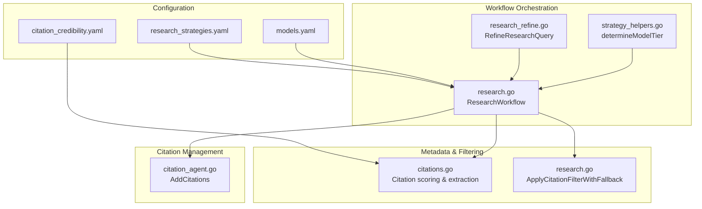
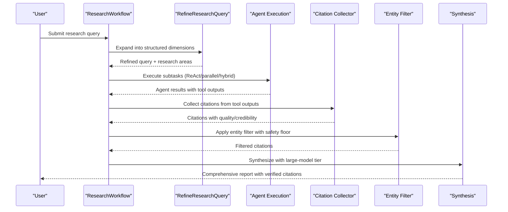
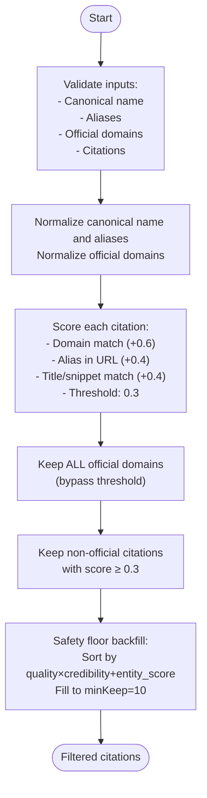
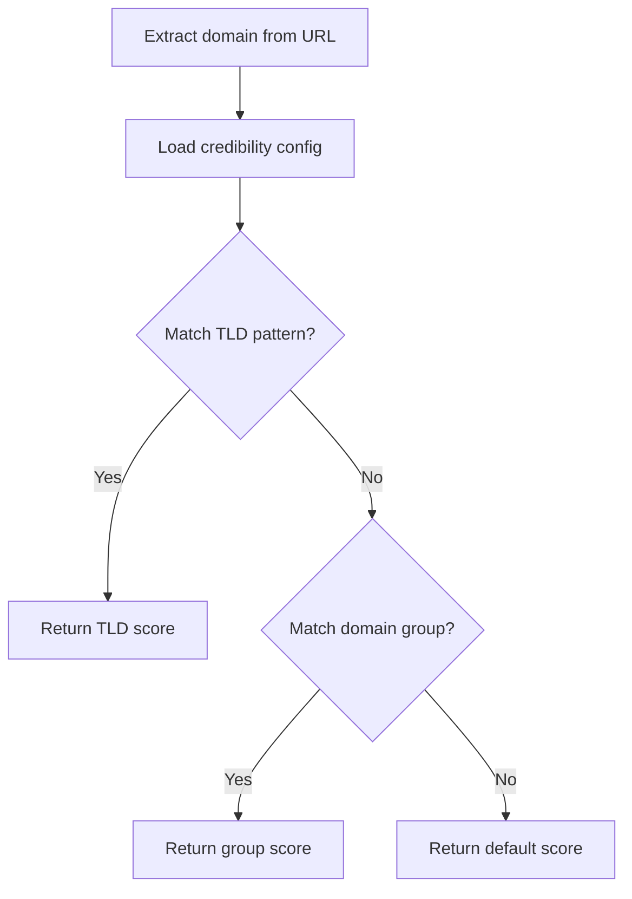
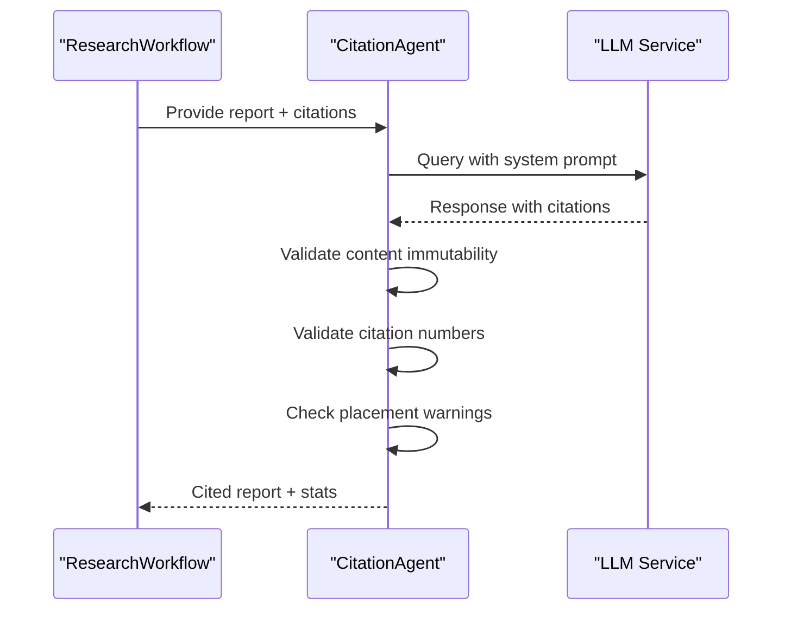
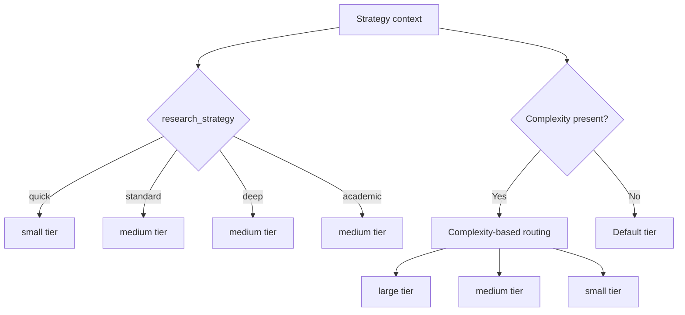
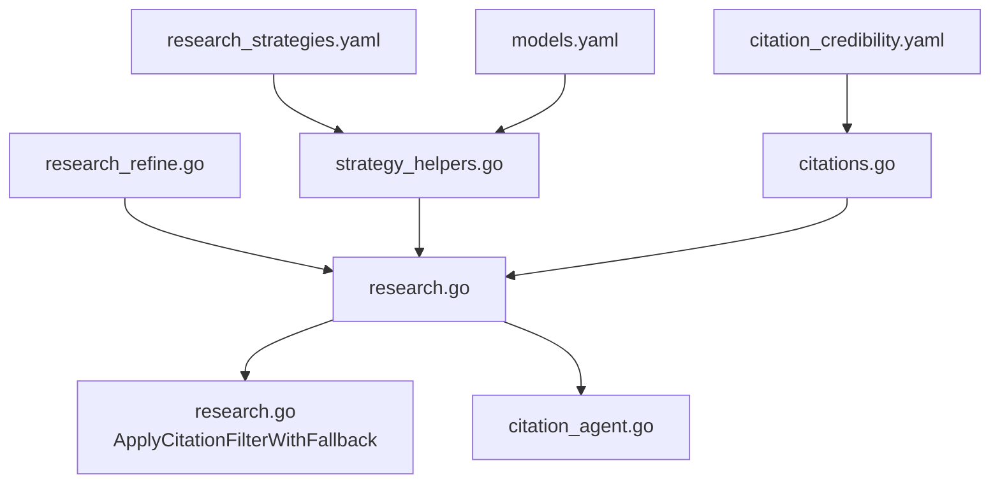

# Deep Research Strategy

<cite>
**Referenced Files in This Document**
- [research_strategies.yaml](file://config/research_strategies.yaml)
- [citation_credibility.yaml](file://config/citation_credibility.yaml)
- [research.go](file://go/orchestrator/internal/workflows/strategies/research.go)
- [citations.go](file://go/orchestrator/internal/metadata/citations.go)
- [citation_agent.go](file://go/orchestrator/internal/activities/citation_agent.go)
- [research_refine.go](file://go/orchestrator/internal/activities/research_refine.go)
- [models.yaml](file://config/models.yaml)
- [strategy_helpers.go](file://go/orchestrator/internal/workflows/strategies/strategy_helpers.go)
</cite>

## Table of Contents
1. [Introduction](#introduction)
2. [Project Structure](#project-structure)
3. [Core Components](#core-components)
4. [Architecture Overview](#architecture-overview)
5. [Detailed Component Analysis](#detailed-component-analysis)
6. [Dependency Analysis](#dependency-analysis)
7. [Performance Considerations](#performance-considerations)
8. [Troubleshooting Guide](#troubleshooting-guide)
9. [Conclusion](#conclusion)

## Introduction
The Deep Research Strategy is a comprehensive research orchestration system designed to deliver authoritative, well-sourced insights with rigorous citation filtering, entity-based relevance scoring, and safety floor mechanisms. It balances depth and breadth across academic, market, and investigative use cases while optimizing cost through intelligent model tier selection and budget allocation.

Key capabilities:
- Entity-centric research with canonical name and alias handling
- Multi-stage citation filtering with official domain preservation and quality backfill
- Tiered model selection for cost-efficient agent execution with large-model synthesis
- Intelligent budget controls and provider override mechanisms
- Practical workflows for academic research, market analysis, and investigative reporting

## Project Structure
The Deep Research Strategy spans configuration, metadata scoring, workflow orchestration, and synthesis components:

**Diagram sources**
- [research_strategies.yaml](file://config/research_strategies.yaml#L12-L53)
- [models.yaml](file://config/models.yaml#L16-L115)
- [citation_credibility.yaml](file://config/citation_credibility.yaml#L11-L171)
- [research.go](file://go/orchestrator/internal/workflows/strategies/research.go#L1-L120)
- [research_refine.go](file://go/orchestrator/internal/activities/research_refine.go#L66-L472)
- [strategy_helpers.go](file://go/orchestrator/internal/workflows/strategies/strategy_helpers.go#L23-L84)
- [citations.go](file://go/orchestrator/internal/metadata/citations.go#L25-L91)
- [citation_agent.go](file://go/orchestrator/internal/activities/citation_agent.go#L96-L154)

**Section sources**
- [research_strategies.yaml](file://config/research_strategies.yaml#L1-L53)
- [models.yaml](file://config/models.yaml#L1-L120)
- [citation_credibility.yaml](file://config/citation_credibility.yaml#L1-L171)
- [research.go](file://go/orchestrator/internal/workflows/strategies/research.go#L1-L120)
- [research_refine.go](file://go/orchestrator/internal/activities/research_refine.go#L66-L120)
- [strategy_helpers.go](file://go/orchestrator/internal/workflows/strategies/strategy_helpers.go#L23-L84)
- [citations.go](file://go/orchestrator/internal/metadata/citations.go#L25-L91)
- [citation_agent.go](file://go/orchestrator/internal/activities/citation_agent.go#L96-L154)

## Core Components
- Research Strategies Configuration: Defines strategy profiles (quick, standard, deep, academic) with model tier assignments, concurrency, and iteration parameters.
- Citation Credibility Scoring: Domain reputation rules and quality gates for automatic scoring and filtering.
- Research Workflow: Orchestrates query refinement, decomposition, agent execution, localized search, entity filtering, citation extraction, and synthesis.
- Citation Agent: Adds verified citations to reports with validation and placement statistics.
- Model Tier Selection: Determines appropriate model tier based on strategy, complexity, and budget constraints.

**Section sources**
- [research_strategies.yaml](file://config/research_strategies.yaml#L12-L53)
- [citation_credibility.yaml](file://config/citation_credibility.yaml#L11-L171)
- [research.go](file://go/orchestrator/internal/workflows/strategies/research.go#L852-L2399)
- [citation_agent.go](file://go/orchestrator/internal/activities/citation_agent.go#L96-L154)
- [strategy_helpers.go](file://go/orchestrator/internal/workflows/strategies/strategy_helpers.go#L23-L84)

## Architecture Overview
The Deep Research Strategy follows a staged pipeline:
1. Query refinement and research dimension planning
2. Decomposition into subtasks with execution patterns (ReAct, parallel, hybrid)
3. Localized search for multi-language coverage
4. Citation collection and entity-based filtering with safety floor
5. Synthesis with large-model tier for comprehensive output

**Diagram sources**
- [research.go](file://go/orchestrator/internal/workflows/strategies/research.go#L852-L2399)
- [research_refine.go](file://go/orchestrator/internal/activities/research_refine.go#L66-L472)
- [citations.go](file://go/orchestrator/internal/metadata/citations.go#L402-L522)
- [research.go](file://go/orchestrator/internal/workflows/strategies/research.go#L2315-L2382)

## Detailed Component Analysis

### Citation Filtering Algorithm
The system implements a robust entity-based filtering mechanism that preserves official domains, applies threshold-based filtering, and backfills to a safety floor for deep coverage.

Key features:
- Official domain preservation: All official-domain citations are kept regardless of score
- Threshold-based filtering: Non-official citations pass if any single relevance component meets the 0.3 threshold
- Safety floor backfill: Ensures minimum coverage (10 citations) by quality×credibility+entity_score ranking
- Automatic fallback: If filter would remove too many citations, original set is retained

**Diagram sources**
- [research.go](file://go/orchestrator/internal/workflows/strategies/research.go#L30-L252)

**Section sources**
- [research.go](file://go/orchestrator/internal/workflows/strategies/research.go#L30-L252)

### Entity Matching System
The entity matching system handles canonical names, aliases, and official domains with weighted scoring:

Scoring weights:
- Official domain match: +0.6
- Alias in URL: +0.4
- Title/snippet/source contains alias: +0.4
- Threshold: 0.3 (allows title/snippet matches to pass)

Matching logic:
- Domain normalization removes protocol, www, and standardizes suffixes
- URL-level alias matching requires minimum 5 characters to avoid false positives
- Title/snippet matching uses word-boundary detection for short aliases (<5 chars) and substring matching for longer aliases
- Official sites are tracked separately for backfill prioritization

**Section sources**
- [research.go](file://go/orchestrator/internal/workflows/strategies/research.go#L90-L252)

### Citation Credibility Scoring
Credibility scoring is derived from domain reputation rules loaded from configuration:

Quality scoring factors:
- Relevance (70% weight)
- Recency (30% weight, 30-day decay)
- Completeness bonus (+0.1 for presence of date/title/snippet)

**Diagram sources**
- [citations.go](file://go/orchestrator/internal/metadata/citations.go#L307-L349)
- [citations.go](file://go/orchestrator/internal/metadata/citations.go#L255-L305)
- [citation_credibility.yaml](file://config/citation_credibility.yaml#L11-L171)

**Section sources**
- [citations.go](file://go/orchestrator/internal/metadata/citations.go#L307-L349)
- [citations.go](file://go/orchestrator/internal/metadata/citations.go#L255-L305)
- [citation_credibility.yaml](file://config/citation_credibility.yaml#L11-L171)

### Citation Agent and Report Enhancement
The Citation Agent adds verified citations to reports with validation and placement statistics:

Validation stages:
- Content immutability: Ensures only citation markers were added (tolerates up to 5% differences)
- Citation number validity: Removes invalid citations and cleans output
- Placement warnings: Identifies improper citation placement
- Redundancy detection: Flags repeated citations

**Diagram sources**
- [citation_agent.go](file://go/orchestrator/internal/activities/citation_agent.go#L96-L154)
- [citation_agent.go](file://go/orchestrator/internal/activities/citation_agent.go#L156-L350)

**Section sources**
- [citation_agent.go](file://go/orchestrator/internal/activities/citation_agent.go#L96-L154)
- [citation_agent.go](file://go/orchestrator/internal/activities/citation_agent.go#L156-L350)

### Model Tier Selection and Cost Optimization
Model tier selection is strategy-aware and budget-conscious:

Tier allocations:
- Small: 50% (fast, cost-optimized)
- Medium: 40% (balanced capability)
- Large: 10% (heavy reasoning)

Final synthesis always uses large tier; agent execution tiers vary by strategy.

**Diagram sources**
- [strategy_helpers.go](file://go/orchestrator/internal/workflows/strategies/strategy_helpers.go#L23-L84)
- [models.yaml](file://config/models.yaml#L16-L115)
- [research_strategies.yaml](file://config/research_strategies.yaml#L12-L53)

**Section sources**
- [strategy_helpers.go](file://go/orchestrator/internal/workflows/strategies/strategy_helpers.go#L23-L84)
- [models.yaml](file://config/models.yaml#L16-L115)
- [research_strategies.yaml](file://config/research_strategies.yaml#L12-L53)

### Practical Workflows

#### Academic Research Workflow
- Strategy: academic (medium agent tier, large synthesis)
- Features: extended gap filling, iterative refinement, comprehensive synthesis
- Use case: literature review, thesis support, research synthesis with rigorous sourcing

#### Market Analysis Workflow
- Strategy: deep (medium agent tier, large synthesis)
- Features: multi-language localized search, entity filtering, official domain emphasis
- Use case: competitive intelligence, market sizing, investment research

#### Investigative Reporting Workflow
- Strategy: deep (medium agent tier, large synthesis)
- Features: entity filtering, safety floor backfill, quality×credibility backfill
- Use case: fact-checking, source verification, cross-referencing investigations

**Section sources**
- [research_strategies.yaml](file://config/research_strategies.yaml#L40-L53)
- [research.go](file://go/orchestrator/internal/workflows/strategies/research.go#L1969-L2143)

## Dependency Analysis
The Deep Research Strategy integrates several subsystems with clear dependencies:

**Diagram sources**
- [research_strategies.yaml](file://config/research_strategies.yaml#L12-L53)
- [models.yaml](file://config/models.yaml#L16-L115)
- [citation_credibility.yaml](file://config/citation_credibility.yaml#L11-L171)
- [strategy_helpers.go](file://go/orchestrator/internal/workflows/strategies/strategy_helpers.go#L23-L84)
- [research_refine.go](file://go/orchestrator/internal/activities/research_refine.go#L66-L472)
- [research.go](file://go/orchestrator/internal/workflows/strategies/research.go#L852-L2399)
- [citations.go](file://go/orchestrator/internal/metadata/citations.go#L25-L91)
- [citation_agent.go](file://go/orchestrator/internal/activities/citation_agent.go#L96-L154)

**Section sources**
- [research_strategies.yaml](file://config/research_strategies.yaml#L12-L53)
- [models.yaml](file://config/models.yaml#L16-L115)
- [citation_credibility.yaml](file://config/citation_credibility.yaml#L11-L171)
- [strategy_helpers.go](file://go/orchestrator/internal/workflows/strategies/strategy_helpers.go#L23-L84)
- [research_refine.go](file://go/orchestrator/internal/activities/research_refine.go#L66-L472)
- [research.go](file://go/orchestrator/internal/workflows/strategies/research.go#L852-L2399)
- [citations.go](file://go/orchestrator/internal/metadata/citations.go#L25-L91)
- [citation_agent.go](file://go/orchestrator/internal/activities/citation_agent.go#L96-L154)

## Performance Considerations
- Model tier allocation reduces costs by 50-70% while maintaining quality
- Complexity-based routing minimizes unnecessary large-model usage
- Parallel execution patterns scale with available concurrency
- Safety floor backfill ensures minimum coverage without manual intervention
- Token usage recording prevents double-counting and enables accurate budget tracking

## Troubleshooting Guide
Common issues and resolutions:
- Too few citations after filtering: Verify canonical name, aliases, and official domains are properly set; check quality gates and diversity rules
- Aggressive filtering removing relevant sources: Review threshold settings and safety floor parameters
- High costs despite tier selection: Monitor model tier usage and adjust strategy parameters
- Citation placement validation failures: Review Citation Agent prompts and validation thresholds

**Section sources**
- [research.go](file://go/orchestrator/internal/workflows/strategies/research.go#L269-L302)
- [citation_agent.go](file://go/orchestrator/internal/activities/citation_agent.go#L300-L350)
- [strategy_helpers.go](file://go/orchestrator/internal/workflows/strategies/strategy_helpers.go#L23-L84)

## Conclusion
The Deep Research Strategy provides a robust framework for comprehensive research with rigorous source verification, entity-aware filtering, and intelligent cost optimization. Its modular design supports diverse use cases while maintaining high standards for accuracy, coverage, and efficiency.