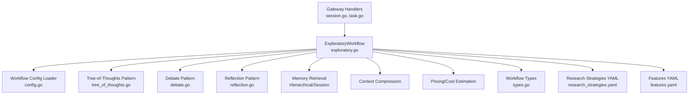
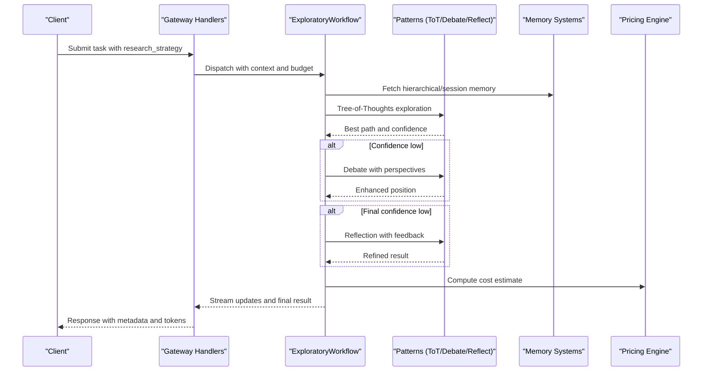
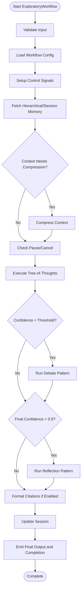
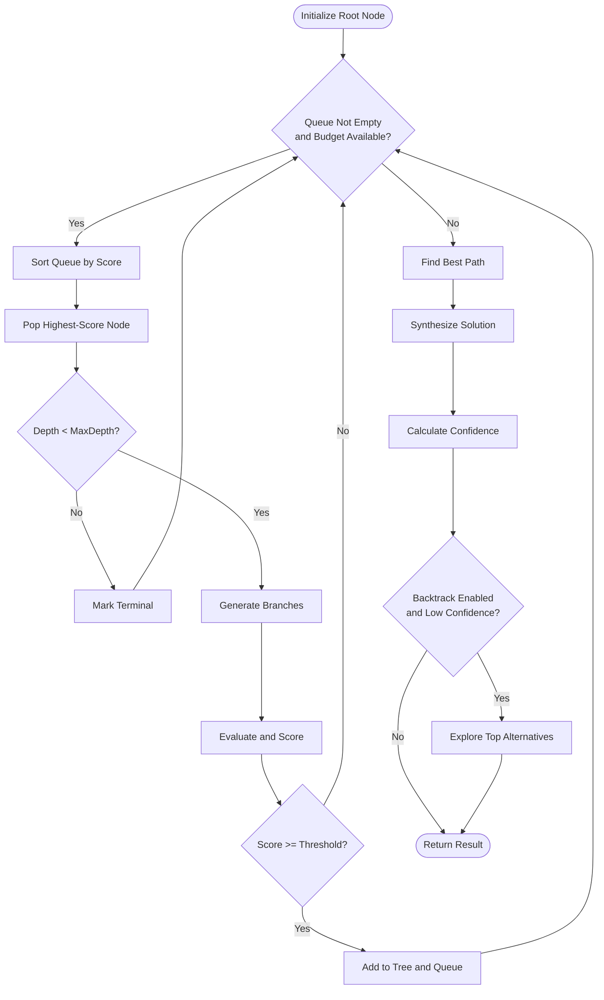
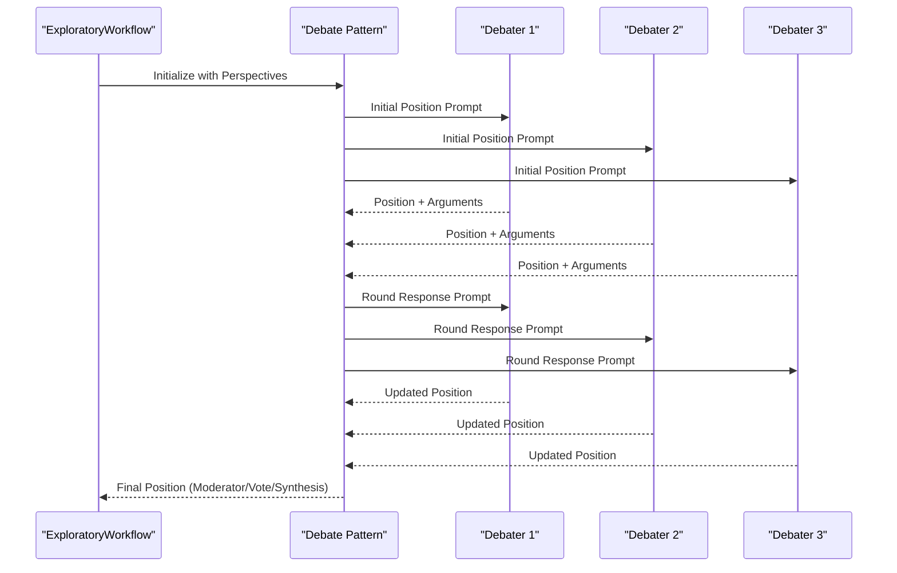
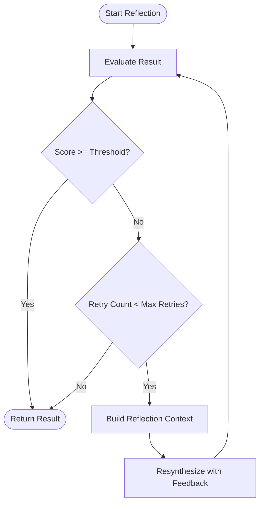
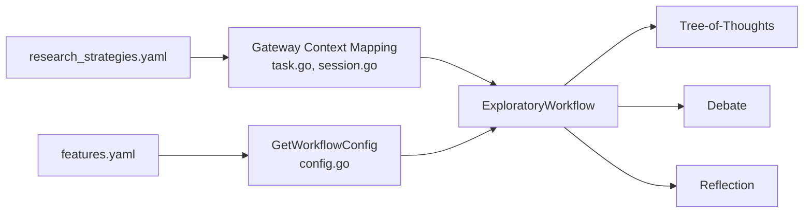
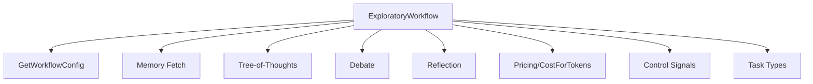

# Exploratory Research Strategy

<cite>
**Referenced Files in This Document**
- [exploratory.go](file://go/orchestrator/internal/workflows/strategies/exploratory.go)
- [tree_of_thoughts.go](file://go/orchestrator/internal/workflows/patterns/tree_of_thoughts.go)
- [debate.go](file://go/orchestrator/internal/workflows/patterns/debate.go)
- [reflection.go](file://go/orchestrator/internal/workflows/patterns/reflection.go)
- [config.go](file://go/orchestrator/internal/activities/config.go)
- [research_strategies.yaml](file://config/research_strategies.yaml)
- [features.yaml](file://config/features.yaml)
- [market_analysis.yaml](file://config/workflows/examples/market_analysis.yaml)
- [types.go](file://go/orchestrator/internal/workflows/strategies/types.go)
- [session.go](file://go/orchestrator/cmd/gateway/internal/handlers/session.go)
- [task.go](file://go/orchestrator/cmd/gateway/internal/handlers/task.go)
- [registry.go](file://go/orchestrator/cmd/gateway/internal/openai/registry.go)
</cite>

## Table of Contents
1. [Introduction](#introduction)
2. [Project Structure](#project-structure)
3. [Core Components](#core-components)
4. [Architecture Overview](#architecture-overview)
5. [Detailed Component Analysis](#detailed-component-analysis)
6. [Dependency Analysis](#dependency-analysis)
7. [Performance Considerations](#performance-considerations)
8. [Troubleshooting Guide](#troubleshooting-guide)
9. [Conclusion](#conclusion)
10. [Appendices](#appendices)

## Introduction
This document explains the Exploratory Research Strategy implementation that enables discovery through open-ended exploration, hypothesis generation, and unexpected insight identification. It documents how the system minimizes research constraints, maximizes serendipitous discoveries, and maintains analytical flexibility. The strategy leverages adaptive search patterns, emerging trend identification, and cross-domain connection finding. It also covers practical workflows for innovation research, market opportunity discovery, and academic exploration phases, along with provider selection, cost management, and integration with subsequent structured research phases.

## Project Structure
The Exploratory Research Strategy is implemented as a Temporal workflow orchestrated by the gateway and executed by cognitive patterns. Configuration is centralized in YAML and Viper-based loaders. The workflow integrates memory retrieval, context compression, and optional citation formatting, then applies debate and reflection to refine results.

**Diagram sources**
- [exploratory.go](file://go/orchestrator/internal/workflows/strategies/exploratory.go#L1-L426)
- [config.go](file://go/orchestrator/internal/activities/config.go#L75-L348)
- [tree_of_thoughts.go](file://go/orchestrator/internal/workflows/patterns/tree_of_thoughts.go#L1-L631)
- [debate.go](file://go/orchestrator/internal/workflows/patterns/debate.go#L1-L644)
- [reflection.go](file://go/orchestrator/internal/workflows/patterns/reflection.go#L1-L170)
- [research_strategies.yaml](file://config/research_strategies.yaml#L1-L53)
- [features.yaml](file://config/features.yaml#L65-L105)
- [types.go](file://go/orchestrator/internal/workflows/strategies/types.go#L1-L54)
- [session.go](file://go/orchestrator/cmd/gateway/internal/handlers/session.go#L56-L295)
- [task.go](file://go/orchestrator/cmd/gateway/internal/handlers/task.go#L35-L351)

**Section sources**
- [exploratory.go](file://go/orchestrator/internal/workflows/strategies/exploratory.go#L1-L426)
- [config.go](file://go/orchestrator/internal/activities/config.go#L75-L348)
- [research_strategies.yaml](file://config/research_strategies.yaml#L1-L53)
- [features.yaml](file://config/features.yaml#L65-L105)

## Core Components
- ExploratoryWorkflow orchestrates three-phase exploration: Tree-of-Thoughts for systematic branching, optional Debate for multi-perspective validation, and Reflection for quality refinement. It injects memory, compresses context when needed, and emits streaming updates.
- Tree-of-Thoughts generates reasoning branches with configurable depth and branching factor, prunes low-scoring paths, and backtracks when confidence is low.
- Debate pattern runs multiple agents representing different perspectives, iterates rounds, and synthesizes a final position via moderator or voting.
- Reflection pattern evaluates results against criteria and resynthesizes with feedback until a confidence threshold is met.
- Configuration is loaded from features.yaml and research_strategies.yaml, controlling iteration counts, branching factors, confidence thresholds, and model tiers.

**Section sources**
- [exploratory.go](file://go/orchestrator/internal/workflows/strategies/exploratory.go#L17-L426)
- [tree_of_thoughts.go](file://go/orchestrator/internal/workflows/patterns/tree_of_thoughts.go#L52-L236)
- [debate.go](file://go/orchestrator/internal/workflows/patterns/debate.go#L48-L473)
- [reflection.go](file://go/orchestrator/internal/workflows/patterns/reflection.go#L17-L169)
- [config.go](file://go/orchestrator/internal/activities/config.go#L75-L348)
- [research_strategies.yaml](file://config/research_strategies.yaml#L12-L53)
- [features.yaml](file://config/features.yaml#L65-L105)

## Architecture Overview
The Exploratory Research Strategy integrates gateway input, workflow orchestration, cognitive patterns, memory systems, and cost tracking. It supports streaming updates and control signals for pause/resume/cancel.

**Diagram sources**
- [session.go](file://go/orchestrator/cmd/gateway/internal/handlers/session.go#L56-L295)
- [task.go](file://go/orchestrator/cmd/gateway/internal/handlers/task.go#L35-L351)
- [exploratory.go](file://go/orchestrator/internal/workflows/strategies/exploratory.go#L19-L426)
- [tree_of_thoughts.go](file://go/orchestrator/internal/workflows/patterns/tree_of_thoughts.go#L52-L236)
- [debate.go](file://go/orchestrator/internal/workflows/patterns/debate.go#L48-L473)
- [reflection.go](file://go/orchestrator/internal/workflows/patterns/reflection.go#L17-L169)

## Detailed Component Analysis

### ExploratoryWorkflow
- Input validation and control signal setup for pause/resume/cancel.
- Loads configuration for iterations, branching, and concurrency.
- Memory injection via hierarchical or session memory retrieval.
- Context compression when message volume exceeds thresholds.
- Executes Tree-of-Thoughts with pruning and optional backtracking.
- Applies Debate when confidence is below threshold.
- Applies Reflection to reach near-perfect confidence.
- Emits streaming updates and final metadata including cost estimation.

**Diagram sources**
- [exploratory.go](file://go/orchestrator/internal/workflows/strategies/exploratory.go#L19-L426)

**Section sources**
- [exploratory.go](file://go/orchestrator/internal/workflows/strategies/exploratory.go#L19-L426)

### Tree-of-Thoughts Pattern
- Generates reasoning branches from current nodes with configurable branching factor.
- Evaluates nodes using heuristics (solution indicators, logical progression, concreteness).
- Prunes low-scoring branches and backtracks to promising alternatives when confidence is low.
- Synthesizes final solution from the best path and computes confidence with depth penalties.

**Diagram sources**
- [tree_of_thoughts.go](file://go/orchestrator/internal/workflows/patterns/tree_of_thoughts.go#L52-L236)

**Section sources**
- [tree_of_thoughts.go](file://go/orchestrator/internal/workflows/patterns/tree_of_thoughts.go#L52-L236)

### Debate Pattern
- Runs multiple debaters with distinct perspectives, collects initial positions, and iterates rounds of counter-arguments and strengthening.
- Supports moderator synthesis or voting to resolve positions.
- Records token usage and persists debate consensus for learning.

**Diagram sources**
- [debate.go](file://go/orchestrator/internal/workflows/patterns/debate.go#L48-L473)

**Section sources**
- [debate.go](file://go/orchestrator/internal/workflows/patterns/debate.go#L48-L473)

### Reflection Pattern
- Evaluates the current result against predefined criteria and computes a quality score.
- If below threshold, constructs reflection context with feedback and resynthesizes the result.
- Tracks tokens and records usage for billing alignment.

**Diagram sources**
- [reflection.go](file://go/orchestrator/internal/workflows/patterns/reflection.go#L17-L169)

**Section sources**
- [reflection.go](file://go/orchestrator/internal/workflows/patterns/reflection.go#L17-L169)

### Configuration and Strategy Selection
- Research strategies (quick, standard, deep, academic) define iteration limits, branching, confidence thresholds, and model tiers.
- Cognitive workflow defaults (iterations, branching, thresholds) are loaded from features.yaml and exposed via config loader.
- Gateway handlers map research_strategy into task context and enforce allowed values.

**Diagram sources**
- [research_strategies.yaml](file://config/research_strategies.yaml#L12-L53)
- [features.yaml](file://config/features.yaml#L65-L105)
- [config.go](file://go/orchestrator/internal/activities/config.go#L75-L348)
- [task.go](file://go/orchestrator/cmd/gateway/internal/handlers/task.go#L35-L351)
- [session.go](file://go/orchestrator/cmd/gateway/internal/handlers/session.go#L56-L295)

**Section sources**
- [research_strategies.yaml](file://config/research_strategies.yaml#L12-L53)
- [features.yaml](file://config/features.yaml#L65-L105)
- [config.go](file://go/orchestrator/internal/activities/config.go#L75-L348)
- [task.go](file://go/orchestrator/cmd/gateway/internal/handlers/task.go#L35-L351)
- [session.go](file://go/orchestrator/cmd/gateway/internal/handlers/session.go#L56-L295)

## Dependency Analysis
The ExploratoryWorkflow depends on:
- Configuration loader for cognitive defaults and strategy presets.
- Memory retrieval for contextual grounding.
- Pricing for cost estimation aligned with token usage.
- Control signals for lifecycle management.
- Patterns for adaptive exploration, debate, and reflection.

**Diagram sources**
- [exploratory.go](file://go/orchestrator/internal/workflows/strategies/exploratory.go#L19-L426)
- [config.go](file://go/orchestrator/internal/activities/config.go#L75-L348)
- [tree_of_thoughts.go](file://go/orchestrator/internal/workflows/patterns/tree_of_thoughts.go#L52-L236)
- [debate.go](file://go/orchestrator/internal/workflows/patterns/debate.go#L48-L473)
- [reflection.go](file://go/orchestrator/internal/workflows/patterns/reflection.go#L17-L169)

**Section sources**
- [exploratory.go](file://go/orchestrator/internal/workflows/strategies/exploratory.go#L19-L426)
- [config.go](file://go/orchestrator/internal/activities/config.go#L75-L348)

## Performance Considerations
- Iterative refinement reduces reliance on single large-model calls, lowering cost while maintaining quality.
- Budget-aware agent execution caps tokens per thought/round to prevent runaway consumption.
- Context compression proactively manages token budgets for long histories.
- Confidence thresholds gate additional expensive steps (Debate, Reflection) to optimize throughput.

[No sources needed since this section provides general guidance]

## Troubleshooting Guide
Common issues and mitigations:
- Low confidence after Tree-of-Thoughts: The workflow triggers Debate to diversify perspectives; verify debate configuration and memory injection.
- Reflection not improving result: Check evaluation criteria and feedback; ensure sufficient retries and budget allocation.
- Streaming interruptions: Verify control signals and parent workflow ID propagation for child workflows.
- Cost overruns: Confirm model tier selection and token usage recording; adjust branching factor and max iterations.

**Section sources**
- [exploratory.go](file://go/orchestrator/internal/workflows/strategies/exploratory.go#L209-L325)
- [reflection.go](file://go/orchestrator/internal/workflows/patterns/reflection.go#L17-L169)
- [config.go](file://go/orchestrator/internal/activities/config.go#L75-L348)

## Conclusion
The Exploratory Research Strategy balances openness and rigor by combining systematic branching, multi-perspective debate, and iterative reflection. It minimizes constraints through adaptive search patterns, identifies emerging trends via memory and context compression, and maintains flexibility through configurable thresholds and model tiers. Integration with structured research phases ensures seamless handoff to deeper analysis while preserving cost efficiency and analytical fidelity.

[No sources needed since this section summarizes without analyzing specific files]

## Appendices

### Practical Workflows and Examples
- Innovation research: Use higher branching and iterations to explore novel hypotheses; apply Debate to challenge assumptions; use Reflection to strengthen conclusions.
- Market opportunity discovery: Combine Tree-of-Thoughts with parallel DAG workflows for competitive and trend analysis; integrate supervisor synthesis and reflection for final reports.
- Academic exploration: Employ academic strategy preset with generous gaps and iterations; leverage hierarchical memory and citation formatting for scholarly output.

**Section sources**
- [research_strategies.yaml](file://config/research_strategies.yaml#L41-L53)
- [market_analysis.yaml](file://config/workflows/examples/market_analysis.yaml#L1-L76)

### Provider Selection and Cost Management
- Provider selection is managed centrally; model tier presets guide agent execution while synthesis uses larger models as needed.
- Cost management is achieved through:
  - Small model tiers for utility and agent execution.
  - Budgeted agent execution to cap tokens per step.
  - Confidence-gated refinement to avoid unnecessary computation.
  - Centralized pricing for cost estimation.

**Section sources**
- [research_strategies.yaml](file://config/research_strategies.yaml#L3-L11)
- [config.go](file://go/orchestrator/internal/activities/config.go#L75-L348)

### Integration with Structured Research Phases
- The Exploratory phase produces a best path and confidence; downstream phases can:
  - Use synthesis templates for formal reporting.
  - Apply structured research patterns with stricter sourcing and verification.
  - Persist findings and citations for auditability and reuse.

**Section sources**
- [exploratory.go](file://go/orchestrator/internal/workflows/strategies/exploratory.go#L327-L333)
- [market_analysis.yaml](file://config/workflows/examples/market_analysis.yaml#L42-L61)