# Fact-Checking Research Strategy

<cite>
**Referenced Files in This Document**
- [research_strategies.yaml](file://config/research_strategies.yaml)
- [citation_credibility.yaml](file://config/citation_credibility.yaml)
- [citations.go](file://go/orchestrator/internal/metadata/citations.go)
- [citation_agent.go](file://go/orchestrator/internal/activities/citation_agent.go)
- [fact_extractor.go](file://go/orchestrator/internal/activities/fact_extractor.go)
- [verify.go](file://go/orchestrator/internal/activities/verify.go)
- [research_refine.go](file://go/orchestrator/internal/activities/research_refine.go)
- [intermediate_synthesis.go](file://go/orchestrator/internal/activities/intermediate_synthesis.go)
- [synthesis.go](file://go/orchestrator/internal/activities/synthesis.go)
</cite>

## Table of Contents
1. [Introduction](#introduction)
2. [Project Structure](#project-structure)
3. [Core Components](#core-components)
4. [Architecture Overview](#architecture-overview)
5. [Detailed Component Analysis](#detailed-component-analysis)
6. [Dependency Analysis](#dependency-analysis)
7. [Performance Considerations](#performance-considerations)
8. [Troubleshooting Guide](#troubleshooting-guide)
9. [Conclusion](#conclusion)

## Introduction
This document explains the Fact-Checking Research Strategy implementation, detailing how the system prioritizes verification through authoritative source validation, evidence-based analysis, and credibility assessment. It covers source authenticity verification, official domain prioritization, quality score integration, citation filtering with strict thresholds, entity-based verification, and cross-source corroboration. Practical workflows demonstrate misinformation investigation, verification of claims research, and authoritative source establishment. Provider selection for verified sources, cost management through selective sourcing, and integration with synthesis patterns for structured fact-checking reports are documented.

## Project Structure
The Fact-Checking Research Strategy spans configuration files and Go activities:
- Configuration defines research strategies and citation credibility scoring rules
- Activities orchestrate research refinement, synthesis, fact extraction, citation assignment, and verification
- Metadata utilities compute quality and credibility scores and manage citation collection

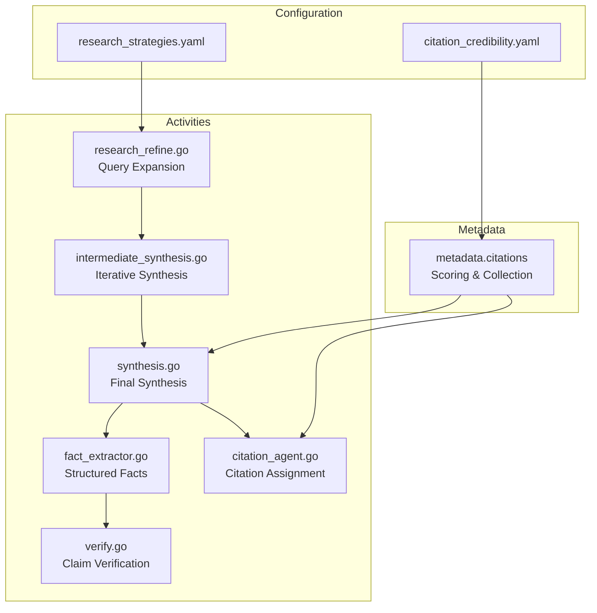

**Diagram sources**
- [research_strategies.yaml](file://config/research_strategies.yaml#L12-L53)
- [citation_credibility.yaml](file://config/citation_credibility.yaml#L11-L171)
- [citations.go](file://go/orchestrator/internal/metadata/citations.go#L25-L91)
- [research_refine.go](file://go/orchestrator/internal/activities/research_refine.go#L66-L472)
- [intermediate_synthesis.go](file://go/orchestrator/internal/activities/intermediate_synthesis.go#L44-L147)
- [synthesis.go](file://go/orchestrator/internal/activities/synthesis.go#L291-L374)
- [fact_extractor.go](file://go/orchestrator/internal/activities/fact_extractor.go#L60-L173)
- [citation_agent.go](file://go/orchestrator/internal/activities/citation_agent.go#L96-L350)
- [verify.go](file://go/orchestrator/internal/activities/verify.go#L17-L80)

**Section sources**
- [research_strategies.yaml](file://config/research_strategies.yaml#L1-L53)
- [citation_credibility.yaml](file://config/citation_credibility.yaml#L1-L171)

## Core Components
- Research Strategies: Defines verification-enabled workflows, concurrency, iteration limits, and model tiering for cost optimization
- Citation Credibility: Provides TLD and domain-group scoring, quality gates, and diversity rules
- Citation Metadata: Computes quality and credibility scores, deduplicates, enforces diversity, and ranks sources
- Fact Extraction: Structured extraction of claims with confidence and contradiction detection
- Citation Assignment: Adds inline citations with validation and placement statistics
- Verification: Claims verification against citations with confidence metrics
- Synthesis: Iterative and final synthesis with citation integration and structured reporting

**Section sources**
- [research_strategies.yaml](file://config/research_strategies.yaml#L12-L53)
- [citation_credibility.yaml](file://config/citation_credibility.yaml#L11-L171)
- [citations.go](file://go/orchestrator/internal/metadata/citations.go#L25-L91)
- [fact_extractor.go](file://go/orchestrator/internal/activities/fact_extractor.go#L15-L57)
- [citation_agent.go](file://go/orchestrator/internal/activities/citation_agent.go#L29-L94)
- [verify.go](file://go/orchestrator/internal/activities/verify.go#L17-L79)
- [synthesis.go](file://go/orchestrator/internal/activities/synthesis.go#L291-L374)

## Architecture Overview
The Fact-Checking Research Strategy follows a tiered, iterative pipeline:
- Query refinement generates structured research dimensions and recommended source types
- Iterative synthesis consolidates partial results and identifies coverage gaps
- Final synthesis integrates citations and structured facts into a comprehensive report
- Citation assignment validates and places citations with strict content immutability checks
- Verification assesses claim support against citations with confidence metrics

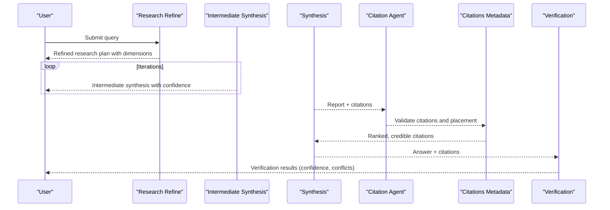

**Diagram sources**
- [research_refine.go](file://go/orchestrator/internal/activities/research_refine.go#L66-L472)
- [intermediate_synthesis.go](file://go/orchestrator/internal/activities/intermediate_synthesis.go#L44-L147)
- [synthesis.go](file://go/orchestrator/internal/activities/synthesis.go#L377-L530)
- [citation_agent.go](file://go/orchestrator/internal/activities/citation_agent.go#L96-L350)
- [citations.go](file://go/orchestrator/internal/metadata/citations.go#L974-L1091)
- [verify.go](file://go/orchestrator/internal/activities/verify.go#L17-L80)

## Detailed Component Analysis

### Research Strategy Configuration
- Verification-enabled workflows: standard, deep, academic strategies enable verification and iterative refinement
- Cost optimization: model tier architecture reduces costs by 50-70% while maintaining quality
- Iterative controls: max iterations, gap-filling parameters, and concurrency limits

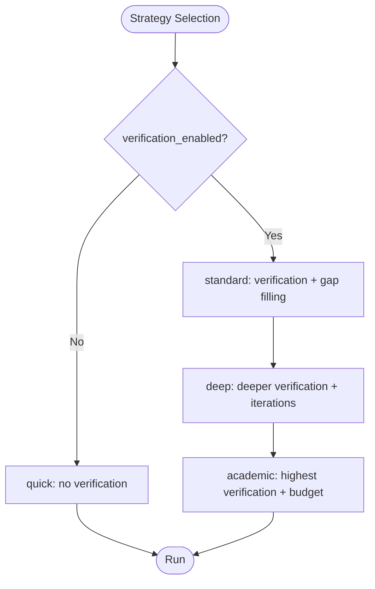

**Diagram sources**
- [research_strategies.yaml](file://config/research_strategies.yaml#L12-L53)

**Section sources**
- [research_strategies.yaml](file://config/research_strategies.yaml#L1-L53)

### Citation Credibility Scoring and Filtering
- TLD-based rules: .edu, .gov, .ac.uk, .edu.au receive high authority scores
- Domain groups: academic, news tiers, tech documentation, reference, social media, forums
- Quality gates: minimum, preferred, and high-quality thresholds for inclusion
- Diversity rules: per-domain caps, minimum unique domains, and diversity bonuses

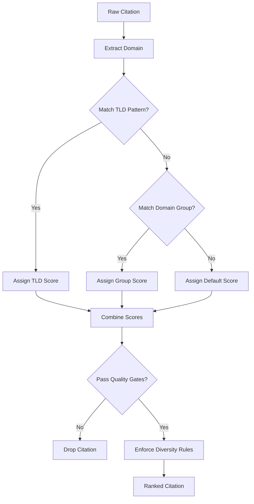

**Diagram sources**
- [citation_credibility.yaml](file://config/citation_credibility.yaml#L11-L171)
- [citations.go](file://go/orchestrator/internal/metadata/citations.go#L307-L349)
- [citations.go](file://go/orchestrator/internal/metadata/citations.go#L1045-L1051)

**Section sources**
- [citation_credibility.yaml](file://config/citation_credibility.yaml#L11-L171)
- [citations.go](file://go/orchestrator/internal/metadata/citations.go#L307-L349)
- [citations.go](file://go/orchestrator/internal/metadata/citations.go#L1045-L1051)

### Citation Metadata Collection and Ranking
- Extraction from tool outputs (web_search, web_fetch, web_subpage_fetch, web_crawl)
- Fallback extraction from agent responses and plain-text URLs
- Deduplication by normalized URL with metadata merging
- Diversity enforcement per domain with per-domain caps
- Ranking by combined quality × credibility score

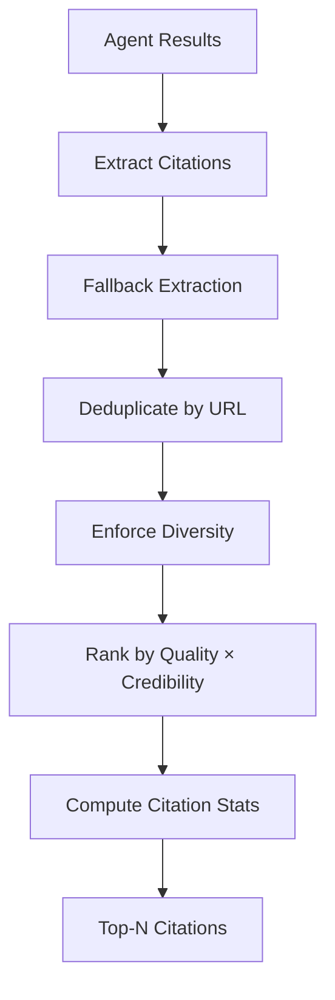

**Diagram sources**
- [citations.go](file://go/orchestrator/internal/metadata/citations.go#L974-L1091)
- [citations.go](file://go/orchestrator/internal/metadata/citations.go#L1094-L1140)
- [citations.go](file://go/orchestrator/internal/metadata/citations.go#L1259-L1295)

**Section sources**
- [citations.go](file://go/orchestrator/internal/metadata/citations.go#L974-L1091)
- [citations.go](file://go/orchestrator/internal/metadata/citations.go#L1094-L1140)
- [citations.go](file://go/orchestrator/internal/metadata/citations.go#L1259-L1295)

### Fact Extraction and Entity-Based Verification
- Structured extraction of claims with categories, confidence, entity mentions, temporal markers, and contradictions
- Confidence scoring aligned with source quality and consensus
- Contradiction tracking across extracted facts

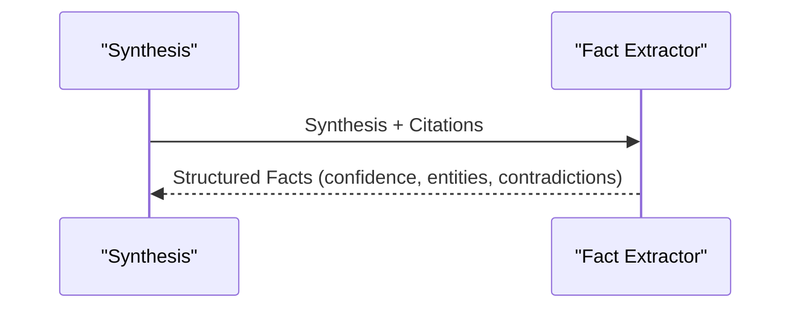

**Diagram sources**
- [fact_extractor.go](file://go/orchestrator/internal/activities/fact_extractor.go#L60-L173)

**Section sources**
- [fact_extractor.go](file://go/orchestrator/internal/activities/fact_extractor.go#L15-L57)
- [fact_extractor.go](file://go/orchestrator/internal/activities/fact_extractor.go#L175-L234)
- [fact_extractor.go](file://go/orchestrator/internal/activities/fact_extractor.go#L272-L303)

### Citation Assignment and Validation
- V2 placement plan with sentence-level citation assignments and confidence
- Validation passes if applied placements exceed thresholds and content immutability is preserved
- Legacy fallback with strict content immutability checks and citation number validation
- Placement warnings and redundancy detection

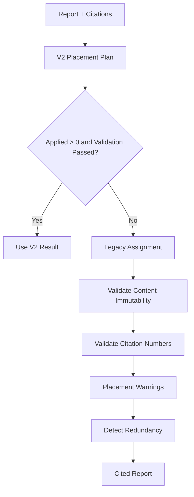

**Diagram sources**
- [citation_agent.go](file://go/orchestrator/internal/activities/citation_agent.go#L96-L154)
- [citation_agent.go](file://go/orchestrator/internal/activities/citation_agent.go#L156-L350)

**Section sources**
- [citation_agent.go](file://go/orchestrator/internal/activities/citation_agent.go#L29-L94)
- [citation_agent.go](file://go/orchestrator/internal/activities/citation_agent.go#L521-L586)
- [citation_agent.go](file://go/orchestrator/internal/activities/citation_agent.go#L327-L342)

### Claims Verification Workflow
- Verification against citations with three-category classification and BM25 retrieval
- Metrics include overall confidence, supported/unsupported/insufficient evidence counts, evidence coverage, and conflict detection

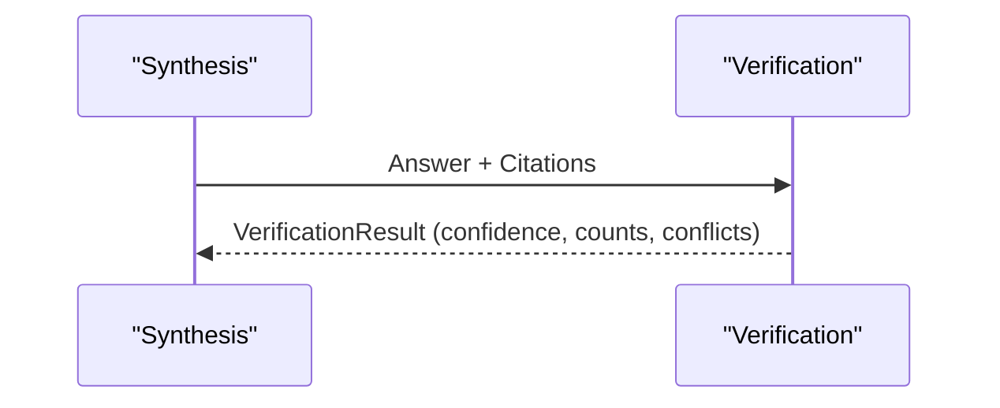

**Diagram sources**
- [verify.go](file://go/orchestrator/internal/activities/verify.go#L17-L80)

**Section sources**
- [verify.go](file://go/orchestrator/internal/activities/verify.go#L17-L80)

### Research Refinement and Entity-Based Guidance
- Expands vague queries into structured research dimensions with recommended source types
- Entity recognition and disambiguation, official domain discovery, and localization guidance
- Temporal search guidance for time-sensitive topics

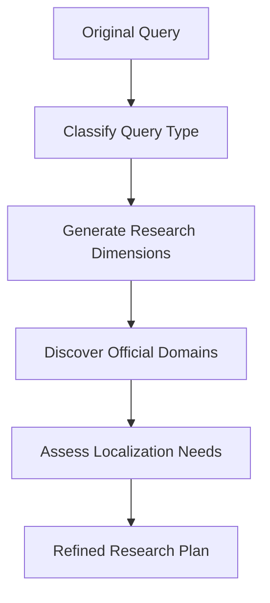

**Diagram sources**
- [research_refine.go](file://go/orchestrator/internal/activities/research_refine.go#L66-L472)

**Section sources**
- [research_refine.go](file://go/orchestrator/internal/activities/research_refine.go#L27-L62)
- [research_refine.go](file://go/orchestrator/internal/activities/research_refine.go#L76-L236)
- [research_refine.go](file://go/orchestrator/internal/activities/research_refine.go#L474-L569)

### Iterative Synthesis and Gap-Filling
- Combines partial results across iterations, identifies key findings and coverage areas
- Confidence scoring determines if further research iterations are needed
- Suggests focus areas for subsequent iterations

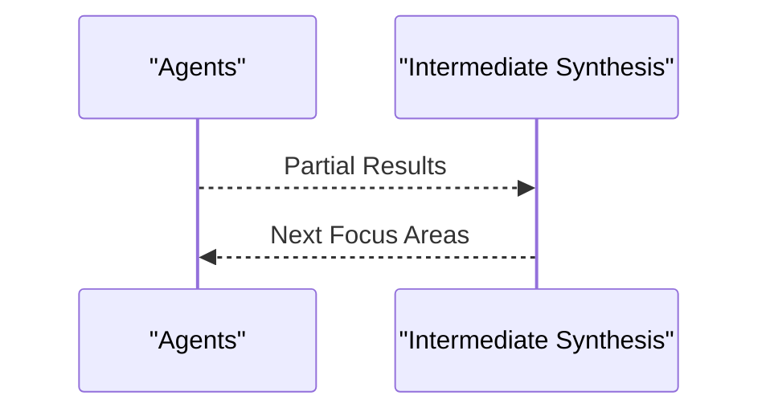

**Diagram sources**
- [intermediate_synthesis.go](file://go/orchestrator/internal/activities/intermediate_synthesis.go#L44-L147)

**Section sources**
- [intermediate_synthesis.go](file://go/orchestrator/internal/activities/intermediate_synthesis.go#L16-L41)
- [intermediate_synthesis.go](file://go/orchestrator/internal/activities/intermediate_synthesis.go#L149-L196)
- [intermediate_synthesis.go](file://go/orchestrator/internal/activities/intermediate_synthesis.go#L226-L258)

### Final Synthesis and Structured Reporting
- Integrates citations and structured facts into comprehensive reports
- Supports research-style synthesis with explicit section headings and citation guidance
- Emits streaming events for synthesis progress and completion

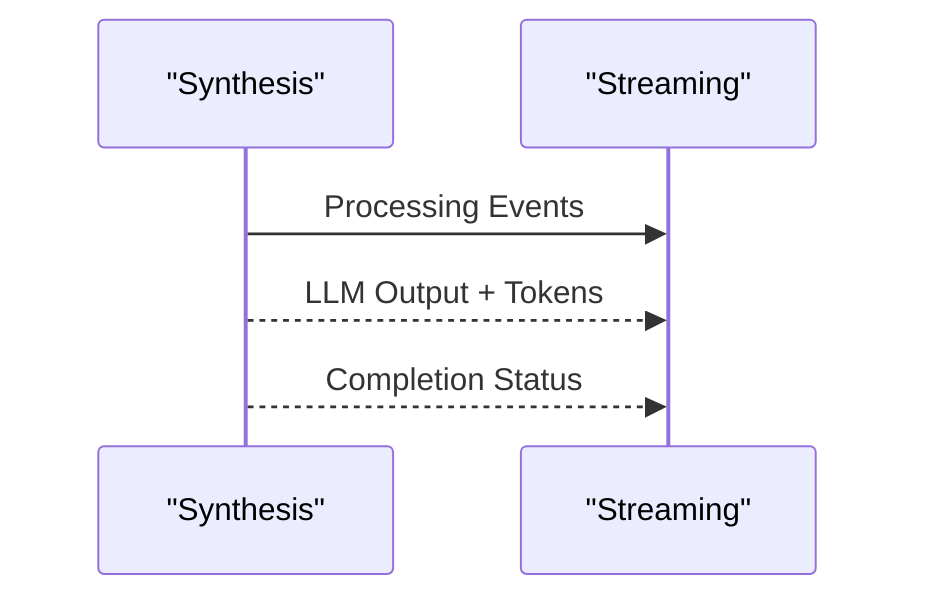

**Diagram sources**
- [synthesis.go](file://go/orchestrator/internal/activities/synthesis.go#L291-L374)
- [synthesis.go](file://go/orchestrator/internal/activities/synthesis.go#L462-L725)

**Section sources**
- [synthesis.go](file://go/orchestrator/internal/activities/synthesis.go#L291-L374)
- [synthesis.go](file://go/orchestrator/internal/activities/synthesis.go#L462-L725)
- [synthesis.go](file://go/orchestrator/internal/activities/synthesis.go#L727-L800)

## Dependency Analysis
The Fact-Checking Research Strategy exhibits clear dependency chains:
- Configuration drives strategy selection and model tiering
- Metadata utilities provide scoring and collection for citations
- Activities depend on metadata for quality and credibility
- Verification depends on synthesis outputs and citations
- Synthesis orchestrates citation assignment and fact extraction

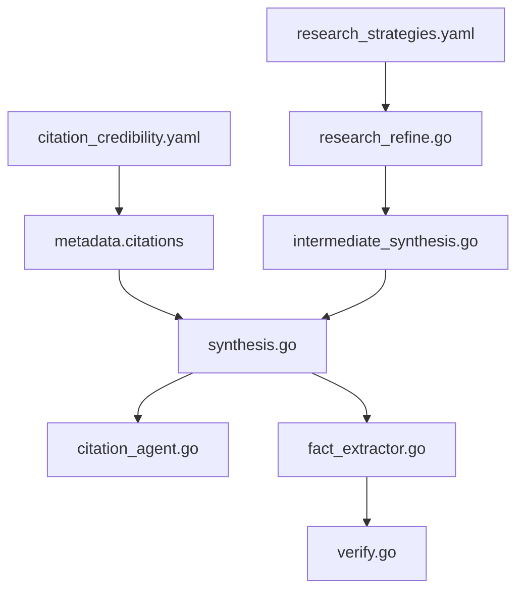

**Diagram sources**
- [research_strategies.yaml](file://config/research_strategies.yaml#L12-L53)
- [citation_credibility.yaml](file://config/citation_credibility.yaml#L11-L171)
- [citations.go](file://go/orchestrator/internal/metadata/citations.go#L25-L91)
- [research_refine.go](file://go/orchestrator/internal/activities/research_refine.go#L66-L472)
- [intermediate_synthesis.go](file://go/orchestrator/internal/activities/intermediate_synthesis.go#L44-L147)
- [synthesis.go](file://go/orchestrator/internal/activities/synthesis.go#L291-L374)
- [fact_extractor.go](file://go/orchestrator/internal/activities/fact_extractor.go#L60-L173)
- [citation_agent.go](file://go/orchestrator/internal/activities/citation_agent.go#L96-L350)
- [verify.go](file://go/orchestrator/internal/activities/verify.go#L17-L80)

**Section sources**
- [research_strategies.yaml](file://config/research_strategies.yaml#L12-L53)
- [citation_credibility.yaml](file://config/citation_credibility.yaml#L11-L171)
- [citations.go](file://go/orchestrator/internal/metadata/citations.go#L25-L91)
- [research_refine.go](file://go/orchestrator/internal/activities/research_refine.go#L66-L472)
- [intermediate_synthesis.go](file://go/orchestrator/internal/activities/intermediate_synthesis.go#L44-L147)
- [synthesis.go](file://go/orchestrator/internal/activities/synthesis.go#L291-L374)
- [fact_extractor.go](file://go/orchestrator/internal/activities/fact_extractor.go#L60-L173)
- [citation_agent.go](file://go/orchestrator/internal/activities/citation_agent.go#L96-L350)
- [verify.go](file://go/orchestrator/internal/activities/verify.go#L17-L80)

## Performance Considerations
- Model tiering: Utility activities use "small" tiers; final synthesis uses "large" for quality; agent execution tiers vary by strategy to reduce costs by 50-70%
- Iterative refinement: Controlled max iterations and gap-filling parameters prevent unnecessary computation
- Citation ranking: Combined quality × credibility score prioritizes authoritative sources efficiently
- Streaming events: Emit synthesis progress and completion to improve perceived responsiveness

[No sources needed since this section provides general guidance]

## Troubleshooting Guide
- Citation Agent validation failures: Content immutability violations or invalid citation numbers trigger fallback to original report
- Low-confidence synthesis: Evaluation results provide feedback to guide improvements
- Language mismatch: Forced language matching ensures responses align with query language requirements
- Citation extraction issues: Fallbacks from structured tool outputs to plain-text URL scanning and response parsing

**Section sources**
- [citation_agent.go](file://go/orchestrator/internal/activities/citation_agent.go#L300-L317)
- [evaluate.go](file://go/orchestrator/internal/activities/evaluate.go#L10-L35)
- [synthesis.go](file://go/orchestrator/internal/activities/synthesis.go#L558-L568)
- [citations.go](file://go/orchestrator/internal/metadata/citations.go#L502-L522)

## Conclusion
The Fact-Checking Research Strategy establishes a robust, cost-effective pipeline for authoritative source validation, evidence-based analysis, and credibility assessment. By integrating citation metadata scoring, structured fact extraction, citation assignment with strict validation, and claims verification, the system ensures rigorous cross-source corroboration. Research strategies and synthesis patterns produce structured, verifiable reports suitable for misinformation investigations and authoritative source establishment.