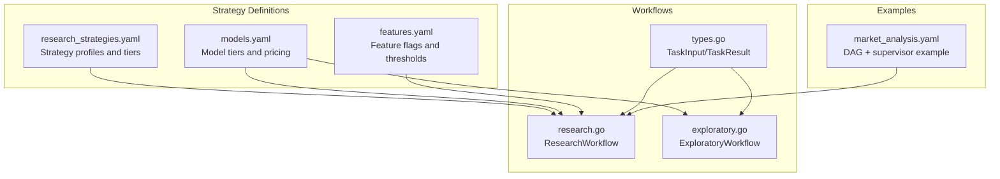
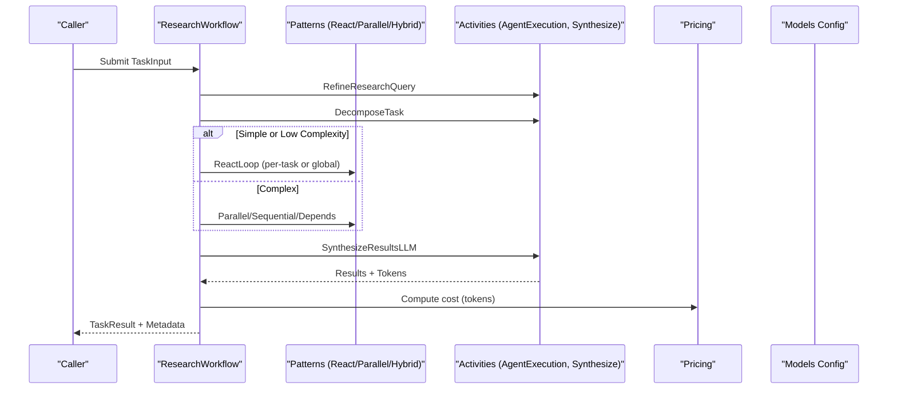
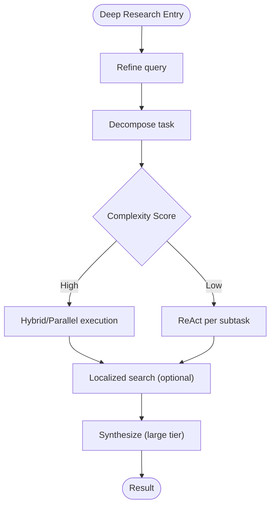
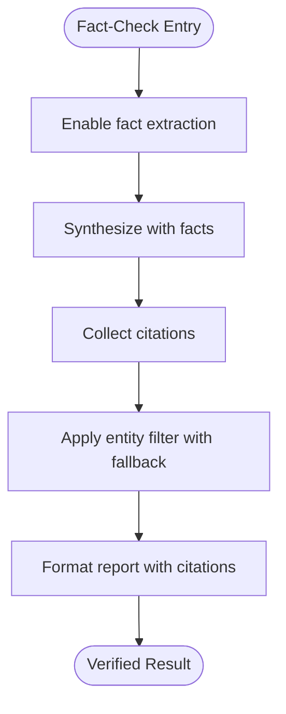
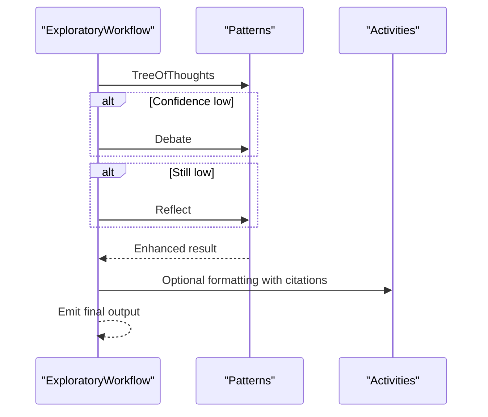
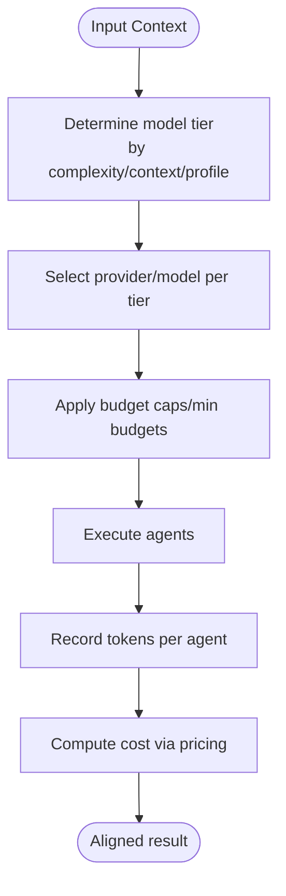
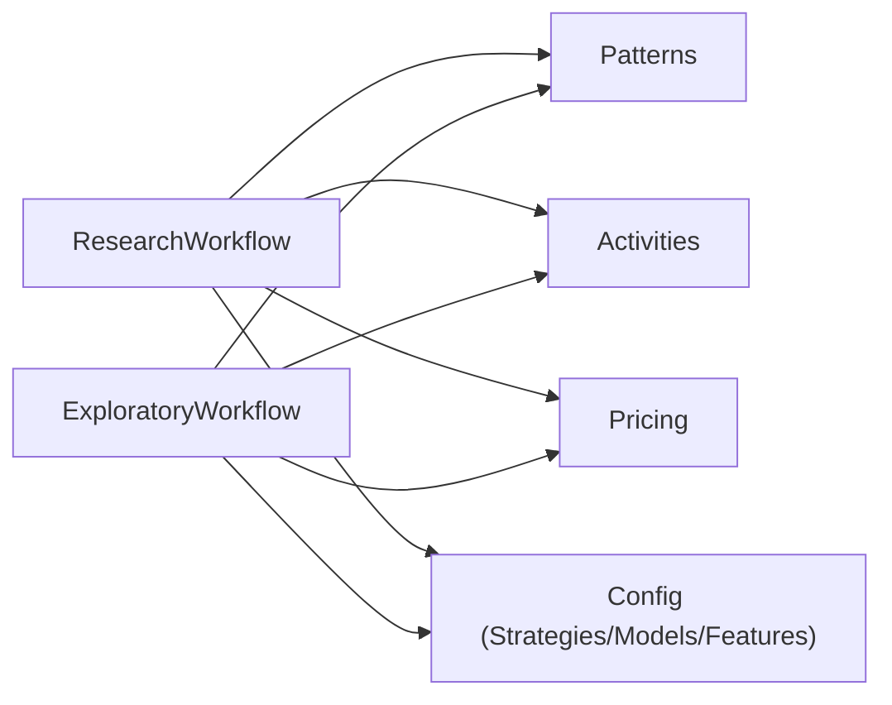
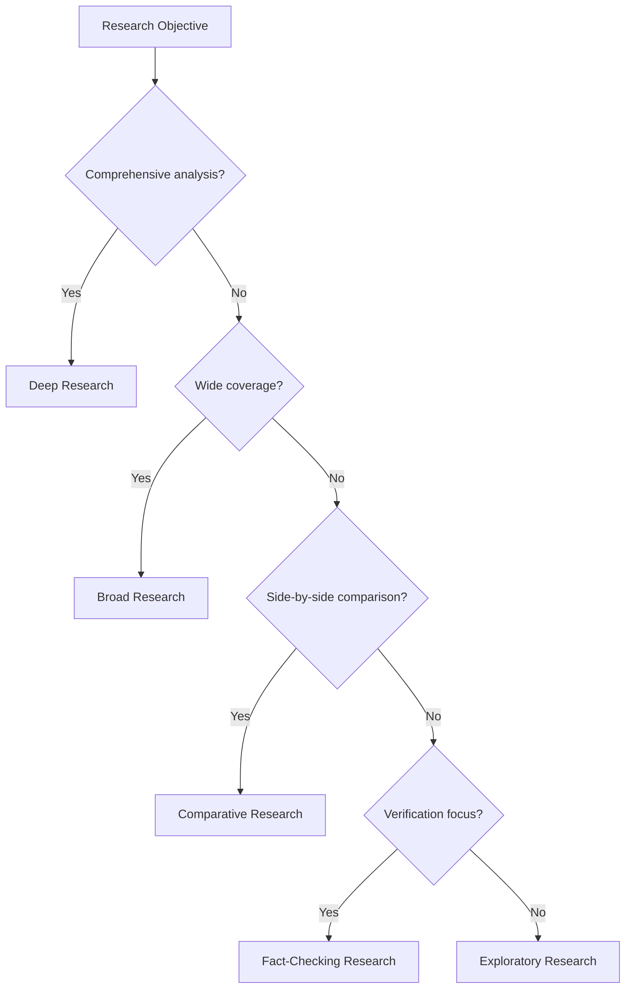

# Research Strategies

<cite>
**Referenced Files in This Document**
- [research.go](file://go/orchestrator/internal/workflows/strategies/research.go)
- [exploratory.go](file://go/orchestrator/internal/workflows/strategies/exploratory.go)
- [types.go](file://go/orchestrator/internal/workflows/strategies/types.go)
- [research_strategies.yaml](file://config/research_strategies.yaml)
- [models.yaml](file://config/models.yaml)
- [market_analysis.yaml](file://config/workflows/examples/market_analysis.yaml)
- [features.yaml](file://config/features.yaml)
</cite>

## Table of Contents
1. [Introduction](#introduction)
2. [Project Structure](#project-structure)
3. [Core Components](#core-components)
4. [Architecture Overview](#architecture-overview)
5. [Detailed Component Analysis](#detailed-component-analysis)
6. [Dependency Analysis](#dependency-analysis)
7. [Performance Considerations](#performance-considerations)
8. [Troubleshooting Guide](#troubleshooting-guide)
9. [Conclusion](#conclusion)
10. [Appendices](#appendices)

## Introduction
This document explains Shannon’s research strategies that power multi-agent research workflows. It covers five research strategies—deep research, broad research, comparative research, fact-checking research, and exploratory research—along with strategy selection criteria, resource allocation patterns, and cost optimization techniques. It also details how strategies adapt to different research objectives, data sources, and analysis depths, and provides practical examples for academic research, market analysis, and investigative reporting. Finally, it documents provider override mechanisms, model tier selection, budget management, strategy combinations, and adaptive research approaches.

## Project Structure
Shannon’s research strategies are implemented in the orchestrator’s workflow strategies package and configured via YAML files. The primary runtime logic resides in the research workflow, with exploratory research implemented as a dedicated workflow. Strategy configuration is centralized in the research strategies configuration file, while model tier selection and pricing are governed by the models configuration. Example workflow templates demonstrate how strategies integrate with DAG orchestration and supervisor synthesis.

**Diagram sources**
- [research.go](file://go/orchestrator/internal/workflows/strategies/research.go#L705-L800)
- [exploratory.go](file://go/orchestrator/internal/workflows/strategies/exploratory.go#L17-L57)
- [research_strategies.yaml](file://config/research_strategies.yaml#L12-L53)
- [models.yaml](file://config/models.yaml#L16-L115)
- [features.yaml](file://config/features.yaml#L83-L87)
- [types.go](file://go/orchestrator/internal/workflows/strategies/types.go#L8-L54)
- [market_analysis.yaml](file://config/workflows/examples/market_analysis.yaml#L1-L76)

**Section sources**
- [research.go](file://go/orchestrator/internal/workflows/strategies/research.go#L705-L800)
- [exploratory.go](file://go/orchestrator/internal/workflows/strategies/exploratory.go#L17-L57)
- [research_strategies.yaml](file://config/research_strategies.yaml#L12-L53)
- [models.yaml](file://config/models.yaml#L16-L115)
- [features.yaml](file://config/features.yaml#L83-L87)
- [types.go](file://go/orchestrator/internal/workflows/strategies/types.go#L8-L54)
- [market_analysis.yaml](file://config/workflows/examples/market_analysis.yaml#L1-L76)

## Core Components
- ResearchWorkflow orchestrates multi-agent research across refinement, decomposition, agent execution, localized search, synthesis, and citation handling. It adapts execution patterns (ReAct, parallel, hybrid) based on complexity and context.
- ExploratoryWorkflow implements iterative discovery with tree-of-thoughts, optional debate, and reflection to improve confidence and quality.
- Strategy configuration defines model tiers, concurrency, and iteration caps per strategy profile.
- Model tier selection and pricing inform cost optimization and provider selection.
- Example workflow templates illustrate strategy usage in DAG and supervisor contexts.

**Section sources**
- [research.go](file://go/orchestrator/internal/workflows/strategies/research.go#L705-L800)
- [exploratory.go](file://go/orchestrator/internal/workflows/strategies/exploratory.go#L17-L57)
- [research_strategies.yaml](file://config/research_strategies.yaml#L12-L53)
- [models.yaml](file://config/models.yaml#L16-L115)

## Architecture Overview
The research architecture composes cognitive patterns and execution strategies around a central ResearchWorkflow. It dynamically selects model tiers, manages budgets, and integrates synthesis with citation extraction and formatting.

**Diagram sources**
- [research.go](file://go/orchestrator/internal/workflows/strategies/research.go#L852-L991)
- [research.go](file://go/orchestrator/internal/workflows/strategies/research.go#L1345-L1960)
- [research.go](file://go/orchestrator/internal/workflows/strategies/research.go#L2232-L2399)
- [models.yaml](file://config/models.yaml#L536-L776)

## Detailed Component Analysis

### Strategy Profiles and Selection Criteria
- Strategy profiles define model tier, concurrency, iteration limits, and verification/gap-filling behavior. These drive model tier selection and execution patterns.
- Model tier selection is complexity-aware and can be overridden via context. Pricing informs cost estimation and budget alignment.

Key configuration highlights:
- Strategy tiers and parameters: [research_strategies.yaml](file://config/research_strategies.yaml#L12-L53)
- Model tiers and provider catalog: [models.yaml](file://config/models.yaml#L16-L115)
- Complexity thresholds for tier selection: [features.yaml](file://config/features.yaml#L83-L87)

**Section sources**
- [research_strategies.yaml](file://config/research_strategies.yaml#L12-L53)
- [models.yaml](file://config/models.yaml#L16-L115)
- [features.yaml](file://config/features.yaml#L83-L87)

### Deep Research
- Purpose: Comprehensive analysis with deep reasoning, extensive gap filling, and synthesis.
- Execution: Uses ReAct per subtask for high-complexity tasks, parallel/hybrid execution for multi-subtask workflows, and localized search for multi-language coverage.
- Resource allocation: Higher concurrency and iteration caps; synthesis uses large tier; utility activities remain small.
- Cost optimization: Tiered model usage (small utility, medium agents, large synthesis) balances quality and cost.

**Diagram sources**
- [research.go](file://go/orchestrator/internal/workflows/strategies/research.go#L1345-L1960)
- [research.go](file://go/orchestrator/internal/workflows/strategies/research.go#L1969-L2143)
- [research.go](file://go/orchestrator/internal/workflows/strategies/research.go#L2232-L2399)

**Section sources**
- [research.go](file://go/orchestrator/internal/workflows/strategies/research.go#L1345-L1960)
- [research.go](file://go/orchestrator/internal/workflows/strategies/research.go#L1969-L2143)
- [research.go](file://go/orchestrator/internal/workflows/strategies/research.go#L2232-L2399)

### Broad Research
- Purpose: Wide coverage across many topics or sources with moderate depth.
- Execution: Emphasizes parallel execution and ReAct loops with controlled concurrency and shorter iteration limits.
- Resource allocation: Medium model tier for agents; synthesis tier configurable; budget per agent tuned via context.

**Section sources**
- [research.go](file://go/orchestrator/internal/workflows/strategies/research.go#L1564-L1960)
- [research_strategies.yaml](file://config/research_strategies.yaml#L19-L29)

### Comparative Research
- Purpose: Side-by-side analysis of entities, products, or methodologies.
- Execution: Uses decomposition to isolate comparable dimensions; parallel execution across comparable subtasks; synthesis aggregates comparative insights.
- Data sources: Structured decomposition and explicit comparison areas; synthesis template can be tailored for comparative framing.

**Section sources**
- [research.go](file://go/orchestrator/internal/workflows/strategies/research.go#L998-L1050)
- [research.go](file://go/orchestrator/internal/workflows/strategies/research.go#L1684-L1960)

### Fact-Checking Research
- Purpose: Verification-focused synthesis with explicit fact extraction and citation filtering.
- Execution: Enables fact extraction synthesis template; applies entity-based citation filtering with fallback to preserve coverage.
- Quality assurance: Entity filter retains official domains and strong matches; fallback preserves results when retention is too low.

**Diagram sources**
- [research.go](file://go/orchestrator/internal/workflows/strategies/research.go#L2273-L2399)

**Section sources**
- [research.go](file://go/orchestrator/internal/workflows/strategies/research.go#L2273-L2399)

### Exploratory Research
- Purpose: Discovery and hypothesis testing with iterative exploration, optional debate, and reflection.
- Execution: Tree-of-thoughts for systematic exploration; optional debate for confidence boost; reflection for final quality check.
- Confidence thresholds: Applies debate when confidence is below threshold; reflection when confidence remains low.

**Diagram sources**
- [exploratory.go](file://go/orchestrator/internal/workflows/strategies/exploratory.go#L17-L57)
- [exploratory.go](file://go/orchestrator/internal/workflows/strategies/exploratory.go#L191-L325)

**Section sources**
- [exploratory.go](file://go/orchestrator/internal/workflows/strategies/exploratory.go#L17-L57)
- [exploratory.go](file://go/orchestrator/internal/workflows/strategies/exploratory.go#L191-L325)

### Practical Examples

#### Academic Research
- Strategy fit: Deep research with verification and synthesis.
- Implementation: Use decomposition to break down research areas; parallel execution for subtopics; synthesis with comprehensive style and citations; optional localized search for multi-language coverage.

**Section sources**
- [research.go](file://go/orchestrator/internal/workflows/strategies/research.go#L1345-L1960)
- [research.go](file://go/orchestrator/internal/workflows/strategies/research.go#L1969-L2143)
- [research.go](file://go/orchestrator/internal/workflows/strategies/research.go#L2232-L2399)

#### Market Analysis
- Strategy fit: Broad research with comparative and synthesis.
- Implementation: DAG workflow with parallel competitors, trends, and customer branches; supervisor synthesis coordinating sub-agent results; reflection for final report.

**Section sources**
- [market_analysis.yaml](file://config/workflows/examples/market_analysis.yaml#L1-L76)
- [research.go](file://go/orchestrator/internal/workflows/strategies/research.go#L1684-L1960)

#### Investigative Reporting
- Strategy fit: Fact-checking research with verification and citation filtering.
- Implementation: Enable fact extraction; apply entity-based citation filtering; synthesize verified findings with formatted citations.

**Section sources**
- [research.go](file://go/orchestrator/internal/workflows/strategies/research.go#L2273-L2399)

### Provider Override Mechanisms, Model Tier Selection, and Budget Management
- Provider override: Payloads and configuration can influence provider/model selection and tier assignment.
- Model tier selection: Determined by complexity thresholds, explicit context overrides, and strategy profiles; synthesis tier can be overridden independently.
- Budget management: Per-agent and total budget caps, with minimum budget support; token usage recorded per agent to prevent double counting.

**Diagram sources**
- [research.go](file://go/orchestrator/internal/workflows/strategies/research.go#L1052-L1071)
- [research.go](file://go/orchestrator/internal/workflows/strategies/research.go#L2280-L2282)
- [models.yaml](file://config/models.yaml#L536-L776)

**Section sources**
- [research.go](file://go/orchestrator/internal/workflows/strategies/research.go#L1052-L1071)
- [research.go](file://go/orchestrator/internal/workflows/strategies/research.go#L2280-L2282)
- [models.yaml](file://config/models.yaml#L536-L776)

### Strategy Combination Patterns and Adaptive Approaches
- Hybrid execution: Combines sequential and parallel paths based on subtask dependencies.
- Adaptive confidence: Exploratory workflow applies debate and reflection based on confidence thresholds.
- Dynamic decomposition: Adjusts ReAct iterations and per-task reasoning based on strategy and context.

**Section sources**
- [research.go](file://go/orchestrator/internal/workflows/strategies/research.go#L1421-L1960)
- [exploratory.go](file://go/orchestrator/internal/workflows/strategies/exploratory.go#L209-L325)

## Dependency Analysis
ResearchWorkflow and ExploratoryWorkflow depend on:
- Pattern execution (React, Tree-of-Thoughts, Debate, Reflection)
- Activities for refinement, decomposition, synthesis, and agent execution
- Pricing for cost estimation
- Configuration for strategies, models, and features

**Diagram sources**
- [research.go](file://go/orchestrator/internal/workflows/strategies/research.go#L705-L800)
- [exploratory.go](file://go/orchestrator/internal/workflows/strategies/exploratory.go#L17-L57)
- [models.yaml](file://config/models.yaml#L536-L776)

**Section sources**
- [research.go](file://go/orchestrator/internal/workflows/strategies/research.go#L705-L800)
- [exploratory.go](file://go/orchestrator/internal/workflows/strategies/exploratory.go#L17-L57)
- [models.yaml](file://config/models.yaml#L536-L776)

## Performance Considerations
- Tiered model usage reduces cost while preserving quality.
- Concurrency gating and dependency-aware execution optimize throughput.
- Context compression and token recording improve efficiency and visibility.
- Complexity thresholds guide model tier selection to balance speed and capability.

[No sources needed since this section provides general guidance]

## Troubleshooting Guide
Common issues and mitigations:
- No tool executions: ResearchWorkflow triggers a fallback web search to ensure synthesis proceeds.
- Confidence too low: ExploratoryWorkflow applies debate and reflection to improve results.
- Aggressive citation filtering: Entity-based filter includes a fallback to preserve coverage when retention is too low.

**Section sources**
- [research.go](file://go/orchestrator/internal/workflows/strategies/research.go#L2237-L2271)
- [exploratory.go](file://go/orchestrator/internal/workflows/strategies/exploratory.go#L214-L279)
- [research.go](file://go/orchestrator/internal/workflows/strategies/research.go#L2328-L2350)

## Conclusion
Shannon’s research strategies combine adaptive execution patterns, tiered model selection, and robust budgeting to deliver scalable, cost-effective multi-agent research. By aligning strategy profiles with research objectives, leveraging dynamic decomposition and synthesis, and integrating verification and exploration, teams can achieve comprehensive coverage, comparative insights, and verified outcomes across academic, market, and investigative use cases.

[No sources needed since this section summarizes without analyzing specific files]

## Appendices

### Strategy Selection Decision Tree

[No sources needed since this diagram shows conceptual workflow, not actual code structure]