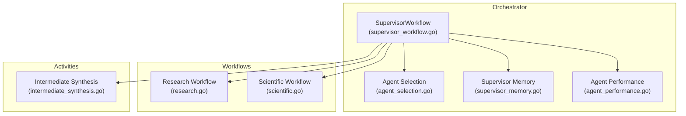
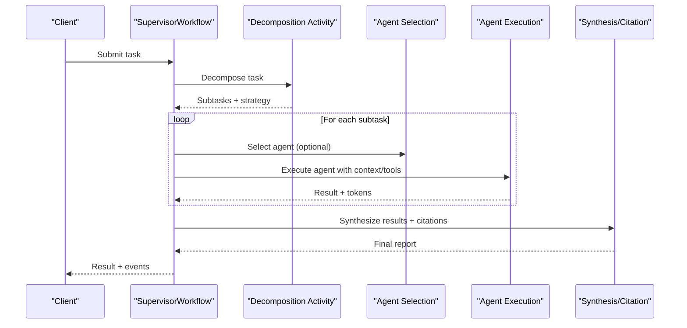
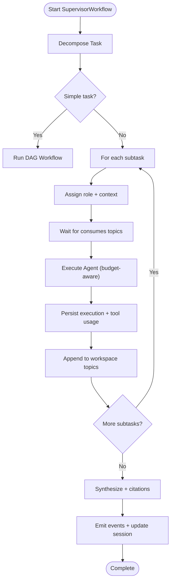
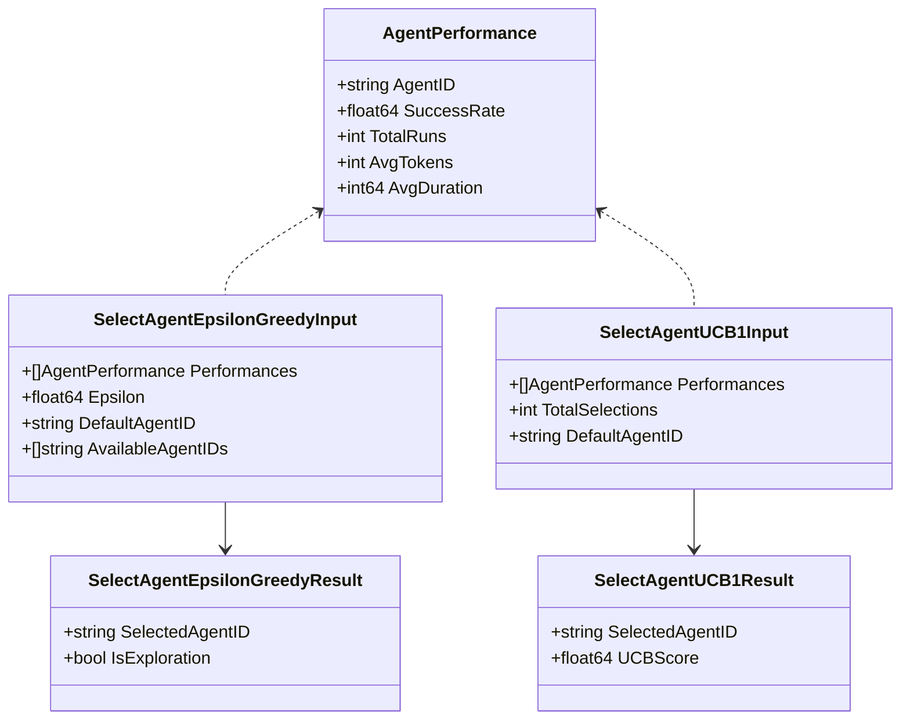
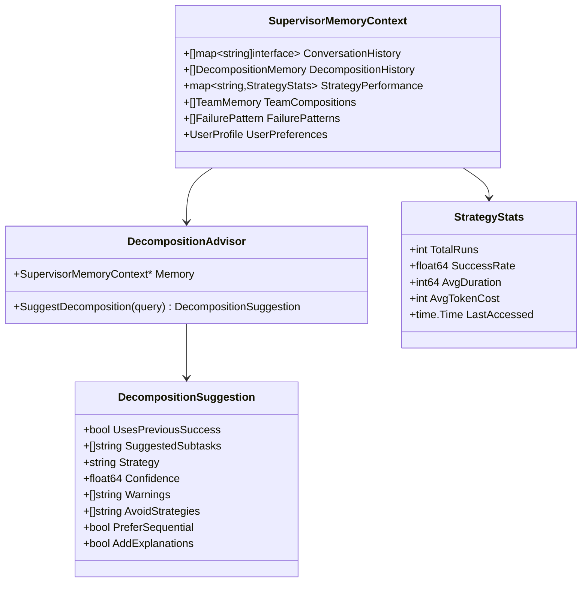
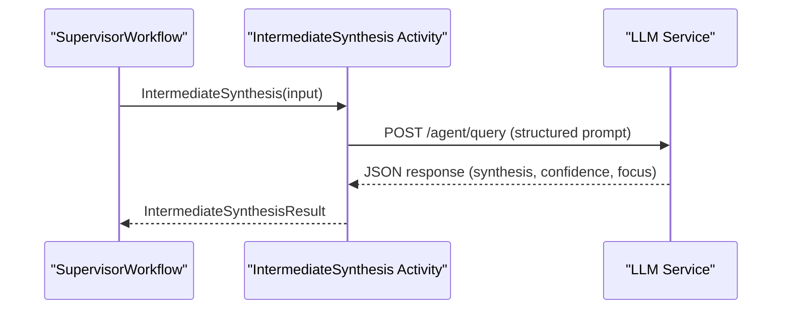
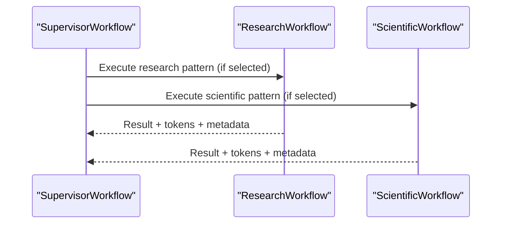
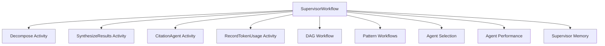

# Supervisor-Agent Hierarchies

<cite>
**Referenced Files in This Document**
- [supervisor_workflow.go](file://go/orchestrator/internal/workflows/supervisor_workflow.go)
- [agent_selection.go](file://go/orchestrator/internal/workflows/agent_selection.go)
- [supervisor_memory.go](file://go/orchestrator/internal/activities/supervisor_memory.go)
- [agent_performance.go](file://go/orchestrator/internal/activities/agent_performance.go)
- [intermediate_synthesis.go](file://go/orchestrator/internal/activities/intermediate_synthesis.go)
- [research.go](file://go/orchestrator/internal/workflows/strategies/research.go)
- [scientific.go](file://go/orchestrator/internal/workflows/strategies/scientific.go)
- [10_supervisor_workflow_test.sh](file://tests/e2e/10_supervisor_workflow_test.sh)
- [personas.yaml](file://config/personas.yaml)
</cite>

## Table of Contents
1. [Introduction](#introduction)
2. [Project Structure](#project-structure)
3. [Core Components](#core-components)
4. [Architecture Overview](#architecture-overview)
5. [Detailed Component Analysis](#detailed-component-analysis)
6. [Dependency Analysis](#dependency-analysis)
7. [Performance Considerations](#performance-considerations)
8. [Troubleshooting Guide](#troubleshooting-guide)
9. [Conclusion](#conclusion)
10. [Appendices](#appendices)

## Introduction
This document explains the supervisor-agent hierarchies in Shannon’s multi-agent system. It focuses on the SupervisorWorkflow orchestration pattern that coordinates multiple agent layers for complex tasks. It covers agent selection algorithms, capability matching, resource allocation strategies, hierarchical decision-making, delegation patterns, and coordination mechanisms between supervisors and sub-agents. Practical examples demonstrate supervisor-agent interactions for research synthesis, task decomposition, and quality assurance. It also documents agent performance monitoring, feedback loops, adaptive hierarchy adjustment, supervisor training, agent specialization, and dynamic team formation based on task complexity and domain expertise.

## Project Structure
Shannon’s supervisor-agent system is implemented primarily in Go with Temporal workflows and activities. The supervisor orchestrator coordinates child workflows and agents, while specialized strategies and synthesis activities handle research, scientific workflows, and intermediate synthesis. End-to-end tests validate supervisor spawning and multi-agent collaboration.

**Diagram sources**
- [supervisor_workflow.go](file://go/orchestrator/internal/workflows/supervisor_workflow.go#L42-L1639)
- [agent_selection.go](file://go/orchestrator/internal/workflows/agent_selection.go#L12-L148)
- [supervisor_memory.go](file://go/orchestrator/internal/activities/supervisor_memory.go#L186-L253)
- [agent_performance.go](file://go/orchestrator/internal/activities/agent_performance.go#L54-L132)
- [intermediate_synthesis.go](file://go/orchestrator/internal/activities/intermediate_synthesis.go#L44-L147)
- [research.go](file://go/orchestrator/internal/workflows/strategies/research.go#L707-L800)
- [scientific.go](file://go/orchestrator/internal/workflows/strategies/scientific.go#L21-L525)

**Section sources**
- [supervisor_workflow.go](file://go/orchestrator/internal/workflows/supervisor_workflow.go#L42-L1639)
- [agent_selection.go](file://go/orchestrator/internal/workflows/agent_selection.go#L12-L148)
- [supervisor_memory.go](file://go/orchestrator/internal/activities/supervisor_memory.go#L186-L253)
- [agent_performance.go](file://go/orchestrator/internal/activities/agent_performance.go#L54-L132)
- [intermediate_synthesis.go](file://go/orchestrator/internal/activities/intermediate_synthesis.go#L44-L147)
- [research.go](file://go/orchestrator/internal/workflows/strategies/research.go#L707-L800)
- [scientific.go](file://go/orchestrator/internal/workflows/strategies/scientific.go#L21-L525)

## Core Components
- SupervisorWorkflow: Orchestrates decomposition, dynamic team formation, P2P coordination, agent execution, and synthesis. It supports pause/resume/cancel, budget tracking, and enhanced supervisor memory.
- Agent Selection: Provides performance-based selection using epsilon-greedy and UCB1 strategies with version gating.
- Supervisor Memory: Stores and recommends decomposition patterns, strategy performance, failure patterns, and user preferences to guide decomposition and strategy selection.
- Agent Performance: Fetches historical performance and supports selection algorithms.
- Intermediate Synthesis: Aggregates partial results across iterations with confidence assessment and suggested focus areas.
- Research and Scientific Workflows: Demonstrate composed patterns for complex tasks, including memory retrieval, debate, reflection, and tree-of-thoughts.

**Section sources**
- [supervisor_workflow.go](file://go/orchestrator/internal/workflows/supervisor_workflow.go#L42-L1639)
- [agent_selection.go](file://go/orchestrator/internal/workflows/agent_selection.go#L12-L148)
- [supervisor_memory.go](file://go/orchestrator/internal/activities/supervisor_memory.go#L70-L253)
- [agent_performance.go](file://go/orchestrator/internal/activities/agent_performance.go#L54-L342)
- [intermediate_synthesis.go](file://go/orchestrator/internal/activities/intermediate_synthesis.go#L16-L147)
- [research.go](file://go/orchestrator/internal/workflows/strategies/research.go#L707-L800)
- [scientific.go](file://go/orchestrator/internal/workflows/strategies/scientific.go#L21-L525)

## Architecture Overview
The supervisor-agent hierarchy centers on SupervisorWorkflow, which:
- Decomposes tasks into subtasks with suggested tools and dependencies.
- Assigns roles to agents and optionally recruits/retires agents dynamically.
- Coordinates P2P workspace topics and waits for upstream results.
- Executes agents with budget-aware token accounting and persistence.
- Synthesizes results with citations and optional verification.
- Emits events for streaming dashboards and control signals.

**Diagram sources**
- [supervisor_workflow.go](file://go/orchestrator/internal/workflows/supervisor_workflow.go#L317-L1267)
- [agent_selection.go](file://go/orchestrator/internal/workflows/agent_selection.go#L21-L85)
- [intermediate_synthesis.go](file://go/orchestrator/internal/activities/intermediate_synthesis.go#L44-L147)

**Section sources**
- [supervisor_workflow.go](file://go/orchestrator/internal/workflows/supervisor_workflow.go#L317-L1267)

## Detailed Component Analysis

### SupervisorWorkflow Orchestration
SupervisorWorkflow implements a robust supervisor pattern:
- Decomposition: Uses decomposition advisor suggestions and strategy overrides.
- Dynamic Team: Recruits/retires agents via signals with authorization and event emission.
- P2P Coordination: Waits on workspace topics with exponential backoff and notifications.
- Execution Loop: Runs subtasks sequentially with intelligent retry and budget tracking.
- Synthesis: Integrates citations, optional verification, and token accounting.
- Streaming: Emits events for progress, dependency satisfaction, synthesis, and completion.

**Diagram sources**
- [supervisor_workflow.go](file://go/orchestrator/internal/workflows/supervisor_workflow.go#L42-L1639)

**Section sources**
- [supervisor_workflow.go](file://go/orchestrator/internal/workflows/supervisor_workflow.go#L42-L1639)

### Agent Selection Algorithms
The system supports performance-based agent selection with version gating:
- Epsilon-greedy: Exploits best performers with occasional exploration.
- UCB1: Balances exploration and exploitation using upper confidence bounds.
- Data Source: Historical performance metrics fetched from agent execution records.
- Integration: Called during subtask execution to pick the most suitable agent.

**Diagram sources**
- [agent_selection.go](file://go/orchestrator/internal/workflows/agent_selection.go#L21-L147)
- [agent_performance.go](file://go/orchestrator/internal/activities/agent_performance.go#L32-L342)

**Section sources**
- [agent_selection.go](file://go/orchestrator/internal/workflows/agent_selection.go#L12-L148)
- [agent_performance.go](file://go/orchestrator/internal/activities/agent_performance.go#L54-L342)

### Supervisor Memory and Strategy Recommendation
Supervisor memory enriches decisions with:
- Decomposition patterns and success rates.
- Strategy performance metrics with TTL and scoring.
- Failure patterns and user preferences (expertise, style, speed/accuracy).
- Decomposition advisor suggests strategies and subtasks with confidence.

**Diagram sources**
- [supervisor_memory.go](file://go/orchestrator/internal/activities/supervisor_memory.go#L70-L139)
- [supervisor_memory.go](file://go/orchestrator/internal/activities/supervisor_memory.go#L610-L727)

**Section sources**
- [supervisor_memory.go](file://go/orchestrator/internal/activities/supervisor_memory.go#L186-L253)
- [supervisor_memory.go](file://go/orchestrator/internal/activities/supervisor_memory.go#L610-L727)

### Intermediate Synthesis for Iterative Research
Intermediate synthesis aggregates partial results across iterations:
- Builds system prompts and user content.
- Calls LLM service for synthesis with confidence scoring.
- Parses structured responses and determines if more research is needed.

**Diagram sources**
- [intermediate_synthesis.go](file://go/orchestrator/internal/activities/intermediate_synthesis.go#L44-L147)

**Section sources**
- [intermediate_synthesis.go](file://go/orchestrator/internal/activities/intermediate_synthesis.go#L16-L147)

### Research and Scientific Workflows
These workflows demonstrate advanced supervisor-agent collaboration:
- ResearchWorkflow composes patterns (React loops, parallel research, reflection) with memory retrieval and citation filtering.
- ScientificWorkflow uses Chain-of-Thought, Debate, Tree-of-Thoughts, and Reflection for hypothesis-driven investigation.

**Diagram sources**
- [research.go](file://go/orchestrator/internal/workflows/strategies/research.go#L707-L800)
- [scientific.go](file://go/orchestrator/internal/workflows/strategies/scientific.go#L21-L525)

**Section sources**
- [research.go](file://go/orchestrator/internal/workflows/strategies/research.go#L707-L800)
- [scientific.go](file://go/orchestrator/internal/workflows/strategies/scientific.go#L21-L525)

### Practical Examples

#### Research Synthesis
- SupervisorWorkflow detects multi-step queries and spawns child workflows.
- ResearchWorkflow composes patterns and manages memory and citations.
- ScientificWorkflow applies debate and reflection for rigorous synthesis.

**Section sources**
- [research.go](file://go/orchestrator/internal/workflows/strategies/research.go#L707-L800)
- [scientific.go](file://go/orchestrator/internal/workflows/strategies/scientific.go#L21-L525)
- [10_supervisor_workflow_test.sh](file://tests/e2e/10_supervisor_workflow_test.sh#L34-L191)

#### Task Decomposition
- SupervisorWorkflow decomposes complex tasks into subtasks with suggested tools and dependencies.
- P2P coordination ensures downstream agents receive upstream results.

**Section sources**
- [supervisor_workflow.go](file://go/orchestrator/internal/workflows/supervisor_workflow.go#L317-L800)

#### Quality Assurance
- CitationAgent validates and injects citations into synthesized reports.
- Verification activity checks claims when enabled.

**Section sources**
- [supervisor_workflow.go](file://go/orchestrator/internal/workflows/supervisor_workflow.go#L1269-L1357)

## Dependency Analysis
SupervisorWorkflow depends on:
- Activities for decomposition, synthesis, citation, and token usage recording.
- Strategies for DAG execution and pattern-based workflows.
- Agent selection and performance activities for adaptive agent choice.
- Supervisor memory for strategy recommendation and decomposition guidance.

**Diagram sources**
- [supervisor_workflow.go](file://go/orchestrator/internal/workflows/supervisor_workflow.go#L317-L1639)
- [agent_selection.go](file://go/orchestrator/internal/workflows/agent_selection.go#L21-L85)
- [agent_performance.go](file://go/orchestrator/internal/activities/agent_performance.go#L54-L132)
- [supervisor_memory.go](file://go/orchestrator/internal/activities/supervisor_memory.go#L186-L253)

**Section sources**
- [supervisor_workflow.go](file://go/orchestrator/internal/workflows/supervisor_workflow.go#L317-L1639)
- [agent_selection.go](file://go/orchestrator/internal/workflows/agent_selection.go#L21-L85)
- [agent_performance.go](file://go/orchestrator/internal/activities/agent_performance.go#L54-L132)
- [supervisor_memory.go](file://go/orchestrator/internal/activities/supervisor_memory.go#L186-L253)

## Performance Considerations
- Intelligent retry: Limits per-task retries and overall failures to prevent infinite loops.
- Budget awareness: Tracks per-agent and task budgets, emitting progress updates.
- Context compression: Uses version-gated compression to manage token limits.
- Token accounting: Records input/output tokens for synthesis and agent executions.
- Strategy selection: Uses supervisor memory to choose effective strategies with confidence thresholds.

[No sources needed since this section provides general guidance]

## Troubleshooting Guide
Common issues and mitigations:
- Supervisor not spawning: Verify decomposition yields multiple subtasks; check orchestration router and workflow routing.
- P2P dependency timeouts: Confirm workspace topic entries exist or adjust timeout configuration.
- Agent selection failures: Ensure performance data is available; fallback to default agent is automatic.
- Budget exceeded: Review per-agent and task budget settings; adjust token budgets or model tiers.
- Citation injection failures: Validate CitationAgent response and error handling; keep original synthesis if validation fails.

**Section sources**
- [supervisor_workflow.go](file://go/orchestrator/internal/workflows/supervisor_workflow.go#L644-L763)
- [agent_selection.go](file://go/orchestrator/internal/workflows/agent_selection.go#L52-L84)
- [supervisor_workflow.go](file://go/orchestrator/internal/workflows/supervisor_workflow.go#L1314-L1357)

## Conclusion
Shannon’s supervisor-agent hierarchies provide a scalable, adaptive framework for complex tasks. SupervisorWorkflow coordinates decomposition, dynamic team formation, P2P coordination, and synthesis with robust performance monitoring and feedback loops. Agent selection algorithms and supervisor memory enable continuous improvement. Research and scientific workflows showcase advanced collaboration patterns, while end-to-end tests validate real-world behavior.

[No sources needed since this section summarizes without analyzing specific files]

## Appendices

### Agent Specialization and Roles
- Roles can be assigned per subtask; supervisor emits role-assigned events and maintains team agent lists.
- Personas configuration outlines intended specializations (researcher, coder, analyst) and tool budgets, although current implementation relies on role context and system prompts.

**Section sources**
- [supervisor_workflow.go](file://go/orchestrator/internal/workflows/supervisor_workflow.go#L555-L590)
- [personas.yaml](file://config/personas.yaml#L27-L161)

### Dynamic Team Formation
- Supervisor can recruit/retire agents via signals with authorization checks and event emission.
- Team composition and agent availability influence selection and delegation.

**Section sources**
- [supervisor_workflow.go](file://go/orchestrator/internal/workflows/supervisor_workflow.go#L208-L310)

### Adaptive Hierarchy Adjustment
- Supervisor memory learns from prior tasks and users to suggest strategies and decomposition patterns.
- Strategy recommendation balances success rate, duration, and user preferences.

**Section sources**
- [supervisor_memory.go](file://go/orchestrator/internal/activities/supervisor_memory.go#L486-L546)
- [supervisor_memory.go](file://go/orchestrator/internal/activities/supervisor_memory.go#L690-L727)