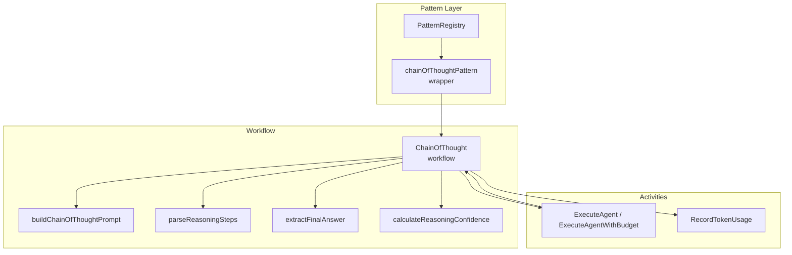
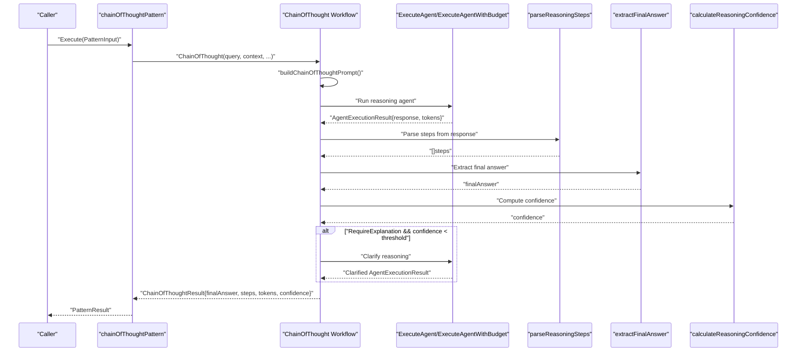
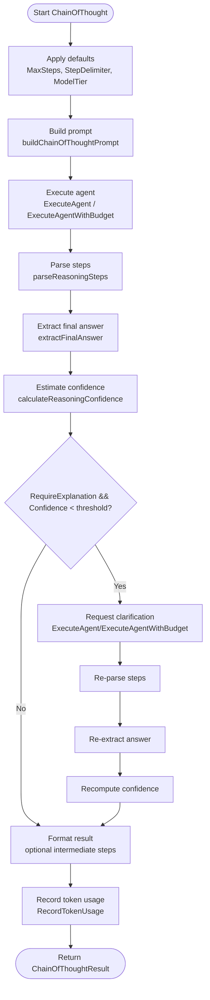
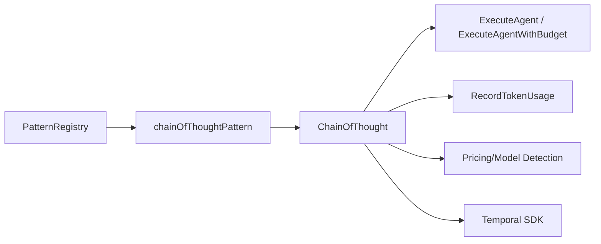

# Chain of Thought Pattern

<cite>
**Referenced Files in This Document**
- [chain_of_thought.go](file://go/orchestrator/internal/workflows/patterns/chain_of_thought.go)
- [wrappers.go](file://go/orchestrator/internal/workflows/patterns/wrappers.go)
- [registry.go](file://go/orchestrator/internal/workflows/patterns/registry.go)
- [options.go](file://go/orchestrator/internal/workflows/patterns/options.go)
- [degrade.go](file://go/orchestrator/internal/workflows/patterns/degrade.go)
- [patterns_exec_test.go](file://go/orchestrator/internal/workflows/patterns/patterns_exec_test.go)
</cite>

## Table of Contents
1. [Introduction](#introduction)
2. [Project Structure](#project-structure)
3. [Core Components](#core-components)
4. [Architecture Overview](#architecture-overview)
5. [Detailed Component Analysis](#detailed-component-analysis)
6. [Dependency Analysis](#dependency-analysis)
7. [Performance Considerations](#performance-considerations)
8. [Troubleshooting Guide](#troubleshooting-guide)
9. [Conclusion](#conclusion)

## Introduction
This document explains the Chain of Thought pattern in Shannon’s multi-agent orchestration system. It focuses on how the pattern decomposes complex problems into explicit, sequential reasoning steps, generates intermediate conclusions, and demonstrates logical progression. The pattern supports configurable prompts, step delimiters, optional clarification loops, and confidence scoring to validate reasoning quality. It also integrates with the broader pattern registry and budget-aware execution to support scalable, cost-conscious reasoning workflows.

## Project Structure
The Chain of Thought pattern is implemented as a Temporal workflow that orchestrates agent activities, parses structured reasoning from model outputs, and optionally refines results when confidence is low. Supporting components include:
- Pattern wrapper that exposes Chain of Thought via the shared Pattern interface
- Registry that discovers and selects patterns
- Options and configuration structures for execution
- Degradation thresholds that adapt complexity under budget constraints
- Tests validating end-to-end execution and parsing

**Diagram sources**
- [wrappers.go](file://go/orchestrator/internal/workflows/patterns/wrappers.go#L53-L81)
- [registry.go](file://go/orchestrator/internal/workflows/patterns/registry.go#L172-L189)
- [chain_of_thought.go](file://go/orchestrator/internal/workflows/patterns/chain_of_thought.go#L38-L295)
- [options.go](file://go/orchestrator/internal/workflows/patterns/options.go#L4-L11)

**Section sources**
- [chain_of_thought.go](file://go/orchestrator/internal/workflows/patterns/chain_of_thought.go#L1-L433)
- [wrappers.go](file://go/orchestrator/internal/workflows/patterns/wrappers.go#L1-L264)
- [registry.go](file://go/orchestrator/internal/workflows/patterns/registry.go#L1-L190)
- [options.go](file://go/orchestrator/internal/workflows/patterns/options.go#L1-L21)

## Core Components
- ChainOfThoughtConfig: Controls maximum reasoning steps, whether to require explanations, whether to include intermediate steps in the final result, a custom prompt template, step delimiter, and model tier.
- ChainOfThoughtResult: Aggregates the final answer, ordered reasoning steps, total tokens consumed, confidence score, and per-step durations.
- ChainOfThought workflow: Orchestrates prompting, agent execution, parsing, confidence calculation, optional clarification, and token accounting.
- Wrapper chainOfThoughtPattern: Bridges the standalone ChainOfThought function into the shared Pattern interface for selection and execution.
- PatternRegistry: Registers and selects patterns, including Chain of Thought.
- Options: Provides per-execution configuration such as per-agent budget, session/user identifiers, model tier, and context.

Key behaviors:
- Prompt building with a default step-by-step directive and a custom template override.
- Structured step extraction using explicit markers and fallback segmentation.
- Final answer extraction using explicit conclusion markers and fallback heuristics.
- Confidence estimation based on step count, logical connectors, structure, and conclusion presence.
- Optional clarification loop when confidence is below a threshold.

**Section sources**
- [chain_of_thought.go](file://go/orchestrator/internal/workflows/patterns/chain_of_thought.go#L17-L34)
- [chain_of_thought.go](file://go/orchestrator/internal/workflows/patterns/chain_of_thought.go#L38-L295)
- [wrappers.go](file://go/orchestrator/internal/workflows/patterns/wrappers.go#L53-L81)
- [registry.go](file://go/orchestrator/internal/workflows/patterns/registry.go#L11-L48)
- [options.go](file://go/orchestrator/internal/workflows/patterns/options.go#L4-L21)

## Architecture Overview
The Chain of Thought pattern executes within a Temporal workflow. It builds a reasoning prompt, invokes an agent activity (optionally budgeted), parses the response into steps and a final answer, computes confidence, and optionally requests clarification. Token usage is recorded for billing and observability.

**Diagram sources**
- [wrappers.go](file://go/orchestrator/internal/workflows/patterns/wrappers.go#L69-L81)
- [chain_of_thought.go](file://go/orchestrator/internal/workflows/patterns/chain_of_thought.go#L38-L295)

## Detailed Component Analysis

### ChainOfThought Workflow
Responsibilities:
- Configure defaults for missing fields (max steps, delimiter, model tier).
- Construct a reasoning prompt tailored to step-by-step analysis.
- Execute the agent either with or without a per-agent token budget.
- Record token usage when not using budgeted execution.
- Parse structured reasoning steps and extract the final answer.
- Compute confidence based on step quality and logical markers.
- Optionally request clarification if confidence is low and explanation is required.
- Format the final result according to configuration (including intermediate steps).

**Diagram sources**
- [chain_of_thought.go](file://go/orchestrator/internal/workflows/patterns/chain_of_thought.go#L38-L295)

**Section sources**
- [chain_of_thought.go](file://go/orchestrator/internal/workflows/patterns/chain_of_thought.go#L38-L295)

### Prompt Construction
- Default prompt encourages step-by-step thinking and uses a specific delimiter marker.
- Custom template can replace the default prompt while substituting the query placeholder.

**Section sources**
- [chain_of_thought.go](file://go/orchestrator/internal/workflows/patterns/chain_of_thought.go#L297-L317)

### Step Parsing and Final Answer Extraction
- Step detection recognizes explicit markers (delimited markers, numbered lists, bullet points).
- Fallback segmentation splits on sentence boundaries when explicit markers are absent.
- Final answer extraction prioritizes explicit conclusion markers, otherwise falls back to last step or last paragraph.

**Section sources**
- [chain_of_thought.go](file://go/orchestrator/internal/workflows/patterns/chain_of_thought.go#L319-L390)

### Confidence Estimation
- Confidence increases with more steps, presence of logical connectors, structured formatting, and explicit conclusion markers.
- Caps confidence at 1.0.

**Section sources**
- [chain_of_thought.go](file://go/orchestrator/internal/workflows/patterns/chain_of_thought.go#L392-L432)

### Pattern Wrapper and Registry Integration
- The wrapper satisfies the shared Pattern interface, enabling selection and uniform execution semantics.
- The registry registers Chain of Thought alongside other patterns and supports selection strategies.

**Section sources**
- [wrappers.go](file://go/orchestrator/internal/workflows/patterns/wrappers.go#L53-L81)
- [registry.go](file://go/orchestrator/internal/workflows/patterns/registry.go#L172-L189)

### Budget-Aware Execution and Token Accounting
- When a per-agent budget is provided, the workflow uses a budgeted agent execution activity.
- Token usage is recorded for both the primary reasoning and optional clarification steps when not using budgets.
- Degradation thresholds and chains reduce complexity when budgets are tight.

**Section sources**
- [chain_of_thought.go](file://go/orchestrator/internal/workflows/patterns/chain_of_thought.go#L89-L181)
- [chain_of_thought.go](file://go/orchestrator/internal/workflows/patterns/chain_of_thought.go#L203-L274)
- [degrade.go](file://go/orchestrator/internal/workflows/patterns/degrade.go#L30-L59)

### Example: End-to-End Execution
- A test workflow demonstrates invoking ChainOfThought with a simple prompt and verifying that a final answer is extracted from a response containing an explicit conclusion marker.

**Section sources**
- [patterns_exec_test.go](file://go/orchestrator/internal/workflows/patterns/patterns_exec_test.go#L63-L98)

## Dependency Analysis
The Chain of Thought pattern depends on:
- Activity layer for agent execution and token recording
- Pricing and model detection utilities for accurate token accounting
- Temporal SDK for workflow orchestration and retry/backoff
- Pattern registry for discoverability and selection

**Diagram sources**
- [chain_of_thought.go](file://go/orchestrator/internal/workflows/patterns/chain_of_thought.go#L89-L181)
- [wrappers.go](file://go/orchestrator/internal/workflows/patterns/wrappers.go#L69-L81)
- [registry.go](file://go/orchestrator/internal/workflows/patterns/registry.go#L172-L189)

**Section sources**
- [chain_of_thought.go](file://go/orchestrator/internal/workflows/patterns/chain_of_thought.go#L3-L15)
- [wrappers.go](file://go/orchestrator/internal/workflows/patterns/wrappers.go#L1-L12)
- [registry.go](file://go/orchestrator/internal/workflows/patterns/registry.go#L1-L10)

## Performance Considerations
- Token budgeting: Prefer budgeted agent execution when throughput and cost control are priorities. This reduces repeated token recording overhead and centralizes usage tracking.
- Confidence-driven refinement: The optional clarification loop adds compute and token costs. Enable RequireExplanation only when higher-quality reasoning is essential.
- Delimiter and prompt choices: Using concise delimiters and focused templates can reduce token consumption without sacrificing clarity.
- Degradation thresholds: When budgets are constrained, the system can automatically downgrade to simpler patterns, preserving system responsiveness.

[No sources needed since this section provides general guidance]

## Troubleshooting Guide
Common issues and remedies:
- No structured steps detected: Ensure the model response includes clear step markers or sentence boundaries. Consider customizing the prompt template or delimiter.
- Final answer not extracted: Add explicit conclusion markers to the prompt or adjust parsing heuristics.
- Low confidence: Enable RequireExplanation to trigger the clarification loop. Review the reasoning steps for logical gaps.
- Token accounting discrepancies: When not using budgets, token recording relies on heuristics; verify model/provider detection and ensure metadata tagging is present.

**Section sources**
- [chain_of_thought.go](file://go/orchestrator/internal/workflows/patterns/chain_of_thought.go#L194-L276)
- [chain_of_thought.go](file://go/orchestrator/internal/workflows/patterns/chain_of_thought.go#L319-L390)
- [chain_of_thought.go](file://go/orchestrator/internal/workflows/patterns/chain_of_thought.go#L145-L181)

## Conclusion
The Chain of Thought pattern in Shannon provides a robust, configurable framework for multi-step reasoning. By enforcing explicit step markers, extracting structured conclusions, and estimating confidence, it enables transparent, auditable solutions. Integration with the pattern registry, budget-aware execution, and optional clarification ensures scalability and quality across diverse workloads.