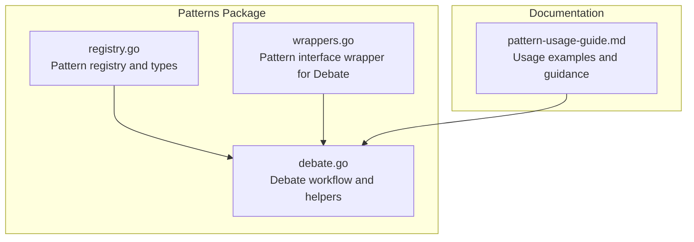
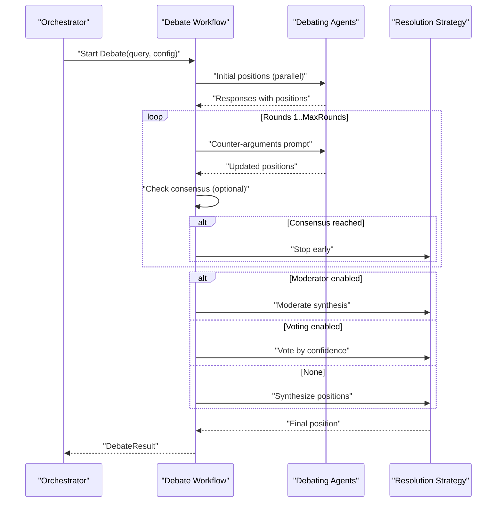
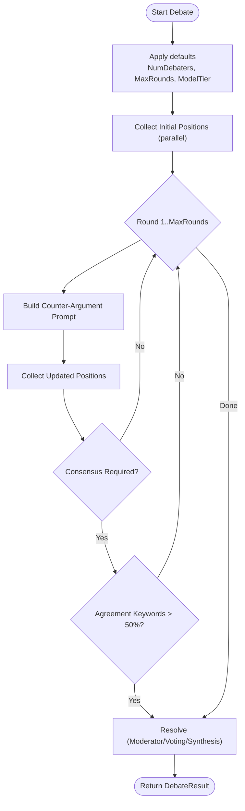
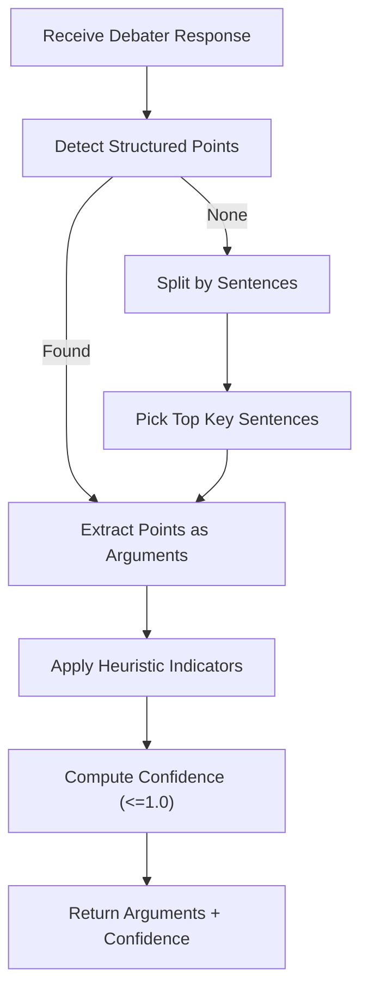
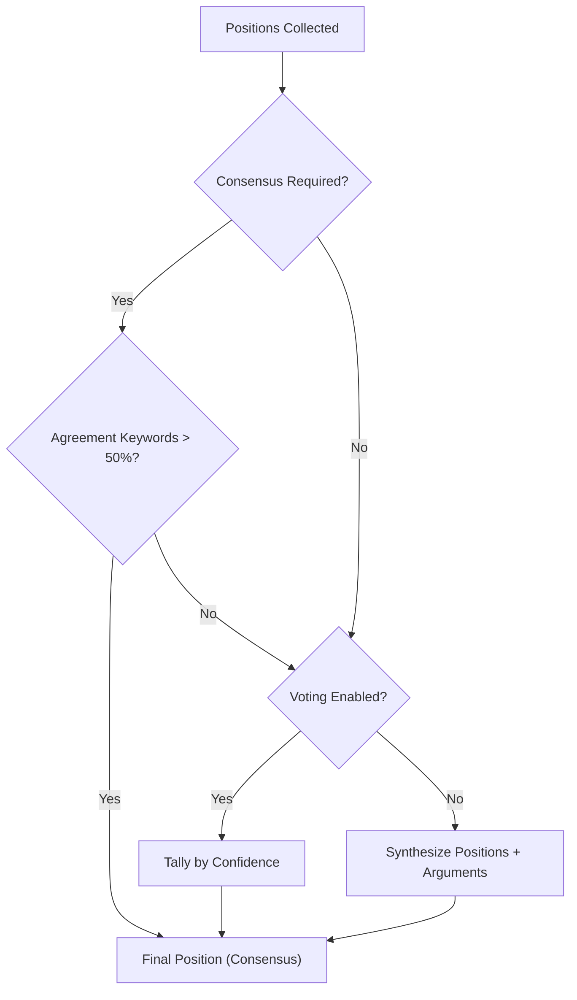
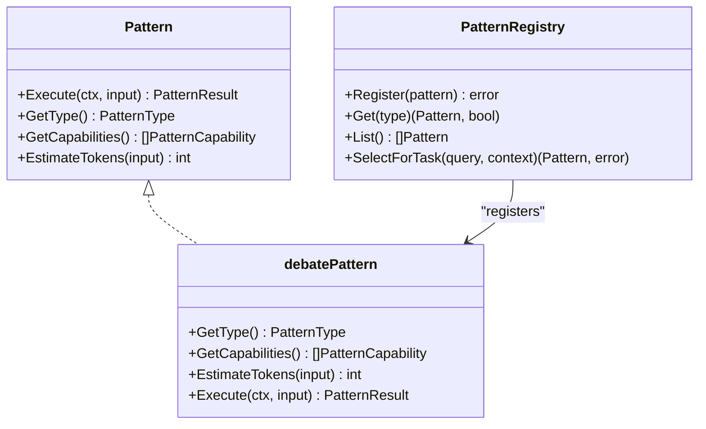
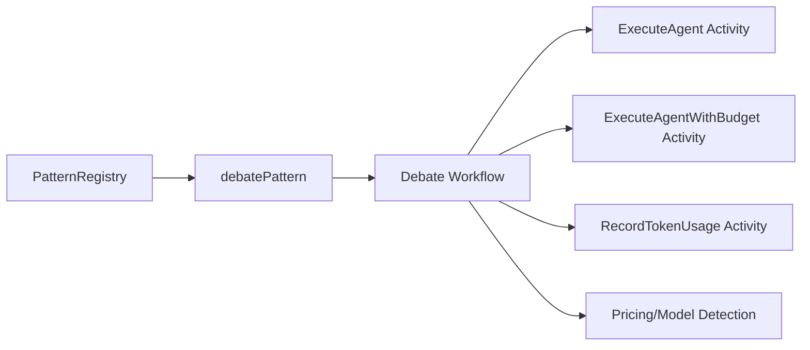

# Debate Pattern

<cite>
**Referenced Files in This Document**
- [debate.go](file://go/orchestrator/internal/workflows/patterns/debate.go)
- [registry.go](file://go/orchestrator/internal/workflows/patterns/registry.go)
- [wrappers.go](file://go/orchestrator/internal/workflows/patterns/wrappers.go)
- [pattern-usage-guide.md](file://docs/pattern-usage-guide.md)
</cite>

## Table of Contents
1. [Introduction](#introduction)
2. [Project Structure](#project-structure)
3. [Core Components](#core-components)
4. [Architecture Overview](#architecture-overview)
5. [Detailed Component Analysis](#detailed-component-analysis)
6. [Dependency Analysis](#dependency-analysis)
7. [Performance Considerations](#performance-considerations)
8. [Troubleshooting Guide](#troubleshooting-guide)
9. [Conclusion](#conclusion)
10. [Appendices](#appendices)

## Introduction
The Debate pattern in Shannon’s multi-agent orchestration system enables structured, adversarial reasoning across multiple perspectives. It coordinates a group of agents to present competing viewpoints, engage in iterative counter-argumentation, and converge toward a synthesized conclusion or explicit consensus. The pattern supports configurable debate mechanics, argument validation heuristics, and multiple resolution strategies (moderation, voting, or synthesis), making it ideal for controversial topics, decisions under uncertainty, and balanced, evidence-based reasoning.

## Project Structure
The Debate pattern is implemented as a Temporal workflow with supporting utilities and is integrated into the pattern registry and wrapper interface used by higher-level workflows.

**Diagram sources**
- [debate.go](file://go/orchestrator/internal/workflows/patterns/debate.go#L1-L644)
- [registry.go](file://go/orchestrator/internal/workflows/patterns/registry.go#L1-L190)
- [wrappers.go](file://go/orchestrator/internal/workflows/patterns/wrappers.go#L1-L264)
- [pattern-usage-guide.md](file://docs/pattern-usage-guide.md#L42-L84)

**Section sources**
- [debate.go](file://go/orchestrator/internal/workflows/patterns/debate.go#L1-L644)
- [registry.go](file://go/orchestrator/internal/workflows/patterns/registry.go#L1-L190)
- [wrappers.go](file://go/orchestrator/internal/workflows/patterns/wrappers.go#L1-L264)
- [pattern-usage-guide.md](file://docs/pattern-usage-guide.md#L42-L84)

## Core Components
- DebateConfig: Controls number of debaters, maximum rounds, assigned perspectives, consensus requirement, moderator/voting modes, and model tier.
- DebateResult: Aggregates final position, individual positions with arguments and confidence, consensus flag, total tokens, rounds executed, winning argument, and vote distribution.
- DebatePosition: Captures an agent’s position, supporting arguments extracted from the response, confidence score, and tokens used.
- Debate workflow: Executes initial position collection, iterative rounds of counter-argumentation, optional consensus checks, and resolution via moderation, voting, or synthesis.

Key behaviors:
- Perspective assignment and default generation for balanced viewpoints.
- Argument extraction and confidence scoring based on textual indicators.
- Optional consensus detection and early termination.
- Resolution strategies: moderator synthesis, voting by confidence, or synthesis of positions.
- Token accounting and optional budget enforcement per activity.

**Section sources**
- [debate.go](file://go/orchestrator/internal/workflows/patterns/debate.go#L17-L47)
- [debate.go](file://go/orchestrator/internal/workflows/patterns/debate.go#L48-L473)

## Architecture Overview
The Debate pattern is orchestrated as a Temporal workflow that:
- Spawns parallel debates for initial positions.
- Iteratively collects counter-arguments and strengthens positions.
- Applies optional consensus checks and resolution strategies.
- Persists debate outcomes for learning and future reuse.

**Diagram sources**
- [debate.go](file://go/orchestrator/internal/workflows/patterns/debate.go#L48-L473)

## Detailed Component Analysis

### DebateConfig and DebateResult
- DebateConfig fields:
  - NumDebaters: 2–5 for manageable adversarial dynamics.
  - MaxRounds: Upper bound on iterative refinement.
  - Perspectives: Explicitly provided or auto-generated defaults.
  - RequireConsensus: Enables early exit upon agreement keywords.
  - ModeratorEnabled/VotingEnabled: Alternative resolution strategies.
  - ModelTier: Determines model selection for agent calls.
- DebateResult fields:
  - FinalPosition, Positions, ConsensusReached, TotalTokens, Rounds, WinningArgument, Votes.

**Section sources**
- [debate.go](file://go/orchestrator/internal/workflows/patterns/debate.go#L17-L47)

### Debate Mechanics: Initial Positions and Rounds
- Initial positions:
  - Parallel execution of agent prompts tailored to assigned perspectives.
  - Persuasive initial framing to encourage strong, structured positions.
- Round-based iteration:
  - Each agent receives a prompt synthesizing other positions and asked to counter-argue, reinforce stance, and seek common ground.
  - Debate history and other positions are included to maintain context.
- Consensus:
  - Early termination when agreement keywords exceed a simple majority threshold.

**Diagram sources**
- [debate.go](file://go/orchestrator/internal/workflows/patterns/debate.go#L96-L405)

**Section sources**
- [debate.go](file://go/orchestrator/internal/workflows/patterns/debate.go#L96-L405)

### Argument Validation and Confidence Estimation
- Argument extraction:
  - Detects structured bullet/numbered points and falls back to sentence-based key points.
- Confidence estimation:
  - Heuristic scoring based on presence of evidence indicators, logical connectors, acknowledgment of counter-arguments, and specific examples.
  - Strength capped at 1.0.

**Diagram sources**
- [debate.go](file://go/orchestrator/internal/workflows/patterns/debate.go#L491-L561)

**Section sources**
- [debate.go](file://go/orchestrator/internal/workflows/patterns/debate.go#L491-L561)

### Consensus-Building Strategies
- Consensus detection:
  - Majority agreement keywords trigger early termination.
- Resolution strategies:
  - Moderator synthesis: a synthesis function aggregates positions and arguments.
  - Voting: simple tally by normalized confidence yields a winner and vote map.
  - Synthesis fallback: builds a combined narrative from strongest position and top arguments.

**Diagram sources**
- [debate.go](file://go/orchestrator/internal/workflows/patterns/debate.go#L563-L643)

**Section sources**
- [debate.go](file://go/orchestrator/internal/workflows/patterns/debate.go#L563-L643)

### Integration with Pattern Registry and Wrapper
- Pattern registration:
  - Debate is registered as a pattern type and associated capabilities (multi-perspective, conflict resolution, consensus building).
- Wrapper:
  - debatePattern implements the Pattern interface, translating generic PatternInput to DebateConfig and invoking the Debate workflow.
  - Provides token estimation and returns a standardized PatternResult.

**Diagram sources**
- [registry.go](file://go/orchestrator/internal/workflows/patterns/registry.go#L35-L79)
- [wrappers.go](file://go/orchestrator/internal/workflows/patterns/wrappers.go#L83-L111)

**Section sources**
- [registry.go](file://go/orchestrator/internal/workflows/patterns/registry.go#L110-L189)
- [wrappers.go](file://go/orchestrator/internal/workflows/patterns/wrappers.go#L83-L111)

### Usage Examples and Balanced Argumentation
- Example configuration demonstrates assigning distinct perspectives, enabling voting or moderation, and setting rounds.
- The documented flow illustrates initial positions, counter-arguments, and a synthesized conclusion.

Practical tips:
- Choose NumDebaters based on complexity and desired balance.
- Use RequireConsensus for mandatory alignment; otherwise, rely on synthesis or voting.
- Prefer ModeratorEnabled when authoritative synthesis is preferred; enable VotingEnabled for distributed decision-making.

**Section sources**
- [pattern-usage-guide.md](file://docs/pattern-usage-guide.md#L42-L84)

## Dependency Analysis
- Internal dependencies:
  - Debate workflow depends on activities for agent execution and token recording.
  - Uses pricing and model detection utilities for accurate token accounting when not budgeted.
  - Maintains debate history and context propagation across rounds.
- Registry and wrapper:
  - debatePattern integrates Debate into the Pattern interface, enabling selection and standardized execution.

**Diagram sources**
- [debate.go](file://go/orchestrator/internal/workflows/patterns/debate.go#L125-L176)
- [debate.go](file://go/orchestrator/internal/workflows/patterns/debate.go#L225-L237)
- [debate.go](file://go/orchestrator/internal/workflows/patterns/debate.go#L355-L391)
- [wrappers.go](file://go/orchestrator/internal/workflows/patterns/wrappers.go#L99-L111)
- [registry.go](file://go/orchestrator/internal/workflows/patterns/registry.go#L179-L189)

**Section sources**
- [debate.go](file://go/orchestrator/internal/workflows/patterns/debate.go#L125-L176)
- [debate.go](file://go/orchestrator/internal/workflows/patterns/debate.go#L225-L237)
- [debate.go](file://go/orchestrator/internal/workflows/patterns/debate.go#L355-L391)
- [wrappers.go](file://go/orchestrator/internal/workflows/patterns/wrappers.go#L99-L111)
- [registry.go](file://go/orchestrator/internal/workflows/patterns/registry.go#L179-L189)

## Performance Considerations
- Parallelization:
  - Initial positions and round responses are executed in parallel to reduce latency.
- Budgeting:
  - Optional budgeted agent execution limits tokens per agent and per round.
- Token accounting:
  - When not budgeted, token usage is inferred and recorded per phase (initial, rounds) for observability.
- Convergence:
  - Early exit on consensus reduces unnecessary computation.
- Model tier selection:
  - Configurable model tier influences cost and capability; choose appropriately for debate complexity.

[No sources needed since this section provides general guidance]

## Troubleshooting Guide
Common issues and remedies:
- Agents fail to provide initial positions:
  - Review agent prompts and context injection; ensure perspective and role keys are present.
- Debate does not converge:
  - Increase MaxRounds or disable RequireConsensus to allow synthesis.
  - Verify argument extraction and confidence scoring heuristics align with expected outputs.
- Excessive token usage:
  - Reduce NumDebaters or MaxRounds; enable budgeting; cap model tier.
- Poor quality resolutions:
  - Enable ModeratorEnabled for authoritative synthesis or VotingEnabled for distributed decision-making.
  - Add Reflection after Debate to improve quality when needed.

**Section sources**
- [debate.go](file://go/orchestrator/internal/workflows/patterns/debate.go#L180-L238)
- [debate.go](file://go/orchestrator/internal/workflows/patterns/debate.go#L332-L392)
- [pattern-usage-guide.md](file://docs/pattern-usage-guide.md#L392-L410)

## Conclusion
The Debate pattern in Shannon provides a robust framework for multi-perspective reasoning through adversarial yet structured argumentation. By combining parallel initial positions, iterative counter-argumentation, and configurable resolution strategies, it supports nuanced decision-making and balanced conclusions. With argument validation and confidence scoring, it offers both process transparency and quality signals, while integration with the pattern registry ensures seamless composition with other cognitive patterns.

[No sources needed since this section summarizes without analyzing specific files]

## Appendices

### Example Topics and Balanced Argumentation
- Controversial topics suitable for Debate:
  - Technology adoption decisions (e.g., migrating to microservices).
  - Policy trade-offs (e.g., privacy vs. security measures).
  - Strategic initiatives (e.g., market expansion vs. consolidation).
- Balanced argumentation:
  - Assign diverse perspectives (optimistic, skeptical, pragmatic, innovative, conservative).
  - Encourage explicit counter-arguments and common-ground identification.
  - Use evidence indicators and logical structure to strengthen positions.

**Section sources**
- [pattern-usage-guide.md](file://docs/pattern-usage-guide.md#L46-L84)
- [debate.go](file://go/orchestrator/internal/workflows/patterns/debate.go#L475-L489)