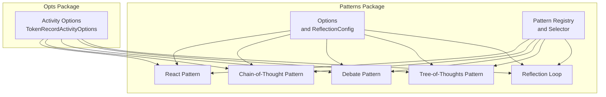
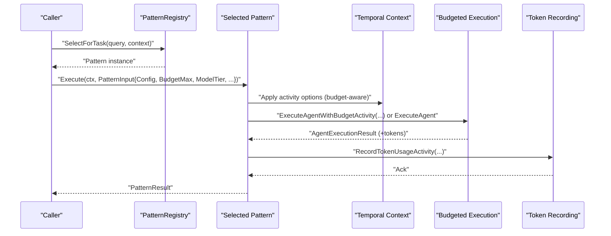
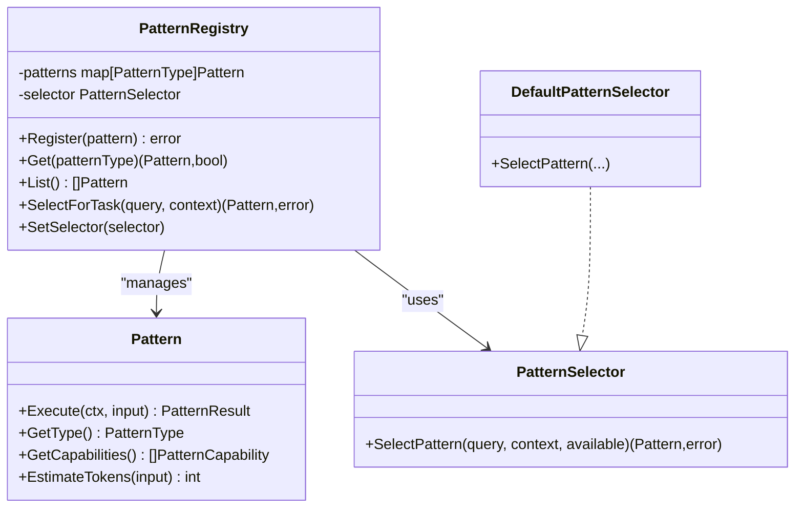
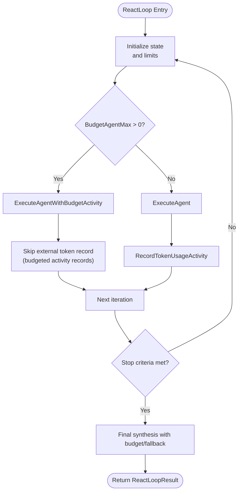
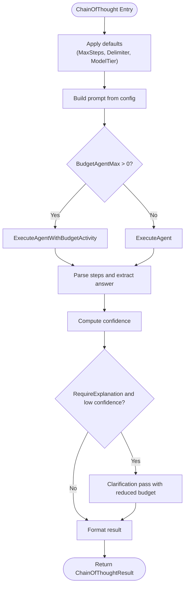
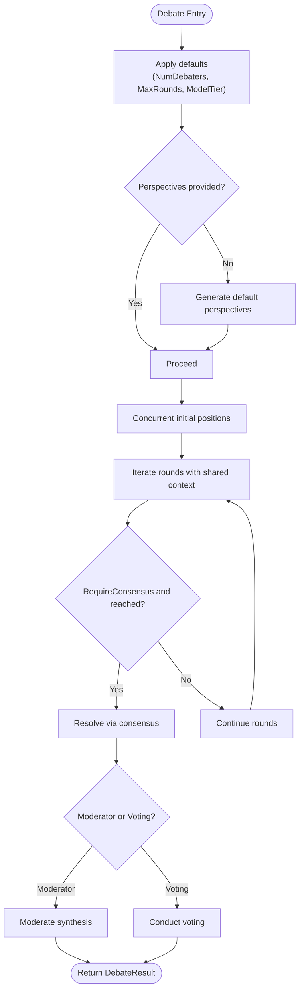
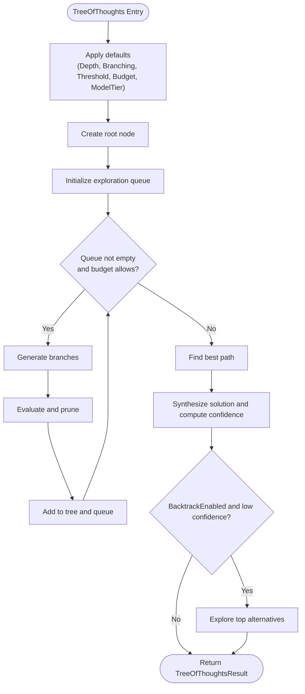
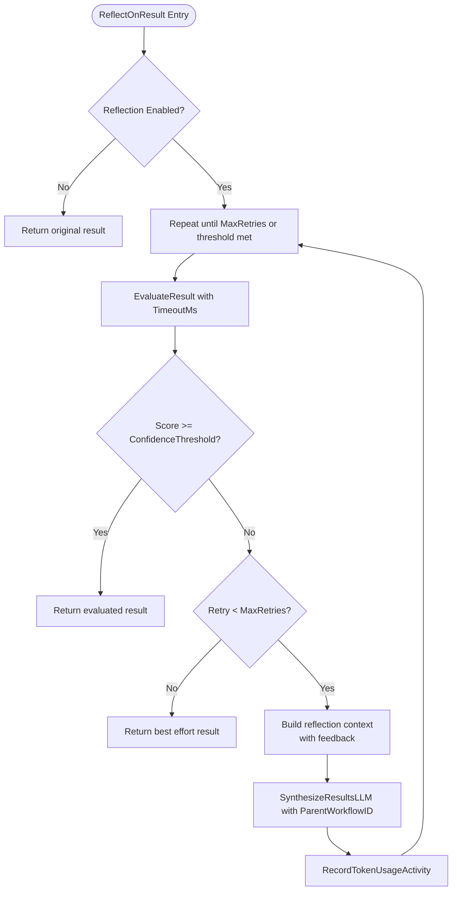
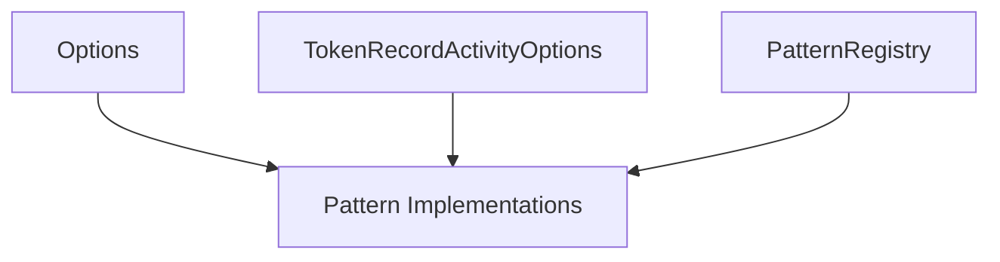

# Pattern Options and Configuration

<cite>
**Referenced Files in This Document**
- [options.go](file://go/orchestrator/internal/workflows/patterns/options.go)
- [opts.go](file://go/orchestrator/internal/workflows/opts/opts.go)
- [registry.go](file://go/orchestrator/internal/workflows/patterns/registry.go)
- [reflection.go](file://go/orchestrator/internal/workflows/patterns/reflection.go)
- [react.go](file://go/orchestrator/internal/workflows/patterns/react.go)
- [chain_of_thought.go](file://go/orchestrator/internal/workflows/patterns/chain_of_thought.go)
- [debate.go](file://go/orchestrator/internal/workflows/patterns/debate.go)
- [tree_of_thoughts.go](file://go/orchestrator/internal/workflows/patterns/tree_of_thoughts.go)
</cite>

## Table of Contents
1. [Introduction](#introduction)
2. [Project Structure](#project-structure)
3. [Core Components](#core-components)
4. [Architecture Overview](#architecture-overview)
5. [Detailed Component Analysis](#detailed-component-analysis)
6. [Dependency Analysis](#dependency-analysis)
7. [Performance Considerations](#performance-considerations)
8. [Troubleshooting Guide](#troubleshooting-guide)
9. [Conclusion](#conclusion)

## Introduction
This document explains how pattern options and configuration work in Shannon’s workflow system. It focuses on the PatternOptions structure, runtime configuration options, parameter validation, and how patterns can be customized via configuration parameters, option inheritance, and dynamic adjustments. It also details the relationship between pattern options and resource management, including budget allocation, timeout settings, and performance tuning.

## Project Structure
The pattern configuration and execution logic resides under the Go orchestrator’s workflow subsystem. Key areas:
- Pattern options and shared configuration live in the patterns package.
- Runtime activity options (e.g., timeouts and retries) are centralized in the opts package.
- Patterns are registered and selected via a registry abstraction.
- Individual pattern implementations consume options and apply configuration to control behavior, budgeting, and resource usage.

**Diagram sources**
- [options.go](file://go/orchestrator/internal/workflows/patterns/options.go#L1-L21)
- [opts.go](file://go/orchestrator/internal/workflows/opts/opts.go#L1-L23)
- [registry.go](file://go/orchestrator/internal/workflows/patterns/registry.go#L1-L190)
- [react.go](file://go/orchestrator/internal/workflows/patterns/react.go#L1-L905)
- [chain_of_thought.go](file://go/orchestrator/internal/workflows/patterns/chain_of_thought.go#L1-L433)
- [debate.go](file://go/orchestrator/internal/workflows/patterns/debate.go#L1-L644)
- [tree_of_thoughts.go](file://go/orchestrator/internal/workflows/patterns/tree_of_thoughts.go#L1-L631)
- [reflection.go](file://go/orchestrator/internal/workflows/patterns/reflection.go#L1-L170)

**Section sources**
- [options.go](file://go/orchestrator/internal/workflows/patterns/options.go#L1-L21)
- [opts.go](file://go/orchestrator/internal/workflows/opts/opts.go#L1-L23)
- [registry.go](file://go/orchestrator/internal/workflows/patterns/registry.go#L1-L190)

## Core Components
- Pattern Options
  - Options: Shared runtime configuration consumed by patterns, including per-agent token budget, session and user identifiers, event emission toggle, model tier, and arbitrary context.
  - ReflectionConfig: Controls iterative reflection behavior such as enabling reflection, max retries, confidence threshold, evaluation criteria, and per-attempt timeout.
- Runtime Activity Options
  - TokenRecordActivityOptions: Standardized activity options for token usage recording, including timeouts and retry policy.
  - WithTokenRecordOptions: Applies standardized options to a Temporal workflow context.
- Pattern Registry and Selection
  - Pattern interface and implementations define execution, capability reporting, and token estimation.
  - PatternInput and PatternResult define the contract for pattern execution and outputs.
  - PatternRegistry centralizes registration, selection, and strategy customization.

**Section sources**
- [options.go](file://go/orchestrator/internal/workflows/patterns/options.go#L3-L20)
- [opts.go](file://go/orchestrator/internal/workflows/opts/opts.go#L10-L21)
- [registry.go](file://go/orchestrator/internal/workflows/patterns/registry.go#L35-L78)

## Architecture Overview
The pattern execution pipeline integrates configuration, selection, and resource management:
- Configuration is provided via Options and pattern-specific configs (e.g., ReactConfig, ChainOfThoughtConfig, DebateConfig, TreeOfThoughtsConfig).
- Patterns inherit model tier and budget from Options and apply defaults when unspecified.
- Resource management is enforced through budgeted agent execution and token recording activities with standardized timeouts and retries.
- Reflection loop dynamically adjusts synthesis based on evaluation feedback and thresholds.

**Diagram sources**
- [registry.go](file://go/orchestrator/internal/workflows/patterns/registry.go#L162-L170)
- [react.go](file://go/orchestrator/internal/workflows/patterns/react.go#L150-L193)
- [chain_of_thought.go](file://go/orchestrator/internal/workflows/patterns/chain_of_thought.go#L88-L139)
- [debate.go](file://go/orchestrator/internal/workflows/patterns/debate.go#L125-L176)
- [tree_of_thoughts.go](file://go/orchestrator/internal/workflows/patterns/tree_of_thoughts.go#L273-L323)
- [opts.go](file://go/orchestrator/internal/workflows/opts/opts.go#L10-L21)

## Detailed Component Analysis

### Pattern Options and Configuration Types
- Options
  - Fields: BudgetAgentMax, SessionID, UserID, EmitEvents, ModelTier, Context.
  - Purpose: Provide shared runtime configuration to all patterns, including budgeting, identity, event emission, model tier, and additional context.
- ReflectionConfig
  - Fields: Enabled, MaxRetries, ConfidenceThreshold, Criteria, TimeoutMs.
  - Purpose: Control iterative reflection behavior, including evaluation thresholds and per-attempt timeouts.

**Section sources**
- [options.go](file://go/orchestrator/internal/workflows/patterns/options.go#L3-L20)

### Pattern Registry and Selection
- Pattern interface: Execute, GetType, GetCapabilities, EstimateTokens.
- PatternInput: Query, Context, History, SessionID, UserID, Config (pattern-specific), BudgetMax, ModelTier.
- PatternResult: Result, TokensUsed, Confidence, Metadata, AgentResults.
- PatternRegistry: Registration, retrieval, listing, selection, and selector replacement.
- DefaultPatternSelector: Heuristic-based selection with explicit pattern hint support.

**Diagram sources**
- [registry.go](file://go/orchestrator/internal/workflows/patterns/registry.go#L35-L108)

**Section sources**
- [registry.go](file://go/orchestrator/internal/workflows/patterns/registry.go#L35-L108)

### React Pattern Configuration and Budgeting
- ReactConfig: MaxIterations, MinIterations, ObservationWindow, MaxObservations, MaxThoughts, MaxActions.
- Behavior:
  - Iterative Reason-Act-Observe loop with configurable limits.
  - Optional budgeted execution per agent step; when enabled, token usage is recorded internally by the budgeted activity.
  - Token recording fallback when not budgeted, using standardized activity options.
  - Streaming events correlate to parent workflow ID when provided.
- Defaults and inheritance:
  - MinIterations defaults to 1 for backward compatibility.
  - ModelTier inherited from Options when not set in config.

**Diagram sources**
- [react.go](file://go/orchestrator/internal/workflows/patterns/react.go#L47-L702)
- [opts.go](file://go/orchestrator/internal/workflows/opts/opts.go#L10-L21)

**Section sources**
- [react.go](file://go/orchestrator/internal/workflows/patterns/react.go#L26-L45)
- [react.go](file://go/orchestrator/internal/workflows/patterns/react.go#L78-L81)
- [react.go](file://go/orchestrator/internal/workflows/patterns/react.go#L149-L193)
- [react.go](file://go/orchestrator/internal/workflows/patterns/react.go#L215-L253)
- [react.go](file://go/orchestrator/internal/workflows/patterns/react.go#L418-L466)
- [react.go](file://go/orchestrator/internal/workflows/patterns/react.go#L516-L554)
- [react.go](file://go/orchestrator/internal/workflows/patterns/react.go#L596-L648)
- [react.go](file://go/orchestrator/internal/workflows/patterns/react.go#L653-L691)

### Chain-of-Thought Pattern Configuration
- ChainOfThoughtConfig: MaxSteps, RequireExplanation, ShowIntermediateSteps, PromptTemplate, StepDelimiter, ModelTier.
- Behavior:
  - Builds a structured prompt and executes reasoning with optional budget.
  - Parses steps and extracts final answer; computes confidence heuristically.
  - Optional clarification pass when explanation quality is low.
- Defaults and inheritance:
  - MaxSteps defaults to 5; StepDelimiter defaults to a specific marker; ModelTier defaults to Options.ModelTier or a sensible fallback.

**Diagram sources**
- [chain_of_thought.go](file://go/orchestrator/internal/workflows/patterns/chain_of_thought.go#L36-L294)

**Section sources**
- [chain_of_thought.go](file://go/orchestrator/internal/workflows/patterns/chain_of_thought.go#L17-L25)
- [chain_of_thought.go](file://go/orchestrator/internal/workflows/patterns/chain_of_thought.go#L63-L75)
- [chain_of_thought.go](file://go/orchestrator/internal/workflows/patterns/chain_of_thought.go#L88-L139)
- [chain_of_thought.go](file://go/orchestrator/internal/workflows/patterns/chain_of_thought.go#L193-L276)
- [chain_of_thought.go](file://go/orchestrator/internal/workflows/patterns/chain_of_thought.go#L145-L181)

### Debate Pattern Configuration
- DebateConfig: NumDebaters, MaxRounds, Perspectives, RequireConsensus, ModeratorEnabled, VotingEnabled, ModelTier.
- Behavior:
  - Initializes positions concurrently across debaters.
  - Conducts rounds of responses with shared context and debate history.
  - Supports consensus detection, moderator synthesis, or voting resolution.
  - Records token usage per stage when not budgeted.
- Defaults and inheritance:
  - Debaters capped at 5; MaxRounds defaults to 3; ModelTier defaults to Options.ModelTier or a sensible fallback.

**Diagram sources**
- [debate.go](file://go/orchestrator/internal/workflows/patterns/debate.go#L48-L472)

**Section sources**
- [debate.go](file://go/orchestrator/internal/workflows/patterns/debate.go#L17-L26)
- [debate.go](file://go/orchestrator/internal/workflows/patterns/debate.go#L66-L81)
- [debate.go](file://go/orchestrator/internal/workflows/patterns/debate.go#L125-L176)
- [debate.go](file://go/orchestrator/internal/workflows/patterns/debate.go#L201-L237)
- [debate.go](file://go/orchestrator/internal/workflows/patterns/debate.go#L277-L328)
- [debate.go](file://go/orchestrator/internal/workflows/patterns/debate.go#L355-L391)

### Tree-of-Thoughts Pattern Configuration
- TreeOfThoughtsConfig: MaxDepth, BranchingFactor, EvaluationMethod, PruningThreshold, ExplorationBudget, BacktrackEnabled, ModelTier.
- Behavior:
  - Explores a branching thought tree up to a depth limit and budget.
  - Generates branches, evaluates nodes, prunes low-scoring paths, and optionally backtracks to higher-confidence alternatives.
  - Computes confidence and synthesizes a final solution from the best path.
- Defaults and inheritance:
  - MaxDepth defaults to 3; BranchingFactor capped at 4; PruningThreshold defaults to 0.3; ExplorationBudget defaults to 15; ModelTier defaults to Options.ModelTier or a sensible fallback.

**Diagram sources**
- [tree_of_thoughts.go](file://go/orchestrator/internal/workflows/patterns/tree_of_thoughts.go#L52-L235)

**Section sources**
- [tree_of_thoughts.go](file://go/orchestrator/internal/workflows/patterns/tree_of_thoughts.go#L17-L26)
- [tree_of_thoughts.go](file://go/orchestrator/internal/workflows/patterns/tree_of_thoughts.go#L71-L95)
- [tree_of_thoughts.go](file://go/orchestrator/internal/workflows/patterns/tree_of_thoughts.go#L124-L195)
- [tree_of_thoughts.go](file://go/orchestrator/internal/workflows/patterns/tree_of_thoughts.go#L238-L374)
- [tree_of_thoughts.go](file://go/orchestrator/internal/workflows/patterns/tree_of_thoughts.go#L376-L429)
- [tree_of_thoughts.go](file://go/orchestrator/internal/workflows/patterns/tree_of_thoughts.go#L468-L502)

### Reflection Loop Configuration
- ReflectionConfig drives iterative evaluation and re-synthesis:
  - Enabled toggles reflection.
  - MaxRetries caps attempts.
  - ConfidenceThreshold determines acceptance.
  - Criteria define evaluation dimensions.
  - TimeoutMs controls per-evaluation activity timeout.
- Behavior:
  - Evaluates current result; if below threshold, builds reflection context and resynthesizes with feedback.
  - Records token usage for re-synthesis via standardized token recording activity.

**Diagram sources**
- [reflection.go](file://go/orchestrator/internal/workflows/patterns/reflection.go#L17-L168)

**Section sources**
- [reflection.go](file://go/orchestrator/internal/workflows/patterns/reflection.go#L13-L20)
- [reflection.go](file://go/orchestrator/internal/workflows/patterns/reflection.go#L41-L78)
- [reflection.go](file://go/orchestrator/internal/workflows/patterns/reflection.go#L93-L124)
- [reflection.go](file://go/orchestrator/internal/workflows/patterns/reflection.go#L148-L161)

## Dependency Analysis
- Coupling and Cohesion
  - Patterns depend on Options for budget, model tier, and identity; they also depend on standardized activity options for token recording.
  - Registry encapsulates pattern lifecycle and selection, reducing coupling between callers and implementations.
- External Dependencies
  - Temporal SDK for workflow execution, activity options, and retry policies.
  - Pricing and model utilities for model/provider inference when missing from results.
- Potential Circular Dependencies
  - None observed among the analyzed files; registry and patterns are cleanly separated.

**Diagram sources**
- [options.go](file://go/orchestrator/internal/workflows/patterns/options.go#L3-L20)
- [opts.go](file://go/orchestrator/internal/workflows/opts/opts.go#L10-L21)
- [registry.go](file://go/orchestrator/internal/workflows/patterns/registry.go#L71-L126)

**Section sources**
- [registry.go](file://go/orchestrator/internal/workflows/patterns/registry.go#L110-L126)
- [opts.go](file://go/orchestrator/internal/workflows/opts/opts.go#L10-L21)

## Performance Considerations
- Budget Allocation
  - Patterns support per-agent budget via Options.BudgetAgentMax. When enabled, budgeted execution is used, and token usage is recorded internally by the budgeted activity.
  - For multi-agent patterns (e.g., Debate), budgets can be divided across agents or rounds to constrain cost while maintaining parallelism.
- Timeout Settings
  - Activity options enforce strict StartToCloseTimeouts and retry policies for token recording and other activities, preventing runaway resource consumption.
- Model Tier Inheritance
  - Many patterns inherit ModelTier from Options when not explicitly configured, ensuring consistent pricing and performance characteristics across steps.
- Iterative Refinement
  - Reflection and clarification steps increase token usage; tune MaxRetries, ConfidenceThreshold, and budget accordingly to balance quality and cost.

[No sources needed since this section provides general guidance]

## Troubleshooting Guide
- Budget Not Applied
  - Verify Options.BudgetAgentMax is set and that patterns use budgeted execution paths.
  - Confirm token recording is not duplicated when budgeted execution already records usage.
- Excessive Token Usage
  - Reduce MaxIterations, MaxRounds, MaxDepth, or ExplorationBudget.
  - Enable pruning and backtracking judiciously.
  - Lower ModelTier or adjust per-step budgets.
- Reflection Not Triggering
  - Ensure ReflectionConfig.Enabled is true and ConfidenceThreshold is set appropriately.
  - Confirm TimeoutMs is sufficient for evaluation and synthesis activities.
- Streaming Correlation Issues
  - Provide ParentWorkflowID in context to correlate streaming events and token records across nested workflows.

**Section sources**
- [react.go](file://go/orchestrator/internal/workflows/patterns/react.go#L149-L193)
- [react.go](file://go/orchestrator/internal/workflows/patterns/react.go#L215-L253)
- [debate.go](file://go/orchestrator/internal/workflows/patterns/debate.go#L125-L176)
- [tree_of_thoughts.go](file://go/orchestrator/internal/workflows/patterns/tree_of_thoughts.go#L115-L118)
- [reflection.go](file://go/orchestrator/internal/workflows/patterns/reflection.go#L41-L78)

## Conclusion
Shannon’s pattern system provides a robust, configurable framework for multi-agent workflows. Options unify runtime configuration across patterns, while pattern-specific configs tailor behavior. Resource management is enforced through budgeting, standardized activity options, and token recording. Reflection and iterative refinement enable dynamic quality control. By leveraging defaults, inheritance, and careful budget allocation, operators can balance performance, cost, and quality across diverse use cases.